bm\_finalproject
================
Coco
12/7/2018

Read data
---------

stepwise
--------

``` r
full_model = lm(target_death_rate ~ ., data = num_df)
summary(full_model)

step_model <- stepAIC(full_model, direction = "both", 
                      trace = FALSE)
summary(step_model)
vif(step_model)
step_model<- update(step_model,.~.-avg_deaths_per_year)
step_model<- update(step_model,.~.-pop_est2015)
step_model<- update(step_model,.~.+black_high_ind*incidence_rate)
```

``` r
summary(step_model)
```

    ## 
    ## Call:
    ## lm(formula = target_death_rate ~ avg_ann_count + incidence_rate + 
    ##     poverty_percent + percent_married + pct_bach_deg25_over + 
    ##     pct_unemployed16_over + birth_rate + black_high_ind + incidence_rate:black_high_ind, 
    ##     data = num_df)
    ## 
    ## Residuals:
    ##     Min      1Q  Median      3Q     Max 
    ## -90.191 -11.355  -0.401  10.833 136.807 
    ## 
    ## Coefficients:
    ##                                 Estimate Std. Error t value Pr(>|t|)    
    ## (Intercept)                    1.209e+02  9.495e+00  12.728  < 2e-16 ***
    ## avg_ann_count                 -1.006e-03  3.064e-04  -3.285 0.001037 ** 
    ## incidence_rate                 1.957e-01  9.906e-03  19.755  < 2e-16 ***
    ## poverty_percent                3.592e-01  1.358e-01   2.644 0.008254 ** 
    ## percent_married               -2.428e-01  1.011e-01  -2.401 0.016435 *  
    ## pct_bach_deg25_over           -1.892e+00  1.058e-01 -17.884  < 2e-16 ***
    ## pct_unemployed16_over          6.693e-01  1.848e-01   3.622 0.000299 ***
    ## birth_rate                    -7.613e-01  2.181e-01  -3.491 0.000491 ***
    ## black_high_ind                 2.753e+01  9.161e+00   3.004 0.002692 ** 
    ## incidence_rate:black_high_ind -5.172e-02  1.998e-02  -2.588 0.009718 ** 
    ## ---
    ## Signif. codes:  0 '***' 0.001 '**' 0.01 '*' 0.05 '.' 0.1 ' ' 1
    ## 
    ## Residual standard error: 19.56 on 2082 degrees of freedom
    ## Multiple R-squared:  0.4182, Adjusted R-squared:  0.4157 
    ## F-statistic: 166.3 on 9 and 2082 DF,  p-value: < 2.2e-16

``` r
vif(step_model)
```

    ##                 avg_ann_count                incidence_rate 
    ##                      1.162779                      1.405796 
    ##               poverty_percent               percent_married 
    ##                      2.559924                      2.167521 
    ##           pct_bach_deg25_over         pct_unemployed16_over 
    ##                      1.696786                      1.681153 
    ##                    birth_rate                black_high_ind 
    ##                      1.060582                     86.027152 
    ## incidence_rate:black_high_ind 
    ##                     87.896436

Backward elimination
--------------------

``` r
back_model <- step(full_model, direction = "backward", trace=FALSE ) 
summary(back_model)
vif(back_model)
```

backward elimination suggest the same with stepwise

Forward elimination
-------------------

``` r
null<- lm(target_death_rate ~ 1, data = num_df)
for_model <- step(null, scope=list(lower=null, upper=full_model), direction="forward")
summary(for_model)
vif(for_model)
for_model<- update(for_model,.~.-avg_deaths_per_year)
for_model<- update(for_model,.~.-pop_est2015)
for_model<- update(for_model,.~.+black_high_ind*incidence_rate)
```

``` r
summary(for_model)
```

    ## 
    ## Call:
    ## lm(formula = target_death_rate ~ pct_bach_deg25_over + incidence_rate + 
    ##     percent_married + pct_unemployed16_over + black_high_ind + 
    ##     birth_rate + avg_ann_count + poverty_percent + incidence_rate:black_high_ind, 
    ##     data = num_df)
    ## 
    ## Residuals:
    ##     Min      1Q  Median      3Q     Max 
    ## -90.191 -11.355  -0.401  10.833 136.807 
    ## 
    ## Coefficients:
    ##                                 Estimate Std. Error t value Pr(>|t|)    
    ## (Intercept)                    1.209e+02  9.495e+00  12.728  < 2e-16 ***
    ## pct_bach_deg25_over           -1.892e+00  1.058e-01 -17.884  < 2e-16 ***
    ## incidence_rate                 1.957e-01  9.906e-03  19.755  < 2e-16 ***
    ## percent_married               -2.428e-01  1.011e-01  -2.401 0.016435 *  
    ## pct_unemployed16_over          6.693e-01  1.848e-01   3.622 0.000299 ***
    ## black_high_ind                 2.753e+01  9.161e+00   3.004 0.002692 ** 
    ## birth_rate                    -7.613e-01  2.181e-01  -3.491 0.000491 ***
    ## avg_ann_count                 -1.006e-03  3.064e-04  -3.285 0.001037 ** 
    ## poverty_percent                3.592e-01  1.358e-01   2.644 0.008254 ** 
    ## incidence_rate:black_high_ind -5.172e-02  1.998e-02  -2.588 0.009718 ** 
    ## ---
    ## Signif. codes:  0 '***' 0.001 '**' 0.01 '*' 0.05 '.' 0.1 ' ' 1
    ## 
    ## Residual standard error: 19.56 on 2082 degrees of freedom
    ## Multiple R-squared:  0.4182, Adjusted R-squared:  0.4157 
    ## F-statistic: 166.3 on 9 and 2082 DF,  p-value: < 2.2e-16

``` r
vif(for_model)
```

    ##           pct_bach_deg25_over                incidence_rate 
    ##                      1.696786                      1.405796 
    ##               percent_married         pct_unemployed16_over 
    ##                      2.167521                      1.681153 
    ##                black_high_ind                    birth_rate 
    ##                     86.027152                      1.060582 
    ##                 avg_ann_count               poverty_percent 
    ##                      1.162779                      2.559924 
    ## incidence_rate:black_high_ind 
    ##                     87.896436

<https://www.cancer.org/latest-news/facts-and-figures-2018-rate-of-deaths-from-cancer-continues-decline.html>

### Lasso Regression

``` r
# Try a grid of values for lambda: from 10^-2 to 10^5

grid <- 10^seq(5,-2, length=100)

Y <- num_df[,3]

X <- 
  model.matrix(target_death_rate ~ avg_ann_count + incidence_rate + poverty_percent + percent_married + pct_bach_deg25_over + pct_unemployed16_over + birth_rate + black_high_ind + incidence_rate*black_high_ind , data = num_df)

set.seed(1)

train<-sample(1:nrow(X),nrow(X)/2)

test<-(-train)

Y.test<-Y[test]


lasso1<- glmnet(X[train ,],Y[train], alpha =1, lambda =grid)

# Cross-validation
set.seed(2)
cv.out<-cv.glmnet(X[train,],Y[train])
plot(cv.out)
```

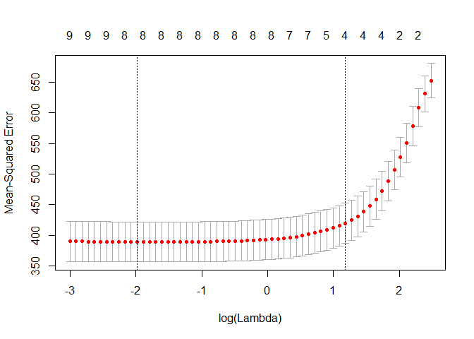

``` r
# Fit a Lasso model with all observations with the best lambda

best.lambda<-cv.out$lambda.min

lasso2<- glmnet(X[train ,],Y[train], alpha =1, lambda=best.lambda)
lasso.cv<- cv.glmnet(X[train ,],Y[train], alpha = 1)
coef(lasso.cv)
```

    ## 11 x 1 sparse Matrix of class "dgCMatrix"
    ##                                          1
    ## (Intercept)                   131.18870105
    ## (Intercept)                     .         
    ## avg_ann_count                   .         
    ## incidence_rate                  0.12630869
    ## poverty_percent                 0.36789827
    ## percent_married                -0.04694824
    ## pct_bach_deg25_over            -1.42718268
    ## pct_unemployed16_over           0.62956329
    ## birth_rate                      .         
    ## black_high_ind                  .         
    ## incidence_rate:black_high_ind   .

Outliers Using Studentized Residuals
------------------------------------

``` r
stu_res_step = rstandard(step_model)
outliers_y_step = stu_res_step[abs(stu_res_step) > 2.5]
outliers_y_step
```

    ##       116       119       122       124       189       264       282 
    ##  4.067644 -3.336312  3.072608 -3.224028 -2.530846 -2.711114 -5.047583 
    ##       466       469       476       514       522       597       621 
    ##  2.585126  2.703927 -2.526902 -2.930738  3.087443 -2.627179 -2.719680 
    ##       627       650       666       775       783       803       921 
    ##  3.750984 -3.313503  2.732608  3.108478 -3.140536 -2.684959 -3.162931 
    ##      1174      1217      1221      1290      1304      1331      1345 
    ##  2.562609  2.945357  7.014162 -2.704640 -2.637101 -2.844229 -2.829021 
    ##      1366      1445      1497      1942      1962      2066      2318 
    ##  6.082011 -2.953849  4.409083 -3.374819  2.509716 -2.712657 -2.657189 
    ##      2328      2353      2427      2440      2590      2600      2637 
    ## -2.755284 -2.699428 -2.501033 -3.054839  2.810697  3.539939  3.096698 
    ##      2646      2659      2714      2726      2727      3036 
    ## -4.632840 -4.198603  3.679421  3.889043  3.428899  2.721247

``` r
stu_res_back = rstandard(back_model)
outliers_y_back = stu_res_back[abs(stu_res_back) > 2.5]
outliers_y_back
```

    ##       116       119       122       124       264       282       466 
    ##  4.429086 -3.087604  3.409572 -2.969809 -2.504219 -5.536620  2.629991 
    ##       469       476       514       522       597       621       627 
    ##  2.649356 -2.642270 -2.759734  3.241725 -2.577617 -2.715107  3.644194 
    ##       650       666       775       783       803       921      1174 
    ## -3.362466  2.678954  3.190467 -3.259077 -2.695568 -3.202735  2.551606 
    ##      1217      1221      1331      1345      1366      1445      1497 
    ##  2.796832  6.965050 -2.612628 -2.606354  6.356507 -2.673548  4.388556 
    ##      1942      2066      2318      2328      2353      2440      2590 
    ## -3.532645 -2.655377 -2.668766 -2.834886 -2.771928 -2.769920  2.869076 
    ##      2600      2637      2646      2659      2714      2726      2727 
    ##  3.607012  3.055383 -4.563974 -4.250213  3.535576  4.008203  3.491002 
    ##      3034      3036 
    ##  2.568259  2.986786

``` r
stu_res_for = rstandard(for_model)
outliers_y_for = stu_res_for[abs(stu_res_for) > 2.5]
outliers_y_for
```

    ##       116       119       122       124       189       264       282 
    ##  4.067644 -3.336312  3.072608 -3.224028 -2.530846 -2.711114 -5.047583 
    ##       466       469       476       514       522       597       621 
    ##  2.585126  2.703927 -2.526902 -2.930738  3.087443 -2.627179 -2.719680 
    ##       627       650       666       775       783       803       921 
    ##  3.750984 -3.313503  2.732608  3.108478 -3.140536 -2.684959 -3.162931 
    ##      1174      1217      1221      1290      1304      1331      1345 
    ##  2.562609  2.945357  7.014162 -2.704640 -2.637101 -2.844229 -2.829021 
    ##      1366      1445      1497      1942      1962      2066      2318 
    ##  6.082011 -2.953849  4.409083 -3.374819  2.509716 -2.712657 -2.657189 
    ##      2328      2353      2427      2440      2590      2600      2637 
    ## -2.755284 -2.699428 -2.501033 -3.054839  2.810697  3.539939  3.096698 
    ##      2646      2659      2714      2726      2727      3036 
    ## -4.632840 -4.198603  3.679421  3.889043  3.428899  2.721247

Various Measures of Influence
-----------------------------

``` r
influence.measures(step_model)
```

    ## Influence measures of
    ##   lm(formula = target_death_rate ~ avg_ann_count + incidence_rate +      poverty_percent + percent_married + pct_bach_deg25_over +      pct_unemployed16_over + birth_rate + black_high_ind + incidence_rate:black_high_ind,      data = num_df) :
    ## 
    ##         dfb.1_  dfb.av__  dfb.inc_  dfb.pvr_  dfb.prc_  dfb.p__2  dfb.p_16
    ## 2     2.37e-03 -5.73e-03 -3.34e-03  4.89e-03 -5.29e-03  1.21e-02  6.05e-04
    ## 3     2.98e-02 -8.31e-03 -5.43e-02 -4.17e-03 -1.67e-05  5.39e-03  7.14e-03
    ## 4     3.09e-03 -1.02e-04 -6.54e-03 -6.65e-03  1.76e-03 -5.52e-03  1.99e-02
    ## 5    -5.93e-03  1.27e-03  1.16e-02  1.74e-03 -4.37e-04  4.95e-04  1.39e-03
    ## 6     9.60e-03  8.39e-03 -2.32e-02  1.82e-02  4.02e-03 -1.82e-03 -4.72e-02
    ## 7     1.99e-02 -3.56e-04 -8.02e-03 -2.72e-02 -1.82e-02 -1.22e-02 -5.51e-04
    ## 8     4.81e-03 -1.89e-03 -1.07e-02  8.14e-04  1.02e-04 -1.48e-03  6.44e-03
    ## 9    -1.25e-02 -9.15e-04  4.06e-03  1.26e-02  1.13e-02  7.70e-03  5.40e-03
    ## 13    2.48e-02 -1.15e-02 -3.18e-02 -2.49e-02 -6.51e-03 -4.61e-03  2.40e-02
    ## 14    4.08e-04 -2.19e-03 -1.43e-03  1.00e-03  3.82e-04 -9.19e-04 -9.99e-04
    ## 15   -1.31e-04  4.52e-03 -5.33e-04  1.87e-03 -1.27e-03  4.38e-03  2.32e-03
    ## 16    5.17e-03 -7.39e-04  2.65e-03 -7.05e-03 -9.52e-03 -1.61e-03 -4.48e-03
    ## 17    1.22e-03  7.87e-05 -1.85e-03  4.42e-04 -5.63e-06 -2.02e-03 -1.72e-03
    ## 18   -2.61e-02  1.23e-02  4.46e-03  4.48e-02 -8.71e-04  3.65e-02 -5.59e-02
    ## 19   -1.12e-02  4.84e-03  1.68e-03  2.77e-03  1.39e-02 -1.75e-03  5.03e-03
    ## 20    5.23e-03  3.17e-03 -1.04e-02 -4.28e-03  4.41e-03 -1.56e-02 -3.95e-03
    ## 21    1.27e-03  1.65e-02  9.93e-03 -4.35e-02  1.33e-02 -5.15e-02  7.63e-03
    ## 22   -6.92e-03 -4.35e-03  7.92e-03 -2.95e-03  5.61e-03  4.70e-03 -9.07e-04
    ## 23    1.98e-04 -2.90e-04  2.75e-04 -2.86e-03 -1.48e-03  1.42e-03  2.27e-04
    ## 25   -4.78e-02  1.01e-02  4.56e-02  4.98e-02  4.27e-02 -1.64e-02 -7.67e-04
    ## 27   -1.20e-03  4.26e-04 -1.18e-03  9.04e-04  1.78e-03  1.40e-03  9.97e-04
    ## 28    1.36e-03 -2.06e-03  9.34e-03  1.15e-02 -1.13e-02  5.88e-03 -1.11e-02
    ## 31    2.17e-01 -1.53e-03 -2.36e-01 -7.61e-02 -1.18e-01 -9.56e-02 -2.79e-02
    ## 32   -1.11e-02  1.94e-03  1.04e-02  2.44e-02  3.24e-03 -6.47e-03  3.64e-03
    ## 34   -1.30e-01 -6.74e-03  1.19e-01  4.39e-02  5.89e-02  9.70e-02  3.15e-02
    ## 35   -3.12e-03 -9.95e-06  3.56e-03  4.51e-03  1.74e-03  1.07e-03 -1.82e-03
    ## 36    2.49e-02 -2.08e-03  2.16e-03 -7.19e-03 -2.97e-02 -1.87e-02 -1.21e-02
    ## 37   -7.16e-04  8.68e-04 -2.23e-03  2.03e-03  1.88e-03  1.07e-03 -2.97e-04
    ## 39   -5.78e-03 -4.81e-03  2.77e-02 -6.88e-03 -6.96e-03 -1.20e-03  2.99e-03
    ## 40   -4.83e-03 -1.03e-03  7.18e-03  5.49e-03  3.65e-03 -4.60e-04 -2.93e-03
    ## 41    1.40e-02 -1.26e-02 -1.25e-02 -2.40e-02 -9.75e-03  8.13e-03  2.34e-02
    ## 42   -2.09e-03  5.81e-03  2.74e-02  6.22e-03 -1.44e-02  2.66e-03 -1.07e-02
    ## 43   -1.39e-02 -1.43e-03  2.97e-02  1.32e-02  8.40e-04 -1.65e-03 -9.58e-03
    ## 44   -1.97e-02  2.99e-03  2.60e-02  2.78e-02  1.29e-02 -6.26e-03 -1.61e-03
    ## 45   -3.48e-02  4.68e-03  5.30e-02  1.62e-02  2.09e-02 -2.28e-02  2.42e-02
    ## 48   -1.12e-03  7.71e-05  5.21e-04  1.04e-03  2.53e-03 -6.98e-04  2.95e-05
    ## 49   -3.92e-03  3.04e-04  4.55e-03  8.36e-03  5.33e-03 -7.09e-03  8.73e-03
    ## 51    1.98e-02 -3.66e-03 -8.12e-04 -1.70e-02 -2.51e-02 -1.50e-02  1.53e-03
    ## 53   -1.42e-02  1.05e-02 -2.30e-03 -1.82e-02  3.04e-02 -2.11e-02  2.22e-02
    ## 54   -5.45e-03  1.25e-03 -6.78e-04  9.40e-03  8.61e-03 -2.17e-03 -1.94e-03
    ## 58   -4.31e-02 -7.61e-03  5.02e-02  3.34e-03  1.26e-02  4.95e-02  3.69e-02
    ## 59    6.48e-03  1.39e-03  1.31e-03 -3.97e-03  6.11e-03 -2.65e-02  2.68e-03
    ## 60    4.15e-03  9.86e-04 -9.58e-03  4.54e-03  3.73e-03 -4.27e-03 -5.19e-03
    ## 61   -7.92e-03 -1.49e-03  5.24e-03 -3.07e-03  4.34e-04  1.30e-02  6.75e-03
    ## 62    1.52e-03  1.26e-03 -7.70e-03  2.73e-03  5.27e-04  1.37e-03  5.19e-03
    ## 63    5.80e-04  8.96e-04  7.54e-03  7.99e-03 -2.25e-03 -2.87e-03 -9.53e-03
    ## 64   -2.37e-03 -6.60e-04  6.65e-03 -9.67e-03 -2.11e-03  1.17e-03  6.26e-03
    ## 65    2.42e-03 -2.50e-03  1.26e-02 -9.25e-03 -9.51e-03 -1.37e-02  1.01e-02
    ## 68    3.94e-04 -2.12e-04 -7.02e-04 -2.39e-04 -1.60e-04 -8.07e-05  6.49e-04
    ## 70    8.82e-04 -1.96e-04  1.49e-04 -1.73e-03  1.64e-04 -2.44e-03  2.50e-03
    ## 71   -6.88e-05 -6.84e-05  3.99e-04  1.17e-03 -3.40e-05 -6.79e-04 -4.16e-04
    ## 72   -5.83e-03 -2.23e-04  3.45e-03  7.59e-04  3.83e-03  6.55e-03 -2.49e-03
    ## 74    6.51e-04 -6.53e-05 -3.90e-03 -1.23e-04  9.91e-04  2.91e-03  7.32e-04
    ## 75    1.07e-03  1.03e-04 -1.51e-03 -3.68e-03 -7.05e-04  2.79e-03  5.65e-04
    ## 77   -4.18e-02  1.53e-02  7.13e-03  5.53e-02  5.39e-02 -2.52e-02  1.89e-02
    ## 78    3.93e-03 -1.62e-03  3.48e-03 -4.30e-03 -3.41e-03 -1.00e-02  9.56e-03
    ## 79    5.81e-02 -3.24e-02 -5.33e-04 -4.71e-02 -8.45e-02 -5.98e-03  8.77e-03
    ## 80   -3.63e-03 -2.10e-04  3.51e-03  2.28e-03  8.38e-04  3.77e-03  1.04e-03
    ## 82    1.35e-03  6.81e-04 -7.46e-03  1.99e-03  4.98e-03 -8.46e-03 -1.00e-05
    ## 83    9.18e-03 -6.11e-04 -1.09e-02 -6.68e-03 -1.49e-03 -7.14e-03 -5.23e-03
    ## 85    1.48e-03  1.31e-03 -1.81e-03  1.21e-03 -1.94e-03 -1.97e-03  7.02e-04
    ## 86   -5.58e-03  3.45e-03 -1.50e-02  1.65e-02  8.10e-03  1.12e-02  8.13e-03
    ## 87    1.35e-02 -5.17e-03 -1.28e-02 -1.21e-02 -1.01e-02  1.76e-02  2.28e-02
    ## 88    1.66e-03 -1.19e-03  1.38e-03 -3.82e-03 -1.80e-03 -8.97e-04  3.79e-04
    ## 89   -6.95e-03  1.75e-03 -3.28e-03  5.92e-03  7.32e-03  9.69e-03  4.05e-03
    ## 91    7.16e-03 -3.10e-04 -2.16e-03 -6.96e-03 -5.72e-03 -5.42e-03 -6.69e-04
    ## 93    1.06e-01 -2.18e-02 -9.62e-02 -5.64e-02 -7.91e-02 -1.70e-02  4.81e-03
    ## 94   -1.19e-02  3.39e-03  7.88e-03  5.73e-03  1.04e-02  1.09e-03  2.10e-03
    ## 95   -1.10e-04  6.62e-05  1.46e-05  2.47e-05  1.56e-04 -8.39e-05  5.53e-05
    ## 96    3.82e-02  2.48e-05 -7.85e-02 -1.66e-02  1.55e-02 -1.79e-02  1.57e-02
    ## 97   -9.69e-03  2.06e-03 -9.43e-03  1.85e-02  9.93e-03  8.86e-03  4.71e-03
    ## 98    1.54e-02  8.33e-03 -3.07e-02  8.78e-03  1.37e-03  1.22e-02 -3.11e-02
    ## 99   -9.69e-03  1.29e-03  3.09e-03  3.06e-03  9.27e-03  4.37e-03  7.43e-03
    ## 101  -2.41e-04  3.79e-03 -1.55e-03  5.06e-03  2.16e-03 -2.57e-03  2.08e-03
    ## 103   1.34e-02  3.07e-03 -2.18e-02 -5.99e-03  7.59e-03 -2.52e-02 -2.55e-02
    ## 104   5.10e-02  1.76e-03 -8.92e-02 -1.91e-02  2.66e-03 -1.91e-02 -1.05e-02
    ## 108  -1.13e-02 -7.77e-03  1.93e-04  6.21e-03  1.69e-02  2.03e-02 -1.24e-02
    ## 109  -1.06e-03 -4.27e-03 -3.37e-03  5.67e-03  8.46e-04  1.13e-02 -4.16e-03
    ## 110   8.98e-03  5.34e-03 -2.63e-02 -2.41e-03 -8.85e-03  7.05e-03  1.84e-02
    ## 111   1.64e-02 -9.18e-03 -2.10e-02 -2.46e-03 -7.31e-03  8.70e-03 -2.41e-02
    ## 113  -1.28e-02 -6.24e-03  4.24e-03  1.86e-02  1.34e-02  5.86e-03 -1.17e-02
    ## 114   1.42e-02 -1.99e-02 -1.59e-03  1.42e-02 -2.29e-02 -6.16e-03 -3.29e-02
    ## 115  -1.54e-02 -3.62e-02 -8.96e-04  2.86e-02  6.38e-03  3.42e-02  8.78e-03
    ## 116   1.56e-01  4.96e-02 -3.58e-02 -1.82e-01 -1.70e-01 -8.84e-02  1.44e-01
    ## 117  -7.62e-03  1.28e-02  7.77e-04  2.33e-03  1.85e-02 -3.85e-03 -2.42e-03
    ## 118   1.64e-02  9.76e-03 -3.33e-03 -1.99e-02 -1.30e-02 -1.98e-02  2.90e-03
    ## 119  -7.28e-02 -8.03e-02  1.75e-02  2.07e-01  7.53e-02  1.68e-01 -1.67e-01
    ## 120   6.71e-02 -3.91e-02 -7.22e-03 -1.43e-02 -7.69e-02 -4.76e-02 -1.13e-01
    ## 121   6.78e-03  9.29e-03 -3.89e-03 -2.04e-02 -4.11e-03 -9.31e-03  3.23e-02
    ## 122   9.06e-02  4.80e-02 -1.65e-02 -1.31e-01 -1.41e-01 -8.87e-02  1.71e-01
    ## 123  -1.61e-02  3.02e-02 -1.03e-03 -1.45e-02  2.11e-02 -1.31e-02  7.06e-02
    ## 124  -6.54e-02 -6.43e-02 -1.67e-02  7.53e-02  1.53e-01  8.52e-02 -2.71e-02
    ## 125  -6.35e-02 -3.56e-02  2.58e-02  1.12e-01  2.54e-02  5.36e-02 -8.73e-02
    ## 127   1.13e-03  4.14e-04 -2.29e-04 -1.20e-03 -1.15e-03 -9.97e-04  4.88e-04
    ## 128   6.08e-03  8.08e-03 -6.58e-04 -1.72e-03 -9.28e-03 -1.41e-03  1.04e-02
    ## 130  -7.01e-03 -2.37e-03  5.23e-03  1.60e-03  4.56e-03  7.07e-03  2.11e-03
    ## 131  -5.44e-03  7.18e-03 -9.61e-03  7.61e-03  1.40e-02 -6.61e-03  1.60e-03
    ## 132   2.17e-04 -8.29e-05  7.95e-05 -1.85e-04 -2.78e-04 -2.00e-04 -6.21e-05
    ## 133  -4.50e-03  2.37e-03  9.54e-04  3.03e-03  6.02e-03 -2.25e-03  1.71e-03
    ## 134   4.32e-04  9.51e-04  2.34e-03 -2.57e-03 -2.37e-03  3.04e-03  7.31e-04
    ## 135  -1.15e-04 -1.44e-03  4.52e-03 -1.99e-03 -2.52e-03  3.06e-03 -6.78e-04
    ## 137   2.20e-03 -3.50e-03  5.85e-03 -3.39e-03 -7.17e-03  4.62e-03 -2.03e-04
    ## 138  -3.57e-03  1.90e-03 -1.49e-03  4.32e-03  4.29e-03  9.03e-04  6.84e-04
    ## 139  -2.71e-03  8.63e-05  2.04e-03  9.69e-03  2.85e-03 -1.09e-03 -1.34e-02
    ## 140  -5.08e-03  1.24e-02  2.82e-03  2.51e-04  3.25e-03  1.15e-02  4.29e-03
    ## 141   3.38e-04  8.38e-04 -3.34e-04 -2.54e-03  4.19e-05  5.70e-04  1.63e-03
    ## 142   7.36e-04  1.09e-03 -3.09e-04 -1.68e-03 -8.19e-04 -3.90e-05  1.18e-03
    ## 143  -1.45e-02 -3.33e-03  1.87e-02  1.16e-03  4.22e-03  1.21e-02  1.11e-02
    ## 144  -1.89e-02  2.45e-03  3.77e-03  1.58e-02  2.21e-02  1.54e-02 -3.61e-03
    ## 145  -1.10e-02 -1.38e-02  4.06e-03  1.55e-02  1.76e-02 -5.79e-03 -1.95e-02
    ## 146   3.52e-03  1.66e-04 -3.68e-03 -2.68e-02  2.43e-03 -3.58e-04  1.91e-02
    ## 147  -5.71e-04 -9.80e-04 -4.27e-04 -8.08e-04  4.49e-03 -8.59e-03 -8.07e-04
    ## 148   6.88e-03  5.54e-03 -7.14e-03  3.17e-03 -3.01e-03 -1.50e-02 -6.75e-03
    ## 149  -6.12e-03 -2.42e-03  2.98e-03  2.00e-02  5.92e-03 -6.79e-03 -1.43e-02
    ## 150   8.68e-06 -1.79e-04  1.58e-05  1.28e-04 -2.94e-05 -8.89e-05 -6.79e-05
    ## 151  -8.42e-03  8.29e-03  1.15e-02 -1.80e-03  1.97e-03  1.10e-02  7.14e-03
    ## 153   4.65e-03 -8.37e-03 -6.42e-03  5.34e-04 -1.62e-03 -1.52e-03 -3.44e-03
    ## 154  -6.61e-03 -1.37e-02  1.01e-03 -1.35e-03  9.72e-03 -4.36e-03  7.18e-03
    ## 155   2.21e-03 -2.80e-03 -9.81e-04 -7.26e-03 -1.53e-03 -2.13e-03  5.55e-03
    ## 156  -5.10e-03 -2.28e-03  6.55e-04 -5.50e-03  5.96e-03  1.29e-02  4.94e-03
    ## 157  -7.79e-03 -9.65e-03  1.38e-02 -1.92e-02  6.56e-04  2.02e-02  2.51e-02
    ## 158  -1.25e-02 -9.74e-03  4.41e-03  2.76e-02  1.37e-02 -4.60e-04 -1.59e-02
    ## 159  -1.10e-03 -3.36e-03  3.99e-03 -7.58e-03 -1.05e-03  4.46e-03  9.40e-03
    ## 160  -1.71e-02 -1.79e-02  1.54e-02 -3.78e-03  1.91e-02 -6.89e-03  6.91e-04
    ## 162  -1.12e-03  1.58e-04  3.36e-03 -3.67e-03  1.10e-03 -1.20e-03  1.41e-03
    ## 163  -5.04e-02  1.79e-02  6.91e-02 -2.26e-02  6.12e-02 -8.41e-03 -7.30e-02
    ## 164  -1.54e-02  1.31e-02  3.82e-02 -1.69e-02  8.72e-03 -2.18e-02 -1.63e-02
    ## 165  -2.55e-02  4.59e-03  3.98e-02  2.53e-03  1.37e-02  7.12e-04 -9.18e-03
    ## 167   1.59e-02 -4.98e-05  1.69e-02 -4.60e-02 -1.29e-02 -3.66e-02 -1.29e-02
    ## 168   9.31e-03 -7.66e-04 -6.31e-03 -6.09e-03 -8.39e-03 -5.60e-03 -2.18e-03
    ## 171  -9.42e-03  2.21e-03  1.89e-02 -5.33e-03  4.05e-03 -6.50e-06 -1.04e-02
    ## 172  -4.48e-04 -5.31e-05  5.20e-04  1.24e-04  1.90e-04  3.53e-04  1.58e-04
    ## 173   1.44e-02  1.57e-02  3.53e-02 -4.63e-02 -1.46e-02 -5.76e-02 -5.18e-03
    ## 180  -3.75e-02  5.26e-03  4.38e-02 -3.39e-03  2.64e-02  4.49e-03 -1.16e-02
    ## 181  -5.29e-03  1.64e-03  9.20e-03 -5.12e-03  3.06e-03 -2.36e-03 -6.47e-04
    ## 183  -7.02e-02 -4.34e-03  8.09e-02  5.76e-03  4.40e-02  3.13e-02 -4.25e-03
    ## 188  -4.92e-02  1.68e-02  5.74e-02  1.27e-02  3.89e-02 -1.27e-02 -2.41e-02
    ## 189   1.59e-01  1.05e-02 -1.59e-01 -1.70e-01 -8.28e-02 -8.01e-02 -1.16e-02
    ## 190  -1.12e-02 -4.34e-05  9.83e-03  2.25e-04  7.01e-03  4.53e-03  8.27e-03
    ## 191   8.92e-03  1.52e-03  1.41e-02 -2.32e-02 -9.60e-03 -1.37e-02 -2.41e-02
    ## 192  -3.01e-03 -5.45e-05  4.41e-04  2.15e-03  3.38e-03  3.84e-04  1.70e-03
    ## 193  -6.93e-03  4.11e-03 -1.72e-02  4.82e-03  1.85e-02  1.14e-02 -3.93e-03
    ## 195  -1.65e-02 -2.44e-03 -2.28e-02  4.94e-03  3.86e-02  8.60e-05  8.58e-03
    ## 197  -4.45e-02  8.48e-03 -5.82e-03  4.50e-02  5.55e-02  2.74e-02  8.50e-04
    ## 199   8.48e-04  1.35e-04 -1.03e-02 -4.89e-03  5.42e-03  3.44e-04  9.21e-03
    ## 200  -1.26e-03  8.70e-04 -2.65e-02  2.38e-03  1.35e-02  1.48e-02  9.75e-03
    ## 202  -1.11e-03 -2.83e-03  6.56e-02 -3.92e-02 -3.44e-02 -1.16e-02  5.18e-02
    ## 203  -1.80e-02 -1.77e-02 -2.26e-03 -2.32e-02  3.93e-02  1.07e-02  2.74e-02
    ## 204  -2.30e-03 -1.95e-03  5.34e-04 -2.30e-04  2.57e-03  4.45e-03  3.58e-04
    ## 205   3.27e-04 -5.37e-03  2.59e-03 -4.80e-03 -2.38e-03 -3.21e-03 -1.15e-02
    ## 206  -4.89e-03 -2.35e-02 -1.18e-03 -3.99e-02  1.47e-02  7.56e-03  2.32e-02
    ## 207   1.53e-04 -4.39e-04 -9.62e-05 -1.74e-03  8.08e-04 -1.46e-03 -3.55e-04
    ## 210  -1.79e-02 -2.79e-02 -4.21e-02 -2.08e-03  3.11e-02  1.07e-01  3.21e-02
    ## 211   2.20e-03 -4.39e-03 -1.82e-03 -1.31e-02  4.07e-03 -6.95e-03  4.65e-03
    ## 212   1.44e-03 -5.64e-04  3.35e-04  1.11e-03 -2.27e-03 -2.14e-03 -3.85e-03
    ## 213  -3.64e-03  3.42e-03 -1.97e-03  5.66e-03  5.46e-03  1.15e-03 -5.98e-04
    ## 214   1.54e-02  3.05e-03 -1.56e-03 -7.40e-03 -3.42e-02 -1.78e-03  1.77e-02
    ## 215   2.22e-02 -4.96e-03 -9.54e-04  5.03e-03 -2.23e-02 -2.22e-02 -3.77e-02
    ## 216  -8.76e-03 -8.77e-03  4.73e-04  4.45e-03  2.30e-02 -1.20e-03 -1.14e-02
    ## 217  -1.10e-03  1.42e-03  1.32e-03 -4.48e-03  2.31e-03 -4.50e-03  3.02e-03
    ## 218   3.36e-03 -3.35e-03 -1.59e-04 -4.42e-03 -1.99e-03 -3.95e-03 -5.18e-03
    ## 219   2.67e-03 -1.86e-02 -8.23e-03 -5.19e-02  3.46e-02 -1.37e-02  1.19e-02
    ## 220  -2.47e-02 -2.17e-02  8.94e-03  3.16e-02  1.48e-02  1.92e-02 -1.90e-03
    ## 221  -4.00e-02 -9.35e-03  6.83e-03  1.18e-02  4.63e-02  2.21e-02  1.86e-02
    ## 222   1.02e-05  2.53e-05 -8.93e-06 -3.51e-05  1.40e-05 -1.47e-07  1.07e-06
    ## 223  -2.31e-03  4.89e-03  2.63e-03  1.13e-02 -6.65e-03  5.12e-03 -4.04e-03
    ## 224   9.17e-03 -6.89e-04 -8.25e-03 -7.98e-03 -3.25e-03 -1.49e-02  1.09e-02
    ## 225   9.42e-03  2.57e-03 -2.23e-02  8.59e-03  5.13e-03 -6.22e-03 -1.56e-03
    ## 227   2.55e-04 -8.05e-03 -1.01e-04 -1.35e-02  4.57e-03  1.98e-03 -1.59e-03
    ## 229  -1.00e-02  6.81e-03  3.63e-03  2.11e-02  7.32e-03  6.42e-03 -1.21e-02
    ## 230   4.03e-04 -2.28e-03  2.89e-04 -7.58e-03 -9.04e-04  6.27e-03  4.70e-04
    ## 232  -1.30e-03 -8.99e-04 -1.76e-03  1.13e-03  3.42e-03  2.48e-03 -1.05e-03
    ## 233  -7.76e-03  6.71e-03 -1.11e-03  6.34e-03  1.30e-02  1.44e-02  6.97e-03
    ## 235   1.97e-02 -1.37e-03 -2.53e-02 -6.29e-03 -6.89e-03 -6.67e-03 -8.03e-03
    ## 236  -5.34e-03  3.02e-04  7.09e-03  3.48e-03 -1.52e-04  2.25e-03  9.71e-04
    ## 238   1.66e-02  1.09e-02 -8.28e-02  3.04e-02  4.58e-02 -1.57e-02  1.78e-02
    ## 240   2.92e-02  3.85e-03 -3.89e-02  1.70e-02 -1.05e-02 -2.18e-02 -2.53e-02
    ## 241  -3.11e-04  8.82e-05  5.42e-05  2.94e-04  2.64e-04  2.99e-04  1.61e-04
    ## 242  -2.25e-04 -2.29e-03 -7.01e-05 -5.59e-03  1.97e-03  6.09e-04  4.84e-04
    ## 243  -1.63e-03 -1.40e-02 -6.29e-04 -2.56e-02  9.29e-03  1.29e-02  5.46e-03
    ## 244  -1.03e-03 -5.77e-03 -1.02e-03 -8.18e-03  3.17e-03  1.93e-03  1.07e-02
    ## 246   2.89e-02  7.74e-03 -6.11e-02  1.30e-02  6.51e-03 -2.75e-02  1.01e-03
    ## 247   5.40e-02 -1.67e-02 -2.38e-02 -5.65e-02 -4.63e-02 -2.35e-02  1.38e-02
    ## 248   3.98e-03 -1.85e-03 -5.31e-03 -1.26e-03 -7.51e-04  5.30e-04  9.99e-04
    ## 249  -1.12e-02  5.53e-03  3.51e-03  1.45e-02  7.50e-03  9.99e-03 -4.00e-03
    ## 250   7.25e-02 -3.13e-03 -1.03e-01  5.48e-03 -2.73e-02 -2.86e-02  4.00e-02
    ## 251  -5.34e-03  8.35e-04  4.98e-03  5.10e-03 -4.83e-04  6.64e-03 -7.68e-03
    ## 255  -5.13e-02 -2.53e-02  1.38e-01  2.22e-03 -5.02e-02  6.97e-03 -1.25e-02
    ## 256  -1.53e-02  4.30e-02 -1.66e-02 -9.14e-02  5.31e-02 -5.36e-02  1.18e-01
    ## 257   3.74e-03 -4.31e-03 -1.50e-03 -1.94e-02 -1.04e-03  2.41e-03  6.52e-03
    ## 258  -5.13e-02  2.38e-02  1.37e-02  6.86e-02  3.77e-02  3.84e-02 -6.22e-03
    ## 260  -1.46e-03 -1.18e-02  1.14e-03 -5.16e-03 -1.16e-03  2.21e-02  5.25e-03
    ## 261   3.31e-02 -4.38e-02 -4.83e-03 -1.95e-02 -6.39e-02  2.54e-02  4.22e-02
    ## 262  -2.01e-02  1.64e-02  1.89e-03  1.30e-02  2.91e-02 -5.15e-03  2.56e-03
    ## 263   2.88e-03 -9.39e-04 -5.98e-04 -2.98e-03 -3.18e-03 -1.22e-03  5.07e-04
    ## 264   3.10e-02  6.82e-02 -2.14e-01 -1.57e-01  1.62e-01 -1.37e-01  1.44e-01
    ## 265   7.96e-02 -2.60e-02 -1.69e-02 -7.51e-02 -9.10e-02 -6.40e-02  2.68e-02
    ## 266   1.53e-03 -1.19e-02  4.79e-03  1.97e-02 -1.72e-02  2.11e-02 -1.67e-02
    ## 267  -1.36e-03  2.43e-03  2.28e-04  4.60e-03  1.45e-03 -8.02e-04 -1.45e-03
    ## 268   1.42e-02 -4.26e-03 -2.23e-03 -1.18e-02 -1.73e-02 -4.22e-03 -1.21e-03
    ## 269   4.71e-03 -1.98e-03 -4.28e-05 -2.22e-04 -9.19e-03  1.54e-03 -7.20e-04
    ## 272  -1.15e-03 -6.55e-03 -6.69e-04 -6.25e-03  3.93e-03  8.93e-03  3.29e-03
    ## 274   6.43e-03 -9.37e-03  2.02e-03  1.94e-02 -1.72e-02  1.57e-02 -1.62e-02
    ## 276   1.03e-02 -5.47e-03  2.89e-04 -2.00e-03 -1.72e-02 -1.41e-03 -8.44e-03
    ## 277   8.14e-03 -5.47e-03  8.71e-03 -9.86e-03 -1.46e-02 -1.84e-03 -5.22e-03
    ## 278  -7.56e-03  9.53e-03 -5.96e-04 -4.33e-04  9.57e-03 -3.43e-03  1.50e-02
    ## 279   3.32e-03 -1.29e-02 -5.68e-04 -1.71e-02 -1.57e-03  2.59e-03  4.34e-03
    ## 281   6.76e-03 -3.28e-03  1.32e-04 -6.12e-03 -5.72e-03 -1.15e-02 -1.19e-02
    ## 282  -7.99e-02  2.40e-01 -1.74e-02 -7.38e-02  1.77e-01 -1.34e-01  9.05e-02
    ## 283   5.59e-02 -2.24e-02 -6.51e-03 -5.03e-02 -6.79e-02 -1.84e-02 -1.86e-02
    ## 284  -6.81e-03 -4.36e-04  6.34e-02 -8.82e-03 -2.08e-02  3.89e-03 -3.27e-02
    ## 285   2.67e-02 -7.22e-03 -4.68e-02 -1.00e-02 -1.11e-03 -3.04e-03  2.64e-02
    ## 286   1.32e-03  3.35e-04 -7.93e-04 -1.06e-03 -5.01e-04 -2.62e-03 -5.33e-04
    ## 290  -1.36e-02 -1.29e-02  1.23e-02  3.84e-04  4.80e-03  1.88e-02  2.59e-02
    ## 291   2.46e-03 -5.30e-04 -1.25e-03 -2.80e-03 -1.32e-03 -3.31e-04 -4.08e-03
    ## 292   1.49e-02  9.89e-04 -4.33e-03 -1.48e-02 -2.20e-02 -4.10e-03  1.82e-03
    ## 293  -7.37e-03  3.34e-03  1.95e-02 -4.29e-03  8.36e-04 -3.51e-03 -1.43e-02
    ## 296  -2.33e-03  4.90e-04  2.84e-03  2.92e-03  1.40e-03  1.71e-03 -4.60e-03
    ## 297   8.12e-03  3.06e-03 -1.51e-02  3.09e-03  2.51e-03 -1.70e-03 -2.34e-02
    ## 298   2.87e-02  1.17e-02 -1.06e-02  3.62e-03 -2.48e-02 -3.55e-02 -3.94e-02
    ## 299   2.18e-02  1.29e-02 -1.49e-02 -7.37e-03 -1.07e-02 -3.27e-02 -2.27e-02
    ## 300  -1.33e-02  7.64e-02  6.61e-03  1.35e-02  5.37e-03  2.54e-02 -1.26e-03
    ## 301  -9.64e-03  4.41e-03  7.97e-03  4.14e-03  1.09e-02  9.74e-05 -1.19e-02
    ## 302  -6.91e-03  1.51e-04  2.48e-03  7.65e-03  6.50e-03  1.86e-03  7.93e-03
    ## 303   1.11e-02 -3.25e-03 -1.59e-02 -7.74e-03 -3.28e-03  1.87e-03  4.30e-03
    ## 304   7.59e-06  8.31e-05  2.61e-04  1.03e-04 -2.24e-04  3.16e-06 -6.20e-04
    ## 306   2.23e-02 -6.31e-03 -3.81e-02 -7.47e-03 -5.02e-03  1.44e-03  6.47e-03
    ## 307   2.65e-02 -6.83e-03 -1.80e-02 -3.24e-02 -2.05e-02 -5.79e-03  1.66e-02
    ## 308   3.53e-03  1.73e-03 -2.63e-03 -4.19e-04 -2.42e-03 -3.99e-03 -3.15e-03
    ## 309   2.48e-03 -7.98e-03  9.66e-04 -1.29e-03 -3.00e-03  1.89e-03 -8.92e-03
    ## 312   6.89e-03  1.70e-02 -4.66e-02  2.65e-02  2.17e-02 -1.77e-02 -1.06e-02
    ## 313  -3.11e-02  2.06e-03  6.03e-03  1.11e-02  2.91e-02  2.68e-02  4.37e-03
    ## 314   1.07e-02 -5.92e-05 -1.80e-02 -5.91e-03 -6.56e-04 -9.74e-03  1.07e-02
    ## 316  -6.61e-04 -3.12e-06  1.99e-04  1.12e-03 -6.34e-05  1.64e-03 -6.62e-04
    ## 318  -5.60e-03  1.36e-03  4.14e-03  6.26e-03  4.83e-03  3.37e-03 -6.23e-03
    ## 319   4.08e-03 -2.18e-03 -1.54e-02 -1.23e-03  5.23e-03 -2.18e-03  2.46e-02
    ## 320   1.41e-02 -3.33e-03 -2.37e-02 -2.43e-03 -3.49e-03  5.88e-05  7.34e-03
    ## 321  -2.71e-03  3.78e-03 -7.87e-04 -8.99e-03  9.34e-03 -7.76e-03  1.58e-04
    ## 322   5.10e-03 -1.18e-03  4.49e-03 -9.23e-03 -1.04e-02 -7.47e-04  1.24e-02
    ## 323   8.38e-04  7.21e-04 -3.53e-04 -1.49e-03  1.59e-04 -3.38e-03 -9.35e-05
    ## 325   5.27e-03 -6.19e-03 -1.29e-03 -3.36e-03 -3.80e-03 -8.51e-03  4.44e-04
    ## 326  -6.51e-02  1.40e-02  1.03e-01  4.33e-02  1.88e-02  1.67e-02 -2.47e-02
    ## 328   9.94e-05  4.14e-05 -2.17e-04  4.92e-04 -1.17e-04  1.92e-04 -6.82e-04
    ## 330   3.63e-03 -4.25e-04 -2.11e-03 -2.93e-03 -2.82e-03 -1.67e-03  1.66e-03
    ## 331   1.03e-03 -4.05e-03 -4.56e-03 -1.34e-02  4.19e-03  1.18e-02  1.12e-02
    ## 334  -2.66e-03 -1.39e-02  1.93e-03  5.94e-03 -4.77e-04  6.50e-03 -1.40e-03
    ## 335   7.06e-03  6.29e-03 -1.30e-02  3.91e-03 -8.62e-04 -3.28e-03 -2.18e-02
    ## 337   2.41e-02 -8.18e-03 -7.34e-02 -1.35e-02  1.24e-02  2.86e-03  5.68e-02
    ## 339   8.40e-02 -5.39e-03 -1.16e-01 -4.51e-02 -2.69e-02 -3.44e-02  2.81e-02
    ## 340   5.82e-03  3.73e-03  3.78e-04  5.87e-04 -6.13e-03 -1.03e-02 -1.06e-02
    ## 341   3.43e-04 -7.26e-04 -7.93e-03 -4.12e-03  7.41e-03 -5.25e-03  1.60e-02
    ## 342   4.85e-02  9.61e-04 -4.94e-02 -4.93e-02 -2.27e-02 -2.81e-02  2.55e-02
    ## 344   6.06e-04 -1.52e-03  1.19e-03 -6.88e-03 -2.03e-04 -3.75e-03  1.34e-02
    ## 345   2.95e-03 -5.42e-05  2.09e-04 -8.46e-04 -3.55e-03 -3.25e-04 -6.53e-03
    ## 346  -1.12e-02  3.62e-03 -2.40e-02  2.47e-02  2.80e-02  2.78e-03  2.00e-02
    ## 347  -2.82e-03  1.16e-02 -1.55e-04 -2.20e-04  3.80e-03  2.45e-03  9.67e-04
    ## 348   3.98e-03 -1.98e-03  2.63e-02 -2.00e-02 -2.26e-02 -3.26e-03 -7.88e-03
    ## 349   3.38e-03 -2.94e-04  6.23e-03 -4.10e-03 -7.14e-03  5.04e-04 -1.18e-02
    ## 350   2.92e-03  1.57e-03  8.56e-03 -5.14e-05 -9.98e-03 -2.00e-03 -1.84e-02
    ## 351   2.27e-02  2.52e-03 -3.60e-02 -1.40e-02 -7.44e-03  2.30e-05 -8.58e-03
    ## 353  -3.84e-03 -5.02e-03  2.06e-03 -4.87e-03  1.09e-02  2.31e-04  1.37e-02
    ## 355   6.61e-03  1.28e-03  7.45e-03  6.95e-04 -1.57e-02 -1.60e-03 -2.33e-02
    ## 356  -3.63e-03 -4.01e-04  2.40e-03  1.31e-03  2.56e-03  1.15e-03  4.90e-03
    ## 357  -6.11e-03  2.70e-04  2.44e-03  1.13e-02  6.72e-03  4.02e-03 -1.17e-02
    ## 358   6.44e-05 -1.02e-04 -3.13e-04  4.02e-04 -1.63e-05  2.47e-04 -6.33e-04
    ## 359   7.22e-04  3.21e-04 -2.30e-03  5.45e-04  4.80e-04 -1.27e-03  9.59e-04
    ## 363   1.44e-03 -1.08e-04 -1.07e-03  1.23e-03 -1.95e-03  2.23e-03 -4.18e-03
    ## 364   7.19e-03 -1.79e-03 -5.48e-03 -2.33e-03 -4.75e-03 -2.20e-03  4.48e-03
    ## 365  -6.86e-04  2.24e-03 -4.28e-04  3.53e-04  3.23e-03 -9.10e-03  7.48e-04
    ## 366  -9.24e-04  3.08e-02 -1.77e-03  3.05e-03  1.15e-03 -5.88e-03  4.25e-03
    ## 367  -1.52e-03 -1.57e-04  1.64e-03  9.17e-04  8.34e-04  5.13e-04  4.89e-04
    ## 368   1.77e-02 -1.84e-02 -4.73e-03 -8.62e-03 -2.17e-02  3.28e-03 -4.88e-03
    ## 371  -2.04e-03 -4.55e-03 -1.91e-03 -6.43e-04  1.15e-02 -1.00e-02 -1.10e-02
    ## 373  -5.30e-03  3.49e-03 -3.22e-02  4.14e-03  2.45e-02  8.79e-03  1.29e-02
    ## 374  -1.19e-02  3.22e-03 -2.23e-03  1.24e-02  1.31e-02  6.01e-03  7.04e-04
    ## 375  -2.42e-02  7.78e-03 -1.80e-02  1.95e-02  3.81e-02  1.35e-02  1.33e-02
    ## 379  -2.13e-02  7.40e-03 -5.55e-04  2.53e-02  2.00e-02  1.24e-02 -7.89e-03
    ## 381  -1.23e-03  1.19e-03 -2.05e-02  4.77e-03  1.13e-02  1.34e-02 -5.05e-03
    ## 382  -4.30e-04  2.30e-03 -1.60e-02  9.82e-03  7.76e-03  6.68e-03  3.38e-04
    ## 384  -6.74e-04  4.16e-04 -5.36e-04  1.04e-03  1.16e-03  3.26e-04 -3.80e-04
    ## 386   1.22e-02  2.37e-03 -1.72e-02  6.13e-03 -1.62e-03 -1.97e-03 -2.11e-02
    ## 387   9.10e-03 -9.25e-02  7.84e-04 -2.60e-02 -6.61e-03 -6.12e-04  1.19e-02
    ## 388  -2.33e-04  6.89e-04 -6.69e-03  1.02e-02 -2.70e-03  1.57e-02 -9.12e-03
    ## 389  -1.25e-02  2.33e-03 -1.69e-03  6.51e-03  1.55e-02  6.56e-03  8.72e-03
    ## 390  -1.72e-02  4.93e-03 -1.23e-02  1.54e-02  2.48e-02  9.17e-03  1.15e-02
    ## 392  -1.38e-02  9.39e-03 -4.28e-02  9.58e-03  4.95e-02  1.66e-02  3.15e-03
    ## 393   8.08e-04 -7.40e-02  5.14e-03  1.46e-02 -1.28e-02  8.77e-03  1.45e-03
    ## 394  -2.09e-03 -1.15e-02  1.84e-04 -2.24e-03  5.05e-03 -5.41e-03  3.45e-03
    ## 395  -9.37e-03 -3.17e-03 -1.28e-02  1.29e-02  1.83e-02  7.69e-03  4.41e-04
    ## 396  -8.07e-03 -5.21e-03 -1.77e-02  1.25e-03  2.44e-02  2.60e-03  8.99e-03
    ## 397  -3.34e-04 -1.05e-03  2.41e-05  3.80e-06  4.30e-04 -1.10e-04  7.61e-04
    ## 398  -5.07e-03  4.46e-03 -9.87e-03  1.05e-02  1.24e-02 -2.63e-03 -4.09e-04
    ## 400  -9.82e-03  3.31e-03 -1.06e-02  1.31e-02  1.56e-02  1.29e-02 -4.57e-03
    ## 401   6.38e-03 -3.88e-03 -1.08e-03 -5.74e-03 -9.24e-03 -5.03e-03  4.50e-03
    ## 402  -2.48e-03 -1.36e-03 -1.75e-04 -2.60e-03  3.91e-03  2.35e-03  5.02e-03
    ## 403  -3.49e-04 -3.52e-04  4.76e-04  1.80e-03 -2.17e-04  1.22e-03 -1.06e-03
    ## 404  -3.05e-03 -5.70e-04  1.82e-04 -4.86e-04  4.68e-03  1.07e-03  2.33e-03
    ## 405  -6.67e-03 -1.30e-03  5.81e-04  5.04e-03  8.83e-03 -1.51e-03  4.89e-03
    ## 406   1.30e-03  1.31e-03 -1.83e-04 -4.75e-04 -1.26e-03 -1.34e-03 -1.56e-03
    ## 410   1.70e-02  1.18e-03 -2.33e-03 -1.89e-02 -1.90e-02 -1.34e-02 -1.96e-03
    ## 412   2.26e-03  1.52e-02  7.86e-03  1.97e-02 -1.21e-02  1.11e-02 -6.05e-02
    ## 413  -6.07e-03  6.19e-03  1.52e-03  4.31e-03  1.46e-03  1.76e-02  3.56e-03
    ## 414   3.24e-03  1.84e-04 -7.32e-04 -4.22e-03 -4.30e-03 -1.01e-03 -1.12e-03
    ## 415   1.77e-02  1.44e-02 -2.92e-03 -1.76e-02 -1.89e-02  1.41e-03 -1.31e-02
    ## 416   2.58e-02  5.31e-03 -4.07e-03 -1.62e-02 -3.15e-02 -2.33e-02 -5.16e-03
    ## 417   8.45e-04 -1.71e-03 -3.28e-04 -2.41e-03 -1.65e-03  2.67e-04  3.75e-03
    ## 418  -2.17e-03 -1.56e-03  7.35e-04  2.27e-03  6.33e-04  5.84e-03  6.92e-04
    ## 420   3.98e-03  1.42e-03 -3.82e-04  3.36e-03 -3.95e-03 -9.34e-04 -7.79e-03
    ## 421  -1.01e-04  5.98e-04 -8.23e-05  7.15e-06  4.08e-04 -1.08e-03  2.60e-04
    ## 422   5.90e-02  1.63e-02 -7.19e-03 -2.87e-02 -7.92e-02 -1.39e-02 -2.75e-02
    ## 423   1.98e-03 -6.81e-03 -7.70e-04 -3.08e-03 -1.35e-03 -2.80e-03  4.40e-03
    ## 425   3.10e-02  1.03e-02 -3.09e-03  1.12e-03 -3.31e-02 -1.49e-02 -4.27e-02
    ## 426  -1.86e-04 -2.30e-03 -3.47e-04 -2.40e-03  1.63e-04 -1.08e-03  5.13e-03
    ## 427   3.44e-03  7.51e-03 -1.37e-03 -9.43e-03  4.06e-03 -1.77e-02 -7.24e-03
    ## 428   5.31e-03  4.11e-03  2.41e-03 -3.43e-03 -6.78e-03 -1.03e-02 -8.42e-03
    ## 429   1.12e-02 -4.39e-03 -2.15e-02 -2.05e-03 -3.52e-03  4.82e-03 -8.33e-03
    ## 432   1.91e-03 -1.35e-04  5.35e-04  4.89e-05 -4.95e-03  6.19e-03 -3.55e-03
    ## 433   2.07e-03  4.77e-04  6.38e-04  1.92e-03 -3.89e-03  1.56e-03 -7.11e-03
    ## 434   1.73e-02  3.24e-03 -1.65e-03 -9.72e-03 -1.86e-02 -3.85e-03 -1.97e-02
    ## 438   9.48e-06  6.65e-05 -1.25e-04  6.04e-04 -2.40e-04  5.21e-04 -9.03e-04
    ## 440  -1.24e-02 -5.64e-03  3.32e-02  1.36e-02 -6.46e-03  9.93e-06 -8.24e-03
    ## 441   1.32e-02  6.47e-03  2.04e-02 -2.53e-02 -2.72e-02 -2.88e-02 -6.38e-03
    ## 443  -9.76e-03 -2.82e-03  1.72e-03  1.98e-03  1.04e-02  1.16e-02  5.19e-03
    ## 445  -2.02e-02  1.18e-02  4.65e-03  1.17e-02  1.54e-02  4.02e-02  1.85e-03
    ## 449  -6.97e-04 -2.57e-04  1.23e-04  7.53e-04  4.25e-04  6.53e-04  8.12e-04
    ## 451  -4.36e-03 -2.79e-03  1.64e-03  1.16e-02  1.81e-03  4.80e-03 -2.39e-03
    ## 452  -1.77e-03 -1.51e-04 -1.59e-04  1.25e-03  1.34e-03  5.90e-03 -1.54e-03
    ## 454   1.07e-02  1.11e-03  7.29e-03 -1.40e-02 -2.53e-02 -9.47e-03  1.56e-02
    ## 455  -8.99e-03 -6.66e-03  1.25e-02  3.64e-03  2.10e-03  1.14e-02 -1.17e-02
    ## 456   1.30e-02  4.81e-03 -2.16e-02 -6.17e-02  1.97e-02 -1.96e-02  4.46e-02
    ## 458  -4.33e-02 -2.05e-02  4.94e-02 -1.39e-02  2.87e-02  1.64e-02 -4.43e-02
    ## 460  -4.34e-03  5.38e-03  9.43e-05  3.73e-03  6.34e-03 -8.58e-03  7.27e-03
    ## 461  -5.21e-03  8.17e-03 -5.53e-03  1.01e-03  1.57e-02 -1.65e-02  9.95e-03
    ## 463   1.55e-06 -2.68e-06 -1.34e-05  3.82e-06  2.79e-06  7.92e-06 -6.07e-06
    ## 464  -9.23e-03  1.27e-02  7.39e-02  5.07e-03 -1.68e-02 -2.52e-02  3.34e-02
    ## 466  -3.79e-03 -4.41e-02  1.21e-01 -1.78e-02 -8.04e-02  2.19e-02 -9.68e-02
    ## 467   1.18e-02 -2.59e-05 -3.25e-02  3.84e-03  1.10e-02 -4.39e-03 -1.33e-02
    ## 468   1.30e-03  8.38e-04 -4.08e-03  6.66e-04 -2.97e-04  3.94e-04  3.59e-03
    ## 469   6.26e-02 -2.40e-02 -4.76e-02 -1.00e-02 -3.86e-02  8.75e-04 -1.06e-01
    ## 470  -4.31e-04  1.05e-03 -9.27e-04 -1.30e-03  1.85e-03 -2.05e-03  2.29e-03
    ## 471   9.40e-03 -8.91e-04  1.03e-02 -1.83e-02 -1.94e-02 -6.17e-03  1.20e-02
    ## 473   1.91e-02  2.38e-04 -1.53e-02 -7.38e-03 -1.15e-02 -2.00e-03  1.36e-02
    ## 474   6.41e-02 -1.26e-02  6.72e-02 -9.76e-02 -1.35e-01 -4.46e-02  5.21e-02
    ## 476  -6.21e-02 -1.38e-02  1.07e-01  2.71e-03 -3.58e-02  6.39e-02  7.85e-02
    ## 477   6.38e-03  3.81e-03 -1.38e-03 -2.87e-03 -2.45e-03 -4.91e-03  9.87e-03
    ## 478   1.64e-02 -1.99e-03  8.61e-03 -4.59e-02 -4.97e-02 -1.55e-03  7.87e-02
    ## 480   4.56e-02  3.21e-03 -5.17e-02 -2.19e-02 -3.92e-02 -8.39e-03  3.89e-02
    ## 481   7.91e-03  5.90e-03 -1.69e-02  1.10e-02 -2.09e-02  5.70e-03  1.41e-02
    ## 482   3.03e-04  3.55e-04 -6.51e-04  5.62e-05 -2.76e-05 -4.97e-04  4.12e-04
    ## 484   4.24e-03 -1.56e-02  8.66e-03  3.95e-03 -1.49e-02  2.35e-03 -9.40e-02
    ## 485   7.61e-04 -4.80e-05  8.20e-04 -3.53e-04 -1.28e-03 -3.52e-04 -1.70e-04
    ## 488   3.15e-03 -9.12e-04 -5.46e-04 -5.54e-04 -2.99e-03 -4.03e-04 -4.00e-03
    ## 489   1.81e-02 -7.68e-03  1.83e-03 -2.26e-02 -2.11e-02 -1.29e-02 -2.37e-02
    ## 491  -2.42e-02  1.64e-02 -8.21e-03  2.51e-02  3.05e-02  3.97e-03  3.23e-02
    ## 494   1.09e-02 -1.20e-02  4.90e-02 -6.28e-02 -6.48e-02  4.21e-03  6.86e-02
    ## 496  -2.39e-02  1.44e-02  7.86e-03  3.35e-02  2.92e-02  1.93e-03  1.60e-02
    ## 497  -3.49e-02  8.55e-03  6.32e-02  3.43e-02 -5.52e-03  8.83e-03 -3.86e-03
    ## 498   4.62e-03 -4.85e-03  4.75e-03 -1.25e-03 -8.64e-03  3.47e-03 -1.12e-02
    ## 499   1.74e-02  1.75e-03 -1.55e-02 -5.02e-03 -8.54e-03 -5.98e-03  2.82e-03
    ## 500  -3.46e-03  5.68e-03 -5.43e-03  4.34e-03  5.28e-03 -3.19e-03  8.89e-03
    ## 502  -4.13e-03 -8.61e-04  6.82e-04 -5.45e-04  5.11e-03  5.24e-03  1.46e-03
    ## 504  -1.00e-03 -1.09e-03  7.90e-04  2.21e-03  1.55e-03 -5.42e-03 -4.13e-03
    ## 506  -1.30e-02 -7.16e-04  1.21e-02  5.67e-03  1.13e-02  3.68e-03  4.04e-03
    ## 507  -9.23e-03  2.19e-03 -1.42e-02  1.33e-02  2.07e-02  2.18e-02 -6.04e-03
    ## 508  -1.31e-02  1.37e-03 -5.80e-03  6.33e-03  1.75e-02 -4.83e-03  1.51e-02
    ## 510   5.73e-04  1.76e-03 -2.41e-03  3.77e-03  1.83e-02 -2.38e-02 -1.82e-02
    ## 511   8.41e-05  2.60e-05 -2.91e-04  1.41e-04  1.02e-04 -7.32e-05 -9.74e-05
    ## 513  -5.76e-03  6.26e-03 -6.73e-05 -4.41e-03  8.47e-03 -2.94e-03  8.29e-03
    ## 514   4.53e-02  1.45e-02  4.49e-04 -5.06e-02 -5.44e-02  5.45e-04 -7.05e-02
    ## 516  -1.47e-03 -3.29e-04  5.43e-04 -4.83e-04  2.39e-03 -4.83e-04  3.65e-03
    ## 517   3.46e-02  5.95e-03 -3.12e-04 -1.01e-02 -6.08e-02  4.42e-03 -2.10e-02
    ## 518  -3.25e-02 -1.58e-02  1.10e-02  4.62e-02  1.75e-02  3.35e-02 -9.25e-04
    ## 519   1.54e-02  4.33e-03 -3.02e-03 -1.08e-02 -2.21e-02  2.18e-03  4.58e-03
    ## 520  -1.99e-02 -7.86e-03  7.94e-03  3.81e-02  1.27e-02  2.92e-02 -2.08e-02
    ## 521  -1.02e-02  2.36e-03 -8.56e-04  8.17e-03  1.69e-02 -3.30e-03  6.11e-03
    ## 522  -9.02e-03 -3.24e-02  2.20e-02  9.32e-02 -5.75e-02  4.77e-02 -4.96e-02
    ## 523  -4.12e-02 -8.98e-04  6.75e-03  6.06e-02  6.23e-02 -5.57e-03 -2.50e-02
    ## 527   3.02e-04  8.54e-05 -3.60e-05 -2.29e-04 -3.04e-04 -2.28e-04 -2.83e-04
    ## 531  -5.78e-03  3.37e-04  5.93e-03  9.14e-03  3.11e-03  5.55e-03  6.17e-03
    ## 532  -1.44e-04 -3.99e-05  1.67e-04 -4.70e-05  1.11e-04 -4.49e-06  1.71e-04
    ## 535   4.48e-04  1.16e-04 -7.24e-04  2.71e-03  7.12e-03 -1.16e-02 -9.42e-03
    ## 536   1.24e-03 -1.63e-04  1.03e-03  4.67e-04 -9.15e-03  1.79e-02  1.25e-03
    ## 538  -9.96e-04 -5.10e-04  1.74e-03 -8.99e-03 -2.72e-03  4.15e-03  6.45e-03
    ## 541  -3.79e-04 -6.58e-04  2.90e-04  2.72e-03 -5.31e-04  6.03e-04 -5.43e-04
    ## 542  -1.86e-03 -1.65e-04 -7.91e-03  1.19e-02  4.16e-03  2.51e-03 -5.62e-03
    ## 544   3.88e-03  1.67e-03  2.32e-03  3.63e-02 -8.69e-03 -1.09e-02 -3.10e-02
    ## 546  -1.98e-03  2.41e-03 -2.15e-04 -2.10e-03  6.39e-03  1.03e-03 -3.07e-03
    ## 548   1.90e-02 -2.30e-03 -5.92e-03 -1.30e-02 -8.04e-03 -2.65e-02 -7.86e-03
    ## 549  -4.25e-03 -5.17e-03 -1.03e-02  3.90e-02 -8.61e-03  1.70e-03 -5.88e-03
    ## 550  -2.53e-02 -4.11e-03  3.28e-02  1.56e-04  1.53e-02  3.92e-03 -2.64e-05
    ## 551  -7.79e-03  8.68e-03 -2.22e-02  1.96e-02  3.75e-02 -1.40e-02  1.55e-04
    ## 553   9.39e-03 -1.01e-02  1.11e-03 -3.07e-03 -1.80e-02 -1.15e-02 -4.49e-03
    ## 556   1.31e-02 -1.65e-02  2.68e-02 -6.25e-02 -5.17e-02  1.87e-02  5.15e-02
    ## 558   6.02e-04  1.32e-03 -2.98e-04 -7.46e-04 -9.18e-04 -9.70e-04  1.62e-03
    ## 559   1.34e-03  9.59e-03 -3.01e-02  5.47e-02  3.18e-02 -1.21e-02 -5.13e-02
    ## 560  -4.95e-03 -2.35e-03  2.52e-03  1.31e-02  3.66e-03 -1.15e-04 -9.95e-03
    ## 561   9.87e-04  1.82e-03  9.27e-03  2.92e-03  2.21e-03 -1.61e-02 -8.66e-03
    ## 564  -4.54e-03 -2.91e-03  4.28e-02  1.64e-02 -3.44e-02 -3.66e-02  1.17e-02
    ## 567  -4.23e-03  7.02e-04  1.24e-03  4.20e-03  7.28e-03 -5.69e-03 -6.76e-03
    ## 570  -5.14e-03  7.00e-03 -9.36e-03  3.23e-02  1.77e-02 -2.08e-02 -3.48e-02
    ## 572  -1.31e-03  2.65e-04 -2.78e-04  2.38e-03  1.06e-03  8.88e-04  8.67e-05
    ## 575  -5.61e-03  2.52e-03 -3.70e-04  2.62e-02  2.30e-03  8.88e-03 -1.58e-02
    ## 576  -4.77e-03 -1.47e-03  7.67e-03 -3.94e-04 -3.62e-04  7.49e-03 -1.45e-03
    ## 581  -1.19e-03 -6.73e-04 -7.04e-04  1.08e-02 -1.42e-03  9.63e-03 -5.75e-03
    ## 584   5.73e-03 -1.69e-03 -2.04e-03  3.87e-04 -1.63e-04 -1.50e-02  4.45e-03
    ## 585   2.89e-04 -4.07e-03  1.34e-04  2.27e-04 -1.75e-04 -1.26e-03 -2.81e-04
    ## 587   3.90e-03  7.01e-04 -5.92e-03 -4.83e-03  3.60e-03 -8.80e-03 -6.68e-03
    ## 588  -1.71e-03  5.86e-03  1.57e-02  1.25e-02 -1.09e-02 -5.25e-03 -3.88e-02
    ## 591  -5.50e-04  2.62e-03  1.59e-04 -2.35e-04  2.12e-04  1.54e-03  1.39e-03
    ## 592  -1.00e-03  4.13e-04  2.90e-04  3.62e-04  1.76e-03  2.60e-04 -6.62e-04
    ## 594   1.88e-02 -5.05e-02  1.57e-02 -5.52e-02 -1.11e-02 -2.59e-02 -2.90e-02
    ## 595  -5.42e-04  8.84e-03  4.53e-03  1.43e-02  1.55e-03  8.54e-04 -4.57e-02
    ## 597  -2.82e-02  1.29e-02  8.39e-02  2.03e-02  2.95e-02 -2.11e-02 -1.93e-01
    ## 598  -6.82e-02  1.84e-02  3.63e-02  3.94e-02  6.12e-02  1.69e-02  6.00e-03
    ## 599   5.73e-03 -3.78e-02  1.28e-02 -2.47e-02 -3.27e-03 -2.13e-03 -2.56e-02
    ## 600   3.26e-02  5.67e-03 -3.61e-03 -3.80e-02 -2.62e-02 -3.37e-02 -1.43e-02
    ## 601   7.66e-04 -9.35e-03 -1.54e-03  2.53e-03 -4.48e-03  2.06e-02 -2.27e-03
    ## 602   1.74e-02  8.27e-03  3.09e-02 -5.84e-02 -3.40e-02 -4.49e-02  2.43e-02
    ## 604   1.43e-02 -2.45e-03  2.06e-02 -3.07e-02 -3.11e-02 -1.29e-02  2.47e-02
    ## 605  -2.07e-02  1.20e-02  3.61e-02 -9.71e-04 -1.48e-03 -1.47e-02  9.01e-03
    ## 606  -2.68e-02 -5.19e-03  3.18e-02  2.46e-02  1.25e-02  1.92e-02 -1.38e-02
    ## 607  -1.56e-03  1.28e-02 -3.73e-02  1.83e-02  2.28e-02  1.06e-02 -2.65e-02
    ## 609   3.05e-02  5.56e-04 -3.71e-02 -2.29e-02 -1.48e-02 -7.12e-03  1.38e-02
    ## 610   1.60e-02  1.89e-02 -1.22e-02 -2.42e-02 -6.41e-03 -4.61e-02  7.35e-03
    ## 611   3.97e-02  6.43e-03 -1.57e-02 -2.68e-02 -3.25e-02 -2.66e-02 -4.65e-03
    ## 612  -2.36e-03 -2.95e-03 -7.43e-04  1.02e-02  1.01e-03  8.35e-03 -4.74e-03
    ## 613  -3.20e-02  6.31e-03 -1.17e-02 -1.77e-02  5.06e-02  1.31e-02  6.99e-02
    ## 615   2.84e-03 -3.90e-04 -5.87e-04 -3.12e-03 -2.57e-03 -2.71e-03 -2.04e-03
    ## 616  -1.44e-02  8.65e-03 -2.99e-02 -1.46e-02  4.63e-02  6.48e-03  3.27e-02
    ## 619   1.18e-02 -4.69e-03 -1.10e-02 -3.99e-03 -2.92e-03  2.61e-04 -1.21e-02
    ## 620  -1.21e-03  1.31e-03 -1.95e-04 -1.56e-03  2.52e-03 -1.86e-03  1.39e-03
    ## 621   9.38e-02  1.16e-02 -1.03e-01 -1.36e-02 -1.00e-01 -1.28e-02  2.63e-02
    ## 623   3.91e-05  1.64e-05 -1.67e-05 -2.73e-05 -2.85e-05 -3.81e-05  8.23e-06
    ## 624  -1.59e-03  5.72e-04 -9.80e-03 -8.27e-03  5.94e-03  7.11e-03  2.35e-02
    ## 625   3.09e-03  2.49e-03  1.19e-02 -1.82e-02 -2.76e-02  3.86e-03  4.89e-02
    ## 626   5.06e-03 -6.26e-04  1.26e-02 -2.63e-02 -1.51e-02 -7.94e-03  2.00e-02
    ## 627   2.95e-02 -4.67e-02 -8.04e-02 -3.89e-02 -7.73e-02  4.59e-02 -4.62e-02
    ## 628   8.65e-04 -8.72e-04  2.24e-03 -1.48e-04 -2.80e-03  2.27e-03 -2.84e-03
    ## 629  -8.51e-03  1.08e-02 -1.97e-02  1.32e-02  1.97e-02  2.75e-03  1.10e-02
    ## 630   7.74e-02 -6.30e-03 -4.42e-02 -6.81e-02 -8.05e-02 -1.67e-02  6.18e-02
    ## 631   7.98e-03 -2.80e-04 -3.09e-02 -1.35e-03 -6.82e-03  1.65e-02  3.63e-02
    ## 632  -1.10e-03 -3.14e-04  2.88e-03  3.13e-03 -7.85e-03  1.01e-02  9.70e-03
    ## 633   1.50e-02 -1.72e-03  1.47e-02 -2.72e-02 -2.92e-02 -8.68e-03  3.04e-02
    ## 634  -6.16e-03 -2.85e-03  1.14e-02 -3.40e-03 -6.91e-03  7.65e-03  1.24e-02
    ## 636  -1.39e-02 -3.18e-03  2.63e-02 -3.98e-03  1.17e-02 -1.18e-02 -2.33e-02
    ## 637   5.42e-03 -9.14e-04 -7.02e-03 -9.45e-03 -1.64e-03 -7.24e-03 -1.23e-03
    ## 640  -8.65e-03 -1.05e-04  5.48e-03  4.76e-03  1.11e-02  7.53e-04 -1.11e-02
    ## 641   1.23e-02 -2.09e-03  7.83e-03 -1.65e-02 -2.68e-02 -5.09e-03  1.01e-02
    ## 642  -2.35e-02  2.27e-02 -5.93e-03  3.03e-02  4.60e-02 -5.03e-03  4.78e-02
    ## 644  -1.19e-02  7.51e-04  1.01e-02  1.25e-02  4.85e-03  1.12e-02 -1.87e-03
    ## 645  -2.51e-02  3.73e-03  4.23e-02  2.03e-02 -4.90e-03  1.39e-02  1.28e-02
    ## 646   3.27e-03  5.37e-05 -1.08e-04 -4.27e-03 -4.93e-03 -1.44e-03  5.06e-03
    ## 650  -1.25e-01  7.18e-03  9.15e-02  6.66e-02  4.34e-02  9.42e-02  6.49e-02
    ## 651  -1.38e-03  9.26e-04 -1.30e-04  2.79e-03  4.66e-04  2.40e-03  1.77e-03
    ## 652   7.60e-04  4.26e-04 -2.05e-03  1.75e-04  1.25e-04  1.60e-04  9.85e-04
    ## 653  -6.44e-03  7.97e-03  4.41e-03  7.07e-03 -1.37e-03  2.81e-02 -1.51e-02
    ## 654   6.42e-03  1.66e-04  7.55e-03 -1.03e-02 -1.69e-02 -2.27e-03  8.30e-03
    ## 655  -1.62e-02  3.86e-03  9.38e-03  1.38e-02  6.60e-03  1.26e-02  1.47e-02
    ## 656   3.50e-03 -7.47e-04  5.81e-02 -2.47e-02 -4.36e-02 -1.07e-02  1.69e-02
    ## 659   1.45e-04  1.97e-03 -3.59e-03  2.95e-03 -3.98e-04  1.82e-03  4.57e-03
    ## 660   5.06e-02  2.14e-03  5.31e-03 -7.27e-02 -7.56e-02 -3.98e-02  4.16e-02
    ## 661  -1.42e-02  5.64e-03 -3.32e-02  1.18e-02  1.45e-03  4.13e-02  5.96e-02
    ## 662  -9.79e-03 -2.33e-03 -2.51e-03 -2.04e-03  3.26e-02 -2.26e-03  2.37e-03
    ## 663  -1.38e-02 -2.60e-03  1.57e-02 -7.92e-04 -2.79e-03  1.95e-02  3.25e-02
    ## 664  -3.25e-03  4.57e-03 -1.29e-02  6.37e-03  1.61e-02  5.05e-03  7.85e-03
    ## 665   1.15e-03 -1.01e-03 -2.36e-03 -1.52e-03  2.13e-03  3.09e-04 -1.85e-03
    ## 666  -1.31e-02  4.35e-03  8.39e-03  2.29e-02  5.14e-02 -3.22e-02 -9.54e-02
    ## 667   1.88e-03  8.36e-05 -5.75e-03 -4.94e-04  6.54e-04  3.18e-03  5.84e-03
    ## 668   2.43e-04 -1.73e-05  1.49e-04 -4.11e-04 -4.78e-04 -1.12e-04  6.34e-04
    ## 669   5.55e-03  4.28e-03 -5.02e-03  8.63e-04 -1.85e-03 -3.19e-03  5.51e-03
    ## 670   6.44e-02  3.72e-03 -6.78e-02 -3.68e-02 -9.49e-03 -6.03e-02 -3.31e-02
    ## 671   2.50e-02 -2.25e-03 -7.81e-03 -1.11e-02 -2.13e-02 -1.67e-02 -1.81e-02
    ## 672   1.87e-02  1.12e-02 -8.16e-03  4.98e-03 -8.68e-03 -1.63e-02  2.28e-03
    ## 675   1.69e-02  6.60e-05 -9.51e-03 -1.73e-02 -1.79e-02 -5.06e-03  1.52e-02
    ## 676   1.93e-03 -1.20e-03 -9.58e-04  1.05e-03 -4.22e-03  6.37e-03 -2.00e-03
    ## 679  -6.74e-04  1.25e-03  5.53e-04  6.67e-03 -8.50e-03  8.29e-03  1.60e-03
    ## 680  -2.60e-02  1.32e-02 -1.03e-03  1.18e-03  2.42e-02  1.37e-02  5.20e-02
    ## 681  -3.24e-02  6.56e-04  2.87e-02  1.84e-02  1.23e-02  2.98e-02  2.80e-02
    ## 682   1.58e-03 -1.43e-02 -1.23e-02 -3.59e-03 -5.69e-03  2.35e-02  1.62e-02
    ## 684  -1.15e-02  4.77e-03  9.02e-03  1.24e-02  8.11e-03  3.74e-03  2.70e-03
    ## 686   3.81e-03  7.91e-04 -1.18e-02  3.47e-04  5.35e-03 -2.55e-03 -5.27e-03
    ## 687   1.23e-02 -3.68e-03 -1.57e-02 -9.06e-04  8.30e-03 -2.64e-03 -2.58e-02
    ## 690   1.74e-02 -5.85e-03 -1.83e-02 -2.20e-02  5.75e-03 -1.72e-02 -3.40e-02
    ## 691   1.04e-03 -1.09e-04 -1.18e-03 -3.24e-04  1.25e-03 -1.43e-03 -1.83e-03
    ## 692  -2.54e-02 -4.70e-03  9.30e-03  3.10e-02  2.81e-02  1.67e-02 -2.99e-02
    ## 693  -7.42e-03 -2.97e-04  9.20e-03  9.72e-03  6.86e-03  1.81e-03 -1.26e-02
    ## 694  -2.94e-02  1.74e-03 -2.83e-02  3.33e-02  3.36e-02  4.60e-02  3.26e-02
    ## 695  -1.38e-02 -1.42e-02  1.27e-02 -1.71e-02  6.13e-03  3.38e-02  1.11e-02
    ## 696   6.38e-03 -5.46e-03 -6.68e-03 -1.31e-02  3.72e-03 -2.77e-03 -7.60e-03
    ## 697  -5.12e-03  2.24e-03  3.93e-03 -6.97e-04  4.55e-03 -4.95e-04  4.89e-03
    ## 698  -5.12e-03  1.78e-02  7.33e-03  3.03e-02 -1.77e-02  4.46e-02 -2.66e-02
    ## 699  -1.41e-02  3.02e-03 -8.99e-03  1.95e-02  3.04e-02 -1.02e-02  2.18e-02
    ## 700   1.32e-02 -1.57e-03 -1.14e-02  1.10e-02 -1.10e-02 -1.16e-02 -9.68e-03
    ## 701   1.76e-03 -4.39e-04  5.37e-03 -4.13e-03 -3.29e-03 -5.80e-03 -8.78e-05
    ## 702  -3.11e-03 -1.34e-03  1.67e-03  5.82e-03  3.25e-03 -6.57e-05 -7.88e-03
    ## 703   5.81e-03  2.32e-03 -7.82e-04 -1.22e-03 -7.75e-03 -3.24e-03 -2.75e-03
    ## 705   1.11e-03  1.20e-03 -1.96e-03  5.54e-04 -3.57e-04  2.13e-04 -4.38e-03
    ## 706  -5.64e-03 -4.31e-03 -1.27e-04  5.22e-03  1.29e-02 -1.02e-02  6.11e-04
    ## 707  -4.73e-04 -1.51e-03 -8.92e-04 -2.91e-03  4.18e-03 -5.10e-03  3.18e-03
    ## 709  -8.94e-04  5.52e-04  2.20e-03  1.26e-03  1.22e-03 -2.21e-03  1.26e-03
    ## 711  -3.25e-03  1.12e-04  2.59e-03  3.79e-03  1.93e-03  1.32e-03  7.21e-04
    ## 712   2.70e-04 -1.01e-03 -9.83e-05 -5.71e-06 -9.27e-05 -1.16e-03  3.98e-04
    ## 715   7.96e-03  1.56e-03 -1.79e-03 -4.18e-03 -7.50e-03  5.17e-04 -2.47e-02
    ## 716  -1.26e-02  9.55e-04  1.64e-02  9.12e-03  7.92e-03 -2.46e-03  7.73e-03
    ## 719  -3.25e-02  3.06e-03  2.19e-02  3.08e-02  3.16e-02  8.85e-05  1.33e-02
    ## 721  -2.38e-02  3.55e-03  9.35e-03  3.21e-02  3.68e-02 -1.06e-02  3.28e-04
    ## 722  -2.89e-02 -2.21e-03  4.20e-02  1.16e-02  1.51e-02 -4.83e-03  8.42e-03
    ## 723   2.80e-03  7.10e-05  5.58e-04 -2.68e-03 -4.08e-03  2.62e-03 -1.19e-02
    ## 724   4.44e-03 -1.25e-04 -7.10e-03 -2.83e-03 -3.54e-03  3.00e-03 -3.81e-03
    ## 726  -1.06e-02  7.87e-03  3.18e-03  1.47e-02  9.21e-03  1.46e-02 -9.69e-03
    ## 729   3.28e-04 -3.56e-05 -1.86e-05 -3.25e-04 -3.31e-04 -3.99e-05 -2.90e-04
    ## 730  -2.95e-02  1.29e-03  3.05e-02  2.39e-02  2.14e-02  2.43e-03 -4.27e-03
    ## 731   1.28e-02 -3.50e-03 -1.09e-02 -4.59e-03 -9.83e-03 -7.83e-03  1.64e-03
    ## 732   8.48e-03  8.95e-04 -2.98e-03 -3.17e-03 -9.67e-03 -5.21e-03 -6.55e-03
    ## 733   3.07e-03 -3.17e-04 -1.22e-03 -1.53e-03 -8.42e-04 -5.80e-03  6.12e-03
    ## 735  -3.66e-03  7.30e-04  5.22e-03  2.74e-03  2.57e-03 -2.12e-03 -1.36e-03
    ## 737  -2.55e-02  2.84e-03  3.54e-02  3.34e-02  1.88e-02 -2.00e-03 -1.94e-02
    ## 738  -2.04e-03 -4.56e-03  2.20e-02 -6.60e-03 -1.14e-04 -1.45e-02  8.47e-03
    ## 739   1.31e-03 -1.61e-03 -2.68e-04 -2.68e-03  3.65e-05 -2.20e-03 -1.47e-03
    ## 741  -3.20e-02  2.08e-03  1.32e-02  1.77e-02  3.11e-02  7.54e-03  2.45e-02
    ## 742  -1.94e-02 -9.84e-03  2.20e-03 -9.48e-03  2.15e-02  1.63e-02  2.63e-02
    ## 744   9.79e-03 -6.37e-03 -1.75e-02 -2.39e-02 -8.45e-03  1.85e-02  1.20e-02
    ## 745  -2.28e-02 -5.20e-03  9.84e-04  1.64e-02  3.30e-02  1.14e-03  1.76e-02
    ## 749  -5.17e-02  1.02e-02  2.95e-02  4.35e-02  7.48e-02 -2.41e-02  4.20e-02
    ## 750  -3.21e-03 -3.97e-03  6.87e-04  1.74e-02 -1.45e-04  1.36e-02 -9.62e-04
    ## 753   1.85e-04  2.87e-05 -2.50e-04  6.36e-05 -1.24e-04  2.35e-05 -1.80e-04
    ## 754  -8.87e-03 -4.55e-03  2.80e-03  5.79e-03  7.47e-03  1.86e-02 -3.41e-03
    ## 756  -2.26e-02  4.30e-03  1.37e-02  2.41e-02  3.77e-02 -2.07e-02  1.27e-02
    ## 758  -4.35e-03  5.31e-02  3.70e-03  3.06e-02 -1.90e-02  2.66e-02 -8.07e-03
    ## 759  -7.55e-03  1.11e-02  2.59e-02  6.05e-03  2.28e-02 -4.76e-02 -3.07e-02
    ## 760  -4.30e-02 -9.68e-05  4.42e-02  1.68e-02  4.16e-02 -8.55e-03  2.78e-02
    ## 761  -6.30e-03  2.06e-03  4.35e-03  6.69e-03  4.95e-03  3.54e-03  9.34e-04
    ## 762   1.48e-03  7.15e-05 -5.33e-03  3.60e-03 -5.43e-04 -2.33e-03 -5.30e-04
    ## 763   1.17e-03 -4.16e-03 -2.20e-03 -1.68e-02  4.10e-03 -1.45e-02  1.51e-02
    ## 764   1.01e-02 -8.05e-03 -1.45e-03 -2.79e-02 -1.24e-02 -3.09e-02  1.44e-02
    ## 766  -2.39e-02  2.87e-03  2.30e-02  2.20e-02  1.97e-02 -1.62e-03  6.95e-04
    ## 768   9.57e-03  1.23e-04  3.58e-03  9.52e-04 -1.46e-02 -1.87e-02 -4.95e-03
    ## 769  -1.66e-03 -1.51e-03  2.14e-03  7.17e-03 -4.96e-04  8.42e-03 -3.92e-03
    ## 771  -2.06e-02 -1.10e-02  3.43e-03  1.86e-02  1.91e-02  1.78e-02  1.53e-02
    ## 773  -4.88e-02 -1.51e-02  9.73e-03  2.49e-02  4.69e-02  7.65e-02  1.82e-02
    ## 774  -7.13e-03 -6.61e-03  6.65e-03 -4.97e-03  6.52e-03  1.64e-02  9.46e-03
    ## 775   1.04e-01  8.76e-04  8.56e-05 -8.10e-03 -1.18e-01 -1.08e-01 -1.78e-01
    ## 776   2.21e-02  2.29e-04 -1.69e-02 -2.31e-02 -1.34e-02 -2.70e-02 -1.16e-02
    ## 777  -4.88e-04  2.35e-03  1.42e-03  7.44e-03 -9.03e-03  2.52e-02  2.06e-05
    ## 778  -1.18e-02 -3.50e-03 -2.00e-04  1.75e-02  9.36e-03  8.04e-03 -2.82e-03
    ## 781  -5.37e-03 -2.58e-04  5.32e-03  1.16e-03  2.46e-03  4.04e-03  1.89e-03
    ## 782  -6.86e-04  3.02e-04  1.85e-03  7.97e-04 -9.88e-04  2.43e-04 -5.96e-04
    ## 783  -1.01e-01 -4.81e-02  1.78e-01 -6.20e-02 -4.70e-02  1.27e-01  1.17e-01
    ## 785   6.26e-03 -1.50e-03 -7.24e-03 -6.69e-03 -1.95e-03 -3.23e-03  9.37e-03
    ## 787  -7.06e-02 -4.09e-04  5.67e-02 -1.06e-03  6.46e-02  3.51e-02  3.49e-02
    ## 788   1.81e-03 -3.87e-04  1.11e-04  2.12e-03 -2.95e-03 -2.77e-04 -3.28e-03
    ## 790  -3.81e-03 -3.42e-03 -1.13e-02  4.35e-03  1.29e-02  1.05e-02  5.70e-03
    ## 793   7.02e-04  1.44e-04  1.35e-04 -6.43e-03  5.83e-04  9.61e-04 -2.78e-03
    ## 794   4.37e-03  1.41e-02 -1.00e-02 -5.01e-02  1.95e-02 -4.38e-02  4.33e-02
    ## 795   2.30e-02 -1.21e-02 -1.75e-02 -2.90e-03 -1.94e-02  1.32e-02 -9.17e-03
    ## 797   9.09e-03 -1.62e-05 -6.26e-03  1.38e-02 -1.20e-03 -3.31e-03 -2.40e-02
    ## 799  -3.88e-03  2.99e-03 -2.94e-04  3.73e-03  3.60e-03  1.75e-03  8.50e-03
    ## 801  -5.09e-04  8.63e-05  5.09e-04  1.19e-03 -7.18e-05  1.46e-04 -2.08e-03
    ## 802  -2.35e-03  5.76e-04  1.17e-03 -2.93e-03 -1.08e-03  7.36e-03  2.76e-03
    ## 803   1.27e-01  4.88e-03 -9.95e-02 -3.14e-02 -1.14e-01 -1.42e-02 -2.33e-02
    ## 805  -3.55e-03  1.76e-02 -4.56e-03 -1.75e-02  3.27e-02 -1.26e-03 -1.53e-02
    ## 808   3.44e-03  8.70e-04  1.34e-04  8.81e-04 -6.54e-03  4.38e-03 -4.13e-03
    ## 810   6.39e-04 -1.34e-04 -6.18e-05 -4.07e-05 -5.38e-04 -8.41e-04 -9.15e-04
    ## 813   8.59e-03 -6.01e-04 -2.13e-03  6.04e-03 -1.71e-03 -2.43e-02 -1.40e-02
    ## 814   1.26e-03 -7.39e-04 -3.14e-04 -1.80e-03 -1.18e-03 -3.20e-03  1.11e-03
    ## 815   1.91e-02 -4.32e-03 -2.60e-03 -8.49e-03 -1.89e-02 -2.07e-02 -1.39e-02
    ## 816  -1.48e-03 -5.10e-04  2.03e-03  1.94e-02  4.11e-03 -9.18e-03 -2.32e-02
    ## 817   1.29e-02  8.22e-03 -1.69e-03 -7.22e-03 -1.44e-02 -5.92e-03 -1.15e-02
    ## 818  -1.52e-03 -2.94e-03  1.39e-03  4.52e-03 -4.90e-05 -4.42e-03 -3.76e-03
    ## 819   5.00e-03 -5.18e-03  1.26e-03 -2.46e-03 -1.04e-02  8.84e-03 -8.99e-03
    ## 820   4.22e-03  6.33e-05 -6.46e-04 -1.61e-03 -1.30e-03 -8.53e-03 -7.92e-03
    ## 823   6.83e-04 -9.81e-04  4.83e-03 -3.79e-03 -3.29e-03 -8.90e-04  7.90e-04
    ## 826   1.79e-02  6.74e-03 -5.39e-03 -4.52e-02 -8.99e-03 -2.03e-02  3.62e-03
    ## 828  -3.81e-03 -3.98e-03  4.61e-03  2.11e-02 -6.02e-03  1.28e-02 -1.67e-02
    ## 829  -2.50e-03  9.46e-04 -3.78e-04  9.83e-04  6.80e-04  6.66e-03  9.89e-03
    ## 830  -1.45e-02  4.93e-03  2.84e-03  8.87e-03  1.09e-02  1.80e-02  8.99e-03
    ## 831  -4.39e-03  3.86e-04  7.08e-04  6.46e-04  3.99e-03  4.26e-03  3.95e-03
    ## 833   6.02e-03  6.01e-04 -1.14e-03 -1.09e-02 -7.80e-03 -6.77e-04  3.17e-03
    ## 836   1.04e-02 -7.18e-03 -1.92e-03 -1.70e-02 -9.66e-03 -6.27e-03  7.30e-04
    ## 837   2.14e-03 -1.04e-03 -1.05e-03 -1.35e-03 -1.48e-03 -3.46e-03  3.49e-03
    ## 838   1.92e-03 -1.04e-03 -6.85e-04 -2.88e-03 -1.23e-03 -2.36e-03  1.58e-03
    ## 839   4.20e-03 -3.97e-03 -3.30e-04  1.05e-03 -4.85e-03 -3.27e-03 -3.92e-03
    ## 842  -1.11e-03  5.68e-04  2.74e-04  9.70e-04  1.38e-03  1.60e-03 -1.10e-03
    ## 844  -3.24e-03 -3.40e-03  3.12e-04  1.05e-02  2.88e-03  4.27e-03  1.42e-03
    ## 846   4.61e-03  3.50e-03  2.23e-03  1.58e-02 -1.22e-03 -1.74e-02 -3.79e-02
    ## 847  -6.54e-03 -2.52e-05  2.16e-03  2.48e-02  1.64e-02 -1.82e-02 -2.78e-02
    ## 849  -1.22e-02 -9.77e-03  2.73e-03 -9.08e-03  1.84e-02 -3.34e-03  2.38e-03
    ## 851   3.61e-03 -3.17e-03  1.35e-03  6.93e-03 -6.28e-03 -4.56e-03 -1.37e-02
    ## 854  -3.85e-02  3.37e-02 -5.39e-03 -1.59e-02  7.91e-02 -1.74e-02  4.34e-02
    ## 855  -1.51e-02  1.71e-03  7.79e-03  5.20e-02  1.73e-02 -1.02e-02 -4.95e-02
    ## 857  -3.92e-03  4.52e-04  2.75e-03  5.10e-03  3.08e-03  1.79e-03 -9.46e-04
    ## 860   7.37e-03  4.34e-03 -7.94e-03 -1.73e-03 -2.70e-03 -1.04e-02 -5.10e-03
    ## 863   5.35e-03 -5.90e-03 -1.35e-03 -2.44e-03 -6.17e-03  6.46e-03 -7.33e-03
    ## 866  -8.40e-03 -1.87e-03  5.70e-03  6.56e-03  4.98e-03  5.01e-03  6.14e-03
    ## 867  -3.78e-05 -1.12e-02  3.00e-03 -5.45e-03 -3.35e-03  1.66e-02  3.04e-03
    ## 868   2.54e-03 -1.99e-03  2.30e-03 -2.44e-03 -3.12e-03 -4.87e-03  9.83e-03
    ## 869  -9.56e-03 -5.02e-03  8.73e-03  6.08e-03  4.41e-03  1.28e-02  3.62e-03
    ## 870  -3.40e-02 -1.24e-02  4.18e-02  2.01e-02  7.66e-03  2.46e-02  2.38e-02
    ## 871  -1.97e-03 -2.43e-04  5.29e-03 -6.73e-04 -1.20e-03  4.30e-03 -3.67e-05
    ## 872  -2.02e-02  5.34e-03 -4.79e-02  2.20e-02  5.45e-02  2.87e-02 -9.77e-03
    ## 873   1.13e-02  1.16e-02 -3.43e-03 -2.94e-02 -7.27e-03  1.75e-03  2.07e-04
    ## 875   4.96e-03 -2.90e-03 -1.74e-03 -1.02e-02 -2.42e-03 -2.40e-03  2.67e-03
    ## 876  -4.14e-03  2.13e-03  1.27e-03  6.61e-03  1.44e-03  8.07e-03 -1.60e-04
    ## 877   7.69e-03 -3.84e-03  1.09e-03 -1.91e-02 -5.44e-03  5.17e-03  1.98e-03
    ## 878   1.05e-02 -3.84e-03  8.62e-03 -2.16e-02 -1.29e-02 -8.86e-03  7.46e-03
    ## 879   3.92e-02 -1.28e-02 -8.90e-03 -5.79e-02 -3.26e-02 -1.84e-02 -1.19e-03
    ## 880  -1.48e-03  3.78e-03  7.23e-04  4.34e-03  7.78e-04  2.63e-03 -4.45e-03
    ## 881  -1.27e-05  2.81e-05  5.54e-06  8.67e-05 -4.22e-06 -4.62e-05 -1.43e-05
    ## 882  -1.80e-02  1.36e-03  1.66e-02  2.16e-02  4.92e-03  2.11e-02 -6.83e-03
    ## 883  -1.69e-05 -2.29e-04 -9.31e-05 -2.82e-03  6.31e-04  5.35e-04  6.30e-04
    ## 885   1.47e-03 -1.23e-03 -2.19e-04 -1.61e-03 -1.43e-03 -2.70e-04 -5.61e-04
    ## 886   2.62e-03 -3.43e-02  1.36e-03  2.06e-02 -3.92e-03 -2.67e-02 -4.07e-03
    ## 887   2.56e-02  7.82e-03 -5.59e-03 -2.67e-02 -2.81e-02 -1.04e-02  5.97e-04
    ## 888   4.90e-03 -1.75e-02 -8.34e-03 -2.14e-02 -3.52e-04  2.41e-02  1.23e-02
    ## 889   1.42e-02 -9.33e-03 -2.25e-03 -2.77e-02 -8.19e-03 -5.46e-03 -1.12e-02
    ## 891   8.39e-04  6.84e-03  5.78e-04  6.02e-03 -6.21e-03 -4.12e-03  7.06e-04
    ## 892  -2.95e-03  3.28e-04  7.75e-04  4.89e-03  2.13e-03  3.41e-03 -4.86e-04
    ## 893   5.44e-03 -8.34e-03 -2.47e-04 -5.77e-03 -7.98e-03  1.42e-03 -2.01e-04
    ## 894  -1.13e-03 -7.43e-03 -5.96e-04 -1.02e-02  1.64e-03  5.23e-03  1.17e-02
    ## 895   8.28e-02  2.93e-02 -1.42e-02 -4.03e-02 -1.21e-01 -2.04e-02  9.47e-03
    ## 896   2.15e-03 -7.17e-04 -4.85e-03  2.10e-03  2.68e-04 -4.88e-03 -2.73e-03
    ## 897  -2.03e-02  7.63e-03 -2.66e-03  2.29e-02  3.06e-02 -4.50e-03 -1.39e-02
    ## 899  -1.42e-02  9.18e-03  1.81e-04  7.40e-03  1.42e-02  4.03e-03  2.33e-02
    ## 900   6.68e-03 -1.33e-02  4.68e-02 -1.04e-01 -1.56e-02 -3.24e-02  5.26e-02
    ## 901  -1.17e-02  2.29e-03  1.42e-03  8.09e-03  8.35e-03  1.63e-02  1.43e-02
    ## 902  -2.93e-02 -1.59e-03  1.76e-03  1.67e-02  4.39e-02  5.03e-03 -1.48e-02
    ## 907   3.38e-02  2.17e-03 -2.75e-02 -1.08e-02 -1.64e-02 -3.00e-02 -3.29e-02
    ## 908   2.42e-02 -3.61e-03 -2.85e-02 -3.17e-02 -7.34e-03 -1.62e-02  1.79e-02
    ## 909  -9.79e-05  6.75e-04  2.93e-03  9.71e-04 -1.44e-03 -1.54e-05 -4.47e-03
    ## 914  -1.59e-03 -3.65e-03 -2.33e-03 -7.07e-03  6.23e-04 -5.94e-04 -2.72e-03
    ## 917  -4.40e-03  4.16e-03  4.86e-03  5.03e-03  4.11e-03  8.56e-03 -4.38e-03
    ## 918   2.28e-02  5.10e-03  2.40e-03  7.70e-04 -2.57e-02 -4.57e-02 -9.31e-03
    ## 919   2.22e-02 -5.01e-04 -6.57e-03 -2.40e-03 -2.66e-02  2.81e-03 -2.30e-03
    ## 920  -4.61e-02 -8.29e-03  1.16e-01  2.22e-02 -3.52e-02  4.77e-02 -4.19e-03
    ## 921  -1.50e-02  1.64e-02  8.50e-02  3.64e-02 -7.06e-02  9.65e-03 -8.50e-02
    ## 922   3.16e-02 -1.31e-02 -2.06e-02 -1.15e-02 -2.70e-02  3.68e-03 -1.66e-03
    ## 923   7.84e-02  2.05e-02 -2.65e-03 -7.92e-02 -5.60e-02 -9.71e-02 -4.87e-02
    ## 925  -2.73e-02  1.64e-02  4.11e-02  2.63e-02  1.64e-03 -1.47e-03 -2.03e-02
    ## 928   9.77e-03 -6.18e-03 -4.64e-02 -1.35e-02  1.88e-02  3.02e-03  1.79e-02
    ## 929  -8.89e-03 -3.50e-02  1.34e-02  3.28e-03  7.41e-03 -1.15e-02  2.35e-03
    ## 931  -5.11e-03  2.25e-03  1.44e-02 -1.75e-03 -2.28e-03 -8.72e-04 -5.38e-03
    ## 932  -3.31e-03  8.83e-04  8.95e-03  1.17e-02 -2.94e-03  1.24e-02 -2.55e-03
    ## 933   1.93e-02  1.19e-02 -1.94e-03 -1.09e-02 -2.07e-02 -3.72e-02 -2.93e-03
    ## 934   2.14e-02  1.60e-02 -2.87e-02  2.85e-02 -1.24e-02 -1.32e-02 -3.11e-02
    ## 935  -4.37e-02  4.70e-03  4.69e-02  4.28e-02  2.21e-02  2.88e-02 -1.09e-03
    ## 937   5.05e-04  3.26e-02  1.20e-02  2.35e-02 -1.83e-02 -4.79e-02 -1.34e-02
    ## 939   2.35e-02  6.31e-04  1.36e-02 -2.75e-02 -3.35e-02 -2.06e-02  1.27e-02
    ## 941   1.96e-02 -1.38e-02 -5.64e-03 -2.04e-02 -2.16e-02  8.30e-03  2.30e-03
    ## 942  -5.88e-03 -5.88e-03  9.08e-03  6.20e-03 -1.83e-04  1.35e-02 -2.66e-03
    ## 947  -6.16e-02 -2.50e-02  6.99e-02  1.86e-03  3.75e-02  4.74e-02  3.23e-02
    ## 950  -3.64e-04  2.48e-04  9.61e-05 -2.93e-04  3.38e-04 -9.69e-05  6.33e-04
    ## 951   1.95e-03 -3.25e-03  3.63e-03 -1.76e-03 -5.00e-03  3.51e-03 -5.30e-04
    ## 952   2.63e-03 -4.53e-03  2.43e-03 -1.54e-03 -5.14e-03  6.77e-03 -2.43e-03
    ## 953   2.27e-03 -1.34e-02  6.86e-03 -2.76e-03 -8.79e-03  2.00e-02  3.79e-03
    ## 954   4.78e-04  2.41e-03 -2.10e-03 -2.74e-04  9.33e-04 -4.49e-03  1.47e-03
    ## 955  -1.51e-02 -1.76e-03  3.78e-03  2.50e-02  2.74e-02 -8.99e-03 -2.75e-02
    ## 957   1.97e-02 -2.38e-06 -1.94e-02 -3.34e-03 -1.09e-02 -1.83e-02 -1.73e-02
    ## 960  -1.73e-03  1.09e-03  6.50e-04  2.78e-03 -2.52e-03  6.55e-03  4.56e-03
    ## 961   4.15e-02 -2.98e-02 -3.25e-02 -1.80e-02 -5.19e-02  5.85e-02 -6.02e-03
    ## 962   6.68e-03 -6.08e-04 -6.23e-03 -6.45e-03 -1.82e-03 -3.53e-03 -1.66e-03
    ## 963   5.65e-03 -2.13e-03 -3.83e-03 -6.72e-03 -4.17e-03 -3.76e-03  4.87e-04
    ## 964   8.70e-03 -1.22e-02  1.52e-02 -2.91e-02 -1.06e-02 -2.25e-02  2.56e-02
    ## 965  -2.81e-03  1.81e-03  6.37e-03  4.34e-03 -3.83e-03 -6.76e-04 -8.42e-04
    ## 966  -7.52e-02  1.89e-02  1.34e-02  3.90e-02  8.23e-02  6.29e-02  1.59e-02
    ## 968  -6.33e-04  2.22e-04  1.63e-04  1.54e-04  5.94e-04  6.08e-04 -8.77e-06
    ## 969  -2.85e-03  2.16e-03  5.71e-04  4.67e-03 -3.85e-03  7.20e-03  1.13e-02
    ## 970   1.09e-02 -7.25e-03 -4.22e-03 -2.37e-02 -3.08e-03 -1.41e-02  7.08e-03
    ## 971   1.06e-03  3.05e-04 -3.53e-03  1.21e-03  1.54e-03 -1.21e-03 -5.27e-04
    ## 973  -1.36e-02  1.51e-03  1.13e-03 -2.52e-03  1.12e-02  1.31e-02  2.44e-02
    ## 974   1.15e-05  1.60e-04  7.56e-05  1.38e-03 -2.76e-04 -8.79e-04 -4.93e-04
    ## 975   8.11e-02 -3.74e-02 -3.75e-02 -9.12e-02 -7.97e-02 -7.78e-03  1.60e-02
    ## 976   8.08e-03 -6.06e-04 -9.18e-03 -3.94e-03 -1.86e-03 -6.18e-03 -5.56e-03
    ## 977   2.32e-03 -7.22e-03 -2.46e-03 -1.67e-02  7.74e-03 -4.47e-03  3.45e-03
    ## 978  -6.83e-03  5.95e-03  7.61e-04  7.92e-03  9.32e-03  7.11e-03 -2.47e-03
    ## 980   7.78e-04 -2.02e-04 -1.85e-04 -9.79e-04 -7.27e-04 -6.22e-04  1.69e-04
    ## 981  -2.17e-02  4.17e-03  5.68e-03  1.98e-02  1.58e-02  1.94e-02  3.47e-03
    ## 982   2.24e-03 -2.84e-03 -4.17e-04  2.44e-04 -2.09e-03 -5.30e-03 -7.58e-05
    ## 983   2.86e-02 -1.26e-02 -4.16e-02 -2.82e-02 -5.75e-03  1.01e-02  9.18e-03
    ## 984  -1.88e-02 -6.17e-04  4.51e-02 -8.13e-04 -1.76e-02  1.26e-02  5.53e-03
    ## 985  -3.67e-03 -1.04e-02  3.63e-04 -1.48e-02  1.11e-02  5.45e-03 -1.00e-03
    ## 986   5.55e-03 -6.16e-04  2.57e-03 -7.97e-03 -9.45e-03 -2.92e-03  1.52e-03
    ## 987   6.04e-03 -1.06e-02  3.84e-03 -2.56e-02 -3.11e-03  6.32e-03  5.70e-03
    ## 989  -1.48e-03 -5.24e-03  2.15e-02 -1.51e-02  1.92e-03 -9.38e-03 -9.25e-03
    ## 994  -5.38e-03  1.63e-03  6.36e-04  3.07e-03  4.76e-03  5.90e-03  5.31e-03
    ## 996   5.23e-03 -6.17e-03  2.93e-04 -1.13e-02 -1.08e-02  1.96e-02 -2.55e-04
    ## 998   1.49e-03  6.18e-04 -7.87e-04 -1.49e-03  1.47e-04 -1.67e-03 -4.17e-03
    ## 999  -1.42e-02  1.67e-03  1.17e-02  7.71e-03  1.23e-02  7.02e-03 -4.88e-03
    ## 1000  8.25e-03  1.08e+00 -8.86e-02  9.45e-02  7.81e-02 -2.13e-01 -7.92e-02
    ## 1001 -2.04e-02 -1.03e-02  1.66e-02 -3.28e-02  2.52e-02  1.40e-02  2.78e-02
    ## 1003  1.90e-02  7.60e-03  1.60e-02 -2.55e-03 -2.33e-02 -1.95e-02 -4.50e-02
    ## 1004 -2.21e-03  7.06e-03 -8.45e-04  2.48e-03  1.06e-02 -1.14e-02 -2.13e-02
    ## 1005  4.30e-03 -4.54e-03  2.16e-02 -1.07e-02 -3.52e-04 -8.46e-03 -7.70e-02
    ## 1006  4.00e-03  3.37e-03  5.21e-03 -9.95e-03 -2.71e-03 -7.97e-03 -3.90e-03
    ## 1008  3.71e-03  1.05e-02  2.65e-03  4.89e-03  2.34e-03  2.60e-03 -4.69e-02
    ## 1009 -1.52e-03 -6.30e-03  2.30e-03  2.61e-03 -4.46e-03 -1.15e-03 -3.92e-04
    ## 1013 -9.22e-04  5.56e-02 -6.29e-03  5.15e-03  4.80e-03 -6.69e-04 -5.76e-04
    ## 1014  6.46e-04 -1.61e-04 -2.94e-04  6.00e-04 -4.64e-04 -1.70e-03 -1.60e-03
    ## 1015 -2.69e-03  7.18e-03  1.05e-02  1.65e-02 -2.70e-03 -3.02e-03 -4.01e-02
    ## 1016 -6.28e-03 -7.65e-02  1.61e-02  4.32e-03 -2.46e-03  1.64e-02 -2.17e-02
    ## 1018 -1.41e-02  1.66e-02  1.43e-02  3.82e-02  1.53e-02 -2.43e-03 -6.59e-02
    ## 1019 -2.49e-03 -2.69e-02  4.97e-03 -1.11e-03  1.38e-03  5.29e-03 -6.71e-03
    ## 1020 -1.13e-03  2.98e-03 -3.73e-03  4.52e-03  7.68e-03 -4.82e-03 -6.60e-04
    ## 1021  2.99e-04  1.01e-01 -7.54e-03  7.81e-03  3.64e-03 -6.79e-03 -6.31e-04
    ## 1023  3.11e-03 -1.52e-02  4.78e-03 -2.92e-03 -1.53e-03 -3.45e-03 -2.36e-02
    ## 1024 -5.79e-03 -1.10e-03  6.57e-04 -1.68e-03  1.02e-02 -1.41e-02  1.91e-03
    ## 1025 -5.83e-04 -5.40e-03  2.81e-04  3.61e-03  1.85e-03 -6.90e-03 -3.78e-03
    ## 1026 -1.65e-02 -1.05e-02  7.68e-03 -6.35e-03  2.65e-02 -2.11e-02 -1.20e-04
    ## 1028 -3.48e-03  5.77e-03 -3.34e-03 -6.55e-03  1.71e-02 -3.00e-02 -2.44e-03
    ## 1029  3.07e-03  8.68e-04  2.58e-03 -5.88e-03 -4.63e-03 -2.42e-03  6.80e-03
    ## 1030  2.16e-02 -3.37e-03 -2.96e-02 -9.24e-03 -5.29e-03 -4.02e-03  5.83e-03
    ## 1032 -2.50e-02 -8.08e-03 -3.14e-03  2.41e-02  2.33e-02  3.25e-02  3.89e-02
    ## 1035 -6.89e-03 -1.63e-02  1.24e-02  1.97e-02  7.16e-03  4.98e-03 -5.89e-02
    ## 1037  8.78e-03  3.69e-03 -8.89e-03  7.61e-03 -6.64e-03  3.22e-03 -4.82e-02
    ## 1039  1.63e-02 -2.32e-02  2.55e-02 -5.82e-02 -1.78e-02 -1.70e-02 -1.86e-02
    ## 1041 -6.76e-03 -2.02e-02  6.40e-03  1.02e-02  6.23e-03 -4.64e-03 -1.23e-02
    ## 1046 -3.28e-03  6.26e-03  6.24e-03 -9.61e-03  6.32e-03 -9.93e-03 -6.33e-03
    ## 1047  6.26e-03 -2.97e-03 -1.67e-03  2.69e-03 -2.64e-03 -2.16e-02 -3.96e-03
    ## 1049 -1.64e-02  7.46e-04 -4.34e-02  7.23e-02  4.75e-02  2.82e-02 -3.85e-02
    ## 1051  2.09e-03  8.57e-03  5.24e-03 -9.57e-03  4.15e-03 -3.76e-02 -3.20e-03
    ## 1052 -2.17e-02 -5.10e-02 -1.42e-02 -2.02e-02  1.94e-02  1.15e-01  5.06e-02
    ## 1053  2.55e-03 -6.72e-03  1.09e-02 -2.26e-02 -9.91e-03  6.55e-03  8.81e-03
    ## 1054 -1.14e-03  5.90e-03  8.83e-03 -1.68e-03 -2.64e-03 -1.20e-02 -2.41e-03
    ## 1055 -2.59e-02  2.36e-02  5.76e-02  2.28e-02  2.11e-03 -2.35e-02 -5.01e-02
    ## 1056  1.17e-03  4.61e-03  2.27e-03  3.63e-04 -2.44e-03 -9.30e-03 -2.70e-03
    ## 1060 -3.36e-03 -8.10e-04  2.99e-04  1.37e-03  3.45e-03  3.25e-03  3.72e-03
    ## 1062  6.42e-03  9.02e-04  1.74e-03  1.60e-03 -1.78e-02  2.13e-02 -1.03e-02
    ## 1063 -2.36e-02  1.69e-03  3.68e-02  1.30e-03  4.38e-03  1.52e-03  5.54e-03
    ## 1064  1.79e-03 -3.07e-03 -6.39e-04 -6.80e-03  3.61e-04 -3.97e-03  1.28e-03
    ## 1065 -3.65e-02 -1.36e-02  1.69e-03  1.49e-02  3.64e-02  6.85e-02  1.91e-02
    ## 1066 -2.85e-02  5.73e-02  6.85e-02  6.95e-03  2.25e-02 -1.24e-01 -1.82e-02
    ## 1067  2.22e-05  7.52e-05  8.73e-05  9.09e-05 -1.18e-04 -1.21e-04 -1.48e-04
    ## 1068  7.31e-03 -7.93e-03 -2.00e-03 -7.36e-04 -4.26e-03 -1.42e-02 -1.10e-02
    ## 1071 -3.43e-02  1.85e-02  2.87e-02  3.19e-02  1.87e-02 -6.42e-03 -2.06e-03
    ## 1072 -1.16e-03  8.47e-04  2.60e-03  1.20e-04 -1.21e-04 -1.68e-03 -4.80e-04
    ## 1075 -7.27e-04 -1.81e-03  7.51e-04  1.72e-03  1.11e-03 -4.79e-03 -1.45e-03
    ## 1076  7.84e-02 -1.43e-03 -7.87e-02  2.35e-04 -1.87e-02 -3.96e-02 -8.87e-02
    ## 1077 -3.61e-03  6.63e-04  4.57e-03  2.98e-03  3.63e-03  3.42e-03  7.39e-04
    ## 1078  4.62e-03 -3.95e-03 -1.18e-02  4.61e-03  2.11e-04  8.19e-03 -1.81e-03
    ## 1079 -3.31e-03  1.52e-02  6.25e-03  2.63e-04  7.73e-03 -3.12e-02 -2.23e-03
    ## 1082 -7.00e-02  2.01e-02  6.91e-03  3.30e-02  8.13e-02  3.35e-02  5.33e-02
    ## 1083 -6.73e-02  7.47e-03  4.56e-02  2.86e-02  4.63e-02  3.67e-02 -5.32e-03
    ## 1084 -8.51e-05  2.07e-03  4.52e-03 -1.27e-04  1.17e-03 -8.10e-03 -7.41e-03
    ## 1086 -9.75e-03  1.41e-03  6.11e-03  8.66e-03  6.82e-03  6.82e-03  6.13e-04
    ## 1087  3.50e-03  1.38e-02  7.00e-03 -3.91e-03 -6.70e-03 -1.98e-02 -2.87e-02
    ## 1088  4.98e-03  2.84e-03  1.62e-02 -4.09e-03 -1.72e-02 -9.92e-03 -1.98e-02
    ## 1089 -2.17e-02 -3.94e-04  1.62e-02  1.53e-02  9.29e-03  2.19e-02  4.06e-03
    ## 1091  2.87e-03  1.02e-02  2.52e-02 -6.44e-03 -1.65e-02 -3.05e-02 -1.40e-02
    ## 1093  1.52e-02  8.19e-03  8.79e-03  1.82e-03 -1.86e-02 -1.13e-02 -6.84e-03
    ## 1094 -1.15e-01  1.15e-01  1.22e-01  7.70e-02  1.40e-01 -1.92e-01 -7.89e-02
    ## 1097  1.05e-03 -1.16e-02 -7.24e-03  3.41e-03  4.22e-03 -4.18e-03 -2.86e-03
    ## 1098 -1.31e-02  4.54e-03  7.13e-03  8.64e-03  1.18e-02 -1.24e-03 -7.04e-04
    ## 1099  7.32e-03  4.57e-03 -1.92e-03 -3.30e-03 -9.78e-03 -4.63e-04  2.97e-03
    ## 1100  1.34e-02 -4.08e-03 -5.50e-03 -5.23e-03 -1.53e-02  3.86e-03 -1.35e-03
    ## 1101 -1.37e-03  5.83e-02  5.62e-03 -2.94e-03 -3.11e-03  9.02e-03 -4.44e-04
    ## 1102 -1.64e-02  3.63e-02 -1.35e-03  2.76e-02  1.66e-02 -2.43e-02  2.81e-02
    ## 1103 -5.42e-03  1.32e-02  1.07e-02 -8.06e-03 -2.55e-03  1.81e-02  1.00e-02
    ## 1104  1.35e-03  5.19e-03 -1.28e-03 -7.91e-03  7.23e-04  1.11e-03  3.67e-03
    ## 1105  6.27e-03  2.99e-03 -2.46e-04  1.01e-03 -1.13e-02  4.46e-03 -4.59e-03
    ## 1106  3.78e-03  1.81e-02  3.32e-03 -6.41e-03 -8.18e-03  4.62e-03  4.54e-03
    ## 1108 -3.55e-02  1.46e-02  2.55e-02  2.87e-02  2.42e-02  8.38e-03 -3.41e-02
    ## 1109  6.75e-03  1.89e-04 -1.24e-02 -5.56e-03  2.21e-03 -2.46e-03  2.30e-03
    ## 1111 -6.20e-04 -2.78e-04 -4.21e-04  1.79e-05  1.19e-03  6.45e-04  1.37e-03
    ## 1113 -1.19e-02  2.35e-03  2.22e-03  9.61e-03  1.18e-02  8.52e-03  3.20e-03
    ## 1114  1.55e-02 -4.11e-04 -2.72e-02 -1.37e-02  7.77e-04 -7.63e-03  1.07e-02
    ## 1115  7.02e-04 -1.52e-04 -1.35e-04 -6.17e-04 -9.20e-04 -1.89e-04  1.35e-03
    ## 1116 -9.03e-04  1.19e-03 -9.00e-04  2.71e-03  8.73e-04  7.32e-04 -2.14e-03
    ## 1118  6.55e-04  4.12e-06 -5.78e-04 -3.50e-04 -3.69e-04 -4.65e-04 -5.05e-05
    ## 1119  7.04e-03 -2.52e-03 -1.95e-03 -9.90e-03 -6.76e-03 -3.60e-03  4.23e-03
    ## 1121  7.68e-03  4.94e-03 -8.10e-03  1.19e-04 -5.42e-03 -7.74e-03 -7.16e-03
    ## 1122  1.85e-04  4.21e-05 -7.60e-07  9.33e-06 -2.47e-04 -8.59e-05 -4.34e-04
    ## 1123 -5.65e-03  6.90e-04  2.50e-03  6.55e-03  5.10e-05  7.64e-03  1.48e-03
    ## 1127 -4.88e-03  1.50e-03  8.77e-04  5.46e-03  3.86e-03  1.70e-03  9.74e-04
    ## 1128 -2.17e-02  2.00e-03  6.72e-03  1.79e-02  1.89e-02  1.73e-02  1.73e-03
    ## 1129  3.31e-03 -3.42e-03  4.57e-03 -5.54e-03 -9.49e-03  5.46e-03  1.04e-02
    ## 1130 -6.51e-02  6.50e-03  3.86e-02  7.12e-02  2.37e-02  6.13e-02  1.49e-02
    ## 1131 -6.71e-03  3.47e-03 -1.19e-03  4.11e-03  1.02e-02 -3.19e-03  3.36e-03
    ## 1133  1.01e-03  2.78e-03 -1.58e-03  3.26e-03 -4.70e-04  6.25e-03 -7.88e-03
    ## 1134 -5.43e-04  4.90e-04 -4.92e-03  4.48e-03 -2.54e-04  5.14e-03  5.74e-04
    ## 1136 -4.70e-04  1.79e-03 -1.37e-02  1.62e-02  4.55e-03  2.35e-04 -1.19e-03
    ## 1137 -1.83e-03  1.12e-04 -8.56e-04  3.07e-03  9.55e-04  3.78e-03 -7.91e-04
    ## 1138  6.40e-03 -4.72e-03  1.62e-02 -3.26e-02 -8.32e-03 -3.44e-02  1.41e-02
    ## 1139 -2.00e-02 -2.60e-02  3.55e-02  3.75e-02 -4.99e-02  3.81e-02  5.18e-02
    ## 1140  2.55e-03  2.38e-02  9.83e-05  9.63e-03 -8.39e-03  4.69e-03 -8.01e-03
    ## 1141  1.02e-04 -9.78e-04  1.65e-03 -1.32e-03 -2.03e-03 -5.93e-04 -1.93e-04
    ## 1142 -8.50e-06  1.66e-06  3.90e-05 -3.82e-05  1.99e-05 -4.99e-05 -7.06e-06
    ## 1144 -8.70e-04  1.43e-03 -4.89e-03  2.55e-03  2.42e-03 -6.15e-03  6.78e-03
    ## 1145 -3.36e-02 -2.05e-02  2.33e-02  1.95e-03  2.23e-02  6.05e-02  1.54e-02
    ## 1147  7.50e-02 -1.09e-02 -8.89e-02 -2.84e-02 -3.45e-02 -6.38e-03 -1.64e-02
    ## 1148  4.18e-02 -2.49e-03 -6.46e-02 -2.79e-02 -4.42e-03 -1.65e-02  1.33e-02
    ## 1149 -2.62e-03  3.12e-03  3.38e-03 -9.36e-04  2.53e-03 -5.78e-03 -9.27e-04
    ## 1151 -5.47e-03  1.36e-03  2.06e-03  1.73e-02  2.08e-03  4.97e-03 -5.29e-03
    ## 1152 -5.48e-04 -1.29e-04  1.32e-03  1.70e-04 -1.05e-03  1.84e-03  1.57e-03
    ## 1153  5.00e-03 -2.52e-05  8.75e-04 -6.20e-03 -7.52e-03 -1.92e-03  5.11e-03
    ## 1154 -3.27e-03  3.33e-05  5.68e-03  4.27e-03  2.93e-03 -2.34e-03 -4.60e-03
    ## 1156  1.29e-02 -3.45e-03 -8.70e-03 -9.29e-03 -7.63e-03 -3.10e-03 -3.21e-03
    ## 1158 -1.48e-02  7.37e-05  4.53e-04  1.64e-02  7.91e-03  1.95e-02  6.63e-03
    ## 1159 -1.70e-03  1.29e-03 -5.03e-03  8.06e-03  2.68e-03  1.19e-03 -9.99e-04
    ## 1160 -4.08e-02 -2.84e-03  3.96e-02  4.29e-02  1.85e-03  5.95e-02  8.87e-03
    ## 1163  6.03e-02  8.04e-03 -5.94e-02 -2.76e-02 -3.86e-02 -3.22e-02 -1.32e-02
    ## 1165 -3.75e-02 -8.86e-03  2.60e-02  1.38e-02  3.86e-02  1.53e-02  9.20e-03
    ## 1166  2.57e-03  1.82e-03 -3.07e-03  4.89e-03 -3.07e-03 -4.73e-03 -1.83e-03
    ## 1168  6.31e-03 -1.96e-03  5.20e-03 -1.35e-02 -6.45e-03 -9.25e-03 -1.36e-03
    ## 1169  1.04e-03 -7.12e-06 -8.18e-04 -9.75e-04  6.38e-05 -1.59e-03  2.36e-04
    ## 1170  1.35e-03 -5.00e-04  1.71e-03 -1.03e-03 -2.83e-03  7.22e-04 -1.73e-03
    ## 1171 -1.28e-02  1.81e-03  7.42e-04  2.11e-02  7.01e-03  1.37e-02 -4.02e-03
    ## 1172 -3.29e-04  2.18e-02  8.78e-03 -5.40e-02  1.89e-02 -6.59e-02  3.15e-02
    ## 1173 -3.20e-03  1.19e-03  2.37e-03  2.88e-03  1.71e-03  1.44e-03  1.61e-03
    ## 1174  7.80e-02 -1.97e-02 -2.59e-02 -9.71e-02 -4.92e-02 -5.22e-02 -2.20e-02
    ## 1175 -2.33e-02  5.79e-03  1.01e-02  1.37e-02  1.76e-02  1.22e-02  1.65e-02
    ## 1176  1.39e-02 -9.27e-03 -6.36e-03 -4.08e-02 -1.03e-02 -2.16e-02  2.86e-03
    ## 1177  2.52e-02  3.22e-03 -6.49e-02 -1.47e-02  2.28e-02 -1.57e-02  2.84e-03
    ## 1179 -2.74e-03  1.14e-03  3.36e-03  1.50e-03  1.73e-03  2.01e-04 -4.87e-04
    ## 1180  4.62e-04  5.12e-03 -1.44e-02  8.48e-03  1.04e-02  4.86e-03  1.25e-02
    ## 1184 -6.92e-03  1.46e-03  6.15e-04  6.59e-03  7.05e-03  3.56e-03  2.18e-03
    ## 1186 -3.31e-03  1.97e-03  3.57e-03  1.75e-03  1.10e-03 -1.12e-03  3.13e-03
    ## 1187 -1.26e-02  6.24e-03  7.64e-03  8.39e-04  1.44e-02  2.12e-03  3.01e-02
    ## 1188 -1.95e-04 -3.46e-03  2.40e-03 -5.78e-04  5.47e-04  4.37e-03 -5.06e-03
    ## 1189 -2.29e-02  7.71e-03  4.44e-02  2.74e-02 -8.54e-03  3.28e-03 -1.41e-02
    ## 1190 -2.86e-02  7.75e-03  2.18e-02  3.30e-02  2.16e-02  1.44e-02 -1.55e-03
    ## 1191  1.41e-02 -3.63e-02 -1.43e-02  3.02e-03 -2.20e-02  7.50e-02 -9.41e-03
    ## 1193 -5.15e-04 -5.39e-03  5.81e-04 -3.70e-03  2.04e-03  2.65e-03  4.09e-03
    ## 1194 -7.73e-03 -1.13e-02 -1.57e-02 -1.13e-02 -1.02e-02  7.83e-03  3.85e-03
    ## 1196  3.89e-02 -1.32e-04 -2.92e-02 -2.01e-02 -1.58e-02 -3.87e-02  9.31e-03
    ## 1197 -1.63e-02  6.45e-03  3.81e-03  9.52e-03  2.09e-02  1.97e-02 -1.23e-02
    ## 1199  4.36e-03  2.05e-03 -6.45e-04 -3.43e-03 -4.99e-03 -2.75e-03 -2.27e-03
    ## 1200  4.84e-03 -6.31e-04 -1.11e-03 -3.24e-03 -5.17e-03 -4.81e-03  8.92e-04
    ## 1201 -1.48e-02  4.59e-03 -4.20e-04 -5.89e-03  3.02e-02 -7.39e-03  7.57e-03
    ## 1204 -2.31e-02 -3.03e-03  2.04e-02  1.72e-01 -2.13e-02  9.19e-03 -8.49e-02
    ## 1205  2.46e-04  3.54e-04 -1.79e-03  4.64e-04  4.14e-04  1.37e-03 -1.13e-03
    ## 1206  2.01e-03 -3.58e-04 -6.04e-04 -2.93e-03 -1.25e-03 -2.56e-03  4.45e-04
    ## 1207  1.61e-03  1.04e-04 -4.35e-04 -3.09e-03 -2.32e-03  7.03e-04  2.19e-03
    ## 1210  9.09e-03  4.03e-04 -4.66e-03 -1.85e-02 -4.78e-03 -2.32e-03  1.42e-02
    ## 1214 -1.52e-02  1.08e-02  2.97e-04 -4.10e-03  2.42e-02  3.76e-03  1.05e-02
    ## 1215 -6.31e-03 -8.72e-04  7.76e-04  5.68e-03  8.52e-03 -1.54e-03  2.07e-03
    ## 1217 -3.11e-02 -1.59e-02  1.04e-02  4.92e-02  3.68e-02  1.11e-02 -3.78e-02
    ## 1219  1.00e-03 -4.09e-04 -4.49e-04  1.36e-02  7.44e-03 -1.16e-02 -1.89e-02
    ## 1221 -1.82e-01 -1.52e-01  6.18e-02  1.33e-01  1.38e-01  3.87e-01 -6.03e-02
    ## 1223  2.06e-02 -6.06e-03 -2.82e-03  1.70e-03 -1.90e-02 -1.93e-02 -2.24e-02
    ## 1224  1.38e-02  7.35e-03 -1.44e-04 -5.96e-03 -2.15e-02  1.06e-02 -1.65e-02
    ## 1226 -3.47e-03  2.96e-03 -2.40e-04  2.51e-03  6.34e-03  4.69e-03  6.10e-04
    ## 1227  6.16e-03  3.05e-03 -8.34e-04 -8.10e-03 -7.59e-03 -9.17e-04 -2.10e-03
    ## 1229  2.24e-02  4.36e-02 -1.17e-02 -7.45e-02  2.35e-02 -1.01e-01 -1.62e-02
    ## 1230  4.35e-03 -1.35e-02  4.50e-03  2.68e-02 -2.16e-02  1.19e-03 -1.55e-02
    ## 1231 -6.98e-03 -1.63e-03 -5.24e-04  4.49e-04  1.15e-02 -3.34e-03  1.16e-02
    ## 1234 -8.27e-03  2.35e-03  8.38e-04  3.27e-03  4.18e-03  1.51e-02  1.49e-02
    ## 1237  8.76e-05  5.74e-03 -3.54e-04  9.01e-03 -5.98e-03 -3.63e-03  9.50e-03
    ## 1240  1.23e-02  3.37e-03 -3.32e-03 -2.42e-02 -1.03e-02 -2.53e-04  2.26e-03
    ## 1241 -5.57e-03  3.05e-03  4.52e-03  2.61e-02  1.34e-02 -1.49e-02 -4.62e-02
    ## 1245  1.84e-02 -1.37e-02 -3.54e-03 -1.77e-02 -1.98e-02 -1.57e-02  4.22e-03
    ## 1246  1.77e-02  1.73e-03  2.87e-04 -9.51e-04 -2.75e-02  6.89e-03 -2.40e-02
    ## 1247  1.44e-03 -7.23e-04  1.75e-03 -1.78e-05 -7.08e-03  6.58e-03 -9.13e-03
    ## 1251  2.37e-04 -1.51e-03  3.13e-04  3.11e-03 -4.91e-04  8.22e-04 -3.34e-03
    ## 1253 -2.04e-02 -4.00e-03  7.99e-03  2.92e-02  1.20e-02  3.49e-03 -9.29e-03
    ## 1256  1.76e-02  8.51e-03 -4.07e-03 -2.60e-02 -1.21e-02 -1.54e-02 -8.61e-03
    ## 1257 -6.37e-03  5.06e-03  4.80e-03  3.34e-02  1.67e-02 -3.44e-02 -5.08e-02
    ## 1259 -1.06e-02  8.16e-03  5.70e-03 -3.09e-02  2.08e-02 -1.73e-02  1.85e-02
    ## 1260  7.88e-03 -1.33e-03 -2.09e-02 -5.39e-03  5.20e-03 -2.03e-03  1.53e-03
    ## 1262 -1.15e-03  1.92e-04 -8.07e-04  1.06e-03  1.61e-03  1.79e-03 -1.23e-04
    ## 1264 -1.51e-02  2.19e-03 -9.27e-03  2.09e-02  2.62e-02  8.00e-03 -1.14e-04
    ## 1265  1.59e-03  3.85e-03  3.82e-03  1.32e-02  6.45e-03 -2.12e-02 -1.66e-02
    ## 1268 -8.33e-03 -1.01e-02  1.01e-02  2.51e-02 -8.51e-03  3.76e-02 -1.35e-02
    ## 1269  6.22e-03 -2.03e-03  3.40e-03 -1.87e-03 -1.18e-02 -1.48e-03 -2.94e-03
    ## 1270 -1.62e-02  1.28e-03  1.26e-02  3.12e-02  1.18e-02 -3.03e-03  6.91e-03
    ## 1271 -3.15e-02 -3.34e-03  3.01e-02  2.30e-02  2.00e-02  1.24e-02 -1.04e-02
    ## 1272 -5.65e-04  2.08e-04 -2.73e-04  3.01e-04  8.10e-04  2.21e-04  5.06e-04
    ## 1273  9.43e-03  1.49e-03  1.42e-02 -1.22e-02 -1.91e-02 -1.10e-02 -1.56e-02
    ## 1275 -5.29e-03 -4.38e-03  7.21e-03 -3.87e-03 -2.81e-03 -3.23e-03  1.12e-02
    ## 1277  1.07e-03 -2.85e-03 -8.44e-03 -1.09e-02  1.05e-02  3.09e-03  1.18e-02
    ## 1279 -2.46e-02 -7.09e-06  5.61e-03  1.51e-02  1.32e-02  2.70e-02  2.08e-02
    ## 1280  7.03e-03  3.48e-03  5.90e-03 -1.13e-03 -1.33e-02 -1.10e-02 -7.84e-03
    ## 1281 -4.81e-02  2.16e-03  6.74e-02  3.15e-02  2.77e-02 -1.82e-02 -4.42e-02
    ## 1284  2.02e-04 -2.62e-03  6.94e-04 -3.69e-04 -1.25e-03  3.20e-03 -3.24e-03
    ## 1285 -1.25e-03  9.85e-04 -1.58e-03  8.67e-04  2.05e-03  6.22e-04  1.45e-03
    ## 1287  1.57e-02  1.82e-03 -3.19e-02  7.39e-03  8.62e-03 -1.50e-02  2.12e-04
    ## 1288  9.35e-03  8.03e-04 -5.22e-04 -5.88e-03 -8.60e-03 -4.84e-03 -1.09e-02
    ## 1289 -2.39e-02 -1.23e-03  2.89e-04  3.22e-02  3.07e-02  3.26e-03 -1.66e-02
    ## 1290 -1.26e-01  1.87e-02  2.16e-02  5.68e-02  1.17e-01  8.35e-02  8.99e-02
    ## 1291 -2.81e-03 -1.92e-04 -6.17e-03  1.53e-02  4.20e-03 -3.33e-03  3.93e-03
    ## 1294  3.02e-05 -1.41e-04 -1.26e-03  1.88e-03 -2.04e-04  1.50e-03 -9.65e-04
    ## 1296  3.40e-02 -1.76e-02 -1.62e-02 -2.61e-02 -2.38e-02 -2.82e-02  2.13e-02
    ## 1297 -2.93e-02  3.35e-02  4.47e-03 -2.08e-03  4.77e-02 -2.39e-03  2.41e-02
    ## 1299 -7.48e-03  3.67e-03  2.22e-03  6.10e-03  8.94e-03  4.85e-03 -3.34e-03
    ## 1303  1.42e-03 -1.71e-03 -6.47e-04 -1.32e-03 -1.63e-03 -9.30e-04  1.14e-03
    ## 1304 -2.48e-02 -7.44e-02 -2.42e-03  3.29e-02 -5.22e-03  7.67e-02  5.40e-02
    ## 1306 -1.93e-03  1.05e-02  1.07e-03 -2.09e-03  6.94e-03 -6.89e-03 -4.23e-03
    ## 1307 -1.01e-04  3.97e-04 -2.65e-06 -2.62e-04  3.52e-04 -2.55e-04  2.26e-04
    ## 1308  7.32e-03 -1.12e-02 -2.96e-03 -7.93e-03 -1.14e-02  4.28e-03  1.11e-02
    ## 1310 -1.56e-02  6.40e-02  9.61e-03  2.52e-02  4.78e-02 -4.59e-02 -7.32e-02
    ## 1311  1.41e-03 -3.94e-02 -7.90e-03  2.05e-02 -1.44e-03  1.20e-02  2.59e-03
    ## 1313 -2.86e-03 -1.49e-02 -5.84e-03  3.76e-03  8.17e-03  5.38e-03  2.15e-02
    ## 1314 -8.00e-04 -9.46e-04 -5.15e-06  1.01e-03  7.24e-04  3.76e-04  1.60e-04
    ## 1315  1.58e-03 -3.31e-03 -9.26e-04  9.36e-05 -1.39e-03 -6.13e-04 -6.15e-04
    ## 1316 -6.36e-02  6.08e-02  1.38e-02  2.34e-02  8.05e-02 -1.03e-02  3.67e-02
    ## 1317 -1.17e-02 -5.83e-02 -5.24e-03  3.41e-02 -6.47e-03  5.65e-02  3.40e-02
    ## 1318  3.24e-03  8.65e-03  4.51e-03  5.58e-03 -1.54e-02  7.79e-03 -5.14e-03
    ## 1320  6.62e-03 -2.91e-02 -5.41e-03 -2.59e-04 -1.35e-02  6.74e-03  1.21e-02
    ## 1321  4.96e-03 -3.20e-02 -4.78e-03 -1.74e-03 -1.80e-02  2.24e-02  2.77e-02
    ## 1323  5.49e-03 -1.35e-02 -2.79e-03  6.95e-03 -8.73e-03 -3.92e-04 -3.08e-03
    ## 1324  5.96e-03 -1.37e-02 -2.91e-03 -9.79e-03 -1.37e-02 -3.18e-03  1.70e-02
    ## 1325  3.31e-03  3.06e-02  3.63e-03  4.53e-03 -8.46e-03 -1.30e-02  5.15e-03
    ## 1326 -6.56e-03  3.01e-02  3.77e-03  7.28e-03  2.08e-02 -2.29e-02 -2.55e-02
    ## 1327 -2.08e-02 -1.89e-02  4.13e-03  1.99e-02  1.02e-02  2.78e-02  7.60e-03
    ## 1328  8.62e-03 -1.72e-02 -5.05e-03 -7.76e-03 -1.54e-02  1.84e-04  2.18e-02
    ## 1329 -2.60e-03  1.12e-02  3.87e-03  8.89e-03 -2.17e-04 -2.55e-03 -1.23e-02
    ## 1331 -6.06e-02 -5.53e-02 -2.12e-02  9.44e-03  1.02e-01  3.46e-02  1.37e-01
    ## 1332 -1.42e-03  6.02e-03  4.13e-05 -1.70e-03  4.14e-03 -2.42e-03  3.98e-03
    ## 1334  1.73e-02 -2.51e-02 -1.31e-03 -7.82e-03 -3.98e-02  2.42e-03  1.38e-03
    ## 1335  1.29e-02  5.85e-03 -1.29e-03 -3.22e-03 -1.11e-02 -9.48e-03 -1.45e-02
    ## 1336 -7.72e-03  8.74e-03  3.80e-03  2.47e-03  7.20e-03  1.60e-03 -3.54e-03
    ## 1337 -2.85e-03  1.35e-03  1.05e-03  1.50e-03  2.68e-03  2.54e-03 -4.81e-04
    ## 1338  1.68e-03  1.15e-02  1.74e-03 -7.49e-03 -1.97e-04  2.67e-03 -3.81e-04
    ## 1339 -3.82e-02  2.40e-02  1.79e-02  2.88e-02  3.07e-02  2.50e-02 -2.73e-02
    ## 1340  5.63e-05 -1.71e-03 -3.25e-04 -8.17e-04 -1.25e-04  3.19e-04  1.20e-03
    ## 1341  2.35e-03 -2.01e-02 -4.91e-03 -2.75e-03 -3.84e-03  8.64e-03  1.82e-02
    ## 1342 -7.56e-04  1.88e-03  4.38e-04  9.89e-04  1.03e-03 -1.33e-04 -9.65e-04
    ## 1343 -2.81e-03 -9.22e-04 -2.65e-03 -8.57e-03  1.10e-02 -1.26e-02  7.99e-03
    ## 1344 -2.57e-04 -6.70e-03 -9.03e-04 -1.51e-04 -1.80e-03  3.11e-03  5.44e-03
    ## 1345  1.16e-02 -6.27e-02 -1.96e-02  2.77e-02  5.81e-03  2.94e-02  8.85e-03
    ## 1346  1.63e-02 -2.04e-02 -7.95e-03  5.61e-04 -1.06e-02  6.14e-04 -7.76e-03
    ## 1348  4.39e-03 -3.99e-03 -9.09e-04  7.38e-04 -6.59e-03 -3.81e-04 -2.33e-03
    ## 1349 -1.59e-03  1.93e-03  6.92e-04  4.73e-04  7.60e-04  3.56e-03 -1.64e-03
    ## 1350 -3.37e-02 -2.52e-02  4.07e-03  3.12e-02  3.68e-02  3.93e-02 -6.85e-03
    ## 1351  4.48e-04  3.72e-03  1.52e-03  1.39e-03 -3.43e-03  4.83e-03 -7.54e-04
    ## 1352  2.32e-02 -2.55e-02 -1.04e-02 -2.06e-02 -3.01e-02 -2.66e-03  3.25e-02
    ## 1354  1.11e-02 -1.64e-02 -5.82e-03 -1.04e-02 -1.27e-02  2.90e-03  1.52e-02
    ## 1355  7.25e-02 -4.96e-02 -2.50e-02 -7.75e-02 -8.38e-02 -3.51e-02  5.36e-02
    ## 1356  5.67e-02 -3.38e-02 -2.68e-02 -3.00e-02 -3.98e-02 -2.35e-02  2.87e-02
    ## 1358  6.16e-04 -1.76e-03 -3.30e-04  1.04e-04 -7.69e-04  1.98e-04 -4.31e-04
    ## 1359 -6.95e-05 -5.47e-03 -1.91e-03 -1.71e-03  2.36e-04 -1.79e-03  8.64e-03
    ## 1360 -3.36e-02  2.78e-02  1.12e-02  3.06e-02  4.87e-02  1.41e-02 -3.51e-02
    ## 1361  1.03e-02 -1.80e-02 -1.54e-03  4.55e-03 -2.18e-02  4.16e-05 -7.68e-03
    ## 1364 -2.44e-03  1.10e-02  2.21e-03  1.34e-03  5.68e-03 -6.25e-03 -9.75e-03
    ## 1365 -2.22e-03 -1.47e-02 -1.50e-03 -2.40e-03  9.64e-04  1.08e-02  7.13e-03
    ## 1366 -6.48e-02  1.63e-01  5.59e-02  1.79e-01  4.41e-02 -8.00e-03 -1.89e-01
    ## 1367  2.89e-03  2.56e-02  7.54e-04  2.01e-02 -1.52e-02 -8.53e-03 -2.56e-03
    ## 1370 -5.95e-03 -3.40e-03  1.85e-02 -9.73e-03  1.94e-03 -7.40e-03  3.82e-03
    ## 1371  3.73e-04  1.93e-04  1.22e-03  5.97e-04 -1.21e-05 -3.50e-03 -2.37e-03
    ## 1372  6.69e-03 -6.97e-04 -6.79e-03 -6.10e-03 -4.90e-03  7.45e-05  1.25e-03
    ## 1376  5.59e-03  6.70e-03 -1.88e-02 -5.96e-03  4.64e-03 -1.51e-04 -1.05e-02
    ## 1377  1.10e-02  1.84e-04 -1.07e-02 -1.00e-02 -6.06e-03 -4.31e-03 -2.65e-03
    ## 1378 -3.06e-03  3.89e-03 -1.26e-02 -9.75e-04  1.13e-02  3.34e-03  6.57e-03
    ## 1383  6.42e-04  2.49e-03  2.31e-03  5.69e-03  8.31e-04 -9.35e-03 -8.49e-03
    ## 1384 -3.69e-02 -1.67e-03  4.94e-02  1.45e-02  1.51e-02 -6.69e-03  7.90e-03
    ## 1385 -1.33e-03 -4.97e-03  9.36e-03  5.41e-03 -6.72e-03  7.28e-03  2.12e-04
    ## 1386  2.46e-03 -1.18e-02  3.00e-02 -9.83e-03 -2.52e-02  1.15e-02 -2.03e-03
    ## 1387 -1.97e-02  7.52e-04  2.52e-02  1.08e-02  1.37e-02 -4.58e-03 -4.30e-03
    ## 1388  1.48e-03 -3.57e-03  1.05e-02 -6.44e-03 -9.49e-03 -8.11e-03  1.58e-02
    ## 1389 -4.86e-02 -1.72e-04  5.18e-02  4.19e-02  2.78e-02  9.99e-03  1.24e-02
    ## 1391  1.49e-02  3.24e-03 -2.66e-03 -6.20e-03 -1.26e-02 -4.66e-03 -1.53e-02
    ## 1392 -2.05e-02 -7.73e-03  3.68e-02  8.81e-03  4.33e-03  9.42e-03  3.46e-03
    ## 1395 -9.21e-03 -9.00e-04  1.14e-03  6.59e-03  1.31e-02 -3.46e-03  2.47e-03
    ## 1396 -8.43e-03  1.42e-03  6.00e-03  1.04e-03  1.41e-02 -6.51e-03 -2.05e-02
    ## 1397 -2.70e-03  2.71e-03  5.04e-03  4.70e-03  1.46e-03  8.07e-04  2.44e-03
    ## 1398  2.85e-03  6.47e-03  3.98e-02 -2.71e-02 -2.63e-02 -1.92e-02 -1.29e-02
    ## 1401 -7.46e-03  2.73e-02  2.01e-02 -2.91e-03  1.36e-02 -5.99e-02 -1.10e-02
    ## 1402 -4.76e-02  1.20e-02  4.96e-02  2.25e-02  2.90e-02  8.24e-03  1.09e-03
    ## 1404  5.90e-03  1.07e-02  1.00e-02  1.02e-02 -2.21e-02 -1.56e-02 -2.79e-02
    ## 1405 -2.72e-02  3.63e-03  6.61e-02  2.08e-02 -2.69e-02  2.38e-02  2.88e-03
    ## 1407 -1.47e-03  9.47e-05  2.12e-03  1.56e-03  6.19e-04 -3.77e-04 -9.55e-04
    ## 1409  7.46e-03 -3.85e-02  2.80e-03  1.54e-02 -1.10e-02 -1.75e-02 -1.98e-02
    ## 1410 -4.70e-03 -3.30e-02  3.52e-03  1.34e-02  3.14e-03  1.54e-03 -7.35e-03
    ## 1412 -2.63e-03  4.34e-03 -8.84e-03  1.17e-02  8.27e-03 -9.24e-03 -3.98e-03
    ## 1413 -8.29e-03 -2.29e-02  3.71e-03  1.15e-02  6.05e-03  6.67e-03 -3.21e-03
    ## 1415 -2.63e-02  1.06e-02 -1.98e-03  3.23e-02  3.18e-02 -2.58e-03 -6.97e-03
    ## 1416 -4.68e-03  7.82e-04  1.77e-03  5.07e-03  4.24e-03  2.14e-03 -2.13e-03
    ## 1418 -5.29e-03 -1.70e-04  3.52e-03  5.34e-03  3.58e-03  2.13e-03  2.39e-03
    ## 1419 -7.90e-05  1.75e-05  2.11e-05  1.82e-04  4.63e-05  1.18e-04 -2.48e-05
    ## 1420  5.64e-03  4.95e-03 -1.24e-03 -6.86e-03 -6.03e-03  2.74e-04 -1.39e-03
    ## 1421 -5.52e-03 -7.94e-03  2.82e-03  1.55e-02 -2.60e-03  1.47e-02  5.25e-04
    ## 1422  2.37e-02  2.02e-03 -2.89e-03 -1.20e-02 -3.53e-02  4.40e-03 -4.34e-03
    ## 1424  3.77e-03 -1.32e-03 -6.63e-04 -2.34e-03 -2.16e-03 -9.42e-03 -3.14e-03
    ## 1427 -2.17e-05  8.71e-03 -1.21e-03 -3.95e-03  1.23e-03 -7.06e-04  5.46e-03
    ## 1428 -4.28e-03 -3.07e-02  2.68e-03  4.28e-03  3.29e-03  4.63e-03 -7.92e-04
    ## 1430 -1.17e-02  4.63e-03  2.07e-03  9.41e-04  1.21e-02  1.12e-02  5.42e-03
    ## 1431 -1.20e-02 -1.01e-02  2.34e-02  2.88e-02 -4.98e-03  9.52e-03 -4.38e-02
    ## 1432  3.68e-03 -1.64e-03 -3.42e-04 -2.41e-03 -4.32e-03 -1.47e-03 -5.86e-03
    ## 1433 -1.50e-04 -1.12e-03 -1.09e-03 -6.08e-03  2.42e-03  1.19e-04  6.88e-03
    ## 1435  2.93e-04 -1.59e-03 -9.50e-04 -2.29e-03 -1.86e-04 -1.63e-03  8.18e-03
    ## 1438 -2.62e-04  2.05e-02 -7.87e-04  1.87e-03 -1.41e-03  2.42e-03  1.45e-03
    ## 1439  1.49e-02  3.17e-06 -3.14e-03 -1.39e-02 -1.69e-02 -3.95e-03  1.00e-03
    ## 1441 -2.20e-04  7.09e-04  6.46e-04  3.61e-03 -1.50e-03  6.75e-04 -2.81e-03
    ## 1442 -3.60e-02 -5.32e-03  9.36e-03  5.96e-02  3.62e-02  1.58e-02 -1.68e-02
    ## 1443 -4.01e-03  2.76e-03  3.12e-04 -3.48e-03  6.67e-03  2.88e-04  1.66e-03
    ## 1444  5.58e-02 -5.10e-03 -5.38e-02 -2.22e-02 -3.95e-02 -3.50e-02  2.34e-02
    ## 1445 -9.26e-02  1.79e-02  3.43e-02  7.13e-02  6.36e-02  9.22e-02 -4.94e-02
    ## 1446  3.81e-05  2.85e-04 -4.35e-05 -4.06e-04  8.22e-05 -9.94e-05  9.19e-05
    ## 1449  1.57e-03  4.97e-03 -1.66e-03 -1.48e-02  7.48e-03  1.20e-02 -7.67e-03
    ## 1451 -2.21e-04 -1.37e-04  5.46e-05 -5.60e-05  4.25e-04 -5.22e-04 -1.40e-04
    ## 1452  3.29e-02 -2.45e-03  2.15e-04 -6.27e-03 -4.31e-02 -7.35e-03 -4.94e-02
    ## 1454  4.94e-02  2.60e-04 -1.43e-01  1.86e-02  1.13e-02 -3.02e-03  8.22e-02
    ## 1455  4.71e-03  1.73e-03  7.90e-04  6.42e-03 -5.75e-03 -5.53e-03 -1.64e-02
    ## 1456 -2.80e-03  1.85e-03  4.99e-04  2.41e-03  3.12e-03  1.11e-03 -3.24e-05
    ## 1457 -2.69e-03 -1.03e-02  6.30e-04  2.77e-03 -9.03e-03  1.63e-03  2.71e-02
    ## 1458  7.29e-03 -1.07e-02  8.84e-04  4.83e-03 -1.33e-02  2.74e-03 -9.71e-03
    ## 1459 -1.13e-02 -4.48e-02  2.63e-02  2.44e-03 -4.34e-04 -3.15e-04 -2.24e-02
    ## 1460  1.71e-03  3.35e-03 -1.11e-03 -5.48e-03  2.72e-03 -1.14e-02 -7.54e-04
    ## 1461 -1.67e-04 -2.56e-04  1.53e-04  6.67e-04  2.74e-05  7.30e-05 -7.04e-04
    ## 1462 -4.03e-03 -2.00e-03 -1.33e-03  2.78e-04  1.09e-02 -2.91e-02  1.23e-02
    ## 1463  2.32e-02 -1.14e-02  1.78e-03  3.56e-03 -4.33e-02 -2.40e-02 -1.68e-02
    ## 1466  3.17e-03 -1.32e-02  1.85e-03  3.53e-03 -7.07e-03  6.30e-03 -1.15e-02
    ## 1467 -7.17e-03  2.85e-03  1.08e-02  1.09e-02  5.59e-03 -1.03e-02 -1.87e-02
    ## 1468 -1.21e-02 -2.21e-01  1.20e-02 -1.99e-02  6.78e-03  3.48e-02  2.46e-02
    ## 1469  2.75e-02 -8.64e-03 -1.82e-02 -1.08e-02 -2.69e-02  5.66e-03 -5.20e-03
    ## 1470  2.29e-03  1.94e-03 -4.14e-03  4.34e-03 -6.97e-05 -1.65e-03 -7.44e-03
    ## 1472 -2.25e-02  5.06e-03  8.92e-03  2.65e-02  2.59e-02 -3.22e-04  9.39e-03
    ## 1473 -9.71e-04 -2.09e-04  1.05e-04  2.69e-03  1.08e-03 -9.86e-04  3.44e-04
    ## 1474 -2.25e-04 -1.07e-02  1.55e-04 -1.98e-03  2.02e-03 -3.72e-03  1.09e-03
    ## 1476  2.79e-03 -6.93e-02  3.27e-03 -2.96e-04 -4.81e-03 -2.17e-04 -2.52e-03
    ## 1477 -4.00e-05 -3.75e-03 -7.62e-04  8.13e-04  2.78e-04  7.15e-04 -1.74e-03
    ## 1479  4.97e-03 -4.76e-02  3.32e-03  1.01e-03 -1.19e-02  1.56e-02 -9.64e-03
    ## 1481 -2.45e-03 -2.72e-03 -1.33e-04 -1.01e-03  2.16e-03  1.14e-02  5.24e-03
    ## 1482  2.06e-03 -8.23e-03  3.31e-03  1.39e-02 -3.85e-03  1.90e-03 -2.94e-02
    ## 1483 -3.01e-03  1.80e-02  9.69e-04  8.24e-03 -1.38e-03  8.32e-03 -3.26e-03
    ## 1484  8.70e-03 -8.06e-03 -1.63e-02 -2.40e-02 -1.38e-03  1.76e-02  3.24e-02
    ## 1485 -6.34e-03 -1.26e-02  9.98e-03  7.68e-03  4.27e-04 -2.20e-03 -9.34e-03
    ## 1486  5.77e-04 -1.26e-04 -2.31e-04 -1.73e-03 -9.34e-04  1.92e-03  1.50e-03
    ## 1488 -1.68e-03 -6.21e-04 -1.06e-04  4.39e-03  2.95e-03 -1.12e-03  6.40e-04
    ## 1489  1.84e-03 -3.32e-04  1.04e-04 -1.41e-04 -2.82e-03 -2.98e-03 -2.06e-03
    ## 1491  5.48e-04  1.74e-03 -2.26e-04 -2.70e-04 -3.56e-04 -5.92e-04 -2.67e-04
    ## 1492  3.09e-02 -1.14e-02 -8.88e-03 -3.17e-02 -2.18e-02 -2.45e-02  2.19e-03
    ## 1493 -1.60e-04  6.28e-04 -1.76e-03  1.63e-03  9.26e-04 -3.30e-04  3.60e-04
    ## 1494  9.16e-03 -5.71e-03  1.57e-02  1.54e-03 -2.12e-02 -6.33e-03 -1.85e-02
    ## 1495  9.76e-03 -1.57e-02 -7.72e-04  2.90e-02 -2.90e-02  2.57e-02 -1.04e-02
    ## 1497 -1.58e-01  5.50e-03  6.53e-02  2.61e-01  2.02e-01  9.57e-02 -1.95e-01
    ## 1498  3.02e-03 -2.56e-04  9.60e-04 -1.45e-03 -4.64e-03  1.54e-03 -2.84e-03
    ## 1501 -1.34e-02 -2.48e-03 -4.17e-02  2.33e-02  4.44e-02  1.24e-02  3.04e-02
    ## 1502  5.60e-03 -2.86e-03  1.12e-02  8.18e-03 -1.41e-02 -8.91e-03 -1.73e-02
    ## 1503 -8.86e-03  2.93e-03  2.63e-02  7.73e-03  1.64e-03 -1.16e-02 -1.76e-02
    ## 1504  1.81e-02 -2.51e-02  1.11e-03  3.25e-02 -3.45e-02  3.83e-02 -6.46e-02
    ## 1505 -2.16e-03 -1.26e-04 -6.76e-03  6.29e-03  7.44e-03  1.90e-03  5.74e-03
    ## 1507 -1.41e-03 -8.88e-03 -1.62e-02  2.38e-03  1.91e-02  8.86e-03 -4.59e-03
    ## 1508 -5.33e-03 -2.45e-03  4.11e-03  5.00e-03  3.25e-03  4.82e-03 -5.01e-03
    ## 1509 -3.00e-02  2.28e-03  5.90e-02  5.42e-02  2.85e-03 -7.85e-03 -6.83e-02
    ## 1510  2.79e-02 -3.23e-04 -2.17e-02 -1.42e-02 -6.32e-03 -2.22e-02 -2.25e-02
    ## 1511 -1.30e-02 -4.87e-03  4.05e-03  1.21e-02  1.62e-02  1.33e-02 -9.23e-03
    ## 1512 -1.20e-03  9.31e-04 -3.54e-03 -1.58e-02  9.56e-03 -8.52e-04  1.91e-02
    ## 1514 -1.06e-02  2.50e-03 -7.04e-03  5.27e-03  5.72e-03  1.42e-02  3.12e-02
    ## 1515 -1.80e-02  1.52e-03  5.93e-03  2.68e-02  1.71e-02  6.15e-03 -2.12e-03
    ## 1517 -1.51e-03 -1.08e-02  5.42e-03  9.77e-03 -6.14e-03  5.98e-03  1.60e-03
    ## 1519  3.52e-02 -5.01e-03 -2.64e-02  2.09e-02 -2.92e-02 -1.88e-02 -3.33e-02
    ## 1520  1.51e-03 -6.90e-03  9.66e-03  8.23e-03 -1.29e-02  4.80e-03 -2.37e-03
    ## 1521 -4.54e-04 -3.33e-04  9.97e-04 -5.88e-04  9.59e-04 -7.08e-04 -1.40e-03
    ## 1522 -5.09e-02 -7.55e-03  5.64e-02  7.41e-02  3.40e-02  2.63e-02 -4.70e-02
    ## 1524  4.55e-03  1.11e-02 -7.78e-02  6.84e-02  3.45e-02 -3.79e-04  8.46e-03
    ## 1525  2.39e-02  3.23e-03 -3.70e-02 -1.24e-02  4.65e-03 -2.90e-02  3.55e-03
    ## 1527  2.28e-02 -1.74e-03  1.44e-03 -1.58e-02 -1.66e-02 -2.82e-02 -2.53e-02
    ## 1529 -5.39e-03  5.40e-04  4.23e-03  1.52e-02  4.80e-03 -2.48e-03 -2.90e-03
    ## 1531 -4.41e-03 -5.19e-04  3.47e-03  8.93e-04  5.09e-03  3.30e-05 -2.07e-04
    ## 1533 -8.51e-03  4.05e-04 -3.56e-03  1.95e-02  1.56e-02 -7.12e-04 -4.79e-03
    ## 1534  9.54e-03 -4.60e-03  1.26e-02  1.14e-02 -7.89e-03 -8.79e-03 -4.19e-02
    ## 1535 -2.52e-02 -5.23e-03  8.81e-03  3.58e-02  2.00e-02  1.42e-02 -1.58e-02
    ## 1536 -4.03e-02 -5.74e-03  1.64e-02  2.25e-02  3.71e-02  2.70e-02  7.10e-03
    ## 1537  1.94e-02 -1.50e-03 -2.48e-02 -7.68e-03 -1.48e-03 -1.43e-02  6.99e-03
    ## 1539 -7.79e-03  3.00e-02  4.81e-03  1.97e-02  5.28e-04  1.56e-02 -2.63e-02
    ## 1540 -8.28e-03 -6.94e-03  2.38e-02  1.09e-02 -1.40e-02  4.81e-03  1.02e-02
    ## 1541  7.37e-04  6.71e-04  1.54e-04 -5.33e-04 -4.49e-03  3.21e-03  4.06e-03
    ## 1542  3.70e-03  1.41e-03 -3.47e-02  4.96e-02  1.18e-02 -7.34e-03  1.08e-02
    ## 1543  4.59e-03 -5.95e-03 -1.26e-02  7.00e-03  9.44e-03 -9.87e-03 -9.87e-03
    ## 1544 -2.75e-03 -8.51e-03  6.10e-03  2.45e-02 -1.18e-02  2.54e-02 -1.39e-02
    ## 1545 -4.43e-03  3.21e-03 -7.76e-03  3.40e-02  9.63e-03  2.53e-03 -2.10e-02
    ## 1546  1.19e-03 -1.24e-02  1.74e-02  1.07e-02 -2.01e-02  1.65e-02 -1.41e-02
    ## 1547 -3.70e-04 -1.18e-03  4.29e-03  4.83e-03 -2.76e-03  5.93e-04 -4.37e-03
    ## 1549 -7.82e-05  4.32e-06  6.83e-05  9.62e-06  3.26e-05  3.07e-05  7.94e-05
    ## 1550 -3.33e-03 -2.02e-03  2.78e-04 -3.37e-03  7.20e-03  3.91e-03  2.30e-03
    ## 1551 -1.44e-02 -3.16e-04  1.64e-02  2.65e-02  2.84e-03  4.33e-03 -8.50e-03
    ## 1552 -4.68e-02  1.04e-02 -4.90e-02  1.26e-01  6.85e-02  4.02e-02  2.75e-03
    ## 1553  1.12e-03 -6.29e-04 -2.08e-03  4.16e-03  5.52e-03 -1.93e-03 -3.06e-03
    ## 1554 -7.58e-03  1.51e-03  8.37e-03 -1.62e-04  2.26e-03  1.58e-03  8.31e-03
    ## 1555  3.96e-03  2.86e-04  4.49e-03 -1.48e-02 -5.49e-03 -5.22e-03  4.60e-03
    ## 1556 -4.69e-03  1.88e-02  2.13e-03  4.35e-03  2.06e-03  1.21e-02 -1.13e-02
    ## 1557  9.74e-03 -4.57e-03 -1.18e-02 -1.47e-02  1.20e-03 -7.18e-04  5.85e-03
    ## 1559 -1.80e-02 -2.64e-03  4.57e-03  2.24e-02  2.54e-02  1.04e-02 -2.15e-02
    ## 1560 -6.38e-02  2.88e-02 -8.18e-03  6.35e-03  8.46e-02  4.08e-04  9.12e-02
    ## 1561 -2.19e-02  1.49e-03  1.79e-02  1.19e-02  1.07e-02  1.27e-02  6.06e-03
    ## 1563 -5.31e-03 -1.35e-02 -3.50e-03  1.72e-02 -3.25e-03  3.96e-02  6.97e-03
    ## 1565 -4.32e-05 -1.17e-03  1.32e-03 -1.99e-04 -1.14e-03  9.00e-04  5.80e-04
    ## 1567 -4.86e-03 -2.31e-03  1.88e-03  4.16e-03  1.36e-03  4.48e-03  2.14e-02
    ## 1568  9.06e-02  9.13e-03 -1.60e-02 -2.87e-02 -9.57e-02 -3.73e-02 -1.28e-01
    ## 1570  2.37e-02  5.62e-03 -1.73e-02 -5.25e-03 -1.39e-02 -3.08e-02 -2.56e-02
    ## 1571 -1.88e-03  1.52e-03 -5.51e-03  2.21e-03  4.50e-03  4.81e-04  1.43e-02
    ## 1573 -1.59e-02  1.09e-02  4.30e-02  1.03e-02  1.98e-03  8.52e-03 -3.70e-02
    ## 1574  2.02e-02  1.32e-03  1.45e-02 -1.08e-02 -2.91e-02 -1.26e-02 -3.88e-02
    ## 1575 -1.50e-04 -6.15e-03 -1.41e-03  6.47e-03 -6.34e-05  1.27e-02 -4.60e-03
    ## 1577 -5.17e-03  3.17e-03  1.38e-02  1.97e-03  1.96e-03 -2.47e-03 -1.73e-02
    ## 1578 -6.46e-03  1.76e-04  5.45e-03  3.38e-03  3.16e-03  2.29e-03  7.84e-03
    ## 1579  4.32e-03  7.64e-04 -8.49e-06 -4.36e-03 -3.43e-03 -4.22e-03 -6.57e-03
    ## 1580 -7.59e-03  1.03e-02  4.64e-02 -1.81e-02 -2.25e-02 -1.05e-02 -4.42e-02
    ## 1582 -1.49e-02 -3.68e-03  6.15e-03  2.57e-02  1.19e-02  1.68e-02  1.23e-03
    ## 1583  2.29e-03 -1.80e-04 -1.63e-03 -1.64e-03 -1.69e-03 -1.07e-03 -2.28e-03
    ## 1585  5.50e-03 -5.59e-03 -7.22e-03 -1.61e-03  2.26e-03 -6.91e-03 -1.55e-02
    ## 1587 -6.84e-03  2.00e-02  9.40e-03  2.29e-02 -1.58e-02  4.58e-02  5.41e-03
    ## 1588  5.44e-03  6.19e-03 -4.80e-03  3.17e-03 -1.06e-03 -1.17e-02 -1.76e-02
    ## 1589  4.55e-02  1.54e-02 -8.54e-02 -1.01e-03 -1.30e-03 -1.01e-02 -9.16e-03
    ## 1590 -4.23e-04  2.87e-03  2.53e-03 -4.44e-03 -2.13e-04 -3.07e-03 -1.37e-03
    ## 1591 -3.80e-04  5.25e-05  2.16e-04  1.97e-04  3.88e-04  2.57e-04 -2.35e-04
    ## 1592  3.78e-03  2.38e-03 -2.46e-03 -5.90e-03 -1.91e-03 -5.38e-03  6.85e-04
    ## 1593 -2.34e-02  1.94e-03  2.40e-02  1.32e-02  1.28e-03  1.92e-02  2.31e-02
    ## 1594 -2.28e-03  1.62e-03 -1.89e-03  2.84e-03  4.30e-03 -2.86e-04  2.73e-03
    ## 1595 -1.42e-02 -8.38e-04 -1.45e-02  2.00e-02  3.62e-02  7.40e-03 -3.60e-02
    ## 1596  3.62e-02 -7.63e-03 -1.82e-02 -3.48e-02 -3.20e-02 -1.83e-02 -2.19e-02
    ## 1598 -5.43e-03  8.71e-04  9.77e-04  5.27e-03  5.37e-03  6.65e-03  9.02e-04
    ## 1599  8.78e-03 -4.06e-03 -9.66e-03 -7.47e-03 -3.48e-03 -2.82e-03  8.31e-03
    ## 1600 -2.91e-03  1.04e-03  7.35e-03  4.74e-03 -2.06e-03 -1.31e-03 -1.16e-03
    ## 1603  3.30e-03  1.63e-04 -1.86e-03 -1.95e-03 -1.92e-03 -2.92e-03  5.64e-04
    ## 1604 -8.79e-03 -2.37e-03  2.29e-02 -1.58e-02 -3.61e-03 -1.46e-02  2.21e-02
    ## 1605 -9.04e-04  9.69e-03  7.55e-03  1.87e-03 -8.68e-03  1.70e-02  3.24e-03
    ## 1606 -1.36e-03 -4.30e-03 -8.70e-03  1.33e-02 -7.64e-03  3.09e-02 -1.61e-03
    ## 1607  4.08e-03 -1.57e-03  1.37e-04 -1.02e-02 -1.99e-03 -6.37e-03  7.84e-03
    ## 1608  2.00e-03  1.09e-03  6.39e-03 -1.64e-03 -8.06e-03 -2.31e-03  9.44e-03
    ## 1609 -3.74e-03  7.16e-05  8.18e-03 -1.37e-03  5.23e-04  6.10e-03 -1.22e-03
    ## 1610  6.91e-03 -9.55e-03  2.76e-02 -3.82e-02 -1.74e-02 -2.64e-02  3.28e-02
    ## 1611 -3.60e-03 -9.50e-04  1.07e-03  4.10e-03  3.06e-03  5.18e-03 -3.56e-03
    ## 1612 -5.51e-03  1.76e-03  5.65e-03  7.47e-03  6.66e-03 -8.61e-03 -8.32e-04
    ## 1614  2.82e-03  4.90e-02 -2.72e-03  3.46e-03 -3.73e-03 -4.79e-03 -1.36e-03
    ## 1615 -3.10e-03 -3.81e-04  1.38e-03  4.77e-03  1.36e-03  5.37e-03 -1.53e-03
    ## 1616  9.99e-03 -2.88e-03 -2.65e-03 -1.62e-02 -8.02e-03 -9.75e-03  8.70e-03
    ## 1617 -4.54e-02 -2.02e-02  1.81e-02  1.64e-02  3.79e-02  8.26e-02  1.06e-02
    ## 1618  6.41e-03 -2.62e-03  6.51e-03 -8.66e-03 -1.03e-02 -4.03e-03  2.06e-03
    ## 1619  5.99e-04 -1.70e-03  1.67e-03 -6.84e-03 -1.23e-03  2.28e-03  4.96e-03
    ## 1620  9.01e-03 -2.97e-03 -3.34e-03 -8.31e-03 -7.53e-03 -8.73e-03  6.38e-03
    ## 1623  5.31e-03  3.17e-03 -9.35e-04 -5.81e-04 -5.69e-03 -1.06e-02 -1.10e-03
    ## 1625  5.57e-03 -3.40e-03  6.21e-03 -1.47e-02 -4.45e-03 -1.61e-02  3.11e-02
    ## 1626  1.15e-03  3.08e-02  5.72e-05  5.25e-03 -8.67e-03  1.47e-02 -4.03e-03
    ## 1628 -2.22e-03  2.71e-04  9.06e-04  1.34e-03  2.61e-03  2.45e-03 -1.06e-03
    ## 1629  5.08e-04  5.26e-03  6.33e-04  3.76e-03  5.73e-03 -2.08e-02 -1.24e-02
    ## 1631  3.98e-03 -5.45e-04 -7.54e-03 -4.00e-03 -1.55e-03 -8.95e-03  1.91e-02
    ## 1632 -1.12e-02 -2.22e-03  6.81e-03  5.50e-03  1.21e-02 -2.43e-03  1.66e-02
    ## 1636  9.72e-04  2.78e-04  1.55e-03  1.90e-03 -2.06e-03 -2.02e-03 -2.49e-04
    ## 1638  8.04e-03  2.21e-03  6.75e-03 -1.54e-02 -1.12e-02 -2.97e-03  7.49e-04
    ## 1640 -4.62e-03  1.03e-03  9.03e-03 -1.45e-03  1.12e-03  2.57e-03  3.21e-03
    ## 1642  1.75e-03  1.81e-03  8.41e-04 -2.18e-03 -2.62e-03 -8.31e-04  1.87e-03
    ## 1643  1.73e-02  9.61e-03 -3.35e-03 -6.09e-03 -2.91e-02  6.34e-03  8.11e-03
    ## 1644  3.97e-02 -7.18e-03 -5.21e-03 -3.10e-02 -4.03e-02 -2.43e-02 -1.15e-02
    ## 1645  1.99e-03  1.83e-03 -5.65e-04 -4.08e-04 -2.00e-03 -8.70e-04 -4.76e-04
    ## 1646 -1.59e-04  1.80e-05  5.25e-04  1.95e-04 -2.02e-04 -1.94e-04  3.46e-05
    ## 1648 -2.08e-02 -1.48e-04 -2.36e-03  2.29e-02  2.40e-02  5.78e-03  2.83e-02
    ## 1649  5.95e-03  1.76e-05 -1.93e-03 -9.96e-03 -2.22e-03 -9.23e-03  6.41e-05
    ## 1650  2.68e-03 -3.47e-04 -6.20e-04 -4.22e-03 -1.90e-03 -2.06e-03  1.82e-03
    ## 1653 -5.47e-04  1.33e-04 -1.14e-04  4.04e-04  1.00e-03 -4.36e-04  5.99e-04
    ## 1654  1.87e-04  7.17e-06 -3.82e-06 -3.37e-04 -2.26e-05 -4.25e-04  6.37e-05
    ## 1655  4.62e-03  1.61e-03  1.06e-02  6.08e-03 -1.28e-02 -1.12e-02 -3.30e-03
    ## 1657  5.74e-03 -2.22e-03  1.07e-03 -1.12e-02 -1.32e-03 -6.93e-03 -1.05e-03
    ## 1658  8.68e-03  9.05e-04  1.22e-03 -3.18e-02  4.33e-03 -4.41e-02  6.11e-03
    ## 1659 -4.53e-04  1.75e-03 -2.17e-03  2.14e-04  6.40e-03 -1.05e-02  7.85e-03
    ## 1661 -2.70e-03 -3.96e-03  6.89e-03  4.30e-04 -4.44e-03 -7.29e-03  3.32e-02
    ## 1662  1.22e-02 -3.30e-03  3.29e-04 -1.10e-02 -1.61e-02  5.75e-04  6.32e-03
    ## 1663  1.35e-03  2.35e-04  6.34e-04 -2.29e-03 -2.97e-04 -3.51e-03  2.51e-04
    ## 1664 -6.36e-03 -8.66e-04  7.06e-03  1.32e-02 -6.41e-03  1.41e-02  6.48e-03
    ## 1665  3.65e-03  2.30e-04 -8.77e-04 -2.73e-03 -3.59e-03 -2.78e-03  7.91e-04
    ## 1666  4.94e-03 -1.05e-03 -1.58e-03 -3.47e-03 -5.66e-03 -6.73e-03  1.81e-02
    ## 1668  1.04e-03 -1.54e-04 -1.15e-03 -1.79e-03 -3.48e-04 -3.68e-04  3.71e-04
    ## 1669 -1.18e-02  2.11e-04  4.19e-03  4.28e-03  9.51e-03  1.09e-02  9.90e-04
    ## 1670 -4.95e-03 -1.24e-05  4.45e-03  5.97e-03  1.60e-03  5.40e-03 -1.48e-03
    ## 1671  1.40e-03  1.96e-03 -2.51e-04 -1.19e-03 -1.61e-03 -6.55e-04  8.99e-04
    ## 1672  5.88e-03  1.11e-02 -2.10e-03 -9.55e-03 -5.63e-03  2.34e-03  1.69e-03
    ## 1673  3.82e-04  6.01e-04  7.08e-04  7.14e-05 -8.06e-04 -5.05e-04 -4.64e-04
    ## 1674 -9.41e-03 -2.58e-03  2.40e-03  1.10e-02  4.05e-03  1.51e-02 -5.88e-04
    ## 1675  7.72e-04 -8.64e-04  4.11e-04 -1.83e-03 -7.51e-04  1.15e-04 -3.83e-04
    ## 1676 -8.39e-03  5.36e-04  5.09e-03  1.10e-02  3.41e-03  9.31e-03 -3.63e-03
    ## 1677  1.96e-02 -8.50e-04 -6.66e-03 -1.67e-02 -1.52e-02 -1.41e-03 -1.64e-02
    ## 1678 -9.88e-03 -6.03e-03  4.19e-04 -8.90e-03  1.25e-02  2.49e-02  1.68e-02
    ## 1679 -1.61e-04 -5.33e-05  1.14e-03  1.87e-04 -1.30e-04 -5.09e-04 -4.73e-04
    ## 1680  1.67e-03  6.47e-04 -2.30e-03  1.55e-04  1.09e-04 -1.22e-03 -2.75e-03
    ## 1681  1.62e-02 -1.04e-03 -1.02e-02 -1.31e-02 -1.25e-02 -1.39e-02  2.66e-04
    ## 1682  2.24e-02 -6.52e-03 -1.67e-02 -1.24e-02 -1.94e-02  4.08e-03  3.30e-03
    ## 1685 -7.97e-03  6.43e-03 -1.71e-03 -7.63e-03  1.01e-02 -2.34e-03  1.84e-02
    ## 1686  2.26e-02  1.70e-03 -3.68e-03 -4.87e-02 -2.15e-02 -5.85e-03  3.78e-07
    ## 1687  3.06e-02 -2.85e-04 -6.35e-02 -3.98e-03  2.71e-02 -1.50e-02 -2.72e-02
    ## 1688  2.78e-02 -2.06e-03 -9.75e-03 -8.84e-03 -2.45e-02 -1.54e-02 -2.20e-02
    ## 1689 -1.81e-03  3.18e-04 -3.35e-03 -6.05e-03  1.93e-03  1.89e-03  1.21e-02
    ## 1690 -3.35e-03 -5.76e-03  1.59e-03  1.14e-02 -4.78e-03  9.97e-03  1.86e-03
    ## 1691 -5.86e-03 -6.15e-03 -6.71e-03  4.34e-02  2.89e-04  1.57e-02  2.42e-03
    ## 1692  3.44e-02  1.16e-02 -1.04e-02 -1.55e-02 -3.86e-02 -2.31e-02 -3.80e-02
    ## 1693  2.83e-04 -1.31e-03 -4.43e-04 -1.75e-04  1.16e-04 -3.60e-04  3.30e-03
    ## 1694  4.72e-04 -1.81e-04  1.01e-04 -3.46e-04 -3.14e-04 -1.46e-03 -5.73e-04
    ## 1696  3.16e-03  3.45e-03 -4.75e-03  1.85e-03 -4.81e-04 -5.88e-03 -1.31e-02
    ## 1697 -8.16e-03 -1.08e-03 -5.38e-03  1.45e-02  5.03e-03  1.28e-02  3.31e-03
    ## 1699 -7.22e-03 -1.22e-04 -4.61e-04  1.24e-02  3.30e-03  1.22e-02 -8.91e-03
    ## 1700  2.59e-03  4.81e-04  1.65e-03 -3.65e-03 -3.43e-03 -1.29e-03  2.05e-04
    ## 1701  2.01e-03 -7.29e-03 -2.55e-02  2.21e-02 -1.38e-02  4.82e-02 -5.99e-03
    ## 1702 -4.26e-03 -1.48e-02 -6.85e-03  9.65e-03  1.03e-02  1.65e-03 -1.13e-02
    ## 1703 -2.07e-03 -4.40e-04 -2.37e-03  1.13e-03  3.30e-03  1.72e-03  2.07e-03
    ## 1704 -1.68e-04  1.44e-05 -4.34e-04  3.04e-04  2.59e-04  4.20e-04  3.00e-04
    ## 1705 -4.24e-03  1.19e-02  8.01e-03 -7.09e-03  1.31e-03  5.53e-03  6.84e-03
    ## 1706  2.87e-04  5.21e-05 -5.47e-04  1.42e-04 -7.25e-05 -4.00e-04 -1.18e-04
    ## 1708 -1.08e-02  1.93e-02 -1.14e-01  1.61e-02  6.33e-02  3.71e-02  7.10e-02
    ## 1709 -1.57e-03  6.20e-05 -2.16e-03  3.45e-03  1.59e-03  3.41e-03 -1.52e-03
    ## 1710 -2.87e-02  1.45e-02  2.10e-04 -1.11e-02  4.80e-02 -2.79e-02  3.05e-02
    ## 1711 -1.79e-02  6.11e-03  1.45e-02  1.54e-03  8.69e-03  3.41e-02  1.04e-02
    ## 1712 -2.50e-03  3.85e-03 -1.06e-02  5.69e-03  8.41e-03  3.45e-03 -2.21e-03
    ## 1713 -2.81e-03 -1.57e-03 -3.87e-03  1.75e-03  2.57e-03  7.84e-03  9.55e-04
    ## 1714  4.06e-03 -1.51e-03  6.86e-03  7.51e-04 -8.31e-03 -4.22e-03 -7.88e-03
    ## 1716  5.58e-05 -3.97e-04  6.64e-03 -2.13e-03 -3.57e-03 -2.27e-03 -2.36e-04
    ## 1717 -4.48e-03 -1.26e-04 -1.58e-03  7.61e-03  5.91e-03 -3.59e-03 -5.47e-04
    ## 1720 -4.12e-04  1.46e-04 -8.07e-04  7.91e-04  6.31e-04  7.24e-04  3.85e-04
    ## 1721  1.11e-03  1.70e-03  4.10e-03  3.12e-04 -5.45e-03  2.97e-03  2.32e-04
    ## 1723  2.93e-03 -1.79e-04 -4.15e-04 -8.64e-04 -2.88e-03 -2.30e-03 -2.58e-03
    ## 1724 -8.56e-03 -5.45e-03 -6.04e-03  1.82e-02  5.24e-03  1.65e-02 -3.17e-03
    ## 1725 -2.00e-03 -4.67e-04 -1.08e-03  7.55e-03 -3.65e-03  1.32e-02 -3.55e-03
    ## 1726  4.32e-04 -8.51e-04  4.29e-03 -9.72e-05 -3.15e-03 -1.26e-03 -2.33e-03
    ## 1727 -9.34e-03  5.84e-04  5.22e-03  7.92e-03  7.37e-03  8.66e-03 -2.23e-03
    ## 1728 -2.61e-02  4.17e-03  1.53e-02  5.02e-03  2.26e-02  4.58e-03  1.27e-03
    ## 1729 -8.17e-04  1.89e-04 -7.70e-03  5.07e-03  3.19e-03  7.36e-03  1.87e-03
    ## 1730 -1.89e-02 -1.39e-03  1.59e-02  1.43e-02  6.63e-03  2.00e-02  3.65e-03
    ## 1731 -9.75e-04 -2.48e-04 -8.23e-04  3.72e-04  1.73e-03 -2.62e-05  5.89e-04
    ## 1732 -2.76e-03 -1.07e-02  3.34e-04  5.88e-03  1.78e-03  2.53e-03 -4.70e-04
    ## 1733  3.87e-04 -9.36e-05  7.23e-04 -6.46e-04 -7.46e-04 -4.01e-04 -5.90e-05
    ## 1734 -8.91e-03 -8.01e-04 -2.66e-03  1.38e-02  9.88e-03  9.56e-03 -1.50e-03
    ## 1735 -3.01e-03 -3.70e-03 -5.07e-03  6.62e-03  7.96e-03 -1.34e-03 -4.82e-03
    ## 1737  3.87e-03  7.07e-04 -2.56e-02  1.49e-03  1.15e-02  1.07e-03  1.72e-03
    ## 1738 -2.77e-02  6.99e-03 -3.80e-03  2.39e-02  3.86e-02  1.97e-02 -6.17e-03
    ## 1739  1.54e-04 -1.92e-05  6.52e-04 -2.09e-04 -5.34e-04 -1.30e-04 -1.93e-04
    ## 1740 -4.90e-03 -3.52e-03 -2.21e-02  2.70e-03  1.02e-02  2.91e-02  1.78e-02
    ## 1741 -1.16e-03  1.07e-03  1.05e-03  5.22e-03  1.19e-04  6.21e-04 -5.94e-03
    ## 1742 -6.53e-03  2.08e-02  9.28e-03 -4.70e-03  1.69e-03  1.32e-02  6.27e-03
    ## 1744  1.64e-04 -5.04e-03 -1.59e-02  1.09e-02  7.41e-03  4.52e-04 -3.98e-03
    ## 1746  4.95e-03 -7.76e-04  2.72e-03 -1.15e-02 -3.42e-03 -8.98e-03  1.54e-03
    ## 1747  1.92e-02  8.18e-02 -6.70e-03  4.41e-03 -2.97e-02 -1.73e-02  2.34e-03
    ## 1748  2.36e-04  1.16e-02 -1.79e-03  3.49e-02 -3.65e-04 -3.25e-03 -5.48e-02
    ## 1749  7.36e-03 -1.32e-03  6.66e-04 -7.63e-03 -7.77e-03 -9.37e-03 -1.29e-03
    ## 1750 -6.64e-03 -1.31e-03 -2.59e-03  8.68e-03  8.00e-03  7.69e-03 -2.38e-03
    ## 1751 -2.89e-02  1.33e-03 -1.27e-02  2.45e-02  2.84e-02  3.88e-02  2.76e-02
    ## 1752 -1.81e-02 -3.30e-03 -8.80e-04  2.18e-02  1.29e-02  2.85e-02  1.21e-03
    ## 1753  5.40e-03  6.49e-03 -3.41e-02  1.23e-02  7.18e-03  1.29e-02 -7.91e-03
    ## 1754 -1.21e-02  9.72e-04  8.28e-03  1.50e-02  2.13e-03  1.45e-02 -7.51e-03
    ## 1755  4.54e-03  2.70e-03 -1.28e-02 -1.61e-03  3.01e-03  4.51e-04  5.35e-04
    ## 1756 -7.54e-02  1.18e-02  2.16e-02  5.06e-02  7.24e-02  4.04e-02  1.97e-02
    ## 1757 -3.86e-03 -3.17e-04  9.31e-03  5.89e-04  1.09e-03 -3.28e-03  2.14e-03
    ## 1759  2.41e-03  2.29e-03  1.17e-02 -1.20e-02 -8.87e-03  4.81e-03  3.24e-03
    ## 1760  9.17e-04 -1.26e-04 -3.67e-04 -7.62e-04 -6.60e-04 -6.32e-04  1.79e-04
    ## 1761  1.92e-03  5.66e-03  2.49e-03 -3.76e-03 -1.94e-03 -1.54e-03 -1.29e-03
    ## 1762 -1.36e-03  1.41e-03 -4.60e-03  4.53e-03  3.43e-03  2.41e-03 -9.85e-04
    ## 1763 -4.27e-03 -9.42e-03 -5.55e-03  1.08e-02  5.65e-03  6.05e-03 -3.01e-03
    ## 1766  1.17e-03 -9.40e-03  4.26e-03 -5.30e-03 -6.57e-03  1.79e-02  6.52e-03
    ## 1767 -8.42e-03 -1.20e-02  1.86e-03  4.15e-03  1.06e-02  3.25e-03  2.17e-03
    ## 1768 -8.31e-04 -1.18e-03  1.68e-03 -4.72e-05 -3.97e-04  3.20e-03  6.48e-04
    ## 1769 -1.96e-03  3.05e-03  4.92e-04  3.53e-04  2.03e-03  6.06e-03 -2.05e-03
    ## 1770  1.08e-03  1.56e-03 -5.06e-05  1.42e-03 -5.33e-04 -3.33e-03 -3.53e-03
    ## 1772  4.66e-03 -2.23e-03 -3.29e-04  1.06e-03 -7.05e-03  2.47e-03 -3.32e-03
    ## 1775  1.68e-02  5.41e-03 -4.13e-03 -5.22e-03 -1.47e-02 -2.48e-02 -4.65e-03
    ## 1776 -2.20e-03  1.78e-03  1.08e-03  7.63e-03  1.26e-03  1.58e-03 -5.44e-03
    ## 1777  3.77e-02  1.06e-02 -6.92e-03 -3.15e-02 -5.23e-02  2.49e-03  6.23e-03
    ## 1778 -2.35e-03 -3.66e-03  2.82e-03  7.33e-03 -7.79e-03  2.87e-02 -3.78e-03
    ## 1779  6.19e-03  2.92e-03 -1.57e-03 -7.57e-03 -5.08e-03  1.13e-03 -2.37e-03
    ## 1780  5.82e-03 -7.74e-03 -1.69e-03 -7.38e-03 -1.08e-02 -6.21e-03  1.69e-02
    ## 1783  4.75e-03 -5.59e-03 -1.11e-03 -1.87e-03 -8.23e-03 -6.84e-03  9.08e-03
    ## 1784 -1.55e-02 -6.36e-03  1.52e-03  1.04e-02  1.05e-02  1.28e-02  2.84e-02
    ## 1792  1.55e-04 -4.54e-04 -3.53e-04 -6.17e-04  2.17e-03 -2.44e-03 -1.43e-03
    ## 1793 -1.26e-03  9.44e-04  2.94e-03 -1.69e-03 -1.61e-03 -1.31e-03  2.80e-03
    ## 1795 -3.28e-04 -4.69e-04 -4.81e-04  1.50e-03  6.03e-04 -8.43e-04 -3.33e-04
    ## 1796  5.63e-02 -5.22e-03 -4.68e-02 -7.35e-03 -3.68e-02 -3.69e-02 -4.11e-02
    ## 1798  1.39e-02  2.34e-03 -5.06e-03 -1.73e-02 -1.02e-02 -3.58e-03  6.61e-03
    ## 1799  3.35e-04 -2.23e-05 -4.08e-04 -1.63e-04 -1.06e-04 -1.24e-04 -1.49e-04
    ## 1800 -4.86e-04  5.16e-04  2.82e-04  1.25e-04 -4.57e-04  1.36e-03  3.36e-04
    ## 1801 -5.60e-03 -4.66e-04  7.62e-03 -3.73e-03  2.43e-03  3.86e-03  7.67e-03
    ## 1802 -8.10e-03 -2.51e-03 -1.67e-04 -5.72e-03  1.46e-02  6.35e-04  1.37e-02
    ## 1803  4.37e-03  1.91e-03 -2.47e-03 -1.29e-02 -6.34e-03  1.29e-03  1.73e-02
    ## 1804 -1.08e-02 -4.67e-03  8.47e-03  1.84e-02 -5.15e-04  4.43e-03 -2.38e-02
    ## 1805 -2.81e-04  1.42e-04  4.59e-03  8.90e-04 -6.53e-03  3.80e-03 -1.83e-03
    ## 1806 -7.02e-06 -3.37e-06 -1.79e-05  1.29e-04 -4.20e-07 -1.14e-04 -8.19e-06
    ## 1807  3.40e-02 -3.88e-03 -6.04e-03 -4.75e-02 -6.17e-02 -1.16e-02  3.17e-02
    ## 1808 -1.06e-02  2.44e-03 -5.45e-03  1.69e-02  1.85e-02  3.59e-03  5.65e-04
    ## 1811 -6.80e-03 -6.60e-03 -8.24e-03  7.99e-04  1.15e-02  2.40e-02  5.41e-03
    ## 1812 -2.31e-02  4.86e-04  5.43e-03  4.55e-02  1.68e-02  1.04e-02 -3.47e-02
    ## 1813 -2.39e-03 -1.35e-03  7.50e-03 -9.99e-03  9.69e-04  5.97e-04  1.08e-02
    ## 1814 -3.46e-04 -4.75e-04 -3.34e-04  3.84e-04  3.23e-04  7.78e-04  3.59e-04
    ## 1815 -1.95e-03  1.15e-03  6.47e-04  4.08e-03  1.08e-03  3.06e-03 -1.54e-03
    ## 1817 -2.31e-02  2.12e-03  1.93e-02  2.37e-02  1.67e-02  1.80e-02  4.25e-05
    ## 1818  3.22e-03  2.34e-03 -8.87e-03  2.69e-03  5.65e-03 -6.09e-03 -8.51e-03
    ## 1819  1.42e-03  9.11e-04 -1.61e-02  1.08e-02  7.88e-03  1.16e-03  3.48e-03
    ## 1820 -2.83e-02  1.19e-02 -4.32e-02  4.33e-02  6.25e-02  3.70e-02  1.93e-02
    ## 1821 -1.98e-02  6.07e-03  5.22e-03  5.94e-03  2.92e-02  1.66e-02 -6.41e-03
    ## 1823 -4.77e-02 -1.26e-02 -2.31e-02  2.69e-02  4.81e-02  4.90e-02  7.61e-02
    ## 1827  7.67e-02  1.44e-03 -4.85e-02  5.30e-03 -4.55e-02 -4.45e-02 -6.74e-02
    ## 1829  3.30e-02 -2.20e-03 -8.50e-03  4.35e-03 -3.34e-02 -1.74e-02 -3.65e-02
    ## 1831 -9.84e-03  2.99e-03  3.31e-02 -2.13e-02 -5.78e-03 -1.58e-02  1.01e-02
    ## 1832 -1.04e-03 -4.28e-04 -1.22e-05 -2.60e-03  2.94e-03 -7.63e-04 -3.04e-05
    ## 1833 -5.74e-03 -3.42e-02  2.90e-02 -3.79e-02 -4.53e-05 -1.28e-02  8.79e-03
    ## 1834 -6.87e-03  5.78e-03  1.24e-02 -2.66e-02  8.16e-03 -1.83e-02  2.48e-02
    ## 1835 -4.56e-02  8.93e-03  2.43e-03 -1.72e-02  5.17e-02  3.10e-02  6.87e-02
    ## 1838 -5.36e-03  2.60e-03  7.06e-03  2.03e-03  7.34e-04  3.76e-03 -1.28e-03
    ## 1839 -9.43e-03  2.71e-04 -8.37e-03  2.04e-02  1.56e-02  9.57e-03 -5.00e-04
    ## 1840  1.01e-02 -6.12e-04 -2.19e-03 -2.86e-03 -1.04e-02 -1.60e-02 -5.39e-04
    ## 1841  1.20e-03 -1.98e-04  1.29e-02 -1.03e-02 -1.59e-02  4.63e-03  2.91e-03
    ## 1844  1.14e-02  2.70e-03 -2.02e-02 -1.74e-03  3.20e-03 -1.11e-02 -6.93e-03
    ## 1845 -8.12e-03  3.59e-04  2.03e-03 -1.63e-03  8.14e-03  1.89e-02 -8.99e-04
    ## 1846  1.56e-02  3.64e-03 -2.03e-02  1.06e-02 -4.25e-03 -8.57e-03 -1.86e-02
    ## 1847 -1.47e-02 -7.34e-03 -3.09e-03  9.39e-03  1.57e-02  2.46e-02  1.01e-02
    ## 1848  7.51e-03  3.76e-03  1.54e-02  1.38e-02 -3.29e-02  2.58e-02 -4.86e-02
    ## 1849  1.84e-02 -4.59e-04 -2.19e-02  1.83e-04 -8.80e-03 -9.58e-03 -7.31e-03
    ## 1852  4.96e-03 -2.35e-03  1.59e-03  2.25e-03 -7.93e-03 -1.81e-03 -1.68e-02
    ## 1853  3.35e-02 -2.00e-03 -5.67e-03 -1.30e-02 -2.71e-02 -3.10e-02 -3.22e-02
    ## 1855  4.22e-04 -3.97e-04  3.85e-03 -8.27e-03 -1.01e-03 -4.97e-04  2.38e-03
    ## 1858  2.95e-02  6.40e-03 -1.56e-02 -3.43e-02 -3.67e-02 -1.40e-02  5.55e-02
    ## 1859  5.31e-04  1.00e-02  8.87e-03 -1.90e-02  1.20e-02 -1.54e-02  1.39e-02
    ## 1860 -8.10e-04  1.07e-03  3.29e-03 -2.36e-03  4.82e-03 -8.30e-03 -4.30e-03
    ## 1861 -3.36e-03  6.29e-02 -1.76e-03  7.86e-03  6.81e-03 -8.99e-03 -9.35e-03
    ## 1862  7.82e-04  3.45e-04 -1.93e-04 -4.88e-04 -9.75e-04 -3.87e-04  2.67e-04
    ## 1864  1.01e-03 -3.42e-04  2.30e-03 -5.88e-03 -2.43e-03 -1.11e-03  2.35e-03
    ## 1865  6.98e-04 -1.78e-03 -1.71e-03  2.29e-03 -1.50e-03  5.32e-03 -2.83e-04
    ## 1869 -4.04e-03  5.57e-05  8.49e-04  5.57e-03  3.08e-03  1.67e-03  9.17e-04
    ## 1871 -2.92e-03 -1.29e-03  3.52e-04  1.75e-03  3.32e-03  3.91e-03 -9.57e-04
    ## 1874 -3.63e-03  4.41e-04  4.86e-04  1.62e-03  4.38e-03  2.48e-03  1.84e-03
    ## 1876 -5.33e-03 -5.15e-04  4.76e-03  4.65e-03  2.79e-03  2.48e-03  7.86e-03
    ## 1877 -2.38e-02  3.13e-03  1.01e-02  1.50e-02  2.10e-02  1.76e-02  1.16e-02
    ## 1878  1.22e-02 -4.07e-03  8.42e-03  1.68e-02 -5.00e-02  2.99e-02  1.76e-03
    ## 1879 -1.07e-02 -2.21e-03  9.61e-03  5.56e-03  1.36e-03  1.97e-02  8.08e-03
    ## 1880  8.34e-03 -4.18e-03 -1.91e-02  7.09e-03  7.33e-03 -1.35e-03 -1.36e-02
    ## 1883  9.56e-04  5.12e-04  1.04e-04  9.23e-04 -1.79e-03 -3.04e-04 -1.74e-03
    ## 1884 -1.94e-02 -2.24e-02 -3.21e-02 -1.28e-02 -1.43e-02  3.03e-02  1.23e-01
    ## 1885 -8.33e-03 -1.03e-03  1.05e-02 -6.84e-04  4.25e-03  6.03e-03  3.91e-03
    ## 1888 -5.58e-03  2.18e-03 -1.85e-03 -3.68e-03  1.04e-02  4.37e-03  1.64e-02
    ## 1890 -4.42e-04 -2.54e-03 -3.15e-03  4.02e-03  2.46e-04  7.17e-03  2.03e-03
    ## 1892  1.18e-02 -1.29e-04 -7.35e-02  1.53e-02  3.84e-02  6.07e-03  4.71e-02
    ## 1893 -4.65e-03  1.41e-02 -9.02e-04 -9.69e-03  2.06e-02 -2.24e-02 -1.53e-02
    ## 1894  1.38e-03 -1.10e-04 -4.00e-03  2.54e-03  7.35e-04  3.65e-04 -9.66e-04
    ## 1895  1.60e-03  1.71e-04 -3.66e-04 -1.81e-03 -2.84e-03  1.31e-03  2.11e-03
    ## 1896 -6.68e-03  1.43e-03 -2.39e-02  4.03e-02  1.81e-02  1.08e-02 -1.65e-02
    ## 1897 -2.73e-02 -1.22e-02 -3.83e-02  1.33e-02  6.93e-02  2.53e-02  5.73e-02
    ## 1898 -1.54e-02  9.19e-04  6.16e-02 -5.07e-02  7.95e-03 -1.49e-02  1.47e-02
    ## 1899 -1.01e-03 -2.09e-03  1.31e-02 -8.73e-03 -1.67e-02  9.04e-03  1.96e-02
    ## 1900 -1.83e-02  1.17e-02 -9.56e-05  2.97e-02  1.91e-02  1.73e-02  1.97e-02
    ## 1901  4.77e-02 -1.42e-02 -4.11e-02 -4.56e-02 -3.74e-02 -2.46e-02  1.87e-02
    ## 1902  5.13e-03 -1.05e-03 -3.53e-03 -1.61e-02  6.01e-04 -1.80e-02  1.47e-02
    ## 1904 -8.09e-02  1.39e-02  1.13e-01  5.67e-02  3.58e-02  2.40e-02 -3.13e-03
    ## 1906 -1.53e-02 -6.97e-03 -1.41e-02  2.24e-02  2.56e-02  2.89e-02  1.79e-03
    ## 1908 -1.96e-04  3.08e-05  5.47e-04 -2.89e-06 -1.11e-04 -1.44e-05 -2.60e-04
    ## 1909 -1.25e-03  1.37e-03 -1.82e-03  1.37e-02  6.76e-03 -2.49e-03 -1.48e-02
    ## 1910  7.08e-04  5.86e-04  4.49e-04  2.69e-03 -1.12e-03  2.93e-04 -5.54e-03
    ## 1911 -2.97e-02  5.45e-03 -1.81e-03  1.50e-03  4.08e-02  2.89e-02  4.87e-02
    ## 1912 -1.80e-02  2.05e-03  2.23e-03  2.86e-02  3.01e-02 -1.27e-03 -1.34e-02
    ## 1913 -2.96e-03  1.56e-04  2.61e-03  1.13e-03  1.47e-03  1.33e-03  1.20e-03
    ## 1914  7.37e-02 -1.20e-02 -1.48e-01 -7.49e-03  8.83e-03  2.28e-03  1.38e-02
    ## 1915  1.30e-02  2.90e-03 -6.85e-03 -2.12e-02 -6.90e-03 -5.77e-03  1.95e-02
    ## 1917  5.13e-03 -7.51e-04 -8.23e-03 -2.45e-03 -2.13e-03 -1.13e-03  8.67e-04
    ## 1919 -1.84e-03  3.28e-04  1.47e-03  1.15e-03  1.40e-03  6.81e-05  8.83e-04
    ## 1920  5.93e-03 -8.22e-03 -1.35e-02  7.15e-03  2.38e-03  3.70e-03  2.09e-02
    ## 1921  1.15e-02 -3.92e-03  3.60e-02 -4.85e-02 -5.14e-02 -1.38e-02  2.94e-02
    ## 1923 -1.25e-02 -5.49e-03 -2.64e-03  2.08e-03  1.42e-02 -4.75e-03  4.67e-03
    ## 1925  1.97e-03  1.39e-03 -7.58e-03  1.41e-03  2.55e-03 -9.29e-03 -1.12e-02
    ## 1926 -1.29e-02 -3.61e-03  1.22e-03 -7.06e-04  1.42e-02  1.18e-03  1.84e-02
    ## 1927 -5.51e-04 -1.64e-03  6.17e-04  3.36e-03 -7.10e-04  2.33e-03 -2.22e-03
    ## 1928 -1.58e-02 -4.78e-03  3.24e-03  6.97e-03  1.40e-02  3.81e-03  1.23e-02
    ## 1930  6.86e-03 -1.15e-03 -3.23e-03 -2.57e-03 -7.19e-03 -6.08e-03 -1.16e-03
    ## 1931 -9.79e-03 -2.73e-03  6.18e-03  2.87e-03  8.67e-03  4.09e-03  3.38e-03
    ## 1932  2.40e-02 -6.61e-03 -5.26e-03 -3.83e-02 -2.34e-02 -3.12e-02 -5.63e-03
    ## 1933 -2.66e-02 -1.60e-02  1.78e-02  1.67e-02  8.09e-03  3.78e-02  1.05e-02
    ## 1935  9.81e-04  6.49e-04 -2.26e-03 -2.37e-03 -3.27e-04  7.25e-04 -1.55e-04
    ## 1938 -3.93e-02  7.47e-04  3.39e-02  8.90e-03  2.13e-02  2.81e-02  3.56e-02
    ## 1939 -1.28e-01 -9.01e-03  1.21e-01  3.05e-02  6.77e-02  8.67e-02  5.90e-02
    ## 1940 -5.10e-03 -8.42e-04  1.90e-04 -2.38e-03  9.50e-03 -1.30e-02  5.33e-03
    ## 1941 -4.79e-03 -2.14e-05 -7.41e-04 -2.68e-03  6.66e-03  4.95e-03  1.26e-02
    ## 1942 -1.09e-01  6.33e-03  3.74e-01 -7.62e-02 -6.45e-02 -5.38e-02 -7.72e-02
    ## 1944  4.54e-03 -2.46e-03 -2.37e-03 -3.46e-03 -3.85e-03  3.47e-03 -3.27e-03
    ## 1945 -5.23e-02 -1.50e-02  7.19e-02  1.63e-02 -1.95e-02  6.61e-02  5.04e-02
    ## 1947  3.22e-03 -1.88e-03 -1.11e-03  7.22e-03  4.11e-03 -7.80e-03 -1.43e-02
    ## 1949  6.97e-05 -9.43e-04  2.57e-02 -5.37e-03 -1.41e-02 -2.02e-02 -1.04e-02
    ## 1951  2.00e-03 -3.45e-04 -1.09e-03  2.59e-03 -1.27e-03 -4.32e-04 -5.23e-03
    ## 1952 -7.70e-03  9.62e-04  3.99e-04  4.08e-03  7.78e-03  7.52e-03  1.03e-02
    ## 1955 -2.08e-02 -2.80e-03 -1.13e-03 -6.84e-04  3.39e-02 -8.61e-03  3.19e-02
    ## 1956  2.06e-02 -5.47e-04  7.85e-04 -8.14e-03 -2.87e-02 -2.21e-02 -2.53e-02
    ## 1957 -1.04e-02 -1.30e-05  1.42e-02 -3.91e-03  4.83e-03  3.38e-03  8.41e-03
    ## 1958  1.28e-03 -6.74e-03 -2.81e-02  2.16e-02  3.20e-02  2.19e-03 -3.63e-02
    ## 1960 -1.74e-02 -1.15e-02 -4.01e-02  3.72e-02  5.01e-02  4.09e-02 -1.90e-02
    ## 1961 -2.96e-03 -3.37e-03  3.80e-03  8.06e-03 -3.50e-03 -1.80e-03 -1.07e-02
    ## 1962  6.29e-02 -7.36e-03 -1.91e-01  1.34e-02  3.22e-02  1.74e-02 -2.35e-02
    ## 1964 -1.83e-03 -3.00e-03 -9.44e-04  4.18e-03  2.17e-03  3.57e-03 -1.43e-02
    ## 1967 -8.53e-03 -5.80e-04 -3.15e-02  8.49e-03  2.40e-02  4.24e-03  1.19e-02
    ## 1968  6.72e-03  1.63e-04  1.38e-02 -9.65e-03 -1.86e-02 -7.23e-03  7.29e-04
    ## 1969  2.22e-03 -7.49e-04  4.61e-02 -5.25e-02 -2.37e-02 -9.56e-03  2.12e-02
    ## 1975 -2.06e-02  2.65e-03  1.81e-03  4.63e-03  2.53e-02  5.18e-03  1.87e-02
    ## 1976 -2.87e-03  2.59e-03  2.78e-03  8.46e-05 -6.93e-03  1.68e-02  5.92e-04
    ## 1977 -1.24e-03 -4.00e-04 -8.67e-05 -3.93e-04  2.01e-03 -1.16e-03  2.43e-03
    ## 1978  5.49e-03 -4.50e-04 -6.27e-03 -5.19e-03  3.52e-04 -7.13e-03  4.28e-03
    ## 1979  2.11e-02  4.84e-03 -3.84e-02 -7.17e-03  8.58e-04 -2.20e-02 -9.02e-03
    ## 1980 -1.34e-02  2.40e-03  1.87e-02 -2.94e-03  1.23e-02  2.89e-04  1.69e-03
    ## 1981  1.57e-03  3.00e-03  3.55e-02 -3.18e-02 -1.39e-02 -1.83e-02 -1.11e-02
    ## 1982  6.46e-03  2.68e-04 -3.74e-03 -1.99e-03 -4.62e-03 -6.08e-03 -4.08e-03
    ## 1984 -2.16e-02  7.30e-03 -7.55e-03 -5.65e-02  3.63e-02  6.22e-04  9.63e-02
    ## 1985 -1.59e-02  7.64e-03  2.56e-03  1.34e-02  1.75e-02  4.85e-03  3.50e-03
    ## 1986  1.07e-03  5.91e-04 -4.10e-03  1.58e-03 -3.41e-04  3.36e-03  1.16e-03
    ## 1988 -3.85e-03  2.09e-03  5.94e-04  1.61e-02 -1.36e-03  1.48e-02 -5.96e-03
    ## 1989 -1.39e-02  1.45e-03  1.03e-02  4.30e-02  8.82e-03 -4.03e-03 -4.71e-02
    ## 1993  1.15e-04  4.91e-05  4.08e-03 -1.36e-03 -3.03e-03 -1.96e-04  4.72e-04
    ## 1994 -9.44e-03  6.24e-03  1.17e-02  2.77e-05  7.53e-03 -5.00e-03  2.25e-03
    ## 1997  1.31e-02  2.38e-02 -1.52e-03 -5.80e-03 -1.86e-02 -3.68e-04 -1.28e-02
    ## 1999  2.23e-02  6.94e-03 -2.16e-03 -4.39e-02 -1.55e-02 -2.66e-02  2.41e-02
    ## 2001 -5.28e-02  1.57e-03 -2.27e-03  7.02e-02  7.33e-02  1.93e-02 -1.12e-03
    ## 2002 -1.11e-06 -2.56e-05  1.69e-04 -1.67e-04 -2.19e-04  1.91e-04 -1.55e-04
    ## 2004 -3.09e-03  5.48e-04 -3.61e-03  7.49e-03  7.19e-03  1.49e-03 -1.05e-03
    ## 2005  3.02e-02 -2.45e-03  5.06e-03 -2.23e-02 -2.81e-02 -3.98e-02 -2.23e-02
    ## 2006 -1.81e-04 -3.92e-04  1.19e-03 -1.38e-03  1.10e-04 -1.64e-03  2.75e-03
    ## 2007 -5.59e-03  2.74e-04  9.18e-03  1.01e-02  2.07e-03 -6.08e-04 -1.08e-02
    ## 2009  3.06e-02  5.54e-03 -9.35e-02  3.43e-02  1.12e-02 -1.34e-02  5.97e-03
    ## 2012  7.79e-02 -5.46e-03 -1.51e-01 -4.01e-02 -7.96e-03 -2.81e-02  6.10e-02
    ## 2013  1.14e-03  2.21e-03 -8.95e-03 -2.08e-03  4.42e-03 -5.23e-04  3.05e-03
    ## 2014  9.57e-03  3.56e-04 -7.07e-03 -2.56e-03 -3.89e-03 -9.22e-03 -7.63e-03
    ## 2015 -1.49e-03 -3.67e-03 -1.30e-02  8.26e-03  7.97e-03 -2.23e-03  1.01e-02
    ## 2017  7.72e-03 -3.96e-03 -1.14e-02 -5.53e-03 -1.67e-03 -2.92e-03  2.43e-03
    ## 2019  1.72e-02  2.34e-03 -3.47e-02  4.91e-03 -1.12e-02  1.98e-02 -1.84e-02
    ## 2020 -2.37e-03 -3.77e-03 -9.21e-03  5.21e-03  2.64e-03 -9.64e-04  2.90e-02
    ## 2021  4.00e-03 -1.68e-03  1.19e-03  2.45e-02  1.38e-03 -3.19e-02 -3.13e-02
    ## 2022  8.29e-02  6.76e-03 -1.48e-01 -1.96e-02  7.72e-03 -3.62e-02 -6.39e-04
    ## 2025 -9.87e-03  7.49e-04  4.34e-03  6.72e-03  1.97e-03  1.02e-02  1.20e-02
    ## 2028  4.95e-05  4.65e-06 -2.99e-05 -5.05e-05  3.53e-05 -1.17e-04 -8.98e-05
    ## 2029 -2.04e-02 -2.63e-03  2.59e-02  2.77e-02  7.56e-03  1.50e-03 -1.89e-02
    ## 2030  1.04e-03  2.43e-03  9.14e-04 -9.23e-03  2.52e-03 -6.97e-03  3.80e-03
    ## 2033  2.43e-04 -7.73e-05 -4.01e-03  1.81e-03  3.69e-03 -9.68e-04  3.65e-03
    ## 2034  1.07e-03 -3.67e-03 -6.76e-04 -4.53e-03 -1.55e-03  8.43e-04  6.66e-03
    ## 2035 -4.60e-02 -5.35e-03  3.62e-02  5.95e-02  2.01e-03  2.18e-02 -6.65e-02
    ## 2036  5.82e-02  6.19e-03 -8.23e-02 -5.13e-02  5.91e-03 -6.86e-02  8.02e-03
    ## 2037 -3.00e-03  6.02e-04 -6.70e-04  1.26e-03  3.24e-03  2.91e-03  9.96e-05
    ## 2038 -6.53e-04 -1.13e-03  7.38e-03 -4.74e-03  2.62e-03 -1.17e-02  5.46e-03
    ## 2043  4.01e-02  4.16e-03 -4.92e-02 -1.92e-02 -1.94e-03 -3.68e-02 -1.05e-02
    ## 2045  1.10e-03  2.10e-02 -1.41e-03 -6.40e-03 -1.13e-04  2.34e-03  9.91e-04
    ## 2046  3.89e-02 -8.04e-03 -2.51e-03 -1.27e-02 -4.57e-02 -2.29e-02 -3.04e-02
    ## 2047  1.44e-02  7.84e-03 -6.99e-02  1.86e-02  3.09e-02 -2.93e-02  3.45e-03
    ## 2048  8.60e-02 -7.44e-04 -1.14e-01 -1.09e-02 -4.53e-02 -4.24e-02 -5.43e-02
    ## 2049 -2.71e-03  4.37e-04  1.28e-03  7.10e-03  5.14e-03 -6.40e-03 -1.02e-02
    ## 2053  1.54e-04 -2.92e-05  3.31e-04 -1.03e-04 -4.91e-04 -3.77e-05 -4.07e-04
    ## 2055 -4.68e-04  9.30e-04  1.29e-03 -1.78e-03  5.39e-04 -9.58e-04 -2.13e-03
    ## 2057  1.41e-02  8.95e-04 -1.27e-02  7.67e-03 -4.04e-03 -1.40e-02 -2.01e-02
    ## 2059 -1.65e-03  2.57e-03 -6.36e-03  1.24e-02  6.01e-03 -7.12e-03  9.62e-03
    ## 2062  1.25e-02  2.62e-03 -2.82e-02  6.35e-03  1.04e-02 -9.21e-03 -1.22e-02
    ## 2064  1.68e-02 -7.18e-03  2.92e-03  3.25e-02 -5.33e-02  3.69e-02 -5.27e-03
    ## 2065  1.86e-03  2.84e-02  2.14e-02 -2.98e-02 -1.55e-02 -5.76e-02 -7.16e-04
    ## 2066  1.00e-01  3.29e-02  1.76e-02 -1.05e-01 -6.34e-02 -1.10e-01 -2.29e-01
    ## 2068 -5.88e-04 -6.87e-04 -2.79e-02  7.57e-03  2.70e-02  4.71e-03 -1.72e-03
    ## 2069  7.71e-03  1.40e-02  1.21e-02 -1.85e-02 -1.54e-02 -3.37e-02  1.45e-02
    ## 2070 -2.37e-04  9.06e-04 -8.81e-04 -7.27e-04  1.20e-03 -1.77e-03  1.81e-03
    ## 2071  2.93e-02  1.01e-02 -2.18e-03 -5.61e-02 -2.00e-02 -4.34e-02  2.99e-02
    ## 2073  9.84e-04  1.91e-04 -2.58e-03 -1.33e-03 -1.69e-03  6.17e-04  4.14e-03
    ## 2074  3.03e-02 -1.55e-03 -1.05e-02  1.43e-03 -2.58e-02 -2.21e-02 -3.87e-02
    ## 2075  1.66e-02  5.83e-03 -2.74e-02  1.52e-02  8.09e-03  2.67e-03  2.47e-03
    ## 2076  5.37e-02  1.20e-02 -5.02e-02 -2.45e-02 -2.56e-02 -5.06e-02 -1.33e-02
    ## 2079 -1.35e-01 -5.53e-03  1.11e-01  1.63e-01  1.14e-01  8.00e-02 -8.91e-02
    ## 2080  4.12e-02  1.33e-02  3.90e-02 -1.61e-02 -3.63e-02 -4.82e-02 -4.02e-02
    ## 2081 -1.05e-04 -2.59e-04  5.99e-04  5.42e-04 -3.65e-04  3.72e-04 -8.34e-04
    ## 2082 -4.13e-02 -2.89e-02  7.01e-03  1.46e-02  4.46e-02  7.08e-02  3.14e-02
    ## 2083 -6.35e-02 -1.22e-02  3.67e-02  5.54e-02  5.60e-02  6.09e-02 -9.26e-03
    ## 2085 -3.17e-03  3.60e-03 -8.75e-03 -5.66e-03  1.15e-02 -3.23e-03  7.34e-03
    ## 2086  9.91e-03  8.66e-03 -1.84e-02  1.35e-02 -3.36e-03 -1.48e-02 -1.41e-02
    ## 2087 -6.46e-03 -1.59e-01  8.98e-03 -8.79e-04 -2.13e-03  2.39e-02  1.45e-02
    ## 2088 -5.45e-04  3.19e-04 -2.35e-03  1.26e-03  2.13e-03  2.63e-05 -2.86e-05
    ## 2089  8.81e-03 -2.03e-02 -7.36e-04 -4.87e-03 -1.51e-02 -3.91e-03  8.47e-03
    ## 2091 -6.69e-03  2.03e-03 -1.35e-02  4.87e-03  1.89e-02  5.07e-03 -4.98e-03
    ## 2092 -3.63e-03 -2.36e-03  1.28e-02 -8.61e-03 -3.27e-03  1.08e-02  4.93e-03
    ## 2094 -1.37e-02  7.26e-03 -3.10e-03  1.72e-02  1.59e-02  9.76e-03 -1.95e-02
    ## 2095 -7.35e-03  3.39e-03 -1.63e-02  6.97e-03  1.55e-02  1.22e-02  9.25e-03
    ## 2096 -2.74e-02  1.01e-02 -2.62e-02  2.48e-02  5.09e-02  2.20e-02  2.38e-02
    ## 2097 -1.47e-03 -3.60e-05 -2.91e-03  1.73e-03  4.17e-03  2.56e-03 -1.18e-03
    ## 2098 -1.02e-03 -4.41e-02 -1.08e-02  8.80e-03  3.63e-03  1.05e-02  2.06e-03
    ## 2100  1.02e-02  8.61e-03 -3.06e-02  1.53e-02  2.96e-03 -1.19e-03 -8.73e-03
    ## 2101 -1.28e-02  1.18e-02 -1.05e-02 -5.24e-03  3.21e-02 -1.83e-02  1.47e-02
    ## 2104  4.15e-05  1.96e-04 -1.03e-03  5.03e-04  5.14e-04  2.34e-04 -4.23e-04
    ## 2105 -3.07e-04  1.41e-03 -1.81e-02  1.14e-02  7.56e-03  7.49e-03 -3.34e-03
    ## 2106  3.65e-03 -4.53e-02  2.29e-03  9.22e-03 -7.63e-03 -8.02e-03 -3.69e-03
    ## 2107  3.52e-03  8.45e-03 -8.16e-02  3.63e-02  3.24e-02  3.35e-02  1.83e-03
    ## 2108  1.51e-03  2.95e-03 -1.03e-02  2.43e-03  3.59e-03  2.20e-03  8.79e-04
    ## 2109  8.17e-04  2.88e-04 -2.61e-04 -1.72e-03 -1.51e-03 -6.65e-04  2.31e-03
    ## 2110 -1.11e-02  1.70e-03  2.28e-04  9.04e-03  7.59e-03  1.47e-02 -6.76e-03
    ## 2111  8.18e-02 -7.77e-04 -1.58e-02 -6.53e-02 -9.19e-02 -3.99e-02 -4.02e-02
    ## 2114  4.05e-03  1.28e-03  9.16e-03 -2.79e-02 -9.14e-03 -2.31e-03  1.23e-02
    ## 2115  2.62e-03  2.67e-03  8.57e-04  1.20e-03 -5.82e-03  3.06e-03 -7.97e-03
    ## 2118  3.24e-03  4.69e-04 -3.67e-04 -6.56e-04 -3.58e-03 -2.42e-03 -3.17e-03
    ## 2119  1.44e-04  3.09e-04 -2.09e-03 -3.86e-04  2.16e-03 -4.22e-03 -2.73e-04
    ## 2121  3.13e-03  1.21e-03 -1.86e-04  1.56e-03 -4.16e-03 -2.84e-03 -3.95e-03
    ## 2122  4.99e-04 -8.00e-04  1.93e-04 -2.60e-03 -2.06e-03 -1.64e-03  1.16e-02
    ## 2123 -8.89e-03  2.10e-02  1.34e-02  5.59e-02 -2.79e-02  1.51e-02 -4.10e-02
    ## 2124 -7.63e-03 -2.85e-03  9.06e-03 -2.24e-05  3.61e-03  6.28e-03  1.05e-02
    ## 2125 -1.89e-03  3.62e-03  1.49e-03  5.42e-03 -1.54e-03  1.55e-02 -7.10e-03
    ## 2126  1.69e-04  8.11e-05 -1.40e-04  2.30e-04 -5.97e-05  3.96e-04  5.23e-04
    ## 2127  3.23e-02  1.25e-02 -5.08e-03 -6.55e-03 -3.56e-02 -3.19e-02 -2.17e-02
    ## 2128  5.81e-03  1.70e-04 -2.56e-03 -1.12e-02 -6.89e-03 -3.10e-03  7.37e-04
    ## 2129 -1.61e-03 -7.24e-04  3.44e-04  1.15e-03  1.09e-03  1.17e-03  1.57e-03
    ## 2131  2.73e-03  3.66e-04  5.85e-04 -1.05e-03 -4.70e-03  1.74e-03 -6.62e-03
    ## 2132  2.58e-04 -5.01e-05  6.30e-05  9.43e-04 -3.60e-04 -6.36e-04 -1.08e-03
    ## 2133  4.81e-04  1.84e-04 -4.51e-05  9.49e-05 -4.99e-04 -2.95e-04 -7.39e-04
    ## 2134 -9.26e-04 -3.93e-04 -3.93e-04 -2.57e-03  1.85e-04  2.06e-03  7.29e-03
    ## 2135  3.37e-03 -1.04e-02 -4.61e-02 -9.49e-03  4.55e-02  8.82e-03  2.51e-02
    ## 2137  1.36e-02 -9.91e-04 -4.02e-04 -1.92e-03 -1.90e-02 -3.03e-03 -1.47e-02
    ## 2138  1.06e-02  3.64e-03 -1.04e-02 -3.75e-03 -6.18e-03 -8.44e-03 -3.79e-03
    ## 2141 -4.40e-03  9.98e-04  9.82e-04  5.00e-03  3.25e-03  6.65e-03  8.22e-04
    ## 2142  3.61e-04  1.75e-03  6.17e-04  2.26e-03 -2.41e-03  7.15e-04 -3.02e-03
    ## 2143  2.96e-04  1.17e-04 -7.59e-04 -3.22e-03  5.57e-04 -1.10e-03  4.88e-03
    ## 2146 -5.36e-03  3.04e-03  8.44e-04  6.26e-03  5.01e-03  5.52e-03  1.41e-03
    ## 2147  2.85e-03  6.03e-03 -4.11e-03 -2.02e-02  1.11e-02  3.04e-03  2.01e-03
    ## 2150  7.82e-03  1.46e-03 -1.15e-03 -4.92e-03 -8.07e-03 -4.05e-03 -5.88e-03
    ## 2151  7.15e-03  2.68e-03 -3.70e-03 -7.42e-03 -1.01e-02 -7.71e-03 -3.73e-03
    ## 2152  1.87e-02  1.09e-03 -1.23e-02 -1.00e-02 -1.50e-02 -1.90e-02 -2.02e-03
    ## 2154 -1.81e-02 -1.02e-02  2.70e-03  3.75e-03  1.38e-02  1.74e-02  2.69e-02
    ## 2156 -1.62e-02  7.93e-03 -3.41e-03  3.59e-02  3.34e-02 -1.40e-02 -1.34e-02
    ## 2158 -3.15e-03  1.97e-04  1.04e-02  1.42e-04 -1.08e-03 -1.83e-03 -1.92e-03
    ## 2162 -3.46e-03 -1.33e-03  1.92e-03  7.70e-03 -2.10e-05  1.05e-02 -4.82e-03
    ## 2163  2.87e-02  8.21e-05 -3.11e-02 -1.37e-02 -1.69e-02  1.82e-03 -9.75e-03
    ## 2165  3.34e-02 -2.60e-02 -7.88e-03 -4.87e-02 -3.06e-02 -1.14e-02  1.07e-02
    ## 2169 -6.52e-03  1.04e-04  1.33e-02  2.40e-03  1.05e-03 -5.59e-03 -3.35e-03
    ## 2171 -3.03e-02  4.83e-03  3.83e-02  2.28e-02  1.98e-02 -9.90e-03 -4.85e-04
    ## 2174  5.35e-02  8.70e-03 -4.30e-02 -3.30e-02 -1.22e-03 -8.10e-02 -2.22e-02
    ## 2175 -1.97e-03 -2.49e-03 -4.12e-04 -7.37e-03  7.25e-03 -6.74e-03  2.29e-03
    ## 2177 -6.33e-04  5.32e-04 -3.22e-03 -2.41e-04  1.95e-03  2.12e-03  1.01e-03
    ## 2178 -1.09e-01  7.67e-03  8.90e-02  8.26e-02  6.93e-02  1.00e-02  1.39e-02
    ## 2180 -3.23e-02  1.43e-03  6.52e-02  1.96e-02  8.43e-03 -1.63e-02 -2.02e-02
    ## 2182 -3.59e-04  2.79e-04  2.06e-03  4.83e-04  3.58e-05 -1.78e-03 -1.20e-03
    ## 2183  9.48e-03 -3.06e-03 -3.53e-03 -2.05e-02  3.18e-04 -2.63e-02  1.98e-02
    ## 2184  8.07e-03 -1.12e-03 -2.91e-02 -1.08e-02  2.41e-02 -1.02e-02  1.04e-02
    ## 2185  1.25e-02 -1.69e-03  1.03e-02 -2.09e-02 -1.23e-02 -3.00e-02 -8.30e-03
    ## 2187  2.56e-03 -6.75e-04  6.29e-03  2.47e-03 -6.45e-03 -2.75e-03 -1.72e-03
    ## 2188  8.60e-03  1.21e-03 -2.88e-03 -4.60e-03 -1.68e-03 -1.52e-02 -3.19e-03
    ## 2189 -5.40e-02 -3.10e-02 -1.96e-02  2.03e-02  5.81e-02  1.42e-01  3.93e-02
    ## 2190  1.93e-02 -1.22e-02 -4.74e-05 -3.59e-02 -1.57e-02 -8.22e-04  6.92e-03
    ## 2191  6.59e-03 -7.96e-04 -2.43e-03 -7.52e-03 -4.36e-03 -5.57e-03  1.94e-03
    ## 2192 -3.87e-03 -9.30e-03  3.72e-03 -1.28e-02  3.39e-03  2.12e-02  9.92e-03
    ## 2193  1.84e-04 -5.56e-05  2.23e-05 -2.32e-04 -2.06e-04 -1.58e-04  2.01e-04
    ## 2194 -1.15e-03  2.85e-04  1.91e-03  5.73e-04  4.89e-04  2.91e-04 -2.56e-03
    ## 2196 -7.43e-03 -2.53e-03  3.23e-02 -9.79e-03 -4.15e-03 -2.13e-02  1.07e-03
    ## 2197  1.54e-02 -2.53e-03  8.65e-03 -3.30e-02 -1.26e-02 -3.03e-02  1.76e-03
    ## 2200 -3.64e-04 -1.58e-04  5.90e-03 -3.15e-03 -8.75e-04 -9.45e-03  6.17e-03
    ## 2202 -7.91e-03  8.17e-04 -8.28e-03  6.97e-04  1.15e-02  1.02e-02  1.15e-02
    ## 2203 -5.07e-03 -1.23e-03  1.57e-03 -5.52e-03  8.54e-03 -1.04e-03  5.82e-03
    ## 2204 -7.87e-03 -2.01e-03  7.61e-03  1.11e-02  1.55e-03  1.51e-02  4.95e-04
    ## 2205  4.69e-03  9.65e-03 -1.82e-03 -5.86e-03 -4.81e-03 -5.18e-03  3.72e-03
    ## 2206 -1.12e-04  3.75e-05  5.46e-05  2.04e-04  4.06e-06  3.15e-04 -1.10e-04
    ## 2207  5.76e-03  1.19e-03  3.36e-03 -1.06e-02 -1.76e-03 -1.62e-02 -2.02e-03
    ## 2208  5.21e-03  3.20e-05  3.38e-03 -4.86e-03 -8.65e-03 -3.71e-03  5.17e-03
    ## 2210 -1.48e-02  4.09e-03  4.23e-03  2.66e-02  8.81e-03  1.56e-02 -1.53e-02
    ## 2211 -8.66e-03  1.49e-03 -1.56e-02  1.35e-02  1.59e-02  1.89e-02  7.49e-03
    ## 2212 -2.92e-03  1.21e-04  1.74e-03  1.98e-03  2.02e-03  2.87e-03 -1.14e-03
    ## 2213  4.71e-03 -4.39e-03 -6.93e-04  9.17e-03 -1.12e-02  1.16e-02 -6.71e-03
    ## 2214 -4.48e-03  5.47e-04  2.51e-03  4.46e-03  3.24e-03  3.67e-03 -5.07e-04
    ## 2215  1.93e-03  1.72e-04  9.74e-03 -1.33e-02 -4.96e-04 -1.34e-02  4.45e-03
    ## 2216  2.00e-02 -1.22e-03 -9.36e-03 -2.44e-02 -1.33e-02 -2.22e-02  8.97e-03
    ## 2217  1.47e-02 -1.99e-03 -1.26e-02 -2.32e-02 -5.85e-03 -1.55e-02  1.57e-02
    ## 2218 -4.96e-05  1.63e-03 -9.16e-03  7.28e-03  2.57e-03  6.39e-03 -2.14e-03
    ## 2219 -2.44e-03  1.13e-03  6.87e-03  3.54e-03  8.74e-04 -8.47e-03 -5.12e-03
    ## 2220 -5.22e-03  2.34e-03  1.74e-02 -6.75e-03  4.82e-03 -2.34e-02  3.44e-03
    ## 2221 -1.49e-02  1.67e-03  7.59e-03  5.70e-03  1.19e-02  1.19e-02  2.15e-03
    ## 2222  2.06e-02  3.99e-03 -1.14e-03 -1.18e-02 -1.34e-02 -3.75e-02 -1.91e-02
    ## 2223 -1.72e-03 -3.00e-04  1.49e-03  1.78e-03  7.54e-05  2.84e-03  5.97e-04
    ## 2224  2.25e-03 -9.52e-04  2.65e-03 -6.57e-03 -3.66e-03 -9.44e-05  3.26e-03
    ## 2225  4.58e-04  4.43e-04 -2.96e-04  7.44e-04 -1.11e-03  2.11e-04  1.61e-05
    ## 2226 -6.64e-03 -3.82e-04 -4.11e-04  5.62e-03  7.57e-04  1.28e-02  2.00e-03
    ## 2227  3.23e-02 -3.10e-03 -6.87e-03 -2.57e-02 -3.11e-02 -2.44e-02 -3.73e-03
    ## 2228 -2.22e-04  5.51e-05  6.57e-04 -4.75e-05  1.69e-04 -6.30e-04  5.60e-06
    ## 2230  3.85e-03 -2.12e-03  2.36e-02 -1.70e-02 -5.70e-03 -3.55e-02 -4.28e-03
    ## 2231  2.02e-04  1.58e-04  9.17e-05 -8.24e-05 -7.14e-04  1.15e-03 -3.86e-04
    ## 2233 -7.76e-03  1.66e-03 -3.74e-03  1.35e-02  9.29e-03  1.06e-02 -4.14e-03
    ## 2234 -3.57e-03 -2.76e-04  1.71e-03  6.25e-03 -5.37e-04  7.13e-03 -6.00e-05
    ## 2235 -4.35e-03 -6.75e-03  2.41e-02 -2.91e-02 -7.54e-03 -2.28e-02  4.56e-02
    ## 2236  6.09e-03 -1.40e-03 -6.16e-03 -4.14e-03 -1.53e-03 -2.48e-03  1.20e-03
    ## 2237  2.19e-02 -3.22e-03 -3.31e-03 -8.15e-03 -2.30e-02 -2.27e-02 -1.20e-02
    ## 2238 -2.00e-02  3.77e-03  1.95e-02  4.82e-03  3.39e-02 -3.42e-02  2.70e-02
    ## 2239 -1.62e-04  2.97e-04 -2.58e-04 -9.03e-04  8.68e-04 -9.87e-04  6.80e-04
    ## 2240 -1.23e-02  3.65e-03  7.62e-03  1.60e-02  5.45e-03  8.69e-03 -3.21e-03
    ## 2241 -7.85e-04 -2.42e-03  4.52e-03 -2.46e-03  1.29e-03 -2.12e-03  2.62e-03
    ## 2242  3.76e-03 -5.40e-04  2.96e-04  1.66e-03 -4.39e-03  6.50e-04 -1.01e-02
    ## 2243  1.60e-02 -3.20e-03  1.26e-02 -1.42e-02 -1.80e-02 -1.96e-02 -9.14e-03
    ## 2244  7.73e-03 -4.70e-03  1.16e-02  3.50e-03 -2.27e-02  3.93e-03 -2.20e-03
    ## 2245  1.29e-03 -2.75e-04  3.90e-05 -6.51e-04 -3.67e-04 -1.98e-03 -4.62e-04
    ## 2246 -5.76e-04 -1.07e-03  1.16e-03 -3.59e-03  1.30e-03 -2.09e-03  7.05e-04
    ## 2247 -2.42e-04 -2.90e-04  4.97e-05 -6.59e-04  7.86e-04  2.32e-04  2.26e-04
    ## 2248 -9.27e-05 -5.48e-05  1.08e-03 -6.70e-04 -2.67e-04 -1.06e-03  7.31e-04
    ## 2249  5.00e-03 -1.83e-03  8.48e-03 -4.46e-03 -1.29e-02 -6.81e-03  3.58e-03
    ## 2250 -1.15e-02  2.32e-04  9.78e-03  9.41e-03  1.70e-03  1.17e-02  7.50e-03
    ## 2251  1.00e-02 -2.09e-03  5.73e-03 -2.70e-02 -1.90e-03 -2.92e-02 -4.42e-04
    ## 2252  9.77e-04 -1.57e-04  1.32e-04 -1.73e-03 -3.74e-04 -1.53e-03 -2.35e-04
    ## 2253  8.15e-03 -9.55e-04 -1.90e-03 -6.60e-03 -4.68e-03 -8.10e-03 -7.75e-03
    ## 2254  4.11e-02 -1.95e-04 -4.47e-02 -1.63e-02 -2.94e-02 -9.07e-05  1.85e-02
    ## 2255  1.20e-02  2.30e-03  7.29e-03  5.35e-03 -2.48e-02  8.03e-03 -6.83e-03
    ## 2256  1.36e-02  1.89e-03 -1.23e-02 -1.23e-02 -9.73e-03 -5.84e-03  3.06e-03
    ## 2257 -7.45e-04 -3.71e-04 -3.98e-03  1.38e-03 -1.40e-03  6.69e-03  8.65e-03
    ## 2258  2.35e-04  1.81e-04 -4.84e-05  2.38e-04 -4.59e-04 -1.43e-04 -5.47e-05
    ## 2259 -5.64e-03  3.94e-03  1.19e-04  5.12e-03  7.12e-03 -8.25e-04  5.43e-03
    ## 2261 -1.60e-02  1.76e-02  1.10e-02  2.26e-02  3.64e-03 -1.42e-02  6.45e-03
    ## 2262 -4.00e-03 -2.37e-03  1.13e-02 -4.00e-03  1.94e-03 -4.35e-03 -8.58e-03
    ## 2265  7.06e-03  2.06e-03 -1.51e-02 -3.13e-03 -5.40e-04 -2.16e-04  8.30e-03
    ## 2268  1.04e-02  9.87e-03 -3.81e-02  1.76e-02 -7.79e-03  6.68e-03  2.49e-02
    ## 2270 -4.95e-02  1.16e-02  1.53e-02  4.07e-02  2.82e-02  3.10e-02  3.29e-02
    ## 2271  1.54e-03  1.29e-03 -8.83e-03  1.08e-02 -2.71e-03  1.30e-02  9.49e-03
    ## 2274 -1.71e-03  8.36e-04 -1.54e-03  3.92e-03 -4.43e-04  4.95e-03  4.58e-03
    ## 2275  6.46e-03 -3.03e-03  9.42e-03 -5.40e-03 -1.01e-02 -5.23e-03 -1.10e-02
    ## 2276 -1.53e-02  4.77e-03 -1.10e-02  2.86e-02  1.71e-02  3.24e-02  1.79e-02
    ## 2277 -6.56e-03 -4.65e-03  1.67e-03  3.19e-03  4.98e-03  1.42e-02  4.84e-04
    ## 2278  9.18e-03 -2.92e-04  4.01e-04 -1.09e-02 -1.21e-02 -1.03e-03  9.39e-03
    ## 2279 -2.31e-02 -1.14e-02  1.77e-02  4.96e-02  7.52e-03  2.93e-02 -1.34e-02
    ## 2280 -3.20e-02  6.01e-04  2.92e-03  3.89e-02  1.81e-02  4.46e-02  2.30e-02
    ## 2281  5.24e-03  6.49e-03 -2.77e-02 -3.17e-03  1.10e-02 -2.47e-03  1.02e-02
    ## 2288  2.39e-04  7.03e-04  4.56e-05 -2.29e-03  1.63e-04  8.83e-04 -1.18e-03
    ## 2289 -2.81e-03 -1.27e-03  9.56e-04  5.24e-03  1.59e-03  1.05e-03 -4.39e-04
    ## 2290  4.62e-03 -3.57e-04 -8.35e-03 -4.79e-02  3.91e-03  5.26e-03  5.43e-02
    ## 2292  9.45e-03  1.83e-03 -9.61e-03 -4.30e-03 -4.27e-03 -5.06e-03 -3.93e-03
    ## 2296  4.63e-03 -2.22e-03 -5.57e-03 -4.15e-02 -4.10e-03  1.52e-02  4.53e-02
    ## 2297  3.79e-02  9.78e-03 -1.20e-02  4.97e-03 -5.12e-02 -1.40e-02 -8.48e-02
    ## 2298  2.14e-02 -3.85e-04 -3.98e-03 -2.78e-02 -2.43e-02  2.30e-03 -9.93e-04
    ## 2300 -9.27e-03 -5.57e-04  1.19e-03  2.69e-03  1.43e-02 -6.46e-04  8.56e-04
    ## 2303  1.49e-02  6.05e-03 -5.32e-03 -3.52e-02 -5.04e-03 -1.08e-02  1.57e-03
    ## 2304 -1.60e-03 -2.23e-04  3.11e-04  2.43e-03  1.69e-03 -2.73e-04  1.99e-04
    ## 2308 -1.48e-06  4.75e-05 -1.80e-04  1.38e-04  8.56e-05 -8.19e-05  2.12e-04
    ## 2313 -8.50e-03  1.18e-03  1.36e-02 -6.39e-03  9.81e-03 -1.35e-02 -3.25e-03
    ## 2314 -1.51e-02 -3.48e-02  9.54e-03  1.28e-02  1.49e-02 -1.37e-03  2.53e-03
    ## 2315 -5.65e-03  2.17e-03  5.68e-03  2.38e-03  3.63e-03 -1.95e-03  1.01e-03
    ## 2316 -2.20e-02  6.08e-03  1.54e-02  1.59e-02  2.31e-02 -8.19e-03 -5.39e-03
    ## 2318  3.15e-02  3.29e-02  1.25e-02  3.19e-02 -2.03e-02 -3.21e-02 -1.25e-01
    ## 2319 -2.37e-03  1.89e-03  7.26e-03 -3.38e-03  1.24e-04 -5.11e-03 -5.11e-04
    ## 2321  1.36e-02 -6.67e-03  8.01e-03 -2.91e-02 -1.25e-02 -3.25e-02  3.19e-02
    ## 2322  8.94e-03  1.26e-03  5.17e-03 -5.83e-03 -1.47e-02 -3.36e-03 -6.04e-03
    ## 2323  4.73e-02  3.76e-02  2.47e-02 -4.46e-02 -4.60e-02 -1.22e-01 -1.30e-02
    ## 2325 -3.49e-03 -3.67e-04  1.48e-03  3.23e-03  3.20e-03  2.32e-03 -4.19e-04
    ## 2326  2.13e-02  6.20e-03  2.48e-03 -2.52e-02 -1.87e-02 -3.37e-02  2.11e-03
    ## 2327  2.63e-03 -2.44e-03  8.59e-03 -9.81e-03 -1.26e-02  3.27e-03  7.58e-03
    ## 2328 -7.85e-02  3.07e-03  1.36e-01  2.10e-02 -1.13e-02  4.24e-02 -6.61e-03
    ## 2330 -2.44e-02  2.14e-03  4.13e-06  2.69e-02  4.57e-02  5.22e-03 -3.44e-02
    ## 2331 -5.04e-03 -7.17e-04  4.37e-02 -1.15e-02 -2.08e-02 -1.06e-03  1.70e-03
    ## 2333  6.52e-03  6.39e-04 -1.75e-03 -7.74e-03 -7.71e-03 -5.45e-03  3.48e-03
    ## 2336  2.45e-02  2.52e-04  1.70e-02 -2.51e-02 -4.30e-02 -1.78e-02 -5.51e-03
    ## 2337  1.72e-02  8.34e-03 -2.35e-02  8.15e-03 -6.07e-03 -5.95e-03 -3.76e-02
    ## 2338  2.67e-02 -8.71e-03 -2.13e-02 -4.14e-02 -3.23e-02  1.80e-02  5.13e-02
    ## 2339 -8.99e-04 -6.43e-04 -6.19e-03  4.16e-03  5.16e-03  2.93e-03  2.35e-04
    ## 2340  9.54e-03  6.12e-03  1.99e-02  6.84e-04 -2.77e-02 -1.03e-02 -1.29e-02
    ## 2342  8.18e-04  1.08e-04 -9.08e-04  2.69e-04 -3.09e-04 -6.54e-04 -9.49e-04
    ## 2343 -2.74e-03 -7.09e-03 -3.81e-03  1.13e-02 -5.73e-04  2.06e-02  1.13e-03
    ## 2344  4.00e-02  6.63e-03 -4.71e-03 -5.33e-02 -4.43e-02 -3.64e-02  9.56e-03
    ## 2345  1.13e-02  3.66e-03 -2.67e-02  6.53e-04 -2.72e-03  4.54e-03  2.95e-03
    ## 2346  1.31e-02 -3.46e-03 -1.50e-02  3.44e-03 -2.69e-02  4.03e-02  1.08e-02
    ## 2347  7.94e-02  1.87e-02  1.51e-02 -1.13e-01 -7.09e-02 -1.16e-01 -2.67e-02
    ## 2348  1.94e-03 -3.32e-03  8.20e-03 -1.03e-02 -1.28e-02  6.30e-03  9.78e-03
    ## 2349  1.01e-03 -4.38e-03  4.72e-03 -1.48e-04 -6.08e-03  4.64e-03 -2.57e-03
    ## 2350 -1.68e-02 -2.54e-03  4.86e-02  5.30e-03 -2.02e-02  1.70e-02 -7.19e-03
    ## 2351  3.86e-02  4.02e-03 -1.08e-02 -4.31e-02 -1.80e-02 -3.48e-03 -4.82e-02
    ## 2352  6.69e-03  6.00e-03 -4.45e-03  1.11e-02 -2.90e-03  4.89e-04 -2.53e-02
    ## 2353 -1.72e-02  1.51e-02  6.80e-02  4.33e-02  1.27e-02  1.98e-02 -7.76e-02
    ## 2354 -5.81e-02 -9.61e-03  4.54e-02  1.78e-02  3.30e-02  1.67e-02  5.85e-02
    ## 2355  9.45e-03  2.41e-02  1.74e-02 -3.96e-03 -3.94e-03 -5.71e-02 -2.99e-02
    ## 2356  6.78e-03  2.99e-04 -1.14e-02 -1.06e-03 -5.93e-04  2.24e-03  4.54e-03
    ## 2357 -3.13e-02  2.22e-02  2.52e-02  1.26e-02  1.91e-02 -2.19e-02  2.83e-03
    ## 2358  1.81e-02  4.56e-03 -1.66e-02 -5.11e-03 -7.27e-03 -2.81e-03 -1.62e-02
    ## 2359 -1.05e-03  2.57e-03 -5.42e-03  2.71e-03  4.33e-03 -2.22e-04  2.48e-04
    ## 2361 -1.90e-02  7.10e-03 -1.99e-02  1.21e-02  3.38e-02  1.94e-02  1.72e-02
    ## 2362 -9.88e-03  5.70e-03  4.06e-03  2.65e-02  5.83e-03  8.84e-03 -2.43e-02
    ## 2364  2.82e-03  2.94e-03 -1.27e-02  9.28e-03  3.71e-04  7.33e-03 -6.35e-03
    ## 2365  6.20e-02 -2.77e-03 -4.57e-02 -1.68e-02 -6.80e-02  8.23e-03  1.01e-03
    ## 2366 -1.70e-03 -1.21e-03  4.89e-03 -2.86e-03  7.98e-04 -2.01e-03  2.78e-03
    ## 2367  1.66e-02 -3.78e-03 -3.86e-03 -1.87e-02 -1.37e-02 -1.52e-02  6.71e-03
    ## 2368  1.18e-04  1.23e-02 -6.16e-03 -3.29e-02  1.59e-02 -3.75e-02  3.17e-02
    ## 2369 -1.20e-03  4.17e-04 -9.03e-03  2.14e-03  4.48e-03  5.59e-03  5.34e-03
    ## 2370 -1.06e-02 -5.36e-03  8.89e-03 -4.52e-03  1.11e-02 -3.15e-04  1.68e-02
    ## 2371  2.47e-03  6.38e-04 -4.76e-03  2.50e-04 -8.11e-04  7.46e-04  2.37e-05
    ## 2372 -9.45e-03  4.27e-03 -4.39e-03  1.17e-02  9.76e-03  5.37e-03  5.02e-03
    ## 2373 -2.86e-03  5.39e-03 -4.99e-03 -9.55e-03  1.24e-02 -7.91e-03  1.45e-04
    ## 2375  4.57e-03  1.87e-03 -1.30e-02 -1.07e-03  2.96e-04  1.07e-03  2.25e-03
    ## 2376 -7.53e-05 -3.28e-03  1.21e-02 -1.39e-02 -2.76e-03 -1.25e-02  5.76e-03
    ## 2380 -1.07e-02  1.78e-02  4.18e-03  3.26e-04  7.99e-03  2.09e-02  1.06e-02
    ## 2382  8.78e-04  2.04e-03 -9.91e-03  1.01e-02  4.51e-03  7.58e-03 -5.24e-03
    ## 2383  3.67e-02  1.27e-02 -1.74e-02 -9.49e-03 -2.88e-02 -5.25e-02 -2.18e-02
    ## 2384  3.85e-03 -1.92e-04 -1.01e-03 -4.98e-03 -4.27e-03  1.83e-04  1.98e-03
    ## 2385 -2.81e-03  8.26e-03  1.33e-03  5.85e-03 -6.86e-03  2.61e-02  4.56e-03
    ## 2386  5.75e-02 -1.84e-03  2.41e-02 -5.67e-02 -8.19e-02 -2.88e-02 -5.00e-02
    ## 2387 -9.34e-04  2.20e-03  5.47e-03  5.44e-03  4.50e-03 -1.00e-02 -6.17e-03
    ## 2388  8.14e-03  5.20e-03 -2.24e-03 -7.54e-03 -5.94e-03 -1.07e-02 -2.04e-03
    ## 2389  5.32e-04 -1.10e-04 -1.04e-03 -2.86e-04 -2.19e-04  8.67e-04 -1.68e-04
    ## 2390 -1.84e-04 -1.33e-05  3.33e-05  4.79e-04  2.40e-04 -7.54e-05 -1.31e-04
    ## 2391  1.85e-02  1.44e-03 -5.78e-03 -2.54e-02 -1.73e-02 -9.86e-03  1.21e-02
    ## 2392  1.42e-02 -1.07e-02 -1.83e-03 -4.32e-03 -1.42e-02 -2.21e-02 -7.31e-03
    ## 2393  1.82e-04  7.46e-04 -5.18e-03  2.45e-03  1.36e-03  4.82e-03 -1.21e-03
    ## 2394  2.09e-02 -2.69e-03 -2.93e-02 -1.69e-02 -2.45e-03 -1.44e-02 -4.53e-04
    ## 2396 -2.38e-02 -2.20e-03  1.97e-02  5.78e-03  1.71e-02  1.53e-03  2.88e-02
    ## 2397 -8.15e-04  2.06e-02  4.00e-03  4.86e-02 -1.41e-02  2.96e-03 -2.63e-02
    ## 2398  1.61e-02 -1.19e-03 -7.68e-03 -2.62e-02 -1.62e-02  9.03e-03  3.13e-02
    ## 2399  8.68e-03  5.25e-03  3.44e-03  1.10e-02 -2.21e-02  2.55e-02 -3.05e-02
    ## 2401  3.66e-03  1.52e-03 -4.29e-04 -4.57e-04 -4.30e-03 -2.39e-03 -3.45e-03
    ## 2402 -8.39e-04 -1.13e-03 -1.10e-03 -9.58e-03 -5.85e-05  8.49e-03  1.45e-02
    ## 2403 -2.29e-02 -5.52e-03  3.09e-02 -1.82e-03  1.98e-02  2.22e-03  1.72e-02
    ## 2405  2.87e-02 -8.63e-03 -7.58e-03 -5.25e-02 -4.13e-02  1.25e-02  4.06e-02
    ## 2409 -3.66e-03  1.30e-02  5.64e-03  2.52e-02 -1.36e-02  1.70e-02 -1.84e-02
    ## 2410 -3.04e-04 -5.40e-04 -1.15e-04 -2.39e-04  3.29e-04  1.43e-04  1.75e-03
    ## 2411 -1.25e-02 -5.31e-03  8.35e-04  5.37e-03  1.11e-02  1.15e-03  2.42e-02
    ## 2412 -6.41e-03 -3.16e-03 -4.68e-03 -4.55e-02  5.83e-03  2.40e-02  6.56e-02
    ## 2413 -1.58e-03 -2.05e-03 -1.17e-04 -3.42e-03  4.72e-03 -2.39e-03  7.66e-04
    ## 2414  1.41e-02  6.11e-03 -2.06e-03  3.23e-03 -1.16e-02 -7.51e-03 -2.28e-02
    ## 2416  1.34e-03  1.59e-03  1.60e-04  4.87e-04 -8.59e-04 -1.41e-03 -5.64e-03
    ## 2417  5.49e-03  8.79e-03 -1.93e-03 -9.96e-03  4.11e-03 -1.28e-02 -1.32e-02
    ## 2418  4.37e-02  2.62e-02 -7.67e-02 -4.00e-02  5.03e-03 -5.44e-02  2.77e-04
    ## 2419 -3.33e-02 -1.66e-03  9.27e-03  5.68e-02  3.17e-02  1.08e-02 -1.77e-02
    ## 2422 -2.54e-02 -3.19e-03  5.05e-02  1.77e-02  1.06e-03 -4.76e-03 -1.84e-03
    ## 2423  1.86e-02  1.64e-02 -9.08e-03 -6.81e-03  1.67e-02 -7.73e-03 -4.57e-02
    ## 2425 -1.85e-03  3.60e-04  6.54e-04  7.60e-03  3.67e-03 -1.72e-03 -7.37e-03
    ## 2427 -1.27e-02  2.88e-02  1.14e-02  5.84e-02 -9.38e-03  2.72e-02 -5.37e-02
    ## 2428 -1.99e-02  6.66e-03 -3.41e-03 -1.54e-02  2.66e-02  2.96e-02  5.43e-02
    ## 2429  2.84e-03  5.18e-03  3.88e-05  2.09e-04 -1.01e-02  2.38e-03  5.56e-03
    ## 2430 -1.52e-03  1.09e-03 -4.06e-04 -2.04e-04  5.95e-03 -8.35e-03  1.14e-02
    ## 2431 -6.52e-04  7.60e-04 -1.62e-04 -2.25e-04  2.27e-03 -8.56e-04 -5.78e-04
    ## 2433  2.00e-02  1.34e-02 -1.10e-02 -3.81e-04 -2.31e-02 -2.92e-02 -8.11e-03
    ## 2434 -1.38e-02  7.26e-03 -1.73e-03  1.10e-02  1.44e-03  4.26e-02  5.22e-02
    ## 2435  5.28e-03  2.82e-03  1.46e-03  1.00e-02 -1.43e-02  2.13e-03 -1.02e-02
    ## 2436 -2.98e-03 -1.77e-02 -1.47e-03  1.29e-02  4.72e-03  7.81e-03  1.33e-02
    ## 2437  1.38e-02  1.94e-03 -9.76e-03 -3.76e-03 -1.20e-02 -6.95e-03 -7.17e-03
    ## 2439 -4.42e-03 -9.37e-03 -9.31e-03 -3.53e-02  3.78e-02 -3.38e-02  3.82e-02
    ## 2440 -1.17e-01  8.49e-03  1.30e-02 -1.32e-03  1.23e-01  9.55e-02  1.27e-01
    ## 2443  1.79e-02  2.70e-03 -8.78e-03 -2.18e-02 -1.43e-02 -1.54e-02  1.80e-03
    ## 2446  2.23e-03  1.25e-02 -2.68e-04  5.96e-03  3.26e-03 -1.47e-02 -1.76e-02
    ## 2447  2.79e-02  1.14e-02 -1.28e-03 -4.02e-03 -3.26e-02 -6.33e-03 -4.44e-02
    ## 2450  1.28e-02  1.95e-03 -2.61e-03 -1.97e-02 -1.09e-02 -5.16e-03 -4.14e-03
    ## 2451 -2.68e-02 -1.30e-03  4.31e-03  1.60e-02  3.19e-02 -2.06e-03  1.13e-02
    ## 2454 -1.28e-02  1.46e-02  4.74e-03  1.06e-02  1.73e-02 -1.25e-03 -1.11e-02
    ## 2455 -5.45e-03 -4.76e-03 -3.86e-03 -1.15e-02  1.52e-02 -1.46e-02  1.60e-02
    ## 2456 -4.98e-03 -4.99e-03 -3.93e-05  5.18e-03  3.69e-03  4.75e-03  5.62e-03
    ## 2458 -3.39e-02  1.42e-04  1.05e-02  9.27e-03  3.01e-02  5.97e-02  1.13e-02
    ## 2459  4.97e-03 -2.99e-03 -1.35e-03 -3.31e-03 -5.13e-03 -1.95e-03 -1.26e-03
    ## 2461 -1.84e-02 -1.57e-02  3.40e-03  3.54e-02  9.27e-03  1.83e-02 -4.59e-03
    ## 2463 -7.95e-03  9.15e-03  2.76e-03  7.68e-03  8.16e-03 -2.48e-04 -2.57e-04
    ## 2464  4.78e-02 -2.38e-02 -1.15e-02 -3.74e-02 -6.41e-02 -4.52e-02  8.54e-03
    ## 2466  8.44e-04  9.06e-03  1.18e-03 -5.00e-03  5.62e-04 -2.33e-03 -7.25e-04
    ## 2468  2.83e-04 -5.13e-03 -1.11e-03  3.57e-03 -1.75e-03  1.51e-04  2.93e-03
    ## 2469  1.59e-04 -2.68e-04 -7.79e-05  1.98e-05 -2.27e-04 -8.89e-05  6.93e-05
    ## 2470 -4.39e-04 -2.21e-02 -1.74e-03 -6.45e-03 -9.67e-03  1.21e-02  1.95e-02
    ## 2471  3.89e-03 -2.23e-02 -3.41e-03 -8.72e-04 -1.17e-02  9.52e-03  1.37e-02
    ## 2472 -1.48e-02 -1.52e-02  5.45e-04  1.12e-02  1.23e-02  1.85e-02  1.25e-02
    ## 2474  2.39e-03 -6.64e-03 -1.91e-03  3.16e-04 -3.22e-03  1.90e-03  4.51e-03
    ## 2475 -8.65e-03 -3.20e-03  4.01e-03  6.54e-03  3.96e-04  3.09e-02 -2.78e-03
    ## 2476 -1.80e-02 -3.04e-02  3.53e-03  3.04e-02 -2.73e-03  2.59e-02  8.04e-03
    ## 2479 -9.69e-03  8.54e-03  2.83e-03  6.54e-03  1.08e-02  4.20e-03  2.43e-03
    ## 2481 -1.52e-02 -3.43e-02  6.38e-03  3.02e-02 -1.22e-03  4.30e-02 -2.78e-02
    ## 2483  3.84e-03  5.26e-03  1.04e-03 -3.36e-03 -4.17e-03 -2.42e-03 -7.62e-03
    ## 2484  1.05e-03 -4.20e-03 -2.44e-04 -1.25e-03 -2.57e-03  6.08e-04 -8.27e-04
    ## 2485  9.07e-03 -3.03e-02 -5.78e-03  1.23e-03 -1.96e-02  1.41e-02  1.87e-02
    ## 2486  3.40e-04 -3.86e-04 -1.14e-04 -7.68e-05 -4.60e-04 -3.73e-05  4.74e-05
    ## 2488  1.11e-04  1.29e-03  1.58e-04 -1.23e-03  1.65e-04 -5.80e-04  6.83e-05
    ## 2489  1.07e-03 -2.15e-02 -4.12e-03 -2.22e-04 -8.28e-03  6.72e-03  2.32e-02
    ## 2490 -1.54e-04 -1.61e-04 -3.12e-05  1.39e-04  2.19e-04 -5.14e-05  1.06e-04
    ## 2491  6.78e-03  5.90e-03 -5.09e-04 -1.00e-02 -5.25e-03 -8.47e-03 -2.59e-03
    ## 2492  1.95e-02  3.39e-02  4.51e-03 -3.45e-03 -3.93e-02 -2.41e-02  3.03e-03
    ## 2493  3.06e-04 -2.28e-02 -2.40e-03  1.15e-02 -8.87e-03  1.19e-02  6.70e-03
    ## 2494 -1.05e-03 -4.45e-03 -1.20e-03  3.75e-04  1.63e-03  1.60e-03  5.29e-03
    ## 2495  3.33e-03 -2.31e-02 -2.56e-03  7.68e-03 -1.30e-02  1.29e-02  6.85e-03
    ## 2496  1.32e-02  1.08e-02 -1.91e-03 -1.69e-02 -1.17e-02 -1.69e-02  2.91e-03
    ## 2497 -1.49e-03 -7.90e-03 -1.86e-04  3.51e-03 -1.41e-03  6.71e-03  1.65e-03
    ## 2498 -1.18e-02 -1.70e-02 -1.44e-04  1.54e-02  1.10e-02  1.26e-02  9.15e-04
    ## 2500 -1.43e-02 -9.67e-03 -4.36e-03  9.77e-03  2.33e-02 -1.85e-02  1.78e-02
    ## 2501 -2.68e-02 -5.07e-02 -9.19e-04  4.15e-02  2.41e-02  5.68e-02  3.87e-04
    ## 2502 -2.84e-04 -5.27e-03 -7.11e-04  6.53e-05 -6.75e-04  3.12e-03  3.11e-03
    ## 2504  4.93e-03 -5.06e-03 -2.14e-03 -2.21e-03 -5.25e-03 -2.53e-03  1.95e-03
    ## 2505  2.80e-04  1.16e-04 -2.79e-05 -2.28e-04 -2.65e-04 -2.47e-04 -1.84e-04
    ## 2506 -1.52e-02 -3.32e-02  1.47e-04 -2.84e-04  1.03e-02  3.09e-02  1.26e-02
    ## 2508  5.61e-03  1.68e-02  5.39e-03 -3.66e-03 -1.25e-02 -7.79e-04 -1.59e-02
    ## 2509  9.91e-03 -9.09e-03 -3.65e-03 -3.41e-03 -1.16e-02 -2.50e-03  2.76e-03
    ## 2510 -1.38e-03  4.46e-05  1.54e-03  3.07e-03 -3.25e-03  1.12e-02 -3.00e-03
    ## 2511 -7.99e-03 -1.46e-02 -2.10e-03  1.50e-02  8.24e-03  1.71e-02  1.10e-02
    ## 2512  6.55e-03  9.80e-03  5.78e-04 -3.59e-03 -4.97e-03 -8.67e-03 -1.05e-02
    ## 2513  1.20e-03  3.60e-03  9.91e-05 -1.78e-03  4.46e-05 -3.19e-03 -1.68e-03
    ## 2515  1.07e-02 -1.70e-02 -7.30e-03  4.06e-03 -8.08e-03  2.24e-03  7.67e-03
    ## 2516 -1.87e-03 -1.07e-02 -1.38e-03  3.96e-03 -2.00e-03  7.54e-03  1.06e-02
    ## 2518 -1.76e-02  2.36e-03  6.23e-03 -1.52e-03  1.49e-02  3.45e-02  9.91e-03
    ## 2520  5.10e-03  1.17e-02 -5.62e-04 -1.17e-02  4.37e-04 -1.17e-02 -7.87e-04
    ## 2522  2.42e-04 -1.20e-02 -3.70e-03  3.30e-03  1.35e-03 -6.63e-03  5.81e-03
    ## 2523  2.46e-04 -1.00e-02 -6.00e-03 -1.15e-02  6.60e-03 -1.23e-02  2.23e-02
    ## 2524 -1.43e-03 -8.35e-03 -1.82e-03  4.36e-03  1.78e-03  6.52e-03  5.97e-03
    ## 2525  3.98e-02 -4.61e-02 -1.62e-02 -4.93e-02 -4.23e-02  3.48e-03  3.12e-02
    ## 2528  4.49e-03  6.99e-03  6.23e-05 -9.17e-04 -3.28e-03 -8.07e-03 -6.35e-03
    ## 2529 -9.55e-04 -3.62e-03 -4.65e-04  2.26e-03  3.20e-04  1.68e-03  1.77e-03
    ## 2531 -1.89e-02 -1.90e-02  1.94e-03  1.18e-02  8.68e-03  2.38e-02  2.42e-02
    ## 2534 -3.75e-03  6.76e-03  1.70e-03 -1.01e-02  6.13e-03  5.59e-03  6.01e-03
    ## 2535 -1.98e-03 -2.64e-02 -4.40e-03  5.41e-03 -3.32e-03  2.04e-02  2.29e-02
    ## 2537  1.90e-03  3.47e-04 -3.71e-04 -2.90e-03 -2.60e-03  7.89e-05  1.04e-03
    ## 2543 -1.36e-04 -4.39e-04 -4.60e-04 -1.17e-03  1.38e-03 -1.52e-03  2.24e-03
    ## 2545  1.07e-02  1.54e-02  2.96e-03 -9.76e-03 -7.40e-03 -5.69e-03 -5.32e-02
    ## 2547  3.76e-03  1.79e-03 -6.87e-04 -2.86e-03 -3.31e-03 -5.39e-04 -3.46e-03
    ## 2550  1.16e-02  6.73e-03 -8.88e-04 -1.43e-02 -9.81e-03 -5.32e-03 -1.82e-02
    ## 2552  1.96e-02 -8.30e-03 -6.41e-03 -4.12e-02 -9.62e-03 -1.25e-02  7.10e-03
    ## 2553 -6.45e-03 -7.33e-03  1.96e-03  1.34e-02 -3.63e-04  1.25e-02  7.59e-03
    ## 2556 -8.26e-03 -3.00e-03  8.23e-03  2.34e-03  4.32e-03  6.57e-03  5.82e-03
    ## 2557 -1.14e-01  1.82e-02  7.75e-02  1.25e-01  9.94e-02  1.19e-02 -1.10e-02
    ## 2558 -6.78e-04 -1.03e-02  2.38e-02 -1.34e-03 -2.65e-02  2.37e-02  3.97e-03
    ## 2561 -3.13e-03  1.69e-03 -1.39e-02  5.50e-03  9.39e-03  1.42e-02 -2.53e-03
    ## 2562 -1.40e-02  8.57e-04  1.22e-02  1.08e-02  8.67e-03  2.80e-03  6.30e-03
    ## 2568  3.29e-02 -2.07e-03 -2.46e-02 -3.31e-02 -2.10e-02 -9.72e-03 -1.80e-03
    ## 2569  1.13e-02 -2.32e-03 -2.06e-02 -1.81e-03 -1.05e-02  1.08e-02  2.98e-03
    ## 2570 -1.13e-03 -1.48e-04  3.82e-03  1.51e-04 -3.34e-04 -1.42e-03 -5.02e-04
    ## 2571  1.40e-02 -3.67e-03  4.35e-03 -1.01e-02 -1.58e-02 -1.16e-02 -3.25e-03
    ## 2572 -2.88e-03  4.48e-03 -1.70e-03 -4.85e-03  7.48e-04  5.58e-03  2.28e-02
    ## 2574 -2.33e-02  1.88e-03  2.44e-02  8.00e-03  1.82e-02 -7.04e-03  5.17e-03
    ## 2575 -1.25e-02 -9.71e-03  3.22e-02  1.53e-02 -1.28e-02  2.07e-02 -1.02e-03
    ## 2577  9.29e-03  1.15e-03 -1.50e-02 -9.33e-03 -1.79e-04  6.37e-04  1.02e-04
    ## 2583 -1.31e-02 -1.74e-03  1.26e-02  3.99e-03  8.32e-03  3.96e-03  9.90e-03
    ## 2588 -7.22e-03  2.10e-03  4.51e-03  7.04e-03  7.75e-03 -4.43e-03  4.05e-03
    ## 2589  1.76e-02  5.68e-03 -4.29e-02  1.94e-02  1.55e-03  1.02e-02 -2.39e-02
    ## 2590 -8.90e-02  5.67e-03  1.51e-01  5.88e-02  4.10e-02 -4.13e-02 -2.95e-02
    ## 2592  3.18e-04  3.43e-04 -6.44e-04  2.61e-04 -3.04e-05 -5.58e-04 -7.19e-05
    ## 2593  4.10e-02  4.31e-03 -6.97e-02 -1.43e-02 -2.01e-02  2.11e-02 -1.11e-02
    ## 2595  1.67e-03 -6.74e-04 -1.02e-02  8.42e-04 -4.35e-04  1.09e-02  4.99e-03
    ## 2600 -1.34e-01  2.53e-03  1.61e-01  1.90e-01  9.64e-02  2.77e-02 -9.53e-02
    ## 2602 -6.30e-03 -1.25e-02  7.76e-02  4.48e-02 -5.08e-02  3.00e-03 -5.78e-02
    ## 2604 -9.99e-04 -7.87e-04  1.87e-03 -5.31e-04  1.98e-04  8.87e-04  6.87e-04
    ## 2605  1.01e-02  7.35e-03 -2.56e-02  2.61e-03 -1.91e-03 -1.14e-03  6.94e-03
    ## 2606  3.14e-03 -6.53e-03 -1.12e-03 -1.29e-02  1.13e-02 -3.15e-02 -1.30e-02
    ## 2607  1.26e-02  1.74e-03 -1.45e-02  3.02e-03 -1.07e-02  3.01e-04 -4.95e-03
    ## 2608  6.38e-03  3.05e-04 -1.04e-02 -1.13e-02 -3.20e-04 -1.49e-03  3.15e-03
    ## 2609  7.46e-04 -9.77e-04 -1.60e-03 -3.13e-03 -1.81e-03  8.72e-03 -3.73e-04
    ## 2610 -9.56e-03 -1.18e-03  8.50e-03  8.22e-04  1.97e-02 -1.60e-02  1.40e-02
    ## 2611 -4.60e-02 -2.99e-03  3.85e-02 -2.46e-03  3.97e-02 -1.62e-03  5.98e-02
    ## 2612 -4.72e-03  3.38e-04  9.72e-04  2.61e-03  2.74e-03  8.11e-03  4.22e-03
    ## 2613 -3.68e-03 -5.95e-03  2.02e-03  6.35e-03  1.36e-03  8.99e-03 -4.88e-03
    ## 2614 -1.56e-03 -2.30e-03 -5.90e-03 -9.89e-03  1.28e-03  1.40e-02  1.56e-02
    ## 2616 -6.78e-03  2.52e-03  1.45e-02  3.53e-03  6.15e-03 -1.35e-02 -4.52e-03
    ## 2619 -1.59e-02 -1.14e-02  1.88e-02  6.08e-03  8.23e-03  2.25e-02 -3.81e-03
    ## 2620 -3.38e-03 -2.13e-03  1.69e-03  8.71e-03  3.68e-03 -2.56e-02 -2.88e-03
    ## 2621  3.16e-03 -6.29e-04 -3.19e-04 -7.43e-04 -3.63e-03 -3.45e-03 -2.43e-03
    ## 2622  3.20e-03  1.72e-03 -8.97e-04 -1.03e-03 -3.47e-03 -3.22e-03  7.17e-04
    ## 2625 -6.85e-03  4.37e-04  1.52e-03  1.14e-02  1.37e-02 -4.03e-03 -1.40e-02
    ## 2627 -3.92e-02  1.29e-02  8.97e-03  2.64e-02  5.92e-02  6.74e-03 -3.76e-02
    ## 2629  1.49e-04 -4.49e-05 -2.92e-05 -8.12e-05 -1.22e-04 -2.65e-04 -6.01e-05
    ## 2632 -4.21e-04 -4.12e-04  5.39e-05 -3.68e-04  5.56e-04  7.66e-04  3.86e-04
    ## 2634 -1.92e-04 -5.37e-05  3.79e-05  1.65e-05  2.32e-04  1.39e-04  4.32e-05
    ## 2635 -8.33e-04  8.70e-04  8.33e-04  6.21e-04 -1.29e-03  3.09e-03 -1.38e-03
    ## 2637  9.32e-03  5.70e-03 -3.43e-02  3.22e-02  4.35e-02 -3.70e-02 -3.31e-02
    ## 2638 -1.71e-02 -1.04e-02  1.07e-02  9.19e-05  1.04e-02  2.12e-02  1.87e-02
    ## 2640  2.77e-03 -4.66e-03 -1.64e-03 -6.52e-03  8.79e-03 -2.32e-02 -7.68e-03
    ## 2644 -1.04e-03  2.51e-03  3.84e-04  4.31e-03  1.63e-03 -1.10e-03 -4.17e-03
    ## 2645 -3.47e-06  1.26e-03 -1.14e-03 -9.81e-03  2.33e-03  6.60e-04  7.39e-03
    ## 2646  2.39e-01 -1.57e-02 -2.31e-01 -2.94e-01 -1.78e-01 -4.08e-02  2.99e-02
    ## 2647  8.76e-03 -3.54e-03 -2.74e-03 -2.02e-02  2.47e-03 -2.08e-02 -7.32e-03
    ## 2648 -4.09e-03  3.50e-03  1.14e-03  5.56e-03  2.13e-03  3.08e-02 -6.07e-03
    ## 2652  1.66e-02  9.78e-03 -2.01e-03  1.30e-03 -1.96e-02 -2.59e-02 -1.39e-02
    ## 2654 -6.82e-03  5.11e-04  1.02e-03  4.11e-03  8.71e-03 -2.59e-04  1.94e-03
    ## 2655  2.37e-02 -7.40e-03 -6.54e-03 -2.52e-02 -2.30e-02 -2.85e-02  1.44e-02
    ## 2656  1.03e-02  7.59e-05 -4.11e-03 -2.26e-02 -9.59e-03  3.63e-04  1.58e-02
    ## 2659  4.03e-02 -2.13e-02 -2.33e-02 -1.82e-01 -5.96e-02  9.77e-02  1.86e-01
    ## 2660 -1.81e-02  4.22e-03 -5.08e-04 -2.30e-02  2.65e-02  7.30e-03  3.38e-02
    ## 2661 -3.43e-03 -8.50e-03  2.25e-02 -2.47e-03 -3.84e-02  5.18e-02 -2.03e-02
    ## 2662  2.85e-03 -2.28e-03 -1.53e-03 -8.85e-03 -2.70e-04 -4.99e-03  5.54e-03
    ## 2665  3.44e-02  1.92e-03 -4.02e-03 -3.38e-02 -3.80e-02 -8.32e-03 -2.40e-02
    ## 2666 -2.77e-03 -1.77e-03  1.32e-03  8.84e-03 -1.76e-03  6.33e-03  9.22e-04
    ## 2667 -3.88e-02  6.02e-03  6.47e-04 -1.54e-02  4.32e-02  2.46e-02  7.18e-02
    ## 2668  5.69e-03  4.84e-03 -1.97e-02  8.59e-03  1.01e-02 -2.25e-02  1.74e-02
    ## 2670 -6.21e-02 -3.44e-02  7.51e-03  1.57e-03  7.65e-02  5.88e-02  5.14e-02
    ## 2673  8.83e-03 -7.93e-03 -2.16e-03 -3.06e-03 -3.51e-03 -4.25e-02 -5.44e-04
    ## 2676  3.68e-04  2.41e-03  3.04e-04  6.03e-03 -2.08e-03  1.95e-03 -3.46e-03
    ## 2679 -6.36e-03  8.75e-04  8.80e-03  7.02e-03  7.06e-04  4.05e-03 -5.89e-03
    ## 2680  1.69e-02  2.40e-03 -1.58e-03 -3.63e-02 -1.53e-02 -5.10e-03 -1.35e-02
    ## 2681 -1.88e-03  1.86e-03 -1.34e-04  1.13e-03  5.03e-03 -4.81e-03 -1.17e-03
    ## 2683 -6.39e-04  6.53e-05  1.97e-04  2.73e-04  2.54e-04  1.50e-03  2.47e-04
    ## 2685  3.73e-03 -1.53e-03  1.13e-03 -3.72e-03 -6.40e-03  1.96e-03 -1.22e-03
    ## 2686 -2.45e-02 -1.30e-02  1.21e-02  6.20e-02  6.52e-03  5.30e-02 -3.37e-02
    ## 2687  8.06e-03  6.85e-03 -3.91e-04  7.07e-03 -1.59e-02 -2.09e-03 -4.20e-03
    ## 2690 -6.84e-03 -1.87e-03  1.58e-03  2.44e-03  4.31e-03  1.60e-02  4.50e-03
    ## 2692  4.86e-03 -9.43e-04 -1.50e-03 -4.55e-03 -6.39e-03  7.71e-04 -2.77e-03
    ## 2693 -9.51e-03  2.41e-03  8.82e-04  1.87e-02  8.91e-03  4.70e-03 -1.14e-03
    ## 2694  1.59e-03  1.55e-02 -7.08e-04  3.72e-03 -3.92e-03 -5.80e-04 -3.46e-04
    ## 2695  2.36e-02  1.24e-02  2.38e-03  2.37e-03 -2.01e-02 -1.11e-02 -8.07e-02
    ## 2697  1.32e-03 -6.80e-03  3.86e-03  1.64e-02 -1.66e-02  2.36e-02 -1.10e-02
    ## 2698 -9.12e-05 -1.40e-04 -5.07e-05 -3.20e-04  2.60e-04 -2.14e-05  4.31e-04
    ## 2702  1.45e-02  2.52e-03 -1.81e-03 -9.66e-03 -1.94e-02  1.96e-03 -6.34e-03
    ## 2703  4.18e-03 -6.82e-03 -5.72e-04 -3.26e-03 -7.28e-03 -6.19e-03  6.38e-03
    ## 2705 -5.22e-03 -2.24e-03  1.14e-03  1.49e-03  5.63e-03  8.39e-03  5.10e-04
    ## 2707  1.52e-03  6.24e-04  6.53e-04 -2.26e-04 -2.52e-03  2.13e-03 -6.92e-03
    ## 2708 -8.65e-03 -2.46e-03  2.15e-03  1.15e-02  9.76e-03  1.47e-03 -3.38e-03
    ## 2709 -1.13e-03  6.37e-04 -4.17e-05  2.28e-04  1.86e-03 -5.30e-04  1.16e-03
    ## 2710 -3.76e-02  6.69e-03  3.63e-02  3.67e-02  2.02e-02 -3.53e-03  2.22e-02
    ## 2711 -7.99e-03 -4.75e-03 -3.02e-03 -1.32e-02  1.19e-02 -3.23e-03  4.07e-02
    ## 2713 -2.26e-03  9.32e-04  2.03e-03  4.57e-03  2.77e-03 -7.63e-03  4.60e-03
    ## 2714  6.48e-01 -1.89e-02 -5.20e-01 -3.36e-01 -4.33e-01 -3.08e-01 -1.68e-01
    ## 2716  1.09e-01 -3.06e-02 -1.30e-01 -7.25e-02 -1.04e-01 -2.43e-02  1.57e-01
    ## 2717  1.85e-03  4.08e-04  4.19e-04 -2.99e-04 -2.95e-03  9.58e-04 -5.30e-03
    ## 2718  9.39e-02 -4.00e-02 -4.52e-02 -9.55e-02 -1.34e-01 -2.45e-02  8.39e-02
    ## 2719  2.78e-02 -1.94e-02 -1.37e-02 -3.94e-02 -3.43e-02  1.14e-02  2.45e-02
    ## 2720 -5.17e-03  1.82e-02  1.01e-02 -1.43e-03  3.57e-03 -3.15e-02  1.30e-02
    ## 2721  5.54e-02 -3.35e-02 -3.87e-02 -4.69e-02 -5.43e-02  2.84e-02  6.67e-03
    ## 2722 -6.00e-03  3.16e-03  2.20e-03  9.54e-03  6.00e-03  1.61e-03 -7.58e-03
    ## 2723  2.76e-02 -2.31e-02  1.39e-02 -3.74e-02 -4.37e-02 -1.66e-03  1.33e-02
    ## 2725  3.04e-03 -1.97e-03  7.48e-04 -7.64e-03 -3.36e-03 -1.88e-03  6.54e-03
    ## 2726 -2.01e-02 -8.54e-02  1.12e-01 -8.74e-03 -1.78e-01  7.44e-02  2.10e-01
    ## 2727  9.48e-02 -5.71e-02  7.39e-02 -1.91e-01 -1.89e-01 -8.45e-02  7.72e-02
    ## 2729  2.82e-02 -1.54e-02 -3.12e-02 -3.86e-02 -3.95e-02 -4.39e-03  8.22e-02
    ## 2730  6.39e-02 -1.04e-02 -6.43e-02 -3.45e-02 -3.30e-02 -1.20e-02 -9.46e-03
    ## 2732  6.18e-02 -4.27e-02 -3.48e-02 -8.27e-02 -6.76e-02  1.68e-02  7.28e-02
    ## 2733 -1.24e-04  2.45e-04 -1.33e-04  1.79e-04  5.29e-04 -1.45e-05 -1.00e-03
    ## 2735 -3.35e-03  4.23e-05  6.83e-03 -9.18e-04  7.66e-04 -1.06e-03 -1.53e-03
    ## 2736 -5.86e-02  2.26e-02  7.44e-02 -1.88e-02  5.63e-02 -4.61e-02 -4.10e-03
    ## 2737 -1.24e-03 -3.11e-04  1.42e-02 -6.51e-03 -4.41e-03 -2.58e-03 -1.02e-02
    ## 2738 -9.87e-03  3.39e-03  1.07e-02  9.73e-03  1.08e-02  4.59e-03 -1.91e-02
    ## 2739 -1.09e-02  3.17e-03 -1.09e-03  1.14e-02  1.82e-02 -1.68e-03  2.04e-03
    ## 2740 -2.83e-02  3.51e-03  2.09e-02  2.96e-02  2.06e-02  1.90e-02 -1.34e-02
    ## 2742  1.72e-03  4.71e-02 -6.39e-03  5.49e-03  2.20e-03 -6.44e-03 -4.17e-03
    ## 2743  2.43e-04  3.11e-03 -1.09e-03 -1.49e-04  4.60e-04 -2.63e-03  6.89e-03
    ## 2744 -2.30e-03  7.30e-03  8.06e-02 -1.93e-02 -1.18e-02 -3.06e-02 -1.25e-01
    ## 2747  3.31e-04  3.65e-03  5.53e-02 -2.98e-02 -2.20e-02 -2.67e-02 -2.69e-02
    ## 2748 -1.03e-03 -1.73e-03  6.07e-03  2.58e-04 -1.87e-03 -2.59e-03 -6.36e-03
    ## 2749  1.88e-02 -2.19e-02  1.01e-01 -4.84e-02 -7.36e-02 -1.77e-02 -9.65e-02
    ## 2750  4.37e-03  4.23e-03 -5.46e-04 -3.82e-03 -2.34e-03 -7.15e-03 -8.05e-03
    ## 2752  2.00e-03 -2.19e-03 -1.42e-04 -1.71e-03 -2.96e-03 -8.90e-04  2.14e-04
    ## 2758 -1.37e-04 -1.95e-05  3.00e-05 -7.16e-05  1.52e-04  2.89e-04  2.07e-05
    ## 2759  5.51e-02  1.64e-02 -8.10e-03 -4.01e-02 -4.78e-02 -3.71e-02 -5.78e-02
    ## 2762 -1.85e-03  1.33e-03  3.58e-04  1.55e-03  2.09e-03  1.53e-03 -5.28e-04
    ## 2765 -2.55e-03  2.72e-03 -1.16e-02 -9.23e-03  1.41e-02 -5.41e-03 -4.35e-03
    ## 2767 -1.84e-02  6.40e-03  4.48e-03  8.95e-04  1.07e-02  2.25e-02  1.55e-02
    ## 2768 -1.03e-04  1.27e-04  1.70e-05  5.15e-05  1.13e-04  4.09e-05  6.07e-06
    ## 2770  5.00e-03 -2.46e-03 -1.83e-03 -6.86e-03 -4.11e-03 -7.85e-03  6.30e-03
    ## 2772 -2.21e-02 -4.53e-03  3.41e-03  6.01e-03  2.34e-02  2.67e-02  1.42e-02
    ## 2775  1.72e-02  6.26e-03  4.89e-03 -3.99e-02 -8.46e-03 -3.05e-02 -1.38e-02
    ## 2776 -2.02e-02  3.66e-03  1.11e-02  7.39e-04  2.42e-02  6.12e-03  3.11e-02
    ## 2778  3.85e-03 -2.93e-03 -4.05e-03  1.15e-03 -2.29e-03  4.69e-03 -6.84e-03
    ## 2779 -8.89e-03 -2.86e-03  4.99e-03  1.36e-02  7.53e-03  8.46e-03 -1.58e-02
    ## 2780 -2.28e-03 -3.76e-03  5.16e-03  2.76e-02  9.85e-03  5.59e-03 -4.17e-02
    ## 2787  6.64e-03  1.02e-02 -1.52e-02 -7.46e-03  2.51e-03 -1.72e-02  1.70e-02
    ## 2788  2.60e-02  5.15e-03 -3.05e-02 -3.08e-02 -1.00e-02 -7.61e-03  3.80e-02
    ## 2789  1.91e-02  6.55e-03  3.75e-02 -1.51e-02 -6.22e-02 -1.76e-02  2.04e-02
    ## 2792 -6.34e-04  1.65e-03 -2.56e-03 -6.04e-04 -1.39e-03  9.86e-04  1.05e-02
    ## 2793 -7.89e-03 -3.24e-03  1.28e-02  9.24e-03  4.72e-04  6.98e-03 -9.12e-03
    ## 2794 -1.55e-03  4.37e-03 -2.53e-03 -1.22e-03  1.04e-02 -4.64e-03  1.40e-02
    ## 2796  3.47e-02  2.35e-03 -3.78e-02 -3.48e-02 -1.33e-02 -1.53e-02  3.22e-02
    ## 2797  3.33e-02  1.50e-03 -2.85e-02 -2.24e-02 -3.19e-02 -1.30e-02  1.42e-02
    ## 2798  7.02e-03  7.94e-04  2.93e-03 -3.45e-03 -1.01e-02 -3.55e-03  4.05e-03
    ## 2799 -2.47e-02  3.28e-03  3.44e-02  5.07e-03  2.89e-04  4.59e-03  2.12e-02
    ## 2800  1.27e-02  7.61e-03 -2.24e-02 -3.38e-03 -8.73e-03 -9.41e-03  2.25e-02
    ## 2801  2.98e-03  2.37e-03 -4.78e-03 -1.50e-03  1.36e-04 -4.70e-03  2.37e-03
    ## 2802  1.46e-02  1.40e-02 -1.21e-03 -2.49e-02 -1.28e-02 -3.29e-02  2.99e-02
    ## 2804  1.17e-02 -1.59e-03 -7.21e-03 -1.48e-02 -1.11e-02  4.49e-04  2.22e-02
    ## 2805  6.37e-02  8.18e-03 -7.52e-02 -2.81e-02 -3.92e-02 -2.59e-02  2.63e-02
    ## 2806 -2.81e-04 -4.29e-03 -2.69e-05 -2.89e-04  1.64e-05  7.46e-03 -4.75e-04
    ## 2809  5.00e-02  1.94e-02 -4.88e-02 -1.25e-01 -2.76e-03 -6.27e-02  5.13e-02
    ## 2810 -1.11e-02 -1.68e-02  1.35e-02  3.97e-03  1.42e-02  1.51e-02 -5.28e-02
    ## 2811 -7.74e-02  1.71e-02  1.48e-01  2.21e-02  5.39e-02 -2.77e-03 -1.26e-02
    ## 2812  6.05e-02 -1.36e-02 -2.01e-02 -1.77e-02 -5.94e-02 -1.81e-02 -7.48e-02
    ## 2813  1.16e-03  8.29e-04  1.27e-03 -8.73e-04 -2.00e-03 -1.89e-03  2.48e-03
    ## 2815 -3.25e-02 -1.42e-02  1.71e-03  2.03e-02  2.77e-02  3.65e-02 -8.19e-03
    ## 2817 -1.37e-03 -1.04e-02 -9.27e-03 -3.93e-03 -1.95e-03  1.54e-02  7.33e-03
    ## 2818 -2.27e-03  1.67e-03 -1.26e-04 -2.49e-04  3.82e-03 -2.78e-03  3.24e-03
    ## 2819 -4.49e-02 -8.11e-03  1.62e-03  4.39e-02  4.26e-02  2.44e-02 -2.82e-02
    ## 2821  2.62e-02 -4.25e-03 -2.58e-02 -5.72e-04 -2.20e-02 -6.33e-03 -6.11e-03
    ## 2824  2.89e-02  9.60e-03 -5.53e-02  6.70e-04 -1.74e-03 -5.20e-03  3.06e-02
    ## 2825 -1.00e-03 -3.14e-02 -7.68e-03 -3.43e-02 -1.62e-02  3.61e-02 -2.23e-02
    ## 2827 -3.75e-03 -9.33e-04 -6.45e-04  1.12e-02  3.61e-03  6.34e-03 -9.35e-03
    ## 2829  3.34e-03  4.53e-03 -1.27e-02  7.05e-03  1.70e-03 -1.11e-03  4.51e-03
    ## 2831 -1.61e-02  1.09e-02  1.38e-02 -2.61e-03  1.60e-02 -1.34e-02  1.96e-02
    ## 2833  2.10e-03 -3.53e-04 -1.74e-03 -3.52e-03 -2.30e-03  9.29e-04  8.16e-04
    ## 2834 -4.67e-02 -4.36e-03  5.19e-02  1.26e-02  2.45e-02 -1.26e-03  5.85e-02
    ## 2835  4.78e-02 -4.85e-03 -2.35e-02 -7.58e-02 -2.70e-02 -1.35e-02  8.58e-03
    ## 2839 -6.43e-03 -1.05e-02  8.50e-03 -1.86e-02 -1.57e-03 -2.08e-03  5.10e-02
    ## 2840 -4.52e-03 -1.75e-03 -4.10e-04  2.34e-03  8.12e-03 -4.18e-03  6.50e-03
    ## 2841 -1.31e-02  4.14e-03 -8.67e-03  3.84e-02  2.10e-02  9.66e-03 -7.43e-03
    ## 2847 -4.19e-03 -1.01e-03  4.94e-03  2.29e-03  3.38e-03  2.87e-04  4.43e-03
    ## 2848 -2.12e-03  9.50e-04  2.67e-04 -1.87e-04  2.75e-04  5.11e-03  5.07e-03
    ## 2849  7.56e-03 -5.23e-04 -5.52e-03 -3.72e-03 -7.28e-03 -1.13e-03 -4.73e-03
    ## 2850  4.44e-04  1.26e-03 -4.32e-03  1.36e-03  1.15e-03  2.78e-04  1.38e-03
    ## 2853 -1.41e-02 -2.84e-03  2.55e-02  1.06e-02  1.35e-03  6.06e-04  8.70e-03
    ## 2854 -5.00e-05 -1.14e-04  5.24e-04 -4.25e-05 -2.50e-04 -9.09e-05 -1.34e-05
    ## 2855 -7.80e-03  1.32e-03  1.75e-02  4.13e-03  5.07e-03 -1.65e-02 -4.00e-03
    ## 2857 -1.51e-04 -1.84e-03  6.08e-03 -6.29e-03 -1.94e-03 -1.91e-03  3.31e-03
    ## 2858 -5.71e-02  7.15e-03  7.93e-02  2.92e-02  5.52e-02 -3.17e-02 -4.44e-02
    ## 2859  3.35e-03  1.79e-03 -2.85e-03  1.17e-03 -3.48e-03 -1.45e-03 -2.66e-03
    ## 2860 -6.71e-04 -3.64e-03 -6.20e-03 -5.92e-03  1.23e-03  8.16e-04  2.82e-02
    ## 2861  6.95e-03 -9.91e-04 -7.33e-03 -7.04e-03  2.40e-04 -6.61e-03  2.59e-03
    ## 2862 -4.52e-03 -2.39e-03  1.08e-02 -3.55e-03  1.50e-03  1.08e-04 -4.20e-04
    ## 2863  2.48e-03  2.97e-04 -3.76e-03 -6.36e-04 -1.37e-03  1.14e-03 -4.48e-04
    ## 2864  2.02e-02  1.31e-02 -8.26e-03 -5.20e-02 -4.71e-03 -4.10e-02  1.23e-02
    ## 2865  5.38e-03  2.25e-03 -1.06e-02  3.96e-03 -4.22e-03  3.55e-03  1.04e-03
    ## 2866  5.46e-03  1.04e-03 -1.06e-02 -3.77e-03  1.58e-05 -2.89e-04 -1.07e-03
    ## 2867 -3.52e-03  8.00e-04  1.80e-03  4.46e-03  1.21e-03  3.29e-03 -2.17e-03
    ## 2869 -1.28e-03  8.82e-03 -1.45e-02  1.17e-02  9.05e-03  4.36e-03 -1.99e-02
    ## 2870  4.12e-04 -1.40e-03  5.19e-05  1.20e-03 -2.22e-04 -2.22e-03 -2.26e-03
    ## 2871 -1.84e-03  4.03e-04  5.59e-04  2.52e-03  1.34e-03  1.92e-03 -6.97e-04
    ## 2873 -9.08e-03  2.12e-03 -3.66e-03  5.64e-04  1.48e-02  4.22e-03  6.32e-03
    ## 2874 -9.62e-03  9.38e-03  4.40e-03 -3.55e-04  6.26e-03  1.84e-02  1.22e-02
    ## 2875 -9.88e-04  2.60e-04 -8.17e-03  7.23e-03  4.91e-03  4.44e-03 -5.77e-03
    ## 2877  1.03e-02 -2.88e-03  3.86e-03 -1.55e-02 -1.25e-02 -1.03e-02  2.50e-03
    ## 2879 -1.94e-03  8.39e-04  3.22e-04  2.64e-03  1.93e-03  1.73e-03  1.21e-04
    ## 2880  2.93e-04  3.97e-03 -2.87e-03 -7.11e-03  4.90e-03 -8.36e-03  5.81e-04
    ## 2882 -2.09e-02 -2.18e-02  2.16e-02  2.74e-02 -6.54e-03  7.36e-02 -3.77e-03
    ## 2883 -5.79e-04 -1.01e-03 -1.02e-04 -1.39e-03  7.61e-04  1.24e-04  2.61e-03
    ## 2884  1.25e-03  1.07e-03 -3.40e-03  3.00e-03 -2.36e-04  7.53e-04 -4.53e-03
    ## 2885  8.30e-05  2.70e-03  9.63e-03 -7.81e-03 -6.86e-03  2.61e-03  9.22e-03
    ## 2886 -2.11e-02 -3.12e-03  3.71e-02  7.64e-03  1.80e-03 -3.98e-04  9.18e-03
    ## 2888 -1.58e-03 -1.46e-03  7.23e-03 -3.08e-03 -1.21e-03 -2.80e-03  3.59e-03
    ## 2889  1.60e-02  5.45e-03 -2.03e-02 -2.42e-02 -4.68e-03 -7.34e-03 -8.61e-04
    ## 2891 -2.47e-04  4.98e-05 -4.75e-05  8.61e-04 -2.94e-04  8.53e-04 -1.94e-04
    ## 2892  9.36e-03  8.38e-03 -1.31e-02  1.61e-02 -9.94e-03 -7.15e-03 -9.72e-03
    ## 2893 -5.59e-04  6.97e-04  2.11e-02  2.48e-03 -1.21e-02 -1.74e-02 -2.05e-02
    ## 2896 -3.83e-03  1.35e-03  2.52e-03  6.49e-03  1.94e-03  2.76e-03 -4.35e-03
    ## 2899  1.49e-02  5.46e-03 -1.46e-02  4.31e-03 -1.15e-02 -8.28e-03 -8.94e-03
    ## 2900  8.89e-04  3.71e-04 -1.52e-03 -1.33e-03 -1.29e-03  1.24e-03  2.38e-03
    ## 2903  5.56e-03 -2.47e-03  6.58e-05 -2.56e-02  1.07e-03 -1.74e-02  2.15e-02
    ## 2904 -3.86e-02  4.34e-03  8.98e-03  3.43e-02  2.64e-02  4.19e-02  1.84e-02
    ## 2905  1.82e-03  1.70e-03 -5.12e-03 -1.33e-03  7.36e-04 -1.67e-03  2.38e-03
    ## 2906 -2.17e-03  8.27e-04  5.07e-05  2.92e-03  2.19e-03  1.78e-03  2.54e-03
    ## 2907 -3.60e-04  1.14e-03  3.22e-04  2.36e-03 -5.88e-04  2.14e-03 -1.57e-03
    ## 2908  8.48e-03  3.14e-03 -1.03e-02 -3.10e-03 -1.11e-03 -3.19e-03 -1.45e-02
    ## 2909 -3.33e-03 -2.61e-03  1.10e-03  1.40e-03  1.96e-03  9.53e-03  5.47e-05
    ## 2910  4.06e-02 -7.22e-03  3.53e-03 -3.25e-02 -3.79e-02 -4.28e-02 -2.67e-02
    ## 2911 -2.27e-02  5.62e-03  3.70e-03  3.66e-02  1.20e-02  3.00e-02 -2.28e-02
    ## 2912  2.50e-03 -4.17e-05 -2.38e-03  7.06e-03 -1.31e-02  1.21e-02 -1.79e-03
    ## 2914  9.54e-04 -5.14e-04 -4.42e-04 -1.89e-03 -2.48e-04 -1.10e-03  9.83e-04
    ## 2915 -1.05e-02 -2.19e-03  2.65e-02 -1.11e-02  2.09e-04  6.23e-03  1.33e-03
    ## 2917 -1.07e-04  3.66e-05  3.77e-05  1.36e-04  6.89e-05  2.26e-04 -8.81e-05
    ## 2918 -5.83e-03 -1.53e-03  7.87e-03  3.13e-04  3.65e-03  1.67e-04  3.89e-03
    ## 2921  3.26e-03 -3.19e-04 -2.84e-03 -2.13e-03 -3.59e-03  1.40e-03  2.08e-03
    ## 2922 -3.78e-02 -2.59e-04  4.39e-02 -4.69e-03  4.31e-02 -2.28e-02  3.10e-02
    ## 2923  4.05e-03 -9.18e-04  2.15e-03 -7.79e-03 -4.66e-03 -5.58e-03  3.10e-03
    ## 2924 -2.75e-03  1.04e-02 -1.47e-03 -1.23e-02  7.63e-03  2.88e-03  8.20e-03
    ## 2925 -1.37e-02 -2.00e-03  2.65e-02  6.93e-03  2.15e-03  9.55e-04 -3.23e-03
    ## 2926 -5.17e-04  1.96e-03 -8.70e-04 -4.05e-03  1.04e-03 -4.66e-04  7.78e-03
    ## 2928  7.09e-03 -8.41e-04  1.11e-03 -3.79e-03 -8.91e-03  6.09e-03  1.88e-03
    ## 2930  4.70e-03 -9.28e-03  2.03e-03 -5.94e-03 -6.27e-03  1.25e-02 -4.17e-03
    ## 2931  7.38e-03 -1.48e-03 -3.71e-03 -5.21e-03 -6.34e-03 -4.35e-03 -2.45e-03
    ## 2933 -4.95e-02 -4.05e-02 -4.84e-04  8.13e-03  5.10e-02  1.10e-01  1.20e-02
    ## 2934  1.79e-02 -1.86e-03 -1.11e-02 -1.26e-02 -5.23e-03 -1.64e-02 -3.68e-03
    ## 2935 -4.90e-03  1.34e-03  5.44e-03  8.10e-03  4.37e-04  4.79e-03 -5.96e-03
    ## 2937  2.38e-02 -4.78e-03  1.72e-03 -2.73e-02 -2.86e-02 -1.24e-02  9.88e-04
    ## 2938  7.82e-04  7.87e-05 -8.90e-04  1.22e-04 -4.90e-04  3.36e-04 -4.71e-04
    ## 2940 -6.41e-03 -1.36e-03  1.96e-05  7.89e-04  4.00e-03  1.27e-02  6.60e-03
    ## 2941 -2.49e-04 -1.38e-04  3.48e-04  1.64e-04 -2.26e-04  7.12e-04  2.69e-04
    ## 2943  1.10e-02 -1.19e-03 -5.03e-03 -8.73e-03 -5.64e-03 -1.06e-02 -2.25e-03
    ## 2944  3.91e-03 -7.93e-04 -1.50e-04 -5.24e-03 -3.03e-03 -3.61e-03  1.17e-03
    ## 2946  1.49e-02 -1.50e-03 -6.33e-03 -1.84e-02 -7.80e-03 -1.45e-02 -9.19e-03
    ## 2947 -3.64e-03 -1.04e-03  8.92e-04  4.23e-03  3.95e-03  3.09e-03 -1.20e-03
    ## 2948  4.75e-02 -5.11e-03 -2.28e-02 -4.93e-02 -2.98e-02 -4.93e-02  4.88e-02
    ## 2949  3.04e-03 -2.11e-03  1.71e-03 -4.56e-03 -4.66e-03  3.04e-05  1.40e-03
    ## 2950  4.24e-04  8.71e-04 -2.46e-03  1.95e-04  1.08e-03 -1.57e-03  1.59e-03
    ## 2951 -2.31e-02  3.35e-03  9.43e-03  1.68e-02  1.55e-02  1.65e-02  1.05e-02
    ## 2952 -8.24e-03  8.28e-03 -1.73e-02  5.62e-03  2.07e-02  9.89e-03  2.32e-02
    ## 2954 -8.21e-04  1.74e-03 -1.81e-02  2.70e-03 -6.17e-03  1.69e-02  2.22e-02
    ## 2956 -1.73e-02 -2.69e-03  1.54e-02  6.00e-03  1.03e-02  6.83e-03  3.72e-04
    ## 2958  4.83e-04  3.62e-04  2.71e-04 -1.18e-04 -1.61e-03  7.67e-05  3.18e-04
    ## 2959 -9.93e-03  3.78e-03  1.89e-03  1.14e-02 -5.66e-03  1.11e-02  1.40e-02
    ## 2960  4.39e-05  8.28e-04 -6.44e-03  3.26e-03  7.86e-05  4.65e-03  9.17e-03
    ## 2961 -2.58e-03  3.72e-03 -1.14e-02  6.99e-03  4.38e-03  6.80e-03  8.29e-03
    ## 2962 -3.23e-04  1.55e-04 -4.15e-04  3.54e-04  2.51e-04  4.67e-04  7.52e-04
    ## 2963  9.43e-04 -1.95e-03  3.93e-03 -1.22e-03 -3.21e-03 -2.58e-04 -3.06e-03
    ## 2964 -1.63e-02 -2.17e-03 -7.20e-03  1.58e-02  1.16e-02  3.55e-02  2.83e-02
    ## 2965 -3.73e-02  8.69e-03  3.67e-02  3.64e-02  5.31e-03  2.58e-02  9.03e-03
    ## 2966  6.41e-02  9.16e-03 -7.28e-02 -1.93e-02 -3.51e-02 -2.16e-02  1.43e-02
    ## 2967 -3.14e-03  7.03e-04 -2.94e-03  7.04e-03 -8.94e-04  8.05e-03  1.08e-02
    ## 2968  2.81e-03  4.70e-04 -9.44e-03  1.82e-03  1.27e-04  3.62e-03  3.63e-03
    ## 2969  3.94e-03 -3.42e-03  3.85e-03 -7.62e-03 -6.44e-03 -2.33e-03 -2.12e-03
    ## 2970 -4.14e-03  2.78e-03  2.43e-03 -1.44e-03  3.88e-03 -2.93e-03  2.41e-03
    ## 2973  5.03e-04  1.42e-03 -6.34e-03  1.15e-03 -1.76e-03  7.46e-03  8.07e-03
    ## 2974  1.19e-02  7.69e-03 -3.43e-02  5.50e-03 -8.15e-03  7.67e-03  4.74e-02
    ## 2975  6.81e-03  4.28e-03 -2.06e-02 -1.84e-03  6.37e-03  2.23e-05 -3.25e-03
    ## 2976  3.57e-03 -2.44e-03  5.56e-03 -6.86e-03 -9.06e-03  6.83e-03 -2.29e-03
    ## 2977 -2.20e-02  4.83e-03 -2.21e-02  4.17e-02  2.29e-02  5.05e-02  2.36e-02
    ## 2978  2.74e-03 -1.30e-03 -5.13e-03  4.61e-03  3.13e-03 -2.96e-03 -6.51e-03
    ## 2979  1.98e-02  3.37e-03 -1.78e-02 -1.63e-04 -2.40e-02 -1.95e-03  1.42e-02
    ## 2980 -4.63e-04 -4.06e-03 -3.01e-03 -6.86e-03  6.55e-03  1.76e-03  4.59e-03
    ## 2981 -3.83e-03 -8.61e-03  1.03e-02 -4.56e-03 -2.93e-04  8.20e-03  9.47e-03
    ## 2982 -3.63e-03 -3.16e-03  5.68e-03  1.43e-03  3.48e-03  4.52e-03 -5.42e-03
    ## 2983 -1.42e-03 -1.86e-03  3.57e-03 -1.83e-03 -6.88e-04  4.24e-04  3.55e-04
    ## 2988  7.21e-02  9.20e-03 -4.83e-02 -4.97e-02 -5.17e-02 -2.74e-02 -3.60e-02
    ## 2989  8.33e-05  1.57e-03 -5.96e-03  3.38e-03  1.61e-03  2.57e-03  4.33e-03
    ## 2990 -2.83e-03 -6.89e-04  3.25e-03 -6.18e-05  4.28e-03 -1.59e-03 -6.53e-03
    ## 2991 -9.21e-04  5.91e-04  1.08e-03  2.25e-03 -1.75e-03  2.15e-03  2.60e-03
    ## 2993 -3.50e-03  3.62e-03  2.62e-04 -9.49e-04 -3.18e-03  2.13e-03  1.92e-02
    ## 2994 -8.45e-04  4.50e-03 -6.40e-03  1.09e-02 -1.76e-03  2.73e-03  7.00e-03
    ## 2997  2.36e-03 -8.74e-04  3.77e-03 -2.75e-03 -4.65e-03 -1.43e-03 -3.01e-03
    ## 2999 -6.45e-03 -1.11e-03  1.05e-03  7.81e-03  6.13e-03  4.80e-03 -3.74e-03
    ## 3000 -2.54e-03 -2.20e-03  3.00e-03 -1.19e-03  2.05e-03  7.63e-04 -3.41e-03
    ## 3001 -4.50e-03 -4.72e-03  2.03e-02 -3.13e-04 -9.50e-03  1.57e-02 -5.77e-03
    ## 3002 -1.91e-02  1.03e-02  1.45e-03  1.53e-02  5.47e-03  8.17e-03  3.26e-02
    ## 3004  3.96e-04  3.35e-03 -1.55e-03 -5.21e-03  3.37e-03 -9.01e-03  2.97e-03
    ## 3005  1.06e-02  1.66e-03 -1.74e-02  6.24e-04 -7.27e-03  5.65e-03  4.30e-03
    ## 3006  1.73e-03 -2.23e-04 -1.50e-03 -9.53e-04 -2.53e-03  1.02e-03  1.43e-03
    ## 3007 -1.53e-05  3.32e-06  4.53e-06  1.25e-05  1.54e-05  1.06e-05  5.65e-06
    ## 3009  9.73e-03  2.98e-03 -2.15e-02 -2.68e-03  1.17e-03  8.67e-04 -1.19e-03
    ## 3010 -1.41e-04 -2.60e-03  3.67e-03 -4.11e-03 -1.07e-03  2.06e-03  5.74e-04
    ## 3011  5.21e-03  4.59e-03 -1.34e-02  7.74e-03  1.45e-03  1.78e-03  6.02e-03
    ## 3012 -1.47e-02 -1.68e-03  1.99e-02 -8.32e-03  1.66e-03  1.60e-02  2.60e-02
    ## 3013 -1.24e-02  1.04e-02 -1.49e-02  1.22e-02  3.00e-02  1.57e-03 -2.95e-03
    ## 3014  2.26e-04  1.54e-04 -9.07e-05  1.41e-04 -1.42e-04 -1.80e-04 -2.08e-04
    ## 3015 -3.92e-02  1.12e-02  1.42e-02  2.68e-02  2.51e-02  1.41e-02  3.09e-02
    ## 3017 -1.43e-02  1.24e-02 -2.56e-02  4.04e-02  2.43e-02  3.45e-02  2.22e-02
    ## 3018 -3.99e-03  3.92e-03 -2.52e-03  1.08e-02  9.20e-04  9.91e-03  2.60e-03
    ## 3019 -2.10e-03  2.19e-02  7.14e-03  1.09e-02 -8.89e-03 -3.60e-03 -9.66e-03
    ## 3020  9.39e-04 -1.76e-03 -4.12e-04 -4.39e-04 -1.18e-03  8.09e-04  3.64e-04
    ## 3021  1.33e-03  1.06e-03  3.87e-05 -3.52e-04 -1.84e-03 -7.85e-04 -6.71e-04
    ## 3022 -1.62e-02  4.12e-02  1.09e-02  1.14e-02  2.38e-02 -2.14e-02 -3.64e-02
    ## 3023 -1.32e-03  2.27e-03  6.98e-04  1.88e-03  1.07e-03  3.04e-05 -7.51e-04
    ## 3024  1.27e-03 -1.68e-03 -1.14e-03 -2.28e-03  9.53e-05 -5.83e-04  2.67e-03
    ## 3025 -9.02e-03  1.45e-02  5.28e-03  1.42e-02  8.02e-03 -1.24e-03 -1.36e-02
    ## 3028 -2.27e-02  2.88e-02  5.85e-03  3.27e-02  3.71e-02  9.18e-04 -1.86e-02
    ## 3029  1.10e-02 -9.33e-03 -5.89e-03 -7.92e-03 -8.86e-03 -4.66e-03  1.13e-02
    ## 3030 -6.11e-03  3.13e-03  3.22e-03  8.11e-03  4.43e-03  8.43e-03 -7.63e-03
    ## 3031 -6.48e-03  9.21e-03  3.27e-03  5.73e-03  9.04e-03  3.62e-04 -1.09e-02
    ## 3032 -1.85e-03 -1.37e-03  1.08e-04  1.57e-03  2.05e-03  1.93e-03  5.07e-04
    ## 3033 -4.60e-03  1.17e-02  3.11e-03 -2.04e-03  5.66e-03 -5.62e-04 -2.26e-03
    ## 3034 -4.26e-02  4.81e-02  1.24e-02  2.08e-02  6.24e-02  2.19e-02 -2.78e-03
    ## 3035  2.85e-03  9.57e-03  1.44e-03 -2.49e-03 -4.84e-03 -4.83e-03 -1.33e-03
    ## 3036 -2.70e-02  4.76e-02  2.59e-02  4.61e-02  7.61e-03  4.21e-02 -6.33e-02
    ## 3038 -2.21e-03 -2.53e-02 -1.76e-03 -4.10e-03 -5.33e-03  1.65e-02  1.36e-02
    ## 3040 -9.08e-03  5.83e-02  9.39e-03  1.67e-02  3.92e-02 -2.28e-02 -7.22e-02
    ## 3041 -5.25e-02  6.26e-02  1.32e-02  7.36e-02  8.20e-02 -3.25e-03 -3.85e-02
    ## 3042 -1.82e-02 -4.96e-03 -1.28e-03  4.50e-03  2.63e-02 -9.40e-03  1.61e-02
    ## 3043 -1.73e-02 -1.68e-02 -3.13e-03  1.20e-02  2.41e-02  1.06e-02  2.03e-02
    ## 3044  1.19e-02 -3.31e-02 -1.30e-02 -3.55e-02 -1.77e-03  2.16e-03  4.03e-02
    ## 3045  5.73e-03 -2.35e-02 -5.85e-03 -4.20e-03 -3.16e-03  6.01e-03  5.43e-03
    ## 3047 -6.78e-02  3.76e-02  8.92e-03  1.74e-03  8.16e-02  7.59e-03  4.13e-02
    ##       dfb.brt_  dfb.bl__  dfb.i_._     dffit cov.r   cook.d      hat inf
    ## 2    -2.04e-03 -1.16e-03  2.16e-04  1.86e-02 1.009 3.46e-05 0.004785    
    ## 3    -2.87e-02 -2.66e-02  2.55e-02  6.81e-02 1.002 4.63e-04 0.003683    
    ## 4    -6.04e-03 -4.72e-03  3.62e-03  2.70e-02 1.007 7.30e-05 0.002886    
    ## 5    -1.32e-03  5.82e-03 -5.86e-03 -1.44e-02 1.008 2.07e-05 0.003122    
    ## 6     8.17e-04 -9.09e-03  1.22e-02 -6.27e-02 1.004 3.93e-04 0.004120    
    ## 7     9.72e-03 -1.46e-03  2.60e-03 -3.34e-02 1.007 1.11e-04 0.003830    
    ## 8    -7.46e-05 -6.43e-03  5.57e-03  1.94e-02 1.005 3.77e-05 0.001398    
    ## 9    -6.50e-04  4.81e-04 -1.05e-03  1.75e-02 1.008 3.05e-05 0.003878    
    ## 13   -1.29e-02 -1.61e-02  1.47e-02  5.34e-02 1.000 2.85e-04 0.002039    
    ## 14    3.10e-04 -7.87e-04  9.65e-04 -4.39e-03 1.008 1.93e-06 0.003626    
    ## 15   -3.20e-05 -3.16e-04 -3.96e-04  1.11e-02 1.006 1.23e-05 0.001848    
    ## 16    7.89e-03  2.50e-03 -2.14e-03 -1.57e-02 1.007 2.48e-05 0.002947    
    ## 17   -1.38e-04 -9.19e-04  1.11e-03 -3.92e-03 1.007 1.54e-06 0.002674    
    ## 18    1.07e-01  4.66e-03 -1.03e-03 -1.42e-01 0.993 2.01e-03 0.005474    
    ## 19    5.89e-03  1.70e-04  1.01e-03 -2.11e-02 1.006 4.45e-05 0.002194    
    ## 20    1.78e-03 -5.45e-03  6.92e-03 -2.45e-02 1.007 6.00e-05 0.003225    
    ## 21    1.02e-02  3.77e-03 -1.85e-04 -7.91e-02 1.018 6.26e-04 0.014845   *
    ## 22   -3.66e-03  4.95e-03 -3.84e-03 -2.01e-02 1.006 4.05e-05 0.001922    
    ## 23    5.42e-03  5.84e-04 -3.18e-04 -7.75e-03 1.008 6.01e-06 0.003368    
    ## 25   -3.06e-02  1.34e-02 -1.62e-02  9.91e-02 0.997 9.82e-04 0.003997    
    ## 27    5.55e-04 -5.29e-04  6.87e-04 -3.41e-03 1.006 1.16e-06 0.001677    
    ## 28   -3.21e-03  4.52e-03 -6.14e-03  2.79e-02 1.008 7.77e-05 0.003998    
    ## 31   -1.27e-02 -1.13e-01  1.10e-01  2.64e-01 0.999 6.94e-03 0.015521   *
    ## 32    1.10e-02 -9.06e-05 -2.99e-03  5.63e-02 0.998 3.17e-04 0.001737    
    ## 34    7.20e-02  5.97e-02 -5.74e-02 -1.70e-01 0.985 2.89e-03 0.005417   *
    ## 35   -1.85e-03  1.33e-03 -1.60e-03  6.70e-03 1.008 4.49e-06 0.002871    
    ## 36   -1.64e-02  1.43e-03 -3.36e-03  4.20e-02 1.011 1.76e-04 0.007252    
    ## 37   -3.41e-04 -1.03e-03  1.23e-03 -4.46e-03 1.006 1.99e-06 0.001727    
    ## 39   -3.37e-03  1.26e-02 -1.46e-02  4.04e-02 1.002 1.64e-04 0.001668    
    ## 40   -5.24e-03  2.45e-03 -3.10e-03  1.58e-02 1.005 2.51e-05 0.001222    
    ## 41   -3.62e-03 -5.38e-03  3.97e-03  4.25e-02 1.004 1.80e-04 0.002499    
    ## 42   -1.17e-02  1.32e-02 -1.59e-02  4.63e-02 1.003 2.14e-04 0.002481    
    ## 43   -6.38e-03  1.28e-02 -1.42e-02  3.74e-02 1.008 1.40e-04 0.004656    
    ## 44   -2.67e-02  8.84e-03 -1.10e-02  5.72e-02 1.007 3.27e-04 0.005279    
    ## 45   -2.36e-02  1.86e-02 -2.22e-02  9.36e-02 0.998 8.76e-04 0.003975    
    ## 48   -4.03e-03 -6.97e-05 -3.15e-05  5.79e-03 1.007 3.36e-06 0.002017    
    ## 49   -1.65e-02 -3.71e-04 -1.28e-03  3.44e-02 1.005 1.19e-04 0.002329    
    ## 51    1.06e-02 -4.37e-04 -9.41e-04  3.13e-02 1.008 9.77e-05 0.004438    
    ## 53    6.06e-03 -2.91e-03  5.84e-03 -5.77e-02 1.011 3.34e-04 0.008096    
    ## 54   -6.84e-04 -2.08e-03  1.73e-03  1.71e-02 1.006 2.92e-05 0.001760    
    ## 58   -1.96e-02  2.87e-02 -2.84e-02 -9.27e-02 0.995 8.59e-04 0.003196    
    ## 59   -3.57e-02 -2.33e-03  1.06e-03  5.37e-02 1.002 2.88e-04 0.002560    
    ## 60   -7.93e-03 -5.48e-03  5.36e-03  1.72e-02 1.007 2.96e-05 0.002736    
    ## 61    1.59e-02  4.13e-03 -3.22e-03 -2.88e-02 1.004 8.31e-05 0.001614    
    ## 62   -1.03e-03 -3.63e-03  3.78e-03 -1.37e-02 1.006 1.88e-05 0.002097    
    ## 63   -1.43e-02  2.75e-03 -4.06e-03  2.70e-02 1.004 7.32e-05 0.001601    
    ## 64    7.95e-03  4.18e-03 -3.62e-03 -1.86e-02 1.007 3.47e-05 0.002424    
    ## 65    5.07e-03  4.47e-03 -5.96e-03  3.10e-02 1.006 9.62e-05 0.003056    
    ## 68    3.42e-04 -4.09e-04  3.54e-04  1.32e-03 1.007 1.75e-07 0.001816    
    ## 70   -3.87e-03 -1.72e-04 -4.21e-06  6.08e-03 1.009 3.70e-06 0.004210    
    ## 71   -5.16e-04 -5.57e-05 -1.15e-04  3.14e-03 1.006 9.88e-07 0.001282    
    ## 72    5.87e-03  2.45e-03 -1.68e-03 -1.49e-02 1.007 2.21e-05 0.002193    
    ## 74   -6.41e-04 -1.49e-03  1.74e-03 -6.49e-03 1.008 4.21e-06 0.002844    
    ## 75   -1.68e-04  2.06e-04  2.69e-04 -1.00e-02 1.006 1.00e-05 0.001501    
    ## 77   -4.56e-03 -9.00e-03  6.07e-03  1.14e-01 0.989 1.29e-03 0.003281    
    ## 78   -1.19e-02  1.94e-04 -1.62e-03  2.75e-02 1.005 7.59e-05 0.002015    
    ## 79    2.97e-02  1.61e-03 -7.65e-03  1.07e-01 0.986 1.15e-03 0.002553    
    ## 80    5.55e-04  2.00e-03 -1.90e-03 -6.97e-03 1.006 4.86e-06 0.001362    
    ## 82   -3.43e-03 -4.06e-03  4.98e-03 -1.85e-02 1.006 3.41e-05 0.001868    
    ## 83    3.19e-03 -5.60e-03  5.81e-03  1.89e-02 1.007 3.58e-05 0.002672    
    ## 85    1.85e-03 -9.73e-04  9.40e-04 -6.87e-03 1.008 4.73e-06 0.003254    
    ## 86    2.09e-03 -6.98e-03  7.79e-03 -3.75e-02 1.002 1.41e-04 0.001517    
    ## 87   -4.79e-02 -1.45e-03  1.65e-03 -7.16e-02 1.001 5.13e-04 0.003511    
    ## 88   -1.25e-03  7.79e-04 -9.24e-04  5.98e-03 1.007 3.57e-06 0.001962    
    ## 89    2.44e-03 -1.05e-03  1.74e-03 -1.75e-02 1.005 3.07e-05 0.001326    
    ## 91   -2.03e-03 -8.46e-04  6.59e-04  8.95e-03 1.008 8.01e-06 0.003474    
    ## 93    9.84e-03 -4.36e-02  3.99e-02  1.31e-01 0.991 1.71e-03 0.004393    
    ## 94    1.36e-03  3.31e-03 -2.73e-03 -1.50e-02 1.007 2.25e-05 0.002781    
    ## 95    4.52e-05 -4.83e-06  1.83e-05 -2.61e-04 1.008 6.80e-09 0.002744    
    ## 96   -3.84e-02 -3.99e-02  4.04e-02  9.37e-02 1.006 8.77e-04 0.007342    
    ## 97    9.95e-03 -5.00e-03  5.86e-03 -3.48e-02 1.003 1.21e-04 0.001689    
    ## 98   -2.73e-02 -9.88e-03  1.30e-02 -6.92e-02 0.997 4.79e-04 0.002284    
    ## 99    1.72e-03  1.24e-03 -7.77e-04 -1.34e-02 1.007 1.80e-05 0.002334    
    ## 101  -1.28e-02 -7.72e-04  8.12e-04 -1.79e-02 1.008 3.19e-05 0.003695    
    ## 103   1.70e-02 -1.32e-02  1.43e-02  6.10e-02 1.002 3.72e-04 0.003044    
    ## 104  -1.37e-02 -4.33e-02  4.50e-02  9.71e-02 1.017 9.44e-04 0.014803   *
    ## 108  -2.03e-03  3.91e-04  1.67e-04  4.16e-02 1.007 1.73e-04 0.003896    
    ## 109   9.42e-04 -1.28e-03  1.04e-03  1.54e-02 1.010 2.36e-05 0.005204    
    ## 110   2.83e-02 -1.15e-02  1.23e-02 -5.43e-02 1.001 2.95e-04 0.002364    
    ## 111   9.51e-03 -9.24e-03  9.26e-03  4.93e-02 1.004 2.44e-04 0.002988    
    ## 113  -8.31e-04 -5.26e-03  2.94e-03 -3.87e-02 1.006 1.50e-04 0.003112    
    ## 114   6.44e-03  9.67e-04  1.92e-04 -5.73e-02 1.001 3.28e-04 0.002461    
    ## 115  -1.22e-02  1.14e-03 -2.18e-04 -6.74e-02 0.996 4.54e-04 0.001940    
    ## 116  -3.26e-02 -1.41e-02 -9.49e-04  2.94e-01 0.933 8.56e-03 0.005147   *
    ## 117  -1.97e-02 -5.54e-04  8.50e-04  3.21e-02 1.009 1.03e-04 0.005028    
    ## 118  -1.15e-03 -1.68e-03  1.05e-03  2.71e-02 1.008 7.35e-05 0.004161    
    ## 119  -2.18e-01  2.07e-02 -1.55e-02 -3.66e-01 0.964 1.33e-02 0.011808   *
    ## 120   2.64e-02  3.78e-03  1.17e-03 -1.52e-01 0.982 2.32e-03 0.004119   *
    ## 121  -4.38e-03 -2.93e-03  1.32e-03  4.12e-02 1.009 1.70e-04 0.005342    
    ## 122   1.53e-01 -1.55e-02  1.56e-03  3.13e-01 0.970 9.75e-03 0.010218   *
    ## 123   9.66e-03 -6.34e-03  3.17e-03  9.08e-02 1.001 8.24e-04 0.004525    
    ## 124  -3.28e-01  6.66e-04  9.36e-03 -3.82e-01 0.969 1.46e-02 0.013805   *
    ## 125   1.07e-01  1.07e-02 -6.39e-03 -1.88e-01 0.987 3.51e-03 0.006736    
    ## 127   3.72e-05 -1.03e-04  3.05e-05  1.73e-03 1.011 3.01e-07 0.005672    
    ## 128  -5.40e-03 -8.08e-04 -1.07e-03  2.66e-02 1.006 7.07e-05 0.002807    
    ## 130   4.46e-03  2.28e-03 -2.45e-03  1.16e-02 1.008 1.34e-05 0.002904    
    ## 131   1.70e-03 -5.73e-03  7.00e-03 -2.59e-02 1.006 6.69e-05 0.002730    
    ## 132   6.12e-05  2.25e-05 -5.18e-05  5.52e-04 1.006 3.04e-08 0.001034    
    ## 133  -1.62e-03  6.32e-06  3.66e-04 -9.20e-03 1.007 8.47e-06 0.002678    
    ## 134   4.82e-05  1.51e-03 -1.83e-03  8.10e-03 1.008 6.56e-06 0.003064    
    ## 135  -1.92e-03  2.57e-03 -2.90e-03  9.07e-03 1.008 8.23e-06 0.003326    
    ## 137  -2.82e-03  3.51e-03 -4.22e-03  1.46e-02 1.008 2.12e-05 0.003891    
    ## 138   3.01e-03 -1.02e-03  1.31e-03 -8.13e-03 1.007 6.62e-06 0.002450    
    ## 139   1.37e-04  1.19e-02 -1.31e-02 -2.67e-02 1.010 7.15e-05 0.005346    
    ## 140  -2.70e-03  2.08e-03 -2.69e-03  2.34e-02 1.013 5.47e-05 0.008077    
    ## 141   8.89e-05 -3.47e-03  3.79e-03  6.61e-03 1.014 4.38e-06 0.009239    
    ## 142   4.80e-04 -3.08e-03  3.28e-03  5.29e-03 1.013 2.80e-06 0.007624    
    ## 143   2.53e-03  8.71e-03 -9.67e-03  2.52e-02 1.010 6.36e-05 0.006001    
    ## 144  -6.40e-03  2.33e-02 -2.51e-02 -4.71e-02 1.009 2.22e-04 0.005799    
    ## 145  -3.94e-03 -6.59e-03  5.56e-03 -4.67e-02 1.009 2.18e-04 0.005987    
    ## 146  -2.01e-04 -4.22e-02  4.56e-02  6.93e-02 1.013 4.81e-04 0.010193    
    ## 147  -1.61e-03 -1.23e-02  1.18e-02 -1.98e-02 1.013 3.92e-05 0.007898    
    ## 148   1.70e-03 -4.19e-03  4.58e-03 -2.21e-02 1.012 4.87e-05 0.007054    
    ## 149   6.04e-04  2.29e-02 -2.59e-02 -5.44e-02 1.007 2.96e-04 0.004961    
    ## 150  -2.81e-06 -4.81e-06 -2.12e-05 -4.30e-04 1.011 1.85e-08 0.005800    
    ## 151  -4.65e-04  6.09e-03 -6.90e-03  2.40e-02 1.011 5.75e-05 0.006972    
    ## 153  -1.82e-03 -2.95e-03  3.40e-03 -1.31e-02 1.010 1.72e-05 0.005612    
    ## 154   5.89e-03 -1.24e-02  9.47e-03 -4.63e-02 1.004 2.14e-04 0.002746    
    ## 155   2.24e-03 -8.73e-03  9.65e-03  1.66e-02 1.011 2.74e-05 0.006155    
    ## 156  -3.04e-04  1.50e-04  1.48e-03  2.56e-02 1.012 6.57e-05 0.007700    
    ## 157  -2.20e-03  7.75e-03 -8.98e-03  4.71e-02 1.008 2.21e-04 0.004846    
    ## 158  -7.20e-03 -1.29e-03 -1.44e-03 -4.91e-02 1.007 2.41e-04 0.004433    
    ## 159  -5.61e-04  2.13e-03 -2.63e-03  1.54e-02 1.008 2.37e-05 0.003626    
    ## 160   6.11e-04  6.82e-03 -4.31e-03 -4.37e-02 1.006 1.91e-04 0.003779    
    ## 162  -3.51e-03  1.97e-03 -1.69e-03 -8.21e-03 1.009 6.75e-06 0.004283    
    ## 163  -3.16e-02  3.98e-02 -2.98e-02 -1.83e-01 0.995 3.34e-03 0.008679    
    ## 164  -1.27e-03  2.03e-02 -1.71e-02 -6.76e-02 1.000 4.57e-04 0.002977    
    ## 165  -1.04e-02  2.03e-02 -1.88e-02 -5.02e-02 1.007 2.52e-04 0.004488    
    ## 167  -2.90e-03  1.10e-02 -8.00e-03 -6.72e-02 1.009 4.52e-04 0.007405    
    ## 168   9.00e-03 -3.16e-03  2.90e-03  1.51e-02 1.009 2.27e-05 0.004439    
    ## 171   1.59e-03  1.05e-02 -9.19e-03 -3.08e-02 1.009 9.47e-05 0.005097    
    ## 172  -1.40e-04  2.75e-04 -2.69e-04 -7.18e-04 1.009 5.16e-08 0.003794    
    ## 173  -3.84e-02  1.96e-02 -1.72e-02 -9.38e-02 1.003 8.79e-04 0.005507    
    ## 180   1.69e-02  2.22e-02 -1.90e-02 -6.94e-02 1.007 4.82e-04 0.006215    
    ## 181   3.43e-03  4.82e-03 -4.11e-03 -1.57e-02 1.009 2.48e-05 0.004713    
    ## 183  -2.10e-03  4.22e-02 -3.80e-02 -1.11e-01 0.994 1.23e-03 0.004060    
    ## 188   7.17e-03  2.67e-02 -2.30e-02 -8.49e-02 1.007 7.22e-04 0.006785    
    ## 189   6.24e-02 -6.37e-02  7.37e-02 -2.51e-01 0.984 6.31e-03 0.009753   *
    ## 190   4.30e-03  4.49e-03 -4.33e-03 -1.50e-02 1.017 2.24e-05 0.012483   *
    ## 191  -6.43e-03  1.05e-02 -7.95e-03 -5.17e-02 1.006 2.68e-04 0.003978    
    ## 192   9.02e-04  2.45e-03 -2.74e-03 -6.62e-03 1.011 4.39e-06 0.006146    
    ## 193   5.37e-03 -6.94e-03  9.67e-03 -4.23e-02 1.003 1.79e-04 0.002026    
    ## 195   9.04e-03 -1.21e-02  1.62e-02 -6.13e-02 1.002 3.76e-04 0.002990    
    ## 197  -2.66e-03 -4.37e-03  7.46e-03 -6.85e-02 1.000 4.69e-04 0.003051    
    ## 199   1.20e-03 -4.80e-03  5.60e-03 -1.75e-02 1.007 3.05e-05 0.002952    
    ## 200   4.46e-03 -1.15e-02  1.35e-02 -4.26e-02 1.003 1.81e-04 0.002328    
    ## 202  -6.20e-02  3.61e-02 -3.85e-02 -1.36e-01 1.003 1.86e-03 0.008688    
    ## 203  -2.78e-02  4.48e-03  3.72e-03  9.58e-02 1.001 9.18e-04 0.004921    
    ## 204  -4.92e-04  3.63e-03 -3.06e-03  8.48e-03 1.013 7.20e-06 0.007878    
    ## 205   2.24e-02  3.86e-02 -3.52e-02  5.62e-02 1.012 3.16e-04 0.008938    
    ## 206   1.23e-02 -2.35e-02  3.07e-02  9.31e-02 1.004 8.66e-04 0.005960    
    ## 207   5.35e-04 -2.29e-03  2.70e-03  5.15e-03 1.013 2.66e-06 0.007846    
    ## 210   1.25e-02 -1.58e-02  1.55e-02  1.44e-01 1.007 2.08e-03 0.011102    
    ## 211  -3.12e-03  2.19e-03  5.65e-04  2.87e-02 1.007 8.24e-05 0.003640    
    ## 212   2.46e-03  6.10e-03 -5.56e-03  1.02e-02 1.011 1.04e-05 0.006301    
    ## 213  -2.52e-03 -9.57e-04  1.43e-03 -1.08e-02 1.006 1.16e-05 0.001323    
    ## 214   3.35e-02 -1.17e-02  6.27e-03 -6.61e-02 1.011 4.37e-04 0.008728    
    ## 215  -1.13e-02  1.76e-02 -1.29e-02  6.99e-02 1.002 4.88e-04 0.003782    
    ## 216  -2.87e-02 -4.25e-02  4.78e-02  7.96e-02 1.008 6.33e-04 0.007537    
    ## 217   1.85e-03  4.51e-04 -8.99e-05 -8.77e-03 1.016 7.70e-06 0.010624   *
    ## 218   1.12e-03 -1.28e-02  1.43e-02  2.24e-02 1.011 5.04e-05 0.006652    
    ## 219  -5.24e-02  1.10e-02 -3.09e-04  1.29e-01 1.001 1.66e-03 0.007107    
    ## 220   2.34e-02 -7.54e-02  8.16e-02  1.29e-01 0.999 1.66e-03 0.006303    
    ## 221   1.49e-02  1.10e-02 -5.44e-03  6.79e-02 1.007 4.61e-04 0.005868    
    ## 222  -5.53e-05  7.53e-05 -8.24e-05 -1.66e-04 1.010 2.76e-09 0.005267    
    ## 223   1.67e-02  1.43e-02 -1.69e-02 -3.67e-02 1.010 1.35e-04 0.006534    
    ## 224   3.80e-04 -6.18e-03  5.00e-03  2.95e-02 1.004 8.73e-05 0.001523    
    ## 225  -1.66e-02 -1.22e-02  1.18e-02  3.26e-02 1.010 1.06e-04 0.006075    
    ## 227   5.61e-04  3.11e-03  1.15e-04  3.48e-02 1.009 1.21e-04 0.004954    
    ## 229   1.26e-03 -7.48e-03  5.70e-03 -2.97e-02 1.010 8.82e-05 0.005708    
    ## 230   4.60e-03  2.06e-02 -1.91e-02  2.93e-02 1.016 8.59e-05 0.011251   *
    ## 232  -1.27e-03 -9.27e-04  1.03e-03  6.43e-03 1.008 4.14e-06 0.003446    
    ## 233  -2.85e-02 -7.48e-03  4.05e-03 -5.03e-02 1.006 2.53e-04 0.003986    
    ## 235   5.70e-04 -1.23e-02  1.23e-02  3.04e-02 1.008 9.26e-05 0.004058    
    ## 236   4.05e-03  3.57e-03 -3.48e-03 -1.18e-02 1.006 1.38e-05 0.001605    
    ## 238  -7.04e-02 -4.64e-02  4.57e-02  1.28e-01 1.003 1.64e-03 0.007925    
    ## 240  -5.59e-04 -2.24e-02  2.05e-02  7.05e-02 0.997 4.97e-04 0.002267    
    ## 241   2.19e-05 -4.81e-04  4.28e-04 -8.14e-04 1.011 6.62e-08 0.005690    
    ## 242   1.41e-03  3.14e-03 -1.73e-03  1.48e-02 1.009 2.18e-05 0.003966    
    ## 243  -3.49e-03  1.19e-02 -6.54e-03  6.48e-02 1.007 4.21e-04 0.005667    
    ## 244  -1.50e-03  9.44e-03 -7.85e-03  2.28e-02 1.009 5.22e-05 0.004752    
    ## 246  -5.50e-03 -3.55e-02  3.36e-02  8.92e-02 0.992 7.94e-04 0.002423    
    ## 247  -3.42e-04 -1.03e-02  7.76e-03  7.51e-02 0.994 5.64e-04 0.002085    
    ## 248  -3.31e-03 -2.95e-03  2.41e-03  1.25e-02 1.005 1.56e-05 0.000883    
    ## 249   8.44e-03 -3.89e-03  1.88e-03 -2.75e-02 1.007 7.58e-05 0.003524    
    ## 250  -6.00e-02 -5.53e-02  4.90e-02  1.59e-01 0.982 2.53e-03 0.004358   *
    ## 251   1.28e-02  3.21e-03 -2.57e-03 -2.01e-02 1.007 4.03e-05 0.002507    
    ## 255   1.48e-01  6.20e-02 -6.78e-02  2.07e-01 0.999 4.29e-03 0.011506    
    ## 256   2.56e-02  3.28e-01 -3.31e-01 -4.44e-01 1.059 1.97e-02 0.063989   *
    ## 257   3.77e-03  4.18e-03 -7.29e-04  3.97e-02 1.006 1.58e-04 0.003547    
    ## 258   2.47e-02  3.61e-02 -4.31e-02 -1.11e-01 0.999 1.24e-03 0.005408    
    ## 260  -5.68e-03  2.28e-03 -2.75e-03  3.19e-02 1.015 1.02e-04 0.010267   *
    ## 261   1.04e-02 -2.79e-03  4.60e-03  1.24e-01 0.998 1.53e-03 0.005848    
    ## 262  -1.14e-03  3.84e-02 -3.94e-02 -6.35e-02 1.019 4.03e-04 0.015177   *
    ## 263  -4.65e-05 -1.70e-03  1.95e-03  5.50e-03 1.010 3.03e-06 0.004781    
    ## 264   4.06e-02 -1.12e-01  1.32e-01 -4.09e-01 0.992 1.67e-02 0.022208   *
    ## 265   2.38e-02 -1.07e-01  1.11e-01  1.82e-01 1.006 3.32e-03 0.013112    
    ## 266   9.22e-03 -1.02e-02  1.14e-02  5.33e-02 1.011 2.84e-04 0.007734    
    ## 267  -2.16e-03 -1.03e-02  9.58e-03 -1.39e-02 1.016 1.93e-05 0.011494   *
    ## 268   1.59e-03  2.89e-03 -1.49e-03  2.65e-02 1.007 7.04e-05 0.003504    
    ## 269   4.13e-03 -2.02e-03  2.32e-03  1.52e-02 1.010 2.31e-05 0.005507    
    ## 272  -5.06e-03  1.93e-04 -2.40e-04  2.14e-02 1.007 4.59e-05 0.003298    
    ## 274  -1.23e-02  2.96e-03 -3.07e-03  4.53e-02 1.022 2.05e-04 0.017029   *
    ## 276   9.65e-03 -1.63e-02  1.76e-02  3.69e-02 1.010 1.36e-04 0.006050    
    ## 277  -1.38e-03  5.18e-03 -5.95e-03  2.16e-02 1.009 4.67e-05 0.004470    
    ## 278   5.82e-03  2.73e-02 -2.94e-02 -4.76e-02 1.012 2.26e-04 0.008396    
    ## 279   5.50e-03 -4.75e-03  9.87e-03  5.47e-02 1.002 2.99e-04 0.002639    
    ## 281   8.75e-03 -3.82e-02  4.03e-02  5.29e-02 1.024 2.80e-04 0.019509   *
    ## 282   4.15e-02  2.44e+00 -2.45e+00 -2.90e+00 1.178 8.30e-01 0.245766   *
    ## 283   1.97e-02  5.57e-02 -5.17e-02  1.06e-01 1.008 1.13e-03 0.009222    
    ## 284  -5.15e-02  3.74e-02 -3.65e-02 -1.05e-01 1.002 1.10e-03 0.005957    
    ## 285  -2.70e-02 -2.43e-02  2.24e-02  6.60e-02 1.002 4.36e-04 0.003210    
    ## 286  -9.40e-04 -3.04e-04  5.04e-04 -3.92e-03 1.006 1.54e-06 0.001274    
    ## 290   1.91e-04  4.70e-03 -6.74e-03  3.88e-02 1.004 1.51e-04 0.002419    
    ## 291  -1.53e-03  1.87e-04  3.54e-04 -9.03e-03 1.006 8.16e-06 0.001827    
    ## 292   1.49e-02  5.43e-04  1.57e-04 -3.66e-02 1.001 1.34e-04 0.001363    
    ## 293   3.92e-03  1.07e-02 -9.44e-03 -3.11e-02 1.009 9.65e-05 0.004761    
    ## 296  -2.29e-03  1.77e-03 -1.45e-03 -7.71e-03 1.007 5.94e-06 0.001979    
    ## 297  -4.05e-03 -5.72e-03  7.62e-03 -3.41e-02 1.009 1.16e-04 0.005212    
    ## 298  -8.24e-03 -3.87e-03  5.14e-03 -5.96e-02 1.004 3.56e-04 0.003746    
    ## 299  -2.25e-03 -6.70e-03  8.45e-03 -4.29e-02 1.006 1.84e-04 0.003860    
    ## 300   8.92e-04  5.14e-03 -7.57e-03  9.41e-02 1.020 8.85e-04 0.017232   *
    ## 301  -2.26e-03  4.43e-03 -2.94e-03 -2.40e-02 1.007 5.76e-05 0.003106    
    ## 302  -4.67e-03 -1.59e-04 -5.76e-04  1.66e-02 1.009 2.75e-05 0.004602    
    ## 303  -4.44e-03 -7.28e-03  7.06e-03  2.03e-02 1.009 4.12e-05 0.004485    
    ## 304   3.05e-04  1.71e-04 -1.46e-04 -8.41e-04 1.008 7.08e-08 0.003590    
    ## 306   6.66e-04 -1.91e-02  1.83e-02  4.57e-02 1.004 2.09e-04 0.002586    
    ## 307   2.76e-03 -7.86e-03  6.58e-03  4.29e-02 1.004 1.84e-04 0.002691    
    ## 308   2.15e-04 -1.16e-03  1.34e-03 -6.23e-03 1.008 3.89e-06 0.003335    
    ## 309   8.41e-04  1.46e-02 -1.56e-02 -2.71e-02 1.010 7.36e-05 0.005767    
    ## 312  -9.78e-03 -2.42e-02  2.70e-02 -7.51e-02 1.000 5.64e-04 0.003245    
    ## 313   2.31e-02  4.01e-03 -1.20e-03 -5.43e-02 1.001 2.94e-04 0.002405    
    ## 314   1.98e-03 -1.06e-02  9.71e-03  2.94e-02 1.004 8.62e-05 0.001824    
    ## 316   7.15e-04  2.85e-04 -2.03e-04 -2.99e-03 1.006 8.95e-07 0.001274    
    ## 318  -3.22e-03  2.32e-03 -1.84e-03 -1.14e-02 1.007 1.31e-05 0.002703    
    ## 319  -1.29e-02 -9.58e-03  8.08e-03  3.80e-02 1.006 1.45e-04 0.003266    
    ## 320  -6.49e-03 -1.20e-02  1.12e-02  2.85e-02 1.008 8.10e-05 0.003849    
    ## 321   2.64e-03 -3.46e-04  1.81e-03 -2.30e-02 1.013 5.28e-05 0.008197    
    ## 322  -6.81e-04  1.93e-03 -3.52e-03  2.39e-02 1.006 5.69e-05 0.002097    
    ## 323   4.81e-04 -4.35e-04  1.16e-04 -5.92e-03 1.008 3.50e-06 0.003278    
    ## 325  -3.16e-03  9.69e-04 -2.32e-03 -1.98e-02 1.008 3.92e-05 0.003652    
    ## 326  -3.70e-02  5.21e-02 -5.14e-02 -1.27e-01 0.991 1.62e-03 0.004354    
    ## 328   2.46e-05 -6.54e-05  8.91e-05 -9.69e-04 1.008 9.39e-08 0.003329    
    ## 330  -1.44e-03 -1.05e-03  7.69e-04  5.59e-03 1.006 3.12e-06 0.001668    
    ## 331  -7.08e-03 -1.39e-03  1.06e-03  3.29e-02 1.006 1.08e-04 0.003154    
    ## 334   1.72e-03  8.19e-03 -9.24e-03 -2.13e-02 1.013 4.55e-05 0.008209    
    ## 335   8.16e-03 -4.93e-03  6.76e-03 -3.39e-02 1.006 1.15e-04 0.002836    
    ## 337  -1.11e-03 -3.96e-02  3.76e-02  9.96e-02 0.998 9.92e-04 0.004279    
    ## 339  -1.26e-02 -5.73e-02  5.60e-02  1.27e-01 0.999 1.62e-03 0.006314    
    ## 340  -1.08e-03  5.59e-04 -8.06e-05 -1.70e-02 1.007 2.91e-05 0.002367    
    ## 341  -5.88e-03 -5.54e-03  5.00e-03  2.41e-02 1.007 5.81e-05 0.002902    
    ## 342   1.71e-03 -2.41e-02  2.32e-02  7.17e-02 1.003 5.14e-04 0.004190    
    ## 344  -3.99e-03 -5.59e-05 -5.10e-04  1.67e-02 1.013 2.79e-05 0.008320    
    ## 345   7.09e-04  8.65e-03 -9.78e-03 -1.89e-02 1.008 3.58e-05 0.003723    
    ## 346  -5.67e-03 -1.68e-02  1.53e-02  5.78e-02 1.002 3.34e-04 0.002982    
    ## 347   2.42e-04 -3.31e-03  3.99e-03  1.63e-02 1.016 2.65e-05 0.011449   *
    ## 348   1.24e-02  1.60e-02 -1.54e-02 -4.65e-02 1.005 2.17e-04 0.003545    
    ## 349  -1.61e-03  4.76e-03 -4.17e-03 -1.94e-02 1.008 3.75e-05 0.003802    
    ## 350   8.86e-03  5.50e-03 -4.97e-03 -2.47e-02 1.011 6.10e-05 0.006429    
    ## 351   9.67e-03 -1.45e-02  1.68e-02 -4.93e-02 1.006 2.43e-04 0.004069    
    ## 353  -2.29e-02 -3.34e-04 -6.18e-04  3.64e-02 1.003 1.33e-04 0.001946    
    ## 355   1.21e-02  5.45e-03 -4.95e-03 -3.16e-02 1.010 9.98e-05 0.006350    
    ## 356   5.47e-04  6.42e-04 -9.12e-04  6.71e-03 1.010 4.51e-06 0.005284    
    ## 357  -2.66e-03  6.27e-03 -8.62e-03 -3.45e-02 1.005 1.19e-04 0.002636    
    ## 358   1.94e-04 -1.07e-04  1.51e-04 -1.04e-03 1.007 1.09e-07 0.002401    
    ## 359   1.28e-03 -1.53e-03  1.37e-03  4.92e-03 1.006 2.42e-06 0.001695    
    ## 363  -1.07e-03  1.96e-04  8.59e-05 -8.06e-03 1.006 6.50e-06 0.001465    
    ## 364  -6.54e-03 -3.36e-03  2.17e-03  1.92e-02 1.004 3.69e-05 0.001057    
    ## 365   1.46e-03 -1.48e-03  6.74e-04 -1.66e-02 1.009 2.74e-05 0.004520    
    ## 366   1.55e-03 -1.19e-02  1.22e-02  3.66e-02 1.033 1.34e-04 0.027711   *
    ## 367  -7.79e-05  6.49e-04 -7.35e-04  2.19e-03 1.008 4.81e-07 0.003434    
    ## 368  -1.15e-02  6.19e-04 -4.12e-04 -3.56e-02 1.006 1.27e-04 0.003092    
    ## 371  -9.09e-03 -8.50e-04  2.94e-03 -2.99e-02 1.007 8.93e-05 0.003317    
    ## 373   7.88e-03 -1.57e-02  1.81e-02 -5.05e-02 1.005 2.55e-04 0.003758    
    ## 374   8.61e-03 -1.72e-03  2.59e-03 -2.14e-02 1.007 4.59e-05 0.002642    
    ## 375   1.28e-02 -1.06e-02  1.27e-02 -5.12e-02 1.009 2.63e-04 0.006445    
    ## 379   1.99e-02 -8.84e-04  2.57e-03 -4.19e-02 1.004 1.75e-04 0.002500    
    ## 381   5.71e-03 -8.19e-03  1.04e-02 -3.95e-02 1.004 1.56e-04 0.002241    
    ## 382  -3.26e-03 -7.43e-03  8.26e-03 -2.44e-02 1.006 5.96e-05 0.002562    
    ## 384   9.30e-06 -3.07e-04  3.80e-04 -1.64e-03 1.012 2.70e-07 0.007366    
    ## 386  -1.76e-02 -6.43e-03  7.91e-03 -3.60e-02 1.006 1.30e-04 0.003132    
    ## 387   3.35e-04 -6.20e-03  5.23e-03 -1.01e-01 1.031 1.03e-03 0.027005   *
    ## 388   3.75e-03 -1.04e-03  1.92e-03 -3.12e-02 1.003 9.75e-05 0.001532    
    ## 389   2.01e-03 -1.27e-03  2.16e-03 -2.02e-02 1.006 4.07e-05 0.002446    
    ## 390   1.19e-02 -7.40e-03  8.78e-03 -3.73e-02 1.008 1.40e-04 0.004403    
    ## 392  -1.48e-02 -1.94e-02  2.45e-02 -8.48e-02 0.998 7.19e-04 0.003329    
    ## 393   7.05e-03  2.72e-02 -3.08e-02 -9.53e-02 1.021 9.08e-04 0.017969   *
    ## 394   1.06e-03 -1.06e-03  9.68e-04 -1.89e-02 1.023 3.57e-05 0.017688   *
    ## 395   1.26e-03 -6.69e-03  8.25e-03 -2.94e-02 1.006 8.63e-05 0.002927    
    ## 396  -3.51e-03 -8.88e-03  1.13e-02 -3.95e-02 1.006 1.56e-04 0.003152    
    ## 397   6.95e-05  2.22e-03 -2.40e-03 -3.92e-03 1.011 1.53e-06 0.006280    
    ## 398  -8.28e-04 -5.43e-03  6.66e-03 -2.51e-02 1.005 6.32e-05 0.001796    
    ## 400   5.94e-03 -4.64e-03  6.22e-03 -3.03e-02 1.006 9.19e-05 0.002544    
    ## 401   6.73e-03  4.59e-04  2.20e-04  1.82e-02 1.009 3.33e-05 0.004677    
    ## 402  -1.03e-03 -1.84e-03  2.81e-03  1.19e-02 1.008 1.42e-05 0.003743    
    ## 403  -8.89e-04  2.19e-04 -3.42e-04  2.73e-03 1.010 7.48e-07 0.005622    
    ## 404  -6.50e-04  9.06e-04  2.99e-04  1.20e-02 1.007 1.43e-05 0.002553    
    ## 405  -1.10e-03 -7.57e-04  2.19e-03  1.88e-02 1.008 3.55e-05 0.003507    
    ## 406  -4.51e-06 -2.45e-04 -2.23e-04 -5.53e-03 1.007 3.06e-06 0.002328    
    ## 410   4.38e-03  7.30e-04 -1.67e-04 -2.63e-02 1.006 6.92e-05 0.002424    
    ## 412   2.24e-02  3.35e-02 -3.80e-02 -9.98e-02 1.002 9.97e-04 0.005593    
    ## 413   2.68e-03  5.37e-03 -4.46e-03  2.65e-02 1.011 7.02e-05 0.006677    
    ## 414   4.04e-03  2.73e-04 -1.68e-05 -8.01e-03 1.007 6.41e-06 0.002147    
    ## 415  -3.44e-03 -2.40e-02  1.60e-02 -9.57e-02 0.989 9.15e-04 0.002443    
    ## 416   1.39e-02  8.91e-03 -1.28e-02 -5.24e-02 1.007 2.75e-04 0.005064    
    ## 417   1.96e-03  1.32e-03 -8.19e-04  8.20e-03 1.008 6.73e-06 0.002953    
    ## 418   2.21e-04  2.48e-03 -2.14e-03  7.83e-03 1.010 6.13e-06 0.005208    
    ## 420  -8.21e-03  2.08e-03 -3.03e-03 -1.52e-02 1.011 2.31e-05 0.006240    
    ## 421   1.60e-04 -7.39e-04  6.43e-04 -1.99e-03 1.011 3.96e-07 0.005656    
    ## 422   1.15e-02  5.70e-02 -6.80e-02 -1.45e-01 0.989 2.11e-03 0.004864    
    ## 423  -1.71e-03 -4.73e-03  7.30e-03  3.09e-02 1.005 9.53e-05 0.002282    
    ## 425  -2.27e-02 -4.50e-02  4.04e-02 -8.50e-02 1.009 7.23e-04 0.008373    
    ## 426   2.16e-03 -2.48e-03  3.29e-03  1.17e-02 1.008 1.36e-05 0.003076    
    ## 427   2.82e-03 -3.99e-03  3.13e-03 -3.26e-02 1.008 1.07e-04 0.004568    
    ## 428   2.94e-03  1.65e-03 -1.15e-03 -1.60e-02 1.007 2.56e-05 0.002457    
    ## 429   4.53e-03 -8.23e-03  1.00e-02 -3.47e-02 1.003 1.20e-04 0.001771    
    ## 432   1.60e-03  1.86e-02 -2.04e-02 -3.05e-02 1.010 9.31e-05 0.005470    
    ## 433   1.21e-03  1.12e-02 -1.25e-02 -2.11e-02 1.009 4.46e-05 0.004477    
    ## 434  -4.36e-03 -1.22e-02  8.76e-03 -4.85e-02 1.005 2.36e-04 0.003286    
    ## 438   3.51e-04  3.91e-05  1.18e-05 -1.62e-03 1.007 2.63e-07 0.001701    
    ## 440   1.61e-03  1.41e-02 -1.65e-02  4.63e-02 1.003 2.14e-04 0.002556    
    ## 441   1.48e-02  1.20e-02 -1.09e-02 -5.39e-02 1.002 2.91e-04 0.002435    
    ## 443   1.29e-03  7.39e-03 -6.03e-03  2.01e-02 1.012 4.06e-05 0.007257    
    ## 445   9.64e-04  1.13e-02 -8.65e-03  5.77e-02 1.011 3.33e-04 0.008138    
    ## 449   2.53e-04  1.97e-04 -6.92e-05  2.31e-03 1.008 5.36e-07 0.002992    
    ## 451  -1.89e-03  4.89e-03 -3.34e-03  2.49e-02 1.007 6.20e-05 0.002809    
    ## 452  -2.52e-03  9.34e-04 -4.00e-04 -1.20e-02 1.005 1.45e-05 0.001206    
    ## 454   1.59e-02  4.38e-03 -5.32e-03 -4.19e-02 1.009 1.75e-04 0.005416    
    ## 455   1.37e-02  6.06e-03 -6.25e-03  3.00e-02 1.007 8.98e-05 0.003295    
    ## 456  -4.20e-02 -7.46e-03  1.11e-02 -9.98e-02 1.011 9.97e-04 0.010777    
    ## 458   1.03e-01  2.10e-02 -1.89e-02  1.67e-01 0.982 2.78e-03 0.004857   *
    ## 460  -2.80e-03 -1.01e-03  1.33e-03 -2.07e-02 1.008 4.29e-05 0.003340    
    ## 461  -7.44e-03 -4.44e-03  5.55e-03 -3.24e-02 1.010 1.05e-04 0.005561    
    ## 463   1.73e-05 -6.76e-06  7.05e-06  2.85e-05 1.015 8.11e-11 0.010133   *
    ## 464  -1.48e-01  3.84e-02 -4.17e-02 -2.01e-01 1.004 4.05e-03 0.013560    
    ## 466   8.65e-02  6.30e-02 -6.71e-02  2.07e-01 0.979 4.28e-03 0.006368   *
    ## 467  -2.98e-03 -1.71e-02  1.77e-02  4.58e-02 1.006 2.09e-04 0.003550    
    ## 468  -5.84e-04 -1.97e-03  1.94e-03 -7.05e-03 1.009 4.98e-06 0.004104    
    ## 469   1.36e-02 -1.96e-02  1.98e-02  1.55e-01 0.973 2.39e-03 0.003265   *
    ## 470  -1.92e-04 -5.98e-04  7.80e-04 -4.49e-03 1.010 2.02e-06 0.004671    
    ## 471  -3.73e-03  6.91e-03 -7.33e-03 -3.35e-02 1.007 1.12e-04 0.003980    
    ## 473  -4.43e-02 -5.33e-03  4.66e-03 -5.44e-02 1.018 2.96e-04 0.014050   *
    ## 474   6.81e-03  4.10e-02 -4.61e-02 -1.90e-01 1.002 3.59e-03 0.011526    
    ## 476   7.04e-02  5.56e-02 -5.93e-02 -1.82e-01 0.979 3.31e-03 0.005159   *
    ## 477  -3.85e-02  6.24e-04 -7.56e-04 -4.50e-02 1.010 2.03e-04 0.006316    
    ## 478   3.95e-02  7.32e-03 -9.19e-03 -1.20e-01 0.991 1.45e-03 0.003872    
    ## 480  -1.03e-04 -2.25e-02  2.15e-02 -8.71e-02 1.002 7.59e-04 0.004730    
    ## 481   4.05e-02 -7.91e-03  7.26e-03 -6.93e-02 1.003 4.80e-04 0.004051    
    ## 482  -1.31e-04 -3.36e-04  3.54e-04 -1.34e-03 1.007 1.80e-07 0.002494    
    ## 484   1.13e-01  2.78e-03 -1.63e-03  1.73e-01 0.983 3.00e-03 0.005216   *
    ## 485  -2.12e-03  5.40e-04 -6.04e-04 -3.01e-03 1.022 9.09e-07 0.017069   *
    ## 488  -2.61e-03  1.63e-05 -1.22e-04  5.93e-03 1.011 3.52e-06 0.005756    
    ## 489   3.27e-02  1.39e-03 -1.34e-03  5.69e-02 1.005 3.24e-04 0.004190    
    ## 491  -1.50e-02 -5.85e-03  6.87e-03 -6.78e-02 0.997 4.60e-04 0.002234    
    ## 494   3.86e-02  2.94e-02 -3.17e-02 -1.33e-01 0.995 1.77e-03 0.005557    
    ## 496  -5.96e-02  2.63e-03 -2.44e-03 -8.29e-02 1.004 6.87e-04 0.005288    
    ## 497  -8.99e-03  3.09e-02 -3.23e-02 -8.70e-02 1.002 7.56e-04 0.004963    
    ## 498  -6.81e-04  3.08e-03 -3.58e-03  1.89e-02 1.007 3.57e-05 0.003112    
    ## 499  -3.07e-02 -6.14e-03  5.93e-03 -3.64e-02 1.024 1.33e-04 0.018809   *
    ## 500   5.49e-03 -3.45e-03  3.77e-03 -2.03e-02 1.007 4.13e-05 0.002820    
    ## 502   6.72e-05  2.87e-03 -1.40e-03  1.56e-02 1.007 2.44e-05 0.003016    
    ## 504   5.05e-03 -1.06e-03  2.65e-03  1.82e-02 1.007 3.33e-05 0.003103    
    ## 506  -5.89e-03  4.46e-03 -5.09e-03  2.16e-02 1.005 4.65e-05 0.001763    
    ## 507  -2.27e-03 -7.51e-03  7.43e-03  4.35e-02 1.003 1.89e-04 0.002399    
    ## 508   3.44e-02 -7.63e-03  6.80e-03  5.42e-02 1.002 2.94e-04 0.002556    
    ## 510  -3.63e-02  7.74e-02 -7.13e-02  1.11e-01 1.011 1.22e-03 0.011465    
    ## 511  -3.81e-06 -1.71e-04  1.66e-04  4.67e-04 1.007 2.18e-08 0.002153    
    ## 513   8.18e-03 -2.35e-02  2.20e-02 -3.62e-02 1.010 1.31e-04 0.005956    
    ## 514   4.18e-02 -1.41e-01  1.31e-01 -2.43e-01 0.971 5.89e-03 0.006807   *
    ## 516  -2.27e-03 -1.40e-04 -3.06e-05  5.93e-03 1.007 3.51e-06 0.002325    
    ## 517   3.55e-02  7.68e-04 -8.84e-03 -9.66e-02 1.001 9.33e-04 0.004965    
    ## 518   2.19e-02  5.91e-02 -5.39e-02  1.03e-01 1.000 1.06e-03 0.004995    
    ## 519   3.73e-04 -1.50e-02  9.87e-03 -5.16e-02 1.004 2.66e-04 0.002991    
    ## 520  -5.70e-03  6.66e-02 -6.23e-02  9.28e-02 1.007 8.61e-04 0.007851    
    ## 521  -1.14e-03 -3.38e-03  2.77e-03  2.86e-02 1.003 8.19e-05 0.001357    
    ## 522   9.16e-02  1.88e-01 -1.80e-01  2.96e-01 0.969 8.75e-03 0.009095   *
    ## 523  -4.85e-02  4.71e-02 -3.68e-02  1.37e-01 0.990 1.88e-03 0.004594    
    ## 527   6.89e-05 -4.15e-05  1.80e-05 -5.39e-04 1.011 2.91e-08 0.006148    
    ## 531  -1.13e-02  1.57e-03 -3.23e-03  2.60e-02 1.004 6.75e-05 0.001570    
    ## 532  -3.49e-06  6.10e-05 -6.93e-05  3.17e-04 1.007 1.01e-08 0.002566    
    ## 535  -1.33e-02  1.82e-02 -1.51e-02  3.89e-02 1.008 1.52e-04 0.004441    
    ## 536   4.30e-03  8.00e-03 -1.12e-02 -3.78e-02 1.007 1.43e-04 0.003872    
    ## 538   1.05e-02  2.29e-03 -1.42e-03 -2.24e-02 1.004 5.04e-05 0.001397    
    ## 541  -2.53e-04 -2.74e-03  2.97e-03  6.90e-03 1.010 4.76e-06 0.005073    
    ## 542   1.21e-02 -5.43e-03  4.98e-03  2.46e-02 1.007 6.06e-05 0.002772    
    ## 544  -1.45e-03 -2.75e-03 -7.86e-05  6.65e-02 0.999 4.42e-04 0.002630    
    ## 546  -7.16e-03 -1.04e-02  1.01e-02 -2.09e-02 1.013 4.36e-05 0.008753    
    ## 548  -2.83e-02  4.21e-02 -3.83e-02  7.07e-02 1.009 5.00e-04 0.007705    
    ## 549   6.96e-02 -1.25e-02  8.15e-03  1.10e-01 0.985 1.21e-03 0.002607   *
    ## 550   1.83e-02  1.32e-02 -1.41e-02  5.33e-02 0.999 2.84e-04 0.001717    
    ## 551  -3.42e-02 -1.52e-02  1.55e-02  6.34e-02 1.006 4.02e-04 0.005149    
    ## 553   2.76e-02  4.07e-02 -3.58e-02  7.90e-02 1.001 6.24e-04 0.003813    
    ## 556   4.55e-02  1.99e-02 -2.03e-02 -1.11e-01 0.998 1.24e-03 0.005079    
    ## 558   1.00e-03 -3.92e-03  3.24e-03 -7.68e-03 1.008 5.91e-06 0.003055    
    ## 559  -5.09e-02 -1.93e-02  1.89e-02  1.02e-01 0.998 1.03e-03 0.004440    
    ## 560   2.06e-03  1.64e-02 -1.40e-02  3.34e-02 1.007 1.11e-04 0.003755    
    ## 561  -2.12e-02  2.86e-03 -3.61e-03  3.40e-02 1.006 1.16e-04 0.003099    
    ## 564   6.27e-02  1.14e-02 -1.83e-02  1.36e-01 0.980 1.84e-03 0.003155   *
    ## 567   2.43e-03  3.10e-03 -1.32e-03  1.93e-02 1.009 3.72e-05 0.004693    
    ## 570   1.80e-02 -1.08e-02  9.94e-03  7.78e-02 0.992 6.05e-04 0.001999    
    ## 572   4.87e-04 -1.92e-04  2.59e-04 -3.50e-03 1.006 1.23e-06 0.001706    
    ## 575   3.72e-03 -1.82e-03  4.41e-04  3.49e-02 1.005 1.22e-04 0.002728    
    ## 576   1.89e-03  4.77e-03 -4.46e-03 -1.40e-02 1.008 1.96e-05 0.003137    
    ## 581  -1.10e-03 -5.05e-04 -4.12e-04  1.81e-02 1.006 3.28e-05 0.002332    
    ## 584  -1.16e-02 -3.93e-03  2.11e-03  3.81e-02 1.000 1.45e-04 0.001109    
    ## 585   3.97e-05 -2.59e-03  2.38e-03 -6.33e-03 1.016 4.01e-06 0.010674   *
    ## 587  -2.40e-03 -2.63e-03  3.86e-03 -1.78e-02 1.010 3.16e-05 0.004963    
    ## 588   2.21e-02  9.00e-03 -7.65e-03 -5.13e-02 1.007 2.63e-04 0.004889    
    ## 591   3.39e-05  1.55e-04 -3.04e-04  4.22e-03 1.012 1.78e-06 0.006827    
    ## 592  -1.74e-03  2.08e-04 -4.87e-05 -3.01e-03 1.011 9.09e-07 0.006054    
    ## 594  -7.16e-03  1.25e-02 -6.89e-03 -1.07e-01 1.005 1.15e-03 0.007421    
    ## 595  -7.56e-03  5.14e-03 -2.53e-03 -5.50e-02 1.003 3.03e-04 0.003038    
    ## 597  -5.24e-02  5.09e-02 -3.91e-02 -2.52e-01 0.981 6.32e-03 0.009072   *
    ## 598   1.59e-02  1.50e-02 -1.16e-02 -8.17e-02 0.997 6.68e-04 0.002917    
    ## 599  -1.14e-02  1.03e-02 -6.46e-03 -7.38e-02 1.005 5.44e-04 0.005052    
    ## 600  -1.44e-02  1.71e-03  4.48e-05 -5.25e-02 1.007 2.75e-04 0.004748    
    ## 601   6.51e-06  3.42e-04 -1.29e-03  2.86e-02 1.007 8.16e-05 0.003146    
    ## 602   1.54e-02  1.72e-02 -1.63e-02 -8.55e-02 1.003 7.31e-04 0.005008    
    ## 604  -1.15e-02  1.24e-02 -1.36e-02 -5.91e-02 1.011 3.49e-04 0.008305    
    ## 605   3.31e-02  1.66e-02 -1.58e-02 -6.26e-02 1.002 3.92e-04 0.003169    
    ## 606  -6.45e-03  1.47e-02 -1.55e-02  4.18e-02 1.014 1.74e-04 0.009447    
    ## 607   1.70e-02 -1.69e-02  2.06e-02 -7.10e-02 1.005 5.04e-04 0.005118    
    ## 609  -9.77e-03 -1.58e-02  1.63e-02 -4.46e-02 1.013 1.99e-04 0.009427    
    ## 610   2.15e-02 -7.02e-03  9.10e-03 -6.21e-02 1.004 3.86e-04 0.003910    
    ## 611  -3.56e-02 -3.82e-03  4.25e-03 -5.85e-02 1.005 3.42e-04 0.004021    
    ## 612  -1.98e-03 -6.37e-04  3.58e-05  1.48e-02 1.007 2.20e-05 0.002917    
    ## 613  -5.65e-03 -6.77e-03  9.40e-03 -8.99e-02 1.006 8.08e-04 0.006988    
    ## 615   2.75e-03 -2.56e-04  2.72e-04  5.67e-03 1.010 3.21e-06 0.004902    
    ## 616  -1.47e-02 -1.42e-02  1.80e-02 -7.68e-02 1.008 5.91e-04 0.007114    
    ## 619  -1.35e-02 -4.63e-03  4.59e-03  2.76e-02 1.006 7.62e-05 0.002916    
    ## 620   8.41e-04 -1.56e-04  4.89e-04 -5.46e-03 1.008 2.98e-06 0.002772    
    ## 621   7.02e-02 -4.48e-02  4.31e-02 -1.91e-01 0.974 3.66e-03 0.004918   *
    ## 623  -5.31e-05 -4.32e-06  5.33e-06 -8.53e-05 1.007 7.27e-10 0.002334    
    ## 624  -3.43e-03 -3.96e-03  4.51e-03 -2.99e-02 1.007 8.95e-05 0.003097    
    ## 625   1.29e-02  8.31e-03 -9.27e-03 -8.28e-02 0.992 6.85e-04 0.002159    
    ## 626   9.04e-03  7.63e-03 -7.56e-03 -3.88e-02 1.008 1.50e-04 0.004612    
    ## 627   4.95e-01 -4.54e-02  4.58e-02  5.33e-01 0.958 2.82e-02 0.019669   *
    ## 628  -2.31e-04  1.36e-03 -1.63e-03  6.80e-03 1.007 4.63e-06 0.002395    
    ## 629   9.01e-05 -9.94e-03  1.17e-02 -4.33e-02 1.001 1.88e-04 0.001568    
    ## 630  -2.92e-02 -1.40e-02  1.18e-02 -1.32e-01 0.996 1.75e-03 0.005704    
    ## 631   1.61e-02 -1.41e-02  1.37e-02 -5.97e-02 1.007 3.57e-04 0.005099    
    ## 632  -2.71e-04  2.74e-03 -3.11e-03 -2.73e-02 1.005 7.48e-05 0.001846    
    ## 633  -2.25e-02  9.87e-03 -1.12e-02 -6.49e-02 1.007 4.21e-04 0.005813    
    ## 634   1.89e-02  5.86e-03 -6.36e-03 -2.72e-02 1.016 7.42e-05 0.011655   *
    ## 636   1.69e-02  1.05e-02 -1.01e-02  5.98e-02 1.001 3.57e-04 0.002513    
    ## 637   1.90e-02 -4.13e-03  4.42e-03  2.64e-02 1.010 6.95e-05 0.005746    
    ## 640   3.81e-03  1.87e-03 -1.32e-03  2.26e-02 1.009 5.11e-05 0.004494    
    ## 641   1.42e-02  5.43e-03 -6.23e-03 -3.66e-02 1.010 1.34e-04 0.006374    
    ## 642  -1.12e-01 -4.26e-03  4.66e-03 -1.44e-01 0.998 2.08e-03 0.007062    
    ## 644  -9.92e-04  5.23e-03 -5.22e-03 -1.83e-02 1.008 3.37e-05 0.003242    
    ## 645  -1.06e-02  2.14e-02 -2.26e-02 -6.80e-02 1.001 4.63e-04 0.003302    
    ## 646  -1.18e-03  3.83e-04 -5.16e-04 -9.57e-03 1.008 9.16e-06 0.002979    
    ## 650   1.22e-01  4.34e-02 -4.27e-02 -1.99e-01 0.956 3.93e-03 0.003564   *
    ## 651  -2.09e-03  1.41e-04 -1.26e-04 -7.09e-03 1.006 5.03e-06 0.001513    
    ## 652  -1.50e-03 -8.69e-04  9.53e-04 -3.62e-03 1.006 1.31e-06 0.001614    
    ## 653   9.64e-03 -3.20e-03  7.05e-03  6.10e-02 1.005 3.72e-04 0.004320    
    ## 654   3.89e-03  5.20e-03 -5.55e-03 -2.76e-02 1.006 7.64e-05 0.002451    
    ## 655   9.63e-04  4.61e-03 -4.70e-03 -3.37e-02 1.004 1.13e-04 0.001852    
    ## 656  -1.87e-02  3.22e-02 -3.40e-02 -9.70e-02 1.002 9.40e-04 0.005273    
    ## 659  -2.17e-03 -1.41e-03  1.53e-03 -1.36e-02 1.005 1.85e-05 0.001304    
    ## 660   3.17e-02  7.36e-03 -8.25e-03 -1.12e-01 0.996 1.24e-03 0.004418    
    ## 661   6.92e-02 -1.51e-02  1.57e-02 -1.20e-01 0.985 1.44e-03 0.003052   *
    ## 662  -4.69e-02 -2.62e-03  3.31e-03  6.42e-02 1.007 4.12e-04 0.005407    
    ## 663  -4.60e-04  9.01e-03 -9.76e-03 -4.90e-02 1.004 2.40e-04 0.003157    
    ## 664  -3.39e-02 -5.04e-03  6.48e-03 -4.55e-02 1.003 2.07e-04 0.002437    
    ## 665  -4.25e-03 -1.06e-03  1.19e-03  8.35e-03 1.008 6.97e-06 0.003709    
    ## 666  -3.16e-02 -7.75e-04  3.53e-03  1.51e-01 0.972 2.28e-03 0.003042   *
    ## 667  -7.33e-03 -2.31e-03  2.35e-03 -1.25e-02 1.010 1.56e-05 0.004987    
    ## 668  -2.98e-04  1.13e-04 -1.37e-04 -1.14e-03 1.009 1.29e-07 0.004416    
    ## 669  -2.54e-02 -1.48e-03  1.53e-03 -3.17e-02 1.007 1.01e-04 0.003568    
    ## 670  -2.85e-02 -3.47e-02  3.57e-02  1.09e-01 0.991 1.18e-03 0.003374    
    ## 671  -8.45e-03 -3.08e-03  2.45e-03  3.17e-02 1.008 1.01e-04 0.004134    
    ## 672  -7.86e-02 -1.80e-03  1.45e-03 -8.98e-02 1.007 8.07e-04 0.007369    
    ## 675  -3.98e-03 -2.73e-03  2.57e-03 -3.17e-02 1.006 1.01e-04 0.002844    
    ## 676   2.03e-03 -1.06e-05 -4.56e-04  1.07e-02 1.008 1.15e-05 0.003632    
    ## 679   1.24e-02  1.21e-03 -1.35e-03 -2.63e-02 1.005 6.92e-05 0.002047    
    ## 680   2.79e-03  1.21e-04  1.74e-03 -7.78e-02 0.985 6.05e-04 0.001387   *
    ## 681  -1.27e-02  1.50e-02 -1.55e-02 -6.16e-02 1.001 3.79e-04 0.002823    
    ## 682   2.74e-02 -6.10e-03  4.75e-03  4.55e-02 1.007 2.07e-04 0.004186    
    ## 684  -1.29e-02  4.34e-03 -4.17e-03 -2.55e-02 1.006 6.49e-05 0.002356    
    ## 686  -1.04e-03 -6.12e-03  6.58e-03  1.74e-02 1.011 3.02e-05 0.006373    
    ## 687  -3.51e-02 -6.99e-03  7.59e-03  5.56e-02 1.006 3.09e-04 0.004237    
    ## 690   1.23e-02 -9.49e-03  1.11e-02  7.91e-02 0.997 6.26e-04 0.002790    
    ## 691  -4.10e-03 -6.65e-04  6.88e-04  5.80e-03 1.008 3.37e-06 0.002819    
    ## 692   1.17e-02  1.62e-03 -1.62e-03  6.09e-02 0.999 3.71e-04 0.002184    
    ## 693  -8.25e-03  3.99e-03 -4.01e-03  2.02e-02 1.010 4.07e-05 0.005407    
    ## 694   2.69e-02 -1.46e-02  1.55e-02 -7.76e-02 1.008 6.03e-04 0.007014    
    ## 695   2.19e-02  7.58e-03 -8.06e-03  6.48e-02 1.004 4.19e-04 0.004015    
    ## 696  -3.54e-04 -3.34e-03  3.69e-03  3.55e-02 1.003 1.26e-04 0.001874    
    ## 697  -2.03e-03  2.07e-03 -1.56e-03 -1.24e-02 1.005 1.54e-05 0.001183    
    ## 698   1.44e-02  5.51e-04  2.61e-03  9.25e-02 1.003 8.55e-04 0.005525    
    ## 699  -2.33e-02 -1.03e-02  8.57e-03  6.33e-02 1.000 4.00e-04 0.002569    
    ## 700   4.64e-03 -8.24e-03  6.12e-03  4.35e-02 1.000 1.89e-04 0.001546    
    ## 701  -1.84e-03  2.22e-03 -2.66e-03  1.14e-02 1.006 1.31e-05 0.001947    
    ## 702   2.36e-03  1.55e-02 -1.37e-02  2.41e-02 1.009 5.79e-05 0.004962    
    ## 703   6.95e-04  1.01e-03 -2.30e-03 -1.38e-02 1.008 1.92e-05 0.003627    
    ## 705   7.24e-04 -3.93e-04  8.90e-04 -8.30e-03 1.006 6.88e-06 0.001196    
    ## 706  -9.51e-03  2.35e-03  2.92e-03  5.56e-02 1.001 3.09e-04 0.002361    
    ## 707  -3.95e-03 -1.89e-03  3.42e-03  1.68e-02 1.007 2.82e-05 0.003086    
    ## 709  -4.77e-03  4.56e-04 -8.95e-04  9.20e-03 1.006 8.47e-06 0.001549    
    ## 711  -2.96e-04  8.08e-04 -1.08e-03  5.59e-03 1.008 3.13e-06 0.003221    
    ## 712  -2.05e-04  3.19e-04 -8.01e-04 -5.70e-03 1.007 3.25e-06 0.002384    
    ## 715   3.97e-03  1.81e-03 -1.69e-04 -3.45e-02 1.007 1.19e-04 0.003937    
    ## 716  -9.74e-03  5.58e-03 -7.06e-03  3.15e-02 1.005 9.90e-05 0.002504    
    ## 719  -1.98e-02  4.94e-03 -7.15e-03  6.23e-02 1.000 3.88e-04 0.002644    
    ## 721  -3.83e-02 -1.61e-03 -4.42e-05  7.31e-02 0.997 5.34e-04 0.002415    
    ## 722  -5.94e-03  1.64e-02 -1.84e-02  5.65e-02 1.002 3.20e-04 0.002916    
    ## 723   5.12e-03  1.76e-03 -9.41e-04 -1.91e-02 1.010 3.65e-05 0.005003    
    ## 724   7.47e-03 -2.19e-03  3.01e-03 -1.77e-02 1.006 3.12e-05 0.001769    
    ## 726  -2.81e-03 -5.77e-03  8.03e-03  3.45e-02 1.008 1.19e-04 0.004220    
    ## 729  -2.40e-04  6.68e-05 -4.36e-05 -7.27e-04 1.008 5.29e-08 0.003105    
    ## 730  -8.48e-03  1.17e-02 -1.26e-02  4.33e-02 1.008 1.87e-04 0.005140    
    ## 731   8.36e-03 -6.86e-03  5.41e-03  2.99e-02 1.002 8.96e-05 0.001078    
    ## 732   3.77e-03 -7.05e-04  8.88e-04 -1.31e-02 1.008 1.72e-05 0.003434    
    ## 733  -7.24e-03 -1.78e-03  7.91e-04  1.85e-02 1.005 3.41e-05 0.001331    
    ## 735  -1.29e-03  1.94e-03 -2.09e-03  7.89e-03 1.009 6.23e-06 0.004284    
    ## 737  -3.64e-02  1.41e-02 -1.57e-02  6.62e-02 1.006 4.39e-04 0.005224    
    ## 738  -2.97e-02  8.38e-03 -1.07e-02  5.51e-02 0.999 3.04e-04 0.001968    
    ## 739  -6.25e-04  2.99e-03 -1.65e-03  1.29e-02 1.007 1.67e-05 0.002330    
    ## 741   3.94e-03  2.20e-03 -3.05e-03  4.41e-02 1.009 1.95e-04 0.006121    
    ## 742   1.66e-02  1.62e-02 -1.07e-02  6.59e-02 1.003 4.35e-04 0.003565    
    ## 744   2.13e-02 -4.49e-03  6.22e-03 -5.40e-02 1.006 2.92e-04 0.004121    
    ## 745  -1.95e-02  5.69e-03 -5.57e-04  6.62e-02 1.002 4.38e-04 0.003409    
    ## 749  -1.03e-01  3.22e-03 -6.63e-03  1.59e-01 0.989 2.53e-03 0.005607    
    ## 750  -1.30e-02 -4.63e-04 -1.42e-03  3.21e-02 1.005 1.03e-04 0.002434    
    ## 753  -3.97e-05 -9.34e-05  1.07e-04 -4.40e-04 1.007 1.94e-08 0.001809    
    ## 754  -1.81e-03  9.49e-03 -6.59e-03  3.58e-02 1.006 1.29e-04 0.003299    
    ## 756  -5.25e-02 -3.65e-04 -1.89e-03  8.94e-02 0.994 7.99e-04 0.002741    
    ## 758   2.40e-02  7.40e-03 -4.88e-03  1.06e-01 1.002 1.12e-03 0.005832    
    ## 759  -4.38e-02  7.61e-03 -7.75e-03  9.02e-02 0.998 8.14e-04 0.003641    
    ## 760  -4.23e-02  1.52e-02 -1.74e-02  9.07e-02 1.000 8.21e-04 0.004239    
    ## 761  -2.57e-03  1.37e-03 -1.90e-03  1.10e-02 1.006 1.20e-05 0.001702    
    ## 762   2.71e-03 -2.48e-03  3.03e-03 -1.54e-02 1.005 2.38e-05 0.001095    
    ## 763   9.93e-03 -1.29e-02  1.64e-02  4.55e-02 1.007 2.07e-04 0.004102    
    ## 764   4.94e-02 -8.96e-04  5.84e-03  8.03e-02 1.005 6.44e-04 0.005726    
    ## 766  -1.46e-02  7.94e-03 -8.99e-03  4.12e-02 1.009 1.70e-04 0.005662    
    ## 768   1.39e-02 -1.10e-03 -1.04e-03  4.27e-02 1.001 1.83e-04 0.001620    
    ## 769  -5.97e-03  1.03e-03 -1.87e-03  1.64e-02 1.006 2.68e-05 0.001772    
    ## 771  -3.67e-03  1.71e-02 -1.32e-02  5.57e-02 1.003 3.11e-04 0.003062    
    ## 773  -6.48e-03  5.69e-03 -5.79e-03  8.90e-02 1.016 7.92e-04 0.013976   *
    ## 774  -9.73e-03  3.47e-03 -4.41e-03  3.37e-02 1.004 1.13e-04 0.001935    
    ## 775   4.19e-02  1.74e-01 -1.59e-01  3.13e-01 0.969 9.73e-03 0.009968   *
    ## 776   3.82e-02 -9.67e-03  1.01e-02  5.91e-02 1.007 3.49e-04 0.005585    
    ## 777  -3.23e-03  4.09e-02 -4.79e-02 -8.84e-02 0.998 7.80e-04 0.003682    
    ## 778   2.59e-02 -3.35e-03  2.04e-03  4.33e-02 1.001 1.88e-04 0.001560    
    ## 781   1.19e-03  2.84e-03 -2.65e-03 -8.02e-03 1.007 6.44e-06 0.002179    
    ## 782   1.25e-03  9.90e-04 -9.89e-04 -3.38e-03 1.007 1.14e-06 0.002040    
    ## 783   1.59e-01  9.73e-02 -9.92e-02 -3.04e-01 0.967 9.23e-03 0.009270   *
    ## 785  -4.56e-03 -4.03e-03  3.39e-03  1.62e-02 1.006 2.61e-05 0.001961    
    ## 787  -3.12e-02  2.86e-02 -2.54e-02 -1.09e-01 1.009 1.19e-03 0.009828    
    ## 788  -9.63e-04  1.62e-03 -2.56e-03 -1.04e-02 1.008 1.08e-05 0.002936    
    ## 790  -8.81e-03 -5.94e-03  5.96e-03  2.39e-02 1.009 5.71e-05 0.004543    
    ## 793   3.61e-03  9.75e-03 -7.86e-03  2.17e-02 1.009 4.70e-05 0.004374    
    ## 794   2.18e-03 -3.77e-02  3.57e-02 -9.74e-02 1.010 9.48e-04 0.009932    
    ## 795  -2.20e-02 -6.15e-03  4.74e-03  4.54e-02 1.010 2.06e-04 0.006265    
    ## 797  -2.83e-02 -3.44e-03  2.57e-03  4.20e-02 1.005 1.76e-04 0.003245    
    ## 799  -2.19e-03  7.36e-03 -9.41e-03 -2.45e-02 1.008 5.98e-05 0.003535    
    ## 801   2.38e-03 -5.17e-03  6.33e-03  1.47e-02 1.007 2.15e-05 0.002788    
    ## 802   1.17e-02  1.64e-03 -2.83e-03 -2.03e-02 1.009 4.11e-05 0.004669    
    ## 803  -4.93e-02 -3.56e-02  3.49e-02 -1.77e-01 0.975 3.11e-03 0.004302   *
    ## 805  -5.72e-02  9.16e-03 -1.14e-02 -1.08e-01 1.003 1.17e-03 0.006622    
    ## 808  -4.57e-04 -2.93e-03  3.50e-03  1.58e-02 1.009 2.49e-05 0.004785    
    ## 810  -2.99e-04 -1.98e-03  2.09e-03  2.88e-03 1.019 8.31e-07 0.014275   *
    ## 813  -1.77e-02 -1.36e-02  1.70e-02  5.37e-02 1.006 2.88e-04 0.004269    
    ## 814   2.25e-03 -6.15e-03  6.75e-03  1.09e-02 1.010 1.19e-05 0.005323    
    ## 815  -1.15e-03 -5.07e-02  5.27e-02  6.99e-02 1.021 4.89e-04 0.017051   *
    ## 816  -1.09e-02 -2.44e-02  2.70e-02  5.19e-02 1.011 2.69e-04 0.007742    
    ## 817   1.93e-04 -2.75e-03  4.62e-03  3.05e-02 1.007 9.30e-05 0.003662    
    ## 818   8.83e-03 -1.25e-02  1.44e-02  2.99e-02 1.008 8.94e-05 0.004149    
    ## 819   6.44e-03 -6.91e-03  8.99e-03  3.39e-02 1.007 1.15e-04 0.003960    
    ## 820  -3.64e-03 -1.08e-03  3.00e-03  2.05e-02 1.007 4.21e-05 0.002881    
    ## 823   8.75e-04  2.30e-03 -2.73e-03  9.06e-03 1.006 8.20e-06 0.001589    
    ## 826   1.36e-02 -1.20e-02  1.03e-02 -6.62e-02 1.008 4.39e-04 0.006491    
    ## 828   7.70e-03 -6.20e-03  8.38e-03  4.59e-02 1.007 2.11e-04 0.004135    
    ## 829  -2.02e-03 -1.52e-03 -1.57e-04 -1.79e-02 1.008 3.22e-05 0.003987    
    ## 830   7.76e-03  2.22e-02 -2.50e-02 -4.52e-02 1.008 2.04e-04 0.004875    
    ## 831   3.38e-03  4.47e-03 -5.53e-03 -1.54e-02 1.008 2.39e-05 0.003042    
    ## 833   7.32e-03 -1.66e-03  4.33e-04 -1.91e-02 1.009 3.63e-05 0.004363    
    ## 836   4.84e-03 -2.13e-03  4.47e-03  2.91e-02 1.007 8.50e-05 0.003538    
    ## 837  -3.29e-03 -3.79e-04  7.54e-04  9.71e-03 1.010 9.43e-06 0.004893    
    ## 838  -8.46e-04 -2.59e-03  2.96e-03  6.22e-03 1.009 3.87e-06 0.004670    
    ## 839  -2.90e-03  1.32e-03  3.24e-04  2.16e-02 1.006 4.68e-05 0.002367    
    ## 842  -9.47e-04  7.81e-04 -1.03e-03 -4.69e-03 1.008 2.20e-06 0.003452    
    ## 844  -1.19e-02 -1.23e-02  1.43e-02  3.72e-02 1.006 1.38e-04 0.003473    
    ## 846  -5.08e-03 -1.87e-02  2.31e-02  6.32e-02 1.006 3.99e-04 0.005050    
    ## 847  -2.02e-02 -2.78e-04  6.09e-03  7.15e-02 1.002 5.11e-04 0.003645    
    ## 849   2.02e-02 -1.11e-02  1.76e-02  6.73e-02 1.002 4.53e-04 0.003530    
    ## 851   3.60e-03 -7.53e-03  9.52e-03  3.13e-02 1.007 9.77e-05 0.003682    
    ## 854  -3.74e-02 -5.53e-02  5.16e-02 -1.44e-01 0.997 2.06e-03 0.006655    
    ## 855  -1.05e-02 -4.62e-02  5.09e-02  1.03e-01 1.010 1.06e-03 0.009989    
    ## 857  -1.29e-03  8.22e-04 -1.09e-03  6.85e-03 1.007 4.70e-06 0.002075    
    ## 860   1.48e-04 -3.75e-03  4.40e-03 -1.56e-02 1.007 2.43e-05 0.002523    
    ## 863   1.04e-03 -1.04e-04 -4.87e-04  2.06e-02 1.005 4.23e-05 0.001517    
    ## 866   2.45e-03  1.64e-03 -2.35e-03  1.39e-02 1.007 1.95e-05 0.002427    
    ## 867  -6.85e-04  2.24e-03 -3.23e-03  2.98e-02 1.004 8.89e-05 0.001859    
    ## 868  -6.82e-03 -3.46e-04 -1.22e-03  2.48e-02 1.004 6.16e-05 0.001258    
    ## 869  -1.21e-03  3.91e-03 -4.71e-03  1.79e-02 1.006 3.19e-05 0.002250    
    ## 870   8.38e-03  1.67e-02 -2.06e-02  6.70e-02 0.998 4.49e-04 0.002296    
    ## 871  -2.38e-04  2.78e-03 -3.19e-03  9.58e-03 1.007 9.18e-06 0.002235    
    ## 872   8.16e-03 -2.18e-02  2.78e-02 -9.96e-02 0.996 9.92e-04 0.003810    
    ## 873   1.48e-03 -2.41e-04  4.42e-03  5.80e-02 1.007 3.36e-04 0.005148    
    ## 875  -4.01e-03  3.01e-03 -1.92e-03  1.54e-02 1.011 2.37e-05 0.005845    
    ## 876   6.28e-04  7.65e-04 -2.43e-03 -1.78e-02 1.007 3.17e-05 0.002821    
    ## 877  -8.47e-03  1.99e-03 -2.46e-03  3.48e-02 1.005 1.21e-04 0.002711    
    ## 878  -8.51e-03  4.47e-03 -5.71e-03  3.31e-02 1.005 1.09e-04 0.002161    
    ## 879  -6.35e-03  3.51e-02 -2.98e-02  8.58e-02 1.007 7.36e-04 0.007071    
    ## 880  -7.73e-04  4.84e-03 -6.25e-03 -1.78e-02 1.007 3.18e-05 0.002725    
    ## 881   2.03e-05 -7.14e-05  5.55e-05 -2.13e-04 1.011 4.53e-09 0.005688    
    ## 882  -5.01e-03  9.73e-03 -9.26e-03 -3.90e-02 1.002 1.52e-04 0.001674    
    ## 883   9.89e-04 -1.42e-03  2.00e-03  6.95e-03 1.010 4.84e-06 0.004716    
    ## 885  -5.01e-04  2.70e-04  4.90e-05  3.99e-03 1.008 1.59e-06 0.003046    
    ## 886  -1.01e-03 -6.16e-02  5.65e-02 -1.07e-01 1.010 1.14e-03 0.010604    
    ## 887   1.34e-03  1.90e-02 -1.79e-02  4.36e-02 1.017 1.90e-04 0.012243   *
    ## 888   1.32e-03 -2.54e-03  1.80e-03  5.62e-02 1.001 3.15e-04 0.002483    
    ## 889  -1.12e-03  2.94e-02 -2.42e-02  6.32e-02 1.007 4.00e-04 0.005338    
    ## 891   1.22e-02 -4.85e-03  1.95e-03 -3.20e-02 1.007 1.02e-04 0.003705    
    ## 892  -9.57e-04 -7.95e-04  1.31e-06 -8.98e-03 1.008 8.06e-06 0.002925    
    ## 893   3.40e-03 -3.56e-02  3.83e-02  5.58e-02 1.009 3.11e-04 0.006263    
    ## 894   3.15e-03 -1.10e-02  1.29e-02  2.95e-02 1.009 8.73e-05 0.004980    
    ## 895   2.35e-02 -4.11e-02  4.09e-02  1.69e-01 1.003 2.84e-03 0.010647    
    ## 896   2.87e-03 -2.69e-03  3.10e-03 -1.12e-02 1.008 1.25e-05 0.003796    
    ## 897   3.19e-03 -2.92e-03  5.65e-03 -4.62e-02 1.005 2.13e-04 0.003080    
    ## 899   3.78e-03 -2.64e-02  2.25e-02 -5.21e-02 1.006 2.71e-04 0.004327    
    ## 900  -6.53e-03  2.77e-02 -2.48e-02 -1.35e-01 1.012 1.83e-03 0.013286    
    ## 901   5.17e-04 -1.92e-02  1.60e-02 -4.03e-02 1.007 1.63e-04 0.004080    
    ## 902   2.08e-02 -3.61e-03  4.79e-03  7.19e-02 0.998 5.17e-04 0.002584    
    ## 907   6.07e-03 -1.41e-02  1.44e-02  5.57e-02 1.005 3.10e-04 0.004013    
    ## 908   9.59e-03 -1.47e-02  1.44e-02  4.87e-02 1.004 2.37e-04 0.003028    
    ## 909  -2.56e-03  2.00e-03 -1.72e-03 -8.19e-03 1.006 6.71e-06 0.001427    
    ## 914   3.79e-02 -2.30e-03  2.59e-03  4.39e-02 1.010 1.93e-04 0.006923    
    ## 917  -2.62e-02  5.03e-03 -3.78e-03 -4.05e-02 1.001 1.64e-04 0.001479    
    ## 918  -2.11e-02  6.77e-04 -6.06e-04 -7.39e-02 1.001 5.46e-04 0.003661    
    ## 919  -3.38e-02  5.40e-04 -1.29e-03 -5.50e-02 1.006 3.03e-04 0.004272    
    ## 920  -1.23e-02  6.31e-02 -6.54e-02 -1.53e-01 0.986 2.34e-03 0.004685    
    ## 921   1.05e-01  4.77e-02 -4.66e-02 -1.91e-01 0.961 3.63e-03 0.003616   *
    ## 922  -2.33e-02 -8.23e-03  6.11e-03  4.95e-02 1.005 2.45e-04 0.003596    
    ## 923  -7.05e-02  5.75e-03 -1.86e-03 -1.40e-01 1.001 1.96e-03 0.007934    
    ## 925   1.65e-02  2.06e-02 -1.93e-02 -6.87e-02 0.994 4.72e-04 0.001744    
    ## 928   1.78e-02 -2.46e-02  2.53e-02  6.82e-02 1.004 4.65e-04 0.004517    
    ## 929  -1.13e-02  5.44e-03 -3.67e-03 -5.57e-02 1.003 3.11e-04 0.003221    
    ## 931   2.24e-03  8.00e-03 -7.37e-03 -2.06e-02 1.005 4.23e-05 0.001800    
    ## 932  -3.18e-02  6.67e-03 -6.81e-03 -4.52e-02 1.005 2.04e-04 0.003362    
    ## 933   7.58e-03 -1.73e-03  1.74e-03 -4.65e-02 1.012 2.16e-04 0.008198    
    ## 934  -2.12e-02 -1.26e-02  1.36e-02 -7.15e-02 0.999 5.11e-04 0.002875    
    ## 935  -4.32e-02  2.36e-02 -2.39e-02 -8.30e-02 1.004 6.89e-04 0.005221    
    ## 937   4.13e-02  2.92e-03 -2.25e-03 -1.09e-01 0.991 1.19e-03 0.003309    
    ## 939  -3.13e-02  9.42e-03 -1.05e-02 -6.22e-02 1.012 3.87e-04 0.009106    
    ## 941  -4.47e-03 -6.74e-04 -7.07e-04  3.92e-02 1.005 1.54e-04 0.002822    
    ## 942  -5.01e-03  4.75e-03 -5.60e-03  2.05e-02 1.007 4.21e-05 0.003152    
    ## 947  -1.65e-02  3.27e-02 -3.45e-02  1.03e-01 1.002 1.06e-03 0.005993    
    ## 950   4.59e-04  6.37e-05 -1.75e-07 -1.38e-03 1.006 1.90e-07 0.001198    
    ## 951  -3.25e-03  2.09e-03 -2.75e-03  1.19e-02 1.006 1.41e-05 0.001925    
    ## 952  -5.88e-03  1.98e-03 -2.54e-03  1.53e-02 1.008 2.33e-05 0.003853    
    ## 953  -1.51e-02  4.50e-03 -6.44e-03  4.05e-02 1.004 1.64e-04 0.002288    
    ## 954   1.40e-03 -1.21e-03  1.54e-03 -8.57e-03 1.006 7.34e-06 0.001637    
    ## 955  -2.04e-02 -1.40e-02  2.07e-02  7.70e-02 1.001 5.93e-04 0.003780    
    ## 957   1.99e-02 -1.13e-02  1.07e-02  4.61e-02 1.002 2.13e-04 0.002232    
    ## 960   5.07e-03 -7.08e-03  5.31e-03 -1.89e-02 1.008 3.58e-05 0.003960    
    ## 961   7.78e-03 -8.47e-03  5.53e-03  1.08e-01 1.014 1.16e-03 0.013068    
    ## 962  -1.50e-03 -3.01e-03  2.97e-03  1.26e-02 1.006 1.58e-05 0.001704    
    ## 963   6.44e-03 -2.08e-03  1.90e-03  1.23e-02 1.007 1.51e-05 0.002031    
    ## 964  -7.51e-03  4.34e-03 -7.18e-03  6.46e-02 0.992 4.18e-04 0.001427    
    ## 965   7.34e-03  3.04e-03 -3.16e-03 -1.51e-02 1.008 2.29e-05 0.003141    
    ## 966   9.76e-03  2.47e-03 -7.83e-03 -1.31e-01 0.992 1.71e-03 0.004617    
    ## 968   6.62e-04 -1.78e-03  1.68e-03 -2.75e-03 1.012 7.54e-07 0.007152    
    ## 969   8.89e-03 -3.98e-02  3.61e-02 -5.54e-02 1.010 3.07e-04 0.007405    
    ## 970  -6.30e-03 -1.93e-02  2.25e-02  4.51e-02 1.009 2.03e-04 0.005662    
    ## 971  -9.92e-04 -2.10e-03  2.02e-03  5.78e-03 1.007 3.34e-06 0.001769    
    ## 973   1.44e-02 -1.09e-02  8.87e-03 -3.76e-02 1.011 1.42e-04 0.006702    
    ## 974   1.24e-04  1.27e-03 -1.56e-03 -4.15e-03 1.010 1.72e-06 0.005253    
    ## 975   2.94e-02 -1.31e-02  1.01e-02  1.25e-01 0.989 1.55e-03 0.003766    
    ## 976   1.63e-03 -4.81e-03  4.87e-03  1.56e-02 1.006 2.45e-05 0.002193    
    ## 977  -1.32e-02  2.40e-02 -1.97e-02  5.11e-02 1.007 2.61e-04 0.004892    
    ## 978  -1.08e-02 -1.07e-02  8.75e-03 -2.98e-02 1.007 8.88e-05 0.003401    
    ## 980   7.33e-05  5.33e-04 -4.70e-04  1.37e-03 1.013 1.87e-07 0.008293    
    ## 981   1.71e-02 -9.15e-03  7.21e-03 -3.69e-02 1.011 1.36e-04 0.006866    
    ## 982  -1.74e-04 -7.36e-03  6.82e-03 -1.23e-02 1.019 1.51e-05 0.013931   *
    ## 983  -9.12e-03 -1.84e-02  1.82e-02  6.47e-02 1.003 4.19e-04 0.003731    
    ## 984   2.94e-02  2.42e-02 -2.44e-02 -6.60e-02 1.000 4.35e-04 0.002855    
    ## 985  -2.08e-03  1.73e-02 -1.27e-02  5.04e-02 1.008 2.54e-04 0.005250    
    ## 986   8.44e-04  2.45e-03 -2.24e-03 -1.51e-02 1.006 2.27e-05 0.001440    
    ## 987  -5.06e-03  2.81e-03 -3.50e-03  4.83e-02 1.001 2.34e-04 0.001852    
    ## 989  -1.70e-02  1.00e-02 -1.05e-02  4.89e-02 1.001 2.39e-04 0.002079    
    ## 994   4.32e-04 -1.19e-02  1.05e-02 -1.99e-02 1.009 3.97e-05 0.004411    
    ## 996   3.04e-03  1.35e-02 -1.09e-02  4.57e-02 1.008 2.09e-04 0.004852    
    ## 998  -1.63e-03 -1.07e-05  4.10e-04 -6.58e-03 1.010 4.33e-06 0.005092    
    ## 999  -5.36e-03  5.94e-03 -5.17e-03 -2.02e-02 1.011 4.07e-05 0.006112    
    ## 1000 -4.69e-02 -4.43e-02  3.30e-02  1.09e+00 1.491 1.18e-01 0.333477   *
    ## 1001 -2.06e-02  1.23e-02 -8.20e-03 -8.56e-02 0.993 7.32e-04 0.002503    
    ## 1003 -3.59e-02  1.17e-02 -1.05e-02 -6.63e-02 1.007 4.40e-04 0.005882    
    ## 1004 -2.85e-03  5.37e-05  2.29e-03 -3.44e-02 1.007 1.18e-04 0.003409    
    ## 1005 -1.50e-02  1.66e-02 -1.11e-02 -1.07e-01 1.003 1.14e-03 0.006500    
    ## 1006 -1.28e-02  3.98e-03 -3.08e-03 -2.33e-02 1.006 5.41e-05 0.002539    
    ## 1008 -1.27e-02  1.19e-02 -1.35e-02 -6.90e-02 1.008 4.77e-04 0.006915    
    ## 1009  2.13e-02  3.97e-02 -3.69e-02  5.74e-02 1.009 3.30e-04 0.006709    
    ## 1013 -3.18e-03 -2.67e-03  1.64e-03  5.87e-02 1.039 3.45e-04 0.033139   *
    ## 1014  3.36e-04 -2.01e-04  2.91e-04 -3.00e-03 1.009 9.00e-07 0.004152    
    ## 1015  6.77e-03  6.21e-03 -4.84e-03 -4.43e-02 1.011 1.96e-04 0.007646    
    ## 1016  1.82e-03  9.06e-03 -6.83e-03 -8.54e-02 1.022 7.30e-04 0.018829   *
    ## 1018 -1.80e-02  8.89e-03 -5.52e-03 -8.03e-02 1.000 6.45e-04 0.003774    
    ## 1019 -1.18e-03  3.02e-03 -1.92e-03 -3.11e-02 1.018 9.67e-05 0.013084   *
    ## 1020 -9.57e-03 -3.07e-03  2.83e-03  1.70e-02 1.006 2.91e-05 0.002155    
    ## 1021 -4.11e-03 -3.18e-03  1.03e-03  1.06e-01 1.041 1.12e-03 0.036381   *
    ## 1023 -4.53e-03  3.99e-03 -2.02e-03 -3.65e-02 1.008 1.33e-04 0.004653    
    ## 1024  7.85e-03 -7.54e-04  2.45e-03 -2.99e-02 1.005 8.94e-05 0.002262    
    ## 1025 -2.04e-05 -5.42e-04  1.04e-03 -1.53e-02 1.010 2.33e-05 0.005168    
    ## 1026  7.09e-03  2.31e-03  1.60e-03 -5.94e-02 1.001 3.53e-04 0.002718    
    ## 1028  2.69e-03 -3.29e-03  6.08e-03 -4.73e-02 1.006 2.24e-04 0.003792    
    ## 1029 -4.02e-03  1.09e-03 -1.91e-03  1.38e-02 1.007 1.91e-05 0.002363    
    ## 1030 -1.82e-02 -1.41e-02  1.36e-02  3.60e-02 1.012 1.30e-04 0.007748    
    ## 1032 -6.52e-03 -4.71e-03  2.06e-03  5.97e-02 1.006 3.56e-04 0.004500    
    ## 1035 -7.97e-03  8.64e-03 -5.17e-03 -7.26e-02 1.007 5.27e-04 0.005938    
    ## 1037  1.51e-02 -7.35e-04  3.81e-03 -6.35e-02 1.003 4.03e-04 0.003577    
    ## 1039 -1.29e-02  1.88e-02 -1.46e-02 -9.51e-02 1.003 9.04e-04 0.005823    
    ## 1041 -1.49e-04  2.47e-03 -9.87e-04 -3.51e-02 1.007 1.23e-04 0.003559    
    ## 1046  2.53e-03  3.76e-03 -1.95e-03 -2.81e-02 1.007 7.89e-05 0.003029    
    ## 1047 -5.03e-03 -1.78e-02  1.54e-02 -4.13e-02 1.009 1.71e-04 0.005634    
    ## 1049 -2.49e-02 -2.57e-02  2.53e-02  1.06e-01 0.998 1.13e-03 0.004720    
    ## 1051  3.37e-03  6.23e-04  9.49e-04 -4.53e-02 1.012 2.05e-04 0.008176    
    ## 1052  1.84e-03 -1.23e-03 -3.64e-04  1.54e-01 1.002 2.36e-03 0.009137    
    ## 1053  9.68e-05  8.42e-03 -7.61e-03 -3.71e-02 1.007 1.38e-04 0.003597    
    ## 1054  3.37e-03  4.08e-03 -3.67e-03 -2.00e-02 1.007 3.99e-05 0.002636    
    ## 1055  6.28e-03  2.86e-02 -2.62e-02 -9.03e-02 0.996 8.15e-04 0.003288    
    ## 1056  4.02e-03  7.08e-04 -5.19e-04 -1.38e-02 1.009 1.90e-05 0.004585    
    ## 1060  2.04e-04 -8.23e-05  2.04e-05  5.15e-03 1.020 2.66e-06 0.014587   *
    ## 1062  5.95e-03  1.41e-02 -1.28e-02  4.46e-02 1.011 1.99e-04 0.007443    
    ## 1063  1.72e-02  1.73e-02 -1.73e-02 -4.15e-02 1.019 1.73e-04 0.014416   *
    ## 1064  1.73e-03 -5.58e-03  7.59e-03  2.15e-02 1.007 4.64e-05 0.002893    
    ## 1065 -1.63e-03  2.33e-03 -2.40e-03  8.04e-02 1.018 6.47e-04 0.014832   *
    ## 1066  2.64e-03  2.44e-02 -2.14e-02 -1.77e-01 1.004 3.14e-03 0.011792    
    ## 1067  1.25e-04  4.01e-05 -4.04e-05 -3.40e-04 1.010 1.16e-08 0.005217    
    ## 1068 -4.57e-03 -9.45e-04  1.94e-03 -2.46e-02 1.007 6.05e-05 0.002985    
    ## 1071  2.21e-02  1.12e-02 -1.04e-02 -6.33e-02 1.002 4.00e-04 0.003351    
    ## 1072  1.91e-03  1.14e-03 -1.10e-03 -4.08e-03 1.016 1.67e-06 0.010767   *
    ## 1075  1.06e-03 -8.14e-05  3.74e-04 -9.09e-03 1.009 8.27e-06 0.003981    
    ## 1076 -7.91e-02 -3.71e-02  3.74e-02  1.50e-01 0.988 2.26e-03 0.004917    
    ## 1077 -1.61e-02  2.82e-03 -2.73e-03 -1.87e-02 1.013 3.49e-05 0.008064    
    ## 1078 -5.89e-03 -5.56e-03  5.15e-03  1.89e-02 1.008 3.58e-05 0.003994    
    ## 1079 -9.98e-04  1.11e-03  1.49e-04 -4.26e-02 1.008 1.81e-04 0.004822    
    ## 1082  3.03e-03 -1.10e-01  1.05e-01 -1.64e-01 1.005 2.67e-03 0.011441    
    ## 1083  4.91e-02  2.22e-02 -1.85e-02 -9.28e-02 0.998 8.61e-04 0.003914    
    ## 1084 -7.28e-03  2.51e-03 -1.72e-03 -1.65e-02 1.006 2.73e-05 0.002023    
    ## 1086 -2.27e-03  2.95e-03 -2.78e-03 -1.25e-02 1.007 1.57e-05 0.002819    
    ## 1087  2.12e-02  5.13e-03 -2.30e-03 -5.42e-02 0.998 2.94e-04 0.001736    
    ## 1088  1.26e-02  9.39e-03 -8.85e-03 -3.48e-02 1.008 1.21e-04 0.004314    
    ## 1089  6.30e-03  8.69e-03 -8.32e-03 -3.17e-02 1.005 1.00e-04 0.002151    
    ## 1091  1.57e-02  1.16e-02 -1.14e-02 -4.92e-02 1.019 2.42e-04 0.014323   *
    ## 1093 -6.00e-02  7.51e-03 -7.85e-03 -7.63e-02 1.003 5.83e-04 0.004410    
    ## 1094 -2.86e-02  3.91e-02 -2.99e-02 -3.35e-01 1.014 1.12e-02 0.027916   *
    ## 1097  1.50e-04 -4.10e-03  5.01e-03 -2.08e-02 1.010 4.34e-05 0.005526    
    ## 1098  6.83e-03  2.53e-03 -1.75e-03 -1.94e-02 1.008 3.76e-05 0.003291    
    ## 1099 -1.21e-03 -6.62e-04 -3.96e-04  1.57e-02 1.008 2.45e-05 0.003552    
    ## 1100 -6.83e-03 -1.44e-03  3.87e-04  2.18e-02 1.011 4.75e-05 0.006754    
    ## 1101 -2.80e-03  4.60e-03 -6.43e-03  7.09e-02 1.016 5.03e-04 0.012645   *
    ## 1102  7.40e-03  9.51e-02 -1.02e-01 -1.57e-01 1.014 2.47e-03 0.016232   *
    ## 1103 -3.10e-04  6.77e-03 -8.06e-03  3.94e-02 1.010 1.55e-04 0.006523    
    ## 1104 -1.92e-03 -1.08e-02  1.20e-02  2.28e-02 1.012 5.22e-05 0.007142    
    ## 1105 -9.20e-05 -2.74e-03  2.89e-03  1.96e-02 1.014 3.84e-05 0.008972    
    ## 1106 -2.15e-03  2.54e-03 -3.96e-03  3.04e-02 1.008 9.23e-05 0.004333    
    ## 1108  3.87e-02  1.23e-02 -9.08e-03 -7.34e-02 1.002 5.38e-04 0.003831    
    ## 1109 -3.80e-03 -6.36e-03  6.28e-03  1.80e-02 1.006 3.23e-05 0.001939    
    ## 1111 -7.65e-04 -2.97e-04  2.66e-04  2.13e-03 1.008 4.55e-07 0.003540    
    ## 1113  1.75e-03 -1.00e-02  9.32e-03 -1.95e-02 1.015 3.80e-05 0.009958   *
    ## 1114 -1.37e-03 -1.37e-02  1.39e-02  3.22e-02 1.011 1.04e-04 0.006938    
    ## 1115 -1.85e-04 -1.68e-04 -3.13e-05  2.81e-03 1.006 7.89e-07 0.001298    
    ## 1116  1.84e-03 -3.82e-04  5.77e-04 -5.07e-03 1.007 2.57e-06 0.001897    
    ## 1118 -2.18e-05 -2.94e-04  2.78e-04  8.17e-04 1.008 6.68e-08 0.003049    
    ## 1119 -8.36e-04  9.77e-03 -8.38e-03  2.14e-02 1.008 4.59e-05 0.003575    
    ## 1121  4.89e-03 -3.47e-03  4.13e-03 -1.85e-02 1.006 3.41e-05 0.001856    
    ## 1122  1.23e-04  2.99e-05 -1.73e-05 -5.18e-04 1.011 2.68e-08 0.006080    
    ## 1123  9.32e-03  1.53e-03 -1.41e-03 -1.61e-02 1.006 2.59e-05 0.001997    
    ## 1127  2.59e-03  2.26e-04  5.73e-05 -9.57e-03 1.006 9.16e-06 0.001380    
    ## 1128  3.62e-03  3.03e-03 -2.26e-03 -2.61e-02 1.007 6.81e-05 0.003527    
    ## 1129 -2.02e-03  2.30e-03 -3.92e-03  2.31e-02 1.006 5.35e-05 0.002063    
    ## 1130  3.18e-02  1.88e-02 -1.90e-02 -1.11e-01 0.984 1.22e-03 0.002544   *
    ## 1131  6.70e-04 -1.33e-03  2.07e-03 -1.51e-02 1.007 2.29e-05 0.002621    
    ## 1133 -1.28e-02  1.48e-03 -3.93e-04 -2.74e-02 1.003 7.49e-05 0.001180    
    ## 1134  6.35e-03 -2.12e-03  2.29e-03 -1.27e-02 1.007 1.61e-05 0.002734    
    ## 1136 -2.82e-03 -6.66e-03  7.65e-03 -3.57e-02 1.002 1.27e-04 0.001390    
    ## 1137  2.46e-03 -1.44e-04  3.53e-04 -6.79e-03 1.006 4.62e-06 0.001511    
    ## 1138  2.50e-02  3.97e-03 -5.52e-03  6.89e-02 0.995 4.74e-04 0.001875    
    ## 1139  1.07e-01  1.10e-02 -2.02e-02  1.73e-01 1.006 3.00e-03 0.012238    
    ## 1140  8.91e-04 -1.04e-02  1.14e-02  4.24e-02 1.011 1.80e-04 0.006921    
    ## 1141  7.08e-03  4.89e-04 -7.26e-04  8.63e-03 1.007 7.45e-06 0.002475    
    ## 1142 -1.01e-05  1.40e-05 -1.41e-05  1.10e-04 1.007 1.21e-09 0.002077    
    ## 1144  4.37e-03 -3.01e-03  3.52e-03 -2.06e-02 1.005 4.24e-05 0.001772    
    ## 1145 -1.49e-03  1.33e-02 -1.41e-02  7.88e-02 1.008 6.21e-04 0.007413    
    ## 1147 -2.39e-02 -3.97e-02  3.94e-02  1.03e-01 1.010 1.06e-03 0.009887    
    ## 1148 -9.24e-03 -3.19e-02  3.20e-02  7.29e-02 1.006 5.31e-04 0.005412    
    ## 1149  3.22e-03  1.42e-03 -8.73e-04 -1.11e-02 1.007 1.24e-05 0.002222    
    ## 1151 -3.18e-03  1.64e-02 -2.02e-02 -4.59e-02 1.005 2.11e-04 0.003340    
    ## 1152 -1.11e-03  9.52e-04 -9.69e-04 -5.06e-03 1.006 2.56e-06 0.001572    
    ## 1153  3.39e-03  9.17e-05 -1.13e-03  1.57e-02 1.005 2.45e-05 0.001182    
    ## 1154 -4.75e-03  2.02e-03 -2.32e-03  1.23e-02 1.006 1.50e-05 0.001906    
    ## 1156 -5.29e-03 -3.97e-03  3.37e-03  2.14e-02 1.004 4.57e-05 0.001260    
    ## 1158  1.37e-02  5.32e-04 -1.36e-04 -3.13e-02 1.005 9.83e-05 0.002149    
    ## 1159  1.94e-03 -2.60e-03  2.97e-03 -1.46e-02 1.006 2.15e-05 0.001709    
    ## 1160 -5.22e-03  2.34e-02 -2.38e-02 -9.58e-02 0.986 9.16e-04 0.002102    
    ## 1163  5.38e-03 -2.58e-02  2.72e-02 -7.37e-02 1.009 5.43e-04 0.007349    
    ## 1165 -7.13e-03  8.48e-03 -9.55e-03  6.34e-02 0.993 4.01e-04 0.001463    
    ## 1166  1.13e-03 -1.72e-03  1.78e-03 -1.48e-02 1.007 2.18e-05 0.002701    
    ## 1168  1.51e-03  2.28e-03 -2.73e-03  2.19e-02 1.005 4.78e-05 0.001566    
    ## 1169 -1.39e-03 -5.39e-04  4.82e-04  2.95e-03 1.006 8.72e-07 0.001530    
    ## 1170 -2.77e-04  1.04e-03 -1.26e-03  4.94e-03 1.007 2.44e-06 0.002542    
    ## 1171  8.43e-03  9.17e-04  3.03e-05 -3.46e-02 1.001 1.20e-04 0.001233    
    ## 1172  8.17e-03  1.79e-03  1.88e-03 -1.00e-01 1.015 1.00e-03 0.013338   *
    ## 1173 -1.23e-03  1.16e-03 -1.11e-03 -6.35e-03 1.006 4.04e-06 0.001564    
    ## 1174 -1.89e-02 -9.40e-03  9.08e-03  1.32e-01 0.976 1.75e-03 0.002658   *
    ## 1175  2.53e-03  4.52e-03 -3.81e-03 -3.51e-02 1.003 1.23e-04 0.001622    
    ## 1176  6.55e-02 -5.40e-03  5.55e-03  9.12e-02 0.998 8.31e-04 0.003673    
    ## 1177 -1.60e-02 -3.30e-02  3.50e-02  8.03e-02 1.012 6.45e-04 0.010333    
    ## 1179 -2.18e-03  1.73e-03 -1.57e-03 -5.57e-03 1.007 3.10e-06 0.001805    
    ## 1180 -3.64e-02 -6.33e-03  6.61e-03 -4.60e-02 1.009 2.11e-04 0.005746    
    ## 1184  4.25e-04 -3.32e-05  3.23e-04 -9.78e-03 1.007 9.57e-06 0.002399    
    ## 1186  5.36e-04  1.60e-03 -1.52e-03 -9.18e-03 1.006 8.44e-06 0.001606    
    ## 1187 -3.85e-02  4.16e-03 -3.91e-03 -5.90e-02 1.004 3.48e-04 0.003821    
    ## 1188 -4.74e-03  1.47e-03 -1.64e-03  1.42e-02 1.006 2.02e-05 0.002024    
    ## 1189  1.14e-02  2.15e-02 -2.23e-02 -6.35e-02 1.006 4.03e-04 0.004878    
    ## 1190 -3.31e-02  1.07e-02 -1.02e-02 -5.72e-02 1.003 3.27e-04 0.003311    
    ## 1191 -2.80e-02 -7.98e-05 -2.22e-03  1.09e-01 1.016 1.18e-03 0.014686   *
    ## 1193 -2.07e-03 -2.79e-04 -2.98e-04  1.66e-02 1.004 2.77e-05 0.000904    
    ## 1194  1.79e-01 -1.28e-02  1.27e-02  1.87e-01 1.012 3.50e-03 0.016991   *
    ## 1196 -4.25e-02 -1.64e-02  1.43e-02  7.17e-02 1.000 5.14e-04 0.003033    
    ## 1197 -7.63e-03 -8.07e-02  7.76e-02 -1.09e-01 1.012 1.18e-03 0.011989    
    ## 1199  1.70e-03 -4.11e-03  3.04e-03 -1.29e-02 1.007 1.66e-05 0.002766    
    ## 1200 -2.62e-04 -1.87e-02  2.14e-02  4.09e-02 1.005 1.67e-04 0.003107    
    ## 1201 -8.64e-03  2.21e-02 -2.34e-02 -6.34e-02 1.007 4.02e-04 0.005801    
    ## 1204 -4.22e-03  3.02e-02 -2.76e-02  2.56e-01 0.994 6.53e-03 0.012934   *
    ## 1205  3.80e-04 -5.94e-04  8.12e-04 -4.14e-03 1.006 1.72e-06 0.001634    
    ## 1206 -3.93e-04 -2.53e-03  3.14e-03  7.60e-03 1.008 5.79e-06 0.003061    
    ## 1207  1.33e-03  2.99e-04 -8.14e-04 -6.46e-03 1.009 4.17e-06 0.003801    
    ## 1210 -1.36e-02 -8.27e-03  6.06e-03 -3.53e-02 1.008 1.25e-04 0.004789    
    ## 1214 -1.63e-03 -2.75e-02  2.32e-02 -7.19e-02 0.999 5.17e-04 0.002886    
    ## 1215 -1.42e-03 -1.28e-02  1.40e-02  2.20e-02 1.012 4.85e-05 0.007487    
    ## 1217 -1.26e-02 -1.15e-01  1.29e-01  2.09e-01 0.969 4.35e-03 0.004990   *
    ## 1219 -2.77e-02 -8.06e-03  1.14e-02  4.97e-02 1.007 2.47e-04 0.004901    
    ## 1221 -1.85e-02  7.46e-02 -4.02e-02  5.49e-01 0.796 2.94e-02 0.005946   *
    ## 1223 -2.03e-02  2.05e-02 -1.65e-02  6.39e-02 1.003 4.08e-04 0.003661    
    ## 1224  3.12e-03  3.94e-02 -4.52e-02 -8.38e-02 1.001 7.02e-04 0.004041    
    ## 1226 -1.10e-02 -1.23e-02  1.09e-02 -2.44e-02 1.009 5.96e-05 0.004694    
    ## 1227  5.07e-03 -1.92e-03  1.22e-04 -2.33e-02 1.007 5.42e-05 0.002759    
    ## 1229  1.48e-02 -5.50e-02  5.49e-02 -1.67e-01 1.006 2.80e-03 0.011889    
    ## 1230  1.86e-02 -1.29e-02  1.64e-02  8.47e-02 1.000 7.17e-04 0.004047    
    ## 1231 -3.70e-03 -1.18e-02  1.38e-02  2.98e-02 1.009 8.91e-05 0.004619    
    ## 1234  3.47e-03  1.95e-03 -5.02e-03 -3.40e-02 1.006 1.16e-04 0.003203    
    ## 1237  6.10e-03  9.83e-03 -1.44e-02 -4.92e-02 1.005 2.42e-04 0.003750    
    ## 1240 -4.54e-04 -1.27e-03 -1.63e-03 -4.75e-02 1.005 2.26e-04 0.003404    
    ## 1241 -1.09e-02  7.12e-02 -6.52e-02  1.04e-01 1.010 1.09e-03 0.010214    
    ## 1245  3.85e-03 -9.69e-03  1.39e-02  5.88e-02 1.001 3.45e-04 0.002702    
    ## 1246  1.88e-03 -2.72e-02  2.31e-02 -6.12e-02 1.008 3.75e-04 0.005970    
    ## 1247  1.16e-02  2.41e-03 -1.86e-03 -2.14e-02 1.007 4.59e-05 0.003030    
    ## 1251 -3.11e-03 -2.91e-04  9.01e-04  9.23e-03 1.008 8.53e-06 0.003162    
    ## 1253  3.28e-02  2.57e-02 -2.16e-02  6.94e-02 1.005 4.81e-04 0.005066    
    ## 1256  4.74e-04  5.22e-03 -7.36e-03 -4.78e-02 1.006 2.29e-04 0.004101    
    ## 1257 -4.98e-03 -8.25e-02  8.85e-02  1.32e-01 1.014 1.75e-03 0.014697   *
    ## 1259  1.21e-02  2.85e-03  3.14e-04 -6.07e-02 1.009 3.68e-04 0.006909    
    ## 1260  5.12e-03 -1.08e-02  1.12e-02  2.79e-02 1.008 7.77e-05 0.004038    
    ## 1262  1.87e-04 -2.80e-04  4.39e-04 -3.13e-03 1.007 9.79e-07 0.002297    
    ## 1264 -5.54e-03 -6.92e-03  7.12e-03  3.29e-02 1.010 1.08e-04 0.005759    
    ## 1265 -2.30e-02 -1.44e-03  2.24e-04  4.85e-02 1.001 2.35e-04 0.001963    
    ## 1268  1.72e-03  6.20e-03 -8.32e-03  5.08e-02 1.012 2.58e-04 0.008180    
    ## 1269  3.48e-03  1.68e-03 -2.70e-03  1.60e-02 1.007 2.57e-05 0.002362    
    ## 1270 -1.16e-02  5.71e-04 -4.04e-03  6.31e-02 0.996 3.98e-04 0.001745    
    ## 1271  1.31e-02  1.19e-02 -1.26e-02  4.42e-02 1.005 1.95e-04 0.003321    
    ## 1272  2.06e-04 -1.65e-04  2.15e-04 -1.16e-03 1.007 1.34e-07 0.002643    
    ## 1273  2.22e-03  9.39e-03 -8.53e-03 -3.50e-02 1.004 1.23e-04 0.002235    
    ## 1275  3.31e-02  1.07e-03 -2.23e-03  4.04e-02 1.006 1.64e-04 0.003356    
    ## 1277 -1.29e-02 -4.82e-03  4.35e-03  3.57e-02 1.002 1.28e-04 0.001560    
    ## 1279  2.54e-02  2.63e-03 -2.36e-03 -4.45e-02 1.006 1.98e-04 0.003714    
    ## 1280  3.99e-04  3.68e-03 -3.51e-03 -2.46e-02 1.005 6.07e-05 0.001902    
    ## 1281  4.01e-02  2.56e-02 -2.63e-02  1.12e-01 0.991 1.25e-03 0.003407    
    ## 1284  1.98e-03  1.55e-03 -7.96e-04  9.68e-03 1.009 9.38e-06 0.003838    
    ## 1285  1.34e-03 -8.02e-04  9.98e-04 -4.35e-03 1.007 1.90e-06 0.001729    
    ## 1287 -2.92e-02 -1.82e-02  1.73e-02  5.35e-02 1.003 2.87e-04 0.002924    
    ## 1288 -7.76e-03  1.24e-03 -7.98e-04 -1.74e-02 1.011 3.04e-05 0.006375    
    ## 1289  2.35e-02 -5.59e-03  4.87e-03  6.71e-02 0.993 4.49e-04 0.001658    
    ## 1290  9.03e-02 -3.04e-01  2.93e-01 -3.99e-01 0.991 1.59e-02 0.021236   *
    ## 1291  8.20e-03 -6.32e-03  4.71e-03  3.57e-02 1.003 1.28e-04 0.001884    
    ## 1294  2.13e-04 -4.23e-04  5.27e-04 -4.12e-03 1.006 1.70e-06 0.001359    
    ## 1296 -5.12e-02 -6.11e-03  6.12e-03 -7.68e-02 1.007 5.90e-04 0.006363    
    ## 1297 -1.08e-02 -1.81e-03  1.61e-03  7.38e-02 0.998 5.45e-04 0.002817    
    ## 1299 -1.07e-03  7.24e-04 -5.78e-04  1.21e-02 1.011 1.47e-05 0.005843    
    ## 1303  7.77e-05 -2.13e-04  2.60e-04 -3.56e-03 1.007 1.27e-06 0.001891    
    ## 1304  7.88e-03  2.14e-03 -2.25e-03 -1.35e-01 0.974 1.81e-03 0.002599   *
    ## 1306 -1.57e-03 -2.24e-04  3.42e-04  1.90e-02 1.007 3.62e-05 0.002466    
    ## 1307 -1.66e-04 -3.58e-05  3.53e-05  8.50e-04 1.008 7.22e-08 0.002820    
    ## 1308 -2.39e-04 -2.88e-04  4.43e-06 -2.21e-02 1.009 4.87e-05 0.004415    
    ## 1310 -2.88e-02 -3.93e-05  1.89e-03  1.27e-01 0.994 1.60e-03 0.004813    
    ## 1311 -4.00e-02 -1.71e-03  3.31e-03 -8.29e-02 0.988 6.87e-04 0.001769    
    ## 1313 -3.24e-02 -2.58e-03  2.86e-03 -4.81e-02 1.007 2.32e-04 0.004474    
    ## 1314  2.70e-04 -4.26e-05  1.27e-04 -2.23e-03 1.006 4.98e-07 0.001488    
    ## 1315 -2.69e-03 -1.96e-04  3.91e-04 -6.60e-03 1.006 4.36e-06 0.001449    
    ## 1316  3.27e-02 -3.72e-03  2.89e-03  1.25e-01 0.987 1.55e-03 0.003413    
    ## 1317 -3.19e-02  7.11e-04 -1.20e-03 -1.16e-01 0.985 1.35e-03 0.002882   *
    ## 1318  1.94e-02  2.10e-03 -4.12e-03  3.59e-02 1.006 1.29e-04 0.003054    
    ## 1320 -4.96e-04 -1.01e-03  1.70e-03 -4.94e-02 0.998 2.44e-04 0.001491    
    ## 1321  6.19e-04 -1.42e-04 -4.40e-04 -5.89e-02 1.002 3.46e-04 0.003060    
    ## 1323 -6.41e-03 -6.60e-04  9.60e-04 -3.02e-02 1.004 9.15e-05 0.001810    
    ## 1324  2.32e-02 -1.36e-03  1.39e-03 -3.80e-02 1.007 1.45e-04 0.004103    
    ## 1325  1.10e-02 -1.20e-03 -2.05e-03  5.46e-02 0.997 2.98e-04 0.001585    
    ## 1326 -9.23e-03 -6.69e-04  1.25e-03  5.44e-02 1.005 2.96e-04 0.003721    
    ## 1327  2.17e-02  2.03e-03 -1.35e-03 -4.29e-02 1.006 1.84e-04 0.003393    
    ## 1328  5.31e-03 -1.90e-03  1.50e-03 -3.97e-02 1.006 1.58e-04 0.003256    
    ## 1329  1.08e-02  8.96e-04 -1.47e-03  2.37e-02 1.007 5.60e-05 0.002978    
    ## 1331 -1.26e-01 -1.30e-02  1.68e-02 -2.24e-01 0.972 5.01e-03 0.006152   *
    ## 1332 -4.14e-03 -5.25e-04  2.44e-04  1.16e-02 1.006 1.34e-05 0.001976    
    ## 1334  4.96e-02  1.08e-03 -1.38e-03 -7.06e-02 1.006 4.99e-04 0.005609    
    ## 1335 -1.26e-02  1.18e-04 -5.43e-04  2.27e-02 1.013 5.16e-05 0.008752    
    ## 1336  1.41e-02  9.60e-04 -9.81e-04  2.26e-02 1.007 5.09e-05 0.003324    
    ## 1337  2.00e-03  3.98e-04 -3.97e-04  5.14e-03 1.009 2.64e-06 0.003881    
    ## 1338 -2.94e-03  1.12e-03 -1.95e-03  2.77e-02 1.004 7.68e-05 0.001419    
    ## 1339  5.31e-02  6.26e-03 -5.99e-03  8.62e-02 1.004 7.44e-04 0.005608    
    ## 1340  4.90e-04 -6.75e-05  1.78e-04 -2.83e-03 1.006 7.99e-07 0.001433    
    ## 1341 -1.28e-02 -1.17e-03  1.46e-03 -3.77e-02 1.004 1.42e-04 0.002229    
    ## 1342 -2.47e-04  6.93e-05 -1.43e-04  3.03e-03 1.006 9.16e-07 0.001490    
    ## 1343 -1.49e-04 -2.19e-03  3.52e-03 -2.53e-02 1.012 6.42e-05 0.007424    
    ## 1344  2.38e-03 -1.99e-04  3.17e-04 -1.17e-02 1.006 1.37e-05 0.001819    
    ## 1345 -1.51e-01 -3.30e-03  5.21e-03 -1.87e-01 0.971 3.49e-03 0.004345   *
    ## 1346 -4.89e-02 -8.89e-04  1.63e-03 -6.09e-02 1.005 3.71e-04 0.004298    
    ## 1348 -9.04e-04  8.02e-06 -1.04e-04 -1.03e-02 1.008 1.05e-05 0.003499    
    ## 1349  2.83e-03  2.57e-03 -1.60e-03  1.16e-02 1.008 1.34e-05 0.002918    
    ## 1350 -1.57e-02  3.20e-03 -3.73e-04 -6.46e-02 1.002 4.18e-04 0.003282    
    ## 1351  1.71e-03  8.72e-04 -1.63e-03  1.22e-02 1.006 1.50e-05 0.001650    
    ## 1352 -9.63e-03 -3.10e-03  2.18e-03 -6.17e-02 1.005 3.81e-04 0.004470    
    ## 1354 -1.36e-02 -1.17e-03  1.04e-03 -3.42e-02 1.007 1.17e-04 0.003520    
    ## 1355  3.38e-03 -6.94e-03  6.25e-03 -1.27e-01 0.993 1.61e-03 0.004655    
    ## 1356 -1.25e-01 -7.87e-03  6.90e-03 -1.53e-01 1.006 2.35e-03 0.010901    
    ## 1358 -6.95e-04 -7.54e-06  1.02e-04 -3.01e-03 1.006 9.09e-07 0.001317    
    ## 1359  8.53e-05 -1.13e-03  1.34e-03 -1.41e-02 1.007 2.00e-05 0.002192    
    ## 1360 -2.08e-02  3.77e-03 -2.52e-03  7.87e-02 1.005 6.20e-04 0.005524    
    ## 1361  1.73e-02  3.66e-04 -1.76e-04 -4.29e-02 1.004 1.84e-04 0.002578    
    ## 1364  3.11e-03  3.08e-04 -1.75e-04  2.04e-02 1.007 4.16e-05 0.002813    
    ## 1365 -1.23e-03  4.94e-04  2.70e-04 -2.27e-02 1.005 5.14e-05 0.001778    
    ## 1366  5.27e-02  1.31e-02 -2.11e-02  3.21e-01 0.842 1.01e-02 0.002723   *
    ## 1367  1.85e-02  1.20e-02 -8.03e-03  8.59e-02 0.997 7.37e-04 0.003318    
    ## 1370 -1.52e-03  7.88e-03 -8.47e-03  2.94e-02 1.005 8.63e-05 0.002331    
    ## 1371  7.45e-05  1.03e-04 -2.65e-04  6.51e-03 1.006 4.24e-06 0.001440    
    ## 1372  9.21e-04 -2.36e-03  2.68e-03 -1.11e-02 1.007 1.23e-05 0.002644    
    ## 1376  1.35e-02 -7.12e-03  9.83e-03 -4.25e-02 1.003 1.80e-04 0.002084    
    ## 1377  2.14e-03 -4.05e-03  4.79e-03 -1.68e-02 1.009 2.81e-05 0.004613    
    ## 1378  3.12e-03 -5.67e-03  7.14e-03 -2.52e-02 1.005 6.36e-05 0.001907    
    ## 1383 -3.62e-03 -1.09e-04 -2.29e-04  1.74e-02 1.007 3.03e-05 0.003099    
    ## 1384  2.89e-02  1.84e-02 -2.05e-02  7.05e-02 1.002 4.97e-04 0.003616    
    ## 1385 -6.63e-03  4.57e-03 -5.96e-03  2.17e-02 1.008 4.72e-05 0.003978    
    ## 1386  7.96e-04  1.59e-02 -1.86e-02  5.11e-02 1.005 2.61e-04 0.003380    
    ## 1387 -2.14e-03  9.80e-03 -1.03e-02  3.39e-02 1.007 1.15e-04 0.003872    
    ## 1388  2.33e-03  3.60e-03 -5.36e-03  3.11e-02 1.008 9.66e-05 0.004387    
    ## 1389 -1.61e-02  1.95e-02 -2.27e-02  7.90e-02 1.006 6.24e-04 0.005828    
    ## 1391 -1.79e-02  2.19e-03 -4.21e-03 -3.50e-02 1.009 1.22e-04 0.005074    
    ## 1392 -1.08e-02  1.63e-02 -1.85e-02  4.77e-02 1.003 2.28e-04 0.002450    
    ## 1395 -3.72e-04 -4.10e-03  6.31e-03  2.60e-02 1.008 6.74e-05 0.003643    
    ## 1396 -1.68e-03  4.03e-03 -9.85e-04 -4.16e-02 1.003 1.73e-04 0.002046    
    ## 1397 -1.85e-02  2.99e-03 -3.04e-03 -2.36e-02 1.008 5.59e-05 0.004095    
    ## 1398  1.73e-02  2.29e-02 -2.13e-02 -6.89e-02 0.998 4.74e-04 0.002509    
    ## 1401  1.70e-03  5.74e-03 -3.78e-03 -7.74e-02 1.021 6.00e-04 0.017790   *
    ## 1402 -5.26e-04  2.34e-02 -2.19e-02 -6.37e-02 1.001 4.06e-04 0.002953    
    ## 1404  3.59e-02  5.32e-03 -4.74e-03 -6.00e-02 1.006 3.60e-04 0.004578    
    ## 1405  6.25e-03  3.60e-02 -3.72e-02 -1.04e-01 0.986 1.08e-03 0.002401    
    ## 1407 -8.54e-04  1.00e-03 -9.33e-04 -3.52e-03 1.007 1.24e-06 0.002235    
    ## 1409  2.16e-03  1.43e-02 -1.78e-02 -7.61e-02 1.010 5.79e-04 0.008056    
    ## 1410 -1.78e-03  1.06e-02 -1.29e-02 -5.14e-02 1.010 2.64e-04 0.006650    
    ## 1412  5.27e-03 -5.60e-03  6.60e-03 -2.83e-02 1.007 8.03e-05 0.003265    
    ## 1413  3.56e-03  1.23e-02 -1.38e-02 -3.72e-02 1.011 1.39e-04 0.007324    
    ## 1415  1.72e-02 -4.13e-03  6.04e-03 -5.26e-02 1.008 2.77e-04 0.005749    
    ## 1416  1.26e-03  6.65e-04 -4.37e-04 -6.39e-03 1.010 4.08e-06 0.005127    
    ## 1418  2.45e-05  9.80e-04 -1.35e-03  8.36e-03 1.009 6.99e-06 0.003833    
    ## 1419 -8.18e-05  4.17e-04 -4.58e-04 -6.73e-04 1.011 4.54e-08 0.006108    
    ## 1420 -6.33e-04 -4.30e-03  5.45e-03  1.93e-02 1.009 3.72e-05 0.004133    
    ## 1421  2.03e-03  2.07e-02 -2.53e-02 -5.35e-02 1.004 2.86e-04 0.003494    
    ## 1422  3.15e-03 -4.49e-03  4.62e-03  4.58e-02 1.015 2.10e-04 0.011225   *
    ## 1424  1.12e-03 -3.50e-03  5.09e-03  1.93e-02 1.007 3.72e-05 0.003100    
    ## 1427 -5.36e-04 -3.39e-04  1.25e-03  1.58e-02 1.009 2.49e-05 0.004263    
    ## 1428  1.45e-03 -5.19e-03  4.48e-03 -3.54e-02 1.021 1.25e-04 0.016567   *
    ## 1430  8.29e-03 -4.34e-02  4.09e-02 -6.07e-02 1.010 3.68e-04 0.007593    
    ## 1431  8.87e-03  1.30e-02 -1.16e-02 -5.99e-02 1.003 3.59e-04 0.003472    
    ## 1432  2.52e-03  4.50e-04 -1.18e-04 -8.76e-03 1.009 7.67e-06 0.004427    
    ## 1433 -2.73e-03 -1.31e-03  2.26e-03  1.34e-02 1.009 1.79e-05 0.004725    
    ## 1435 -5.14e-04  9.41e-04 -3.49e-04  1.31e-02 1.009 1.71e-05 0.004121    
    ## 1438  8.44e-04 -1.40e-02  1.53e-02  3.61e-02 1.010 1.31e-04 0.005911    
    ## 1439 -2.36e-03  7.04e-03 -5.72e-03  2.79e-02 1.008 7.77e-05 0.004050    
    ## 1441  2.09e-03 -1.92e-03  1.19e-03 -8.57e-03 1.009 7.35e-06 0.003894    
    ## 1442 -1.37e-02  5.96e-02 -5.35e-02  1.09e-01 1.000 1.19e-03 0.005690    
    ## 1443  3.33e-03 -1.39e-02  1.32e-02 -2.33e-02 1.011 5.44e-05 0.006234    
    ## 1444  7.48e-03 -2.93e-02  2.56e-02  9.01e-02 0.997 8.12e-04 0.003408    
    ## 1445  1.30e-01 -2.36e-01  2.27e-01 -3.58e-01 0.978 1.28e-02 0.014422   *
    ## 1446  1.39e-04 -6.42e-04  5.49e-04 -1.51e-03 1.008 2.29e-07 0.003038    
    ## 1449 -2.18e-02 -9.74e-02  9.28e-02 -1.34e-01 1.006 1.79e-03 0.009543    
    ## 1451  4.77e-04 -5.02e-04  6.77e-04  1.92e-03 1.008 3.68e-07 0.003647    
    ## 1452  6.85e-03 -4.52e-02  3.97e-02 -9.69e-02 1.003 9.38e-04 0.006048    
    ## 1454 -1.54e-02 -7.69e-02  7.27e-02  1.86e-01 1.008 3.45e-03 0.014553   *
    ## 1455 -9.74e-04 -1.01e-02  8.49e-03 -2.71e-02 1.009 7.34e-05 0.004658    
    ## 1456  4.90e-04 -1.09e-02  1.04e-02 -1.41e-02 1.014 1.98e-05 0.009136    
    ## 1457  2.53e-02  5.63e-02 -5.42e-02  8.78e-02 1.011 7.70e-04 0.009726    
    ## 1458  1.01e-04  4.73e-03 -7.40e-03 -3.19e-02 1.007 1.02e-04 0.003882    
    ## 1459  1.01e-02  1.35e-02 -1.10e-02 -6.54e-02 1.005 4.28e-04 0.004425    
    ## 1460  1.26e-03 -1.11e-02  1.09e-02 -1.93e-02 1.017 3.73e-05 0.012232   *
    ## 1461  1.99e-04 -5.07e-04  7.51e-04  2.94e-03 1.007 8.65e-07 0.002432    
    ## 1462  8.54e-03 -3.85e-02  4.44e-02  8.95e-02 1.000 8.00e-04 0.004163    
    ## 1463  4.71e-02  8.48e-02 -8.01e-02  1.37e-01 1.002 1.88e-03 0.008202    
    ## 1466  7.81e-04  1.07e-02 -1.25e-02 -3.11e-02 1.008 9.70e-05 0.004432    
    ## 1467 -5.76e-04  4.86e-03 -3.60e-03 -2.96e-02 1.007 8.75e-05 0.003101    
    ## 1468  1.72e-02 -5.85e-02  5.58e-02 -2.44e-01 1.026 5.96e-03 0.030090   *
    ## 1469 -2.79e-03 -7.02e-03  5.36e-03  3.97e-02 1.006 1.58e-04 0.003522    
    ## 1470 -2.43e-03 -1.72e-03  2.15e-03 -1.10e-02 1.007 1.20e-05 0.002636    
    ## 1472 -1.82e-02 -4.12e-05 -1.47e-03  4.78e-02 1.005 2.29e-04 0.003297    
    ## 1473 -1.20e-03  1.99e-03 -1.57e-03  7.48e-03 1.008 5.60e-06 0.003687    
    ## 1474  1.93e-04 -5.02e-03  4.37e-03 -1.79e-02 1.010 3.21e-05 0.005574    
    ## 1476  1.15e-03 -2.21e-02  1.99e-02 -8.24e-02 1.018 6.79e-04 0.014875   *
    ## 1477  8.51e-04 -2.61e-04  5.34e-04 -5.50e-03 1.007 3.03e-06 0.002679    
    ## 1479 -9.80e-04  2.29e-02 -2.70e-02 -7.40e-02 1.005 5.47e-04 0.004961    
    ## 1481 -4.53e-03  4.85e-04 -8.78e-04  1.62e-02 1.010 2.63e-05 0.005159    
    ## 1482 -4.24e-03 -3.38e-02  3.03e-02 -6.37e-02 1.005 4.06e-04 0.004735    
    ## 1483  3.42e-03  5.17e-04  1.29e-03  3.58e-02 1.007 1.28e-04 0.003621    
    ## 1484 -1.10e-03 -7.98e-03  5.84e-03  6.00e-02 0.996 3.60e-04 0.001618    
    ## 1485  8.00e-03  4.48e-03 -3.69e-03 -2.58e-02 1.007 6.68e-05 0.003375    
    ## 1486 -4.24e-04  2.32e-03 -2.07e-03  5.49e-03 1.010 3.02e-06 0.005409    
    ## 1488 -6.02e-03  7.69e-03 -6.76e-03  1.63e-02 1.009 2.65e-05 0.004422    
    ## 1489  3.79e-03  3.14e-03 -2.74e-03  8.33e-03 1.011 6.94e-06 0.006078    
    ## 1491 -6.52e-04  1.69e-03 -1.49e-03  3.51e-03 1.009 1.23e-06 0.004369    
    ## 1492 -2.90e-02  3.68e-03  3.08e-04  6.27e-02 1.005 3.94e-04 0.004264    
    ## 1493 -2.82e-05 -9.61e-04  1.04e-03 -3.66e-03 1.007 1.34e-06 0.002600    
    ## 1494  4.18e-03  6.74e-03 -9.16e-03  4.45e-02 0.999 1.98e-04 0.001382    
    ## 1495  8.11e-03 -1.61e-03 -3.43e-03  7.68e-02 0.994 5.90e-04 0.002187    
    ## 1497 -2.04e-01  1.99e-02 -1.94e-02  3.86e-01 0.922 1.48e-02 0.007551   *
    ## 1498 -7.76e-04  8.29e-04 -1.22e-03  8.16e-03 1.007 6.66e-06 0.002007    
    ## 1501 -1.42e-02 -2.57e-02  2.48e-02  7.85e-02 0.999 6.17e-04 0.003367    
    ## 1502  2.94e-03  4.04e-03 -5.85e-03  3.65e-02 1.003 1.33e-04 0.001891    
    ## 1503 -3.88e-03  1.05e-02 -1.18e-02  4.35e-02 1.001 1.89e-04 0.001702    
    ## 1504  3.16e-03  2.44e-03 -6.18e-03  1.08e-01 0.985 1.16e-03 0.002503   *
    ## 1505 -6.34e-03 -4.58e-03  3.99e-03  1.76e-02 1.006 3.10e-05 0.001976    
    ## 1507 -1.13e-02 -9.33e-03  9.23e-03  4.87e-02 0.998 2.37e-04 0.001436    
    ## 1508  1.05e-02  8.39e-04 -1.51e-03  2.25e-02 1.004 5.05e-05 0.001041    
    ## 1509  1.74e-02  2.34e-02 -2.61e-02  1.10e-01 0.991 1.20e-03 0.003297    
    ## 1510 -2.34e-02 -1.10e-02  1.07e-02  5.49e-02 0.998 3.02e-04 0.001769    
    ## 1511 -4.99e-03  1.16e-03 -1.15e-03  2.94e-02 1.005 8.66e-05 0.002247    
    ## 1512 -1.69e-02 -7.95e-04  1.77e-03 -3.40e-02 1.012 1.16e-04 0.007964    
    ## 1514  1.54e-02 -3.66e-03  3.57e-03 -4.40e-02 1.005 1.93e-04 0.003193    
    ## 1515 -1.74e-03 -6.10e-05 -8.74e-04  3.23e-02 1.007 1.04e-04 0.003825    
    ## 1517  1.23e-02 -2.78e-04 -2.72e-03  4.71e-02 0.994 2.22e-04 0.000880    
    ## 1519 -4.87e-03 -1.59e-02  1.23e-02  8.21e-02 0.990 6.73e-04 0.001897    
    ## 1520  6.74e-03  3.15e-03 -5.88e-03  3.83e-02 1.000 1.47e-04 0.001181    
    ## 1521 -1.22e-04  3.67e-04 -3.40e-04  3.93e-03 1.007 1.54e-06 0.001791    
    ## 1522 -4.14e-02  2.25e-02 -2.57e-02  1.13e-01 0.988 1.28e-03 0.003085    
    ## 1524 -9.71e-03 -4.75e-02  4.40e-02  1.37e-01 0.988 1.88e-03 0.004175    
    ## 1525 -9.19e-03 -2.13e-02  2.08e-02  5.84e-02 0.998 3.41e-04 0.001945    
    ## 1527 -1.22e-02  3.31e-04 -8.66e-04  4.64e-02 1.002 2.15e-04 0.002237    
    ## 1529 -6.72e-03 -2.85e-04 -1.10e-03  2.79e-02 1.004 7.81e-05 0.001630    
    ## 1531 -3.24e-04  1.15e-03 -1.12e-03  8.34e-03 1.007 6.95e-06 0.002051    
    ## 1533 -4.03e-03 -5.45e-03  4.02e-03  4.11e-02 0.998 1.69e-04 0.001033    
    ## 1534 -3.53e-02  5.94e-03 -7.24e-03  6.35e-02 1.000 4.03e-04 0.002699    
    ## 1535  1.54e-02 -1.42e-02  1.93e-02  7.03e-02 1.002 4.94e-04 0.003671    
    ## 1536  2.02e-02  4.88e-03 -4.86e-03  5.15e-02 1.006 2.66e-04 0.004371    
    ## 1537 -2.38e-02 -1.34e-02  1.24e-02  4.10e-02 1.005 1.68e-04 0.002728    
    ## 1539  1.25e-02  1.18e-02 -7.95e-03  6.52e-02 1.005 4.26e-04 0.004510    
    ## 1540  1.72e-02  9.03e-03 -1.24e-02  5.17e-02 1.003 2.68e-04 0.002899    
    ## 1541  6.43e-03 -1.43e-02  1.25e-02 -2.29e-02 1.010 5.26e-05 0.005311    
    ## 1542 -1.52e-02 -2.55e-02  2.03e-02  1.10e-01 0.979 1.20e-03 0.002030   *
    ## 1543 -5.72e-04 -1.03e-02  8.63e-03  5.84e-02 0.986 3.41e-04 0.000827    
    ## 1544  2.41e-03  3.42e-03 -5.59e-03  4.43e-02 1.011 1.97e-04 0.007254    
    ## 1545 -8.35e-03 -6.70e-03  5.28e-03  4.78e-02 1.003 2.28e-04 0.002488    
    ## 1546  7.15e-03  8.70e-03 -1.14e-02  4.68e-02 1.002 2.19e-04 0.002243    
    ## 1547  7.44e-04  1.33e-03 -2.27e-03  1.52e-02 1.005 2.32e-05 0.000978    
    ## 1549  6.22e-05  3.01e-05 -3.03e-05 -1.28e-04 1.011 1.65e-09 0.006602    
    ## 1550 -3.31e-03 -2.64e-04  1.22e-04  1.88e-02 1.005 3.55e-05 0.001382    
    ## 1551  6.54e-03  5.29e-03 -7.12e-03  3.88e-02 1.006 1.50e-04 0.003558    
    ## 1552 -3.51e-03 -3.59e-02  3.17e-02  1.63e-01 0.992 2.64e-03 0.006431    
    ## 1553 -2.04e-02 -1.89e-03  1.21e-03  2.61e-02 1.005 6.81e-05 0.001841    
    ## 1554  4.76e-03  4.01e-03 -3.89e-03 -1.54e-02 1.007 2.39e-05 0.002259    
    ## 1555  1.22e-04  3.34e-03 -2.81e-03 -1.86e-02 1.008 3.47e-05 0.003623    
    ## 1556  6.93e-03 -3.00e-03  6.54e-03  4.92e-02 1.005 2.42e-04 0.003569    
    ## 1557 -1.04e-02 -5.75e-03  5.38e-03  3.16e-02 1.003 9.98e-05 0.001613    
    ## 1559 -6.70e-03  1.22e-04  2.10e-05  4.61e-02 1.002 2.12e-04 0.002117    
    ## 1560  1.40e-02 -9.15e-03  1.34e-02 -1.36e-01 0.984 1.85e-03 0.003658   *
    ## 1561  1.22e-02  8.36e-03 -8.09e-03 -2.74e-02 1.008 7.53e-05 0.003736    
    ## 1563 -6.60e-03 -5.12e-04 -1.56e-03  4.80e-02 1.013 2.31e-04 0.009340    
    ## 1565  7.88e-04  5.27e-04 -7.96e-04  4.04e-03 1.006 1.64e-06 0.001000    
    ## 1567 -1.63e-03 -1.18e-03 -9.38e-04  3.29e-02 1.005 1.09e-04 0.002131    
    ## 1568 -1.72e-02  5.35e-03 -1.58e-03 -1.63e-01 0.988 2.65e-03 0.005679    
    ## 1570  3.14e-03 -7.72e-03  9.60e-03 -4.59e-02 1.005 2.11e-04 0.003306    
    ## 1571 -8.44e-04 -4.19e-03  3.24e-03  2.06e-02 1.007 4.23e-05 0.002746    
    ## 1573 -4.99e-02  2.69e-02 -2.41e-02 -9.56e-02 0.987 9.12e-04 0.002165    
    ## 1574 -1.11e-02  1.09e-02 -1.02e-02 -5.22e-02 1.017 2.72e-04 0.012808   *
    ## 1575 -9.09e-03 -2.58e-04 -4.46e-04  2.13e-02 1.007 4.55e-05 0.002751    
    ## 1577 -4.34e-03  7.68e-03 -6.69e-03 -2.53e-02 1.011 6.42e-05 0.006628    
    ## 1578  2.32e-03  1.64e-03 -2.34e-03  1.31e-02 1.008 1.72e-05 0.003231    
    ## 1579 -1.12e-03  7.46e-04 -2.19e-04 -1.05e-02 1.008 1.09e-05 0.003403    
    ## 1580  5.82e-02  2.72e-02 -2.35e-02 -1.05e-01 0.992 1.11e-03 0.003343    
    ## 1582 -1.05e-02  4.46e-04 -2.74e-03  4.18e-02 1.000 1.74e-04 0.001344    
    ## 1583  9.51e-04 -4.51e-04  6.99e-04 -4.61e-03 1.007 2.13e-06 0.002134    
    ## 1585 -5.44e-03 -2.42e-03  4.37e-03 -2.81e-02 1.005 7.92e-05 0.002080    
    ## 1587 -5.01e-04  6.41e-03 -1.08e-02  7.56e-02 1.007 5.72e-04 0.006391    
    ## 1588  1.11e-03 -1.99e-03  3.21e-03 -2.41e-02 1.007 5.83e-05 0.002961    
    ## 1589 -3.00e-02 -3.86e-02  4.14e-02 -9.52e-02 1.004 9.06e-04 0.006393    
    ## 1590  2.01e-03  2.07e-03 -1.17e-03 -1.48e-02 1.005 2.18e-05 0.000910    
    ## 1591 -1.63e-04  1.42e-04 -9.18e-05 -8.32e-04 1.006 6.93e-08 0.001567    
    ## 1592  3.84e-05 -6.82e-04  1.24e-03 -1.03e-02 1.006 1.07e-05 0.001232    
    ## 1593  9.03e-03  1.23e-02 -1.28e-02 -5.23e-02 1.001 2.73e-04 0.002152    
    ## 1594 -3.17e-03 -1.21e-03  1.37e-03 -7.41e-03 1.009 5.49e-06 0.004543    
    ## 1595  8.89e-03 -9.49e-03  1.13e-02  7.54e-02 1.001 5.69e-04 0.003791    
    ## 1596  3.73e-02 -7.46e-03  7.68e-03  6.76e-02 1.008 4.57e-04 0.006246    
    ## 1598 -2.86e-03 -1.57e-03  2.85e-04 -1.60e-02 1.007 2.56e-05 0.002636    
    ## 1599 -1.20e-03 -5.82e-03  4.58e-03  2.60e-02 1.002 6.77e-05 0.000885    
    ## 1600  2.81e-03  2.73e-03 -3.52e-03  1.36e-02 1.007 1.85e-05 0.002560    
    ## 1603 -2.98e-03 -1.03e-03  8.13e-04  5.53e-03 1.007 3.06e-06 0.002180    
    ## 1604  3.11e-02  7.84e-03 -9.48e-03  5.48e-02 1.005 3.00e-04 0.003639    
    ## 1605  1.79e-03  3.95e-03 -6.57e-03  4.08e-02 1.000 1.67e-04 0.001396    
    ## 1606  9.78e-03 -1.09e-03  1.47e-03 -4.67e-02 1.003 2.18e-04 0.002281    
    ## 1607 -3.50e-03 -3.47e-04 -5.44e-05  1.54e-02 1.007 2.36e-05 0.002442    
    ## 1608 -3.88e-04  1.98e-03 -3.89e-03  2.57e-02 1.004 6.61e-05 0.001560    
    ## 1609 -1.58e-03  4.07e-03 -4.70e-03  1.77e-02 1.005 3.14e-05 0.001395    
    ## 1610  3.76e-03  1.04e-02 -1.37e-02  7.63e-02 0.993 5.81e-04 0.001958    
    ## 1611 -1.51e-03  1.12e-03 -5.94e-04 -1.04e-02 1.006 1.08e-05 0.001347    
    ## 1612 -1.23e-03  1.20e-04 -1.10e-03  2.63e-02 1.003 6.93e-05 0.001259    
    ## 1614 -8.87e-04 -8.51e-03  9.61e-03  5.76e-02 1.016 3.32e-04 0.012249   *
    ## 1615 -1.09e-03  1.02e-03 -9.26e-04 -7.59e-03 1.007 5.77e-06 0.002347    
    ## 1616  2.14e-03 -1.71e-03  1.06e-03  2.14e-02 1.006 4.57e-05 0.002016    
    ## 1617 -3.99e-03  1.12e-02 -1.15e-02  1.00e-01 1.009 1.00e-03 0.009466    
    ## 1618 -4.41e-03  3.14e-03 -4.32e-03  2.06e-02 1.005 4.23e-05 0.001515    
    ## 1619  1.81e-03  8.52e-04 -1.26e-03  1.30e-02 1.006 1.68e-05 0.001545    
    ## 1620 -1.69e-05 -2.68e-03  1.53e-03  2.14e-02 1.004 4.56e-05 0.001145    
    ## 1623 -9.92e-04 -6.25e-04  6.83e-04 -1.59e-02 1.008 2.54e-05 0.003208    
    ## 1625 -2.32e-02  4.84e-04 -3.10e-03  5.55e-02 1.003 3.08e-04 0.003068    
    ## 1626  3.40e-03  9.39e-04  1.38e-03  5.79e-02 1.006 3.35e-04 0.004715    
    ## 1628 -2.79e-03  7.36e-04 -4.74e-04 -5.74e-03 1.007 3.29e-06 0.002676    
    ## 1629  5.44e-03 -2.50e-03  2.40e-03  3.43e-02 1.005 1.18e-04 0.002515    
    ## 1631  7.19e-03 -6.16e-03  4.68e-03  3.25e-02 1.005 1.06e-04 0.002453    
    ## 1632 -4.91e-03 -1.23e-07 -1.64e-03  3.57e-02 1.002 1.27e-04 0.001362    
    ## 1636 -2.05e-03  2.44e-04 -8.24e-04  8.80e-03 1.006 7.74e-06 0.001520    
    ## 1638 -3.50e-03  4.14e-03 -5.03e-03  2.51e-02 1.006 6.30e-05 0.002322    
    ## 1640  2.55e-05  3.75e-03 -4.67e-03  1.79e-02 1.004 3.22e-05 0.000991    
    ## 1642 -8.15e-04  3.69e-04 -7.89e-04  6.32e-03 1.006 4.00e-06 0.001550    
    ## 1643  6.12e-04  8.74e-02 -8.45e-02  1.16e-01 1.007 1.35e-03 0.009380    
    ## 1644 -6.47e-03 -1.22e-03 -5.88e-04  5.07e-02 1.003 2.57e-04 0.002855    
    ## 1645 -2.52e-03  3.23e-04  6.16e-04  1.23e-02 1.007 1.51e-05 0.002164    
    ## 1646  3.00e-04  1.91e-04 -2.46e-04  9.99e-04 1.008 9.98e-08 0.002863    
    ## 1648 -1.68e-03 -6.19e-03  4.12e-03  5.29e-02 1.004 2.80e-04 0.003322    
    ## 1649  6.73e-04 -1.25e-03  1.29e-03  1.43e-02 1.007 2.04e-05 0.002584    
    ## 1650 -1.14e-03 -3.07e-04  1.33e-04  5.61e-03 1.007 3.15e-06 0.001778    
    ## 1653 -2.30e-04 -2.43e-04  2.12e-04  1.78e-03 1.007 3.18e-07 0.002251    
    ## 1654 -1.94e-04 -3.01e-05  2.17e-05  6.54e-04 1.007 4.27e-08 0.001899    
    ## 1655  1.33e-03  2.67e-03 -5.42e-03  4.18e-02 1.000 1.75e-04 0.001329    
    ## 1657 -8.40e-03  3.30e-04 -6.26e-04  2.21e-02 1.005 4.90e-05 0.001495    
    ## 1658  2.36e-02 -4.26e-03  3.93e-03  7.63e-02 0.993 5.81e-04 0.001989    
    ## 1659 -7.73e-03 -3.20e-03  2.49e-03  2.41e-02 1.005 5.79e-05 0.001913    
    ## 1661 -3.02e-04 -2.97e-04 -2.87e-03  5.40e-02 1.004 2.92e-04 0.003457    
    ## 1662 -7.17e-03  8.44e-04 -2.47e-03  2.61e-02 1.006 6.84e-05 0.002358    
    ## 1663 -2.57e-03  9.30e-05 -1.90e-04  5.47e-03 1.007 3.00e-06 0.002354    
    ## 1664  1.57e-03  4.26e-03 -4.98e-03 -3.24e-02 1.006 1.05e-04 0.002847    
    ## 1665 -8.44e-04 -4.98e-04  1.79e-04  5.65e-03 1.007 3.20e-06 0.001832    
    ## 1666 -4.63e-03 -2.72e-03  6.53e-04  3.30e-02 1.004 1.09e-04 0.001998    
    ## 1668  2.89e-04 -4.05e-04  5.25e-04 -2.48e-03 1.010 6.14e-07 0.005305    
    ## 1669  7.39e-03  2.81e-03 -1.67e-03 -2.16e-02 1.005 4.68e-05 0.001518    
    ## 1670 -1.17e-03  2.42e-03 -2.40e-03 -9.16e-03 1.007 8.39e-06 0.002660    
    ## 1671 -2.04e-04 -1.48e-04 -1.08e-04  4.09e-03 1.006 1.67e-06 0.001601    
    ## 1672 -3.26e-03  1.23e-02 -1.02e-02  3.38e-02 1.007 1.15e-04 0.003717    
    ## 1673 -4.93e-04  3.00e-04 -4.32e-04  2.10e-03 1.006 4.41e-07 0.001598    
    ## 1674  4.64e-03  2.18e-03 -1.56e-03 -2.30e-02 1.004 5.30e-05 0.001289    
    ## 1675  4.82e-05  2.87e-04 -3.27e-04  3.39e-03 1.007 1.15e-06 0.001923    
    ## 1676  3.28e-03  2.72e-03 -2.59e-03 -1.48e-02 1.008 2.18e-05 0.003040    
    ## 1677 -1.91e-02  8.59e-04  4.19e-04 -4.11e-02 1.008 1.69e-04 0.004862    
    ## 1678 -4.95e-03  1.02e-03 -1.43e-03  4.31e-02 1.007 1.86e-04 0.004257    
    ## 1679 -6.31e-04  4.19e-04 -5.47e-04  2.59e-03 1.006 6.73e-07 0.001004    
    ## 1680  6.71e-04 -1.36e-03  1.26e-03  6.36e-03 1.006 4.05e-06 0.001118    
    ## 1681  9.25e-03 -5.56e-03  4.95e-03  2.47e-02 1.006 6.12e-05 0.002371    
    ## 1682 -6.62e-03 -6.89e-03  5.33e-03  3.41e-02 1.005 1.16e-04 0.002473    
    ## 1685  1.03e-02 -8.42e-04  2.16e-03 -3.16e-02 1.004 9.99e-05 0.001759    
    ## 1686  2.91e-03  5.04e-03 -1.60e-03 -7.43e-02 0.992 5.52e-04 0.001826    
    ## 1687 -6.06e-02 -3.16e-02  3.34e-02  1.07e-01 1.000 1.15e-03 0.005226    
    ## 1688 -1.07e-02 -3.65e-03  2.90e-03  3.55e-02 1.010 1.26e-04 0.005870    
    ## 1689  1.00e-02 -1.56e-03  1.91e-03 -1.73e-02 1.010 2.99e-05 0.005204    
    ## 1690  1.80e-02 -9.40e-04 -9.76e-04  3.35e-02 1.003 1.12e-04 0.001661    
    ## 1691 -7.73e-03 -7.57e-03  3.29e-03  7.26e-02 0.997 5.27e-04 0.002412    
    ## 1692  1.84e-02 -5.97e-04  2.70e-03 -6.68e-02 0.997 4.46e-04 0.002117    
    ## 1693 -1.16e-03 -7.33e-04  2.84e-04  7.50e-03 1.006 5.63e-06 0.000989    
    ## 1694 -8.09e-06  1.83e-05  4.81e-05 -1.83e-03 1.009 3.35e-07 0.004180    
    ## 1696  5.87e-03 -1.61e-03  2.96e-03 -2.23e-02 1.005 4.98e-05 0.001579    
    ## 1697  1.04e-02 -2.34e-03  2.93e-03 -2.86e-02 1.004 8.20e-05 0.001598    
    ## 1699  1.01e-02  8.44e-04  1.77e-04 -2.66e-02 1.004 7.07e-05 0.001507    
    ## 1700 -1.66e-03  9.38e-04 -1.28e-03  6.95e-03 1.006 4.83e-06 0.001670    
    ## 1701  3.07e-02 -7.06e-03  8.64e-03 -8.89e-02 0.987 7.89e-04 0.001923    
    ## 1702 -2.74e-04 -3.09e-03  5.19e-03 -3.37e-02 1.004 1.14e-04 0.001904    
    ## 1703  2.01e-03 -1.13e-03  1.51e-03 -6.98e-03 1.006 4.87e-06 0.001471    
    ## 1704  1.28e-04 -1.88e-04  2.19e-04 -1.01e-03 1.006 1.01e-07 0.001440    
    ## 1705 -1.76e-03  4.43e-03 -5.09e-03  2.50e-02 1.009 6.25e-05 0.005033    
    ## 1706  2.31e-04 -2.85e-04  3.13e-04 -9.90e-04 1.008 9.80e-08 0.003057    
    ## 1708  4.14e-02 -5.66e-02  6.15e-02 -1.68e-01 0.988 2.83e-03 0.005975    
    ## 1709  3.27e-03 -9.05e-04  1.15e-03 -7.19e-03 1.008 5.17e-06 0.002869    
    ## 1710  1.43e-02 -3.65e-03  7.62e-03 -8.15e-02 1.005 6.64e-04 0.005952    
    ## 1711 -1.64e-05  8.47e-03 -9.66e-03  4.78e-02 1.009 2.28e-04 0.005991    
    ## 1712  3.04e-03 -4.78e-03  6.00e-03 -2.10e-02 1.005 4.39e-05 0.001701    
    ## 1713  7.02e-03 -1.11e-03  1.83e-03 -1.59e-02 1.006 2.52e-05 0.001541    
    ## 1714 -3.06e-03  3.12e-03 -3.98e-03  1.72e-02 1.006 2.96e-05 0.002104    
    ## 1716  2.06e-03  2.71e-03 -3.45e-03  1.31e-02 1.005 1.72e-05 0.001084    
    ## 1717  2.51e-03 -1.52e-03  2.14e-03 -1.67e-02 1.006 2.78e-05 0.002018    
    ## 1720  4.00e-04 -4.01e-04  4.38e-04 -1.67e-03 1.008 2.79e-07 0.003236    
    ## 1721 -6.85e-04  2.11e-03 -3.00e-03  1.22e-02 1.006 1.50e-05 0.001982    
    ## 1723 -1.48e-03  2.83e-05  8.19e-05  4.39e-03 1.020 1.93e-06 0.014787   *
    ## 1724  9.48e-03 -2.06e-03  3.14e-03 -3.51e-02 1.002 1.23e-04 0.001358    
    ## 1725  6.17e-03  9.04e-04 -6.49e-04 -2.20e-02 1.005 4.84e-05 0.001897    
    ## 1726  1.05e-03  1.93e-03 -2.29e-03  7.24e-03 1.007 5.25e-06 0.002076    
    ## 1727 -3.73e-03  3.06e-03 -2.52e-03 -1.50e-02 1.006 2.25e-05 0.001875    
    ## 1728  1.85e-02  7.57e-03 -4.81e-03 -4.62e-02 1.000 2.13e-04 0.001556    
    ## 1729 -2.64e-03 -3.12e-03  3.53e-03 -1.51e-02 1.006 2.30e-05 0.001850    
    ## 1730  3.52e-03  8.43e-03 -8.41e-03 -2.80e-02 1.007 7.87e-05 0.003060    
    ## 1731  1.03e-03 -4.84e-04  6.64e-04 -3.00e-03 1.007 8.98e-07 0.002643    
    ## 1732 -2.14e-03  1.48e-04  3.14e-04 -1.66e-02 1.006 2.76e-05 0.001987    
    ## 1733 -2.73e-04  3.52e-04 -4.30e-04  1.58e-03 1.007 2.51e-07 0.001743    
    ## 1734 -1.93e-03 -1.28e-03  1.90e-03 -1.88e-02 1.006 3.54e-05 0.002063    
    ## 1735 -1.33e-03 -2.77e-03  3.81e-03 -1.71e-02 1.007 2.93e-05 0.002376    
    ## 1737 -2.24e-03 -1.18e-02  1.38e-02 -3.50e-02 1.005 1.23e-04 0.002415    
    ## 1738 -1.03e-02 -1.49e-03  4.35e-03 -5.07e-02 1.003 2.57e-04 0.002822    
    ## 1739 -1.85e-04  3.19e-04 -3.84e-04  1.17e-03 1.007 1.37e-07 0.001924    
    ## 1740  2.55e-03 -7.89e-03  9.66e-03 -5.27e-02 0.999 2.78e-04 0.001746    
    ## 1741  1.30e-03 -1.94e-04 -4.40e-04 -1.00e-02 1.009 1.01e-05 0.004171    
    ## 1742 -2.73e-03  5.67e-03 -6.72e-03  3.78e-02 1.010 1.43e-04 0.006483    
    ## 1744  4.33e-03 -8.24e-03  9.38e-03 -2.77e-02 1.007 7.70e-05 0.003381    
    ## 1746 -1.90e-03  1.13e-03 -1.28e-03  1.58e-02 1.007 2.50e-05 0.002744    
    ## 1747  6.83e-03 -4.49e-02  4.48e-02  1.18e-01 1.023 1.39e-03 0.020991   *
    ## 1748 -2.49e-03  4.37e-04  1.54e-03 -6.50e-02 1.004 4.23e-04 0.004163    
    ## 1749  4.06e-03 -1.79e-04 -3.42e-04  1.53e-02 1.006 2.34e-05 0.001681    
    ## 1750  1.73e-03 -1.20e-03  1.82e-03 -1.38e-02 1.007 1.92e-05 0.002930    
    ## 1751  1.42e-02 -5.63e-03  7.13e-03 -6.36e-02 0.998 4.04e-04 0.002143    
    ## 1752  3.10e-03  1.27e-03  9.56e-05 -4.32e-02 0.999 1.87e-04 0.001289    
    ## 1753  1.18e-02 -1.51e-02  1.70e-02 -5.02e-02 1.005 2.52e-04 0.003454    
    ## 1754  1.29e-02  5.03e-03 -4.34e-03 -2.99e-02 1.004 8.92e-05 0.001624    
    ## 1755 -7.15e-03 -5.08e-03  6.23e-03 -2.16e-02 1.004 4.65e-05 0.001318    
    ## 1756  1.42e-02  8.03e-03 -4.76e-03 -8.87e-02 0.996 7.87e-04 0.003106    
    ## 1757 -2.73e-03  3.38e-03 -4.24e-03  1.71e-02 1.005 2.92e-05 0.001268    
    ## 1759 -3.12e-03  6.41e-03 -7.86e-03  3.14e-02 1.004 9.85e-05 0.001683    
    ## 1760 -6.47e-04 -1.86e-04  1.26e-04  1.44e-03 1.007 2.07e-07 0.001742    
    ## 1761 -4.10e-03  1.44e-03 -1.80e-03  1.16e-02 1.007 1.35e-05 0.002296    
    ## 1762  8.91e-04 -2.27e-03  2.55e-03 -8.30e-03 1.008 6.89e-06 0.003715    
    ## 1763  3.23e-03 -2.87e-03  3.62e-03 -2.06e-02 1.007 4.24e-05 0.002643    
    ## 1766 -8.49e-03  3.54e-03 -4.68e-03  3.01e-02 1.009 9.05e-05 0.005259    
    ## 1767  1.43e-04  2.65e-03 -3.81e-03 -2.61e-02 1.008 6.82e-05 0.003800    
    ## 1768 -1.29e-03  1.01e-03 -1.19e-03  4.85e-03 1.010 2.36e-06 0.004755    
    ## 1769 -1.65e-03 -1.17e-02  9.83e-03 -2.65e-02 1.007 7.05e-05 0.003068    
    ## 1770 -7.75e-04 -1.54e-02  1.44e-02 -2.02e-02 1.011 4.08e-05 0.006783    
    ## 1772 -4.20e-03  4.23e-03 -6.57e-03 -2.45e-02 1.006 6.00e-05 0.002634    
    ## 1775 -7.33e-03 -1.35e-02  1.04e-02 -4.16e-02 1.008 1.73e-04 0.004689    
    ## 1776 -1.42e-03 -3.82e-04 -9.08e-04 -1.55e-02 1.007 2.39e-05 0.002848    
    ## 1777  6.86e-03  5.80e-03 -1.64e-02 -1.10e-01 0.988 1.21e-03 0.002954    
    ## 1778  1.27e-03  5.30e-03 -3.53e-03  4.50e-02 1.008 2.03e-04 0.005047    
    ## 1779 -6.35e-03  1.27e-02 -1.49e-02 -3.27e-02 1.007 1.07e-04 0.003578    
    ## 1780  1.18e-02 -1.46e-02  1.62e-02  4.27e-02 1.008 1.82e-04 0.004923    
    ## 1783  6.33e-03  1.60e-03  3.16e-04  3.57e-02 1.006 1.27e-04 0.003045    
    ## 1784  7.11e-03  5.16e-03 -3.74e-03  4.45e-02 1.009 1.98e-04 0.005530    
    ## 1792 -4.09e-03  8.84e-03 -7.95e-03  1.33e-02 1.012 1.77e-05 0.007225    
    ## 1793  5.05e-03  1.58e-03 -1.40e-03 -9.45e-03 1.006 8.94e-06 0.001442    
    ## 1795  2.50e-03 -7.98e-04  5.48e-04  6.47e-03 1.006 4.18e-06 0.001046    
    ## 1796  1.74e-02 -2.54e-02  2.31e-02  9.66e-02 0.982 9.32e-04 0.001787   *
    ## 1798 -1.83e-02 -3.63e-04 -1.91e-03 -3.55e-02 1.009 1.26e-04 0.005178    
    ## 1799 -2.49e-05 -1.90e-04  1.96e-04  5.00e-04 1.012 2.50e-08 0.007561    
    ## 1800  2.50e-03 -8.52e-03  7.94e-03 -1.13e-02 1.013 1.28e-05 0.008195    
    ## 1801 -3.64e-03  4.29e-03 -4.09e-03 -1.51e-02 1.008 2.27e-05 0.003427    
    ## 1802 -1.26e-03 -1.60e-03  1.55e-03  2.63e-02 1.006 6.93e-05 0.002265    
    ## 1803  4.77e-03 -5.63e-03  2.56e-03 -3.46e-02 1.006 1.20e-04 0.003128    
    ## 1804  4.41e-02  1.42e-02 -1.11e-02  6.16e-02 1.013 3.80e-04 0.009666    
    ## 1805  7.02e-03  3.12e-03 -3.08e-03 -1.48e-02 1.006 2.18e-05 0.001848    
    ## 1806  1.50e-04 -4.77e-05  3.01e-05  4.25e-04 1.007 1.81e-08 0.001827    
    ## 1807  7.97e-02  1.13e-04 -9.76e-04 -1.07e-01 1.008 1.15e-03 0.009358    
    ## 1808 -1.04e-02 -4.58e-03  4.49e-03  2.55e-02 1.011 6.50e-05 0.006918    
    ## 1811  3.84e-03 -3.73e-03  3.47e-03  3.71e-02 1.005 1.38e-04 0.002871    
    ## 1812  4.44e-02 -2.11e-03  1.19e-03  7.89e-02 1.001 6.22e-04 0.003860    
    ## 1813 -9.57e-03  4.40e-03 -4.27e-03 -2.10e-02 1.018 4.40e-05 0.013238   *
    ## 1814  1.29e-03 -2.97e-04  2.08e-04  2.43e-03 1.006 5.92e-07 0.001157    
    ## 1815 -8.72e-04 -1.79e-03  1.08e-03 -8.18e-03 1.008 6.70e-06 0.003185    
    ## 1817 -2.93e-02  9.78e-03 -9.85e-03 -4.48e-02 1.013 2.01e-04 0.009012    
    ## 1818 -4.67e-03 -4.97e-03  5.39e-03  1.76e-02 1.011 3.08e-05 0.005993    
    ## 1819 -7.66e-03 -9.27e-03  8.81e-03  2.50e-02 1.011 6.27e-05 0.006317    
    ## 1820 -5.02e-02 -2.14e-02  2.39e-02 -9.93e-02 1.008 9.86e-04 0.008589    
    ## 1821 -2.94e-02  5.19e-03 -2.16e-03 -5.81e-02 1.002 3.37e-04 0.002741    
    ## 1823  6.93e-02 -1.85e-02  1.64e-02  1.21e-01 1.010 1.47e-03 0.011217    
    ## 1827 -8.81e-02 -2.20e-02  1.98e-02  1.30e-01 1.005 1.70e-03 0.009211    
    ## 1829 -1.57e-02 -3.60e-03  1.69e-03  5.61e-02 1.007 3.15e-04 0.004803    
    ## 1831  2.12e-02  1.60e-02 -1.55e-02 -4.98e-02 1.020 2.48e-04 0.015475   *
    ## 1832  2.02e-04  3.66e-03 -2.63e-03  1.04e-02 1.009 1.08e-05 0.004015    
    ## 1833  2.67e-03  1.60e-02 -1.30e-02 -7.19e-02 1.004 5.17e-04 0.004767    
    ## 1834  4.71e-03  5.77e-03 -4.29e-03 -4.74e-02 1.009 2.24e-04 0.005656    
    ## 1835  3.29e-02 -1.22e-01  1.16e-01 -1.80e-01 1.001 3.22e-03 0.010534    
    ## 1838  8.29e-04  4.35e-03 -3.79e-03 -1.56e-02 1.004 2.45e-05 0.000931    
    ## 1839 -7.14e-03 -5.74e-03  5.36e-03  2.68e-02 1.010 7.18e-05 0.005934    
    ## 1840  9.19e-05 -1.70e-02  1.52e-02 -3.01e-02 1.015 9.07e-05 0.010283   *
    ## 1841  1.46e-02  8.80e-03 -8.37e-03 -3.54e-02 1.003 1.25e-04 0.001609    
    ## 1844 -3.33e-03 -1.07e-02  1.11e-02  2.65e-02 1.010 7.03e-05 0.005513    
    ## 1845  5.19e-04  2.17e-02 -1.63e-02  6.09e-02 1.001 3.71e-04 0.002748    
    ## 1846 -1.48e-02 -1.02e-02  1.00e-02  3.40e-02 1.028 1.15e-04 0.022781   *
    ## 1847  6.16e-03 -2.14e-03  1.77e-03  3.10e-02 1.008 9.62e-05 0.004104    
    ## 1848  7.78e-03  1.53e-02 -1.34e-02 -9.10e-02 0.984 8.27e-04 0.001761   *
    ## 1849  2.83e-04 -1.15e-02  1.08e-02  3.02e-02 1.006 9.15e-05 0.002666    
    ## 1852  7.11e-03  1.19e-02 -9.31e-03  3.29e-02 1.007 1.08e-04 0.003376    
    ## 1853 -2.64e-02  7.39e-02 -6.99e-02  1.04e-01 1.016 1.08e-03 0.014325   *
    ## 1855 -3.26e-03  2.84e-03 -2.35e-03 -1.37e-02 1.008 1.87e-05 0.003125    
    ## 1858 -1.28e-02 -4.22e-03  3.44e-03 -9.43e-02 0.990 8.88e-04 0.002476    
    ## 1859 -6.59e-02  6.86e-03 -5.03e-03 -8.07e-02 1.003 6.51e-04 0.004945    
    ## 1860 -3.48e-03  4.18e-04 -5.76e-04  1.96e-02 1.005 3.83e-05 0.001275    
    ## 1861  4.45e-04  6.77e-03 -5.78e-03  6.53e-02 1.052 4.26e-04 0.045434   *
    ## 1862 -7.33e-05 -1.56e-03  1.27e-03 -3.10e-03 1.008 9.62e-07 0.003145    
    ## 1864  2.19e-03  1.56e-03 -1.39e-03 -7.74e-03 1.010 6.00e-06 0.004984    
    ## 1865 -9.82e-04 -6.01e-04  2.75e-04  7.54e-03 1.010 5.70e-06 0.005504    
    ## 1869  4.17e-03 -4.42e-04  1.07e-04  9.19e-03 1.007 8.44e-06 0.002570    
    ## 1871  2.64e-03 -1.34e-04  1.52e-05  8.93e-03 1.006 7.97e-06 0.001319    
    ## 1874 -1.62e-03  2.37e-04 -1.23e-05 -5.48e-03 1.008 3.01e-06 0.003649    
    ## 1876 -3.50e-03  1.25e-03 -2.20e-03  1.57e-02 1.007 2.46e-05 0.002404    
    ## 1877 -1.10e-02  5.20e-03 -4.37e-03 -3.47e-02 1.004 1.21e-04 0.002142    
    ## 1878  1.86e-02  8.75e-03 -1.11e-02 -9.21e-02 0.998 8.48e-04 0.003736    
    ## 1879 -4.07e-03  6.44e-03 -6.36e-03 -2.91e-02 1.005 8.47e-05 0.002096    
    ## 1880 -1.18e-02 -1.09e-02  1.03e-02  4.19e-02 0.999 1.76e-04 0.001270    
    ## 1883  7.34e-04  2.01e-03 -1.57e-03  6.53e-03 1.007 4.26e-06 0.002637    
    ## 1884  2.02e-01 -2.55e-02  2.01e-02  2.43e-01 1.019 5.89e-03 0.024855   *
    ## 1885 -4.61e-03  5.75e-03 -5.48e-03 -1.61e-02 1.009 2.58e-05 0.004447    
    ## 1888 -1.26e-02 -1.08e-02  9.55e-03 -2.86e-02 1.013 8.20e-05 0.008406    
    ## 1890 -6.09e-04 -1.68e-03  1.12e-03  1.11e-02 1.007 1.23e-05 0.002055    
    ## 1892 -6.76e-02 -3.95e-02  3.83e-02  1.17e-01 1.016 1.37e-03 0.015062   *
    ## 1893 -3.67e-03 -2.93e-04  3.79e-03 -5.13e-02 1.007 2.63e-04 0.005067    
    ## 1894 -2.21e-03 -2.15e-03  2.03e-03  6.04e-03 1.009 3.65e-06 0.004200    
    ## 1895  8.41e-04  5.75e-04 -1.37e-03 -8.06e-03 1.008 6.51e-06 0.002964    
    ## 1896  3.75e-03 -1.51e-02  1.42e-02  5.79e-02 1.005 3.35e-04 0.004032    
    ## 1897 -4.31e-02 -2.53e-02  2.37e-02  1.19e-01 0.979 1.41e-03 0.002404   *
    ## 1898 -6.15e-02  3.47e-02 -3.22e-02 -1.22e-01 1.011 1.49e-03 0.011934    
    ## 1899  8.59e-03  8.62e-03 -8.98e-03 -4.40e-02 1.002 1.94e-04 0.001877    
    ## 1900 -3.32e-02 -9.48e-02  8.79e-02 -1.28e-01 1.009 1.64e-03 0.011015    
    ## 1901  5.01e-02 -2.20e-02  1.96e-02  9.30e-02 0.990 8.64e-04 0.002370    
    ## 1902  2.76e-03  3.01e-02 -2.69e-02  5.32e-02 1.009 2.83e-04 0.006157    
    ## 1904 -7.79e-02  5.57e-02 -5.61e-02 -1.58e-01 0.996 2.49e-03 0.007246    
    ## 1906 -7.89e-03 -8.20e-03  7.76e-03  4.59e-02 1.005 2.11e-04 0.003038    
    ## 1908  2.47e-04  2.84e-04 -2.75e-04 -6.80e-04 1.013 4.63e-08 0.008172    
    ## 1909 -1.36e-02 -1.98e-03  1.72e-03  2.55e-02 1.007 6.52e-05 0.003311    
    ## 1910 -1.21e-03  4.78e-03 -4.03e-03  1.06e-02 1.008 1.12e-05 0.003631    
    ## 1911 -3.18e-02 -5.29e-02  4.84e-02 -1.01e-01 1.008 1.02e-03 0.008742    
    ## 1912 -3.39e-02  2.08e-02 -1.71e-02  6.14e-02 1.011 3.77e-04 0.008158    
    ## 1913  1.87e-03  1.17e-03 -1.15e-03 -3.70e-03 1.013 1.37e-06 0.008395    
    ## 1914 -5.81e-02 -7.30e-02  7.21e-02  1.67e-01 0.989 2.80e-03 0.006073    
    ## 1915 -2.33e-02 -2.52e-02  2.19e-02 -5.29e-02 1.009 2.80e-04 0.006039    
    ## 1917  5.56e-03 -4.22e-03  4.11e-03  1.13e-02 1.009 1.28e-05 0.004423    
    ## 1919 -7.40e-04  6.12e-04 -5.77e-04 -2.90e-03 1.008 8.39e-07 0.003058    
    ## 1920 -2.97e-02 -9.18e-03  6.12e-03  5.73e-02 0.997 3.28e-04 0.001728    
    ## 1921  6.44e-02  2.03e-02 -2.11e-02 -1.01e-01 1.007 1.01e-03 0.008060    
    ## 1923  5.90e-02 -7.02e-03  5.86e-03  8.21e-02 0.990 6.73e-04 0.001893    
    ## 1925  2.59e-02 -5.64e-03  5.85e-03  3.79e-02 1.007 1.43e-04 0.004087    
    ## 1926  1.33e-02  1.32e-02 -1.09e-02  3.67e-02 1.010 1.35e-04 0.006159    
    ## 1927 -4.89e-04  2.75e-03 -2.27e-03  8.27e-03 1.008 6.83e-06 0.003265    
    ## 1928  1.95e-02  1.26e-02 -9.26e-03  4.48e-02 1.006 2.01e-04 0.003625    
    ## 1930  6.46e-03 -2.21e-03  1.59e-03  1.45e-02 1.006 2.09e-05 0.001928    
    ## 1931 -1.07e-04  2.85e-03 -2.29e-03 -1.26e-02 1.007 1.59e-05 0.002823    
    ## 1932  5.52e-02 -4.40e-03  4.05e-03  7.96e-02 1.000 6.33e-04 0.003699    
    ## 1933  3.27e-02  7.39e-03 -9.12e-03  5.36e-02 1.006 2.87e-04 0.004202    
    ## 1935  2.70e-03 -5.45e-04  1.01e-03 -7.94e-03 1.006 6.30e-06 0.001247    
    ## 1938 -9.44e-03  1.74e-02 -1.71e-02 -6.45e-02 1.001 4.15e-04 0.002851    
    ## 1939  2.17e-02  5.96e-02 -5.84e-02 -1.61e-01 0.996 2.60e-03 0.007591    
    ## 1940  1.01e-02 -2.99e-02  3.31e-02  5.15e-02 1.009 2.65e-04 0.006557    
    ## 1941 -4.16e-03 -1.15e-03  4.77e-05 -1.88e-02 1.010 3.52e-05 0.005107    
    ## 1942  1.55e-02  1.92e-01 -1.90e-01 -4.23e-01 0.966 1.78e-02 0.015392   *
    ## 1944 -1.33e-03 -5.99e-04  3.24e-04  1.24e-02 1.006 1.54e-05 0.001973    
    ## 1945  6.18e-02  3.76e-02 -4.04e-02 -1.31e-01 1.000 1.73e-03 0.007064    
    ## 1947 -2.63e-02  1.25e-02 -9.82e-03  4.12e-02 1.009 1.70e-04 0.005392    
    ## 1949  2.01e-02  1.05e-02 -1.18e-02  4.59e-02 1.007 2.11e-04 0.004301    
    ## 1951 -2.85e-03 -5.66e-04  4.12e-04  7.09e-03 1.008 5.03e-06 0.003203    
    ## 1952 -2.76e-03 -1.34e-02  1.21e-02 -2.26e-02 1.012 5.12e-05 0.007356    
    ## 1955 -6.94e-03 -3.69e-03  8.35e-03  6.44e-02 1.006 4.15e-04 0.004936    
    ## 1956  4.34e-02 -1.48e-03 -1.51e-04  6.67e-02 1.000 4.45e-04 0.002734    
    ## 1957 -1.15e-03  7.27e-03 -6.97e-03 -2.00e-02 1.010 4.01e-05 0.005105    
    ## 1958 -2.91e-02 -1.68e-02  1.70e-02  8.87e-02 0.985 7.85e-04 0.001733   *
    ## 1960 -1.49e-02 -2.18e-02  2.25e-02  9.70e-02 0.994 9.39e-04 0.003258    
    ## 1961  2.46e-02  2.89e-02 -2.63e-02  4.92e-02 1.010 2.42e-04 0.006966    
    ## 1962  6.44e-02 -9.70e-02  9.98e-02  2.38e-01 0.984 5.63e-03 0.008867   *
    ## 1964  1.66e-02 -1.03e-03  1.17e-03  2.86e-02 1.007 8.20e-05 0.003273    
    ## 1967  4.89e-02 -1.96e-02  2.01e-02  7.41e-02 1.008 5.49e-04 0.006833    
    ## 1968  1.36e-03  7.93e-03 -8.45e-03 -2.76e-02 1.010 7.61e-05 0.005777    
    ## 1969 -1.83e-02  2.84e-02 -2.69e-02 -9.41e-02 0.995 8.85e-04 0.003181    
    ## 1975  4.98e-05 -4.05e-05  1.54e-03 -3.41e-02 1.005 1.17e-04 0.002575    
    ## 1976  2.17e-02  2.19e-02 -2.52e-02 -5.05e-02 1.007 2.55e-04 0.004974    
    ## 1977  4.78e-04  6.70e-03 -6.15e-03  9.85e-03 1.012 9.71e-06 0.007552    
    ## 1978 -4.16e-03 -4.01e-03  3.54e-03  1.63e-02 1.005 2.65e-05 0.001223    
    ## 1979  2.32e-02 -2.09e-02  2.17e-02  5.68e-02 1.012 3.23e-04 0.008487    
    ## 1980 -1.98e-02  9.89e-03 -8.90e-03 -3.47e-02 1.011 1.20e-04 0.007116    
    ## 1981 -4.27e-03  2.09e-02 -1.88e-02 -6.42e-02 1.003 4.12e-04 0.003498    
    ## 1982  2.02e-03 -2.31e-03  1.91e-03  1.21e-02 1.006 1.46e-05 0.001273    
    ## 1984  2.31e-02  2.34e-03 -6.77e-03 -1.31e-01 1.005 1.72e-03 0.008992    
    ## 1985  3.09e-03 -3.61e-02  3.41e-02 -4.93e-02 1.013 2.43e-04 0.008926    
    ## 1986 -2.21e-03 -1.44e-03  1.62e-03 -9.02e-03 1.006 8.15e-06 0.001435    
    ## 1988  2.09e-04  9.51e-05 -1.43e-03  2.53e-02 1.007 6.40e-05 0.003216    
    ## 1989  2.85e-02  1.32e-04 -1.49e-03  7.95e-02 0.996 6.32e-04 0.002631    
    ## 1993 -1.30e-03  2.36e-03 -2.43e-03 -6.89e-03 1.008 4.76e-06 0.003024    
    ## 1994 -5.60e-03  5.83e-03 -4.93e-03 -2.28e-02 1.005 5.20e-05 0.001625    
    ## 1997  6.10e-03  9.57e-03 -6.67e-03  5.30e-02 1.005 2.81e-04 0.003757    
    ## 1999 -5.35e-03 -1.83e-03  8.90e-05  5.88e-02 0.999 3.46e-04 0.002110    
    ## 2001 -2.56e-02 -1.02e-02  8.69e-03  1.03e-01 0.988 1.05e-03 0.002572    
    ## 2002  3.76e-04  1.47e-04 -1.18e-04 -8.00e-04 1.006 6.40e-08 0.001597    
    ## 2004 -5.18e-03 -2.70e-03  2.47e-03  1.30e-02 1.007 1.70e-05 0.002129    
    ## 2005 -7.19e-03  1.31e-03 -2.80e-03  5.75e-02 0.999 3.30e-04 0.002066    
    ## 2006 -4.41e-04  1.94e-04 -4.53e-04  5.47e-03 1.006 2.99e-06 0.001414    
    ## 2007 -7.40e-04  3.60e-03 -4.01e-03  1.74e-02 1.008 3.04e-05 0.003549    
    ## 2009  2.00e-02 -5.28e-02  5.06e-02  1.28e-01 0.994 1.64e-03 0.004875    
    ## 2012  2.85e-02 -7.80e-02  7.67e-02  1.73e-01 0.996 2.99e-03 0.008396    
    ## 2013  1.56e-03 -4.15e-03  4.89e-03 -1.34e-02 1.007 1.80e-05 0.002741    
    ## 2014 -5.17e-03 -3.77e-03  3.63e-03  1.55e-02 1.007 2.41e-05 0.002488    
    ## 2015  1.53e-02 -1.04e-02  8.57e-03  4.62e-02 0.997 2.13e-04 0.001156    
    ## 2017  5.80e-03 -6.50e-03  5.96e-03  2.21e-02 1.004 4.89e-05 0.001148    
    ## 2019  1.60e-02 -1.25e-02  1.46e-02 -6.36e-02 1.000 4.05e-04 0.002635    
    ## 2020  1.27e-02 -8.35e-03  5.90e-03  4.87e-02 1.003 2.37e-04 0.002486    
    ## 2021 -1.12e-02  3.15e-02 -2.43e-02  9.93e-02 0.995 9.85e-04 0.003572    
    ## 2022 -4.77e-02 -7.45e-02  7.51e-02  1.63e-01 0.994 2.66e-03 0.007002    
    ## 2025  1.17e-02  2.09e-03 -2.22e-03 -2.38e-02 1.007 5.69e-05 0.002716    
    ## 2028 -6.21e-05 -2.36e-05  2.53e-05  2.39e-04 1.007 5.74e-09 0.001778    
    ## 2029  2.14e-02  7.83e-03 -1.04e-02  6.38e-02 0.991 4.07e-04 0.001301    
    ## 2030 -6.38e-03  9.23e-04 -1.33e-04 -1.66e-02 1.007 2.74e-05 0.003048    
    ## 2033 -7.03e-03 -2.63e-03  2.30e-03  1.14e-02 1.007 1.30e-05 0.002582    
    ## 2034  1.14e-03 -7.72e-03  8.28e-03  1.44e-02 1.012 2.07e-05 0.006981    
    ## 2035  1.77e-01  1.03e-02 -1.12e-02  2.06e-01 1.002 4.22e-03 0.012938    
    ## 2036 -5.43e-03 -4.47e-02  4.59e-02  1.23e-01 0.990 1.51e-03 0.003832    
    ## 2037  4.06e-03 -1.99e-04  5.80e-04 -7.35e-03 1.008 5.40e-06 0.002828    
    ## 2038 -9.31e-03  1.70e-03 -2.68e-03  2.76e-02 1.004 7.61e-05 0.001426    
    ## 2043 -2.83e-02 -2.55e-02  2.58e-02  6.97e-02 1.003 4.85e-04 0.003998    
    ## 2045  7.58e-04 -5.66e-03  7.07e-03  3.21e-02 1.013 1.03e-04 0.008532    
    ## 2046  5.16e-03 -1.04e-03 -1.64e-03  6.27e-02 0.998 3.93e-04 0.002176    
    ## 2047  2.15e-02 -4.25e-02  4.21e-02  1.12e-01 0.989 1.26e-03 0.003149    
    ## 2048  9.01e-02 -5.88e-02  5.85e-02  1.79e-01 0.989 3.20e-03 0.006804    
    ## 2049 -2.17e-04 -7.91e-03  9.85e-03  2.49e-02 1.009 6.20e-05 0.004537    
    ## 2053  3.36e-04  2.09e-04 -2.06e-04 -7.95e-04 1.011 6.32e-08 0.006373    
    ## 2055  3.67e-04  1.10e-03 -5.82e-04 -7.56e-03 1.006 5.72e-06 0.001116    
    ## 2057 -1.10e-02 -7.82e-03  6.93e-03  3.79e-02 1.002 1.43e-04 0.001674    
    ## 2059 -7.74e-03 -5.96e-03  4.59e-03  3.34e-02 1.008 1.11e-04 0.004076    
    ## 2062 -2.25e-02 -1.49e-02  1.52e-02  4.27e-02 1.008 1.83e-04 0.005286    
    ## 2064  6.51e-03 -1.49e-02  1.48e-02  1.17e-01 1.006 1.37e-03 0.008877    
    ## 2065  6.89e-02  9.65e-03 -6.24e-03 -1.12e-01 0.989 1.25e-03 0.003099    
    ## 2066 -5.06e-02  2.75e-02 -1.30e-02 -3.20e-01 0.983 1.02e-02 0.013646   *
    ## 2068 -2.39e-02 -1.49e-02  1.57e-02  5.05e-02 1.008 2.55e-04 0.005263    
    ## 2069  6.37e-03  5.88e-03 -5.30e-03 -5.63e-02 1.001 3.17e-04 0.002319    
    ## 2070 -3.77e-04 -4.57e-04  6.75e-04 -4.67e-03 1.006 2.18e-06 0.001256    
    ## 2071 -3.09e-02  1.69e-03 -2.43e-04 -7.93e-02 1.002 6.29e-04 0.004208    
    ## 2073  5.14e-03 -1.20e-03  1.19e-03 -7.86e-03 1.010 6.18e-06 0.005258    
    ## 2074 -7.89e-03 -5.39e-03  4.10e-03  5.37e-02 1.003 2.88e-04 0.002796    
    ## 2075 -1.01e-01 -1.10e-02  1.07e-02 -1.07e-01 1.037 1.14e-03 0.032890   *
    ## 2076 -2.11e-02 -2.26e-02  2.48e-02 -7.50e-02 1.002 5.62e-04 0.004061    
    ## 2079 -1.10e-01  4.70e-02 -4.92e-02  2.32e-01 0.991 5.36e-03 0.010554   *
    ## 2080 -1.83e-01  2.63e-02 -2.68e-02 -2.06e-01 1.020 4.26e-03 0.023170   *
    ## 2081  9.94e-05  2.92e-04 -3.45e-04  1.36e-03 1.008 1.86e-07 0.003207    
    ## 2082 -2.36e-02  3.14e-03 -4.55e-03  9.74e-02 0.997 9.47e-04 0.003820    
    ## 2083 -3.18e-02  1.63e-02 -1.68e-02  8.95e-02 1.013 8.02e-04 0.011769    
    ## 2085  4.00e-03 -4.16e-03  5.77e-03 -2.50e-02 1.006 6.23e-05 0.002228    
    ## 2086  6.71e-03 -9.66e-03  1.05e-02 -4.01e-02 1.007 1.61e-04 0.004332    
    ## 2087  7.83e-03 -2.43e-02  2.09e-02 -1.72e-01 1.022 2.95e-03 0.022802   *
    ## 2088  4.06e-04 -1.24e-03  1.44e-03 -3.95e-03 1.009 1.56e-06 0.004263    
    ## 2089  8.11e-03  3.25e-02 -3.68e-02 -6.51e-02 1.007 4.23e-04 0.005414    
    ## 2091  5.30e-04 -6.04e-03  8.36e-03 -3.36e-02 1.006 1.13e-04 0.002893    
    ## 2092 -2.14e-03  7.18e-03 -8.01e-03  2.70e-02 1.008 7.30e-05 0.003766    
    ## 2094  1.70e-02 -8.03e-04  3.19e-03 -4.29e-02 1.004 1.84e-04 0.002559    
    ## 2095  4.60e-03 -7.64e-03  8.94e-03 -3.12e-02 1.006 9.71e-05 0.002757    
    ## 2096 -2.48e-02 -1.33e-02  1.61e-02 -7.23e-02 1.001 5.22e-04 0.003459    
    ## 2097 -4.34e-03 -8.79e-04  1.54e-03 -1.08e-02 1.006 1.17e-05 0.001269    
    ## 2098  3.88e-03 -5.89e-03  6.87e-03 -5.03e-02 1.022 2.53e-04 0.017813   *
    ## 2100 -9.31e-03 -1.38e-02  1.54e-02 -4.77e-02 1.001 2.28e-04 0.001837    
    ## 2101  1.08e-03 -7.31e-03  9.97e-03 -5.06e-02 1.011 2.56e-04 0.007865    
    ## 2104  1.17e-04 -4.77e-04  5.57e-04 -1.59e-03 1.008 2.54e-07 0.003404    
    ## 2105  2.40e-03 -8.19e-03  9.49e-03 -3.02e-02 1.004 9.13e-05 0.001874    
    ## 2106  1.96e-03  1.23e-02 -1.57e-02 -7.04e-02 1.009 4.95e-04 0.007522    
    ## 2107  4.96e-03 -3.86e-02  4.19e-02 -1.08e-01 1.001 1.18e-03 0.005899    
    ## 2108 -2.80e-03 -4.42e-03  5.17e-03 -1.63e-02 1.005 2.67e-05 0.001416    
    ## 2109  2.46e-03  5.72e-04 -1.66e-03 -1.15e-02 1.007 1.33e-05 0.002225    
    ## 2110  1.78e-02  1.36e-03  1.77e-04 -3.30e-02 1.004 1.09e-04 0.001872    
    ## 2111  1.55e-02  1.31e-03 -2.17e-04 -1.07e-01 1.003 1.15e-03 0.006753    
    ## 2114 -1.51e-04  7.99e-03 -6.27e-03 -4.65e-02 0.999 2.16e-04 0.001474    
    ## 2115  4.74e-03  1.90e-02 -2.06e-02 -3.09e-02 1.010 9.56e-05 0.006169    
    ## 2118 -7.12e-04 -2.87e-03  2.46e-03 -6.56e-03 1.011 4.31e-06 0.006561    
    ## 2119  1.16e-03 -1.28e-03  1.70e-03 -7.42e-03 1.008 5.50e-06 0.002911    
    ## 2121 -3.13e-04  4.35e-03 -5.22e-03 -1.18e-02 1.010 1.39e-05 0.004928    
    ## 2122  2.26e-03 -8.94e-04 -7.66e-05  1.65e-02 1.007 2.73e-05 0.002489    
    ## 2123  7.30e-02 -5.53e-02  4.58e-02 -1.49e-01 1.000 2.21e-03 0.008199    
    ## 2124 -3.73e-03  3.83e-03 -4.68e-03  1.80e-02 1.007 3.23e-05 0.002736    
    ## 2125 -4.07e-03  1.43e-02 -1.74e-02 -4.21e-02 1.006 1.78e-04 0.003504    
    ## 2126 -1.17e-03 -1.39e-04 -1.18e-05  2.39e-03 1.006 5.72e-07 0.001107    
    ## 2127 -4.02e-03 -3.06e-02  2.53e-02 -7.16e-02 1.005 5.13e-04 0.005186    
    ## 2128  1.23e-02 -1.96e-04  8.89e-04 -1.91e-02 1.007 3.67e-05 0.003163    
    ## 2129  1.55e-03  1.25e-03 -1.04e-03  3.99e-03 1.009 1.59e-06 0.004494    
    ## 2131  4.06e-03  4.46e-03 -5.52e-03 -1.67e-02 1.008 2.79e-05 0.003617    
    ## 2132 -2.88e-04  1.92e-03 -1.72e-03  3.60e-03 1.009 1.30e-06 0.004536    
    ## 2133 -4.00e-04 -1.14e-04  9.68e-06 -1.38e-03 1.008 1.91e-07 0.003628    
    ## 2134  2.05e-03  2.11e-03 -1.41e-03  1.22e-02 1.008 1.48e-05 0.003276    
    ## 2135 -6.13e-02 -2.49e-02  2.49e-02  1.07e-01 0.989 1.15e-03 0.003003    
    ## 2137  2.71e-03  1.14e-02 -1.42e-02 -3.70e-02 1.007 1.37e-04 0.004141    
    ## 2138 -1.39e-03 -4.35e-03  4.95e-03 -1.69e-02 1.006 2.84e-05 0.001750    
    ## 2141 -9.60e-04 -3.08e-03  3.70e-03  1.21e-02 1.009 1.47e-05 0.004284    
    ## 2142  3.97e-03  1.40e-03 -2.33e-03 -1.10e-02 1.008 1.20e-05 0.003127    
    ## 2143 -5.16e-04 -3.38e-03  4.26e-03  1.21e-02 1.008 1.45e-05 0.002919    
    ## 2146 -2.47e-03  1.32e-02 -1.45e-02 -2.29e-02 1.010 5.25e-05 0.005412    
    ## 2147 -2.94e-02 -1.60e-02  1.38e-02 -6.55e-02 1.007 4.28e-04 0.005513    
    ## 2150 -1.67e-03  8.84e-04 -2.14e-03 -1.66e-02 1.008 2.76e-05 0.003132    
    ## 2151  1.81e-02 -4.64e-04  1.78e-03 -3.17e-02 1.002 1.01e-04 0.001217    
    ## 2152 -1.21e-03 -4.99e-03  5.84e-03 -3.14e-02 1.003 9.84e-05 0.001558    
    ## 2154  1.55e-02  2.01e-02 -1.77e-02  4.85e-02 1.008 2.35e-04 0.005621    
    ## 2156 -2.77e-02 -7.38e-03  6.52e-03  6.65e-02 1.000 4.42e-04 0.002894    
    ## 2158 -1.50e-03  4.64e-03 -5.17e-03  1.33e-02 1.007 1.77e-05 0.002299    
    ## 2162  1.49e-04 -4.30e-03  5.07e-03  1.86e-02 1.010 3.45e-05 0.005793    
    ## 2163 -1.12e-02 -1.12e-02  1.25e-02 -4.52e-02 1.007 2.04e-04 0.004073    
    ## 2165 -8.10e-03 -5.45e-02  6.08e-02  1.10e-01 0.999 1.22e-03 0.005423    
    ## 2169  7.85e-03  5.06e-03 -5.56e-03  2.02e-02 1.007 4.07e-05 0.002914    
    ## 2171 -8.75e-03  1.41e-02 -1.56e-02  5.65e-02 1.007 3.20e-04 0.005414    
    ## 2174 -5.98e-02 -2.54e-02  2.52e-02  1.18e-01 0.985 1.40e-03 0.002918   *
    ## 2175  2.31e-03 -2.27e-02  2.60e-02  4.25e-02 1.008 1.81e-04 0.004910    
    ## 2177  3.07e-03 -1.34e-03  1.70e-03 -7.07e-03 1.007 5.00e-06 0.002607    
    ## 2178  6.69e-02  2.89e-02 -3.23e-02  1.57e-01 0.993 2.46e-03 0.006385    
    ## 2180 -2.72e-03  2.75e-02 -2.94e-02  7.95e-02 1.004 6.31e-04 0.005259    
    ## 2182 -1.28e-03  7.56e-04 -8.95e-04  4.22e-03 1.007 1.78e-06 0.001900    
    ## 2183 -3.41e-03 -5.32e-03  3.71e-03  5.17e-02 0.997 2.67e-04 0.001390    
    ## 2184 -3.41e-02 -1.61e-02  1.65e-02  6.15e-02 1.002 3.79e-04 0.003220    
    ## 2185  1.06e-02  2.94e-03 -3.86e-03  4.82e-02 1.000 2.33e-04 0.001700    
    ## 2187 -8.63e-03  2.62e-03 -3.78e-03  1.89e-02 1.007 3.58e-05 0.002671    
    ## 2188 -1.37e-02 -2.59e-03  1.97e-03  2.50e-02 1.005 6.26e-05 0.001743    
    ## 2189  8.75e-03 -5.34e-03  4.72e-03  1.70e-01 1.004 2.90e-03 0.011438    
    ## 2190 -1.39e-02  1.90e-03 -2.87e-03  5.30e-02 1.002 2.81e-04 0.002595    
    ## 2191 -4.20e-03 -1.09e-03  8.88e-04  9.87e-03 1.009 9.74e-06 0.004179    
    ## 2192 -3.73e-03  3.09e-03 -3.70e-03  4.15e-02 1.005 1.73e-04 0.003112    
    ## 2193 -1.25e-04  3.89e-06 -2.79e-05  4.50e-04 1.008 2.03e-08 0.002770    
    ## 2194 -4.36e-04  1.24e-03 -9.41e-04 -5.30e-03 1.006 2.82e-06 0.001147    
    ## 2196  1.56e-02  1.19e-02 -1.41e-02  6.03e-02 0.995 3.64e-04 0.001487    
    ## 2197  4.13e-03  2.98e-03 -3.61e-03  4.91e-02 1.002 2.41e-04 0.002276    
    ## 2200  3.71e-05  1.32e-03 -2.18e-03  1.96e-02 1.006 3.83e-05 0.001908    
    ## 2202  9.22e-03 -3.70e-03  4.78e-03 -2.54e-02 1.006 6.45e-05 0.002634    
    ## 2203  7.74e-03 -8.22e-04  4.36e-04  2.64e-02 1.003 6.98e-05 0.001125    
    ## 2204 -1.27e-02  4.81e-03 -5.08e-03 -2.52e-02 1.010 6.34e-05 0.005267    
    ## 2205  2.17e-03 -5.18e-03  6.65e-03  2.41e-02 1.007 5.80e-05 0.003119    
    ## 2206  5.68e-05  2.22e-04 -3.16e-04 -1.07e-03 1.007 1.14e-07 0.002441    
    ## 2207 -4.47e-03  5.37e-04 -8.85e-04  2.42e-02 1.005 5.84e-05 0.001683    
    ## 2208 -2.07e-03  1.19e-03 -2.49e-03  1.82e-02 1.005 3.33e-05 0.001497    
    ## 2210  4.83e-03  2.69e-03 -1.78e-03 -3.56e-02 1.004 1.27e-04 0.002083    
    ## 2211 -4.40e-03 -7.12e-03  7.92e-03 -3.18e-02 1.009 1.01e-04 0.004754    
    ## 2212  7.90e-04  1.04e-03 -8.30e-04 -4.81e-03 1.007 2.31e-06 0.002131    
    ## 2213 -2.32e-03  3.65e-04 -1.65e-03  2.48e-02 1.014 6.13e-05 0.009358    
    ## 2214 -1.37e-03  1.31e-03 -1.16e-03 -6.50e-03 1.007 4.23e-06 0.002065    
    ## 2215 -8.41e-03  3.77e-03 -4.34e-03  2.80e-02 1.005 7.84e-05 0.002142    
    ## 2216 -1.39e-06 -5.10e-03  4.58e-03  3.11e-02 1.008 9.70e-05 0.004364    
    ## 2217  4.18e-03 -7.09e-03  6.61e-03  3.27e-02 1.006 1.07e-04 0.002872    
    ## 2218  1.82e-03 -4.09e-03  4.45e-03 -1.54e-02 1.008 2.37e-05 0.003888    
    ## 2219  3.98e-03  1.76e-03 -2.29e-03  1.89e-02 1.006 3.56e-05 0.001833    
    ## 2220 -3.08e-04  5.31e-03 -6.15e-03  4.09e-02 1.004 1.67e-04 0.002377    
    ## 2221  3.72e-03  4.36e-03 -3.32e-03 -2.22e-02 1.005 4.92e-05 0.001705    
    ## 2222 -3.35e-03 -2.64e-03  1.93e-03  4.69e-02 1.003 2.20e-04 0.002407    
    ## 2223  5.64e-05  8.88e-04 -9.30e-04 -3.95e-03 1.008 1.56e-06 0.002966    
    ## 2224 -4.07e-04  1.46e-03 -1.90e-03  1.06e-02 1.006 1.12e-05 0.001832    
    ## 2225 -3.77e-05 -3.30e-06  1.18e-05 -3.32e-03 1.006 1.10e-06 0.001247    
    ## 2226  1.86e-02  4.28e-04 -3.55e-05 -2.45e-02 1.008 6.01e-05 0.003584    
    ## 2227 -5.94e-03 -2.62e-03  1.34e-03  3.87e-02 1.008 1.50e-04 0.004935    
    ## 2228 -2.87e-04  2.24e-04 -2.61e-04  1.33e-03 1.007 1.76e-07 0.002084    
    ## 2230  1.83e-03  7.59e-03 -9.33e-03  6.32e-02 0.994 3.99e-04 0.001496    
    ## 2231  4.39e-04  7.88e-04 -2.57e-04  6.30e-03 1.007 3.97e-06 0.002109    
    ## 2233 -1.85e-03 -1.56e-03  2.16e-03 -1.86e-02 1.007 3.46e-05 0.002988    
    ## 2234  3.14e-03  1.17e-03 -1.25e-03 -1.11e-02 1.007 1.24e-05 0.002859    
    ## 2235  2.20e-02  7.36e-03 -1.02e-02  7.51e-02 1.001 5.64e-04 0.003482    
    ## 2236 -6.76e-03 -3.04e-03  2.79e-03  1.15e-02 1.007 1.33e-05 0.002014    
    ## 2237  1.02e-02 -3.45e-03  1.48e-03  4.48e-02 1.000 2.01e-04 0.001438    
    ## 2238 -4.34e-02  1.88e-03 -4.12e-03  9.39e-02 0.992 8.81e-04 0.002764    
    ## 2239 -6.90e-05 -1.62e-04  2.77e-04 -2.11e-03 1.011 4.46e-07 0.005635    
    ## 2240  4.54e-03  3.70e-03 -3.45e-03 -2.21e-02 1.006 4.88e-05 0.001960    
    ## 2241 -7.99e-03  1.68e-03 -2.17e-03  1.42e-02 1.006 2.01e-05 0.001654    
    ## 2242 -3.59e-03  1.07e-02 -9.06e-03  2.22e-02 1.008 4.95e-05 0.003508    
    ## 2243 -2.55e-02  6.36e-03 -7.68e-03  4.31e-02 1.007 1.85e-04 0.004526    
    ## 2244 -5.75e-04  5.61e-03 -8.35e-03  3.84e-02 1.006 1.47e-04 0.003019    
    ## 2245 -3.00e-03 -2.02e-04  4.41e-06  5.23e-03 1.006 2.74e-06 0.001209    
    ## 2246  4.24e-03  1.61e-04 -1.48e-04  9.17e-03 1.007 8.41e-06 0.002031    
    ## 2247 -6.60e-04  7.19e-07  3.86e-06  2.26e-03 1.007 5.12e-07 0.001966    
    ## 2248  4.42e-05  3.93e-04 -4.78e-04  2.24e-03 1.008 5.02e-07 0.003044    
    ## 2249  6.64e-03  3.06e-03 -4.78e-03  2.63e-02 1.005 6.92e-05 0.001731    
    ## 2250  3.76e-03  5.16e-03 -5.30e-03 -2.34e-02 1.005 5.47e-05 0.001984    
    ## 2251  2.70e-03  5.29e-04 -9.75e-04  5.21e-02 0.998 2.72e-04 0.001584    
    ## 2252 -8.25e-04  2.93e-05 -4.38e-05  2.83e-03 1.007 8.03e-07 0.002096    
    ## 2253 -3.70e-03 -8.59e-04  8.44e-04  1.50e-02 1.007 2.25e-05 0.002401    
    ## 2254 -2.65e-02 -1.80e-02  1.75e-02 -6.85e-02 1.007 4.69e-04 0.006155    
    ## 2255 -3.35e-02  8.03e-03 -8.32e-03 -6.48e-02 0.997 4.20e-04 0.002112    
    ## 2256  1.40e-03 -4.56e-03  5.17e-03 -2.04e-02 1.006 4.17e-05 0.001982    
    ## 2257  4.43e-03 -1.56e-03  1.44e-03 -1.50e-02 1.008 2.25e-05 0.003032    
    ## 2258 -5.92e-05  6.16e-06 -1.38e-05 -1.12e-03 1.007 1.26e-07 0.001790    
    ## 2259 -1.99e-03  6.06e-03 -7.69e-03 -2.26e-02 1.008 5.09e-05 0.003446    
    ## 2261  2.47e-02  3.08e-03 -2.63e-03 -6.51e-02 0.999 4.23e-04 0.002532    
    ## 2262  8.04e-03  4.70e-03 -4.76e-03  2.53e-02 1.005 6.41e-05 0.002005    
    ## 2265 -4.66e-03 -6.80e-03  7.15e-03 -1.96e-02 1.008 3.85e-05 0.003316    
    ## 2268  1.27e-02 -1.84e-02  1.82e-02 -7.65e-02 0.998 5.85e-04 0.002848    
    ## 2270  4.55e-02  5.33e-03 -4.64e-03 -8.85e-02 0.993 7.83e-04 0.002624    
    ## 2271 -1.80e-02 -2.84e-03  2.52e-03 -3.81e-02 1.005 1.46e-04 0.002768    
    ## 2274  3.29e-04 -3.74e-04  3.76e-04 -1.28e-02 1.006 1.63e-05 0.001492    
    ## 2275 -5.87e-03  4.77e-03 -5.62e-03  2.43e-02 1.005 5.92e-05 0.001745    
    ## 2276 -3.68e-02 -3.12e-03  3.71e-03 -7.19e-02 0.996 5.17e-04 0.002214    
    ## 2277  2.50e-03  1.21e-03 -1.27e-03  1.68e-02 1.014 2.84e-05 0.008767    
    ## 2278 -1.42e-02  2.13e-03 -2.28e-03 -2.83e-02 1.006 8.00e-05 0.002796    
    ## 2279 -3.68e-03  5.25e-03 -8.86e-03  6.83e-02 0.997 4.67e-04 0.002192    
    ## 2280  4.52e-03  1.87e-03 -2.18e-03 -6.59e-02 1.001 4.34e-04 0.002997    
    ## 2281 -2.40e-03 -1.28e-02  1.48e-02 -3.92e-02 1.003 1.54e-04 0.001991    
    ## 2288  1.06e-03  4.94e-03 -5.12e-03 -8.92e-03 1.014 7.95e-06 0.009169    
    ## 2289  1.97e-03  3.39e-04  4.07e-04  1.15e-02 1.008 1.33e-05 0.002972    
    ## 2290 -6.52e-03  1.75e-02 -2.10e-02 -8.65e-02 1.010 7.47e-04 0.008793    
    ## 2292 -4.34e-03 -3.97e-03  4.38e-03 -1.25e-02 1.011 1.58e-05 0.005890    
    ## 2296  6.19e-03  1.71e-02 -2.08e-02 -7.87e-02 1.009 6.20e-04 0.007684    
    ## 2297  5.58e-02 -3.03e-04  3.13e-03 -1.18e-01 1.000 1.38e-03 0.006200    
    ## 2298  6.00e-04  1.06e-02 -1.39e-02 -5.33e-02 1.007 2.84e-04 0.004751    
    ## 2300 -6.11e-04 -2.82e-03  5.33e-03  2.54e-02 1.008 6.43e-05 0.003620    
    ## 2303 -6.16e-03 -1.07e-03 -7.81e-04 -5.66e-02 1.007 3.20e-04 0.005208    
    ## 2304 -6.29e-05 -1.31e-03  1.64e-03  5.39e-03 1.009 2.90e-06 0.004026    
    ## 2308  5.13e-05 -1.38e-04  1.13e-04  5.65e-04 1.007 3.20e-08 0.001967    
    ## 2313 -4.40e-03  6.73e-03 -4.80e-03 -3.32e-02 1.004 1.10e-04 0.002110    
    ## 2314 -7.82e-03  2.94e-03 -1.47e-03 -5.07e-02 1.008 2.57e-04 0.005211    
    ## 2315  2.00e-03  2.43e-03 -2.15e-03 -9.90e-03 1.007 9.81e-06 0.002223    
    ## 2316 -1.06e-02  6.55e-03 -4.42e-03 -4.38e-02 1.001 1.92e-04 0.001648    
    ## 2318 -1.12e-01  1.51e-02 -1.03e-02 -1.78e-01 0.976 3.16e-03 0.004455   *
    ## 2319  9.89e-04  3.68e-03 -3.24e-03 -1.20e-02 1.007 1.44e-05 0.002334    
    ## 2321 -9.05e-03  2.03e-04 -3.12e-03  6.76e-02 0.996 4.56e-04 0.002073    
    ## 2322 -9.56e-03  4.84e-03 -4.50e-03 -2.76e-02 1.004 7.61e-05 0.001474    
    ## 2323 -3.86e-02  1.08e-02 -9.96e-03 -1.44e-01 1.003 2.07e-03 0.009253    
    ## 2325  1.21e-03  3.19e-04 -4.37e-04  5.40e-03 1.006 2.92e-06 0.001574    
    ## 2326 -2.12e-02  2.88e-03 -1.92e-03 -4.94e-02 1.003 2.44e-04 0.002648    
    ## 2327  5.25e-03  5.75e-03 -5.96e-03 -2.32e-02 1.007 5.38e-05 0.003094    
    ## 2328  6.35e-02  7.03e-02 -6.95e-02 -1.66e-01 0.972 2.74e-03 0.003595   *
    ## 2330 -1.82e-02 -2.80e-03  4.49e-03  7.30e-02 1.003 5.32e-04 0.004318    
    ## 2331 -1.68e-02  2.45e-02 -2.48e-02 -6.35e-02 1.004 4.04e-04 0.003968    
    ## 2333  3.98e-03 -4.54e-04  4.29e-04 -1.13e-02 1.010 1.27e-05 0.005510    
    ## 2336  8.44e-04  1.17e-02 -1.23e-02 -5.38e-02 1.006 2.89e-04 0.004612    
    ## 2337  2.96e-03 -9.40e-03  1.14e-02 -4.95e-02 1.009 2.46e-04 0.006433    
    ## 2338 -7.32e-03 -4.19e-03  4.16e-03 -8.70e-02 0.995 7.56e-04 0.002859    
    ## 2339 -2.05e-03 -3.52e-03  3.44e-03  1.07e-02 1.007 1.14e-05 0.002590    
    ## 2340 -9.76e-03  1.23e-02 -1.25e-02 -5.26e-02 1.001 2.77e-04 0.002161    
    ## 2342 -9.58e-04 -3.53e-04  4.44e-04 -2.21e-03 1.006 4.88e-07 0.001497    
    ## 2343 -2.69e-03 -1.38e-03  4.00e-04  2.52e-02 1.013 6.35e-05 0.008874    
    ## 2344  1.00e-02  1.90e-03 -6.62e-04 -6.90e-02 0.998 4.76e-04 0.002558    
    ## 2345  4.87e-03 -1.18e-02  1.26e-02 -3.32e-02 1.006 1.10e-04 0.003046    
    ## 2346 -1.15e-02 -2.70e-04  4.41e-04 -8.38e-02 0.988 7.02e-04 0.001767    
    ## 2347 -1.83e-02  1.29e-02 -9.46e-03 -1.48e-01 1.013 2.19e-03 0.014919   *
    ## 2348  7.14e-03  5.81e-03 -5.98e-03 -2.63e-02 1.006 6.91e-05 0.002782    
    ## 2349  4.11e-03  2.35e-03 -3.15e-03  1.45e-02 1.006 2.12e-05 0.001450    
    ## 2350  1.41e-02  2.66e-02 -2.72e-02 -6.44e-02 1.004 4.14e-04 0.004061    
    ## 2351 -7.44e-02  6.28e-03 -9.54e-04 -1.32e-01 0.989 1.73e-03 0.004194    
    ## 2352 -2.35e-02  1.98e-04  9.75e-04 -3.98e-02 1.005 1.58e-04 0.002808    
    ## 2353 -2.06e-01  4.41e-02 -4.15e-02 -2.46e-01 0.978 6.05e-03 0.008240   *
    ## 2354  4.71e-02  1.39e-02 -1.74e-02  1.02e-01 0.998 1.03e-03 0.004264    
    ## 2355 -2.37e-02  7.28e-03 -5.63e-03 -7.25e-02 1.013 5.26e-04 0.010254    
    ## 2356 -2.11e-02 -3.85e-03  4.55e-03 -3.04e-02 1.004 9.26e-05 0.001878    
    ## 2357  5.20e-02  8.89e-03 -6.71e-03 -8.10e-02 1.002 6.57e-04 0.004290    
    ## 2358 -2.75e-02 -4.75e-03  6.24e-03 -4.23e-02 1.005 1.79e-04 0.002882    
    ## 2359 -1.81e-03 -2.22e-03  3.11e-03 -1.53e-02 1.004 2.35e-05 0.000857    
    ## 2361 -3.38e-03 -9.39e-03  1.18e-02 -5.16e-02 1.002 2.67e-04 0.002571    
    ## 2362 -5.39e-04  2.62e-03 -1.68e-03 -3.65e-02 1.006 1.34e-04 0.002921    
    ## 2364 -2.67e-03 -4.79e-03  5.71e-03 -2.66e-02 1.004 7.09e-05 0.001385    
    ## 2365 -1.18e-02 -1.46e-02  1.35e-02 -1.01e-01 0.995 1.02e-03 0.003672    
    ## 2366 -1.51e-03  1.97e-03 -2.24e-03  9.01e-03 1.007 8.12e-06 0.002023    
    ## 2367 -5.36e-03 -2.19e-03  1.21e-03  2.68e-02 1.006 7.21e-05 0.002282    
    ## 2368  1.37e-02 -1.67e-02  1.43e-02 -7.69e-02 1.008 5.91e-04 0.006885    
    ## 2369  3.70e-03 -4.24e-03  4.65e-03 -1.44e-02 1.009 2.07e-05 0.003931    
    ## 2370  5.45e-04  1.96e-03 -3.00e-03  3.23e-02 1.002 1.04e-04 0.001312    
    ## 2371 -1.09e-03 -1.99e-03  2.14e-03 -6.16e-03 1.007 3.80e-06 0.002356    
    ## 2372  9.28e-03 -2.77e-03  3.34e-03 -2.27e-02 1.006 5.13e-05 0.002350    
    ## 2373  3.50e-03 -2.10e-03  4.20e-03 -2.98e-02 1.007 8.89e-05 0.003545    
    ## 2375  4.79e-03 -5.87e-03  6.46e-03 -1.66e-02 1.007 2.77e-05 0.003060    
    ## 2376  7.80e-03  4.47e-03 -5.14e-03  2.96e-02 1.005 8.74e-05 0.001993    
    ## 2380 -1.62e-03  2.92e-03 -3.89e-03  3.84e-02 1.011 1.47e-04 0.006742    
    ## 2382 -1.44e-02 -3.98e-03  4.38e-03 -2.29e-02 1.010 5.27e-05 0.005732    
    ## 2383 -1.53e-03 -8.93e-03  9.53e-03 -6.37e-02 1.012 4.06e-04 0.009515    
    ## 2384 -1.12e-03  2.60e-03 -3.20e-03 -9.13e-03 1.011 8.34e-06 0.006029    
    ## 2385  1.31e-03 -1.15e-03  1.79e-03  4.19e-02 1.012 1.76e-04 0.008537    
    ## 2386 -7.70e-03  2.24e-02 -2.05e-02 -1.16e-01 0.990 1.35e-03 0.003572    
    ## 2387 -1.96e-02  1.50e-03 -1.92e-03  2.61e-02 1.010 6.83e-05 0.006013    
    ## 2388 -2.09e-03 -7.01e-03  5.02e-03 -2.51e-02 1.006 6.32e-05 0.002582    
    ## 2389 -4.21e-04 -2.79e-04  3.83e-04 -2.46e-03 1.006 6.05e-07 0.001492    
    ## 2390 -3.17e-04  3.27e-04 -2.71e-04  1.00e-03 1.009 1.00e-07 0.004559    
    ## 2391 -4.54e-03 -1.71e-03 -5.13e-04 -3.44e-02 1.010 1.19e-04 0.006081    
    ## 2392  2.34e-03 -1.48e-02  1.19e-02 -4.45e-02 1.007 1.98e-04 0.004637    
    ## 2393 -1.22e-03 -1.68e-03  2.26e-03 -1.27e-02 1.005 1.62e-05 0.001135    
    ## 2394 -1.39e-02 -1.17e-02  1.47e-02 -5.07e-02 0.997 2.57e-04 0.001293    
    ## 2396  4.32e-03  5.79e-03 -7.45e-03  4.48e-02 1.006 2.01e-04 0.003773    
    ## 2397 -3.99e-03 -5.59e-02  4.69e-02 -1.15e-01 0.999 1.32e-03 0.005648    
    ## 2398 -2.41e-02 -3.21e-02  2.64e-02 -7.62e-02 1.005 5.81e-04 0.005525    
    ## 2399  1.39e-03  1.53e-02 -2.10e-02 -7.73e-02 1.002 5.97e-04 0.004154    
    ## 2401 -6.65e-04 -6.00e-03  4.69e-03 -1.47e-02 1.007 2.17e-05 0.002693    
    ## 2402  1.64e-03 -7.58e-03  6.01e-03 -2.58e-02 1.010 6.63e-05 0.005819    
    ## 2403 -2.35e-02  1.21e-02 -1.40e-02  6.03e-02 0.997 3.64e-04 0.001805    
    ## 2405  1.95e-02 -4.47e-02  3.84e-02 -1.01e-01 1.007 1.03e-03 0.008363    
    ## 2409  2.37e-02  1.06e-02 -1.76e-02 -7.93e-02 0.999 6.28e-04 0.003317    
    ## 2410 -2.01e-04 -1.22e-03  1.32e-03  2.81e-03 1.012 7.90e-07 0.006757    
    ## 2411  1.03e-02  1.53e-02 -1.31e-02  4.58e-02 1.008 2.10e-04 0.005265    
    ## 2412  1.92e-02 -1.52e-02  9.24e-03 -1.05e-01 1.000 1.10e-03 0.005324    
    ## 2413 -4.47e-04 -9.66e-03  1.10e-02  1.82e-02 1.011 3.30e-05 0.006680    
    ## 2414 -2.30e-02 -1.43e-02  1.21e-02 -4.22e-02 1.011 1.78e-04 0.007601    
    ## 2416 -6.93e-04 -7.87e-03  7.56e-03 -1.17e-02 1.017 1.37e-05 0.011770   *
    ## 2417 -9.94e-03  9.83e-03 -1.12e-02 -4.33e-02 1.007 1.88e-04 0.004256    
    ## 2418  2.37e-02 -3.66e-02  4.23e-02 -1.12e-01 0.997 1.26e-03 0.004854    
    ## 2419 -4.15e-03 -1.65e-03  5.97e-03  7.77e-02 1.005 6.04e-04 0.005240    
    ## 2422  9.58e-04  2.07e-02 -2.37e-02  6.51e-02 1.002 4.24e-04 0.003239    
    ## 2423 -1.17e-01 -1.02e-01  9.82e-02 -1.85e-01 1.011 3.43e-03 0.016129   *
    ## 2425 -7.07e-03  1.88e-03 -1.04e-03  1.44e-02 1.012 2.08e-05 0.006975    
    ## 2427  2.19e-02 -5.90e-04 -1.12e-02 -1.40e-01 0.978 1.97e-03 0.003135   *
    ## 2428 -1.80e-02 -3.30e-02  2.66e-02 -1.01e-01 0.999 1.01e-03 0.004562    
    ## 2429  1.28e-02  3.01e-03 -6.35e-03 -3.43e-02 1.006 1.17e-04 0.003277    
    ## 2430 -1.01e-02 -2.10e-03  1.29e-03  2.41e-02 1.007 5.79e-05 0.002835    
    ## 2431 -2.58e-03  3.06e-03 -3.31e-03 -7.36e-03 1.010 5.42e-06 0.004991    
    ## 2433  1.96e-02 -5.65e-03  5.93e-03 -5.45e-02 1.005 2.97e-04 0.003646    
    ## 2434 -1.58e-02 -1.30e-02  2.24e-03 -1.12e-01 0.992 1.25e-03 0.003708    
    ## 2435  8.54e-03  1.27e-02 -1.57e-02 -3.80e-02 1.009 1.44e-04 0.005626    
    ## 2436 -3.33e-02 -2.52e-02  2.96e-02  8.27e-02 1.000 6.84e-04 0.003708    
    ## 2437  6.90e-04 -3.79e-03  3.98e-03 -1.76e-02 1.009 3.09e-05 0.004492    
    ## 2439 -4.00e-02 -1.55e-02  2.45e-02  1.14e-01 0.998 1.30e-03 0.005215    
    ## 2440  6.55e-02 -2.91e-01  2.80e-01 -4.01e-01 0.977 1.60e-02 0.016859   *
    ## 2443  3.32e-03 -2.74e-03  3.56e-03 -2.62e-02 1.007 6.88e-05 0.003392    
    ## 2446 -6.75e-03 -1.59e-02  1.35e-02 -4.25e-02 1.006 1.81e-04 0.003486    
    ## 2447 -8.08e-03 -1.18e-01  1.12e-01 -1.58e-01 1.006 2.49e-03 0.011403    
    ## 2450  1.21e-03  1.85e-02 -2.01e-02 -4.05e-02 1.010 1.64e-04 0.006325    
    ## 2451  1.38e-02 -9.15e-03  1.36e-02  5.74e-02 1.006 3.30e-04 0.004621    
    ## 2454  3.65e-03  7.35e-04 -4.50e-04  2.94e-02 1.007 8.67e-05 0.003528    
    ## 2455  2.97e-03 -3.14e-03  4.97e-03 -3.66e-02 1.008 1.34e-04 0.004636    
    ## 2456  6.18e-04 -2.65e-04  3.86e-04 -1.21e-02 1.007 1.47e-05 0.002470    
    ## 2458  1.88e-03  6.87e-03 -7.26e-03  7.68e-02 1.009 5.89e-04 0.007912    
    ## 2459 -2.50e-03 -1.17e-04  1.92e-04 -7.22e-03 1.008 5.22e-06 0.003528    
    ## 2461  7.40e-03  8.13e-04 -3.74e-04 -4.87e-02 1.004 2.37e-04 0.003003    
    ## 2463  5.17e-03 -3.37e-05 -3.39e-04  1.65e-02 1.007 2.71e-05 0.002447    
    ## 2464  5.11e-02 -4.62e-03  4.62e-03 -1.00e-01 1.002 1.00e-03 0.005667    
    ## 2466  1.86e-03  3.26e-04 -7.51e-04  1.73e-02 1.005 3.00e-05 0.001351    
    ## 2468 -1.53e-03 -6.11e-04  6.22e-04 -1.33e-02 1.007 1.76e-05 0.002207    
    ## 2469 -4.45e-05 -2.83e-05  3.19e-05 -6.11e-04 1.007 3.73e-08 0.001863    
    ## 2470  2.34e-02  1.22e-04  2.32e-04 -4.22e-02 1.005 1.78e-04 0.002804    
    ## 2471  4.62e-03 -4.00e-04  5.50e-04 -3.84e-02 1.003 1.48e-04 0.001900    
    ## 2472  4.53e-04  3.67e-04  3.37e-04 -3.01e-02 1.005 9.07e-05 0.002286    
    ## 2474 -6.43e-03 -4.83e-04  4.53e-04 -1.44e-02 1.007 2.07e-05 0.002675    
    ## 2475  6.82e-03  8.58e-03 -6.75e-03  4.21e-02 1.011 1.77e-04 0.007123    
    ## 2476  3.97e-02  1.28e-03 -8.15e-04 -7.46e-02 0.998 5.56e-04 0.002845    
    ## 2479  1.11e-03  2.94e-04 -6.67e-04  1.68e-02 1.006 2.82e-05 0.001901    
    ## 2481  2.01e-02  6.36e-03 -4.50e-03 -7.29e-02 1.000 5.32e-04 0.003220    
    ## 2483  3.30e-03  7.79e-04 -9.72e-04  1.40e-02 1.007 1.96e-05 0.002432    
    ## 2484  4.98e-03  2.02e-04  8.08e-05 -8.22e-03 1.007 6.76e-06 0.002006    
    ## 2485 -6.92e-03 -7.51e-04  3.82e-04 -5.70e-02 1.001 3.24e-04 0.002445    
    ## 2486 -1.59e-04 -1.89e-05  1.61e-05 -8.12e-04 1.007 6.60e-08 0.002442    
    ## 2488  9.15e-04  3.41e-05 -6.05e-05  2.94e-03 1.007 8.67e-07 0.002011    
    ## 2489  5.66e-03 -1.65e-03  1.63e-03 -4.38e-02 1.003 1.92e-04 0.002285    
    ## 2490 -4.79e-05 -3.18e-05  5.41e-05 -5.08e-04 1.007 2.58e-08 0.001681    
    ## 2491  3.64e-03 -1.63e-04  5.04e-05  1.55e-02 1.008 2.40e-05 0.003195    
    ## 2492  4.92e-02 -1.08e-03 -3.75e-03  9.13e-02 0.996 8.32e-04 0.003290    
    ## 2493 -8.29e-04 -1.97e-04  3.30e-04 -4.34e-02 1.002 1.88e-04 0.001887    
    ## 2494 -4.15e-03 -5.11e-04  6.73e-04 -1.00e-02 1.007 1.00e-05 0.002287    
    ## 2495  4.49e-04  1.62e-04 -2.12e-04 -4.23e-02 1.003 1.79e-04 0.002077    
    ## 2496  4.87e-03 -1.27e-03  5.02e-04  2.61e-02 1.007 6.83e-05 0.002885    
    ## 2497  1.12e-03  4.00e-04 -2.39e-04 -1.31e-02 1.006 1.71e-05 0.001822    
    ## 2498 -4.45e-03  1.97e-04  1.07e-03 -3.35e-02 1.003 1.12e-04 0.001474    
    ## 2500 -3.48e-04 -5.20e-03  7.29e-03 -5.82e-02 1.001 3.39e-04 0.002645    
    ## 2501 -4.49e-02  3.16e-03 -7.24e-04 -1.03e-01 0.987 1.06e-03 0.002451    
    ## 2502 -5.69e-04 -2.21e-05  1.75e-04 -8.33e-03 1.006 6.95e-06 0.001607    
    ## 2504 -4.16e-03 -6.46e-04  7.00e-04 -1.18e-02 1.007 1.39e-05 0.002277    
    ## 2505  5.56e-06 -1.58e-06 -4.30e-06  3.98e-04 1.010 1.58e-08 0.005552    
    ## 2506  1.41e-02  2.39e-03 -8.19e-05 -5.54e-02 1.000 3.07e-04 0.002055    
    ## 2508  2.32e-02  2.63e-03 -3.95e-03  4.39e-02 1.002 1.93e-04 0.002086    
    ## 2509 -8.67e-03 -8.40e-04  6.99e-04 -2.19e-02 1.007 4.81e-05 0.003150    
    ## 2510  4.34e-03  4.28e-03 -3.35e-03  1.96e-02 1.009 3.85e-05 0.004577    
    ## 2511 -2.67e-02 -4.07e-04  4.12e-04 -4.22e-02 1.008 1.78e-04 0.004953    
    ## 2512 -9.70e-04  2.25e-04 -5.81e-04  1.87e-02 1.006 3.50e-05 0.002072    
    ## 2513 -5.04e-04 -1.04e-04  3.80e-05  6.18e-03 1.007 3.82e-06 0.001881    
    ## 2515 -4.19e-02 -1.96e-03  1.77e-03 -5.54e-02 1.007 3.07e-04 0.005206    
    ## 2516 -7.05e-04 -4.29e-04  3.07e-04 -2.19e-02 1.007 4.79e-05 0.002613    
    ## 2518  5.70e-03  4.21e-03 -4.67e-03  5.03e-02 1.008 2.53e-04 0.005148    
    ## 2520 -2.34e-03 -6.64e-04  5.15e-04  2.34e-02 1.006 5.48e-05 0.002214    
    ## 2522 -4.41e-03 -2.14e-03  3.06e-03 -3.05e-02 1.003 9.31e-05 0.001476    
    ## 2523 -4.90e-03 -3.65e-03  4.80e-03 -3.67e-02 1.005 1.35e-04 0.002870    
    ## 2524 -1.33e-02 -3.94e-04  4.67e-04 -2.09e-02 1.008 4.37e-05 0.003660    
    ## 2525 -2.46e-02 -1.61e-03  2.34e-03 -8.82e-02 0.998 7.78e-04 0.003461    
    ## 2528 -1.33e-03 -3.05e-04  8.06e-06  1.24e-02 1.007 1.55e-05 0.002684    
    ## 2529 -1.14e-03 -1.80e-04  2.85e-04 -7.25e-03 1.006 5.26e-06 0.001648    
    ## 2531  2.33e-02  4.26e-04 -1.75e-04 -4.57e-02 1.006 2.09e-04 0.003996    
    ## 2534  3.47e-03  1.02e-03 -1.15e-03  2.71e-02 1.006 7.35e-05 0.002787    
    ## 2535 -1.63e-02 -6.06e-04  5.34e-04 -5.12e-02 1.003 2.63e-04 0.002779    
    ## 2537  1.72e-03 -2.25e-03  1.66e-03 -7.22e-03 1.008 5.22e-06 0.003193    
    ## 2543 -1.93e-03  3.88e-03 -3.46e-03  7.11e-03 1.011 5.06e-06 0.006597    
    ## 2545  1.40e-02 -1.63e-01  1.58e-01 -2.13e-01 1.006 4.52e-03 0.015010   *
    ## 2547 -3.17e-03  5.23e-04 -1.37e-03 -1.20e-02 1.008 1.45e-05 0.003108    
    ## 2550  4.31e-03  2.59e-02 -2.77e-02 -5.30e-02 1.009 2.81e-04 0.006476    
    ## 2552 -9.57e-03  3.04e-02 -2.45e-02  7.46e-02 1.003 5.56e-04 0.004493    
    ## 2553  9.71e-04 -2.20e-02  2.28e-02  4.21e-02 1.012 1.78e-04 0.007877    
    ## 2556  7.55e-04  3.43e-03 -3.99e-03  1.34e-02 1.007 1.79e-05 0.002312    
    ## 2557 -2.46e-02  2.27e-02 -2.60e-02  1.68e-01 0.992 2.82e-03 0.006933    
    ## 2558  1.98e-02  1.24e-02 -1.59e-02  5.75e-02 1.002 3.30e-04 0.002784    
    ## 2561  3.01e-03 -5.32e-03  6.77e-03 -2.96e-02 1.006 8.77e-05 0.002658    
    ## 2562  6.75e-04  4.19e-03 -4.98e-03  2.06e-02 1.011 4.23e-05 0.006206    
    ## 2568 -9.39e-03 -8.08e-03  9.38e-03 -4.49e-02 1.012 2.02e-04 0.008220    
    ## 2569  1.73e-02 -8.52e-03  8.68e-03 -3.38e-02 1.014 1.14e-04 0.009656    
    ## 2570 -6.04e-04  1.63e-03 -1.81e-03  5.03e-03 1.008 2.54e-06 0.003224    
    ## 2571 -1.42e-02  2.34e-03 -3.53e-03  2.75e-02 1.007 7.56e-05 0.003553    
    ## 2572  2.32e-03  1.19e-02 -1.64e-02 -5.02e-02 1.004 2.52e-04 0.003143    
    ## 2574  7.36e-03  8.44e-03 -8.90e-03  3.83e-02 1.007 1.47e-04 0.004288    
    ## 2575 -5.74e-04  1.54e-02 -1.85e-02  5.09e-02 1.006 2.59e-04 0.004143    
    ## 2577 -7.12e-03 -5.55e-03  6.73e-03 -2.40e-02 1.007 5.78e-05 0.003133    
    ## 2583  9.43e-04  4.82e-03 -5.44e-03  1.90e-02 1.009 3.61e-05 0.004853    
    ## 2588 -2.22e-03  2.97e-04 -8.57e-04  1.80e-02 1.007 3.25e-05 0.002994    
    ## 2589 -1.75e-02 -1.83e-02  2.01e-02 -6.19e-02 1.006 3.83e-04 0.004881    
    ## 2590 -2.46e-02  6.05e-02 -6.56e-02  1.97e-01 0.972 3.85e-03 0.004851   *
    ## 2592  6.51e-05 -3.49e-04  3.68e-04 -1.21e-03 1.010 1.46e-07 0.004908    
    ## 2593  1.04e-02 -2.63e-02  3.00e-02 -1.02e-01 0.986 1.04e-03 0.002386    
    ## 2595  1.82e-03 -3.66e-03  4.09e-03 -2.03e-02 1.006 4.12e-05 0.002174    
    ## 2600 -1.79e-01  6.51e-02 -7.28e-02  3.17e-01 0.953 9.96e-03 0.007888   *
    ## 2602 -3.28e-03  3.64e-02 -4.27e-02  1.32e-01 1.000 1.74e-03 0.006928    
    ## 2604 -2.19e-05  8.82e-04 -9.77e-04  2.90e-03 1.007 8.44e-07 0.002201    
    ## 2605 -1.58e-03 -1.10e-02  1.24e-02 -4.27e-02 0.999 1.83e-04 0.001213    
    ## 2606  1.81e-03 -9.06e-02  9.74e-02  1.28e-01 1.010 1.64e-03 0.011986    
    ## 2607 -1.63e-03 -5.98e-03  5.95e-03 -2.30e-02 1.009 5.28e-05 0.004427    
    ## 2608  3.73e-03 -4.09e-03  5.03e-03 -1.89e-02 1.010 3.57e-05 0.005822    
    ## 2609 -1.10e-03  1.02e-03 -3.65e-04 -1.81e-02 1.006 3.29e-05 0.001652    
    ## 2610 -2.65e-02 -1.76e-04 -1.36e-03  5.60e-02 0.997 3.14e-04 0.001641    
    ## 2611 -4.67e-03  1.27e-02 -1.44e-02  8.54e-02 1.010 7.29e-04 0.009204    
    ## 2612  2.57e-03 -5.63e-04 -4.31e-04 -1.28e-02 1.009 1.64e-05 0.003902    
    ## 2613  5.69e-05 -6.93e-03  9.28e-03  3.05e-02 1.006 9.33e-05 0.002790    
    ## 2614  4.90e-03 -8.53e-04  1.72e-03 -3.05e-02 1.005 9.29e-05 0.002231    
    ## 2616 -7.26e-03  4.97e-03 -5.47e-03  2.82e-02 1.007 7.93e-05 0.003156    
    ## 2619 -4.18e-03  9.25e-03 -1.01e-02  3.84e-02 1.004 1.47e-04 0.002284    
    ## 2620  2.22e-02 -3.33e-02  3.93e-02  8.96e-02 0.999 8.03e-04 0.003888    
    ## 2621  6.82e-04  1.16e-03 -7.61e-04  7.36e-03 1.009 5.43e-06 0.004110    
    ## 2622 -1.52e-03  1.92e-03 -2.81e-03 -9.92e-03 1.009 9.85e-06 0.003800    
    ## 2625 -1.28e-02  4.51e-04  2.32e-03  3.23e-02 1.009 1.04e-04 0.004819    
    ## 2627 -7.30e-03 -1.14e-02  9.40e-03 -1.07e-01 0.999 1.15e-03 0.005028    
    ## 2629  5.99e-06 -8.08e-06 -9.32e-06 -3.65e-04 1.012 1.33e-08 0.006959    
    ## 2632 -5.20e-05  1.27e-03 -1.11e-03  2.28e-03 1.011 5.22e-07 0.006605    
    ## 2634  8.46e-05  8.09e-05 -3.64e-05  4.69e-04 1.009 2.20e-08 0.003970    
    ## 2635  5.71e-03  1.06e-03 -1.72e-03 -9.91e-03 1.009 9.83e-06 0.004117    
    ## 2637 -8.47e-02 -2.45e-02  2.29e-02  1.38e-01 0.961 1.89e-03 0.001969   *
    ## 2638  9.94e-03  4.40e-03 -5.36e-03  3.36e-02 1.006 1.13e-04 0.003067    
    ## 2640 -8.02e-03 -3.21e-03  2.46e-03 -4.06e-02 1.010 1.65e-04 0.006001    
    ## 2644 -2.33e-03 -3.87e-04 -2.80e-04 -9.75e-03 1.008 9.51e-06 0.003271    
    ## 2645  1.18e-03  1.82e-03 -2.43e-03 -1.82e-02 1.011 3.30e-05 0.006091    
    ## 2646  2.21e-01 -8.42e-02  9.78e-02 -4.60e-01 0.915 2.09e-02 0.009665   *
    ## 2647 -3.39e-03 -1.60e-02  2.05e-02  5.11e-02 1.007 2.61e-04 0.005080    
    ## 2648 -2.10e-02 -6.44e-03  1.21e-03 -7.14e-02 1.001 5.10e-04 0.003421    
    ## 2652  7.43e-03 -5.24e-03  2.72e-03 -4.31e-02 1.014 1.86e-04 0.009845    
    ## 2654  1.77e-03 -2.93e-03  3.74e-03  1.20e-02 1.014 1.44e-05 0.009003    
    ## 2655  3.70e-03  9.62e-02 -9.17e-02  1.28e-01 1.010 1.64e-03 0.011461    
    ## 2656 -1.84e-03 -3.67e-02  3.39e-02 -5.50e-02 1.011 3.02e-04 0.007908    
    ## 2659  3.20e-02  8.02e-02 -1.00e-01 -3.63e-01 0.930 1.31e-02 0.007364   *
    ## 2660  1.69e-02 -1.16e-02  1.02e-02 -6.66e-02 1.011 4.44e-04 0.008196    
    ## 2661  5.55e-02  2.01e-02 -1.81e-02 -1.15e-01 0.978 1.32e-03 0.002197   *
    ## 2662 -3.46e-04  7.12e-04  5.81e-04  1.56e-02 1.008 2.44e-05 0.003688    
    ## 2665  7.24e-03 -2.44e-02  2.09e-02 -7.37e-02 1.007 5.44e-04 0.006330    
    ## 2666  1.86e-03 -2.57e-03  2.96e-03  1.80e-02 1.010 3.25e-05 0.005276    
    ## 2667  2.61e-02 -6.69e-02  6.25e-02 -1.22e-01 1.009 1.48e-03 0.010721    
    ## 2668 -1.39e-02 -1.45e-02  1.27e-02  5.72e-02 1.003 3.27e-04 0.003119    
    ## 2670 -6.94e-03 -3.35e-02  4.39e-02  1.46e-01 0.994 2.12e-03 0.006143    
    ## 2673  1.15e-02 -6.33e-02  7.06e-02  1.22e-01 0.995 1.49e-03 0.004887    
    ## 2676 -3.54e-03 -4.23e-03  2.88e-03 -1.49e-02 1.009 2.23e-05 0.003942    
    ## 2679  8.58e-04  4.72e-03 -4.46e-03 -1.42e-02 1.006 2.01e-05 0.001934    
    ## 2680  2.18e-02 -1.04e-01  1.01e-01 -1.39e-01 1.018 1.94e-03 0.017921   *
    ## 2681 -2.54e-03 -2.14e-03  1.60e-03 -1.26e-02 1.008 1.58e-05 0.003621    
    ## 2683  6.07e-04  3.79e-04 -5.72e-04 -2.69e-03 1.008 7.21e-07 0.003528    
    ## 2685 -1.65e-03  1.71e-03 -1.59e-03 -1.09e-02 1.006 1.19e-05 0.001914    
    ## 2686 -1.02e-02  5.87e-02 -5.52e-02  1.08e-01 1.007 1.17e-03 0.008742    
    ## 2687  3.83e-03 -6.27e-03  1.15e-03 -4.91e-02 1.003 2.41e-04 0.002797    
    ## 2690  7.43e-04  9.20e-03 -7.81e-03  2.45e-02 1.009 6.03e-05 0.004819    
    ## 2692  3.85e-03  2.57e-04 -1.97e-05 -1.03e-02 1.008 1.07e-05 0.003186    
    ## 2693  1.01e-03 -1.75e-03  6.69e-04  2.50e-02 1.005 6.25e-05 0.002046    
    ## 2694  4.41e-04 -8.20e-03  1.15e-02  4.91e-02 1.003 2.41e-04 0.002475    
    ## 2695 -1.08e-02 -8.97e-03  7.25e-03 -9.56e-02 1.013 9.14e-04 0.011436    
    ## 2697  7.26e-03  1.97e-02 -1.78e-02  5.49e-02 1.007 3.02e-04 0.004743    
    ## 2698 -1.43e-04 -1.77e-04  2.94e-04  1.30e-03 1.008 1.70e-07 0.002723    
    ## 2702  1.80e-04  1.66e-03 -4.98e-03 -3.81e-02 1.006 1.45e-04 0.003204    
    ## 2703  8.97e-03 -1.68e-02  1.92e-02  4.21e-02 1.006 1.78e-04 0.003506    
    ## 2705 -1.32e-03  2.51e-03 -1.56e-03  1.35e-02 1.011 1.84e-05 0.006634    
    ## 2707  1.94e-03  1.08e-03 -1.86e-03 -1.39e-02 1.008 1.94e-05 0.003640    
    ## 2708 -1.01e-03  4.61e-03 -2.06e-03  2.87e-02 1.006 8.26e-05 0.002594    
    ## 2709 -4.37e-04  6.46e-04 -8.93e-04 -4.27e-03 1.008 1.83e-06 0.003282    
    ## 2710  4.40e-03  1.02e-02 -1.42e-02  8.18e-02 0.999 6.68e-04 0.003447    
    ## 2711  3.88e-03 -1.65e-03  3.05e-03  4.67e-02 1.018 2.18e-04 0.013523   *
    ## 2713 -2.30e-04 -1.16e-03  1.72e-04  2.16e-02 1.005 4.66e-05 0.001700    
    ## 2714 -8.74e-02 -2.27e-01  2.25e-01  6.79e-01 0.973 4.58e-02 0.032713   *
    ## 2716  9.50e-02 -6.89e-02  5.84e-02  2.68e-01 0.997 7.15e-03 0.014854   *
    ## 2717  2.05e-03  2.57e-03 -3.45e-03 -1.28e-02 1.008 1.64e-05 0.003033    
    ## 2718  1.57e-01 -2.30e-02  1.46e-02  2.31e-01 0.996 5.33e-03 0.012128   *
    ## 2719  2.54e-02 -4.61e-03  2.38e-03  6.53e-02 1.004 4.26e-04 0.004094    
    ## 2720  1.92e-03  2.87e-03 -2.17e-03 -5.33e-02 1.004 2.84e-04 0.003324    
    ## 2721  6.71e-03 -1.29e-02  1.04e-02  9.85e-02 1.002 9.70e-04 0.005706    
    ## 2722 -1.01e-03  1.01e-03 -4.59e-04 -1.33e-02 1.007 1.78e-05 0.002568    
    ## 2723 -2.32e-03  8.45e-03 -1.20e-02  6.73e-02 0.999 4.53e-04 0.002512    
    ## 2725 -9.48e-04  3.38e-04 -7.47e-04  1.08e-02 1.008 1.16e-05 0.002928    
    ## 2726  3.03e-01  4.21e-02 -6.69e-02  4.82e-01 0.948 2.31e-02 0.015043   *
    ## 2727  2.14e-01  3.55e-02 -4.51e-02  3.29e-01 0.958 1.07e-02 0.009059   *
    ## 2729  6.19e-02 -1.79e-02  1.35e-02  1.19e-01 1.030 1.41e-03 0.026503   *
    ## 2730 -2.58e-02 -2.80e-02  2.76e-02  8.03e-02 1.012 6.45e-04 0.010051    
    ## 2732  1.12e-02 -1.27e-02  7.78e-03  1.29e-01 0.999 1.67e-03 0.006587    
    ## 2733 -3.53e-04 -1.34e-05  1.04e-04 -1.53e-03 1.015 2.35e-07 0.010291   *
    ## 2735  7.68e-04  3.50e-03 -3.21e-03 -8.57e-03 1.008 7.36e-06 0.003357    
    ## 2736  4.68e-03  3.37e-02 -2.76e-02 -1.33e-01 0.999 1.77e-03 0.006696    
    ## 2737 -3.21e-04  8.23e-03 -7.53e-03 -2.28e-02 1.011 5.21e-05 0.006387    
    ## 2738 -1.57e-02  6.34e-03 -5.05e-03 -3.19e-02 1.011 1.02e-04 0.007129    
    ## 2739 -7.66e-03 -2.72e-03  2.69e-03  2.36e-02 1.008 5.56e-05 0.003778    
    ## 2740 -9.47e-03  1.01e-02 -9.50e-03 -3.86e-02 1.014 1.49e-04 0.009364    
    ## 2742 -1.70e-03 -3.10e-03  2.34e-03  4.83e-02 1.060 2.33e-04 0.052335   *
    ## 2743 -2.19e-03 -1.26e-03  6.76e-04  1.13e-02 1.008 1.28e-05 0.003569    
    ## 2744 -3.77e-02  4.76e-02 -4.13e-02 -1.77e-01 1.012 3.14e-03 0.016186   *
    ## 2747 -4.15e-03  3.03e-02 -2.87e-02 -8.08e-02 1.011 6.53e-04 0.009203    
    ## 2748  1.74e-03  3.26e-03 -2.86e-03 -1.09e-02 1.007 1.19e-05 0.002653    
    ## 2749 -2.88e-04  6.15e-02 -5.78e-02 -1.80e-01 0.991 3.22e-03 0.007158    
    ## 2750  8.80e-04  7.34e-04 -1.54e-03 -1.75e-02 1.008 3.06e-05 0.003529    
    ## 2752  2.11e-03  1.26e-03 -2.12e-03 -9.64e-03 1.007 9.30e-06 0.002503    
    ## 2758  3.20e-05  5.81e-04 -4.91e-04  1.09e-03 1.008 1.19e-07 0.003447    
    ## 2759 -1.75e-02 -4.84e-02  4.34e-02 -1.19e-01 1.000 1.42e-03 0.006242    
    ## 2762 -3.16e-04 -3.96e-03  3.44e-03 -7.87e-03 1.008 6.19e-06 0.003239    
    ## 2765  1.31e-02 -4.46e-03  7.86e-03 -4.57e-02 1.001 2.09e-04 0.001844    
    ## 2767  3.33e-02 -8.20e-02  7.64e-02 -1.16e-01 1.004 1.35e-03 0.007599    
    ## 2768  7.10e-05  9.12e-05 -1.81e-05  7.67e-04 1.007 5.89e-08 0.002038    
    ## 2770  5.60e-04 -1.51e-03  2.63e-03  1.83e-02 1.008 3.36e-05 0.003468    
    ## 2772 -7.34e-04  1.34e-02 -9.09e-03  5.36e-02 1.005 2.87e-04 0.003564    
    ## 2775 -3.67e-03  4.90e-03 -2.23e-03 -5.73e-02 1.017 3.28e-04 0.013330   *
    ## 2776 -3.74e-02  5.17e-03 -4.79e-03 -5.68e-02 1.013 3.22e-04 0.009377    
    ## 2778 -2.41e-03 -1.51e-03  1.33e-03  1.34e-02 1.007 1.80e-05 0.002865    
    ## 2779  6.67e-03  1.61e-03 -1.72e-03  2.62e-02 1.006 6.88e-05 0.002716    
    ## 2780 -4.08e-02  1.92e-03 -2.68e-03  6.65e-02 1.002 4.42e-04 0.003526    
    ## 2787 -1.92e-03 -7.94e-03  8.83e-03 -3.65e-02 1.005 1.33e-04 0.002415    
    ## 2788 -4.01e-02 -1.12e-02  1.22e-02 -7.56e-02 0.998 5.72e-04 0.002890    
    ## 2789 -2.21e-03  2.20e-02 -2.45e-02 -1.11e-01 0.990 1.22e-03 0.003166    
    ## 2792  5.84e-03 -1.28e-03  1.21e-03 -1.60e-02 1.007 2.55e-05 0.002666    
    ## 2793  2.47e-03  5.91e-03 -6.48e-03  1.89e-02 1.008 3.58e-05 0.003805    
    ## 2794 -3.52e-02 -1.17e-03  1.38e-03 -4.06e-02 1.020 1.65e-04 0.015754   *
    ## 2796 -3.75e-02 -1.57e-02  1.62e-02 -6.79e-02 1.012 4.61e-04 0.009196    
    ## 2797  1.77e-02 -1.21e-02  1.18e-02 -5.02e-02 1.011 2.52e-04 0.007985    
    ## 2798 -1.73e-02  2.49e-03 -2.99e-03 -2.58e-02 1.011 6.68e-05 0.006504    
    ## 2799  2.23e-02  1.59e-02 -1.65e-02 -5.21e-02 1.008 2.72e-04 0.005295    
    ## 2800  6.47e-03 -1.12e-02  1.10e-02 -4.52e-02 1.006 2.04e-04 0.003982    
    ## 2801 -2.49e-03 -2.44e-03  2.62e-03 -8.28e-03 1.009 6.87e-06 0.004426    
    ## 2802 -1.84e-02  8.48e-05  4.51e-04 -6.55e-02 0.999 4.28e-04 0.002399    
    ## 2804 -1.85e-02 -1.75e-03  1.28e-03 -3.75e-02 1.010 1.41e-04 0.006080    
    ## 2805 -1.02e-02 -3.41e-02  3.39e-02 -9.38e-02 1.009 8.80e-04 0.008569    
    ## 2806 -2.84e-03  4.23e-04 -6.62e-04  1.17e-02 1.008 1.37e-05 0.003147    
    ## 2809 -1.43e-03 -1.73e-02  2.51e-02 -1.63e-01 0.979 2.66e-03 0.004251   *
    ## 2810  2.73e-02  5.71e-03 -5.05e-03  1.01e-01 0.986 1.02e-03 0.002298    
    ## 2811 -2.11e-01  7.65e-02 -7.50e-02 -2.77e-01 1.001 7.66e-03 0.017022   *
    ## 2812  1.24e-02 -6.26e-03  5.20e-03  1.01e-01 1.000 1.03e-03 0.004895    
    ## 2813 -4.88e-03  7.97e-04 -8.99e-04 -8.35e-03 1.009 6.98e-06 0.003846    
    ## 2815  6.87e-02 -2.35e-03  2.45e-03  9.38e-02 0.999 8.79e-04 0.004290    
    ## 2817  4.10e-02 -5.32e-03  4.74e-03  4.96e-02 1.007 2.46e-04 0.004927    
    ## 2818 -8.29e-04 -2.93e-04  6.64e-04 -8.14e-03 1.006 6.63e-06 0.001777    
    ## 2819  1.02e-01 -7.03e-03  7.04e-03  1.40e-01 0.984 1.96e-03 0.003758   *
    ## 2821  9.39e-03 -1.30e-02  1.14e-02  4.16e-02 1.007 1.73e-04 0.003968    
    ## 2824 -5.34e-02 -2.56e-02  2.55e-02 -8.92e-02 1.008 7.96e-04 0.007990    
    ## 2825  1.64e-01 -3.43e-03  4.62e-03  1.95e-01 0.998 3.81e-03 0.010353    
    ## 2827  1.15e-03 -6.61e-04  5.19e-04  1.50e-02 1.010 2.25e-05 0.005610    
    ## 2829 -6.62e-03 -6.36e-03  6.44e-03 -2.20e-02 1.008 4.83e-05 0.004044    
    ## 2831 -6.00e-03  5.52e-03 -4.41e-03 -4.25e-02 1.004 1.81e-04 0.002602    
    ## 2833  2.11e-03 -2.09e-04  4.96e-04 -7.16e-03 1.006 5.13e-06 0.001455    
    ## 2834 -5.17e-04  1.80e-02 -2.21e-02  9.80e-02 1.003 9.61e-04 0.006135    
    ## 2835 -4.51e-02 -2.58e-03  5.92e-03 -1.05e-01 1.004 1.11e-03 0.006688    
    ## 2839  1.82e-02  7.47e-04 -3.48e-03  6.28e-02 1.004 3.94e-04 0.003763    
    ## 2840 -4.97e-03 -4.56e-03  6.38e-03  2.40e-02 1.007 5.76e-05 0.003309    
    ## 2841 -2.03e-02 -7.35e-03  6.02e-03  4.97e-02 1.007 2.47e-04 0.004571    
    ## 2847 -4.78e-03  1.42e-03 -2.15e-03  1.39e-02 1.005 1.95e-05 0.001264    
    ## 2848  3.10e-03 -6.57e-03  5.30e-03 -1.52e-02 1.008 2.31e-05 0.003553    
    ## 2849  3.04e-03 -1.60e-03  2.03e-03 -1.29e-02 1.006 1.66e-05 0.001898    
    ## 2850  1.23e-03 -2.08e-03  2.29e-03 -6.75e-03 1.007 4.55e-06 0.001958    
    ## 2853 -6.83e-03  9.91e-03 -1.23e-02  4.12e-02 1.004 1.70e-04 0.002498    
    ## 2854  1.32e-05  2.30e-04 -2.75e-04  7.98e-04 1.007 6.38e-08 0.001862    
    ## 2855 -6.68e-04  5.53e-03 -6.49e-03  3.57e-02 1.004 1.28e-04 0.002083    
    ## 2857 -8.19e-04  2.93e-03 -3.20e-03  1.10e-02 1.009 1.20e-05 0.003918    
    ## 2858 -3.19e-02  3.09e-02 -3.09e-02  1.33e-01 0.987 1.76e-03 0.003808    
    ## 2859 -2.54e-04 -9.62e-04  1.12e-03 -8.60e-03 1.006 7.40e-06 0.001337    
    ## 2860  5.36e-03 -4.59e-03  3.41e-03  3.14e-02 1.014 9.89e-05 0.009719    
    ## 2861 -8.33e-03 -3.91e-03  3.80e-03  1.56e-02 1.007 2.44e-05 0.002463    
    ## 2862  5.62e-04  4.78e-03 -5.21e-03  1.75e-02 1.005 3.07e-05 0.001505    
    ## 2863 -1.27e-03 -1.28e-03  1.52e-03 -6.66e-03 1.006 4.43e-06 0.001330    
    ## 2864  1.32e-02 -1.73e-04 -9.87e-04 -7.40e-02 1.011 5.48e-04 0.009188    
    ## 2865 -1.27e-03 -4.30e-03  4.46e-03 -1.92e-02 1.006 3.70e-05 0.001846    
    ## 2866  6.41e-04 -4.40e-03  5.16e-03 -1.43e-02 1.007 2.04e-05 0.002823    
    ## 2867  4.66e-03  9.58e-04 -7.90e-04 -7.93e-03 1.007 6.29e-06 0.002660    
    ## 2869  7.67e-03 -5.71e-03  8.01e-03 -4.00e-02 1.003 1.60e-04 0.002152    
    ## 2870 -3.94e-04 -2.36e-05  2.33e-04 -5.31e-03 1.007 2.82e-06 0.002037    
    ## 2871  5.39e-04  1.64e-03 -1.95e-03 -4.69e-03 1.009 2.21e-06 0.004051    
    ## 2873  6.06e-04 -1.75e-03  3.03e-03 -2.09e-02 1.007 4.37e-05 0.002694    
    ## 2874  2.75e-04  2.61e-03 -3.57e-03  3.03e-02 1.009 9.16e-05 0.004623    
    ## 2875  1.08e-03 -3.67e-03  4.41e-03 -1.57e-02 1.008 2.47e-05 0.003155    
    ## 2877  1.21e-03  1.98e-03 -2.65e-03  2.04e-02 1.007 4.18e-05 0.003102    
    ## 2879 -1.37e-03  1.97e-03 -2.25e-03 -4.86e-03 1.011 2.36e-06 0.006321    
    ## 2880  4.19e-03 -1.50e-03  2.54e-03 -1.70e-02 1.011 2.89e-05 0.005921    
    ## 2882 -1.05e-03  1.35e-02 -1.68e-02  8.66e-02 1.008 7.50e-04 0.007708    
    ## 2883  1.02e-03 -9.31e-03  9.87e-03  1.31e-02 1.014 1.72e-05 0.008981    
    ## 2884  6.00e-04 -1.34e-03  1.65e-03 -7.83e-03 1.007 6.14e-06 0.002196    
    ## 2885  3.99e-04  4.70e-03 -6.09e-03  2.31e-02 1.006 5.33e-05 0.002043    
    ## 2886  9.34e-03  1.51e-02 -1.74e-02  4.78e-02 1.005 2.29e-04 0.003192    
    ## 2888 -1.37e-03  3.06e-03 -3.53e-03  1.14e-02 1.008 1.30e-05 0.002941    
    ## 2889  6.79e-03 -6.72e-03  9.46e-03 -4.59e-02 1.001 2.11e-04 0.001821    
    ## 2891  7.87e-04  3.32e-05 -3.49e-05 -1.81e-03 1.007 3.26e-07 0.002571    
    ## 2892  2.80e-03 -6.40e-03  6.38e-03 -3.97e-02 1.006 1.57e-04 0.003458    
    ## 2893  2.83e-02  7.86e-03 -9.07e-03  5.10e-02 1.004 2.60e-04 0.003198    
    ## 2896 -1.11e-04  1.42e-03 -1.16e-03 -9.43e-03 1.006 8.89e-06 0.001582    
    ## 2899 -4.77e-03 -6.39e-03  6.49e-03 -2.72e-02 1.008 7.40e-05 0.004008    
    ## 2900  5.41e-04 -3.12e-04  4.65e-04 -6.25e-03 1.006 3.91e-06 0.001008    
    ## 2903 -1.79e-03 -1.31e-03  1.03e-03  3.75e-02 1.008 1.40e-04 0.004765    
    ## 2904  2.37e-02  7.63e-03 -1.20e-02 -6.69e-02 1.007 4.47e-04 0.005933    
    ## 2905  8.58e-04 -2.42e-03  2.72e-03 -7.41e-03 1.007 5.49e-06 0.002048    
    ## 2906 -2.66e-03  3.69e-03 -5.43e-03 -1.90e-02 1.006 3.63e-05 0.002370    
    ## 2907 -6.65e-04 -5.32e-03  6.47e-03  1.65e-02 1.007 2.71e-05 0.002711    
    ## 2908 -4.28e-03 -3.46e-03  4.82e-03 -2.37e-02 1.008 5.64e-05 0.003770    
    ## 2909 -1.67e-04 -1.50e-02  1.67e-02  2.98e-02 1.009 8.87e-05 0.004989    
    ## 2910 -9.47e-03  1.26e-03 -3.10e-03  7.01e-02 0.994 4.90e-04 0.001895    
    ## 2911  2.52e-02  2.96e-03 -1.55e-03 -5.77e-02 1.004 3.33e-04 0.003404    
    ## 2912  1.52e-02  6.56e-04 -6.18e-04 -3.44e-02 1.004 1.19e-04 0.001886    
    ## 2914 -1.21e-03  2.64e-03 -2.34e-03  4.77e-03 1.010 2.27e-06 0.005577    
    ## 2915  2.89e-03  1.29e-02 -1.39e-02  4.06e-02 1.004 1.65e-04 0.002352    
    ## 2917 -1.72e-05  4.75e-04 -5.16e-04 -7.79e-04 1.010 6.07e-08 0.005474    
    ## 2918 -1.40e-03  3.09e-03 -3.48e-03  1.17e-02 1.007 1.37e-05 0.002250    
    ## 2921 -1.03e-03 -7.63e-04  7.90e-04 -7.50e-03 1.007 5.62e-06 0.001858    
    ## 2922 -3.57e-02  1.46e-02 -1.62e-02  9.81e-02 0.993 9.61e-04 0.003137    
    ## 2923  5.69e-04  8.13e-04 -1.23e-03  1.14e-02 1.006 1.30e-05 0.001936    
    ## 2924 -5.90e-04 -9.39e-03  1.20e-02  3.68e-02 1.009 1.35e-04 0.005661    
    ## 2925  3.00e-03  1.07e-02 -1.26e-02  3.87e-02 1.000 1.50e-04 0.001266    
    ## 2926  1.37e-03 -8.92e-04  2.10e-03  1.64e-02 1.007 2.70e-05 0.002690    
    ## 2928 -2.93e-02  3.55e-03 -3.31e-03 -4.08e-02 1.004 1.67e-04 0.002630    
    ## 2930 -4.30e-03  1.57e-03 -2.94e-03  3.58e-02 1.001 1.28e-04 0.001147    
    ## 2931  2.90e-03 -1.76e-03  1.54e-03  9.88e-03 1.007 9.76e-06 0.002345    
    ## 2933  3.15e-02  1.63e-03 -1.71e-03  1.55e-01 0.983 2.41e-03 0.004341   *
    ## 2934 -2.31e-02 -5.81e-03  5.26e-03  3.48e-02 1.004 1.21e-04 0.002241    
    ## 2935  8.14e-04  3.03e-03 -2.89e-03 -1.27e-02 1.007 1.60e-05 0.002317    
    ## 2937  2.88e-03  2.01e-03 -3.44e-03  3.67e-02 1.006 1.35e-04 0.003188    
    ## 2938 -1.19e-03 -2.70e-04  3.09e-04 -2.08e-03 1.007 4.34e-07 0.002373    
    ## 2940  4.98e-03  9.66e-04 -4.98e-04 -1.78e-02 1.006 3.18e-05 0.002300    
    ## 2941  5.33e-05  2.46e-04 -2.52e-04 -1.17e-03 1.007 1.37e-07 0.001982    
    ## 2943 -7.95e-03 -2.75e-03  2.33e-03  1.83e-02 1.005 3.34e-05 0.001624    
    ## 2944 -3.13e-03 -6.71e-06 -1.70e-04  7.20e-03 1.008 5.18e-06 0.003303    
    ## 2946  5.09e-03 -3.03e-03  3.26e-03  3.06e-02 1.006 9.34e-05 0.002602    
    ## 2947 -4.30e-03  7.01e-04 -2.91e-04 -9.21e-03 1.006 8.49e-06 0.001305    
    ## 2948 -4.76e-02 -1.36e-02  9.79e-03  1.03e-01 1.000 1.05e-03 0.004932    
    ## 2949 -7.20e-04  1.05e-03 -1.46e-03  8.15e-03 1.007 6.65e-06 0.001986    
    ## 2950 -5.46e-04 -1.29e-03  1.45e-03 -4.79e-03 1.007 2.29e-06 0.001989    
    ## 2951  1.08e-02  4.11e-03 -3.66e-03 -3.08e-02 1.005 9.51e-05 0.002447    
    ## 2952 -2.57e-02 -7.09e-03  8.91e-03 -5.55e-02 0.997 3.08e-04 0.001578    
    ## 2954  4.02e-02 -7.95e-03  8.34e-03 -5.96e-02 1.003 3.55e-04 0.003357    
    ## 2956  1.82e-02  5.99e-03 -6.14e-03  2.75e-02 1.009 7.55e-05 0.004858    
    ## 2958  1.18e-03  3.02e-04 -2.90e-04 -3.43e-03 1.006 1.18e-06 0.001289    
    ## 2959  3.84e-02  7.57e-04 -8.57e-04 -5.29e-02 1.004 2.80e-04 0.003295    
    ## 2960 -6.79e-04 -3.01e-03  2.85e-03 -1.63e-02 1.008 2.64e-05 0.003449    
    ## 2961  6.63e-03 -5.32e-03  5.89e-03 -2.54e-02 1.005 6.45e-05 0.001681    
    ## 2962  6.12e-04 -2.05e-04  2.21e-04 -1.49e-03 1.007 2.23e-07 0.002217    
    ## 2963  6.60e-04  1.91e-03 -2.23e-03  8.04e-03 1.006 6.47e-06 0.001556    
    ## 2964 -5.65e-03 -2.01e-03  1.96e-03 -5.27e-02 1.003 2.78e-04 0.002987    
    ## 2965  1.44e-02  1.85e-02 -1.86e-02 -7.51e-02 0.992 5.64e-04 0.001814    
    ## 2966 -4.80e-02 -3.16e-02  3.16e-02 -9.99e-02 1.005 9.97e-04 0.006752    
    ## 2967  2.58e-03 -1.31e-03  9.51e-04 -2.19e-02 1.007 4.80e-05 0.003055    
    ## 2968 -1.40e-03 -4.23e-03  4.36e-03 -1.26e-02 1.009 1.60e-05 0.004004    
    ## 2969  6.34e-03  1.83e-03 -2.29e-03  1.60e-02 1.006 2.57e-05 0.001501    
    ## 2970  6.62e-03  9.11e-04 -3.90e-04 -1.16e-02 1.008 1.34e-05 0.003105    
    ## 2973  1.41e-03 -1.99e-03  2.31e-03 -2.09e-02 1.004 4.37e-05 0.001217    
    ## 2974 -1.76e-02 -1.54e-02  1.48e-02 -8.79e-02 0.993 7.72e-04 0.002624    
    ## 2975 -7.75e-03 -8.63e-03  1.04e-02 -3.03e-02 1.005 9.18e-05 0.002138    
    ## 2976  2.72e-03  3.70e-03 -4.46e-03  2.06e-02 1.007 4.24e-05 0.002618    
    ## 2977 -2.35e-02 -8.35e-03  9.05e-03 -8.77e-02 0.991 7.69e-04 0.002312    
    ## 2978 -8.11e-03 -3.49e-03  3.04e-03  1.91e-02 1.005 3.66e-05 0.001183    
    ## 2979 -4.04e-03 -7.12e-03  6.15e-03 -5.05e-02 1.004 2.55e-04 0.003302    
    ## 2980 -5.03e-03 -1.78e-03  1.79e-03  2.01e-02 1.006 4.03e-05 0.001894    
    ## 2981 -1.01e-02  4.83e-03 -6.10e-03  2.74e-02 1.005 7.53e-05 0.001820    
    ## 2982 -5.31e-03  2.71e-03 -2.93e-03  1.64e-02 1.006 2.69e-05 0.001745    
    ## 2983  6.39e-03  1.31e-03 -1.63e-03  1.05e-02 1.006 1.11e-05 0.001348    
    ## 2988 -2.57e-02 -1.38e-02  1.77e-02 -1.04e-01 0.986 1.07e-03 0.002440    
    ## 2989 -3.05e-03 -2.62e-03  2.85e-03 -1.33e-02 1.006 1.77e-05 0.001502    
    ## 2990  2.99e-03  1.07e-03 -8.85e-04  1.46e-02 1.007 2.13e-05 0.002207    
    ## 2991  1.74e-04  7.24e-04 -8.61e-04 -8.31e-03 1.007 6.90e-06 0.002009    
    ## 2993  1.13e-02  3.31e-04 -3.31e-04 -3.20e-02 1.004 1.03e-04 0.001846    
    ## 2994  2.08e-03 -3.15e-03  3.03e-03 -2.84e-02 1.005 8.09e-05 0.002075    
    ## 2997  1.90e-04  1.98e-03 -2.31e-03  8.33e-03 1.007 6.95e-06 0.002104    
    ## 2999  6.89e-03 -3.44e-04  2.38e-04  1.38e-02 1.007 1.91e-05 0.002649    
    ## 3000  7.67e-03  1.01e-03 -1.02e-03  1.41e-02 1.006 2.00e-05 0.001942    
    ## 3001 -2.18e-05  1.09e-02 -1.25e-02  3.60e-02 1.005 1.30e-04 0.002581    
    ## 3002  3.32e-02 -4.77e-04  6.43e-04 -6.82e-02 0.997 4.66e-04 0.002292    
    ## 3004  1.66e-03 -1.21e-03  1.78e-03 -1.30e-02 1.014 1.70e-05 0.009029    
    ## 3005 -6.38e-03 -6.66e-03  7.02e-03 -2.95e-02 1.004 8.70e-05 0.001796    
    ## 3006  1.27e-03 -4.36e-04  3.98e-04 -4.62e-03 1.007 2.14e-06 0.002619    
    ## 3007 -9.93e-06  2.20e-06 -1.63e-06 -2.36e-05 1.007 5.58e-11 0.002467    
    ## 3009 -5.01e-03 -9.00e-03  1.03e-02 -2.79e-02 1.005 7.81e-05 0.002094    
    ## 3010 -1.54e-03  2.08e-03 -2.23e-03  9.34e-03 1.008 8.72e-06 0.003194    
    ## 3011 -2.64e-02 -5.57e-03  5.74e-03 -3.74e-02 1.006 1.40e-04 0.003244    
    ## 3012 -6.87e-03  1.19e-02 -1.16e-02 -4.68e-02 1.002 2.19e-04 0.002255    
    ## 3013 -1.27e-02 -7.34e-03  1.01e-02 -4.37e-02 1.004 1.91e-04 0.002652    
    ## 3014 -7.45e-04 -1.26e-05  1.66e-05 -9.19e-04 1.009 8.44e-08 0.004206    
    ## 3015  3.31e-02  4.37e-03 -3.74e-03 -6.92e-02 1.000 4.79e-04 0.002864    
    ## 3017 -5.77e-02 -9.89e-03  1.09e-02 -1.03e-01 0.986 1.06e-03 0.002371    
    ## 3018 -5.28e-03  1.09e-05  4.30e-04 -2.81e-02 1.002 7.90e-05 0.001094    
    ## 3019  3.28e-02  1.30e-03 -3.44e-03  5.16e-02 1.003 2.66e-04 0.002667    
    ## 3020 -1.47e-03  2.27e-05 -4.88e-06 -3.23e-03 1.008 1.05e-06 0.002803    
    ## 3021  3.46e-04  2.18e-05 -1.88e-04  2.79e-03 1.007 7.77e-07 0.002382    
    ## 3022  3.09e-02  1.50e-03 -9.25e-04  8.25e-02 0.999 6.81e-04 0.003549    
    ## 3023  1.20e-03  7.27e-05 -2.13e-04  3.95e-03 1.007 1.56e-06 0.001852    
    ## 3024 -4.81e-03 -3.65e-04  4.51e-04 -6.38e-03 1.013 4.08e-06 0.008159    
    ## 3025  1.02e-02  9.73e-04 -1.37e-03  2.85e-02 1.007 8.10e-05 0.003063    
    ## 3028 -3.90e-02  6.49e-05 -4.64e-04  6.51e-02 1.005 4.24e-04 0.004570    
    ## 3029 -2.03e-02 -1.96e-03  1.77e-03 -3.11e-02 1.010 9.69e-05 0.005955    
    ## 3030  2.20e-03  1.60e-03 -1.72e-03  1.49e-02 1.010 2.22e-05 0.005070    
    ## 3031  1.72e-03  1.02e-03 -8.09e-04  2.06e-02 1.008 4.27e-05 0.003386    
    ## 3032 -9.83e-04  6.98e-05  5.63e-05 -3.36e-03 1.008 1.13e-06 0.002800    
    ## 3033  9.39e-03  7.76e-04 -1.04e-03  2.40e-02 1.005 5.75e-05 0.001804    
    ## 3034 -3.28e-02  2.84e-03 -3.77e-03  1.07e-01 0.982 1.13e-03 0.002132   *
    ## 3035  8.53e-03  9.32e-05 -9.14e-04  1.84e-02 1.005 3.39e-05 0.001609    
    ## 3036  4.17e-02  1.18e-02 -1.51e-02  1.30e-01 0.972 1.68e-03 0.002260   *
    ## 3038  1.41e-02  8.13e-04  1.19e-04 -3.99e-02 1.002 1.60e-04 0.001832    
    ## 3040 -4.96e-02  3.01e-03 -2.03e-03  1.28e-01 0.986 1.62e-03 0.003509    
    ## 3041 -7.14e-02 -6.46e-04  9.87e-07  1.35e-01 0.992 1.82e-03 0.004833    
    ## 3042  8.50e-03 -3.17e-03  5.18e-03 -4.38e-02 1.007 1.92e-04 0.004008    
    ## 3043 -2.18e-02 -2.10e-03  3.51e-03 -4.79e-02 1.003 2.30e-04 0.002612    
    ## 3044 -3.08e-02 -3.27e-03  5.13e-03 -7.38e-02 1.000 5.45e-04 0.003340    
    ## 3045 -2.16e-02 -6.46e-04  1.93e-03 -4.23e-02 1.002 1.79e-04 0.001714    
    ## 3047  6.78e-02  1.60e-02 -4.25e-03  1.53e-01 0.993 2.34e-03 0.006149

``` r
summary(step_model)
```

    ## 
    ## Call:
    ## lm(formula = target_death_rate ~ avg_ann_count + incidence_rate + 
    ##     poverty_percent + percent_married + pct_bach_deg25_over + 
    ##     pct_unemployed16_over + birth_rate + black_high_ind + incidence_rate:black_high_ind, 
    ##     data = num_df)
    ## 
    ## Residuals:
    ##     Min      1Q  Median      3Q     Max 
    ## -90.191 -11.355  -0.401  10.833 136.807 
    ## 
    ## Coefficients:
    ##                                 Estimate Std. Error t value Pr(>|t|)    
    ## (Intercept)                    1.209e+02  9.495e+00  12.728  < 2e-16 ***
    ## avg_ann_count                 -1.006e-03  3.064e-04  -3.285 0.001037 ** 
    ## incidence_rate                 1.957e-01  9.906e-03  19.755  < 2e-16 ***
    ## poverty_percent                3.592e-01  1.358e-01   2.644 0.008254 ** 
    ## percent_married               -2.428e-01  1.011e-01  -2.401 0.016435 *  
    ## pct_bach_deg25_over           -1.892e+00  1.058e-01 -17.884  < 2e-16 ***
    ## pct_unemployed16_over          6.693e-01  1.848e-01   3.622 0.000299 ***
    ## birth_rate                    -7.613e-01  2.181e-01  -3.491 0.000491 ***
    ## black_high_ind                 2.753e+01  9.161e+00   3.004 0.002692 ** 
    ## incidence_rate:black_high_ind -5.172e-02  1.998e-02  -2.588 0.009718 ** 
    ## ---
    ## Signif. codes:  0 '***' 0.001 '**' 0.01 '*' 0.05 '.' 0.1 ' ' 1
    ## 
    ## Residual standard error: 19.56 on 2082 degrees of freedom
    ## Multiple R-squared:  0.4182, Adjusted R-squared:  0.4157 
    ## F-statistic: 166.3 on 9 and 2082 DF,  p-value: < 2.2e-16

Cook's Distance
---------------

``` r
# step model
plot(step_model)
```

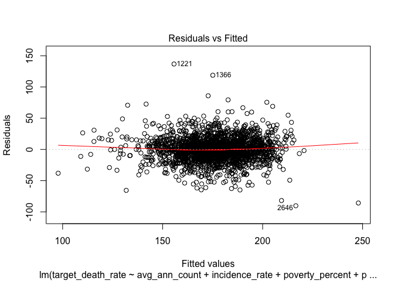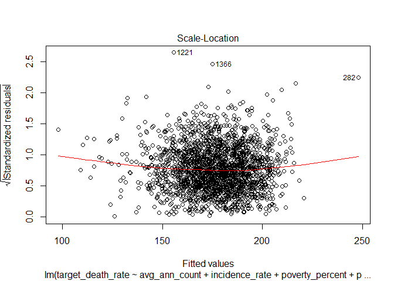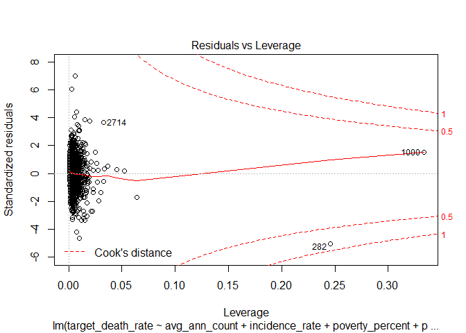

``` r
# backward model
plot(back_model)
```

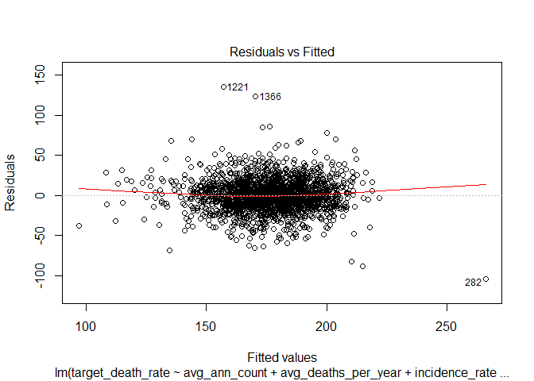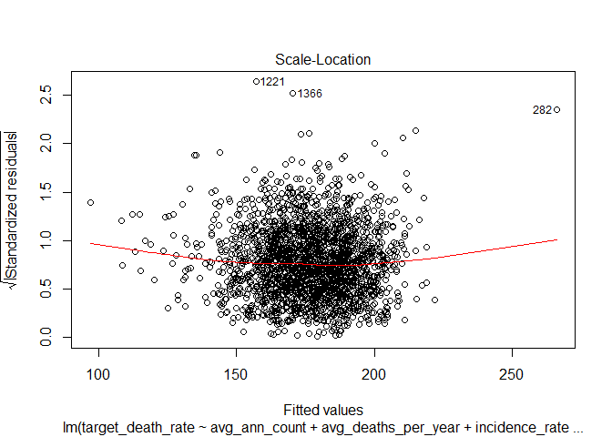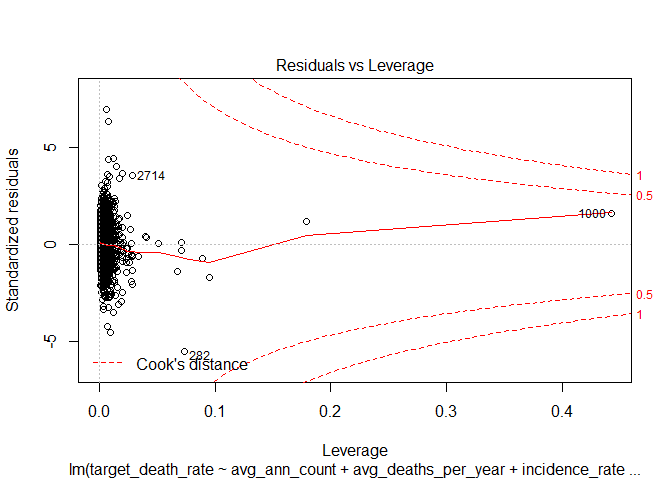

``` r
# forward model
plot(for_model)
```

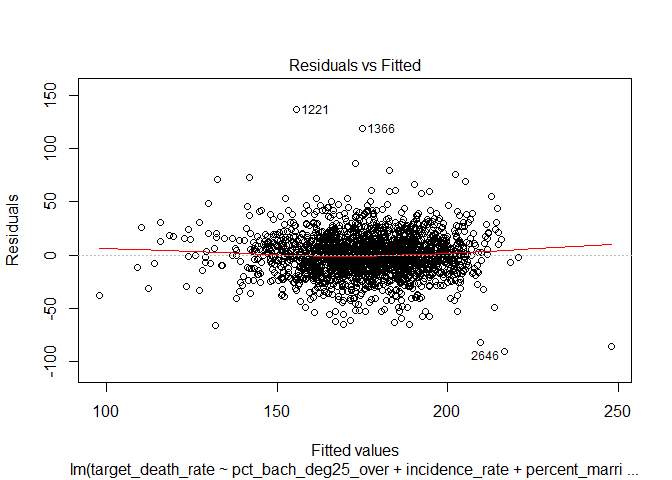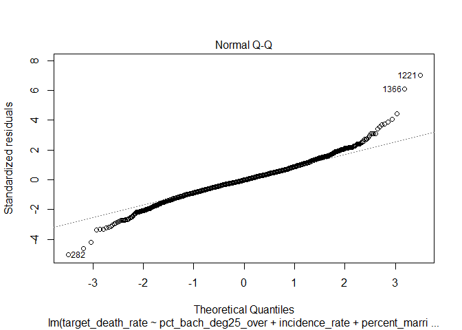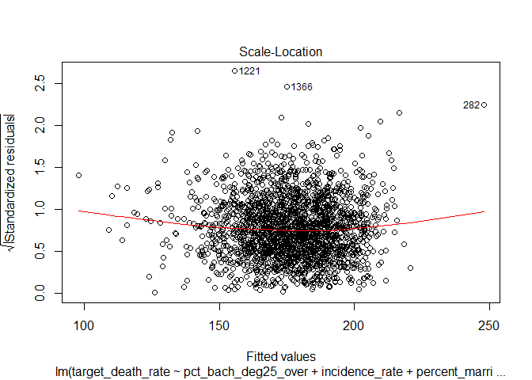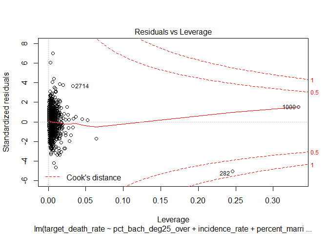

``` r
# Observation 282 should be looked at 
```

Remove Outliers
---------------

``` r
# remove observation 282
num_df_no_282 = num_df[-c(282),]

step_no_282 = update(step_model, . ~ ., data = num_df_no_282)
summary(step_no_282)
```

    ## 
    ## Call:
    ## lm(formula = target_death_rate ~ avg_ann_count + incidence_rate + 
    ##     poverty_percent + percent_married + pct_bach_deg25_over + 
    ##     pct_unemployed16_over + birth_rate + black_high_ind + incidence_rate:black_high_ind, 
    ##     data = num_df_no_282)
    ## 
    ## Residuals:
    ##     Min      1Q  Median      3Q     Max 
    ## -90.210 -11.309  -0.389  10.857 136.805 
    ## 
    ## Coefficients:
    ##                                 Estimate Std. Error t value Pr(>|t|)    
    ## (Intercept)                    1.208e+02  9.498e+00  12.716  < 2e-16 ***
    ## avg_ann_count                 -9.781e-04  3.099e-04  -3.156 0.001624 ** 
    ## incidence_rate                 1.957e-01  9.907e-03  19.751  < 2e-16 ***
    ## poverty_percent                3.627e-01  1.360e-01   2.667 0.007708 ** 
    ## percent_married               -2.421e-01  1.011e-01  -2.394 0.016756 *  
    ## pct_bach_deg25_over           -1.892e+00  1.058e-01 -17.880  < 2e-16 ***
    ## pct_unemployed16_over          6.671e-01  1.848e-01   3.609 0.000314 ***
    ## birth_rate                    -7.614e-01  2.181e-01  -3.491 0.000492 ***
    ## black_high_ind                 2.758e+01  9.163e+00   3.010 0.002643 ** 
    ## incidence_rate:black_high_ind -5.182e-02  1.999e-02  -2.593 0.009585 ** 
    ## ---
    ## Signif. codes:  0 '***' 0.001 '**' 0.01 '*' 0.05 '.' 0.1 ' ' 1
    ## 
    ## Residual standard error: 19.57 on 2081 degrees of freedom
    ## Multiple R-squared:  0.4181, Adjusted R-squared:  0.4155 
    ## F-statistic: 166.1 on 9 and 2081 DF,  p-value: < 2.2e-16

``` r
back_no_282 = update(back_model, . ~ ., data = num_df_no_282)
summary(back_no_282)
```

    ## 
    ## Call:
    ## lm(formula = target_death_rate ~ avg_ann_count + avg_deaths_per_year + 
    ##     incidence_rate + pop_est2015 + poverty_percent + percent_married + 
    ##     pct_bach_deg25_over + pct_unemployed16_over + birth_rate + 
    ##     black_high_ind, data = num_df_no_282)
    ## 
    ## Residuals:
    ##      Min       1Q   Median       3Q      Max 
    ## -103.975  -11.214   -0.475   11.026  135.463 
    ## 
    ## Coefficients:
    ##                         Estimate Std. Error t value Pr(>|t|)    
    ## (Intercept)            1.239e+02  9.233e+00  13.423  < 2e-16 ***
    ## avg_ann_count         -3.663e-03  8.561e-04  -4.278 1.97e-05 ***
    ## avg_deaths_per_year    1.795e-02  4.564e-03   3.932 8.71e-05 ***
    ## incidence_rate         1.824e-01  8.751e-03  20.844  < 2e-16 ***
    ## pop_est2015           -1.442e-05  6.159e-06  -2.341  0.01931 *  
    ## poverty_percent        3.764e-01  1.363e-01   2.762  0.00579 ** 
    ## percent_married       -1.797e-01  1.016e-01  -1.768  0.07717 .  
    ## pct_bach_deg25_over   -1.928e+00  1.052e-01 -18.325  < 2e-16 ***
    ## pct_unemployed16_over  5.619e-01  1.864e-01   3.015  0.00260 ** 
    ## birth_rate            -6.916e-01  2.184e-01  -3.167  0.00156 ** 
    ## black_high_ind         3.562e+00  1.126e+00   3.162  0.00159 ** 
    ## ---
    ## Signif. codes:  0 '***' 0.001 '**' 0.01 '*' 0.05 '.' 0.1 ' ' 1
    ## 
    ## Residual standard error: 19.51 on 2080 degrees of freedom
    ## Multiple R-squared:  0.4214, Adjusted R-squared:  0.4186 
    ## F-statistic: 151.5 on 10 and 2080 DF,  p-value: < 2.2e-16

``` r
for_no_282 = update(for_model, . ~ ., data = num_df_no_282)
summary(for_no_282)
```

    ## 
    ## Call:
    ## lm(formula = target_death_rate ~ pct_bach_deg25_over + incidence_rate + 
    ##     percent_married + pct_unemployed16_over + black_high_ind + 
    ##     birth_rate + avg_ann_count + poverty_percent + incidence_rate:black_high_ind, 
    ##     data = num_df_no_282)
    ## 
    ## Residuals:
    ##     Min      1Q  Median      3Q     Max 
    ## -90.210 -11.309  -0.389  10.857 136.805 
    ## 
    ## Coefficients:
    ##                                 Estimate Std. Error t value Pr(>|t|)    
    ## (Intercept)                    1.208e+02  9.498e+00  12.716  < 2e-16 ***
    ## pct_bach_deg25_over           -1.892e+00  1.058e-01 -17.880  < 2e-16 ***
    ## incidence_rate                 1.957e-01  9.907e-03  19.751  < 2e-16 ***
    ## percent_married               -2.421e-01  1.011e-01  -2.394 0.016756 *  
    ## pct_unemployed16_over          6.671e-01  1.848e-01   3.609 0.000314 ***
    ## black_high_ind                 2.758e+01  9.163e+00   3.010 0.002643 ** 
    ## birth_rate                    -7.614e-01  2.181e-01  -3.491 0.000492 ***
    ## avg_ann_count                 -9.781e-04  3.099e-04  -3.156 0.001624 ** 
    ## poverty_percent                3.627e-01  1.360e-01   2.667 0.007708 ** 
    ## incidence_rate:black_high_ind -5.182e-02  1.999e-02  -2.593 0.009585 ** 
    ## ---
    ## Signif. codes:  0 '***' 0.001 '**' 0.01 '*' 0.05 '.' 0.1 ' ' 1
    ## 
    ## Residual standard error: 19.57 on 2081 degrees of freedom
    ## Multiple R-squared:  0.4181, Adjusted R-squared:  0.4155 
    ## F-statistic: 166.1 on 9 and 2081 DF,  p-value: < 2.2e-16

``` r
plot(step_no_282)
```

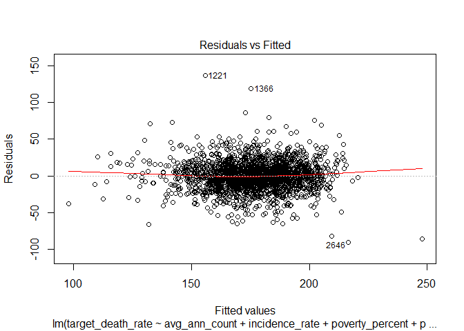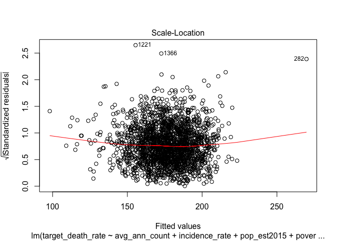
