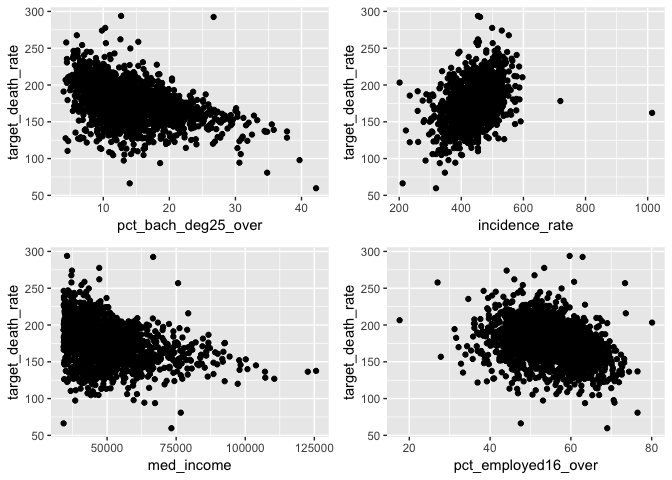
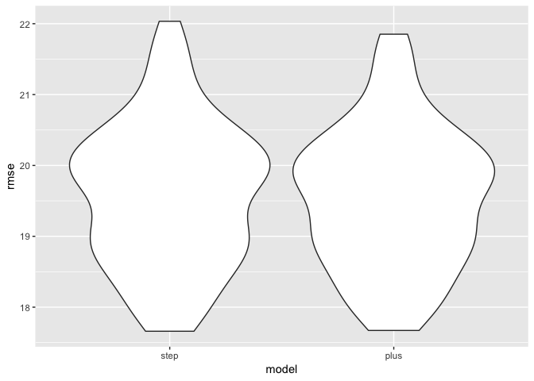
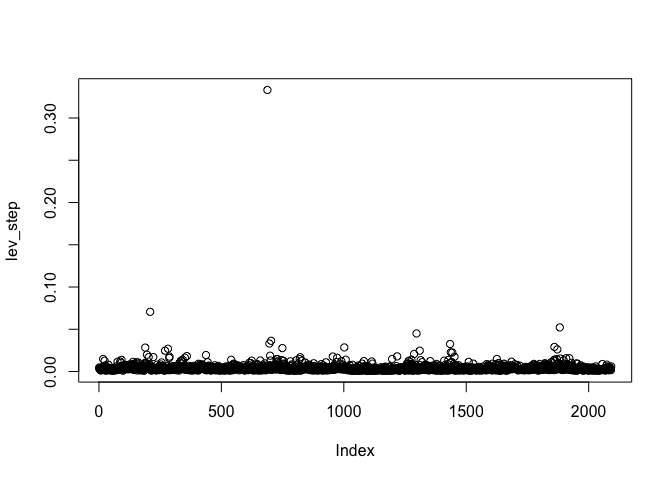
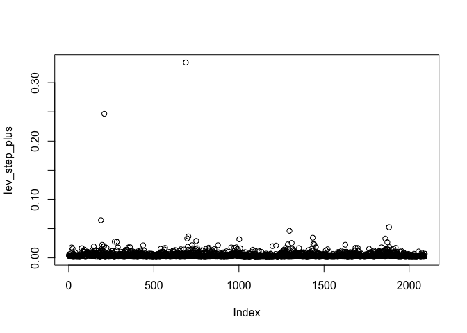

bm\_finalproject
================
Coco
12/7/2018

Read data
---------

Exploratory Analysis
--------------------

``` r
cor(num_df) %>% knitr::kable()
```

|                         |  avg\_ann\_count|  avg\_deaths\_per\_year|  target\_death\_rate|  incidence\_rate|  med\_income|  pop\_est2015|  poverty\_percent|  study\_per\_cap|  median\_age|  avg\_household\_size|  percent\_married|  pct\_bach\_deg18\_24|  pct\_bach\_deg25\_over|  pct\_employed16\_over|  pct\_unemployed16\_over|  birth\_rate|  median\_inc|  pct\_no\_cov|  black\_high\_ind|
|-------------------------|----------------:|-----------------------:|--------------------:|----------------:|------------:|-------------:|-----------------:|----------------:|------------:|---------------------:|-----------------:|---------------------:|-----------------------:|----------------------:|------------------------:|------------:|------------:|-------------:|-----------------:|
| avg\_ann\_count         |        1.0000000|               0.9382324|           -0.1339480|        0.0747173|    0.2505272|     0.9275658|        -0.0885992|        0.0762519|   -0.0229115|             0.0848187|        -0.1655274|             0.2688210|               0.3071750|              0.1662126|                0.0545340|   -0.0411180|    0.2282581|    -0.2181420|         0.1171253|
| avg\_deaths\_per\_year  |        0.9382324|               1.0000000|           -0.0851532|        0.0633721|    0.2144815|     0.9797042|        -0.0196484|        0.0530066|   -0.0254858|             0.1076423|        -0.2410169|             0.2521097|               0.2886537|              0.0962653|                0.1326806|   -0.0831509|    0.2021459|    -0.1896046|         0.1796549|
| target\_death\_rate     |       -0.1339480|              -0.0851532|            1.0000000|        0.3953059|   -0.3605578|    -0.1150993|         0.3513716|       -0.0293587|    0.0142876|            -0.0424271|        -0.2211551|            -0.2490342|              -0.4644337|             -0.3560154|                0.3281160|   -0.0868656|   -0.3286698|     0.1558121|         0.1757894|
| incidence\_rate         |        0.0747173|               0.0633721|            0.3953059|        1.0000000|    0.0224035|     0.0257125|        -0.0229473|        0.0701454|    0.0245092|            -0.1203914|        -0.1445795|             0.0826459|              -0.0073560|              0.0084221|                0.0935346|   -0.1202647|    0.0165010|    -0.2235092|         0.1261541|
| med\_income             |        0.2505272|               0.2144815|           -0.3605578|        0.0224035|    1.0000000|     0.2257442|        -0.7604683|        0.0189502|   -0.0288561|             0.1593060|         0.2562195|             0.4625371|               0.6672572|              0.6385020|               -0.3440161|   -0.0192905|    0.9153934|    -0.5940330|        -0.0588084|
| pop\_est2015            |        0.9275658|               0.9797042|           -0.1150993|        0.0257125|    0.2257442|     1.0000000|        -0.0238114|        0.0452891|   -0.0241928|             0.1248059|        -0.2112515|             0.2388230|               0.2905393|              0.1165067|                0.1026772|   -0.0653789|    0.2112351|    -0.1863353|         0.1560494|
| poverty\_percent        |       -0.0885992|              -0.0196484|            0.3513716|       -0.0229473|   -0.7604683|    -0.0238114|         1.0000000|       -0.0330405|   -0.0149776|             0.0293557|        -0.5837952|            -0.3368828|              -0.4711736|             -0.6885556|                0.5694729|   -0.0269168|   -0.6882453|     0.4664597|         0.2974097|
| study\_per\_cap         |        0.0762519|               0.0530066|           -0.0293587|        0.0701454|    0.0189502|     0.0452891|        -0.0330405|        1.0000000|   -0.0256269|             0.0039111|        -0.0622367|             0.0445682|               0.0918645|              0.0697429|               -0.0214334|    0.0134288|    0.0042065|    -0.0815652|        -0.0113105|
| median\_age             |       -0.0229115|              -0.0254858|            0.0142876|        0.0245092|   -0.0288561|    -0.0241928|        -0.0149776|       -0.0256269|    1.0000000|            -0.0402771|         0.0391130|            -0.0029153|              -0.0229929|             -0.0374468|                0.0180069|   -0.0030421|   -0.0175570|     0.0736906|        -0.0100323|
| avg\_household\_size    |        0.0848187|               0.1076423|           -0.0424271|       -0.1203914|    0.1593060|     0.1248059|         0.0293557|        0.0039111|   -0.0402771|             1.0000000|        -0.0678970|            -0.0452432|               0.0392404|              0.0463391|                0.1144270|    0.0581158|    0.1566094|    -0.0519498|         0.0606025|
| percent\_married        |       -0.1655274|              -0.2410169|           -0.2211551|       -0.1445795|    0.2562195|    -0.2112515|        -0.5837952|       -0.0622367|    0.0391130|            -0.0678970|         1.0000000|            -0.0338378|               0.0041307|              0.3257922|               -0.4896732|    0.1682994|    0.2285568|     0.0012197|        -0.4439122|
| pct\_bach\_deg18\_24    |        0.2688210|               0.2521097|           -0.2490342|        0.0826459|    0.4625371|     0.2388230|        -0.3368828|        0.0445682|   -0.0029153|            -0.0452432|        -0.0338378|             1.0000000|               0.5840973|              0.4324662|               -0.2570606|   -0.1267955|    0.3925583|    -0.4293453|         0.0418473|
| pct\_bach\_deg25\_over  |        0.3071750|               0.2886537|           -0.4644337|       -0.0073560|    0.6672572|     0.2905393|        -0.4711736|        0.0918645|   -0.0229929|             0.0392404|         0.0041307|             0.5840973|               1.0000000|              0.5655875|               -0.3061265|   -0.1074720|    0.6117288|    -0.4762872|         0.0237588|
| pct\_employed16\_over   |        0.1662126|               0.0962653|           -0.3560154|        0.0084221|    0.6385020|     0.1165067|        -0.6885556|        0.0697429|   -0.0374468|             0.0463391|         0.3257922|             0.4324662|               0.5655875|              1.0000000|               -0.6148784|    0.0885339|    0.5824115|    -0.5967376|        -0.2040602|
| pct\_unemployed16\_over |        0.0545340|               0.1326806|            0.3281160|        0.0935346|   -0.3440161|     0.1026772|         0.5694729|       -0.0214334|    0.0180069|             0.1144270|        -0.4896732|            -0.2570606|              -0.3061265|             -0.6148784|                1.0000000|   -0.1051723|   -0.2965504|     0.2745192|         0.3353566|
| birth\_rate             |       -0.0411180|              -0.0831509|           -0.0868656|       -0.1202647|   -0.0192905|    -0.0653789|        -0.0269168|        0.0134288|   -0.0030421|             0.0581158|         0.1682994|            -0.1267955|              -0.1074720|              0.0885339|               -0.1051723|    1.0000000|   -0.0158434|     0.1026472|        -0.0943566|
| median\_inc             |        0.2282581|               0.2021459|           -0.3286698|        0.0165010|    0.9153934|     0.2112351|        -0.6882453|        0.0042065|   -0.0175570|             0.1566094|         0.2285568|             0.3925583|               0.6117288|              0.5824115|               -0.2965504|   -0.0158434|    1.0000000|    -0.5431717|        -0.0384391|
| pct\_no\_cov            |       -0.2181420|              -0.1896046|            0.1558121|       -0.2235092|   -0.5940330|    -0.1863353|         0.4664597|       -0.0815652|    0.0736906|            -0.0519498|         0.0012197|            -0.4293453|              -0.4762872|             -0.5967376|                0.2745192|    0.1026472|   -0.5431717|     1.0000000|         0.0157736|
| black\_high\_ind        |        0.1171253|               0.1796549|            0.1757894|        0.1261541|   -0.0588084|     0.1560494|         0.2974097|       -0.0113105|   -0.0100323|             0.0606025|        -0.4439122|             0.0418473|               0.0237588|             -0.2040602|                0.3353566|   -0.0943566|   -0.0384391|     0.0157736|         1.0000000|

``` r
bach = num_df %>% 
  ggplot(aes(x = target_death_rate, y  = pct_bach_deg25_over)) + 
  geom_point()

inc = num_df %>% 
  ggplot(aes(x = target_death_rate, y  = incidence_rate)) + 
  geom_point()

income = num_df %>% 
  ggplot(aes(x = target_death_rate, y  = med_income)) + 
  geom_point()

employ = num_df %>% 
  ggplot(aes(x = target_death_rate, y  = pct_employed16_over)) + 
  geom_point()

(bach + inc) / (income + employ)
```



stepwise
--------

``` r
full_model = lm(target_death_rate ~ ., data = num_df)
summary(full_model)

step_model <- stepAIC(full_model, direction = "both", 
                      trace = FALSE)
summary(step_model)
vif(step_model)
step_model<- update(step_model,.~.-avg_deaths_per_year)
step_model_ours<- update(step_model,.~.-pop_est2015)
step_model_plus<- update(step_model_ours,.~.+black_high_ind*incidence_rate)
step_model_plus<- update(step_model_plus,.~.+pct_no_cov)
```

``` r
summary(step_model_ours)
```

    ## 
    ## Call:
    ## lm(formula = target_death_rate ~ avg_ann_count + incidence_rate + 
    ##     poverty_percent + percent_married + pct_bach_deg25_over + 
    ##     pct_unemployed16_over + birth_rate + black_high_ind, data = num_df)
    ## 
    ## Residuals:
    ##      Min       1Q   Median       3Q      Max 
    ## -106.944  -11.216   -0.425   10.734  137.092 
    ## 
    ## Coefficients:
    ##                         Estimate Std. Error t value Pr(>|t|)    
    ## (Intercept)            1.266e+02  9.249e+00  13.684  < 2e-16 ***
    ## avg_ann_count         -9.887e-04  3.067e-04  -3.223 0.001286 ** 
    ## incidence_rate         1.832e-01  8.667e-03  21.139  < 2e-16 ***
    ## poverty_percent        3.425e-01  1.359e-01   2.520 0.011797 *  
    ## percent_married       -2.343e-01  1.012e-01  -2.315 0.020707 *  
    ## pct_bach_deg25_over   -1.921e+00  1.054e-01 -18.238  < 2e-16 ***
    ## pct_unemployed16_over  6.863e-01  1.849e-01   3.711 0.000212 ***
    ## birth_rate            -7.779e-01  2.183e-01  -3.564 0.000374 ***
    ## black_high_ind         3.994e+00  1.126e+00   3.548 0.000397 ***
    ## ---
    ## Signif. codes:  0 '***' 0.001 '**' 0.01 '*' 0.05 '.' 0.1 ' ' 1
    ## 
    ## Residual standard error: 19.59 on 2083 degrees of freedom
    ## Multiple R-squared:  0.4163, Adjusted R-squared:  0.4141 
    ## F-statistic: 185.7 on 8 and 2083 DF,  p-value: < 2.2e-16

``` r
summary(step_model_plus)
```

    ## 
    ## Call:
    ## lm(formula = target_death_rate ~ avg_ann_count + incidence_rate + 
    ##     poverty_percent + percent_married + pct_bach_deg25_over + 
    ##     pct_unemployed16_over + birth_rate + black_high_ind + pct_no_cov + 
    ##     incidence_rate:black_high_ind, data = num_df)
    ## 
    ## Residuals:
    ##    Min     1Q Median     3Q    Max 
    ## -89.73 -11.36  -0.49  10.78 136.59 
    ## 
    ## Coefficients:
    ##                                 Estimate Std. Error t value Pr(>|t|)    
    ## (Intercept)                    1.224e+02  9.707e+00  12.609  < 2e-16 ***
    ## avg_ann_count                 -1.023e-03  3.071e-04  -3.330 0.000885 ***
    ## incidence_rate                 1.941e-01  1.013e-02  19.155  < 2e-16 ***
    ## poverty_percent                3.984e-01  1.452e-01   2.745 0.006112 ** 
    ## percent_married               -2.228e-01  1.044e-01  -2.134 0.032964 *  
    ## pct_bach_deg25_over           -1.909e+00  1.081e-01 -17.666  < 2e-16 ***
    ## pct_unemployed16_over          6.850e-01  1.859e-01   3.684 0.000235 ***
    ## birth_rate                    -7.546e-01  2.183e-01  -3.457 0.000557 ***
    ## black_high_ind                 2.720e+01  9.172e+00   2.965 0.003060 ** 
    ## pct_no_cov                    -7.527e-02  9.811e-02  -0.767 0.443086    
    ## incidence_rate:black_high_ind -5.099e-02  2.001e-02  -2.548 0.010900 *  
    ## ---
    ## Signif. codes:  0 '***' 0.001 '**' 0.01 '*' 0.05 '.' 0.1 ' ' 1
    ## 
    ## Residual standard error: 19.56 on 2081 degrees of freedom
    ## Multiple R-squared:  0.4183, Adjusted R-squared:  0.4155 
    ## F-statistic: 149.7 on 10 and 2081 DF,  p-value: < 2.2e-16

``` r
vif(step_model)
```

    ##         avg_ann_count        incidence_rate           pop_est2015 
    ##              7.591006              1.094337              7.645096 
    ##       poverty_percent       percent_married   pct_bach_deg25_over 
    ##              2.565116              2.167579              1.685273 
    ## pct_unemployed16_over            birth_rate        black_high_ind 
    ##              1.684463              1.063198              1.299749

``` r
vif(step_model_plus)
```

    ##                 avg_ann_count                incidence_rate 
    ##                      1.168274                      1.470170 
    ##               poverty_percent               percent_married 
    ##                      2.922602                      2.311005 
    ##           pct_bach_deg25_over         pct_unemployed16_over 
    ##                      1.769540                      1.701674 
    ##                    birth_rate                black_high_ind 
    ##                      1.062284                     86.214943 
    ##                    pct_no_cov incidence_rate:black_high_ind 
    ##                      1.673038                     88.098191

Backward elimination
--------------------

``` r
back_model <- step(full_model, direction = "backward", trace=FALSE ) 
summary(back_model)
vif(back_model)
```

backward elimination suggest the same with stepwise

Forward elimination
-------------------

``` r
null<- lm(target_death_rate ~ 1, data = num_df)
for_model <- step(null, scope=list(lower=null, upper=full_model), direction="forward")
summary(for_model)
vif(for_model)
for_model<- update(for_model,.~.-avg_deaths_per_year)
for_model<- update(for_model,.~.-pop_est2015)
for_model<- update(for_model,.~.+black_high_ind*incidence_rate)
```

``` r
summary(for_model)
```

    ## 
    ## Call:
    ## lm(formula = target_death_rate ~ pct_bach_deg25_over + incidence_rate + 
    ##     percent_married + pct_unemployed16_over + black_high_ind + 
    ##     birth_rate + avg_ann_count + poverty_percent + incidence_rate:black_high_ind, 
    ##     data = num_df)
    ## 
    ## Residuals:
    ##     Min      1Q  Median      3Q     Max 
    ## -90.191 -11.355  -0.401  10.833 136.807 
    ## 
    ## Coefficients:
    ##                                 Estimate Std. Error t value Pr(>|t|)    
    ## (Intercept)                    1.209e+02  9.495e+00  12.728  < 2e-16 ***
    ## pct_bach_deg25_over           -1.892e+00  1.058e-01 -17.884  < 2e-16 ***
    ## incidence_rate                 1.957e-01  9.906e-03  19.755  < 2e-16 ***
    ## percent_married               -2.428e-01  1.011e-01  -2.401 0.016435 *  
    ## pct_unemployed16_over          6.693e-01  1.848e-01   3.622 0.000299 ***
    ## black_high_ind                 2.753e+01  9.161e+00   3.004 0.002692 ** 
    ## birth_rate                    -7.613e-01  2.181e-01  -3.491 0.000491 ***
    ## avg_ann_count                 -1.006e-03  3.064e-04  -3.285 0.001037 ** 
    ## poverty_percent                3.592e-01  1.358e-01   2.644 0.008254 ** 
    ## incidence_rate:black_high_ind -5.172e-02  1.998e-02  -2.588 0.009718 ** 
    ## ---
    ## Signif. codes:  0 '***' 0.001 '**' 0.01 '*' 0.05 '.' 0.1 ' ' 1
    ## 
    ## Residual standard error: 19.56 on 2082 degrees of freedom
    ## Multiple R-squared:  0.4182, Adjusted R-squared:  0.4157 
    ## F-statistic: 166.3 on 9 and 2082 DF,  p-value: < 2.2e-16

``` r
vif(for_model)
```

    ##           pct_bach_deg25_over                incidence_rate 
    ##                      1.696786                      1.405796 
    ##               percent_married         pct_unemployed16_over 
    ##                      2.167521                      1.681153 
    ##                black_high_ind                    birth_rate 
    ##                     86.027152                      1.060582 
    ##                 avg_ann_count               poverty_percent 
    ##                      1.162779                      2.559924 
    ## incidence_rate:black_high_ind 
    ##                     87.896436

<https://www.cancer.org/latest-news/facts-and-figures-2018-rate-of-deaths-from-cancer-continues-decline.html>

### Lasso Regression

``` r
# Try a grid of values for lambda: from 10^-2 to 10^5

grid <- 10^seq(5,-2, length=100)

Y <- num_df[,3]

X <- 
  model.matrix(target_death_rate ~ avg_ann_count + incidence_rate + poverty_percent + percent_married + pct_bach_deg25_over + pct_unemployed16_over + birth_rate + black_high_ind + incidence_rate*black_high_ind , data = num_df)

set.seed(1)

train<-sample(1:nrow(X),nrow(X)/2)

test<-(-train)

Y.test<-Y[test]


lasso1<- glmnet(X[train ,],Y[train], alpha =1, lambda =grid)

# Cross-validation
set.seed(2)
cv.out<-cv.glmnet(X[train,],Y[train])
plot(cv.out)
```


``` r
# Fit a Lasso model with all observations with the best lambda

best.lambda<-cv.out$lambda.min

lasso2<- glmnet(X[train ,],Y[train], alpha =1, lambda=best.lambda)
lasso.cv<- cv.glmnet(X[train ,],Y[train], alpha = 1)
coef(lasso.cv)
```

    ## 11 x 1 sparse Matrix of class "dgCMatrix"
    ##                                          1
    ## (Intercept)                   131.18870105
    ## (Intercept)                     .         
    ## avg_ann_count                   .         
    ## incidence_rate                  0.12630869
    ## poverty_percent                 0.36789827
    ## percent_married                -0.04694824
    ## pct_bach_deg25_over            -1.42718268
    ## pct_unemployed16_over           0.62956329
    ## birth_rate                      .         
    ## black_high_ind                  .         
    ## incidence_rate:black_high_ind   .

``` r
summary(lasso2)
```

    ##           Length Class     Mode   
    ## a0         1     -none-    numeric
    ## beta      10     dgCMatrix S4     
    ## df         1     -none-    numeric
    ## dim        2     -none-    numeric
    ## lambda     1     -none-    numeric
    ## dev.ratio  1     -none-    numeric
    ## nulldev    1     -none-    numeric
    ## npasses    1     -none-    numeric
    ## jerr       1     -none-    numeric
    ## offset     1     -none-    logical
    ## call       5     -none-    call   
    ## nobs       1     -none-    numeric

Outliers Using Studentized Residuals
------------------------------------

``` r
stu_res_step = rstandard(step_model)
outliers_y_step = stu_res_step[abs(stu_res_step) > 2.5]
outliers_y_step
```

    ##       116       119       122       124       264       282       466 
    ##  4.201182 -3.245450  3.199951 -3.109051 -2.586700 -5.708013  2.619744 
    ##       469       476       514       522       597       621       627 
    ##  2.666513 -2.598101 -2.796558  3.241169 -2.667841 -2.705309  3.691749 
    ##       650       666       775       783       803       921      1174 
    ## -3.355427  2.703718  3.231077 -3.220895 -2.679156 -3.205362  2.525425 
    ##      1217      1221      1304      1331      1345      1366      1445 
    ##  2.824479  7.018962 -2.534414 -2.723425 -2.720272  6.214609 -2.727926 
    ##      1497      1942      2066      2318      2328      2353      2427 
    ##  4.404072 -3.491506 -2.709135 -2.676790 -2.820549 -2.752008 -2.513060 
    ##      2440      2590      2600      2637      2646      2659      2714 
    ## -2.790105  2.844144  3.576842  3.064566 -4.583253 -4.260000  3.520411 
    ##      2726      2727      3036 
    ##  3.925248  3.433304  2.853765

``` r
# 282, 1221, 1366
```

Cook's Distance
---------------

``` r
# step model
plot(step_model)
```



``` r
# backward model
plot(back_model)
```


``` r
# Observation 282, 1221, 1366 should be looked at 
```

Various Measures of Influence
-----------------------------

``` r
influence.measures(step_model)
```

    ## Influence measures of
    ##   lm(formula = target_death_rate ~ avg_ann_count + incidence_rate +      pop_est2015 + poverty_percent + percent_married + pct_bach_deg25_over +      pct_unemployed16_over + birth_rate + black_high_ind, data = num_df) :
    ## 
    ##         dfb.1_  dfb.av__  dfb.inc_  dfb.p_20  dfb.pvr_  dfb.prc_  dfb.p__2
    ## 2     2.41e-03 -1.76e-03 -3.76e-03 -5.38e-04  4.96e-03 -5.34e-03  1.23e-02
    ## 3     2.32e-02 -2.31e-03 -4.51e-02 -1.07e-03 -2.73e-03 -8.37e-04  7.78e-03
    ## 4     2.22e-03 -1.22e-04 -5.20e-03  5.77e-05 -6.23e-03  1.58e-03 -4.96e-03
    ## 5    -5.85e-03  1.87e-03  1.22e-02 -1.28e-03  1.92e-03 -3.52e-04 -7.47e-05
    ## 6     6.78e-03  4.27e-03 -1.91e-02 -1.30e-03  1.83e-02  3.46e-03 -4.21e-04
    ## 7     1.94e-02  2.18e-04 -7.55e-03 -4.09e-04 -2.64e-02 -1.79e-02 -1.17e-02
    ## 8     3.39e-03 -1.23e-03 -8.41e-03  5.25e-04  9.80e-04 -5.68e-05 -8.71e-04
    ## 9    -1.28e-02 -1.04e-03  4.20e-03  7.50e-04  1.27e-02  1.16e-02  7.69e-03
    ## 13    2.10e-02 -8.39e-03 -2.64e-02  4.27e-03 -2.36e-02 -6.61e-03 -3.24e-03
    ## 14    1.83e-04 -5.97e-05 -9.99e-04 -7.13e-04  9.13e-04  2.66e-04 -6.29e-04
    ## 15   -5.97e-05  1.30e-03 -7.52e-04  5.10e-04  1.82e-03 -1.24e-03  4.32e-03
    ## 16    6.24e-03 -4.07e-05  1.92e-03 -2.70e-04 -7.63e-03 -1.01e-02 -1.96e-03
    ## 17    5.41e-04  8.38e-05 -8.19e-04 -7.86e-05  2.74e-04 -2.52e-05 -1.03e-03
    ## 18   -2.63e-02  1.21e-02  3.41e-03 -7.88e-03  4.53e-02 -1.10e-03  3.72e-02
    ## 19   -1.17e-02  2.91e-03  2.30e-03 -1.12e-03  2.88e-03  1.37e-02 -1.57e-03
    ## 20    3.36e-03  1.11e-03 -7.19e-03 -4.93e-05 -3.56e-03  3.77e-03 -1.35e-02
    ## 21    1.10e-03  9.38e-04  1.17e-02  5.82e-03 -4.27e-02  1.31e-02 -5.08e-02
    ## 22   -6.54e-03  2.29e-03  6.81e-03 -4.45e-03 -3.10e-03  6.06e-03  4.96e-03
    ## 23    3.09e-04  1.32e-04  1.08e-04 -2.73e-04 -3.06e-03 -1.59e-03  1.51e-03
    ## 25   -4.60e-02 -5.64e-03  4.46e-02  1.06e-02  4.87e-02  4.39e-02 -1.91e-02
    ## 27   -1.24e-03  6.50e-04 -9.44e-04 -5.49e-04  8.81e-04  1.57e-03  1.37e-03
    ## 28    3.13e-03 -3.06e-04  7.74e-03 -5.56e-04  1.22e-02 -1.21e-02  5.73e-03
    ## 31    1.84e-01  9.18e-03 -1.96e-01 -1.16e-02 -6.55e-02 -1.14e-01 -7.81e-02
    ## 32   -1.08e-02 -2.74e-03  1.07e-02  3.84e-03  2.40e-02  3.46e-03 -7.07e-03
    ## 34   -1.23e-01  9.58e-05  1.06e-01 -2.49e-03  4.24e-02  6.23e-02  9.38e-02
    ## 35   -3.44e-03 -5.04e-04  3.89e-03  5.61e-04  5.32e-03  2.18e-03  1.06e-03
    ## 36    2.71e-02 -1.61e-03  7.31e-04  8.69e-04 -7.61e-03 -3.04e-02 -1.97e-02
    ## 37   -8.55e-04  9.56e-04 -1.69e-03 -7.32e-04  1.84e-03  1.56e-03  1.09e-03
    ## 39   -2.75e-03 -6.96e-03  2.48e-02  5.61e-03 -8.13e-03 -6.48e-03 -3.21e-03
    ## 40   -4.39e-03 -3.18e-03  6.92e-03  3.04e-03  5.20e-03  3.90e-03 -1.01e-03
    ## 41    1.29e-02 -8.93e-03 -1.10e-02  4.45e-03 -2.35e-02 -9.47e-03  8.05e-03
    ## 42    2.05e-03  9.79e-03  2.26e-02 -7.85e-03  6.31e-03 -1.50e-02  1.56e-03
    ## 43   -1.21e-02 -5.78e-03  2.89e-02  5.77e-03  1.33e-02  1.61e-03 -3.85e-03
    ## 44   -1.84e-02 -1.78e-03  2.47e-02  3.36e-03  2.80e-02  1.39e-02 -7.95e-03
    ## 45   -3.14e-02 -6.42e-03  5.00e-02  9.21e-03  1.48e-02  2.23e-02 -2.63e-02
    ## 48   -1.09e-03 -5.42e-04  6.19e-04  6.20e-04  9.28e-04  2.38e-03 -6.97e-04
    ## 49   -3.79e-03 -1.58e-03  4.70e-03  1.86e-03  8.16e-03  5.43e-03 -7.37e-03
    ## 51    2.02e-02 -3.93e-03 -1.04e-03  2.74e-03 -1.70e-02 -2.46e-02 -1.51e-02
    ## 53   -1.54e-02  4.61e-03  4.85e-04 -7.52e-04 -1.72e-02  2.92e-02 -1.97e-02
    ## 54   -5.77e-03 -1.63e-03  4.89e-04  2.26e-03  8.81e-03  8.17e-03 -2.04e-03
    ## 58   -3.84e-02  7.75e-03  4.11e-02 -1.15e-02  2.80e-03  1.36e-02  4.90e-02
    ## 59    6.04e-03 -6.11e-03  3.04e-03  7.21e-03 -4.33e-03  6.22e-03 -2.66e-02
    ## 60    2.51e-03 -5.42e-04 -6.61e-03  9.02e-04  4.02e-03  3.06e-03 -3.22e-03
    ## 61   -7.44e-03  2.62e-03  3.80e-03 -3.47e-03 -3.08e-03  4.40e-04  1.32e-02
    ## 62    7.69e-04  3.67e-03 -6.89e-03 -3.51e-03  3.03e-03  2.75e-04  1.95e-03
    ## 63    1.55e-03 -6.96e-04  6.58e-03  1.18e-03  7.85e-03 -2.12e-03 -3.45e-03
    ## 64   -1.67e-03  9.47e-05  5.88e-03 -3.66e-04 -1.05e-02 -2.15e-03  8.68e-04
    ## 65    3.79e-03 -5.52e-03  1.19e-02  4.97e-03 -1.00e-02 -9.34e-03 -1.50e-02
    ## 68   -3.84e-05  2.05e-05  7.12e-05 -1.09e-05  2.75e-05  2.05e-05  5.97e-06
    ## 70    8.00e-04 -4.68e-04  2.09e-04  4.34e-04 -1.59e-03  1.62e-04 -2.24e-03
    ## 71   -5.53e-05 -3.82e-04  4.19e-04  3.89e-04  1.06e-03 -1.57e-05 -6.77e-04
    ## 72   -5.84e-03  2.32e-04  3.08e-03 -3.35e-04  7.32e-04  4.06e-03  6.72e-03
    ## 74    2.54e-04  9.14e-04 -3.07e-03 -1.03e-03  3.33e-05  7.56e-04  2.69e-03
    ## 75    1.13e-03  1.56e-03 -1.85e-03 -1.65e-03 -3.67e-03 -7.91e-04  3.03e-03
    ## 77   -4.43e-02 -2.45e-03  1.26e-02  9.04e-03  5.44e-02  5.35e-02 -2.50e-02
    ## 78    4.36e-03 -2.32e-03  3.31e-03  1.85e-03 -4.50e-03 -3.30e-03 -1.04e-02
    ## 79    6.11e-02 -2.26e-02 -3.32e-03  1.08e-02 -4.81e-02 -8.39e-02 -7.54e-03
    ## 80   -3.86e-03  1.16e-03  3.32e-03 -1.34e-03  2.70e-03  1.03e-03  4.37e-03
    ## 82    3.00e-04  2.92e-03 -5.89e-03 -2.95e-03  2.32e-03  4.52e-03 -7.44e-03
    ## 83    6.66e-03 -2.80e-03 -7.31e-03  2.78e-03 -5.57e-03 -1.32e-03 -5.70e-03
    ## 85    1.39e-03  1.95e-03 -1.79e-03 -1.55e-03  1.39e-03 -2.07e-03 -1.81e-03
    ## 86   -7.20e-03  1.02e-02 -1.40e-02 -9.68e-03  1.74e-02  7.50e-03  1.26e-02
    ## 87    1.43e-02  1.23e-02 -1.60e-02 -1.56e-02 -1.11e-02 -1.09e-02  1.91e-02
    ## 88    1.90e-03 -1.56e-03  1.23e-03  1.20e-03 -3.98e-03 -1.75e-03 -1.09e-03
    ## 89   -7.48e-03  4.36e-03 -3.34e-03 -4.00e-03  6.33e-03  7.21e-03  1.03e-02
    ## 91    6.04e-03 -9.03e-04 -1.64e-03  8.64e-04 -5.90e-03 -4.81e-03 -4.58e-03
    ## 93    9.62e-02 -1.03e-02 -8.42e-02  1.81e-03 -5.30e-02 -7.80e-02 -1.26e-02
    ## 94   -1.28e-02  2.53e-03  8.08e-03 -1.12e-03  6.28e-03  1.16e-02  9.66e-04
    ## 95   -5.24e-05  1.92e-05  1.08e-05 -8.27e-06  1.20e-05  6.93e-05 -3.64e-05
    ## 96    2.70e-02  1.34e-04 -6.08e-02 -4.86e-04 -1.33e-02  1.29e-02 -1.24e-02
    ## 97   -1.10e-02  6.20e-03 -8.23e-03 -5.92e-03  1.90e-02  9.48e-03  9.85e-03
    ## 98    1.32e-02  1.48e-02 -2.92e-02 -1.27e-02  1.02e-02  5.27e-04  1.44e-02
    ## 99   -1.03e-02  2.05e-03  3.03e-03 -1.63e-03  3.32e-03  9.82e-03  4.68e-03
    ## 101  -3.10e-04  5.40e-03 -1.96e-03 -4.17e-03  5.67e-03  2.12e-03 -2.36e-03
    ## 103   9.37e-03 -1.01e-02 -1.44e-02  1.20e-02 -5.83e-03  7.17e-03 -2.34e-02
    ## 104   3.38e-02  3.23e-04 -6.19e-02 -9.12e-05 -1.38e-02  9.65e-04 -1.16e-02
    ## 108  -1.15e-02 -9.24e-03  1.25e-03  6.84e-03  5.57e-03  1.66e-02  1.93e-02
    ## 109  -1.25e-03 -1.98e-03 -2.91e-03  4.71e-04  5.22e-03  7.62e-04  1.05e-02
    ## 110   6.73e-03  1.35e-02 -2.46e-02 -1.25e-02 -9.91e-04 -9.59e-03  9.16e-03
    ## 111   1.38e-02 -9.24e-03 -1.70e-02  6.23e-03 -2.33e-03 -7.06e-03  8.86e-03
    ## 113  -1.21e-02  3.35e-01 -3.90e-02 -3.69e-01  5.95e-02  1.29e-02  3.65e-02
    ## 114   1.11e-02 -6.13e-02  6.61e-03  5.89e-02  9.07e-03 -1.90e-02 -9.60e-03
    ## 115  -1.77e-02 -8.18e-02  9.23e-03  7.44e-02  2.20e-02  8.45e-03  2.72e-02
    ## 116   1.77e-01  2.89e-01 -8.30e-02 -2.92e-01 -1.69e-01 -1.85e-01 -7.23e-02
    ## 117  -8.67e-03  3.79e-02 -3.10e-03 -3.45e-02  5.19e-03  2.18e-02 -2.36e-03
    ## 118   2.18e-02  3.32e-02 -8.26e-03 -3.09e-02 -2.27e-02 -1.72e-02 -2.25e-02
    ## 119  -7.63e-02 -2.04e-01  3.71e-02  1.88e-01  1.88e-01  8.00e-02  1.50e-01
    ## 120   5.95e-02 -1.55e-01  1.40e-02  1.53e-01 -2.35e-02 -6.81e-02 -5.56e-02
    ## 121   9.38e-03  4.06e-02 -9.83e-03 -3.95e-02 -2.15e-02 -6.22e-03 -8.24e-03
    ## 122   1.05e-01  2.20e-01 -4.88e-02 -2.18e-01 -1.23e-01 -1.55e-01 -7.81e-02
    ## 123  -1.53e-02  9.29e-02 -1.14e-02 -8.71e-02 -9.80e-03  1.99e-02 -7.94e-03
    ## 124  -7.42e-02 -1.98e-01  1.29e-02  1.89e-01  6.07e-02  1.54e-01  7.08e-02
    ## 125  -6.61e-02 -1.46e-01  4.45e-02  1.44e-01  9.71e-02  2.91e-02  4.09e-02
    ## 127   7.26e-03  9.17e-03 -2.69e-03 -8.90e-03 -6.62e-03 -7.21e-03 -5.39e-03
    ## 128   9.53e-03  3.94e-02 -7.00e-03 -3.86e-02  3.28e-04 -1.27e-02  7.09e-04
    ## 130  -7.23e-03 -2.33e-03  5.16e-03  1.46e-03  1.51e-03  5.07e-03  7.30e-03
    ## 131  -6.75e-03  4.35e-03 -6.87e-03 -1.92e-03  7.59e-03  1.29e-02 -5.40e-03
    ## 132   2.01e-04 -1.03e-04  6.49e-05  8.19e-05 -1.68e-04 -2.37e-04 -1.85e-04
    ## 133  -4.69e-03  1.43e-03  1.21e-03 -5.46e-04  3.08e-03  6.00e-03 -2.18e-03
    ## 134   1.07e-03  3.86e-04  2.01e-03  9.36e-05 -3.23e-03 -2.81e-03  3.46e-03
    ## 135   7.13e-04 -1.14e-03  4.56e-03  4.91e-04 -2.75e-03 -3.07e-03  3.48e-03
    ## 137   3.75e-03 -2.73e-03  5.18e-03  1.28e-03 -4.26e-03 -8.14e-03  4.79e-03
    ## 138  -3.71e-03  1.54e-03 -1.03e-03 -9.24e-04  4.17e-03  3.96e-03  1.05e-03
    ## 139   1.91e-04 -4.90e-03 -5.06e-03  5.52e-03  1.04e-02  4.07e-03 -3.33e-03
    ## 140  -5.58e-03  1.47e-02  9.60e-04 -9.08e-03  7.53e-04  4.02e-03  1.51e-02
    ## 141   2.94e-04 -8.69e-04 -8.86e-04  7.59e-04  1.32e-03  7.20e-05 -6.17e-04
    ## 142  -1.24e-05 -1.09e-03 -9.81e-04  8.63e-04  1.09e-03  7.26e-04 -2.93e-04
    ## 143  -1.58e-02  8.00e-05  1.98e-02 -1.75e-03  9.90e-04  5.65e-03  1.41e-02
    ## 144  -1.57e-02 -4.31e-04 -1.08e-02  1.96e-03  1.68e-02  2.67e-02  1.47e-02
    ## 145  -1.21e-02 -6.19e-03  7.47e-03  1.09e-03  1.50e-02  1.66e-02 -5.05e-03
    ## 146  -5.38e-03  2.03e-03  1.55e-02 -2.48e-03 -1.84e-02  6.35e-04  3.57e-03
    ## 147  -1.74e-03  1.85e-03  2.91e-03 -2.30e-03  1.67e-05  2.14e-03 -3.81e-03
    ## 148   5.12e-03  2.56e-03 -4.85e-03 -8.16e-04  2.94e-03 -2.72e-03 -1.23e-02
    ## 149  -3.78e-04 -6.95e-03 -1.10e-02  6.70e-03  2.00e-02  7.61e-03 -1.09e-02
    ## 150   2.75e-05 -1.65e-04  1.61e-05  2.44e-05  2.57e-04 -5.76e-05 -1.88e-04
    ## 151  -9.36e-03  1.49e-02  1.13e-02 -1.12e-02 -2.24e-03  2.69e-03  1.52e-02
    ## 153   6.66e-04 -2.09e-03 -7.66e-04  1.61e-03  2.18e-05 -2.65e-04 -3.21e-04
    ## 154  -8.77e-03 -6.09e-03  6.27e-03  9.25e-04 -9.28e-04  9.12e-03 -3.31e-03
    ## 155  -1.75e-05 -6.21e-04  1.79e-03  1.35e-04 -2.87e-03 -7.71e-04 -4.74e-04
    ## 156  -5.36e-03 -6.26e-04  1.46e-03 -2.65e-04 -5.19e-03  5.66e-03  1.26e-02
    ## 157  -6.19e-03 -6.06e-03  1.15e-02  2.40e-03 -2.06e-02  1.07e-03  1.99e-02
    ## 158  -1.25e-02 -5.84e-03  4.51e-03  2.22e-03  2.74e-02  1.38e-02 -7.64e-04
    ## 159  -5.84e-04 -2.38e-03  3.45e-03  1.07e-03 -8.35e-03 -9.98e-04  4.44e-03
    ## 160  -1.70e-02 -1.47e-03  1.49e-02 -6.28e-03 -3.74e-03  1.99e-02 -7.27e-03
    ## 162  -9.65e-04  2.59e-04  3.70e-03 -1.74e-04 -4.84e-03  1.48e-03 -1.78e-03
    ## 163  -4.57e-02 -6.47e-03  6.48e-02  1.50e-02 -2.53e-02  6.35e-02 -1.28e-02
    ## 164  -1.22e-02  1.75e-03  3.52e-02  3.95e-03 -1.84e-02  9.62e-03 -2.45e-02
    ## 165  -2.35e-02  2.55e-03  3.77e-02 -4.51e-04  1.81e-03  1.55e-02 -1.37e-03
    ## 167   1.88e-02 -4.90e-04  1.53e-02  5.89e-04 -4.78e-02 -1.30e-02 -3.88e-02
    ## 168   6.89e-03 -1.65e-03 -4.14e-03  1.52e-03 -4.76e-03 -6.59e-03 -4.26e-03
    ## 171  -8.36e-03 -1.36e-03  1.84e-02  2.62e-03 -6.54e-03  4.89e-03 -1.27e-03
    ## 172  -2.94e-03  5.54e-04  3.20e-03 -7.52e-04  8.79e-04  1.47e-03  2.49e-03
    ## 173   1.92e-02  3.89e-03  3.17e-02  2.76e-03 -4.84e-02 -1.43e-02 -6.12e-02
    ## 180  -3.58e-02 -3.40e-03  4.19e-02  6.23e-03 -4.90e-03  2.85e-02  2.18e-03
    ## 181  -5.23e-03 -4.57e-04  9.67e-03  1.35e-03 -6.25e-03  3.75e-03 -3.35e-03
    ## 183  -6.51e-02  2.26e-03  7.26e-02 -3.99e-03  4.34e-03  4.66e-02  2.85e-02
    ## 188  -4.73e-02 -2.18e-04  5.57e-02  7.91e-03  1.16e-02  4.16e-02 -1.64e-02
    ## 189   1.42e-01  1.09e-02 -1.37e-01 -8.13e-03 -1.61e-01 -8.29e-02 -6.99e-02
    ## 190  -1.66e-02 -5.81e-04  1.40e-02  6.68e-04 -1.27e-05  1.14e-02  6.43e-03
    ## 191   1.13e-02 -6.53e-04  1.21e-02  1.45e-03 -2.43e-02 -9.53e-03 -1.51e-02
    ## 192  -4.36e-03 -1.47e-03 -1.56e-03  1.60e-03  3.45e-03  6.17e-03  5.55e-05
    ## 193  -9.08e-03  5.32e-03 -1.45e-02 -4.16e-03  5.44e-03  1.77e-02  1.25e-02
    ## 195  -2.01e-02 -7.83e-03 -1.51e-02  7.37e-03  4.97e-03  3.66e-02  1.23e-03
    ## 197  -4.70e-02  8.44e-03 -3.25e-03 -5.66e-03  4.53e-02  5.47e-02  2.85e-02
    ## 199  -3.71e-04  8.69e-04 -7.69e-03 -9.41e-04 -3.99e-03  4.56e-03  8.90e-04
    ## 200  -4.14e-03  5.41e-03 -2.27e-02 -5.65e-03  3.28e-03  1.24e-02  1.62e-02
    ## 202   8.91e-03  9.79e-03  5.45e-02 -1.15e-02 -4.25e-02 -3.54e-02 -1.58e-02
    ## 203  -1.93e-02 -1.02e-02 -1.32e-05  3.58e-03 -2.31e-02  3.90e-02  1.08e-02
    ## 204  -3.08e-03 -1.25e-03 -2.06e-03 -1.47e-04 -6.96e-04  5.02e-03  7.81e-03
    ## 205   1.08e-02 -4.39e-03 -2.02e-02  2.34e-03 -8.21e-03 -1.46e-03 -8.83e-03
    ## 206  -1.19e-02 -1.79e-02  1.59e-02  9.87e-03 -3.63e-02  1.30e-02  9.44e-03
    ## 207   7.60e-04  1.30e-03 -2.19e-03 -1.10e-03  2.45e-03 -1.10e-03  1.82e-03
    ## 210  -2.22e-02 -5.03e-02 -3.05e-02  4.34e-02 -4.09e-03  3.00e-02  9.88e-02
    ## 211   1.99e-03 -3.56e-03 -1.42e-03  2.04e-03 -1.28e-02  4.02e-03 -6.88e-03
    ## 212   5.30e-03 -5.24e-05 -5.11e-03 -2.96e-04  1.61e-03 -3.95e-03 -5.16e-03
    ## 213  -4.02e-03  3.67e-03 -1.81e-03 -2.53e-03  5.94e-03  5.38e-03  1.49e-03
    ## 214   1.42e-02  4.10e-03  1.21e-03 -3.24e-03 -6.73e-03 -3.38e-02 -8.78e-04
    ## 215   2.68e-02  1.07e-03 -8.88e-03 -3.21e-03  4.75e-03 -2.26e-02 -2.42e-02
    ## 216  -1.73e-02 -6.68e-03  2.31e-02  3.75e-03  5.39e-03  1.81e-02  3.02e-03
    ## 217  -1.09e-03  3.67e-04  1.45e-03  1.93e-04 -4.41e-03  2.28e-03 -4.45e-03
    ## 218  -1.48e-05 -1.50e-03  3.65e-03  9.10e-04 -1.77e-03 -1.10e-03 -1.18e-03
    ## 219   2.41e-03 -1.65e-02 -8.02e-03  1.01e-02 -5.21e-02  3.46e-02 -1.43e-02
    ## 220  -4.11e-02 -1.07e-02  5.07e-02  2.53e-03  3.22e-02  1.12e-02  2.54e-02
    ## 221  -4.03e-02 -5.94e-03  5.14e-03  2.48e-03  1.15e-02  4.71e-02  2.17e-02
    ## 222   1.27e-03  4.69e-04 -2.34e-03 -2.24e-05 -1.64e-03  7.01e-04 -3.75e-04
    ## 223   2.09e-03  4.37e-03 -8.01e-03 -2.00e-03  1.29e-02 -7.54e-03  4.23e-03
    ## 224   7.80e-03 -3.65e-03 -5.86e-03  3.63e-03 -7.70e-03 -3.17e-03 -1.42e-02
    ## 225   5.82e-03  1.96e-03 -1.59e-02 -1.30e-03  7.76e-03  3.95e-03 -4.10e-03
    ## 227   9.94e-05 -6.19e-03  4.21e-04  3.40e-03 -1.34e-02  4.55e-03  1.71e-03
    ## 229  -1.06e-02  3.21e-03  6.52e-03 -8.90e-04  1.96e-02  6.50e-03  6.50e-03
    ## 230   6.49e-03 -1.36e-02 -1.25e-02  1.37e-02 -1.29e-02  4.55e-05  5.10e-03
    ## 232  -1.05e-03 -7.42e-04 -8.46e-04  5.52e-04  7.25e-04  2.21e-03  1.65e-03
    ## 233  -8.75e-03  4.64e-03  6.46e-04 -2.26e-03  6.60e-03  1.26e-02  1.49e-02
    ## 235   1.46e-02 -1.66e-03 -1.84e-02  1.21e-03 -4.91e-03 -6.13e-03 -4.64e-03
    ## 236  -5.23e-03  1.89e-03  6.70e-03 -1.87e-03  3.89e-03 -1.06e-04  2.28e-03
    ## 238   6.08e-03  8.54e-03 -6.57e-02 -5.29e-03  3.11e-02  4.17e-02 -9.93e-03
    ## 240   2.43e-02 -1.73e-03 -3.14e-02  3.28e-03  1.72e-02 -1.08e-02 -1.93e-02
    ## 241   3.57e-03 -3.07e-04 -2.51e-03  5.10e-05 -2.66e-03 -2.12e-03 -2.93e-03
    ## 242   1.05e-04 -2.82e-03 -7.56e-04  2.09e-03 -5.87e-03  2.12e-03  2.91e-04
    ## 243  -5.26e-04 -1.55e-02 -2.77e-03  1.10e-02 -2.65e-02  9.82e-03  1.14e-02
    ## 244   9.69e-04 -2.52e-03 -6.51e-03 -8.30e-05 -1.01e-02  4.06e-03  1.31e-03
    ## 246   2.09e-02  4.48e-04 -4.89e-02  2.40e-03  1.40e-02  5.34e-03 -2.35e-02
    ## 247   5.23e-02 -1.68e-02 -2.08e-02  1.12e-02 -5.59e-02 -4.55e-02 -2.32e-02
    ## 248   3.30e-03 -1.74e-03 -4.31e-03  1.12e-03 -1.16e-03 -7.52e-04  6.74e-04
    ## 249  -1.17e-02  1.85e-03  4.92e-03  2.67e-04  1.42e-02  7.26e-03  9.94e-03
    ## 250   6.19e-02  6.23e-03 -8.89e-02 -8.53e-03  8.20e-03 -2.86e-02 -2.24e-02
    ## 251  -5.09e-03  1.46e-03  4.28e-03 -1.19e-03  5.32e-03 -4.59e-04  6.81e-03
    ## 255  -3.89e-02 -4.15e-02  1.27e-01  3.47e-02 -3.31e-03 -4.83e-02 -2.59e-03
    ## 256   8.01e-02  3.74e-02 -2.55e-01 -1.37e-02 -1.34e-01  7.98e-02 -1.11e-01
    ## 257   3.77e-03 -6.11e-03 -1.40e-03  4.84e-03 -1.94e-02 -8.44e-04  1.98e-03
    ## 258  -4.44e-02  1.57e-02 -9.52e-03 -5.96e-03  7.03e-02  4.10e-02  3.61e-02
    ## 260  -9.44e-04 -6.39e-03  1.18e-05  1.75e-03 -5.62e-03 -1.06e-03  2.27e-02
    ## 261   3.35e-02 -6.66e-03 -4.54e-03 -1.15e-02 -1.86e-02 -6.46e-02  2.68e-02
    ## 262  -1.56e-02  1.10e-02 -2.74e-02 -1.76e-03  1.56e-02  4.22e-02 -1.29e-02
    ## 263   5.88e-04 -6.40e-05  8.93e-05 -2.88e-05 -6.77e-04 -7.64e-04 -2.37e-04
    ## 264   7.61e-04  3.22e-02 -1.64e-01 -8.57e-03 -1.43e-01  1.50e-01 -1.17e-01
    ## 265   4.85e-02 -1.29e-02  3.72e-02  3.41e-03 -6.14e-02 -8.29e-02 -4.62e-02
    ## 266  -9.64e-04 -2.06e-03  1.05e-02 -2.60e-03  1.90e-02 -1.65e-02  2.10e-02
    ## 267   1.65e-03 -5.50e-04 -2.47e-03  1.74e-04 -2.29e-03 -5.09e-04 -1.10e-04
    ## 268   1.51e-02 -2.38e-03 -3.28e-03  7.65e-04 -1.20e-02 -1.75e-02 -4.49e-03
    ## 269   3.60e-03 -8.94e-04  1.07e-03  2.42e-04 -1.10e-04 -7.80e-03  1.50e-03
    ## 272  -1.20e-03 -5.38e-03 -4.15e-04  3.17e-03 -6.22e-03  3.88e-03  8.36e-03
    ## 274   8.56e-03  7.87e-04 -6.94e-05 -5.36e-03  2.23e-02 -1.97e-02  1.80e-02
    ## 276   5.19e-03 -1.08e-03  7.95e-03 -8.33e-04 -8.79e-04 -1.43e-02  4.33e-04
    ## 277   1.06e-02 -5.43e-03  7.68e-03  3.43e-03 -1.13e-02 -1.56e-02 -2.94e-03
    ## 278  -9.33e-04  6.40e-03 -2.19e-02 -1.38e-03 -2.26e-03  1.35e-02 -8.36e-03
    ## 279   8.88e-04 -8.45e-03  5.17e-03  3.77e-03 -1.64e-02 -1.71e-03  3.28e-03
    ## 281  -5.47e-04 -1.18e-03  4.43e-03  9.42e-04 -8.71e-04 -1.32e-03 -1.45e-03
    ## 282   5.16e-01  2.35e-01 -1.41e+00 -1.28e-01 -1.86e-01  2.58e-01 -3.95e-01
    ## 283   7.72e-02 -9.14e-03 -3.97e-02 -6.51e-05 -5.84e-02 -7.34e-02 -2.65e-02
    ## 284   1.98e-03  4.64e-03  5.39e-02 -4.87e-03 -1.08e-02 -2.08e-02  3.34e-04
    ## 285   2.12e-02 -1.76e-03 -3.92e-02 -1.23e-03 -8.51e-03 -1.80e-03 -5.48e-04
    ## 286   1.31e-03  9.97e-04 -7.70e-04 -9.42e-04 -1.01e-03 -5.64e-04 -2.58e-03
    ## 290  -1.27e-02 -8.69e-03  1.09e-02  3.93e-03 -1.92e-04  5.23e-03  1.82e-02
    ## 291   2.41e-03 -5.30e-05 -1.23e-03 -1.68e-04 -2.73e-03 -1.32e-03 -2.79e-04
    ## 292   1.57e-02  7.18e-03 -5.90e-03 -7.38e-03 -1.45e-02 -2.25e-02 -3.65e-03
    ## 293  -5.94e-03 -9.34e-04  1.89e-02  2.67e-03 -5.38e-03  1.34e-03 -5.15e-03
    ## 296  -2.40e-03  1.63e-03  2.70e-03 -1.51e-03  3.52e-03  1.69e-03  1.98e-03
    ## 297   5.93e-03  9.40e-04 -1.17e-02  9.65e-05  3.13e-03  2.06e-03 -8.21e-04
    ## 298   2.80e-02  6.90e-03 -9.47e-03 -2.61e-03  3.99e-03 -2.48e-02 -3.45e-02
    ## 299   1.94e-02  4.86e-03 -1.17e-02 -1.45e-04 -6.63e-03 -1.04e-02 -3.04e-02
    ## 300  -1.22e-02  1.10e-02  5.91e-03  1.95e-02  1.14e-02  6.07e-03  2.25e-02
    ## 301  -9.56e-03  1.45e-03  7.74e-03  3.99e-04  4.12e-03  1.14e-02 -2.50e-04
    ## 302  -7.20e-03  4.03e-04  2.53e-03 -3.66e-04  7.91e-03  6.73e-03  1.89e-03
    ## 303   7.55e-03 -1.75e-03 -1.09e-02  7.72e-04 -5.81e-03 -2.71e-03  2.00e-03
    ## 304   1.30e-04  1.35e-04  6.49e-04 -3.55e-05  2.94e-04 -6.66e-04 -3.51e-05
    ## 306   1.74e-02 -3.28e-03 -3.10e-02  8.85e-04 -6.24e-03 -5.24e-03  3.12e-03
    ## 307   2.46e-02 -6.23e-03 -1.56e-02  3.91e-03 -3.11e-02 -1.98e-02 -5.19e-03
    ## 308   2.69e-03  1.03e-03 -1.89e-03 -5.35e-04 -2.52e-04 -2.01e-03 -3.07e-03
    ## 309   7.17e-03 -1.24e-02 -7.69e-03  9.57e-03 -3.07e-03 -2.67e-03 -3.67e-04
    ## 312   9.66e-04  1.47e-02 -3.80e-02 -9.19e-03  2.74e-02  1.99e-02 -1.38e-02
    ## 313  -3.18e-02  3.98e-03  5.74e-03 -3.43e-03  1.13e-02  2.92e-02  2.72e-02
    ## 314   8.02e-03 -2.07e-03 -1.38e-02  2.14e-03 -5.24e-03 -8.40e-04 -8.33e-03
    ## 316  -7.33e-04  5.21e-04  5.86e-05 -5.65e-04  1.37e-03 -8.66e-05  1.99e-03
    ## 318  -6.02e-03  1.85e-03  4.01e-03 -1.33e-03  7.13e-03  5.54e-03  3.73e-03
    ## 319   2.23e-03  6.35e-04 -1.27e-02 -1.65e-03 -7.06e-04  4.71e-03 -1.16e-03
    ## 320   1.03e-02 -4.94e-05 -1.82e-02 -1.28e-03 -1.57e-03 -3.40e-03  1.18e-03
    ## 321  -2.91e-03  4.66e-04  2.23e-04  9.20e-04 -8.03e-03  8.35e-03 -6.87e-03
    ## 322   6.29e-03 -2.87e-04  3.23e-03 -1.71e-04 -9.69e-03 -1.06e-02 -1.15e-03
    ## 323   7.42e-04 -5.77e-05 -2.58e-04  3.40e-04 -1.37e-03  1.52e-04 -3.09e-03
    ## 325   6.52e-03 -1.01e-03 -3.20e-03 -1.72e-03 -3.64e-03 -4.09e-03 -9.40e-03
    ## 326  -5.65e-02  1.19e-02  9.13e-02 -6.21e-03  4.28e-02  2.10e-02  1.21e-02
    ## 328   8.39e-05  1.26e-04 -2.10e-04 -1.21e-04  4.94e-04 -1.21e-04  2.07e-04
    ## 330   3.07e-03 -3.58e-04 -1.68e-03  2.26e-04 -2.52e-03 -2.46e-03 -1.39e-03
    ## 331   6.13e-04 -5.64e-03 -3.81e-03  4.46e-03 -1.32e-02  4.16e-03  1.13e-02
    ## 334  -9.62e-04 -1.46e-02 -2.19e-03  8.93e-03  5.92e-03  8.45e-05  5.94e-03
    ## 335   5.52e-03  4.10e-03 -1.09e-02 -1.94e-03  4.20e-03 -1.11e-03 -2.35e-03
    ## 337   1.52e-02 -1.79e-03 -6.01e-02 -1.73e-03 -1.11e-02  1.07e-02  6.71e-03
    ## 339   6.89e-02 -5.79e-04 -9.46e-02 -2.04e-03 -3.98e-02 -2.72e-02 -2.67e-02
    ## 340   6.17e-03  2.72e-03  2.07e-04 -1.34e-03  6.82e-04 -6.29e-03 -1.05e-02
    ## 341  -8.29e-04 -1.72e-03 -5.51e-03  1.54e-03 -3.67e-03  6.71e-03 -4.46e-03
    ## 342   4.15e-02 -5.39e-03 -3.98e-02  6.03e-03 -4.57e-02 -2.19e-02 -2.46e-02
    ## 344   7.28e-04 -1.12e-03  1.16e-03  5.76e-04 -6.98e-03 -1.69e-04 -3.89e-03
    ## 345   6.49e-03 -2.02e-03 -6.00e-03  2.28e-03 -1.76e-03 -3.89e-03 -1.83e-03
    ## 346  -1.46e-02  5.85e-04 -1.80e-02  7.04e-04  2.44e-02  2.65e-02  4.21e-03
    ## 347  -3.68e-03  1.00e-02  1.23e-03 -5.93e-03  3.57e-04  3.54e-03  3.33e-03
    ## 348   8.24e-03 -7.01e-04  2.27e-02  2.03e-05 -2.20e-02 -2.35e-02 -5.22e-03
    ## 349   4.96e-03 -6.62e-05  5.28e-03 -2.25e-05 -4.77e-03 -7.76e-03  6.93e-05
    ## 350   4.69e-03  2.03e-04  7.91e-03  5.86e-04 -3.61e-04 -1.10e-02 -2.89e-03
    ## 351   1.84e-02  5.42e-03 -3.04e-02 -5.02e-03 -1.21e-02 -7.69e-03  2.05e-03
    ## 353  -3.93e-03 -6.15e-03  2.60e-03  4.58e-03 -5.14e-03  1.09e-02 -1.45e-04
    ## 355   8.63e-03  7.16e-04  6.17e-03 -1.38e-04  5.06e-04 -1.68e-02 -2.30e-03
    ## 356  -4.41e-03 -3.11e-04  2.79e-03  1.35e-04  1.57e-03  3.26e-03  1.32e-03
    ## 357  -4.56e-03 -5.89e-03 -1.12e-03  6.60e-03  1.07e-02  7.37e-03  2.74e-03
    ## 358   5.20e-06 -5.56e-06 -4.65e-05 -1.58e-06  6.98e-05 -3.67e-06  4.51e-05
    ## 359   2.72e-04 -2.32e-04 -1.22e-03  3.37e-04  3.97e-04  3.10e-04 -7.95e-04
    ## 363   1.58e-03  1.13e-03 -1.40e-03 -1.27e-03  1.38e-03 -2.08e-03  2.44e-03
    ## 364   6.65e-03 -1.99e-03 -4.70e-03  1.40e-03 -2.26e-03 -4.66e-03 -2.02e-03
    ## 365  -8.30e-04  1.65e-03 -2.31e-04 -8.44e-04  4.38e-04  3.17e-03 -8.97e-03
    ## 366  -3.42e-03  3.32e-02  2.17e-03 -2.17e-02  5.41e-03  1.22e-04 -3.60e-03
    ## 367  -2.79e-03 -6.16e-04  2.99e-03  5.50e-04  1.73e-03  1.74e-03  8.37e-04
    ## 368   1.41e-02 -3.49e-02 -3.30e-04  3.14e-02 -9.28e-03 -1.72e-02  6.00e-04
    ## 371  -3.03e-03 -2.40e-02  2.99e-03  2.46e-02 -1.99e-03  9.40e-03 -8.98e-03
    ## 373  -9.03e-03  5.32e-03 -2.56e-02 -4.54e-03  5.00e-03  2.24e-02  1.04e-02
    ## 374  -1.24e-02  2.27e-03 -1.23e-03 -1.16e-03  1.23e-02  1.26e-02  6.21e-03
    ## 375  -2.60e-02  6.60e-03 -1.32e-02 -4.18e-03  1.91e-02  3.52e-02  1.42e-02
    ## 379  -2.24e-02  5.99e-03  3.19e-04 -3.39e-03  2.56e-02  1.98e-02  1.29e-02
    ## 381  -3.49e-03  3.82e-03 -1.75e-02 -3.76e-03  5.36e-03  1.05e-02  1.44e-02
    ## 382  -2.11e-03  4.73e-03 -1.34e-02 -4.29e-03  9.90e-03  6.92e-03  7.44e-03
    ## 384   6.76e-04 -2.72e-04  3.67e-04  1.45e-04 -9.30e-04 -9.97e-04 -3.30e-04
    ## 386   1.06e-02  6.53e-03 -1.57e-02 -6.18e-03  6.76e-03 -2.04e-03 -6.87e-04
    ## 387   8.98e-03 -2.34e-02  1.77e-03 -1.55e-02 -2.57e-02 -7.53e-03  9.84e-04
    ## 388  -4.30e-04  6.96e-03 -7.62e-03 -7.29e-03  1.09e-02 -3.04e-03  1.67e-02
    ## 389  -1.32e-02  3.08e-03 -1.05e-03 -2.39e-03  6.71e-03  1.53e-02  6.92e-03
    ## 390  -1.86e-02  4.86e-03 -9.08e-03 -3.37e-03  1.52e-02  2.31e-02  9.83e-03
    ## 392  -1.92e-02  9.38e-03 -3.51e-02 -6.52e-03  1.09e-02  4.73e-02  1.93e-02
    ## 393   5.97e-03 -7.51e-02 -3.66e-03  5.14e-02  9.31e-03 -9.76e-03  1.87e-03
    ## 394  -1.26e-03 -4.11e-03  6.51e-04  2.03e-03 -1.22e-03  2.56e-03 -2.78e-03
    ## 395  -1.06e-02 -3.74e-03 -8.70e-03  2.77e-03  1.19e-02  1.65e-02  7.61e-03
    ## 396  -1.03e-02 -6.62e-03 -1.20e-02  5.06e-03  1.31e-03  2.23e-02  3.17e-03
    ## 397   5.26e-04 -3.73e-03 -3.19e-03  2.89e-03 -4.94e-04  1.50e-03 -1.21e-03
    ## 398  -6.45e-03  3.49e-03 -7.50e-03 -2.03e-03  1.05e-02  1.16e-02 -1.72e-03
    ## 400  -1.11e-02  4.60e-03 -8.83e-03 -3.68e-03  1.33e-02  1.48e-02  1.35e-02
    ## 401   6.53e-03 -1.15e-03 -1.15e-03 -3.99e-04 -5.70e-03 -9.27e-03 -5.00e-03
    ## 402  -2.57e-03 -5.98e-04  1.10e-03  1.68e-04 -1.97e-03  3.05e-03  2.11e-03
    ## 403  -4.75e-04 -1.71e-04  5.96e-04 -6.68e-05  3.06e-03 -3.56e-04  2.05e-03
    ## 404  -3.06e-03 -1.51e-03  5.43e-04  1.41e-03 -5.34e-04  4.41e-03  9.44e-04
    ## 405  -6.96e-03 -4.30e-04  1.75e-03 -7.47e-05  4.86e-03  8.27e-03 -1.21e-03
    ## 406   1.42e-03  4.10e-04 -3.21e-04  1.29e-04 -5.06e-04 -1.28e-03 -1.41e-03
    ## 410   1.77e-02  1.39e-03 -2.89e-03 -1.01e-03 -1.89e-02 -1.92e-02 -1.35e-02
    ## 412   1.18e-02  2.66e-03 -1.20e-02  4.29e-03  1.84e-02 -1.13e-02  7.13e-03
    ## 413  -5.06e-03 -7.85e-03  8.50e-04  1.09e-02  2.96e-03  1.80e-03  1.47e-02
    ## 414   3.48e-03  6.21e-04 -9.50e-04 -5.93e-04 -4.33e-03 -4.47e-03 -1.01e-03
    ## 415   1.40e-02  2.38e-03  5.91e-03  3.32e-03 -1.68e-02 -1.91e-02  2.86e-03
    ## 416   3.07e-02 -1.92e-03 -1.16e-02  4.58e-03 -1.78e-02 -3.24e-02 -2.62e-02
    ## 417   1.24e-03 -9.15e-05 -1.04e-03 -7.21e-04 -2.75e-03 -1.88e-03  2.55e-04
    ## 418  -2.64e-03 -1.68e-04 -6.54e-04 -8.17e-04  3.42e-03  1.07e-03  8.81e-03
    ## 420   6.71e-03  4.54e-03 -3.43e-03 -4.07e-03  4.64e-03 -5.38e-03 -1.44e-03
    ## 421   3.38e-04 -3.33e-04 -3.40e-04  3.42e-05 -5.20e-05 -5.10e-04  1.33e-03
    ## 422   8.02e-02  1.23e-02 -4.83e-02 -5.52e-03 -3.29e-02 -8.03e-02 -2.17e-02
    ## 423   2.84e-04 -2.42e-03  2.98e-03 -2.04e-04 -2.59e-03 -1.52e-03 -1.93e-03
    ## 425   1.93e-02  2.00e-03  1.66e-02  1.33e-03  2.56e-03 -3.00e-02 -9.33e-03
    ## 426  -7.87e-04 -6.73e-04  1.14e-03 -8.53e-05 -1.81e-03  4.25e-05 -5.90e-04
    ## 427   2.59e-03  1.32e-03  3.88e-04  1.58e-03 -8.93e-03  3.82e-03 -1.67e-02
    ## 428   5.93e-03  1.97e-03  2.12e-03 -3.16e-04 -3.58e-03 -6.97e-03 -1.08e-02
    ## 429   8.90e-03  4.02e-04 -1.85e-02 -2.34e-03 -1.37e-03 -3.80e-03  5.87e-03
    ## 432   8.79e-03 -1.28e-03 -1.36e-02  1.56e-03 -1.29e-03 -5.50e-03  5.12e-03
    ## 433   6.57e-03 -1.12e-03 -7.76e-03  1.64e-03  1.61e-03 -4.47e-03  2.00e-04
    ## 434   1.48e-02 -2.64e-03  3.40e-03  4.11e-03 -9.16e-03 -1.79e-02 -3.07e-03
    ## 438   1.97e-05  3.01e-04 -2.09e-04 -2.92e-04  7.77e-04 -3.11e-04  6.78e-04
    ## 440  -9.40e-03 -9.39e-03  3.06e-02  7.89e-03  1.27e-02 -5.86e-03 -2.34e-03
    ## 441   1.65e-02  2.05e-03  1.76e-02  6.91e-04 -2.64e-02 -2.74e-02 -3.08e-02
    ## 443  -1.04e-02 -3.89e-03 -1.26e-03  2.85e-03  1.85e-03  1.28e-02  1.30e-02
    ## 445  -1.84e-02 -1.88e-02  3.95e-03  2.51e-02  8.93e-03  1.55e-02  3.51e-02
    ## 449  -9.12e-04  1.28e-04  9.46e-05 -2.83e-04  1.01e-03  5.54e-04  8.73e-04
    ## 451  -3.80e-03  1.37e-03 -3.56e-04 -2.71e-03  1.22e-02  1.94e-03  4.91e-03
    ## 452  -1.71e-03  1.98e-03 -7.23e-04 -2.21e-03  1.42e-03  1.33e-03  6.27e-03
    ## 454   1.33e-02  5.62e-03  4.95e-03 -5.54e-03 -1.49e-02 -2.71e-02 -1.04e-02
    ## 455  -8.11e-03 -8.87e-03  1.18e-02  6.82e-03  2.94e-03  2.56e-03  1.05e-02
    ## 456   1.05e-02  4.43e-03 -1.83e-02 -2.92e-03 -5.93e-02  1.87e-02 -1.78e-02
    ## 458  -4.14e-02 -4.71e-02  5.12e-02  4.27e-02 -1.75e-02  3.05e-02  1.15e-02
    ## 460  -4.75e-03  5.43e-03  3.66e-04 -3.57e-03  4.11e-03  6.32e-03 -8.41e-03
    ## 461  -6.31e-03  7.99e-03 -3.87e-03 -5.34e-03  1.59e-03  1.49e-02 -1.52e-02
    ## 463   4.22e-05  7.49e-04  3.00e-03 -4.87e-04 -1.09e-03 -7.08e-04 -2.32e-03
    ## 464   1.31e-03  2.55e-02  6.07e-02 -2.17e-02  4.65e-03 -1.69e-02 -2.97e-02
    ## 466   1.06e-02 -5.62e-02  1.07e-01  4.27e-02 -2.41e-02 -7.78e-02  1.21e-02
    ## 467   7.06e-03 -3.45e-03 -2.41e-02  3.59e-03  4.01e-03  9.55e-03 -2.53e-03
    ## 468   8.42e-04  1.89e-03 -3.38e-03 -1.75e-03  7.84e-04 -3.76e-04  6.51e-04
    ## 469   5.79e-02 -3.15e-02 -3.91e-02  2.39e-02 -1.05e-02 -3.80e-02  1.34e-03
    ## 470  -4.35e-04  5.63e-04 -4.82e-04 -3.01e-04 -8.75e-04  1.28e-03 -1.38e-03
    ## 471   1.26e-02  3.40e-03  7.82e-03 -4.03e-03 -2.00e-02 -2.10e-02 -7.34e-03
    ## 473   1.95e-02  9.91e-03 -1.68e-02 -1.07e-02 -6.69e-03 -1.24e-02 -8.35e-04
    ## 474   8.07e-02  7.02e-03  5.12e-02 -1.28e-02 -1.03e-01 -1.40e-01 -5.11e-02
    ## 476  -5.03e-02  1.24e-02  8.81e-02 -1.89e-02  1.12e-03 -3.54e-02  6.07e-02
    ## 477   7.38e-03  9.08e-03 -3.21e-03 -8.16e-03 -2.51e-03 -2.81e-03 -4.71e-03
    ## 478   2.01e-02  1.72e-02  2.08e-03 -1.94e-02 -4.58e-02 -5.08e-02 -1.26e-03
    ## 480   4.21e-02  2.07e-02 -4.92e-02 -2.14e-02 -1.92e-02 -4.01e-02 -4.62e-03
    ## 481   6.97e-03  1.55e-02 -1.72e-02 -1.44e-02  1.24e-02 -2.18e-02  7.49e-03
    ## 482   1.31e-04  2.38e-04 -3.23e-04 -1.77e-04  5.16e-05 -2.73e-05 -2.41e-04
    ## 484   3.40e-03 -3.76e-02  1.36e-02  3.43e-02  1.58e-03 -1.35e-02 -1.58e-04
    ## 485   4.76e-03  1.40e-03  2.81e-03 -1.60e-03 -1.83e-03 -6.47e-03 -2.02e-03
    ## 488   2.98e-03 -7.06e-04 -5.71e-04  4.13e-04 -5.39e-04 -2.72e-03 -4.10e-04
    ## 489   1.79e-02 -1.46e-02  3.05e-03  1.27e-02 -2.28e-02 -2.00e-02 -1.36e-02
    ## 491  -2.60e-02  2.13e-02 -7.79e-03 -1.62e-02  2.65e-02  2.99e-02  5.83e-03
    ## 494   1.98e-02  6.34e-03  3.77e-02 -1.18e-02 -6.55e-02 -6.62e-02  1.66e-03
    ## 496  -2.40e-02  2.11e-02  5.47e-03 -1.66e-02  3.54e-02  2.96e-02  2.85e-03
    ## 497  -2.96e-02  1.25e-02  5.60e-02 -9.37e-03  3.55e-02 -5.06e-03  6.39e-03
    ## 498   5.68e-03 -4.65e-03  3.94e-03  2.96e-03 -1.67e-03 -8.72e-03  3.01e-03
    ## 499   1.59e-02  6.31e-03 -1.44e-02 -6.20e-03 -4.09e-03 -8.50e-03 -4.68e-03
    ## 500  -4.23e-03  5.74e-03 -4.55e-03 -3.90e-03  4.69e-03  4.94e-03 -2.48e-03
    ## 502  -4.12e-03  3.95e-04 -1.13e-04 -8.04e-04 -5.96e-04  5.45e-03  5.47e-03
    ## 504  -1.56e-03 -1.20e-03  2.29e-03  8.58e-04  2.09e-03  1.37e-03 -4.80e-03
    ## 506  -1.26e-02 -1.71e-03  1.15e-02  1.60e-03  5.53e-03  1.20e-02  3.16e-03
    ## 507  -1.11e-02 -1.11e-02 -9.49e-03  1.28e-02  1.20e-02  1.97e-02  2.05e-02
    ## 508  -1.50e-02 -6.38e-03 -1.72e-03  7.43e-03  5.97e-03  1.70e-02 -4.51e-03
    ## 510   2.07e-02  3.82e-03 -4.96e-02 -2.48e-03  6.10e-04  2.41e-02 -3.67e-02
    ## 511  -1.76e-04  8.51e-05  9.00e-04 -1.29e-04 -5.63e-04 -3.75e-04  2.23e-04
    ## 513  -8.04e-03 -2.69e-04  8.87e-03  2.04e-03 -2.54e-03  5.60e-03 -5.67e-04
    ## 514   1.38e-02 -1.52e-02  7.22e-02  2.12e-02 -4.36e-02 -5.52e-02  1.24e-02
    ## 516  -1.44e-03 -5.59e-04  6.30e-04  4.75e-04 -4.88e-04  2.28e-03 -4.92e-04
    ## 517   3.84e-02  5.47e-03 -5.76e-03 -3.29e-03 -1.05e-02 -6.15e-02  3.77e-03
    ## 518  -2.17e-02  7.42e-04 -1.95e-02 -7.44e-03  4.71e-02  2.03e-02  3.03e-02
    ## 519   1.31e-02  2.89e-03  1.76e-03 -1.44e-03 -9.96e-03 -2.19e-02  3.25e-03
    ## 520  -6.26e-03 -6.52e-04 -2.94e-02 -2.44e-03  4.04e-02  1.68e-02  2.61e-02
    ## 521  -1.10e-02 -4.06e-03  1.28e-03  5.36e-03  7.70e-03  1.64e-02 -3.29e-03
    ## 522   3.61e-02  6.03e-03 -8.08e-02 -1.92e-02  8.99e-02 -5.47e-02  3.12e-02
    ## 523  -3.42e-02  2.95e-03 -1.34e-02 -3.24e-03  6.04e-02  6.49e-02 -9.52e-03
    ## 527  -4.53e-04  3.27e-06  3.80e-05 -5.73e-05  3.43e-04  4.51e-04  3.41e-04
    ## 531  -5.22e-03  2.83e-03  4.69e-03 -2.89e-03  9.44e-03  3.22e-03  5.58e-03
    ## 532  -3.32e-04 -1.89e-04  3.96e-04  1.65e-04 -1.35e-04  2.87e-04 -4.06e-05
    ## 535   4.51e-03  2.65e-04 -1.02e-02 -7.33e-05  2.22e-03  8.47e-03 -1.48e-02
    ## 536   4.38e-03  2.24e-03 -5.78e-03 -2.39e-03  8.52e-05 -9.64e-03  1.84e-02
    ## 538  -6.00e-04  2.22e-03  8.51e-04 -2.62e-03 -9.08e-03 -2.82e-03  4.28e-03
    ## 541  -3.23e-04  9.27e-05  5.65e-04 -1.93e-04  8.74e-04 -1.95e-04  2.91e-04
    ## 542  -2.93e-03 -2.11e-03 -5.42e-03  2.19e-03  1.10e-02  3.75e-03  2.66e-03
    ## 544   3.81e-03 -3.52e-03  3.20e-03  4.53e-03  3.58e-02 -8.49e-03 -1.12e-02
    ## 546  -1.83e-03 -3.15e-04  2.25e-03  7.20e-04 -7.04e-04  2.48e-03  8.07e-04
    ## 548   3.33e-02  1.83e-03 -3.26e-02 -2.69e-03 -1.70e-02 -7.95e-03 -3.53e-02
    ## 549  -6.60e-03 -1.04e-02 -5.91e-03  9.08e-03  3.84e-02 -8.50e-03  1.94e-03
    ## 550  -2.34e-02 -1.71e-02  3.18e-02  1.70e-02 -1.63e-03  1.64e-02  1.29e-03
    ## 551  -1.11e-02 -2.21e-04 -1.51e-02  3.57e-03  1.88e-02  3.48e-02 -1.19e-02
    ## 553   1.93e-02 -2.64e-03 -1.97e-02 -1.30e-03 -4.95e-03 -1.79e-02 -1.61e-02
    ## 556   1.91e-02  6.95e-04  1.87e-02 -7.75e-03 -6.46e-02 -5.27e-02  1.76e-02
    ## 558  -8.77e-05  2.46e-04  8.14e-04  2.86e-05 -3.32e-04 -5.71e-04 -3.53e-04
    ## 559  -3.23e-03 -8.94e-04 -2.24e-02  4.77e-03  5.38e-02  3.05e-02 -1.02e-02
    ## 560  -1.90e-03  6.46e-04 -5.75e-03 -1.68e-03  1.42e-02  4.60e-03 -1.71e-03
    ## 561   1.68e-03 -4.05e-03  9.22e-03  5.20e-03  2.40e-03  2.50e-03 -1.69e-02
    ## 564  -8.69e-04 -1.51e-02  4.06e-02  1.53e-02  1.45e-02 -3.34e-02 -3.98e-02
    ## 567  -4.11e-03 -1.17e-03  8.99e-04  1.59e-03  4.05e-03  7.42e-03 -6.00e-03
    ## 570  -8.01e-03 -9.26e-03 -3.25e-03  1.29e-02  3.14e-02  1.75e-02 -2.04e-02
    ## 572  -1.52e-03  8.95e-04 -3.08e-04 -8.51e-04  2.69e-03  1.14e-03  1.07e-03
    ## 575  -5.88e-03 -1.06e-03  1.32e-04  2.21e-03  2.57e-02  2.33e-03  8.69e-03
    ## 576  -4.60e-03  2.94e-04  7.39e-03 -1.02e-03 -6.65e-04 -2.96e-04  8.58e-03
    ## 581  -1.23e-03 -4.18e-03 -3.80e-04  4.28e-03  9.94e-03 -1.19e-03  8.83e-03
    ## 584   5.07e-03 -6.46e-03 -2.64e-04  6.30e-03  6.81e-05 -2.09e-05 -1.51e-02
    ## 585  -1.01e-04  3.92e-04  6.39e-04 -1.43e-03  2.88e-04 -1.91e-04 -4.83e-04
    ## 587   2.31e-03 -1.50e-03 -3.29e-03  1.83e-03 -3.70e-03  2.74e-03 -6.63e-03
    ## 588   3.01e-06  8.07e-04  1.43e-02  1.76e-03  1.23e-02 -1.09e-02 -6.39e-03
    ## 591  -6.03e-04  1.10e-03  3.70e-05  1.57e-04 -3.12e-04  2.74e-04  1.82e-03
    ## 592  -1.17e-03  2.42e-04  3.38e-04 -6.08e-05  4.17e-04  2.02e-03  2.98e-04
    ## 594   2.40e-02  2.15e-02  8.50e-03 -4.61e-02 -5.60e-02 -1.31e-02 -2.53e-02
    ## 595   1.84e-04  6.88e-03  3.29e-03 -3.64e-03  1.45e-02  1.53e-03  8.40e-04
    ## 597  -1.97e-02  1.18e-02  7.37e-02 -6.82e-03  1.91e-02  3.10e-02 -2.53e-02
    ## 598  -6.82e-02  1.02e-02  3.48e-02 -2.98e-03  3.95e-02  6.24e-02  1.61e-02
    ## 599   9.79e-03  2.58e-02  5.60e-03 -4.55e-02 -2.42e-02 -4.83e-03 -1.33e-05
    ## 600   3.35e-02  2.60e-03 -4.13e-03 -4.15e-04 -3.79e-02 -2.62e-02 -3.38e-02
    ## 601   1.03e-03 -5.17e-03 -2.23e-03  1.65e-03  2.36e-03 -4.38e-03  2.04e-02
    ## 602   2.24e-02  3.53e-03  2.68e-02 -5.72e-05 -6.08e-02 -3.44e-02 -4.81e-02
    ## 604   2.00e-02  4.01e-03  1.67e-02 -5.36e-03 -3.43e-02 -3.41e-02 -1.56e-02
    ## 605  -1.81e-02  6.68e-03  3.31e-02 -1.83e-03 -1.66e-03 -1.06e-03 -1.69e-02
    ## 606  -2.80e-02 -7.78e-03  3.29e-02  6.05e-03  2.74e-02  1.54e-02  2.02e-02
    ## 607  -5.99e-03  1.09e-02 -3.06e-02 -6.79e-03  1.88e-02  2.10e-02  1.27e-02
    ## 609   2.41e-02  6.48e-03 -2.96e-02 -6.98e-03 -1.87e-02 -1.35e-02 -4.21e-03
    ## 610   1.41e-02  9.49e-03 -8.98e-03 -2.52e-03 -2.31e-02 -6.66e-03 -4.42e-02
    ## 611   4.04e-02  1.14e-02 -1.69e-02 -9.66e-03 -2.62e-02 -3.32e-02 -2.57e-02
    ## 612  -2.42e-03 -1.43e-03 -7.71e-04  3.10e-04  1.01e-02  1.01e-03  8.28e-03
    ## 613  -3.45e-02  9.07e-03 -9.04e-03 -7.29e-03 -1.66e-02  4.96e-02  1.45e-02
    ## 615   1.53e-03 -7.05e-04 -1.86e-04  6.75e-04 -1.73e-03 -1.38e-03 -1.51e-03
    ## 616  -1.81e-02  8.18e-03 -2.36e-02 -5.54e-03 -1.27e-02  4.34e-02  8.42e-03
    ## 619   1.01e-02 -4.48e-03 -8.87e-03  2.96e-03 -3.70e-03 -2.76e-03  5.00e-04
    ## 620  -1.20e-03  4.72e-04  3.96e-05 -2.25e-05 -1.36e-03  2.22e-03 -1.61e-03
    ## 621   8.72e-02  4.33e-02 -9.82e-02 -4.26e-02 -8.72e-03 -1.03e-01 -5.36e-03
    ## 623   2.63e-04  1.48e-04 -1.23e-04 -1.15e-04 -1.72e-04 -1.95e-04 -2.43e-04
    ## 624  -2.47e-03  5.73e-03 -9.43e-03 -6.02e-03 -7.63e-03  5.58e-03  8.00e-03
    ## 625   6.15e-03  1.74e-02  6.02e-03 -1.77e-02 -1.78e-02 -2.84e-02  4.13e-03
    ## 626   7.55e-03  1.48e-03  1.05e-02 -1.81e-03 -2.83e-02 -1.60e-02 -9.26e-03
    ## 627   1.72e-02 -6.47e-02 -5.79e-02  5.03e-02 -3.94e-02 -7.59e-02  4.67e-02
    ## 628   1.45e-03 -1.09e-03  2.00e-03  7.79e-04 -3.11e-04 -3.15e-03  2.38e-03
    ## 629  -1.10e-02  1.32e-02 -1.70e-02 -9.95e-03  1.43e-02  1.87e-02  4.64e-03
    ## 630   7.81e-02  2.22e-02 -4.76e-02 -2.70e-02 -6.61e-02 -8.22e-02 -1.38e-02
    ## 631   5.40e-03  1.29e-02 -2.90e-02 -1.43e-02  2.44e-04 -7.63e-03  1.88e-02
    ## 632  -1.08e-04  7.19e-03  5.40e-04 -7.92e-03  3.66e-03 -8.43e-03  1.09e-02
    ## 633   1.95e-02  8.18e-03  9.77e-03 -9.55e-03 -2.88e-02 -3.10e-02 -9.88e-03
    ## 634  -6.19e-03  2.32e-04  1.19e-02 -1.75e-03 -4.69e-03 -8.76e-03  9.21e-03
    ## 636  -1.24e-02 -1.79e-02  2.66e-02  1.82e-02 -5.62e-03  1.26e-02 -1.41e-02
    ## 637   3.61e-03 -3.96e-03 -4.05e-03  3.95e-03 -7.94e-03 -1.35e-03 -5.92e-03
    ## 640  -8.25e-03 -4.88e-03  5.88e-03  5.27e-03  4.06e-03  1.06e-02  2.22e-04
    ## 641   1.58e-02  2.82e-03  5.47e-03 -3.98e-03 -1.84e-02 -2.96e-02 -6.13e-03
    ## 642  -2.46e-02  3.23e-02 -7.71e-03 -2.54e-02  3.25e-02  4.55e-02 -2.88e-03
    ## 644  -1.28e-02  3.53e-03  9.68e-03 -3.40e-03  1.47e-02  5.81e-03  1.28e-02
    ## 645  -2.11e-02  1.19e-02  3.58e-02 -1.10e-02  2.10e-02 -4.76e-03  1.29e-02
    ## 646   4.10e-03  2.00e-03 -7.65e-04 -2.14e-03 -4.81e-03 -5.74e-03 -1.59e-03
    ## 650  -1.19e-01  2.28e-02  7.82e-02 -2.12e-02  6.67e-02  4.46e-02  9.25e-02
    ## 651  -1.47e-03  2.70e-03 -5.89e-04 -2.48e-03  3.30e-03  4.50e-04  2.88e-03
    ## 652   5.34e-04  9.32e-04 -1.75e-03 -8.56e-04  2.55e-04  5.73e-05  2.96e-04
    ## 653  -8.26e-03 -3.85e-03  9.57e-03  7.38e-03  6.63e-03 -1.29e-03  2.73e-02
    ## 654   8.67e-03  4.61e-03  5.22e-03 -4.88e-03 -1.10e-02 -1.81e-02 -2.75e-03
    ## 655  -1.59e-02  9.35e-03  7.22e-03 -8.40e-03  1.47e-02  6.77e-03  1.32e-02
    ## 656   1.27e-02  7.41e-03  4.86e-02 -8.05e-03 -2.73e-02 -4.51e-02 -1.47e-02
    ## 659  -6.46e-05  4.55e-03 -3.87e-03 -4.10e-03  3.36e-03 -5.93e-04  2.31e-03
    ## 660   5.51e-02  1.17e-02 -1.32e-04 -1.17e-02 -7.33e-02 -7.68e-02 -4.06e-02
    ## 661  -1.74e-02  2.59e-02 -3.26e-02 -2.59e-02  1.43e-02  8.19e-05  4.49e-02
    ## 662  -1.08e-02 -8.16e-03  1.06e-04  7.88e-03 -2.34e-03  3.18e-02 -2.39e-03
    ## 663  -1.22e-02  8.09e-03  1.17e-02 -9.86e-03 -6.79e-04 -2.93e-03  2.02e-02
    ## 664  -4.51e-03  1.09e-02 -1.24e-02 -9.91e-03  7.33e-03  1.56e-02  6.44e-03
    ## 665   6.04e-04 -1.11e-03 -1.31e-03  8.93e-04 -1.10e-03  1.52e-03  2.51e-04
    ## 666  -1.55e-02 -3.05e-02  1.62e-02  3.50e-02  2.05e-02  5.19e-02 -3.39e-02
    ## 667   1.47e-03  2.84e-03 -5.58e-03 -3.07e-03 -1.75e-04  4.69e-04  3.60e-03
    ## 668   9.96e-04  5.96e-04  2.28e-04 -6.69e-04 -1.39e-03 -1.65e-03 -3.90e-04
    ## 669   5.79e-03  8.55e-03 -6.03e-03 -7.43e-03  1.45e-03 -2.20e-03 -2.63e-03
    ## 670   5.52e-02 -1.12e-02 -5.33e-02  1.34e-02 -3.47e-02 -9.84e-03 -5.56e-02
    ## 671   2.36e-02 -3.91e-03 -6.64e-03  3.33e-03 -1.06e-02 -2.01e-02 -1.59e-02
    ## 672   2.00e-02  1.95e-02 -1.09e-02 -1.63e-02  6.22e-03 -9.46e-03 -1.54e-02
    ## 675   1.72e-02  6.35e-03 -1.05e-02 -6.89e-03 -1.70e-02 -1.85e-02 -4.41e-03
    ## 676   1.85e-03 -2.16e-03 -9.68e-04  1.88e-03  8.25e-04 -3.80e-03  5.70e-03
    ## 679  -1.43e-04  6.46e-03 -1.02e-03 -6.45e-03  7.30e-03 -9.03e-03  8.96e-03
    ## 680  -2.66e-02  2.21e-02 -2.76e-03 -1.84e-02  2.48e-03  2.36e-02  1.53e-02
    ## 681  -3.04e-02  1.15e-02  2.34e-02 -1.21e-02  1.92e-02  1.29e-02  3.03e-02
    ## 682   3.90e-04 -7.49e-03 -1.07e-02  2.25e-03 -3.39e-03 -5.57e-03  2.32e-02
    ## 684  -1.14e-02  6.87e-03  7.76e-03 -5.25e-03  1.34e-02  8.66e-03  3.90e-03
    ## 686   1.31e-03 -6.83e-04 -5.47e-03  9.00e-04  3.21e-04  2.99e-03 -1.13e-03
    ## 687   1.02e-02 -7.24e-03 -1.21e-02  6.31e-03 -9.33e-04  7.90e-03 -2.19e-03
    ## 690   1.41e-02 -1.93e-02 -1.16e-02  1.85e-02 -2.20e-02  5.84e-03 -1.69e-02
    ## 691   6.28e-04 -5.99e-04 -6.01e-04  6.12e-04 -2.49e-04  9.05e-04 -1.02e-03
    ## 692  -2.59e-02 -1.32e-02  1.13e-02  1.24e-02  2.97e-02  2.82e-02  1.56e-02
    ## 693  -7.16e-03 -3.41e-03  9.16e-03  3.61e-03  9.80e-03  7.49e-03  1.22e-03
    ## 694  -3.28e-02  1.37e-02 -2.51e-02 -1.43e-02  3.44e-02  3.21e-02  4.80e-02
    ## 695  -1.28e-02 -2.32e-02  1.25e-02  1.93e-02 -1.84e-02  6.93e-03  3.13e-02
    ## 696   5.13e-03 -9.93e-03 -4.14e-03  8.53e-03 -1.30e-02  3.74e-03 -2.87e-03
    ## 697  -5.08e-03  2.55e-03  3.54e-03 -1.75e-03 -6.97e-04  4.79e-03 -5.81e-04
    ## 698  -6.14e-03 -1.90e-03  1.09e-02  9.49e-03  2.93e-02 -1.72e-02  4.37e-02
    ## 699  -1.64e-02 -2.63e-03 -4.80e-03  4.03e-03  1.92e-02  2.97e-02 -9.43e-03
    ## 700   1.17e-02 -4.52e-03 -8.77e-03  4.20e-03  1.08e-02 -1.08e-02 -1.10e-02
    ## 701   2.42e-03 -2.57e-03  5.14e-03  2.62e-03 -4.56e-03 -3.22e-03 -6.48e-03
    ## 702   9.63e-05 -4.94e-04 -7.38e-03 -3.42e-05  6.73e-03  4.81e-03 -1.99e-03
    ## 703   7.38e-03  1.55e-03 -2.50e-03 -5.48e-04 -1.47e-03 -8.68e-03 -3.91e-03
    ## 705   9.65e-04  1.43e-03 -1.87e-03 -1.06e-03  6.61e-04 -4.17e-04  3.78e-04
    ## 706  -6.42e-03 -6.54e-04  1.30e-03 -1.14e-03  5.40e-03  1.27e-02 -9.81e-03
    ## 707  -1.18e-03 -8.94e-04  8.32e-04  3.67e-04 -2.48e-03  3.65e-03 -4.27e-03
    ## 709  -7.42e-04 -2.67e-04  2.13e-03  5.39e-04  1.21e-03  1.30e-03 -2.40e-03
    ## 711  -3.87e-03 -1.42e-04  2.97e-03  2.27e-04  4.67e-03  2.47e-03  1.51e-03
    ## 712   4.39e-04 -1.33e-03 -4.23e-04  1.01e-03 -1.11e-04 -3.46e-05 -1.34e-03
    ## 715   8.25e-03  9.08e-04 -2.17e-03 -3.19e-04 -4.17e-03 -7.53e-03  5.24e-04
    ## 716  -1.18e-02 -1.58e-03  1.55e-02  2.21e-03  8.94e-03  8.51e-03 -3.49e-03
    ## 719  -3.20e-02 -2.79e-03  2.16e-02  4.41e-03  3.03e-02  3.22e-02 -9.75e-04
    ## 721  -2.45e-02 -6.72e-03  1.17e-02  8.79e-03  3.12e-02  3.68e-02 -1.12e-02
    ## 722  -2.63e-02 -1.03e-02  3.99e-02  1.05e-02  1.03e-02  1.65e-02 -7.69e-03
    ## 723   3.21e-03  9.04e-05  1.10e-04 -5.78e-05 -2.81e-03 -4.19e-03  2.62e-03
    ## 724   3.83e-03  1.77e-03 -6.51e-03 -2.01e-03 -2.49e-03 -3.62e-03  3.39e-03
    ## 726  -1.20e-02  6.39e-03  7.11e-03 -3.84e-03  1.45e-02  8.39e-03  1.50e-02
    ## 729   7.78e-04  7.70e-05 -1.17e-04 -1.16e-04 -7.19e-04 -7.39e-04 -9.17e-05
    ## 730  -2.90e-02 -5.65e-03  3.01e-02  6.84e-03  2.41e-02  2.33e-02  7.03e-04
    ## 731   1.14e-02 -5.16e-03 -8.61e-03  4.11e-03 -4.48e-03 -9.60e-03 -7.36e-03
    ## 732   8.37e-03  1.05e-03 -2.95e-03 -7.76e-04 -3.01e-03 -9.55e-03 -4.99e-03
    ## 733   2.86e-03 -1.40e-03 -7.35e-04  1.38e-03 -1.55e-03 -8.06e-04 -5.72e-03
    ## 735  -3.94e-03 -1.23e-03  5.90e-03  1.73e-03  3.02e-03  3.19e-03 -2.91e-03
    ## 737  -2.34e-02 -4.46e-03  3.34e-02  6.25e-03  3.34e-02  2.02e-02 -4.23e-03
    ## 738   8.86e-05 -1.04e-02  2.05e-02  9.46e-03 -7.76e-03  5.44e-04 -1.64e-02
    ## 739   1.79e-03 -1.24e-03 -1.18e-03  6.51e-04 -2.92e-03  1.15e-04 -2.53e-03
    ## 741  -3.25e-02 -1.82e-03  1.38e-02  2.90e-03  1.75e-02  3.15e-02  7.10e-03
    ## 742  -1.79e-02 -1.71e-02 -1.40e-03  1.45e-02 -1.09e-02  2.23e-02  1.43e-02
    ## 744   8.67e-03  2.01e-03 -1.69e-02 -4.93e-03 -2.30e-02 -8.72e-03  1.94e-02
    ## 745  -2.32e-02  6.85e-04  4.01e-04 -2.96e-03  1.67e-02  3.31e-02  1.29e-03
    ## 749  -5.18e-02 -4.06e-03  3.10e-02  8.81e-03  4.26e-02  7.53e-02 -2.55e-02
    ## 750  -2.98e-03 -1.40e-03 -2.52e-05 -1.65e-04  1.75e-02 -1.06e-04  1.36e-02
    ## 753   4.44e-05  2.88e-05 -6.29e-05 -2.84e-05  1.99e-05 -3.43e-05  1.11e-05
    ## 754  -7.89e-03 -1.03e-02  8.20e-04  9.28e-03  4.86e-03  7.98e-03  1.73e-02
    ## 756  -2.30e-02 -7.72e-03  1.58e-02  1.02e-02  2.32e-02  3.79e-02 -2.16e-02
    ## 758  -3.39e-03  1.92e-02  1.76e-03  1.85e-03  3.03e-02 -1.89e-02  2.62e-02
    ## 759  -6.55e-03 -1.22e-02  2.74e-02  1.80e-02  4.45e-03  2.35e-02 -4.95e-02
    ## 760  -4.09e-02 -1.07e-02  4.26e-02  1.18e-02  1.54e-02  4.30e-02 -1.13e-02
    ## 761  -6.59e-03  2.32e-03  4.08e-03 -1.53e-03  7.39e-03  5.48e-03  3.81e-03
    ## 762   9.49e-04  3.75e-03 -4.92e-03 -4.07e-03  4.00e-03 -7.74e-04 -1.74e-03
    ## 763  -2.57e-03 -4.64e-03  6.36e-03  3.31e-03 -1.46e-02  3.32e-03 -1.17e-02
    ## 764   8.57e-03 -8.69e-03  2.38e-03  6.05e-03 -2.74e-02 -1.21e-02 -3.00e-02
    ## 766  -2.37e-02 -2.87e-03  2.28e-02  4.49e-03  2.23e-02  2.11e-02 -3.02e-03
    ## 768   9.74e-03 -6.04e-03  4.37e-03  6.62e-03  4.60e-04 -1.42e-02 -1.91e-02
    ## 769  -1.30e-03 -8.56e-04  1.48e-03  2.87e-04  7.25e-03 -4.38e-04  8.46e-03
    ## 771  -1.85e-02 -5.19e-04 -4.13e-03 -4.19e-03  1.90e-02  2.02e-02  1.74e-02
    ## 773  -4.88e-02 -1.45e-02  9.09e-03  9.36e-03  2.39e-02  4.72e-02  7.52e-02
    ## 774  -6.51e-03 -8.51e-03  6.00e-03  6.49e-03 -5.60e-03  6.86e-03  1.55e-02
    ## 775   1.50e-01 -2.77e-03 -9.03e-02  4.97e-03 -1.66e-02 -1.17e-01 -1.30e-01
    ## 776   1.83e-02 -9.82e-03 -1.11e-02  1.07e-02 -2.15e-02 -1.24e-02 -2.48e-02
    ## 777   1.17e-02  5.01e-03 -2.68e-02 -3.90e-03  5.73e-03 -8.05e-03  2.17e-02
    ## 778  -1.26e-02 -6.91e-03  1.72e-03  6.02e-03  1.69e-02  9.36e-03  7.76e-03
    ## 781  -6.25e-03  9.87e-04  5.71e-03 -1.18e-03  1.40e-03  3.24e-03  4.93e-03
    ## 782  -7.25e-04  8.76e-04  2.39e-03 -7.31e-04  1.25e-03 -1.56e-03  2.72e-04
    ## 783  -8.24e-02 -1.36e-02  1.50e-01 -5.20e-03 -6.80e-02 -4.51e-02  1.20e-01
    ## 785   5.04e-03 -2.10e-03 -5.52e-03  1.67e-03 -6.03e-03 -1.82e-03 -2.73e-03
    ## 787  -7.00e-02  7.12e-05  5.29e-02 -5.78e-06 -2.39e-03  6.89e-02  3.42e-02
    ## 788   3.47e-03  3.73e-03 -2.31e-03 -4.24e-03  2.96e-03 -3.98e-03 -4.52e-04
    ## 790  -4.64e-03 -1.79e-03 -8.11e-03  6.43e-04  3.96e-03  1.10e-02  9.63e-03
    ## 793   2.58e-03 -5.80e-03 -3.65e-03  6.45e-03 -7.82e-03  1.12e-03 -2.98e-04
    ## 794  -3.42e-03  1.09e-02  6.67e-03 -6.72e-03 -4.38e-02  1.66e-02 -3.62e-02
    ## 795   2.18e-02 -3.50e-03 -1.68e-02 -1.21e-03 -2.50e-03 -1.90e-02  1.34e-02
    ## 797   8.47e-03 -1.90e-03 -5.28e-03  2.03e-03  1.35e-02 -1.19e-03 -3.12e-03
    ## 799  -1.94e-03  3.84e-03 -6.80e-03 -2.58e-03  3.99e-03  4.47e-03  1.05e-03
    ## 801  -1.60e-03  1.08e-04  3.19e-03 -1.36e-04  1.19e-03 -2.24e-04  6.58e-04
    ## 802  -1.88e-03 -2.88e-04 -1.71e-04  6.04e-04 -3.31e-03 -1.04e-03  7.54e-03
    ## 803   1.23e-01  4.19e-02 -9.93e-02 -4.38e-02 -2.68e-02 -1.16e-01 -7.57e-03
    ## 805  -1.16e-03  1.85e-03 -1.08e-02  5.64e-03 -1.86e-02  3.36e-02 -2.88e-03
    ## 808   2.33e-03  8.72e-04  1.68e-03 -6.61e-04  9.34e-04 -5.69e-03  4.10e-03
    ## 810  -1.35e-03  1.87e-03 -9.72e-03 -1.35e-03 -4.27e-04  5.30e-03  5.57e-03
    ## 813   4.41e-03 -1.10e-03  6.62e-03  8.10e-04  6.32e-03 -2.08e-03 -2.10e-02
    ## 814  -5.90e-05 -1.35e-04  6.18e-04  7.88e-05 -2.73e-04 -2.51e-04 -4.55e-04
    ## 815   3.41e-03 -2.54e-03  1.30e-02  1.62e-03 -3.03e-03 -1.00e-02 -7.52e-03
    ## 816  -6.31e-03 -1.25e-03  1.37e-02  9.82e-04  1.62e-02  2.58e-03 -5.06e-03
    ## 817   1.23e-02  8.30e-03 -1.48e-04 -5.60e-03 -6.58e-03 -1.47e-02 -5.03e-03
    ## 818  -4.10e-03 -1.93e-03  7.89e-03  9.67e-04  4.17e-03 -3.89e-04 -2.43e-03
    ## 819   2.59e-03 -4.37e-03  6.11e-03  2.69e-03 -2.00e-03 -9.50e-03  8.66e-03
    ## 820   3.34e-03 -8.71e-04  9.89e-04  9.45e-04 -1.43e-03 -1.27e-03 -7.75e-03
    ## 823   1.30e-03 -3.00e-03  4.52e-03  2.85e-03 -4.25e-03 -3.23e-03 -1.42e-03
    ## 826   1.47e-02 -4.38e-03  6.25e-04  7.35e-03 -4.24e-02 -8.50e-03 -1.85e-02
    ## 828  -5.62e-03  2.52e-04  9.21e-03 -1.98e-03  2.08e-02 -6.13e-03  1.33e-02
    ## 829  -2.58e-03  2.24e-03 -8.18e-04 -2.02e-03  1.15e-03  6.52e-04  7.12e-03
    ## 830  -1.03e-02  4.34e-03 -1.25e-02 -2.00e-03  9.04e-03  1.36e-02  1.79e-02
    ## 831  -3.75e-03 -5.67e-04 -2.49e-03  8.69e-04  3.89e-04  4.89e-03  4.23e-03
    ## 833   5.86e-03 -5.13e-04 -9.05e-04  8.01e-04 -1.06e-02 -7.53e-03 -6.66e-04
    ## 836   8.87e-03 -4.82e-03  5.93e-04  2.36e-03 -1.58e-02 -9.06e-03 -5.57e-03
    ## 837   1.96e-03  1.73e-04 -8.30e-04 -6.20e-04 -1.22e-03 -1.46e-03 -3.21e-03
    ## 838   2.19e-05 -1.14e-05  1.55e-05  4.16e-06 -4.79e-05 -2.30e-05 -3.61e-05
    ## 839   4.25e-03 -1.13e-03 -2.58e-04 -4.56e-04  1.10e-03 -4.87e-03 -3.21e-03
    ## 842  -1.24e-03  1.79e-04 -3.37e-04  1.55e-04  1.27e-03  1.96e-03  2.07e-03
    ## 844  -6.09e-03 -4.78e-05  7.32e-03 -1.39e-03  1.03e-02  2.16e-03  5.39e-03
    ## 846  -8.05e-04 -1.69e-03  1.44e-02  2.99e-03  1.52e-02 -1.70e-03 -1.39e-02
    ## 847  -8.09e-03 -5.80e-04  5.81e-03  5.62e-04  2.47e-02  1.60e-02 -1.75e-02
    ## 849  -1.63e-02 -1.17e-02  1.34e-02  8.58e-03 -8.39e-03  1.72e-02 -1.98e-03
    ## 851   1.32e-03 -8.91e-04  6.11e-03 -3.40e-04  6.72e-03 -6.00e-03 -3.21e-03
    ## 854  -4.95e-02  4.18e-03  2.24e-02  8.61e-03 -1.33e-02  7.38e-02 -1.20e-02
    ## 855  -2.40e-02 -2.10e-03  3.23e-02  2.49e-03  4.69e-02  1.36e-02 -4.34e-03
    ## 857  -4.23e-03  2.18e-04  2.83e-03 -9.05e-06  5.68e-03  3.50e-03  1.89e-03
    ## 860   5.88e-03  2.23e-03 -6.01e-03 -8.02e-04 -1.31e-03 -2.57e-03 -8.92e-03
    ## 863   5.45e-03 -4.51e-03 -1.44e-03  2.43e-03 -2.59e-03 -6.00e-03  6.18e-03
    ## 866  -8.52e-03 -1.77e-03  5.59e-03  1.11e-03  6.70e-03  5.35e-03  4.95e-03
    ## 867   5.87e-04 -7.92e-03  2.16e-03  3.87e-03 -5.86e-03 -3.13e-03  1.61e-02
    ## 868   2.84e-03 -2.37e-03  2.17e-03  1.74e-03 -2.61e-03 -3.02e-03 -5.13e-03
    ## 869  -9.33e-03 -3.54e-03  8.01e-03  1.62e-03  6.13e-03  4.92e-03  1.30e-02
    ## 870  -3.08e-02 -9.25e-03  3.74e-02  4.85e-03  1.92e-02  8.67e-03  2.27e-02
    ## 871  -1.53e-03  5.00e-04  5.10e-03 -6.33e-04 -9.67e-04 -1.36e-03  4.91e-03
    ## 872  -2.65e-02  2.99e-03 -3.81e-02 -1.30e-03  2.27e-02  5.21e-02  3.10e-02
    ## 873   1.03e-02  3.04e-03 -1.21e-03  1.50e-03 -2.86e-02 -7.19e-03  2.07e-03
    ## 875   5.99e-03 -2.03e-03 -3.16e-03  8.85e-04 -1.13e-02 -2.53e-03 -2.90e-03
    ## 876  -3.90e-03  1.94e-03 -4.16e-05 -1.11e-03  7.02e-03  1.59e-03  8.47e-03
    ## 877   8.28e-03 -5.50e-03  4.85e-04  4.37e-03 -1.94e-02 -5.19e-03  4.61e-03
    ## 878   1.20e-02 -6.70e-03  7.47e-03  5.69e-03 -2.24e-02 -1.26e-02 -9.96e-03
    ## 879   4.97e-02 -1.35e-02 -2.68e-02  9.26e-03 -6.33e-02 -3.31e-02 -2.35e-02
    ## 880  -3.17e-05  1.74e-03 -2.99e-03  6.07e-06  4.60e-03  1.12e-03  2.24e-03
    ## 881   3.31e-04 -3.54e-04 -4.43e-04  2.38e-04 -1.17e-03  8.56e-05  5.05e-04
    ## 882  -1.67e-02  7.53e-03  1.32e-02 -7.49e-03  2.25e-02  5.18e-03  2.15e-02
    ## 883  -2.30e-04 -1.26e-04  4.70e-04  8.38e-05 -1.25e-03  2.63e-04  3.39e-04
    ## 885   1.45e-03 -4.87e-04 -2.11e-04  2.08e-05 -1.56e-03 -1.39e-03 -2.59e-04
    ## 886  -8.93e-03  6.24e-03  2.66e-02 -2.04e-02  2.23e-02 -5.84e-03 -1.72e-02
    ## 887   3.46e-02 -9.60e-03 -1.67e-02  1.45e-02 -3.26e-02 -3.12e-02 -1.52e-02
    ## 888   4.24e-03 -1.38e-02 -7.26e-03  7.66e-03 -2.14e-02 -1.52e-04  2.35e-02
    ## 889   2.15e-02 -1.00e-02 -1.60e-02  6.93e-03 -3.11e-02 -7.67e-03 -9.07e-03
    ## 891   3.60e-04  1.97e-03  1.79e-03  6.81e-04  5.91e-03 -6.10e-03 -3.88e-03
    ## 892  -3.04e-03  1.76e-04  8.74e-04 -5.18e-05  4.90e-03  2.14e-03  3.43e-03
    ## 893  -2.82e-03 -3.29e-03  1.66e-02  4.72e-04 -3.16e-03 -7.31e-03  4.34e-03
    ## 894  -3.42e-03 -1.78e-03  5.14e-03 -7.45e-04 -7.82e-03  9.72e-04  5.46e-03
    ## 895   7.47e-02  3.56e-02  2.56e-03 -2.68e-02 -3.57e-02 -1.20e-01 -1.39e-02
    ## 896   6.53e-04 -2.25e-03 -1.58e-03  2.27e-03  9.76e-04  1.58e-04 -2.44e-03
    ## 897  -2.16e-02 -1.40e-03  7.33e-04  4.60e-03  2.21e-02  2.95e-02 -4.09e-03
    ## 899  -1.81e-02  3.16e-03  1.14e-02 -8.82e-05  7.67e-03  1.22e-02  5.84e-03
    ## 900   1.45e-02  1.36e-02  3.93e-02 -2.06e-02 -1.11e-01 -1.65e-02 -3.63e-02
    ## 901  -1.42e-02  1.73e-03  9.23e-03 -1.14e-03  8.03e-03  7.01e-03  1.64e-02
    ## 902  -3.11e-02 -1.62e-02  6.87e-03  1.69e-02  1.54e-02  4.33e-02  4.29e-03
    ## 907   2.88e-02 -6.37e-03 -2.06e-02  7.66e-03 -9.87e-03 -1.55e-02 -2.71e-02
    ## 908   1.97e-02 -8.17e-03 -2.17e-02  7.32e-03 -2.94e-02 -7.04e-03 -1.42e-02
    ## 909   3.69e-04  8.72e-04  2.56e-03 -6.09e-04  1.03e-03 -1.57e-03 -1.81e-04
    ## 914  -2.35e-03 -8.15e-03 -9.29e-05  7.40e-03 -6.88e-03  7.41e-04 -7.94e-04
    ## 917  -3.36e-03  9.76e-03  2.29e-03 -8.76e-03  5.53e-03  4.04e-03  8.96e-03
    ## 918   2.61e-02  3.60e-02 -2.62e-03 -3.69e-02  3.19e-03 -2.81e-02 -4.55e-02
    ## 919   2.45e-02  1.28e-02 -1.04e-02 -1.41e-02 -1.63e-03 -2.81e-02  3.74e-03
    ## 920  -3.24e-02  1.06e-02  9.69e-02 -1.46e-02  2.07e-02 -3.48e-02  4.34e-02
    ## 921  -3.90e-03  1.86e-02  6.98e-02 -1.28e-02  3.55e-02 -7.04e-02  5.64e-03
    ## 922   3.03e-02 -4.98e-03 -1.95e-02 -9.64e-05 -1.10e-02 -2.65e-02  4.25e-03
    ## 923   8.16e-02  1.29e-02 -4.77e-03 -5.25e-03 -7.93e-02 -5.64e-02 -9.77e-02
    ## 925  -2.37e-02  1.38e-02  3.57e-02 -7.66e-03  2.64e-02  2.06e-03 -3.10e-03
    ## 928   3.50e-03 -7.55e-03 -3.49e-02  5.56e-03 -1.17e-02  1.68e-02  4.92e-03
    ## 929  -6.76e-03  4.67e-02  5.47e-03 -6.75e-02  7.91e-03  6.27e-03 -8.94e-03
    ## 931  -3.75e-03  2.55e-03  1.31e-02 -1.65e-03 -2.19e-03 -2.29e-03 -1.70e-03
    ## 932  -1.50e-03  9.72e-03  5.36e-03 -1.01e-02  1.26e-02 -3.20e-03  1.31e-02
    ## 933   1.97e-02  8.44e-03 -1.82e-03 -4.08e-03 -1.07e-02 -2.11e-02 -3.73e-02
    ## 934   1.96e-02  2.63e-02 -2.82e-02 -2.19e-02  3.06e-02 -1.36e-02 -1.04e-02
    ## 935  -4.12e-02  1.59e-02  4.05e-02 -1.49e-02  4.54e-02  2.39e-02  2.90e-02
    ## 937   1.74e-03  2.93e-02  9.99e-03 -1.78e-02  2.48e-02 -1.89e-02 -4.76e-02
    ## 939   2.93e-02  6.74e-03  9.59e-03 -6.92e-03 -3.01e-02 -3.64e-02 -2.33e-02
    ## 941   2.00e-02 -8.72e-03 -6.21e-03  3.68e-03 -2.05e-02 -2.12e-02  7.92e-03
    ## 942  -5.19e-03 -3.44e-03  8.04e-03  1.07e-03  6.42e-03  3.41e-05  1.41e-02
    ## 947  -5.74e-02 -2.58e-02  6.45e-02  1.74e-02 -9.19e-04  4.04e-02  4.41e-02
    ## 950  -4.38e-04  2.96e-04  1.02e-04 -1.96e-04 -3.35e-04  3.96e-04 -1.02e-04
    ## 951   2.85e-03 -1.89e-03  2.89e-03  5.80e-04 -2.08e-03 -5.30e-03  3.46e-03
    ## 952   3.58e-03 -2.54e-03  1.57e-03  6.88e-04 -1.85e-03 -5.48e-03  7.05e-03
    ## 953   3.87e-03 -6.93e-03  4.55e-03  1.80e-03 -3.24e-03 -8.68e-03  1.96e-02
    ## 954   1.41e-04  1.47e-03 -1.53e-03 -6.51e-04 -1.46e-04  8.08e-04 -4.03e-03
    ## 955  -1.97e-02 -2.06e-03  1.53e-02  1.32e-03  2.49e-02  2.58e-02 -6.65e-03
    ## 957   1.67e-02 -6.07e-03 -1.45e-02  6.50e-03 -3.13e-03 -1.06e-02 -1.69e-02
    ## 960  -2.60e-03  1.03e-03  3.06e-03 -7.63e-04  2.67e-03 -2.35e-03  6.22e-03
    ## 961   3.92e-02 -2.10e-02 -3.10e-02  1.06e-02 -1.77e-02 -4.97e-02  5.62e-02
    ## 962   5.32e-03 -1.85e-03 -4.51e-03  1.76e-03 -5.64e-03 -1.62e-03 -2.95e-03
    ## 963   4.58e-03 -2.76e-03 -2.56e-03  2.19e-03 -5.91e-03 -3.61e-03 -3.26e-03
    ## 964   1.01e-02 -1.79e-02  1.52e-02  1.43e-02 -3.02e-02 -9.85e-03 -2.42e-02
    ## 965  -2.39e-03  2.67e-03  6.05e-03 -1.98e-03  4.96e-03 -4.37e-03 -1.04e-03
    ## 966  -7.57e-02  3.35e-03  1.15e-02  4.50e-03  3.84e-02  8.29e-02  6.21e-02
    ## 968   3.73e-03  4.46e-04 -4.01e-03 -7.62e-04 -7.72e-04 -1.92e-03 -2.73e-03
    ## 969  -8.88e-03  4.13e-04  1.58e-02 -5.41e-06  4.92e-03 -3.87e-03  8.53e-03
    ## 970   4.66e-03 -5.29e-03  6.64e-03  3.06e-03 -1.86e-02 -3.00e-03 -9.81e-03
    ## 971   3.97e-04 -2.10e-04 -1.91e-03  3.03e-04  8.64e-04  1.01e-03 -7.00e-04
    ## 973  -1.43e-02  5.42e-05  5.53e-03  4.35e-04 -1.89e-03  9.66e-03  1.24e-02
    ## 974   9.47e-04  8.07e-04 -1.95e-03 -6.79e-04  3.18e-03 -5.62e-04 -2.47e-03
    ## 975   7.93e-02 -2.74e-02 -3.45e-02  1.40e-02 -9.03e-02 -7.85e-02 -7.59e-03
    ## 976   5.92e-03 -2.32e-03 -6.19e-03  2.27e-03 -3.27e-03 -1.63e-03 -4.93e-03
    ## 977   7.58e-03 -5.23e-03 -1.44e-02  2.55e-03 -1.93e-02  9.18e-03 -7.32e-03
    ## 978  -8.31e-03  2.09e-03  5.18e-03 -4.22e-05  7.60e-03  8.24e-03  7.36e-03
    ## 980   5.74e-03 -5.69e-04 -2.94e-03  1.04e-04 -6.32e-03 -4.49e-03 -4.26e-03
    ## 981  -2.17e-02  1.26e-03  9.43e-03  1.69e-04  1.81e-02  1.41e-02  1.82e-02
    ## 982   1.26e-04  4.62e-04  3.90e-04 -6.91e-04  1.29e-04 -3.65e-04 -6.32e-04
    ## 983   2.35e-02 -1.05e-02 -3.42e-02  6.15e-03 -2.63e-02 -5.80e-03  1.10e-02
    ## 984  -1.39e-02  4.57e-03  3.87e-02 -5.00e-03 -1.73e-03 -1.77e-02  1.08e-02
    ## 985  -9.14e-04 -7.70e-03 -6.44e-03  3.81e-03 -1.64e-02  1.22e-02  4.08e-03
    ## 986   6.66e-03  1.48e-03  1.52e-03 -1.86e-03 -8.40e-03 -9.96e-03 -3.22e-03
    ## 987   6.54e-03 -1.45e-02  3.98e-03  1.13e-02 -2.62e-02 -2.60e-03  5.14e-03
    ## 989   5.45e-04 -1.30e-02  2.03e-02  1.20e-02 -1.64e-02  2.66e-03 -1.14e-02
    ## 994  -5.50e-03  3.75e-05  4.51e-03  3.64e-04  2.41e-03  3.03e-03  4.79e-03
    ## 996   8.44e-03 -2.98e-03 -5.93e-03  5.62e-04 -1.26e-02 -1.11e-02  1.96e-02
    ## 998   1.11e-03 -1.18e-04 -4.75e-04  3.30e-04 -1.17e-03  1.15e-04 -1.30e-03
    ## 999  -1.61e-02  8.94e-04  1.25e-02 -5.66e-05  8.97e-03  1.50e-02  7.81e-03
    ## 1000 -1.26e-02 -6.15e-02 -2.07e-03  3.44e-01  3.55e-02  5.79e-02 -1.50e-01
    ## 1001 -1.89e-02  6.75e-03  1.29e-02 -1.17e-02 -3.28e-02  2.54e-02  1.41e-02
    ## 1003  2.30e-02  5.57e-03  1.24e-02 -2.58e-03 -3.01e-03 -2.40e-02 -2.14e-02
    ## 1004 -2.81e-03  7.33e-04  5.85e-04  2.09e-03  2.37e-03  1.03e-02 -1.10e-02
    ## 1005  7.75e-03  1.02e-02  1.71e-02 -1.30e-02 -1.07e-02 -4.21e-04 -9.07e-03
    ## 1006  5.12e-03  2.51e-03  4.24e-03 -1.19e-03 -1.05e-02 -2.77e-03 -8.63e-03
    ## 1008  7.10e-03 -5.71e-05 -3.91e-03  4.81e-03  4.09e-03  3.04e-03  8.98e-04
    ## 1009  8.72e-03 -8.88e-04 -2.15e-02 -1.82e-03  1.15e-03 -3.97e-03 -5.97e-03
    ## 1013 -1.22e-03  1.12e-03 -1.85e-03  1.22e-02  2.17e-03  3.10e-03 -1.11e-03
    ## 1014  3.20e-04 -9.92e-05 -8.43e-05  6.92e-05  3.28e-04 -2.55e-04 -9.15e-04
    ## 1015 -1.70e-03  2.30e-03  9.68e-03  7.34e-04  1.69e-02 -2.63e-03 -3.75e-03
    ## 1016 -3.99e-03  1.37e-02  1.06e-02 -5.59e-02  8.71e-03 -4.66e-03  2.37e-02
    ## 1018 -1.31e-02  1.39e-02  1.23e-02 -7.90e-03  3.90e-02  1.55e-02 -2.54e-03
    ## 1019 -1.99e-03  2.07e-02  1.97e-03 -4.20e-02  7.04e-04  1.07e-03  1.15e-02
    ## 1020 -1.75e-03 -2.50e-04 -2.26e-03  1.42e-03  4.20e-03  7.06e-03 -4.28e-03
    ## 1021 -1.02e-03  4.39e-03 -2.20e-03  2.83e-02  4.17e-03  3.70e-03 -7.05e-03
    ## 1023  4.50e-03  5.24e-03  2.94e-03 -1.27e-02 -2.46e-03 -2.01e-03 -3.16e-03
    ## 1024 -6.44e-03 -2.48e-03  2.35e-03  2.22e-03 -1.66e-03  9.93e-03 -1.37e-02
    ## 1025 -7.96e-04 -2.09e-03  8.50e-04  1.16e-04  3.41e-03  1.70e-03 -6.37e-03
    ## 1026 -1.72e-02  9.05e-04  8.86e-03 -5.48e-03 -5.93e-03  2.64e-02 -2.08e-02
    ## 1028 -4.86e-03  3.38e-03 -6.16e-04 -1.33e-03 -6.02e-03  1.64e-02 -2.87e-02
    ## 1029  3.99e-03  1.75e-03  1.84e-03 -1.48e-03 -6.41e-03 -5.04e-03 -2.77e-03
    ## 1030  1.53e-02  1.36e-04 -2.12e-02 -1.41e-03 -6.82e-03 -4.67e-03 -1.98e-03
    ## 1032 -2.61e-02  6.55e-04 -3.00e-03 -4.18e-03  2.45e-02  2.31e-02  3.32e-02
    ## 1035 -5.55e-03  6.78e-03  9.73e-03 -1.45e-02  2.12e-02  7.16e-03  5.62e-03
    ## 1037  8.09e-03  2.30e-03 -8.05e-03 -9.80e-04  7.78e-03 -6.74e-03  3.67e-03
    ## 1039  2.23e-02  1.56e-02  1.82e-02 -2.72e-02 -6.02e-02 -1.91e-02 -1.78e-02
    ## 1041 -6.73e-03 -7.13e-04  5.89e-03 -8.22e-03  1.11e-02  6.30e-03 -4.43e-03
    ## 1046 -2.97e-03  1.67e-03  6.20e-03  8.97e-04 -9.87e-03  6.50e-03 -1.04e-02
    ## 1047  2.92e-03  7.46e-03  4.82e-03 -9.41e-03  3.79e-03 -3.22e-03 -1.80e-02
    ## 1049 -2.23e-02 -1.49e-03 -3.39e-02  1.69e-03  7.12e-02  4.53e-02  3.00e-02
    ## 1051  2.12e-03  7.42e-03  5.99e-03 -4.35e-03 -9.43e-03  4.06e-03 -3.81e-02
    ## 1052 -2.25e-02 -3.09e-02 -1.44e-02  1.21e-02 -2.08e-02  1.96e-02  1.13e-01
    ## 1053  4.77e-03 -9.78e-04  8.42e-03 -1.89e-03 -2.42e-02 -1.03e-02  6.22e-03
    ## 1054 -2.88e-04  3.18e-03  8.44e-03 -7.28e-04 -1.94e-03 -2.72e-03 -1.33e-02
    ## 1055 -2.09e-02  1.03e-02  5.21e-02 -6.51e-04  2.21e-02  3.02e-03 -2.70e-02
    ## 1056  1.44e-03  2.64e-03  2.33e-03 -7.77e-04  4.11e-04 -2.60e-03 -9.94e-03
    ## 1060 -3.13e-03 -3.41e-04  3.25e-04  5.88e-05  1.23e-03  3.12e-03  2.95e-03
    ## 1062  9.76e-03 -9.48e-03 -3.88e-03  1.08e-02  3.35e-04 -1.79e-02  2.03e-02
    ## 1063 -2.69e-02 -2.55e-03  4.33e-02  3.94e-03  3.79e-04  6.69e-03 -6.79e-04
    ## 1064 -2.78e-05 -2.32e-03  3.15e-03  1.33e-03 -5.60e-03  1.42e-04 -2.82e-03
    ## 1065 -3.56e-02 -1.84e-02  2.57e-03  1.45e-02  1.31e-02  3.51e-02  6.40e-02
    ## 1066 -2.46e-02  2.45e-02  6.70e-02 -1.49e-03  6.14e-03  2.36e-02 -1.29e-01
    ## 1067  2.78e-04  4.79e-04  5.99e-04 -2.53e-04  7.51e-04 -9.75e-04 -1.02e-03
    ## 1068  7.95e-03  6.81e-03 -2.80e-03 -1.10e-02  3.47e-05 -4.98e-03 -1.42e-02
    ## 1071 -3.36e-02  1.30e-02  2.68e-02 -5.95e-03  3.27e-02  1.94e-02 -7.38e-03
    ## 1072 -2.45e-03  3.87e-04  6.17e-03  5.45e-04  1.40e-04 -2.05e-04 -4.74e-03
    ## 1075 -8.10e-04 -3.67e-04  9.92e-04 -3.62e-04  1.73e-03  1.07e-03 -4.67e-03
    ## 1076  6.94e-02 -9.76e-03 -6.55e-02  9.66e-03  1.33e-03 -1.91e-02 -3.54e-02
    ## 1077 -3.74e-03  2.90e-03  4.24e-03 -2.76e-03  3.76e-03  4.59e-03  4.14e-03
    ## 1078  3.03e-03 -1.04e-03 -9.08e-03 -3.50e-04  4.18e-03  2.63e-05  7.55e-03
    ## 1079 -3.40e-03  7.68e-03  6.96e-03 -1.82e-03  3.91e-04  7.72e-03 -3.14e-02
    ## 1082 -8.47e-02  1.41e-03  5.79e-02  5.07e-03  3.28e-02  6.82e-02  3.87e-02
    ## 1083 -6.61e-02  3.16e-03  4.23e-02 -9.06e-06  2.83e-02  4.78e-02  3.56e-02
    ## 1084  3.58e-04  1.39e-03  4.25e-03 -5.81e-04 -1.79e-04  1.26e-03 -8.60e-03
    ## 1086 -1.11e-02  2.88e-03  6.11e-03 -2.38e-03  1.03e-02  8.17e-03  7.98e-03
    ## 1087  4.23e-03  7.21e-03  6.43e-03 -1.94e-03 -3.91e-03 -6.72e-03 -2.01e-02
    ## 1088  7.78e-03  9.58e-04  1.46e-02  3.53e-04 -4.88e-03 -1.83e-02 -1.18e-02
    ## 1089 -2.14e-02  5.03e-03  1.39e-02 -5.56e-03  1.62e-02  1.00e-02  2.28e-02
    ## 1091  6.41e-03  2.04e-03  2.60e-02  2.87e-03 -8.21e-03 -1.84e-02 -3.68e-02
    ## 1093  1.86e-02  1.60e-02  3.92e-03 -1.37e-02  2.39e-03 -1.94e-02 -1.17e-02
    ## 1094 -1.13e-01  2.66e-02  1.26e-01  2.09e-02  7.49e-02  1.43e-01 -1.99e-01
    ## 1097 -2.54e-04 -7.37e-03 -3.01e-03  4.66e-03  2.14e-03  2.88e-03 -2.77e-03
    ## 1098 -1.35e-02  1.81e-03  7.40e-03  5.54e-05  8.87e-03  1.23e-02 -1.49e-03
    ## 1099  8.20e-03  3.83e-03 -2.84e-03 -2.09e-03 -3.39e-03 -1.05e-02 -4.00e-04
    ## 1100  1.36e-02 -1.23e-03 -6.05e-03 -4.01e-04 -5.15e-03 -1.53e-02  3.92e-03
    ## 1101  5.72e-04  3.54e-02  1.50e-03 -1.14e-02 -2.79e-03 -3.54e-03  9.89e-03
    ## 1102  9.25e-03  3.18e-02 -7.02e-02 -1.51e-02  2.78e-02  2.30e-02 -4.06e-02
    ## 1103 -3.81e-03  1.65e-02  7.32e-03 -1.13e-02 -9.06e-03 -3.03e-03  2.09e-02
    ## 1104 -8.96e-04  4.64e-03  3.12e-03 -3.58e-03 -4.88e-03  1.14e-04  1.92e-03
    ## 1105  4.31e-03 -1.98e-04  1.15e-03  1.16e-03  7.94e-04 -8.55e-03  3.54e-03
    ## 1106  5.40e-03  1.19e-02  1.08e-03 -4.53e-03 -6.85e-03 -8.87e-03  4.87e-03
    ## 1108 -3.48e-02  5.38e-03  2.43e-02  5.23e-04  2.86e-02  2.48e-02  7.51e-03
    ## 1109  4.63e-03 -2.31e-03 -8.83e-03  2.53e-03 -4.73e-03  1.82e-03 -1.73e-03
    ## 1111 -2.48e-04 -6.38e-05 -1.13e-04  2.68e-05  9.00e-06  4.18e-04  2.36e-04
    ## 1113 -4.93e-03  1.69e-04  2.63e-03  1.27e-04  3.43e-03  3.94e-03  3.26e-03
    ## 1114  9.30e-03 -1.25e-03 -1.70e-02  1.13e-03 -9.71e-03  2.78e-04 -4.63e-03
    ## 1115  7.50e-04 -1.77e-05 -1.81e-04 -4.67e-05 -6.31e-04 -9.45e-04 -1.95e-04
    ## 1116 -1.03e-03  1.17e-03 -8.04e-04 -7.70e-04  2.77e-03  8.23e-04  8.43e-04
    ## 1118 -1.69e-03  1.56e-04  1.38e-03 -1.67e-04  9.48e-04  1.05e-03  1.23e-03
    ## 1119  1.10e-02  4.04e-04 -8.34e-03 -1.62e-03 -1.21e-02 -7.75e-03 -5.24e-03
    ## 1121  6.79e-03  4.24e-03 -7.04e-03 -2.61e-03  4.75e-04 -5.46e-03 -6.91e-03
    ## 1122  4.52e-04  5.41e-05 -2.64e-05 -1.68e-05  2.08e-05 -5.72e-04 -2.03e-04
    ## 1123 -5.73e-03  3.16e-03  1.76e-03 -3.10e-03  7.12e-03  1.54e-06  8.24e-03
    ## 1127 -5.20e-03  2.46e-03  7.98e-04 -2.01e-03  5.86e-03  3.98e-03  1.93e-03
    ## 1128 -2.29e-02  3.47e-03  6.34e-03 -2.85e-03  1.90e-02  1.99e-02  1.83e-02
    ## 1129  4.36e-03 -3.18e-03  3.37e-03  2.00e-03 -5.99e-03 -9.52e-03  5.05e-03
    ## 1130 -6.27e-02  2.25e-02  3.09e-02 -2.14e-02  7.29e-02  2.40e-02  6.19e-02
    ## 1131 -7.10e-03  2.56e-03 -3.89e-04 -1.37e-03  4.16e-03  9.79e-03 -2.79e-03
    ## 1133  1.36e-03  6.25e-03 -2.81e-03 -5.59e-03  3.66e-03 -6.49e-04  6.71e-03
    ## 1134 -9.86e-04  2.40e-03 -4.54e-03 -2.42e-03  4.63e-03 -4.00e-04  5.43e-03
    ## 1136 -2.03e-03  6.80e-03 -1.22e-02 -6.71e-03  1.68e-02  4.04e-03  1.49e-03
    ## 1137 -1.99e-03  1.05e-03 -9.52e-04 -1.10e-03  3.26e-03  9.38e-04  4.03e-03
    ## 1138  7.19e-03 -1.74e-02  1.75e-02  1.70e-02 -3.36e-02 -7.52e-03 -3.60e-02
    ## 1139 -1.60e-02 -1.08e-02  2.98e-02  5.83e-04  3.72e-02 -5.02e-02  3.68e-02
    ## 1140  1.25e-04  1.39e-02  5.14e-03 -5.79e-03  9.82e-03 -8.32e-03  5.89e-03
    ## 1141  2.03e-04 -1.89e-03  1.64e-03  1.67e-03 -1.40e-03 -1.86e-03 -7.55e-04
    ## 1142  1.25e-05  5.04e-05 -7.80e-05 -5.64e-05  7.85e-05 -4.12e-05  1.03e-04
    ## 1144 -1.56e-03  4.67e-03 -4.21e-03 -4.50e-03  3.00e-03  2.14e-03 -5.47e-03
    ## 1145 -3.23e-02 -1.28e-02  2.00e-02  5.11e-03  9.82e-04  2.37e-02  6.07e-02
    ## 1147  6.10e-02 -4.11e-03 -7.13e-02 -7.42e-05 -2.39e-02 -3.23e-02 -1.98e-03
    ## 1148  3.20e-02 -3.14e-03 -5.03e-02  2.17e-03 -2.41e-02 -4.89e-03 -1.21e-02
    ## 1149 -2.60e-03  1.62e-03  3.47e-03 -3.56e-04 -1.00e-03  2.68e-03 -6.17e-03
    ## 1151 -9.19e-04 -3.73e-04 -9.29e-03  1.24e-03  1.75e-02  2.99e-03  2.97e-03
    ## 1152 -3.70e-04  1.35e-03  1.02e-03 -1.52e-03  2.60e-04 -1.36e-03  2.35e-03
    ## 1153  5.34e-03 -1.51e-03  5.94e-04  1.64e-03 -6.35e-03 -7.42e-03 -2.15e-03
    ## 1154 -2.95e-03 -2.21e-03  5.59e-03  2.44e-03  4.08e-03  3.15e-03 -2.81e-03
    ## 1156  1.18e-02 -4.36e-03 -7.21e-03  3.30e-03 -8.95e-03 -7.31e-03 -2.86e-03
    ## 1158 -1.53e-02  5.26e-03 -3.39e-04 -5.68e-03  1.71e-02  7.90e-03  2.04e-02
    ## 1159 -2.30e-03  2.60e-03 -4.28e-03 -2.32e-03  8.12e-03  2.44e-03  1.62e-03
    ## 1160 -3.62e-02  1.82e-02  2.96e-02 -2.08e-02  4.40e-02  2.00e-03  5.98e-02
    ## 1163  5.14e-02  9.45e-03 -4.93e-02 -7.36e-03 -2.37e-02 -3.66e-02 -2.67e-02
    ## 1165 -3.67e-02 -1.64e-02  2.62e-02  1.42e-02  1.24e-02  3.93e-02  1.33e-02
    ## 1166  2.30e-03  2.91e-03 -2.83e-03 -2.41e-03  5.11e-03 -3.20e-03 -4.38e-03
    ## 1168  6.90e-03 -5.17e-03  5.03e-03  4.82e-03 -1.38e-02 -6.16e-03 -9.83e-03
    ## 1169  6.03e-04 -2.60e-04 -3.86e-04  2.78e-04 -6.28e-04  4.00e-05 -1.01e-03
    ## 1170  2.10e-03 -7.33e-04  1.63e-03  5.44e-04 -1.40e-03 -3.49e-03  7.05e-04
    ## 1171 -1.31e-02  5.77e-03  1.05e-04 -5.49e-03  2.17e-02  6.89e-03  1.42e-02
    ## 1172 -9.37e-04  4.32e-03  1.14e-02  4.39e-03 -5.31e-02  1.87e-02 -6.50e-02
    ## 1173 -3.60e-03  2.19e-03  2.27e-03 -1.75e-03  3.54e-03  2.06e-03  1.73e-03
    ## 1174  7.54e-02 -4.11e-02 -1.90e-02  3.63e-02 -9.76e-02 -4.76e-02 -5.31e-02
    ## 1175 -2.35e-02  9.08e-03  8.57e-03 -7.30e-03  1.44e-02  1.80e-02  1.27e-02
    ## 1176  1.19e-02 -2.25e-02 -1.21e-03  2.05e-02 -4.08e-02 -9.60e-03 -2.20e-02
    ## 1177  1.47e-02 -1.64e-03 -4.53e-02  2.65e-03 -1.11e-02  1.83e-02 -1.03e-02
    ## 1179 -3.14e-03  1.30e-03  3.72e-03 -7.65e-04  1.90e-03  2.28e-03  9.51e-05
    ## 1180 -7.20e-04  1.14e-02 -1.42e-02 -1.02e-02  9.48e-03  9.85e-03  6.29e-03
    ## 1184 -7.59e-03  2.50e-03  6.48e-04 -2.06e-03  7.18e-03  7.45e-03  3.98e-03
    ## 1186 -3.36e-03  2.46e-03  3.38e-03 -1.72e-03  2.01e-03  1.23e-03 -1.33e-03
    ## 1187 -1.20e-02  1.21e-02  5.27e-03 -1.03e-02  1.35e-03  1.47e-02  2.46e-03
    ## 1188  9.23e-05 -3.73e-03  2.16e-03  2.60e-03 -8.22e-04  6.82e-04  4.01e-03
    ## 1189 -1.95e-02  8.99e-03  4.03e-02 -6.00e-03  2.88e-02 -8.65e-03  1.39e-03
    ## 1190 -2.78e-02  1.45e-02  1.83e-02 -1.22e-02  3.48e-02  2.26e-02  1.48e-02
    ## 1191  1.52e-02 -1.31e-02 -1.77e-02 -1.34e-03  3.03e-03 -2.22e-02  7.58e-02
    ## 1193 -6.02e-04 -5.84e-03  1.05e-03  4.11e-03 -3.89e-03  2.14e-03  2.29e-03
    ## 1194 -1.13e-02 -2.24e-02 -7.71e-03  1.96e-02 -1.16e-02 -9.56e-03  7.56e-03
    ## 1196  3.54e-02 -4.31e-03 -2.40e-02  4.50e-03 -1.92e-02 -1.56e-02 -3.66e-02
    ## 1197 -2.75e-02 -3.48e-03  3.73e-02  5.34e-03  9.89e-03  1.44e-02  2.14e-02
    ## 1199  3.18e-03  2.16e-04  8.68e-04  4.81e-04 -2.83e-03 -4.32e-03 -2.10e-03
    ## 1200 -1.33e-04 -7.21e-04  9.48e-03  3.61e-04 -2.01e-03 -5.23e-03 -2.29e-03
    ## 1201 -1.05e-02 -2.53e-03 -1.37e-02  5.08e-03 -7.85e-03  3.34e-02 -1.10e-02
    ## 1204 -1.67e-02  2.07e-02  4.80e-03 -2.35e-02  1.76e-01 -2.16e-02  8.01e-03
    ## 1205  8.20e-05  7.80e-04 -1.57e-03 -7.14e-04  5.14e-04  3.37e-04  1.41e-03
    ## 1206  7.28e-04 -1.56e-04  5.91e-04  6.87e-05 -1.55e-03 -7.49e-04 -1.25e-03
    ## 1207  2.23e-03  1.26e-04 -1.14e-03 -7.43e-05 -3.75e-03 -2.76e-03  7.49e-04
    ## 1210  7.39e-03 -4.53e-05 -1.80e-03  1.56e-04 -1.71e-02 -4.66e-03 -1.59e-03
    ## 1214 -2.05e-02 -1.11e-03  1.33e-02  5.41e-03 -3.23e-03  2.27e-02  5.63e-03
    ## 1215 -4.02e-03 -5.26e-04  3.57e-03  3.66e-04  2.56e-03  3.30e-03 -4.56e-05
    ## 1217 -6.02e-02 -1.11e-02  8.00e-02  4.44e-03  5.26e-02  3.14e-02  2.35e-02
    ## 1219 -1.57e-03  6.88e-05  5.39e-03 -3.41e-04  1.33e-02  6.65e-03 -9.83e-03
    ## 1221 -1.78e-01 -7.38e-02  5.02e-02  1.59e-02  1.30e-01  1.40e-01  3.83e-01
    ## 1223  2.63e-02  4.53e-04 -1.32e-02 -3.02e-03  1.16e-03 -1.94e-02 -2.18e-02
    ## 1224  2.66e-02  4.36e-03 -2.69e-02 -9.40e-04 -8.58e-03 -2.14e-02  6.24e-03
    ## 1226 -4.77e-03  7.58e-04  4.46e-03  7.05e-05  2.34e-03  4.63e-03  4.54e-03
    ## 1227  6.20e-03  3.66e-04 -7.46e-04  8.84e-04 -8.06e-03 -7.48e-03 -9.57e-04
    ## 1229  8.47e-03 -1.97e-03  1.82e-02  1.87e-02 -6.74e-02  2.07e-02 -8.94e-02
    ## 1230  6.78e-04 -2.03e-03  1.34e-02 -3.54e-03  2.72e-02 -2.18e-02  3.12e-03
    ## 1231 -8.50e-03 -5.50e-04  5.69e-03 -7.16e-05  9.02e-04  8.97e-03 -1.52e-03
    ## 1234 -7.55e-03  3.36e-03 -2.26e-03 -2.56e-03  3.34e-03  4.47e-03  1.55e-02
    ## 1237  3.94e-03  6.86e-03 -9.56e-03 -4.70e-03  9.21e-03 -6.05e-03 -5.22e-03
    ## 1240  1.30e-02 -7.49e-04 -4.34e-03  2.26e-03 -2.44e-02 -1.02e-02 -5.81e-04
    ## 1241  1.14e-02  2.57e-03 -3.57e-02 -5.80e-04  2.66e-02  1.79e-02 -2.53e-02
    ## 1245  1.50e-02 -6.28e-03  3.69e-03  1.05e-03 -1.66e-02 -1.96e-02 -1.39e-02
    ## 1246  1.14e-02  1.20e-04  1.18e-02  3.36e-04  1.12e-04 -2.54e-02  8.43e-03
    ## 1247  2.09e-03  1.26e-03  7.76e-04 -1.68e-03 -1.93e-06 -7.42e-03  6.83e-03
    ## 1251  4.27e-05 -1.76e-04  7.44e-04 -4.22e-04  3.00e-03 -5.05e-04  8.97e-04
    ## 1253 -1.67e-02 -1.13e-03 -3.07e-03 -3.58e-04  2.98e-02  1.34e-02  1.29e-03
    ## 1256  2.01e-02 -1.57e-04 -8.30e-03  3.94e-03 -2.71e-02 -1.20e-02 -1.69e-02
    ## 1257 -2.20e-02 -5.82e-03  4.35e-02  7.35e-03  2.90e-02  1.11e-02 -2.01e-02
    ## 1259 -1.10e-02  2.63e-04  6.98e-03  3.14e-03 -3.07e-02  2.07e-02 -1.73e-02
    ## 1260  4.37e-03 -2.56e-03 -1.41e-02  2.23e-03 -4.13e-03  4.05e-03 -8.45e-04
    ## 1262 -1.19e-03  4.80e-04 -6.93e-04 -4.49e-04  1.05e-03  1.48e-03  1.76e-03
    ## 1264 -1.53e-02 -5.23e-04 -5.64e-03  1.33e-03  1.87e-02  2.30e-02  7.69e-03
    ## 1265  1.29e-03 -5.11e-03  5.39e-03  7.17e-03  1.25e-02  6.60e-03 -2.15e-02
    ## 1268 -7.02e-03 -7.29e-03  7.65e-03  3.50e-03  2.57e-02 -8.52e-03  3.84e-02
    ## 1269  7.28e-03 -2.03e-03  2.64e-03  1.34e-03 -2.17e-03 -1.21e-02 -1.94e-03
    ## 1270 -1.58e-02 -2.96e-03  1.26e-02  3.81e-03  3.07e-02  1.20e-02 -3.73e-03
    ## 1271 -3.05e-02 -1.03e-02  2.92e-02  9.84e-03  2.23e-02  2.12e-02  1.07e-02
    ## 1272 -3.13e-04  1.17e-04 -1.07e-04 -8.37e-05  1.61e-04  3.99e-04  1.28e-04
    ## 1273  1.22e-02  4.37e-04  1.19e-02  2.69e-04 -1.31e-02 -1.95e-02 -1.24e-02
    ## 1275 -5.08e-03 -7.83e-03  7.77e-03  6.69e-03 -4.36e-03 -2.48e-03 -3.88e-03
    ## 1277 -1.78e-04 -6.92e-03 -6.09e-03  6.30e-03 -1.08e-02  1.03e-02  3.03e-03
    ## 1279 -2.53e-02  6.41e-03  4.27e-03 -6.95e-03  1.59e-02  1.35e-02  2.82e-02
    ## 1280  8.69e-03  6.16e-03  4.31e-03 -5.10e-03 -1.03e-03 -1.41e-02 -1.18e-02
    ## 1281 -4.44e-02 -2.57e-02  6.61e-02  2.91e-02  2.84e-02  2.96e-02 -2.31e-02
    ## 1284  4.05e-04 -1.43e-03  4.21e-04  3.85e-04 -4.55e-04 -1.28e-03  3.27e-03
    ## 1285 -1.35e-03  1.05e-03 -1.23e-03 -7.73e-04  8.78e-04  1.80e-03  7.14e-04
    ## 1287  1.13e-02 -5.55e-04 -2.51e-02  1.18e-03  7.72e-03  7.70e-03 -1.26e-02
    ## 1288  1.05e-02  1.07e-03 -1.21e-03 -7.84e-04 -6.28e-03 -9.20e-03 -5.24e-03
    ## 1289 -2.58e-02 -1.32e-02  4.88e-03  1.38e-02  3.11e-02  3.06e-02  2.80e-03
    ## 1290 -1.76e-01 -1.18e-02  1.66e-01  1.74e-02  6.11e-02  9.49e-02  1.00e-01
    ## 1291 -4.00e-03 -2.44e-03 -3.94e-03  2.53e-03  1.50e-02  4.02e-03 -2.94e-03
    ## 1294 -6.11e-05  8.14e-04 -1.29e-03 -9.52e-04  2.01e-03 -2.59e-04  1.67e-03
    ## 1296  2.74e-02 -5.12e-02 -6.34e-03  4.90e-02 -2.57e-02 -1.93e-02 -2.74e-02
    ## 1297 -2.95e-02  9.80e-02 -6.18e-03 -9.11e-02  3.80e-03  4.85e-02  3.73e-03
    ## 1299 -1.27e-02  1.81e-02  1.54e-03 -1.69e-02  1.18e-02  1.52e-02  9.61e-03
    ## 1303 -4.59e-04  1.86e-03 -2.07e-05 -1.75e-03  6.04e-04  5.58e-04  4.58e-04
    ## 1304 -2.97e-02 -1.65e-01  1.68e-02  1.49e-01  2.18e-02 -5.27e-05  6.38e-02
    ## 1306 -1.57e-03  3.08e-02 -2.07e-03 -2.78e-02 -8.09e-04  7.89e-03 -6.86e-03
    ## 1307 -5.65e-04  7.29e-03 -8.08e-04 -6.70e-03 -1.45e-03  2.33e-03 -1.38e-03
    ## 1308  4.62e-03 -1.51e-02 -4.70e-04  1.31e-02 -6.25e-03 -7.35e-03  2.04e-03
    ## 1310 -1.32e-02  1.29e-01 -2.80e-03 -1.11e-01  3.40e-02  4.69e-02 -4.11e-02
    ## 1311 -3.57e-03 -1.17e-01  8.67e-03  1.11e-01  1.22e-02  2.19e-03  4.22e-03
    ## 1313 -4.36e-03 -3.70e-02  5.89e-04  3.49e-02  9.92e-04  7.94e-03  2.44e-03
    ## 1314  6.70e-04  2.13e-03 -3.26e-04 -2.03e-03 -5.71e-04 -5.67e-04 -1.35e-04
    ## 1315  3.47e-04 -3.48e-03  2.05e-04  3.35e-03 -1.84e-04 -3.25e-04 -4.04e-04
    ## 1316 -6.45e-02  1.49e-01 -5.21e-04 -1.35e-01  3.36e-02  8.02e-02 -1.50e-03
    ## 1317 -1.57e-02 -1.31e-01  1.01e-02  1.19e-01  2.47e-02 -2.24e-03  4.60e-02
    ## 1318  7.00e-03  4.83e-02 -3.24e-03 -4.80e-02  9.61e-03 -2.00e-02  1.21e-02
    ## 1320  3.21e-03 -7.47e-02  4.92e-03  6.99e-02 -4.73e-03 -1.01e-02  1.63e-03
    ## 1321  2.64e-03 -6.17e-02  2.45e-03  5.47e-02 -5.18e-03 -1.45e-02  1.66e-02
    ## 1323  3.35e-03 -3.55e-02  2.42e-03  3.37e-02  3.76e-03 -6.38e-03 -2.52e-03
    ## 1324  3.51e-03 -3.15e-02  2.07e-03  2.96e-02 -9.70e-03 -1.01e-02 -4.42e-03
    ## 1325  7.64e-03  9.63e-02 -9.27e-03 -9.04e-02  1.07e-02 -1.21e-02 -8.29e-03
    ## 1326 -5.69e-03  6.64e-02 -2.46e-03 -5.78e-02  1.20e-02  2.13e-02 -2.16e-02
    ## 1327 -1.94e-02 -4.24e-02  8.79e-03  3.92e-02  1.43e-02  1.01e-02  2.11e-02
    ## 1328  5.88e-03 -3.68e-02  5.62e-04  3.38e-02 -8.68e-03 -1.19e-02 -1.99e-03
    ## 1329 -1.72e-03  3.61e-02 -3.18e-05 -3.32e-02  1.34e-02 -1.31e-03 -1.23e-03
    ## 1331 -6.96e-02 -1.70e-01  8.18e-03  1.62e-01 -7.60e-04  1.03e-01  2.42e-02
    ## 1332 -1.31e-03  2.45e-02 -2.92e-03 -2.30e-02 -9.09e-04  5.15e-03 -1.89e-03
    ## 1334  1.40e-02 -5.66e-02  5.22e-03  5.20e-02 -1.04e-02 -3.34e-02 -1.49e-03
    ## 1335  2.12e-02  2.53e-02 -5.96e-03 -2.37e-02 -3.37e-03 -1.76e-02 -1.29e-02
    ## 1336 -8.83e-03  3.14e-02  8.02e-04 -2.93e-02  5.04e-03  8.38e-03  3.91e-03
    ## 1337 -6.43e-03  1.16e-02  7.78e-04 -1.13e-02  4.31e-03  6.14e-03  6.80e-03
    ## 1338  4.56e-03  5.41e-02 -6.30e-03 -5.31e-02 -5.36e-03 -1.90e-03  6.46e-03
    ## 1339 -3.91e-02  7.83e-02  8.59e-03 -7.38e-02  3.64e-02  3.18e-02  3.20e-02
    ## 1340  5.63e-05  1.80e-03 -1.19e-04 -1.66e-03  4.40e-04 -8.61e-07 -2.74e-05
    ## 1341  2.41e-04 -4.43e-02  1.55e-03  4.08e-02 -4.97e-03 -2.00e-03  4.84e-03
    ## 1342 -1.41e-03  1.31e-02 -6.38e-04 -1.22e-02  3.26e-03  2.20e-03  4.46e-04
    ## 1343 -2.26e-03 -8.66e-03  7.25e-04  9.19e-03 -4.93e-03  5.93e-03 -6.93e-03
    ## 1344 -5.66e-04 -1.05e-02  8.53e-04  9.74e-03 -7.17e-04 -7.41e-04  1.19e-03
    ## 1345  4.33e-03 -1.70e-01  3.37e-03  1.59e-01  1.65e-02  1.07e-02  1.82e-02
    ## 1346  1.26e-02 -5.13e-02 -4.97e-04  4.80e-02 -2.58e-03 -7.83e-03 -2.54e-03
    ## 1348  1.63e-03 -4.28e-03  1.24e-04  3.98e-03  2.71e-05 -2.45e-03 -4.23e-04
    ## 1349 -1.32e-03 -2.23e-03  3.52e-04  3.22e-03  1.69e-04  8.82e-04  3.04e-03
    ## 1350 -3.36e-02 -6.59e-02  1.26e-02  6.19e-02  2.41e-02  3.53e-02  3.15e-02
    ## 1351  1.62e-03  1.49e-02 -9.25e-04 -1.42e-02  2.60e-03 -4.77e-03  6.90e-03
    ## 1352  1.88e-02 -5.18e-02 -2.88e-03  4.67e-02 -2.11e-02 -2.51e-02 -5.30e-03
    ## 1354  8.00e-03 -3.02e-02 -1.11e-03  2.72e-02 -1.02e-02 -9.40e-03  6.15e-04
    ## 1355  6.45e-02 -1.16e-01 -8.71e-03  1.06e-01 -7.93e-02 -7.53e-02 -3.96e-02
    ## 1356  4.96e-02 -8.02e-02 -1.44e-02  7.38e-02 -3.22e-02 -3.46e-02 -2.61e-02
    ## 1358 -1.45e-04  1.79e-03 -1.25e-04 -1.69e-03  7.30e-05  2.10e-04  4.19e-05
    ## 1359 -6.44e-04 -1.13e-02  6.65e-04  1.09e-02 -1.69e-03  4.73e-04 -1.72e-03
    ## 1360 -3.50e-02  7.61e-02  2.87e-03 -6.96e-02  3.84e-02  5.20e-02  2.01e-02
    ## 1361  7.51e-03 -4.76e-02  4.63e-03  4.51e-02  9.96e-04 -1.75e-02 -3.02e-03
    ## 1364 -2.08e-03  3.20e-02 -8.88e-04 -2.88e-02  3.60e-03  6.35e-03 -6.14e-03
    ## 1365 -2.84e-03 -2.88e-02  2.43e-03  2.64e-02 -3.61e-03  1.62e-03  6.80e-03
    ## 1366 -4.79e-02  4.33e-01 -2.38e-03 -3.99e-01  2.08e-01  3.27e-02  1.64e-02
    ## 1367  8.10e-03  8.09e-02 -1.44e-02 -7.62e-02  2.60e-02 -1.85e-02 -4.93e-03
    ## 1370 -4.48e-03 -8.96e-03  1.77e-02  8.35e-03 -1.09e-02  2.53e-03 -9.04e-03
    ## 1371  3.54e-04 -1.31e-03  1.35e-03  1.50e-03  4.39e-04  4.63e-05 -3.36e-03
    ## 1372  5.77e-03  1.16e-03 -5.91e-03 -1.55e-03 -5.36e-03 -4.62e-03  4.35e-04
    ## 1376  3.48e-03  6.21e-03 -1.61e-02 -4.05e-03 -5.10e-03  4.10e-03  1.15e-03
    ## 1377  8.27e-03  4.77e-04 -7.81e-03 -4.92e-04 -7.93e-03 -5.07e-03 -3.07e-03
    ## 1378 -4.54e-03  4.75e-03 -1.05e-02 -3.63e-03 -3.75e-04  1.05e-02  4.21e-03
    ## 1383  5.88e-04 -1.37e-03  2.73e-03  2.50e-03  5.26e-03  8.84e-04 -9.16e-03
    ## 1384 -3.42e-02 -1.38e-02  4.75e-02  1.45e-02  1.28e-02  1.65e-02 -1.00e-02
    ## 1385  3.64e-05 -2.63e-03  8.30e-03  5.49e-04  5.71e-03 -7.31e-03  7.44e-03
    ## 1386  7.09e-03 -9.79e-03  2.56e-02  5.55e-03 -1.16e-02 -2.56e-02  9.61e-03
    ## 1387 -1.88e-02 -6.90e-03  2.50e-02  7.93e-03  1.02e-02  1.49e-02 -6.47e-03
    ## 1388  2.81e-03 -3.96e-03  9.66e-03  2.78e-03 -7.14e-03 -9.60e-03 -9.25e-03
    ## 1389 -4.67e-02 -5.31e-03  4.91e-02  5.92e-03  4.22e-02  3.00e-02  7.54e-03
    ## 1391  1.73e-02  2.86e-03 -5.86e-03 -1.61e-03 -6.64e-03 -1.33e-02 -5.30e-03
    ## 1392 -1.75e-02 -9.98e-03  3.37e-02  7.63e-03  7.71e-03  5.36e-03  7.23e-03
    ## 1395 -9.92e-03 -1.07e-03  4.41e-03  7.66e-04  6.16e-03  1.17e-02 -2.58e-03
    ## 1396 -8.47e-03 -1.06e-03  6.49e-03  1.77e-03  8.80e-04  1.42e-02 -6.74e-03
    ## 1397 -2.10e-03  5.69e-03  3.82e-03 -4.87e-03  5.40e-03  1.58e-03  8.70e-04
    ## 1398  8.26e-03  3.16e-03  3.42e-02 -3.98e-04 -2.89e-02 -2.64e-02 -2.21e-02
    ## 1401 -6.96e-03  7.16e-03  2.13e-02  3.94e-03 -3.37e-03  1.40e-02 -6.12e-02
    ## 1402 -4.55e-02  7.27e-03  4.58e-02 -2.34e-03  2.25e-02  3.09e-02  6.35e-03
    ## 1404  7.50e-03  7.79e-03  8.45e-03 -3.78e-03  1.04e-02 -2.26e-02 -1.63e-02
    ## 1405 -1.90e-02  1.67e-02  5.36e-02 -1.62e-02  2.06e-02 -2.70e-02  2.16e-02
    ## 1407 -2.40e-03  2.84e-03  3.26e-03 -2.99e-03  3.14e-03  1.16e-03 -7.27e-04
    ## 1409  1.13e-02 -3.40e-02 -3.87e-03  2.06e-02  1.34e-02 -9.82e-03 -2.10e-02
    ## 1410 -2.55e-03 -3.30e-02  1.05e-05  2.22e-02  1.11e-02  4.22e-03 -1.34e-03
    ## 1412 -3.98e-03  1.10e-03 -5.84e-03  4.52e-04  1.11e-02  7.47e-03 -7.96e-03
    ## 1413 -6.02e-03 -2.48e-02 -1.15e-03  1.70e-02  1.01e-02  7.24e-03  4.23e-03
    ## 1415 -2.77e-02  6.40e-03  6.96e-04 -2.59e-03  3.20e-02  3.08e-02 -1.72e-03
    ## 1416 -5.68e-03  7.03e-04  2.09e-03 -3.57e-04  6.13e-03  5.14e-03  2.56e-03
    ## 1418 -5.93e-03 -4.43e-04  3.81e-03  4.13e-04  6.07e-03  4.20e-03  2.28e-03
    ## 1419  5.01e-04  4.82e-04 -4.03e-03 -3.17e-04  2.81e-03  1.06e-03  1.23e-03
    ## 1420  4.01e-03  3.17e-03  1.18e-03 -1.64e-03 -5.69e-03 -5.51e-03  8.64e-04
    ## 1421 -1.83e-05 -1.29e-02 -9.88e-03  1.07e-02  1.44e-02 -1.52e-03  1.20e-02
    ## 1422  2.15e-02  2.20e-04 -6.12e-04  5.17e-04 -1.10e-02 -3.29e-02  4.53e-03
    ## 1424  2.28e-03 -1.46e-03  1.93e-03  1.05e-03 -1.90e-03 -1.99e-03 -7.82e-03
    ## 1427  6.74e-05  1.58e-02 -2.58e-03 -1.25e-02 -4.06e-03  1.09e-03  1.18e-04
    ## 1428 -4.21e-03 -1.16e-02  4.53e-03  2.81e-03  3.19e-03  2.46e-03  3.66e-03
    ## 1430 -1.67e-02 -1.67e-03  1.94e-02  3.02e-03  2.00e-03  8.28e-03  1.17e-02
    ## 1431 -1.02e-02 -1.95e-02  2.25e-02  1.70e-02  2.70e-02 -4.04e-03  7.15e-03
    ## 1432  2.67e-03 -2.32e-03 -4.71e-05  2.01e-03 -1.87e-03 -3.05e-03 -1.21e-03
    ## 1433 -5.84e-04 -7.61e-04  6.47e-05  4.19e-04 -4.91e-03  1.93e-03  2.67e-04
    ## 1435  4.60e-04  5.04e-04 -1.54e-03 -1.27e-03 -2.39e-03 -2.29e-04 -1.71e-03
    ## 1438 -3.21e-03  9.49e-03  5.98e-03 -3.05e-03  2.40e-03 -1.72e-03  3.65e-03
    ## 1439  1.85e-02  2.79e-03 -7.82e-03 -2.97e-03 -1.54e-02 -1.85e-02 -4.84e-03
    ## 1441 -4.10e-04 -3.37e-04  1.14e-03  5.87e-04  2.74e-03 -1.15e-03  5.72e-04
    ## 1442 -2.57e-02  5.10e-03 -2.13e-02 -7.42e-03  6.15e-02  4.03e-02  1.13e-02
    ## 1443 -4.04e-03 -7.84e-04  4.39e-03  1.43e-03 -1.66e-03  3.47e-03  8.36e-04
    ## 1444  4.97e-02 -2.69e-03 -4.54e-02  5.77e-04 -2.04e-02 -3.91e-02 -3.15e-02
    ## 1445 -1.38e-01 -1.95e-02  1.54e-01  2.62e-02  7.38e-02  5.26e-02  1.06e-01
    ## 1446  1.14e-04  3.69e-06 -3.19e-04 -1.41e-04  4.58e-04 -8.06e-05  5.81e-05
    ## 1449 -1.78e-02 -4.14e-03  4.31e-02  5.55e-03 -9.28e-03  4.02e-03  1.85e-02
    ## 1451  4.14e-04  2.26e-04 -4.81e-04 -1.78e-04  3.65e-05 -4.28e-04  4.85e-04
    ## 1452  2.15e-02 -1.65e-02  2.24e-02  1.66e-02 -5.07e-03 -3.98e-02 -3.98e-03
    ## 1454  3.18e-02  1.58e-02 -1.16e-01 -1.77e-02  2.17e-02  7.70e-03  5.60e-03
    ## 1455  2.04e-03 -4.00e-03  5.06e-03  4.86e-03  5.05e-03 -4.59e-03 -3.98e-03
    ## 1456  1.68e-03  2.37e-05 -1.99e-03 -2.40e-04 -8.89e-04 -8.76e-04 -6.76e-04
    ## 1457  1.24e-02  3.06e-03 -3.57e-02 -7.91e-03  7.48e-04 -8.90e-03 -4.39e-03
    ## 1458  8.68e-03 -1.51e-02 -1.38e-03  1.20e-02  3.64e-03 -1.25e-02  1.13e-03
    ## 1459 -9.71e-03 -3.97e-02  2.67e-02  2.45e-02  2.76e-04  7.30e-04 -3.11e-03
    ## 1460 -4.58e-05  6.06e-05  2.57e-04  4.92e-06 -2.66e-04  1.27e-04 -5.52e-04
    ## 1461 -1.74e-04 -8.02e-06  2.88e-04 -4.96e-05  3.56e-04 -1.37e-07  8.04e-05
    ## 1462 -1.38e-02 -2.98e-04  2.15e-02 -8.73e-04  2.30e-03  8.88e-03 -2.29e-02
    ## 1463  4.71e-02  1.24e-03 -4.68e-02 -5.82e-03  1.04e-04 -4.46e-02 -3.53e-02
    ## 1466  5.51e-03 -2.19e-02 -2.23e-03  1.84e-02  1.71e-03 -6.02e-03  3.72e-03
    ## 1467 -6.69e-03 -4.33e-03  1.10e-02  5.95e-03  1.03e-02  5.87e-03 -1.11e-02
    ## 1468 -2.34e-02 -5.50e-02  3.81e-02 -3.04e-02 -1.44e-02  3.73e-03  4.10e-02
    ## 1469  2.62e-02 -2.48e-03 -1.73e-02 -9.27e-04 -1.02e-02 -2.63e-02  6.13e-03
    ## 1470  1.74e-03  1.74e-03 -3.41e-03 -1.14e-03  4.19e-03 -1.67e-04 -1.24e-03
    ## 1472 -2.28e-02  5.58e-04  9.52e-03  1.56e-03  2.64e-02  2.60e-02 -5.85e-04
    ## 1473 -8.07e-04  6.90e-04 -1.12e-03 -8.49e-04  3.57e-03  1.49e-03 -1.50e-03
    ## 1474 -9.97e-04  6.34e-03  1.27e-03 -1.21e-02 -1.23e-03  1.74e-03 -2.91e-03
    ## 1476 -2.55e-03 -4.90e-02  1.48e-02  3.26e-02 -1.68e-03 -2.74e-03 -8.66e-04
    ## 1477 -1.16e-04 -1.72e-03 -7.82e-05  1.19e-03  2.79e-04  1.50e-04  2.49e-04
    ## 1479  1.05e-02 -4.79e-02 -6.86e-03  3.18e-02 -2.37e-03 -1.01e-02  1.08e-02
    ## 1481 -2.39e-03 -1.58e-03 -5.76e-04  5.37e-04 -1.11e-03  2.26e-03  1.16e-02
    ## 1482 -4.89e-03 -1.25e-02  1.94e-02  1.02e-02  1.29e-02 -3.92e-03  3.84e-03
    ## 1483 -3.16e-03  1.64e-02  5.14e-04 -9.85e-03  9.26e-03 -1.80e-03  9.48e-03
    ## 1484  7.00e-03 -1.34e-02 -1.35e-02  1.11e-02 -2.40e-02 -1.18e-03  1.72e-02
    ## 1485 -5.58e-03 -1.86e-02  1.04e-02  1.55e-02  5.63e-03  9.95e-04 -3.35e-03
    ## 1486  2.10e-03 -1.95e-04 -2.69e-03  1.46e-04 -3.54e-03 -1.67e-03  3.30e-03
    ## 1488 -7.74e-05  1.65e-03 -5.44e-03 -2.06e-03  5.57e-03  4.17e-03 -2.33e-03
    ## 1489  4.12e-03 -1.88e-04 -2.25e-03  1.80e-05 -4.40e-04 -4.42e-03 -5.33e-03
    ## 1491  3.35e-03  7.42e-03 -4.45e-03 -5.48e-03 -8.05e-04 -1.23e-03 -2.21e-03
    ## 1492  3.16e-02 -4.81e-03 -9.81e-03  4.11e-04 -3.16e-02 -2.18e-02 -2.45e-02
    ## 1493 -3.17e-04  1.03e-03 -1.34e-03 -8.98e-04  1.49e-03  7.29e-04 -1.27e-04
    ## 1494  1.14e-02 -9.62e-03  1.39e-02  8.10e-03  5.80e-04 -2.08e-02 -7.91e-03
    ## 1495  1.07e-02 -8.86e-03 -2.35e-03  2.97e-03  2.87e-02 -2.88e-02  2.52e-02
    ## 1497 -1.58e-01 -2.64e-02  6.76e-02  3.12e-02  2.57e-01  2.03e-01  9.18e-02
    ## 1498  3.18e-03 -2.20e-03  7.20e-04  2.29e-03 -1.60e-03 -4.35e-03  1.21e-03
    ## 1501 -1.90e-02 -2.85e-03 -3.20e-02  1.85e-03  2.34e-02  4.20e-02  1.44e-02
    ## 1502  6.97e-03 -6.43e-03  1.04e-02  5.82e-03  7.56e-03 -1.38e-02 -1.00e-02
    ## 1503 -6.68e-03 -6.62e-03  2.48e-02  8.57e-03  6.69e-03  2.33e-03 -1.36e-02
    ## 1504  1.95e-02 -2.15e-02 -3.80e-04  1.27e-02  3.12e-02 -3.38e-02  3.68e-02
    ## 1505 -2.96e-03 -1.19e-04 -5.09e-03  4.39e-05  6.03e-03  6.81e-03  2.17e-03
    ## 1507 -3.90e-03 -1.19e-02 -1.16e-02  9.15e-03  2.15e-03  1.86e-02  9.00e-03
    ## 1508 -5.25e-03 -6.02e-03  4.54e-03  5.52e-03  4.49e-03  3.43e-03  4.24e-03
    ## 1509 -2.56e-02 -1.62e-02  5.55e-02  1.88e-02  5.21e-02  4.35e-03 -1.20e-02
    ## 1510  2.50e-02 -9.82e-03 -1.67e-02  1.04e-02 -1.40e-02 -6.14e-03 -2.12e-02
    ## 1511 -1.30e-02 -6.95e-03  4.64e-03  5.54e-03  1.14e-02  1.61e-02  1.25e-02
    ## 1512 -1.56e-03  2.38e-03 -3.33e-03 -2.21e-03 -1.55e-02  9.38e-03 -5.14e-04
    ## 1514 -1.15e-02  1.03e-02 -7.50e-03 -1.01e-02  6.18e-03  5.35e-03  1.55e-02
    ## 1515 -1.83e-02 -1.13e-03  6.47e-03  1.88e-03  2.65e-02  1.71e-02  5.92e-03
    ## 1517 -1.26e-03 -1.30e-02  5.94e-03  9.56e-03  8.96e-03 -5.71e-03  5.04e-03
    ## 1519  3.25e-02 -7.45e-03 -2.21e-02  5.87e-03  2.08e-02 -2.90e-02 -1.77e-02
    ## 1520  2.82e-03 -6.26e-03  8.29e-03  3.91e-03  7.74e-03 -1.27e-02  3.94e-03
    ## 1521 -3.62e-04 -1.06e-03  9.35e-04  1.04e-03 -5.74e-04  8.48e-04 -6.96e-04
    ## 1522 -4.71e-02 -1.62e-02  5.22e-02  1.46e-02  7.25e-02  3.56e-02  2.28e-02
    ## 1524 -5.55e-03  6.59e-03 -6.27e-02 -2.96e-03  6.88e-02  3.22e-02  4.40e-03
    ## 1525  1.86e-02 -5.82e-03 -2.82e-02  7.46e-03 -1.14e-02  4.07e-03 -2.63e-02
    ## 1527  2.28e-02 -1.03e-02  2.59e-03  1.05e-02 -1.62e-02 -1.59e-02 -2.86e-02
    ## 1529 -5.35e-03 -2.22e-03  4.54e-03  2.65e-03  1.49e-02  4.90e-03 -2.77e-03
    ## 1531 -4.18e-03 -2.25e-03  3.48e-03  2.24e-03  6.58e-04  4.99e-03 -2.35e-04
    ## 1533 -9.81e-03 -5.74e-03 -9.07e-04  6.37e-03  1.90e-02  1.55e-02 -7.10e-04
    ## 1534  1.12e-02 -1.05e-02  1.16e-02  9.57e-03  1.04e-02 -7.35e-03 -1.02e-02
    ## 1535 -2.93e-02 -1.09e-03  1.97e-02 -1.13e-03  3.54e-02  1.86e-02  1.58e-02
    ## 1536 -4.03e-02 -1.01e-02  1.70e-02  8.62e-03  2.15e-02  3.73e-02  2.58e-02
    ## 1537  1.60e-02 -2.00e-03 -1.98e-02  1.46e-03 -6.77e-03 -1.73e-03 -1.23e-02
    ## 1539 -6.46e-03  3.98e-03  2.26e-03  8.58e-03  1.89e-02  1.07e-03  1.43e-02
    ## 1540 -5.82e-03 -5.89e-03  2.11e-02  3.50e-03  1.04e-02 -1.38e-02  3.36e-03
    ## 1541 -1.49e-03 -1.82e-05  4.73e-03  1.30e-04  3.21e-05 -3.26e-03  3.03e-03
    ## 1542 -1.11e-03 -1.34e-03 -2.76e-02  1.86e-03  4.98e-02  1.11e-02 -5.26e-03
    ## 1543  2.11e-03 -1.49e-02 -7.51e-03  1.36e-02  6.42e-03  9.50e-03 -9.80e-03
    ## 1544 -1.59e-03 -4.13e-03  4.12e-03  7.49e-04  2.54e-02 -1.21e-02  2.61e-02
    ## 1545 -5.76e-03 -2.68e-04 -5.55e-03  1.58e-03  3.35e-02  9.34e-03  2.94e-03
    ## 1546  3.83e-03 -9.58e-03  1.44e-02  5.16e-03  9.97e-03 -2.00e-02  1.53e-02
    ## 1547  5.68e-05 -3.00e-03  4.01e-03  2.77e-03  4.55e-03 -2.60e-03  1.67e-04
    ## 1549 -2.72e-03  2.97e-04  2.24e-03 -2.44e-04  3.22e-04  1.25e-03  1.05e-03
    ## 1550 -3.49e-03 -4.82e-03  9.80e-04  4.41e-03 -3.53e-03  7.09e-03  3.51e-03
    ## 1551 -1.36e-02 -2.76e-03  1.55e-02  2.94e-03  2.68e-02  3.27e-03  3.50e-03
    ## 1552 -5.44e-02  9.22e-03 -3.82e-02 -5.96e-03  1.25e-01  6.61e-02  4.33e-02
    ## 1553  7.70e-04 -2.19e-03 -1.37e-03  2.11e-03  3.99e-03  5.44e-03 -1.91e-03
    ## 1554 -7.66e-03  2.83e-03  7.97e-03 -2.31e-03 -2.41e-04  2.62e-03  1.47e-03
    ## 1555  5.11e-03  2.79e-04  3.79e-03 -1.43e-04 -1.60e-02 -5.82e-03 -5.96e-03
    ## 1556 -6.24e-03  5.76e-03  6.04e-03  1.42e-03  4.42e-03  1.84e-03  1.23e-02
    ## 1557  8.14e-03 -7.23e-03 -9.20e-03  5.95e-03 -1.42e-02  1.18e-03 -5.42e-04
    ## 1559 -1.85e-02 -9.47e-03  6.37e-03  9.18e-03  2.14e-02  2.52e-02  9.66e-03
    ## 1560 -6.80e-02  2.57e-02 -4.07e-03 -1.58e-02  8.01e-03  8.35e-02  2.91e-03
    ## 1561 -2.30e-02  2.93e-03  1.74e-02 -2.38e-03  1.30e-02  1.22e-02  1.34e-02
    ## 1563 -5.16e-03 -3.19e-03 -5.33e-03 -2.43e-03  1.78e-02 -3.39e-03  4.10e-02
    ## 1565  1.28e-04 -1.10e-03  1.21e-03  6.78e-04 -2.93e-04 -1.15e-03  8.16e-04
    ## 1567 -4.74e-03  1.31e-03  1.30e-03 -2.41e-03  4.32e-03  1.33e-03  4.62e-03
    ## 1568  9.41e-02  1.12e-02 -2.03e-02 -8.21e-03 -2.83e-02 -9.62e-02 -3.72e-02
    ## 1570  2.12e-02  2.91e-03 -1.39e-02 -9.50e-04 -4.55e-03 -1.37e-02 -2.87e-02
    ## 1571 -2.54e-03  2.58e-03 -4.64e-03 -2.20e-03  2.44e-03  4.20e-03  9.53e-04
    ## 1573 -1.05e-02  1.31e-02  3.48e-02 -9.26e-03  9.92e-03  2.50e-03  6.72e-03
    ## 1574  2.59e-02  4.47e-05  1.22e-02  6.87e-04 -1.26e-02 -3.22e-02 -1.55e-02
    ## 1575 -9.34e-05 -3.50e-03 -1.66e-03  1.21e-03  6.32e-03 -8.64e-06  1.25e-02
    ## 1577 -4.34e-03  1.41e-04  1.40e-02  1.48e-03  1.80e-03  2.57e-03 -3.79e-03
    ## 1578 -6.91e-03  9.92e-04  5.45e-03 -9.67e-04  3.79e-03  3.66e-03  2.41e-03
    ## 1579  4.44e-03 -7.28e-05 -7.35e-05  4.04e-04 -4.37e-03 -3.39e-03 -4.26e-03
    ## 1580 -2.34e-03  1.35e-03  4.07e-02  3.20e-03 -1.97e-02 -2.20e-02 -1.35e-02
    ## 1582 -1.47e-02 -9.07e-04  5.42e-03 -5.62e-04  2.57e-02  1.20e-02  1.67e-02
    ## 1583  1.80e-03 -3.34e-05 -1.21e-03 -3.23e-05 -1.33e-03 -1.42e-03 -8.19e-04
    ## 1585  4.53e-03 -1.27e-03 -5.76e-03 -9.83e-04 -1.30e-03  2.03e-03 -6.24e-03
    ## 1587 -4.85e-03 -2.68e-04  6.01e-03  9.00e-03  2.21e-02 -1.54e-02  4.47e-02
    ## 1588  4.70e-03  3.27e-03 -3.69e-03 -1.03e-03  3.28e-03 -1.16e-03 -1.09e-02
    ## 1589  3.57e-02  2.28e-02 -7.28e-02 -1.89e-02  2.14e-03 -3.13e-03 -4.18e-03
    ## 1590 -1.15e-04  2.20e-03  2.11e-03 -1.13e-03 -4.51e-03 -2.16e-04 -3.19e-03
    ## 1591 -6.99e-04  2.02e-04  3.47e-04 -1.75e-04  3.79e-04  7.43e-04  4.86e-04
    ## 1592  3.60e-03  2.09e-03 -2.26e-03 -1.28e-03 -5.68e-03 -1.97e-03 -5.12e-03
    ## 1593 -2.14e-02  1.03e-02  1.96e-02 -1.02e-02  1.38e-02  1.43e-03  1.93e-02
    ## 1594 -2.46e-03  1.95e-03 -1.51e-03 -1.48e-03  2.83e-03  3.97e-03 -3.40e-05
    ## 1595 -1.72e-02 -1.25e-02 -8.01e-03  1.31e-02  1.89e-02  3.49e-02  7.43e-03
    ## 1596  3.28e-02 -1.42e-02 -1.37e-02  1.24e-02 -3.31e-02 -2.99e-02 -1.73e-02
    ## 1598 -5.57e-03 -3.59e-05  1.30e-03  4.01e-04  5.16e-03  5.29e-03  6.57e-03
    ## 1599  7.58e-03 -5.13e-03 -7.68e-03  3.85e-03 -7.31e-03 -3.41e-03 -2.54e-03
    ## 1600 -2.42e-03  1.77e-04  7.19e-03  3.42e-04  5.08e-03 -2.17e-03 -1.91e-03
    ## 1603  2.66e-03 -3.58e-05 -1.38e-03  9.01e-05 -1.60e-03 -1.62e-03 -2.38e-03
    ## 1604 -7.19e-03 -9.70e-03  2.22e-02  9.62e-03 -1.70e-02 -3.01e-03 -1.64e-02
    ## 1605  4.11e-04 -1.71e-03  5.80e-03  6.06e-03  1.17e-03 -8.30e-03  1.61e-02
    ## 1606 -1.38e-03  7.75e-03 -1.06e-02 -1.03e-02  1.42e-02 -8.14e-03  3.23e-02
    ## 1607  3.92e-03 -2.73e-03  4.43e-04  2.33e-03 -9.93e-03 -1.82e-03 -6.26e-03
    ## 1608  3.12e-03  1.67e-03  5.06e-03 -1.31e-03 -1.79e-03 -8.20e-03 -2.72e-03
    ## 1609 -2.92e-03 -2.95e-03  7.32e-03  3.28e-03 -1.85e-03  8.02e-04  5.56e-03
    ## 1610  9.82e-03 -1.74e-02  2.59e-02  1.50e-02 -3.99e-02 -1.65e-02 -2.90e-02
    ## 1611 -3.64e-03  8.31e-05  8.42e-04 -5.00e-04  4.22e-03  3.15e-03  5.32e-03
    ## 1612 -5.52e-03 -3.67e-03  6.39e-03  4.73e-03  7.01e-03  6.77e-03 -8.97e-03
    ## 1614  2.37e-03  6.28e-02 -3.50e-03 -4.40e-02  7.45e-03 -6.18e-03 -1.46e-03
    ## 1615 -3.50e-03  1.35e-03  1.04e-03 -1.65e-03  5.77e-03  1.61e-03  6.46e-03
    ## 1616  9.46e-03 -4.30e-03 -1.83e-03  3.48e-03 -1.57e-02 -7.60e-03 -9.50e-03
    ## 1617 -4.46e-02 -2.06e-02  1.61e-02  1.38e-02  1.50e-02  3.89e-02  8.10e-02
    ## 1618  7.80e-03 -2.27e-03  5.34e-03  1.37e-03 -9.22e-03 -1.04e-02 -4.74e-03
    ## 1619  7.96e-04 -3.16e-03  1.55e-03  2.73e-03 -6.95e-03 -1.08e-03  1.93e-03
    ## 1620  8.52e-03 -4.31e-03 -2.38e-03  3.44e-03 -8.23e-03 -7.26e-03 -8.59e-03
    ## 1623  5.44e-03  2.87e-03 -9.39e-04 -1.76e-03 -4.42e-04 -5.87e-03 -1.06e-02
    ## 1625  6.36e-03 -4.04e-03  5.75e-03  2.98e-03 -1.51e-02 -4.26e-03 -1.67e-02
    ## 1626  1.51e-03  2.79e-02 -1.46e-03 -1.67e-02  6.59e-03 -9.57e-03  1.65e-02
    ## 1628 -2.56e-03  8.37e-04  8.08e-04 -7.67e-04  1.63e-03  3.11e-03  2.92e-03
    ## 1629 -3.09e-04 -4.40e-03  2.91e-03  6.91e-03  3.26e-03  5.64e-03 -2.02e-02
    ## 1631  2.79e-03 -2.02e-03 -5.47e-03  1.93e-03 -3.76e-03 -1.57e-03 -8.29e-03
    ## 1632 -1.12e-02 -5.54e-03  7.48e-03  5.10e-03  5.05e-03  1.22e-02 -2.94e-03
    ## 1636  1.24e-03  1.09e-04  1.36e-03  1.28e-05  1.93e-03 -2.12e-03 -2.20e-03
    ## 1638  1.01e-02  2.53e-03  4.93e-03 -1.70e-03 -1.64e-02 -1.18e-02 -3.61e-03
    ## 1640 -3.82e-03 -2.30e-03  8.22e-03  2.99e-03 -1.90e-03  1.40e-03  1.92e-03
    ## 1642  2.24e-03  1.39e-03  4.91e-04 -6.42e-04 -2.43e-03 -2.93e-03 -9.84e-04
    ## 1643  4.37e-02  8.27e-03 -5.84e-02 -3.36e-03 -1.14e-02 -3.04e-02 -2.82e-03
    ## 1644  4.01e-02 -9.32e-03 -5.15e-03  7.12e-03 -3.11e-02 -3.95e-02 -2.46e-02
    ## 1645  2.28e-03  5.48e-03 -1.04e-03 -5.11e-03 -8.10e-05 -2.38e-03 -5.43e-04
    ## 1646 -2.56e-04 -1.72e-04  1.12e-03  2.10e-04  4.20e-04 -4.53e-04 -5.36e-04
    ## 1648 -2.20e-02 -1.14e-03 -2.43e-04  1.14e-03  2.27e-02  2.35e-02  6.07e-03
    ## 1649  5.00e-03 -2.70e-03 -8.91e-04  2.93e-03 -8.89e-03 -1.89e-03 -8.23e-03
    ## 1650  2.44e-03 -7.21e-04 -4.81e-04  6.48e-04 -3.85e-03 -1.70e-03 -1.90e-03
    ## 1653 -1.90e-04 -5.05e-05  6.05e-06  7.16e-05  1.22e-04  3.07e-04 -1.31e-04
    ## 1654 -8.34e-05  6.15e-05 -1.29e-05 -6.81e-05  1.58e-04  8.46e-06  1.99e-04
    ## 1655  5.92e-03 -2.76e-03  9.63e-03  3.74e-03  5.60e-03 -1.26e-02 -1.21e-02
    ## 1657  5.78e-03 -4.59e-03  1.41e-03  4.07e-03 -1.13e-02 -1.14e-03 -7.16e-03
    ## 1658  7.10e-03 -1.80e-02  6.25e-03  1.99e-02 -3.24e-02  4.78e-03 -4.45e-02
    ## 1659 -1.13e-03 -2.19e-03 -6.22e-04  3.07e-03  1.17e-04  6.16e-03 -1.01e-02
    ## 1661 -2.17e-03 -3.22e-03  6.50e-03  1.83e-03  1.75e-04 -4.30e-03 -7.77e-03
    ## 1662  1.33e-02 -2.28e-03 -8.56e-04  1.07e-03 -1.13e-02 -1.62e-02  2.45e-04
    ## 1663  1.25e-03 -7.11e-04  6.72e-04  8.64e-04 -2.12e-03 -2.33e-04 -3.25e-03
    ## 1664 -5.42e-03  7.54e-03  4.45e-03 -8.54e-03  1.44e-02 -6.99e-03  1.52e-02
    ## 1665  3.61e-03  8.84e-05 -8.71e-04 -2.39e-06 -2.65e-03 -3.50e-03 -2.70e-03
    ## 1666  4.84e-03 -1.47e-03 -1.26e-03  1.15e-03 -3.48e-03 -5.60e-03 -6.70e-03
    ## 1668 -2.14e-04  2.11e-05  2.30e-04 -6.82e-06  4.01e-04  8.27e-05  7.18e-05
    ## 1669 -1.20e-02  1.89e-03  3.65e-03 -1.94e-03  4.43e-03  9.73e-03  1.12e-02
    ## 1670 -5.77e-03  2.05e-03  4.52e-03 -2.21e-03  7.73e-03  2.10e-03  6.83e-03
    ## 1671  1.82e-03  2.08e-03 -5.89e-04 -1.25e-03 -1.36e-03 -1.98e-03 -7.23e-04
    ## 1672  9.92e-03  1.33e-02 -1.03e-02 -8.98e-03 -1.08e-02 -6.29e-03  2.03e-03
    ## 1673  8.67e-04  1.08e-03  8.53e-04 -7.37e-04  1.34e-04 -1.36e-03 -8.86e-04
    ## 1674 -9.39e-03  2.21e-03  1.42e-03 -3.51e-03  1.14e-02  4.09e-03  1.56e-02
    ## 1675  7.03e-04 -1.04e-03  3.55e-04  8.22e-04 -1.60e-03 -5.96e-04  1.22e-05
    ## 1676 -9.10e-03  2.59e-03  4.64e-03 -2.53e-03  1.27e-02  3.93e-03  1.06e-02
    ## 1677  2.04e-02  2.72e-03 -7.88e-03 -3.33e-03 -1.67e-02 -1.56e-02 -1.16e-03
    ## 1678 -9.86e-03 -8.93e-03  6.93e-04  7.22e-03 -9.23e-03  1.24e-02  2.38e-02
    ## 1679 -5.51e-05 -4.19e-04  1.15e-03  4.36e-04  1.49e-04 -1.09e-04 -6.57e-04
    ## 1680  1.15e-03 -8.40e-04 -1.45e-03  1.13e-03  1.06e-04  9.42e-05 -9.91e-04
    ## 1681  1.42e-02 -3.40e-03 -7.67e-03  3.24e-03 -1.21e-02 -1.16e-02 -1.27e-02
    ## 1682  2.07e-02 -4.83e-03 -1.50e-02  2.54e-03 -1.18e-02 -1.87e-02  4.30e-03
    ## 1685 -8.57e-03  6.28e-03 -1.32e-03 -4.10e-03 -7.27e-03  9.91e-03 -1.84e-03
    ## 1686  2.39e-02  6.45e-03 -5.95e-03 -6.26e-03 -4.86e-02 -2.18e-02 -5.64e-03
    ## 1687  2.21e-02 -7.22e-03 -5.00e-02  7.43e-03 -2.77e-03  2.50e-02 -1.14e-02
    ## 1688  2.62e-02 -3.13e-03 -8.54e-03  2.55e-03 -8.35e-03 -2.30e-02 -1.44e-02
    ## 1689 -2.17e-03  1.45e-03 -2.84e-03 -1.47e-03 -5.63e-03  1.75e-03  2.11e-03
    ## 1690 -3.32e-03 -5.45e-03  1.74e-03  3.50e-03  1.10e-02 -4.60e-03  9.60e-03
    ## 1691 -6.77e-03 -2.35e-03 -5.78e-03 -7.84e-05  4.33e-02  1.78e-04  1.60e-02
    ## 1692  3.50e-02  1.12e-02 -1.14e-02 -7.28e-03 -1.49e-02 -3.90e-02 -2.25e-02
    ## 1693  1.78e-04 -1.35e-03 -2.00e-04  9.37e-04 -2.16e-04  1.33e-04 -3.79e-04
    ## 1694  1.04e-03  9.11e-04  1.37e-04 -1.15e-03 -6.45e-04 -7.01e-04 -2.98e-03
    ## 1696  2.58e-03  3.09e-03 -3.97e-03 -1.94e-03  2.09e-03 -6.33e-04 -5.38e-03
    ## 1697 -8.91e-03  3.89e-03 -5.14e-03 -4.72e-03  1.50e-02  4.79e-03  1.35e-02
    ## 1699 -7.43e-03  1.78e-03 -7.02e-04 -1.99e-03  1.26e-02  3.25e-03  1.25e-02
    ## 1700  3.48e-03  1.08e-03  1.23e-03 -9.20e-04 -4.26e-03 -3.98e-03 -1.60e-03
    ## 1701  5.66e-04  1.08e-02 -2.63e-02 -1.49e-02  2.35e-02 -1.46e-02  5.03e-02
    ## 1702 -5.59e-03 -1.04e-02 -3.97e-03  5.27e-03  9.14e-03  9.91e-03  1.77e-03
    ## 1703 -2.18e-03 -2.89e-04 -1.60e-03  1.38e-04  1.04e-03  2.84e-03  1.64e-03
    ## 1704 -1.46e-04  1.17e-04 -2.67e-04 -1.24e-04  2.20e-04  1.65e-04  3.08e-04
    ## 1705 -3.48e-03  1.54e-02  6.28e-03 -1.04e-02 -8.33e-03  1.47e-03  6.86e-03
    ## 1706 -3.39e-04 -2.61e-05  6.88e-04 -1.18e-06 -2.41e-04  1.27e-04  5.65e-04
    ## 1708 -2.40e-02  3.32e-02 -9.68e-02 -2.87e-02  2.05e-02  5.89e-02  4.47e-02
    ## 1709 -1.67e-03  5.16e-04 -1.70e-03 -5.47e-04  3.17e-03  1.38e-03  3.21e-03
    ## 1710 -3.08e-02  9.41e-03  3.80e-03 -4.22e-03 -1.04e-02  4.70e-02 -2.66e-02
    ## 1711 -1.73e-02  5.36e-03  1.16e-02 -2.92e-03  1.35e-03  9.62e-03  3.60e-02
    ## 1712 -3.73e-03  4.20e-03 -8.80e-03 -3.05e-03  5.94e-03  7.80e-03  4.14e-03
    ## 1713 -3.22e-03  3.32e-04 -3.46e-03 -1.04e-03  1.87e-03  2.44e-03  7.99e-03
    ## 1714  5.24e-03 -2.86e-03  6.16e-03  2.48e-03  4.22e-04 -8.44e-03 -5.02e-03
    ## 1716  8.52e-04 -1.59e-03  6.06e-03  1.59e-03 -2.48e-03 -3.53e-03 -2.85e-03
    ## 1717 -4.91e-03  9.42e-05 -6.13e-04 -1.74e-04  7.42e-03  5.61e-03 -3.23e-03
    ## 1720 -1.76e-04  1.16e-04 -2.44e-04 -1.06e-04  2.84e-04  2.07e-04  2.71e-04
    ## 1721  2.19e-03  2.49e-03  3.16e-03 -1.85e-03  3.14e-04 -6.17e-03  3.16e-03
    ## 1723  2.66e-03 -3.08e-05 -3.84e-04 -3.52e-05 -7.62e-04 -2.57e-03 -2.05e-03
    ## 1724 -9.38e-03  1.08e-03 -5.58e-03 -3.52e-03  1.85e-02  5.01e-03  1.71e-02
    ## 1725 -1.78e-03  4.59e-03 -2.36e-03 -5.19e-03  8.16e-03 -3.95e-03  1.40e-02
    ## 1726  1.08e-03 -1.66e-03  4.31e-03  1.42e-03 -3.28e-04 -3.47e-03 -1.83e-03
    ## 1727 -9.66e-03  2.19e-03  4.61e-03 -2.08e-03  8.58e-03  8.00e-03  9.26e-03
    ## 1728 -2.59e-02  2.07e-03  1.47e-02 -4.17e-04  4.86e-03  2.30e-02  4.14e-03
    ## 1729 -1.52e-03  3.04e-03 -7.06e-03 -3.26e-03  5.31e-03  2.89e-03  7.78e-03
    ## 1730 -1.92e-02  3.53e-03  1.43e-02 -4.41e-03  1.57e-02  7.53e-03  2.16e-02
    ## 1731 -2.36e-04 -1.20e-04 -9.82e-05  1.08e-04  7.35e-05  3.45e-04  1.59e-06
    ## 1732 -2.89e-03 -4.55e-03  6.06e-04  4.40e-04  5.78e-03  1.77e-03  2.51e-03
    ## 1733  8.39e-04 -1.62e-04  9.97e-04  1.16e-04 -1.13e-03 -1.23e-03 -7.64e-04
    ## 1734 -9.44e-03  1.25e-03 -2.18e-03 -1.71e-03  1.39e-02  9.66e-03  9.80e-03
    ## 1735 -3.62e-03 -3.00e-03 -2.99e-03  1.83e-03  5.92e-03  7.02e-03 -9.55e-04
    ## 1737  6.75e-04  1.07e-03 -2.01e-02 -1.00e-03  2.06e-03  1.03e-02  2.44e-03
    ## 1738 -2.92e-02  6.39e-03 -2.45e-03 -4.03e-03  2.42e-02  3.81e-02  2.04e-02
    ## 1739  6.14e-04  3.14e-05  1.28e-03 -4.51e-05 -5.53e-04 -1.28e-03 -4.15e-04
    ## 1740 -6.93e-03  7.38e-03 -2.09e-02 -9.60e-03  3.77e-03  9.48e-03  3.07e-02
    ## 1741 -1.11e-03 -5.76e-05  1.03e-03  5.27e-04  5.20e-03  1.51e-04  5.45e-04
    ## 1742 -5.48e-03  2.45e-02  5.90e-03 -1.60e-02 -4.93e-03  1.74e-03  1.60e-02
    ## 1744 -1.91e-03 -5.17e-03 -1.05e-02  3.70e-03  9.52e-03  6.21e-03  9.97e-04
    ## 1746  5.07e-03 -3.45e-03  2.77e-03  3.44e-03 -1.13e-02 -3.15e-03 -9.05e-03
    ## 1747  9.59e-03  5.94e-02  1.12e-02 -3.29e-02  8.17e-03 -2.97e-02 -9.32e-03
    ## 1748  2.31e-05  8.16e-03 -1.73e-03 -3.94e-03  3.52e-02 -5.45e-04 -2.84e-03
    ## 1749  7.23e-03 -3.39e-03  9.81e-04  3.15e-03 -7.56e-03 -7.37e-03 -9.30e-03
    ## 1750 -6.59e-03 -1.13e-03 -1.65e-03  7.08e-04  7.88e-03  7.21e-03  7.11e-03
    ## 1751 -3.10e-02  1.30e-02 -1.24e-02 -1.36e-02  2.57e-02  2.78e-02  4.07e-02
    ## 1752 -1.85e-02  3.44e-03 -1.66e-03 -5.15e-03  2.22e-02  1.28e-02  2.91e-02
    ## 1753  1.77e-03  1.07e-02 -2.94e-02 -9.08e-03  1.32e-02  6.08e-03  1.48e-02
    ## 1754 -1.17e-02  3.88e-03  6.69e-03 -3.74e-03  1.55e-02  2.22e-03  1.47e-02
    ## 1755  3.24e-03  4.51e-03 -1.14e-02 -3.84e-03 -1.02e-03  2.61e-03  1.35e-03
    ## 1756 -7.68e-02  1.27e-02  2.09e-02 -8.63e-03  5.14e-02  7.30e-02  4.10e-02
    ## 1757 -3.13e-03 -2.13e-03  8.77e-03  2.22e-03  2.54e-04  1.34e-03 -4.00e-03
    ## 1759  4.73e-03  5.22e-03  8.76e-03 -4.58e-03 -1.26e-02 -9.18e-03  4.49e-03
    ## 1760  5.38e-04 -7.69e-05 -1.98e-04  5.10e-05 -4.50e-04 -3.91e-04 -3.71e-04
    ## 1761  3.21e-03  8.51e-03  1.39e-03 -6.24e-03 -4.35e-03 -2.53e-03 -1.73e-03
    ## 1762 -1.53e-03  1.49e-03 -3.16e-03 -1.16e-03  3.73e-03  2.60e-03  2.20e-03
    ## 1763 -4.88e-03 -5.39e-03 -3.62e-03  2.17e-03  9.88e-03  5.13e-03  5.75e-03
    ## 1766  2.51e-03 -3.37e-03  2.34e-03 -5.96e-04 -5.89e-03 -6.92e-03  1.89e-02
    ## 1767 -7.91e-03 -1.02e-02  8.53e-04  6.10e-03  3.53e-03  1.08e-02  2.42e-03
    ## 1768 -9.38e-04 -6.28e-04  2.05e-03 -1.27e-04 -1.63e-04 -5.95e-04  5.10e-03
    ## 1769 -3.87e-03 -1.48e-05  5.39e-03  1.07e-03  6.50e-04  1.54e-03  6.19e-03
    ## 1770 -8.17e-04 -1.31e-04  2.78e-03  3.25e-04  7.09e-04 -3.37e-04 -6.52e-04
    ## 1772  6.70e-03 -2.10e-03 -4.06e-03  1.34e-03  7.05e-04 -7.23e-03  1.80e-03
    ## 1775  1.33e-02 -8.64e-04  1.37e-03  2.94e-03 -4.49e-03 -1.36e-02 -2.18e-02
    ## 1776 -2.11e-03  2.97e-03  4.40e-04 -2.41e-03  8.32e-03  1.31e-03  1.77e-03
    ## 1777  4.33e-02  7.99e-03 -1.76e-02 -3.98e-03 -3.24e-02 -5.25e-02  1.03e-03
    ## 1778 -1.55e-03  2.80e-04  1.03e-03 -1.87e-03  7.49e-03 -7.97e-03  2.94e-02
    ## 1779  1.12e-02  1.37e-03 -1.12e-02  7.16e-05 -9.32e-03 -5.18e-03 -5.19e-04
    ## 1780  1.95e-03 -1.68e-03  6.06e-03 -1.24e-03 -5.81e-03 -1.01e-02 -3.94e-03
    ## 1783  4.94e-03  1.24e-04 -1.45e-03 -2.53e-03 -1.70e-03 -8.39e-03 -6.71e-03
    ## 1784 -1.56e-02  2.17e-03 -1.08e-03 -5.16e-03  1.11e-02  1.10e-02  1.35e-02
    ## 1792  3.81e-03  5.42e-05 -8.89e-03 -2.76e-04 -1.82e-03  4.48e-03 -6.08e-03
    ## 1793 -1.01e-03  1.40e-03  2.64e-03 -1.07e-03 -1.84e-03 -1.73e-03 -1.52e-03
    ## 1795 -4.69e-04 -1.33e-03 -4.33e-05  1.27e-03  1.29e-03  5.68e-04 -7.94e-04
    ## 1796  5.10e-02 -1.38e-02 -3.79e-02  1.26e-02 -6.96e-03 -3.65e-02 -3.48e-02
    ## 1798  1.52e-02  2.12e-03 -7.17e-03 -1.26e-03 -1.78e-02 -1.05e-02 -3.82e-03
    ## 1799 -4.70e-03  5.51e-04  5.57e-03 -4.19e-04  2.47e-03  1.77e-03  1.67e-03
    ## 1800  9.51e-04  1.74e-04 -1.88e-03 -2.45e-04 -1.81e-04  2.73e-04 -8.53e-04
    ## 1801 -5.64e-03  1.14e-03  7.41e-03 -1.43e-03 -4.58e-03  3.01e-03  4.20e-03
    ## 1802 -8.47e-03 -6.40e-03  1.45e-03  5.93e-03 -5.74e-03  1.40e-02  3.62e-04
    ## 1803  3.82e-03  9.48e-04 -1.41e-03 -2.56e-04 -1.25e-02 -6.32e-03  1.55e-03
    ## 1804 -9.06e-03 -4.99e-03  4.16e-03  3.43e-03  1.86e-02 -5.12e-05  3.21e-03
    ## 1805  5.91e-04  2.51e-03  3.51e-03 -2.63e-03  9.91e-04 -7.18e-03  4.03e-03
    ## 1806  1.52e-05  5.20e-05 -4.27e-06 -5.50e-05 -1.15e-04 -5.38e-07  1.05e-04
    ## 1807  3.59e-02  5.64e-03 -8.55e-03 -7.79e-03 -4.76e-02 -6.28e-02 -1.14e-02
    ## 1808 -1.04e-02  6.09e-04 -3.20e-03  2.04e-04  1.49e-02  1.60e-02  3.53e-03
    ## 1811 -7.70e-03 -7.17e-03 -6.43e-03  5.06e-03  5.94e-04  1.11e-02  2.31e-02
    ## 1812 -2.40e-02 -9.00e-03  8.09e-03  9.97e-03  4.42e-02  1.69e-02  9.74e-03
    ## 1813 -1.94e-03 -1.48e-04  8.27e-03 -5.66e-04 -1.38e-02  1.48e-03  2.33e-04
    ## 1814 -3.14e-04 -4.26e-04 -1.54e-04  3.11e-04  2.73e-04  2.46e-04  5.77e-04
    ## 1815 -2.12e-03  1.32e-03  1.13e-03 -9.78e-04  4.01e-03  9.65e-04  3.11e-03
    ## 1817 -2.46e-02  6.95e-03  1.82e-02 -6.40e-03  2.73e-02  1.96e-02  2.02e-02
    ## 1818  1.29e-03 -5.81e-04 -4.49e-03  1.25e-03  1.86e-03  3.64e-03 -3.73e-03
    ## 1819 -4.65e-04  1.35e-03 -1.08e-02 -1.22e-03  9.04e-03  6.01e-03  1.76e-03
    ## 1820 -3.32e-02  2.12e-02 -3.74e-02 -1.84e-02  4.45e-02  5.96e-02  3.99e-02
    ## 1821 -1.99e-02  7.60e-03  4.00e-03 -5.62e-03  6.27e-03  2.94e-02  1.70e-02
    ## 1823 -5.10e-02 -6.05e-03 -1.64e-02  1.24e-03  2.66e-02  4.59e-02  4.90e-02
    ## 1827  7.20e-02  9.81e-04 -4.29e-02 -6.56e-04  6.10e-03 -4.48e-02 -4.12e-02
    ## 1829  3.29e-02 -2.72e-03 -8.31e-03  2.01e-03  4.24e-03 -3.29e-02 -1.72e-02
    ## 1831 -7.89e-03 -3.88e-03  3.54e-02  5.91e-03 -2.66e-02 -6.11e-03 -2.13e-02
    ## 1832 -5.71e-04 -1.99e-03 -1.38e-03  1.98e-03 -3.21e-03  3.49e-03 -1.32e-03
    ## 1833 -1.45e-03  2.51e-02  2.23e-02 -4.31e-02 -3.94e-02 -1.01e-03 -1.28e-02
    ## 1834 -6.20e-03  2.33e-03  1.20e-02  3.03e-05 -2.75e-02  8.52e-03 -1.94e-02
    ## 1835 -6.66e-02 -6.93e-03  6.06e-02  9.93e-03 -1.10e-02  4.29e-02  3.80e-02
    ## 1838 -4.75e-03  3.93e-03  5.83e-03 -3.07e-03  2.16e-03  8.05e-04  3.77e-03
    ## 1839 -9.77e-03  5.70e-04 -5.92e-03 -5.62e-04  1.85e-02  1.38e-02  9.13e-03
    ## 1840  6.23e-03  1.12e-02  3.32e-03 -1.25e-02 -1.01e-03 -9.68e-03 -1.15e-02
    ## 1841  3.53e-03  4.40e-03  9.72e-03 -4.79e-03 -1.08e-02 -1.64e-02  4.21e-03
    ## 1844  6.58e-03 -9.72e-04 -1.21e-02  1.82e-03 -1.01e-03  2.15e-03 -7.47e-03
    ## 1845 -4.82e-03 -6.09e-03 -5.85e-03  6.93e-03 -2.91e-03  9.08e-03  1.72e-02
    ## 1846  7.47e-03  1.66e-03 -9.68e-03 -1.02e-03  6.06e-03 -2.52e-03 -4.03e-03
    ## 1847 -1.52e-02 -3.86e-03 -2.29e-03  1.15e-03  9.11e-03  1.53e-02  2.40e-02
    ## 1848  1.16e-02  1.56e-02  8.07e-03 -1.52e-02  1.43e-02 -3.34e-02  2.58e-02
    ## 1849  1.48e-02 -1.50e-03 -1.70e-02  1.36e-03  5.45e-04 -8.28e-03 -7.78e-03
    ## 1852  7.80e-03 -1.62e-03 -3.45e-03  7.90e-04  1.89e-03 -8.14e-03 -3.06e-03
    ## 1853  6.37e-02  3.29e-03 -5.64e-02 -3.80e-03 -2.00e-02 -3.10e-02 -4.77e-02
    ## 1855  1.13e-03  4.08e-04  3.34e-03 -6.07e-04 -9.32e-03 -1.06e-03 -7.97e-04
    ## 1858  3.06e-02  2.37e-02 -1.91e-02 -2.31e-02 -3.29e-02 -3.79e-02 -1.22e-02
    ## 1859  2.06e-03  1.10e-02  6.38e-03 -7.52e-03 -1.91e-02  1.22e-02 -1.58e-02
    ## 1860 -8.84e-04 -4.72e-03  4.08e-03  5.57e-03 -2.67e-03  4.87e-03 -8.50e-03
    ## 1861  1.32e-03  1.12e-02 -1.27e-03 -1.97e-02 -8.38e-04 -2.61e-03  4.03e-03
    ## 1862 -2.59e-05 -8.50e-06 -2.46e-05  2.28e-06  2.19e-05  5.26e-05  1.29e-05
    ## 1864  1.74e-03 -3.03e-04  2.38e-03  1.60e-04 -7.62e-03 -3.05e-03 -1.63e-03
    ## 1865  4.53e-04 -1.25e-03 -1.21e-03  7.92e-04  1.65e-03 -1.09e-03  3.92e-03
    ## 1869 -4.00e-03 -5.76e-04  1.06e-03  6.47e-04  5.26e-03  2.95e-03  1.56e-03
    ## 1871 -2.92e-03 -1.75e-03  5.80e-04  1.38e-03  1.57e-03  3.21e-03  3.66e-03
    ## 1874 -4.24e-03  8.71e-04  5.22e-04 -7.32e-04  1.90e-03  5.00e-03  2.89e-03
    ## 1876 -5.19e-03 -6.99e-04  4.44e-03  5.52e-04  4.71e-03  3.01e-03  2.32e-03
    ## 1877 -2.41e-02  7.24e-03  8.53e-03 -6.44e-03  1.57e-02  2.18e-02  1.83e-02
    ## 1878  1.64e-02  1.83e-02  5.38e-04 -2.15e-02  1.81e-02 -5.17e-02  3.11e-02
    ## 1879 -9.92e-03  5.16e-03  6.98e-03 -6.55e-03  6.03e-03  1.45e-03  2.08e-02
    ## 1880  5.69e-03 -7.83e-03 -1.46e-02  6.68e-03  6.91e-03  7.01e-03 -6.97e-04
    ## 1883  1.77e-03  7.05e-04 -1.03e-03 -4.65e-04  1.13e-03 -2.26e-03 -5.80e-04
    ## 1884 -2.43e-02 -1.28e-02 -2.40e-02  4.40e-03 -1.18e-02 -1.44e-02  3.14e-02
    ## 1885 -9.18e-03  6.39e-04  1.12e-02 -1.18e-03 -1.12e-03  5.60e-03  7.04e-03
    ## 1888 -6.02e-03  9.81e-04  2.33e-03 -4.34e-04 -2.40e-03  7.61e-03  4.10e-03
    ## 1890 -6.74e-04 -2.84e-04 -2.98e-03 -7.54e-04  4.02e-03  1.79e-04  7.18e-03
    ## 1892  3.09e-03  8.05e-03 -5.77e-02 -9.13e-03  1.61e-02  3.34e-02  9.85e-03
    ## 1893 -5.59e-03  3.87e-03  1.26e-03  1.61e-03 -9.36e-03  2.00e-02 -2.17e-02
    ## 1894  4.17e-04  6.57e-05 -1.52e-03 -1.00e-04  1.17e-03  2.92e-04  2.64e-04
    ## 1895  2.33e-03  3.26e-04 -1.42e-03 -2.53e-04 -2.19e-03 -3.31e-03  1.39e-03
    ## 1896 -9.78e-03 -4.48e-04 -1.82e-02  9.39e-04  3.89e-02  1.69e-02  1.17e-02
    ## 1897 -3.36e-02 -1.38e-02 -2.86e-02  9.72e-03  1.35e-02  6.79e-02  2.68e-02
    ## 1898 -8.85e-03 -3.51e-03  5.57e-02  4.55e-03 -5.56e-02  9.68e-03 -1.98e-02
    ## 1899  1.45e-03  6.76e-03  9.08e-03 -8.17e-03 -8.94e-03 -1.73e-02  8.96e-03
    ## 1900 -3.35e-02  5.46e-03  4.05e-02 -2.42e-03  2.87e-02  1.36e-02  2.27e-02
    ## 1901  4.30e-02 -1.61e-02 -3.34e-02  1.14e-02 -4.45e-02 -3.69e-02 -2.29e-02
    ## 1902  1.33e-02 -1.49e-03 -2.14e-02  1.40e-03 -1.99e-02  1.74e-03 -2.41e-02
    ## 1904 -7.25e-02  1.61e-02  1.01e-01 -1.07e-02  5.72e-02  3.90e-02  1.96e-02
    ## 1906 -1.70e-02 -3.37e-03 -1.13e-02  7.25e-04  2.20e-02  2.45e-02  2.89e-02
    ## 1908 -1.66e-03 -3.44e-04  5.75e-03  5.64e-04 -2.30e-04 -1.22e-03 -5.70e-04
    ## 1909 -1.70e-03 -1.57e-03 -7.59e-04  2.25e-03  1.30e-02  6.48e-03 -2.36e-03
    ## 1910  2.20e-03 -1.29e-04 -2.18e-03  5.19e-04  3.25e-03 -1.28e-03 -2.15e-04
    ## 1911 -3.74e-02  2.35e-03  2.18e-02 -8.98e-04  3.44e-03  3.49e-02  3.05e-02
    ## 1912 -1.59e-02  3.46e-03 -7.96e-03 -2.61e-03  3.08e-02  3.38e-02 -3.24e-03
    ## 1913 -7.93e-03  2.80e-04  6.63e-03 -8.35e-05  3.08e-03  4.32e-03  3.47e-03
    ## 1914  5.64e-02  3.73e-04 -1.24e-01 -5.96e-03 -3.51e-03  6.03e-03  9.99e-03
    ## 1915  7.12e-03  1.31e-03  3.71e-03 -5.26e-04 -1.76e-02 -6.69e-03 -2.99e-03
    ## 1917  2.44e-03 -6.63e-04 -3.98e-03  5.15e-04 -1.33e-03 -1.28e-03 -4.30e-04
    ## 1919 -3.54e-03  1.74e-03  2.55e-03 -1.59e-03  2.42e-03  2.87e-03  1.22e-04
    ## 1920  4.54e-03 -4.24e-03 -1.16e-02  1.09e-03  7.29e-03  2.20e-03  4.25e-03
    ## 1921  1.76e-02 -9.45e-05  3.03e-02 -1.43e-03 -5.15e-02 -5.31e-02 -1.68e-02
    ## 1923 -1.47e-02 -1.74e-02  2.53e-03  1.66e-02  1.24e-03  1.44e-02 -5.20e-03
    ## 1925  3.10e-04 -5.95e-03 -3.96e-03  6.96e-03  1.09e-03  2.39e-03 -8.43e-03
    ## 1926 -1.20e-02 -1.67e-03 -5.20e-03  2.07e-04 -1.39e-03  1.64e-02  3.45e-06
    ## 1927 -1.46e-05 -3.68e-04 -7.93e-04 -4.89e-04  4.29e-03 -8.51e-04  2.78e-03
    ## 1928 -1.46e-02 -2.00e-03 -1.47e-03  1.46e-04  6.79e-03  1.49e-02  2.94e-03
    ## 1930  6.12e-03 -2.12e-03 -2.33e-03  1.84e-03 -2.43e-03 -6.66e-03 -5.63e-03
    ## 1931 -1.12e-02  1.73e-03  6.40e-03 -3.24e-03  3.50e-03  1.03e-02  4.82e-03
    ## 1932  2.24e-02 -1.90e-02 -1.15e-03  1.79e-02 -3.83e-02 -2.23e-02 -3.13e-02
    ## 1933 -2.58e-02 -1.21e-02  1.63e-02  6.37e-03  1.61e-02  8.74e-03  3.72e-02
    ## 1935  7.96e-04  1.20e-03 -2.12e-03 -1.04e-03 -2.22e-03 -3.89e-04  8.93e-04
    ## 1938 -3.74e-02  9.31e-03  2.89e-02 -9.61e-03  9.04e-03  2.25e-02  2.81e-02
    ## 1939 -1.22e-01  2.23e-04  1.09e-01 -3.67e-03  2.92e-02  7.26e-02  8.46e-02
    ## 1940 -1.02e-02 -1.82e-03  1.45e-02  1.45e-03 -7.23e-04  6.58e-03 -7.50e-03
    ## 1941 -5.02e-03  9.60e-04 -9.79e-04 -1.05e-03 -2.67e-03  6.79e-03  5.17e-03
    ## 1942 -7.00e-02 -3.19e-02  3.35e-01  3.93e-02 -9.06e-02 -5.89e-02 -7.94e-02
    ## 1944  4.17e-03 -3.11e-03 -1.99e-03  2.40e-03 -3.35e-03 -3.50e-03  3.10e-03
    ## 1945 -4.59e-02  6.90e-03  6.03e-02 -1.38e-02  1.60e-02 -1.95e-02  6.61e-02
    ## 1947  6.21e-03  7.74e-04 -7.49e-03 -1.61e-03  7.45e-03  4.77e-03 -9.55e-03
    ## 1949  2.56e-03 -9.68e-03  2.46e-02  1.02e-02 -6.73e-03 -1.37e-02 -2.28e-02
    ## 1951  1.68e-03 -5.40e-04 -8.16e-04  4.56e-04  2.24e-03 -1.10e-03 -3.70e-04
    ## 1952 -6.04e-03  4.47e-04  3.94e-03 -3.21e-04  2.63e-03  4.14e-03  4.98e-03
    ## 1955 -2.27e-02 -1.70e-03  3.31e-03  6.18e-04 -3.19e-04  3.27e-02 -7.57e-03
    ## 1956  2.03e-02 -1.23e-02  2.62e-03  1.32e-02 -8.87e-03 -2.78e-02 -2.28e-02
    ## 1957 -1.11e-02  6.70e-05  1.51e-02  2.06e-06 -5.21e-03  6.21e-03  3.26e-03
    ## 1958 -3.27e-03 -1.70e-02 -2.00e-02  1.55e-02  2.10e-02  3.15e-02  2.89e-03
    ## 1960 -2.29e-02 -1.21e-02 -3.10e-02  8.23e-03  3.67e-02  4.83e-02  4.17e-02
    ## 1961  3.86e-03 -1.32e-03 -1.22e-02  2.31e-05  8.12e-03 -3.15e-03 -5.50e-03
    ## 1962  3.88e-02 -7.28e-03 -1.54e-01  4.01e-03  1.71e-02  2.78e-02  2.66e-02
    ## 1964 -2.25e-03 -6.28e-03  3.77e-04  5.61e-03  3.62e-03  2.19e-03  3.12e-03
    ## 1967 -1.27e-02 -5.77e-03 -2.18e-02  5.87e-03  8.29e-03  2.17e-02  5.48e-03
    ## 1968  1.07e-02  2.20e-03  1.27e-02 -2.21e-03 -1.18e-02 -2.19e-02 -9.56e-03
    ## 1969  9.07e-03  3.50e-03  3.79e-02 -3.86e-03 -5.49e-02 -2.36e-02 -1.25e-02
    ## 1975 -2.15e-02  5.01e-03  2.32e-03 -4.32e-03  5.02e-03  2.53e-02  5.69e-03
    ## 1976  3.48e-03  2.02e-03 -1.22e-02 -6.81e-04 -1.21e-03 -6.92e-03  1.60e-02
    ## 1977  4.69e-04  4.23e-04 -8.07e-03 -7.14e-04 -1.52e-03  5.03e-03 -4.10e-03
    ## 1978  4.39e-03 -2.48e-03 -4.47e-03  2.49e-03 -4.85e-03  3.03e-04 -6.50e-03
    ## 1979  1.35e-02 -2.11e-03 -2.56e-02  3.83e-03 -5.32e-03  2.53e-04 -1.66e-02
    ## 1980 -1.32e-02  1.19e-03  1.86e-02 -3.70e-05 -3.82e-03  1.43e-02 -7.47e-04
    ## 1981  6.33e-03  1.23e-03  3.11e-02  1.79e-04 -3.40e-02 -1.38e-02 -2.12e-02
    ## 1982  5.67e-03 -1.43e-03 -2.73e-03  1.64e-03 -1.87e-03 -4.29e-03 -5.59e-03
    ## 1984 -2.07e-02  1.29e-03 -1.21e-02  1.79e-03 -5.72e-02  3.69e-02 -2.20e-04
    ## 1985 -1.63e-02  1.39e-03  1.45e-02  4.29e-04  9.95e-03  1.09e-02  5.63e-03
    ## 1986  8.22e-04  2.74e-03 -4.18e-03 -2.74e-03  1.86e-03 -4.89e-04  3.77e-03
    ## 1988 -3.68e-03  8.09e-04 -1.10e-04  3.66e-05  1.63e-02 -1.33e-03  1.50e-02
    ## 1989 -1.42e-02 -1.13e-02  1.25e-02  1.29e-02  4.16e-02  9.21e-03 -5.03e-03
    ## 1993  1.08e-03  1.07e-03  4.72e-03 -1.10e-03 -2.12e-03 -4.42e-03 -6.02e-04
    ## 1994 -8.87e-03  4.49e-03  1.08e-02 -2.04e-03 -8.33e-05  8.01e-03 -5.68e-03
    ## 1997  1.57e-02  1.29e-02 -6.05e-03 -3.55e-03 -6.06e-03 -1.90e-02 -8.74e-04
    ## 1999  2.21e-02 -8.26e-03 -7.14e-04  1.19e-02 -4.40e-02 -1.49e-02 -2.71e-02
    ## 2001 -5.61e-02 -8.80e-03  3.59e-03  1.01e-02  6.91e-02  7.26e-02  1.94e-02
    ## 2002  6.19e-05  1.19e-04  2.45e-04 -1.49e-04 -3.50e-04 -4.55e-04  3.83e-04
    ## 2004 -3.41e-03 -5.45e-04 -2.35e-03  7.80e-04  6.78e-03  6.42e-03  1.52e-03
    ## 2005  3.09e-02 -1.25e-02  5.89e-03  1.26e-02 -2.30e-02 -2.73e-02 -4.06e-02
    ## 2006 -1.18e-04 -1.20e-03  1.20e-03  1.15e-03 -1.41e-03  1.57e-04 -1.69e-03
    ## 2007 -5.20e-03 -2.55e-03  9.11e-03  2.94e-03  1.03e-02  2.43e-03 -1.30e-03
    ## 2009  1.86e-02  2.26e-03 -7.50e-02 -6.54e-04  3.52e-02  9.15e-03 -7.69e-03
    ## 2012  5.84e-02  5.07e-04 -1.22e-01 -3.43e-03 -3.41e-02 -9.97e-03 -1.86e-02
    ## 2013  6.03e-05  2.07e-03 -6.57e-03 -1.49e-03 -1.48e-03  3.59e-03  9.80e-05
    ## 2014  7.66e-03 -1.58e-03 -4.93e-03  1.82e-03 -2.17e-03 -3.40e-03 -7.76e-03
    ## 2015 -3.76e-03 -7.90e-03 -8.81e-03  6.98e-03  8.03e-03  7.77e-03 -1.77e-03
    ## 2017  5.99e-03 -5.32e-03 -8.56e-03  4.13e-03 -5.22e-03 -1.62e-03 -2.45e-03
    ## 2019  1.44e-02  1.17e-02 -3.25e-02 -1.18e-02  6.31e-03 -1.20e-02  2.20e-02
    ## 2020 -3.81e-03 -2.43e-03 -6.91e-03  1.01e-03  5.32e-03  2.44e-03 -4.00e-04
    ## 2021  1.02e-02  1.62e-03 -1.26e-02 -2.26e-03  2.40e-02  2.15e-03 -3.53e-02
    ## 2022  6.34e-02 -5.11e-04 -1.19e-01  2.60e-03 -1.53e-02  5.08e-03 -2.69e-02
    ## 2025 -1.01e-02  4.94e-03  3.25e-03 -5.01e-03  7.38e-03  2.02e-03  1.10e-02
    ## 2028 -1.92e-04  2.48e-04  5.15e-05 -2.78e-04  2.41e-04 -1.65e-04  5.37e-04
    ## 2029 -1.90e-02 -1.37e-02  2.55e-02  1.39e-02  2.62e-02  8.35e-03 -5.38e-04
    ## 2030  1.14e-03  1.56e-03  8.88e-04 -6.50e-04 -9.34e-03  2.55e-03 -7.08e-03
    ## 2033 -2.72e-04 -3.28e-04 -2.80e-03  3.09e-04  1.64e-03  3.14e-03 -6.50e-04
    ## 2034 -2.02e-04 -4.99e-04  8.75e-04  1.75e-04 -9.39e-04 -4.03e-04  3.76e-04
    ## 2035 -4.52e-02 -2.59e-02  3.82e-02  2.60e-02  5.68e-02  3.22e-03  1.88e-02
    ## 2036  4.64e-02 -1.16e-02 -6.33e-02  1.47e-02 -4.81e-02  4.73e-03 -6.24e-02
    ## 2037 -3.12e-03  7.16e-04 -5.02e-04 -5.35e-04  1.28e-03  3.11e-03  2.93e-03
    ## 2038 -2.52e-04 -5.79e-03  7.64e-03  5.84e-03 -5.21e-03  2.87e-03 -1.24e-02
    ## 2043  3.26e-02 -3.47e-03 -3.81e-02  5.19e-03 -1.71e-02 -2.43e-03 -3.23e-02
    ## 2045  3.27e-05  2.42e-02  1.81e-04 -1.67e-02 -5.47e-03 -9.19e-04  4.48e-03
    ## 2046  3.98e-02 -1.11e-02 -2.52e-03  8.64e-03 -1.33e-02 -4.50e-02 -2.36e-02
    ## 2047  4.29e-03 -5.33e-03 -5.31e-02  8.63e-03  1.93e-02  2.88e-02 -2.47e-02
    ## 2048  7.12e-02 -1.03e-02 -9.20e-02  1.04e-02 -8.44e-03 -4.51e-02 -3.56e-02
    ## 2049 -4.11e-03 -8.65e-04  5.61e-03  1.01e-03  5.94e-03  3.86e-03 -4.33e-03
    ## 2053  1.28e-03 -1.20e-04  1.63e-03  6.59e-05 -7.04e-04 -3.00e-03 -3.76e-04
    ## 2055 -3.42e-04  7.39e-04  1.14e-03 -3.85e-04 -1.86e-03  5.69e-04 -1.04e-03
    ## 2057  1.22e-02 -4.03e-03 -9.61e-03  4.68e-03  7.43e-03 -3.98e-03 -1.32e-02
    ## 2059 -2.66e-03  1.00e-03 -4.49e-03 -8.54e-05  1.20e-02  5.60e-03 -6.36e-03
    ## 2062  8.01e-03 -3.71e-04 -2.05e-02  1.25e-03  6.11e-03  8.73e-03 -6.76e-03
    ## 2064  1.43e-02  1.17e-02  9.17e-03 -1.59e-02  3.40e-02 -5.39e-02  3.94e-02
    ## 2065  3.49e-03  1.30e-02  2.06e-02 -1.95e-03 -3.01e-02 -1.54e-02 -5.85e-02
    ## 2066  1.05e-01 -5.79e-03  1.56e-02  2.04e-02 -1.07e-01 -6.22e-02 -1.13e-01
    ## 2068 -4.03e-03 -2.76e-03 -2.04e-02  2.60e-03  7.33e-03  2.40e-02  5.61e-03
    ## 2069  9.57e-03  1.11e-02  1.02e-02 -5.99e-03 -1.86e-02 -1.57e-02 -3.45e-02
    ## 2070 -3.67e-04  8.81e-04 -6.85e-04 -5.92e-04 -6.30e-04  1.11e-03 -1.60e-03
    ## 2071  3.07e-02  9.78e-03 -3.50e-03 -6.28e-03 -5.61e-02 -2.04e-02 -4.35e-02
    ## 2073  7.24e-04  1.16e-03 -2.28e-03 -1.20e-03 -1.11e-03 -1.66e-03  7.79e-04
    ## 2074  2.93e-02 -6.32e-03 -8.52e-03  6.19e-03  1.18e-03 -2.51e-02 -2.17e-02
    ## 2075  1.52e-02  1.76e-02 -2.76e-02 -1.67e-02  1.69e-02  7.25e-03  4.98e-03
    ## 2076  4.76e-02  1.05e-02 -4.25e-02 -6.72e-03 -2.19e-02 -2.56e-02 -4.58e-02
    ## 2079 -1.29e-01 -2.00e-02  1.03e-01  1.98e-02  1.62e-01  1.18e-01  7.50e-02
    ## 2080  5.17e-02  1.87e-02  2.89e-02 -1.41e-02 -1.73e-02 -3.77e-02 -5.29e-02
    ## 2081 -6.44e-05 -5.30e-04  1.00e-03  3.68e-04  9.96e-04 -6.74e-04  6.29e-04
    ## 2082 -4.16e-02 -1.90e-02  6.60e-03  8.47e-03  1.38e-02  4.50e-02  6.98e-02
    ## 2083 -6.44e-02 -1.09e-02  3.47e-02  6.53e-03  5.66e-02  5.94e-02  6.16e-02
    ## 2085 -4.37e-03  1.90e-03 -6.49e-03 -6.55e-04 -5.07e-03  1.08e-02 -2.45e-03
    ## 2086  7.45e-03  7.08e-03 -1.49e-02 -4.30e-03  1.35e-02 -3.65e-03 -1.28e-02
    ## 2087 -1.10e-02 -5.55e-02  2.02e-02 -5.13e-03  4.45e-04 -2.88e-03  2.56e-02
    ## 2088 -3.52e-06  6.24e-07 -7.33e-06 -2.02e-07  5.19e-06  8.15e-06  7.18e-07
    ## 2089  1.91e-02 -1.94e-02 -2.14e-02  1.21e-02 -8.02e-03 -1.48e-02 -9.40e-03
    ## 2091 -8.37e-03  1.35e-03 -1.02e-02 -7.29e-04  5.03e-03  1.76e-02  5.71e-03
    ## 2092 -2.02e-03 -1.44e-03  1.12e-02  5.40e-04 -9.93e-03 -3.30e-03  1.10e-02
    ## 2094 -1.47e-02  5.03e-03 -2.09e-03 -2.43e-03  1.74e-02  1.56e-02  1.02e-02
    ## 2095 -9.12e-03  6.19e-03 -1.38e-02 -5.43e-03  7.47e-03  1.45e-02  1.30e-02
    ## 2096 -3.11e-02  1.45e-02 -2.21e-02 -1.16e-02  2.59e-02  4.93e-02  2.42e-02
    ## 2097 -1.80e-03  8.23e-04 -2.51e-03 -9.24e-04  1.81e-03  3.98e-03  2.73e-03
    ## 2098 -2.03e-03 -2.21e-02 -2.94e-03  1.33e-02  4.30e-03  2.37e-03  5.50e-03
    ## 2100  7.06e-03  1.22e-02 -2.70e-02 -9.76e-03  1.63e-02  2.09e-03  1.10e-03
    ## 2101 -1.43e-02  5.35e-03 -6.10e-03 -1.26e-03 -4.32e-03  2.94e-02 -1.59e-02
    ## 2104  4.71e-05 -1.20e-04  4.94e-04  8.64e-05 -3.02e-04 -2.74e-04 -1.70e-04
    ## 2105 -2.33e-03  4.18e-03 -1.53e-02 -4.06e-03  1.16e-02  6.86e-03  8.50e-03
    ## 2106  6.42e-03 -4.16e-02 -2.35e-03  2.63e-02  6.63e-03 -6.16e-03 -1.14e-02
    ## 2107 -5.45e-03  1.92e-02 -6.91e-02 -1.78e-02  3.79e-02  2.92e-02  3.78e-02
    ## 2108  4.54e-04  4.69e-03 -9.12e-03 -3.93e-03  2.85e-03  3.18e-03  2.94e-03
    ## 2109  1.27e-03 -4.78e-04 -1.18e-03  6.65e-04 -1.93e-03 -1.51e-03 -9.33e-04
    ## 2110 -1.14e-02  3.83e-03 -1.17e-04 -3.43e-03  9.35e-03  7.54e-03  1.52e-02
    ## 2111  8.47e-02  4.46e-03 -1.89e-02 -5.18e-03 -6.52e-02 -9.26e-02 -3.99e-02
    ## 2114  5.92e-03  4.75e-03  6.40e-03 -4.55e-03 -2.84e-02 -9.23e-03 -2.72e-03
    ## 2115  1.01e-02  1.03e-03 -1.38e-02  6.61e-04  2.43e-04 -6.86e-03  1.12e-03
    ## 2118 -3.10e-04  3.30e-05 -1.15e-04 -5.58e-05  6.48e-05  4.14e-04  2.50e-04
    ## 2119 -1.98e-04 -4.43e-04 -9.06e-04  5.61e-04 -2.46e-04  1.47e-03 -2.82e-03
    ## 2121  6.93e-03  2.16e-03 -4.96e-03 -1.48e-03  2.11e-03 -6.20e-03 -5.15e-03
    ## 2122  5.24e-04 -4.66e-04  2.00e-04  1.68e-04 -2.61e-03 -2.04e-03 -1.66e-03
    ## 2123 -1.91e-02  8.44e-03  3.85e-02 -1.05e-03  5.55e-02 -2.81e-02  1.92e-02
    ## 2124 -7.39e-03 -1.50e-03  8.49e-03  3.53e-04 -2.92e-04  4.14e-03  6.34e-03
    ## 2125  2.44e-03  2.85e-03 -8.78e-03 -1.24e-03  5.09e-03 -1.11e-03  1.50e-02
    ## 2126  1.71e-04 -2.05e-05 -1.55e-04  5.64e-05  2.22e-04 -5.65e-05  3.87e-04
    ## 2127  2.52e-02  2.94e-03  7.80e-03  1.53e-03 -5.06e-03 -3.38e-02 -2.73e-02
    ## 2128  5.64e-03  1.03e-04 -2.37e-03 -4.91e-05 -1.09e-02 -6.78e-03 -2.95e-03
    ## 2129 -2.62e-03 -1.23e-04 -4.03e-04 -4.26e-04  2.09e-03  2.10e-03  2.03e-03
    ## 2131  4.67e-03 -1.35e-03 -2.50e-03  1.70e-03 -1.62e-03 -5.14e-03  1.21e-03
    ## 2132  1.87e-03  6.22e-04 -2.49e-03 -6.90e-04  2.39e-03 -8.51e-04 -2.19e-03
    ## 2133  4.13e-04  3.60e-05 -3.48e-05  2.66e-05  7.84e-05 -4.19e-04 -2.50e-04
    ## 2134 -6.83e-04 -1.47e-03 -1.06e-03  1.44e-03 -2.79e-03  2.84e-04  1.86e-03
    ## 2135 -2.80e-03 -1.37e-02 -3.62e-02  1.03e-02 -8.79e-03  4.40e-02  1.05e-02
    ## 2137  1.90e-02 -2.68e-03 -8.75e-03  2.60e-03 -3.01e-03 -2.03e-02 -5.18e-03
    ## 2138  9.31e-03  3.82e-03 -9.00e-03 -2.72e-03 -3.17e-03 -6.13e-03 -7.38e-03
    ## 2141 -4.31e-03  1.52e-03  2.36e-03 -1.34e-03  4.26e-03  2.48e-03  5.80e-03
    ## 2142  1.08e-03  9.91e-04 -7.04e-04 -1.83e-04  2.51e-03 -2.73e-03  5.58e-04
    ## 2143 -5.49e-04  6.54e-04  1.11e-03 -7.03e-04 -2.39e-03  3.15e-04 -4.76e-04
    ## 2146 -2.81e-03  3.26e-03 -1.01e-02 -1.53e-03  7.92e-03  7.66e-03  5.71e-03
    ## 2147 -4.61e-04 -7.78e-04  3.22e-03  3.14e-03 -1.87e-02  1.02e-02  4.06e-03
    ## 2150  9.28e-03  1.59e-03 -2.82e-03 -1.03e-03 -5.36e-03 -8.69e-03 -4.58e-03
    ## 2151  6.94e-03  2.08e-03 -3.37e-03 -1.14e-03 -7.23e-03 -1.02e-02 -7.44e-03
    ## 2152  1.73e-02 -1.91e-04 -1.03e-02  6.05e-04 -9.53e-03 -1.47e-02 -1.80e-02
    ## 2154 -1.59e-02 -4.42e-03 -7.37e-03  1.65e-04  3.21e-03  1.59e-02  1.72e-02
    ## 2156 -1.81e-02 -3.15e-03  6.62e-04  6.67e-03  3.50e-02  3.27e-02 -1.35e-02
    ## 2158 -2.34e-03 -1.81e-03  1.04e-02  2.12e-03 -2.56e-04 -9.63e-04 -2.84e-03
    ## 2162 -3.70e-03 -4.70e-04  3.86e-03  3.33e-05  6.16e-03 -1.43e-04  8.60e-03
    ## 2163  2.58e-02  7.24e-03 -2.85e-02 -7.95e-03 -1.21e-02 -1.70e-02  3.58e-03
    ## 2165  1.83e-02 -1.26e-02  2.31e-02  2.94e-03 -4.25e-02 -3.00e-02 -4.76e-03
    ## 2169 -5.76e-03 -4.80e-03  1.31e-02  5.32e-03  1.86e-03  1.45e-03 -6.78e-03
    ## 2171 -2.90e-02 -5.20e-03  3.74e-02  7.95e-03  2.25e-02  2.14e-02 -1.26e-02
    ## 2174  4.73e-02 -1.29e-02 -3.17e-02  1.74e-02 -3.23e-02 -1.42e-03 -7.81e-02
    ## 2175 -6.65e-03 -3.66e-03  1.14e-02  2.94e-03 -5.07e-03  5.20e-03 -3.38e-03
    ## 2177 -8.75e-04  8.91e-04 -2.44e-03 -7.88e-04 -8.57e-05  1.60e-03  2.03e-03
    ## 2178 -1.06e-01 -1.65e-02  8.69e-02  2.16e-02  8.04e-02  7.18e-02  5.20e-03
    ## 2180 -2.78e-02 -1.40e-02  6.22e-02  1.62e-02  1.78e-02  1.03e-02 -2.14e-02
    ## 2182 -2.02e-04 -6.20e-04  2.15e-03  8.14e-04  4.32e-04  9.83e-05 -2.12e-03
    ## 2183  8.33e-03 -1.06e-02 -5.15e-04  1.02e-02 -2.06e-02  5.28e-04 -2.62e-02
    ## 2184  3.91e-03 -6.38e-03 -2.19e-02  6.33e-03 -9.92e-03  2.26e-02 -8.50e-03
    ## 2185  1.32e-02 -1.27e-02  1.13e-02  1.31e-02 -2.16e-02 -1.16e-02 -3.10e-02
    ## 2187  3.77e-03 -3.68e-04  5.42e-03  1.31e-04  2.44e-03 -6.77e-03 -3.40e-03
    ## 2188  7.94e-03 -2.89e-03 -1.60e-03  3.62e-03 -4.59e-03 -1.57e-03 -1.47e-02
    ## 2189 -5.62e-02 -4.11e-02 -1.46e-02  3.19e-02  1.78e-02  5.73e-02  1.37e-01
    ## 2190  1.99e-02 -1.33e-02 -3.24e-04  9.35e-03 -3.63e-02 -1.51e-02 -1.75e-03
    ## 2191  5.32e-03 -1.06e-03 -1.73e-03  8.70e-04 -6.15e-03 -3.55e-03 -4.54e-03
    ## 2192 -3.39e-03 -1.16e-02  3.36e-03  8.75e-03 -1.34e-02  3.75e-03  2.00e-02
    ## 2193  2.63e-04 -6.07e-05  1.82e-05  3.43e-05 -3.17e-04 -2.76e-04 -2.21e-04
    ## 2194 -1.06e-03  4.17e-04  1.80e-03 -3.08e-04  6.10e-04  5.71e-04  2.35e-04
    ## 2196 -4.89e-03 -1.58e-02  3.12e-02  1.62e-02 -1.15e-02 -3.16e-03 -2.40e-02
    ## 2197  1.60e-02 -1.27e-02  9.47e-03  1.27e-02 -3.35e-02 -1.18e-02 -3.12e-02
    ## 2200  6.03e-06 -3.40e-03  5.96e-03  3.65e-03 -3.46e-03 -6.80e-04 -9.90e-03
    ## 2202 -8.90e-03  3.13e-03 -6.99e-03 -3.11e-03  1.10e-03  1.10e-02  1.07e-02
    ## 2203 -5.46e-03 -7.19e-03  2.99e-03  7.30e-03 -5.83e-03  8.56e-03 -1.46e-03
    ## 2204 -7.94e-03  4.86e-03  6.05e-03 -6.24e-03  1.33e-02  1.83e-03  1.78e-02
    ## 2205  3.33e-03  8.80e-03  7.64e-04 -5.66e-03 -4.97e-03 -5.03e-03 -3.95e-03
    ## 2206 -1.08e-04 -4.89e-05 -2.79e-04  1.03e-04  4.85e-04  4.07e-05  7.29e-04
    ## 2207  5.79e-03 -4.43e-03  3.99e-03  5.32e-03 -1.07e-02 -1.51e-03 -1.63e-02
    ## 2208  6.11e-03  1.38e-05  2.54e-03  2.34e-05 -5.12e-03 -8.80e-03 -4.10e-03
    ## 2210 -1.49e-02  7.42e-03  3.04e-03 -6.26e-03  2.76e-02  8.89e-03  1.63e-02
    ## 2211 -1.01e-02  6.60e-03 -1.37e-02 -6.64e-03  1.37e-02  1.48e-02  1.95e-02
    ## 2212 -3.53e-03  5.49e-04  1.84e-03 -5.21e-04  2.49e-03  2.57e-03  3.57e-03
    ## 2213  5.56e-03 -1.89e-03 -1.79e-03  8.22e-05  9.65e-03 -1.19e-02  1.21e-02
    ## 2214 -5.33e-03  1.55e-03  2.55e-03 -1.38e-03  5.57e-03  4.03e-03  4.52e-03
    ## 2215  2.80e-03 -5.37e-03  9.47e-03  5.95e-03 -1.39e-02 -1.59e-04 -1.43e-02
    ## 2216  1.76e-02 -3.89e-03 -6.86e-03  3.71e-03 -2.22e-02 -1.21e-02 -2.01e-02
    ## 2217  1.23e-02 -5.21e-03 -9.17e-03  4.82e-03 -2.15e-02 -5.46e-03 -1.41e-02
    ## 2218 -8.95e-04  3.61e-03 -7.74e-03 -3.32e-03  7.09e-03  2.11e-03  6.55e-03
    ## 2219 -2.10e-03 -3.47e-03  7.05e-03  4.27e-03  3.11e-03  1.08e-03 -8.93e-03
    ## 2220 -4.25e-03 -7.79e-03  1.76e-02  9.52e-03 -7.63e-03  5.32e-03 -2.48e-02
    ## 2221 -1.51e-02  2.88e-03  6.74e-03 -2.35e-03  5.93e-03  1.25e-02  1.22e-02
    ## 2222  1.98e-02 -7.12e-03  1.08e-03  9.38e-03 -1.20e-02 -1.29e-02 -3.71e-02
    ## 2223 -2.63e-03  1.07e-03  1.86e-03 -1.37e-03  3.09e-03  1.38e-04  4.86e-03
    ## 2224  2.79e-03 -1.86e-03  2.25e-03  1.62e-03 -6.98e-03 -3.66e-03 -4.16e-04
    ## 2225  6.04e-04  1.28e-03 -5.54e-04 -1.16e-03  9.66e-04 -1.37e-03  3.34e-04
    ## 2226 -6.92e-03  2.78e-03 -9.43e-04 -3.19e-03  6.01e-03  6.79e-04  1.35e-02
    ## 2227  3.17e-02 -4.36e-03 -6.33e-03  3.45e-03 -2.50e-02 -3.00e-02 -2.37e-02
    ## 2228 -2.12e-04 -2.76e-04  7.69e-04  3.31e-04 -9.36e-05  2.24e-04 -8.16e-04
    ## 2230  5.50e-03 -1.68e-02  2.39e-02  1.74e-02 -1.85e-02 -4.80e-03 -3.76e-02
    ## 2231  3.15e-04  6.16e-04 -1.24e-04 -5.93e-04 -6.41e-05 -7.87e-04  1.27e-03
    ## 2233 -8.39e-03  3.75e-03 -3.53e-03 -3.39e-03  1.39e-02  9.14e-03  1.11e-02
    ## 2234 -3.85e-03  2.51e-03  1.07e-03 -2.85e-03  7.46e-03 -6.78e-04  8.46e-03
    ## 2235 -2.47e-03 -1.30e-02  2.33e-02  1.13e-02 -3.04e-02 -6.86e-03 -2.48e-02
    ## 2236  4.79e-03 -1.29e-03 -4.58e-03  8.67e-04 -3.51e-03 -1.37e-03 -1.95e-03
    ## 2237  2.15e-02 -8.77e-03 -1.76e-03  8.16e-03 -8.49e-03 -2.25e-02 -2.29e-02
    ## 2238 -2.00e-02 -1.13e-02  2.17e-02  1.39e-02  3.68e-03  3.43e-02 -3.55e-02
    ## 2239 -1.28e-04  1.73e-04 -9.58e-05 -1.18e-04 -4.97e-04  4.84e-04 -5.38e-04
    ## 2240 -1.24e-02  5.52e-03  6.57e-03 -4.31e-03  1.71e-02  5.78e-03  9.18e-03
    ## 2241 -3.98e-04 -3.58e-03  4.33e-03  2.88e-03 -2.75e-03  1.46e-03 -2.56e-03
    ## 2242  7.17e-03  1.15e-03 -5.70e-03 -1.42e-03  1.55e-03 -4.89e-03 -2.75e-04
    ## 2243  1.85e-02 -6.26e-03  1.10e-02  5.48e-03 -1.53e-02 -1.80e-02 -2.14e-02
    ## 2244  1.03e-02 -2.28e-03  8.96e-03  4.76e-04  3.20e-03 -2.34e-02  3.15e-03
    ## 2245  1.21e-03 -8.02e-04  1.49e-04  7.62e-04 -6.56e-04 -3.17e-04 -1.90e-03
    ## 2246 -5.85e-04 -2.59e-03  1.43e-03  2.41e-03 -3.35e-03  1.24e-03 -2.04e-03
    ## 2247 -1.72e-04 -3.70e-04  8.23e-05  3.23e-04 -4.43e-04  5.14e-04  1.28e-04
    ## 2248  4.32e-06 -5.08e-04  1.32e-03  5.28e-04 -9.34e-04 -3.10e-04 -1.49e-03
    ## 2249  6.32e-03 -2.71e-03  7.42e-03  2.20e-03 -4.92e-03 -1.30e-02 -7.64e-03
    ## 2250 -1.12e-02  5.10e-03  8.09e-03 -5.38e-03  1.03e-02  1.85e-03  1.25e-02
    ## 2251  9.86e-03 -1.39e-02  7.84e-03  1.42e-02 -2.76e-02 -1.37e-03 -2.99e-02
    ## 2252  6.87e-04 -4.89e-04  1.55e-04  4.85e-04 -1.23e-03 -2.43e-04 -1.11e-03
    ## 2253  7.33e-03 -3.13e-03 -1.12e-03  3.02e-03 -6.17e-03 -4.19e-03 -7.53e-03
    ## 2254  3.79e-02  1.55e-02 -4.27e-02 -1.71e-02 -1.41e-02 -2.99e-02  2.90e-03
    ## 2255  1.53e-02  1.50e-02  1.65e-03 -1.52e-02  6.07e-03 -2.57e-02  8.37e-03
    ## 2256  1.24e-02  3.98e-03 -1.12e-02 -3.59e-03 -1.14e-02 -9.70e-03 -4.90e-03
    ## 2257 -1.01e-03  3.49e-03 -4.42e-03 -3.97e-03  1.77e-03 -1.63e-03  7.43e-03
    ## 2258  4.62e-04  6.09e-04 -1.85e-04 -5.22e-04  4.62e-04 -8.44e-04 -2.26e-04
    ## 2259 -4.49e-03  1.92e-03 -4.67e-03 -9.69e-05  5.39e-03  8.36e-03 -1.86e-03
    ## 2261 -1.56e-02  1.60e-02  9.87e-03 -9.79e-03  2.34e-02  3.46e-03 -1.41e-02
    ## 2262 -3.25e-03 -8.14e-03  1.12e-02  7.89e-03 -4.71e-03  2.34e-03 -5.36e-03
    ## 2265  5.25e-03  4.79e-03 -1.27e-02 -4.47e-03 -2.26e-03 -8.54e-04  8.01e-04
    ## 2268  7.08e-03  2.27e-02 -3.58e-02 -2.06e-02  1.97e-02 -9.01e-03  9.99e-03
    ## 2270 -4.98e-02  1.79e-02  1.29e-02 -1.44e-02  4.18e-02  2.82e-02  3.20e-02
    ## 2271  1.44e-03  1.10e-02 -1.04e-02 -1.14e-02  1.20e-02 -3.24e-03  1.44e-02
    ## 2274 -1.80e-03  3.95e-03 -2.17e-03 -3.93e-03  4.40e-03 -6.08e-04  5.54e-03
    ## 2275  7.97e-03 -5.11e-03  8.32e-03  4.29e-03 -6.06e-03 -9.98e-03 -6.25e-03
    ## 2276 -1.61e-02  2.05e-02 -1.34e-02 -2.03e-02  3.04e-02  1.65e-02  3.46e-02
    ## 2277 -6.41e-03 -3.66e-03  1.45e-03  2.04e-03  2.95e-03  5.01e-03  1.38e-02
    ## 2278  1.08e-02  5.50e-03 -1.69e-03 -6.08e-03 -1.12e-02 -1.29e-02 -9.35e-04
    ## 2279 -2.19e-02 -8.78e-03  1.59e-02  4.75e-03  4.91e-02  8.01e-03  2.83e-02
    ## 2280 -3.25e-02  1.53e-02 -1.05e-04 -1.63e-02  4.07e-02  1.80e-02  4.67e-02
    ## 2281  2.02e-03  7.78e-03 -2.32e-02 -5.93e-03 -1.98e-03  9.97e-03 -4.72e-04
    ## 2288  3.58e-03  3.52e-05 -6.71e-03  8.18e-04 -6.30e-03  8.38e-04  7.82e-04
    ## 2289 -2.96e-03  7.15e-05  1.22e-03 -6.23e-04  5.30e-03  1.56e-03  1.14e-03
    ## 2290  1.04e-02  4.69e-04 -2.24e-02 -4.58e-04 -5.20e-02  4.87e-03  3.27e-03
    ## 2292  5.95e-03  1.47e-03 -5.94e-03 -1.09e-03 -2.72e-03 -3.05e-03 -3.07e-03
    ## 2296  1.04e-02 -7.59e-05 -1.91e-02 -7.15e-04 -4.53e-02 -3.68e-03  1.40e-02
    ## 2297  3.81e-02  5.85e-03 -1.21e-02 -2.23e-03  5.25e-03 -5.13e-02 -1.35e-02
    ## 2298  2.67e-02 -8.68e-04 -1.27e-02  9.10e-04 -3.01e-02 -2.52e-02  8.11e-04
    ## 2300 -9.78e-03 -2.01e-03  4.12e-03  1.93e-03  2.52e-03  1.27e-02 -2.01e-04
    ## 2303  1.52e-02 -1.95e-03 -5.74e-03  4.67e-03 -3.51e-02 -4.81e-03 -1.11e-02
    ## 2304 -8.79e-04 -8.44e-06  5.37e-04 -3.86e-05  1.09e-03  7.05e-04 -4.05e-05
    ## 2308  4.79e-05  6.87e-05  2.06e-04 -1.04e-04 -2.15e-04 -1.31e-04  1.16e-04
    ## 2313 -7.77e-03  3.44e-04  1.31e-02  1.86e-04 -6.78e-03  1.02e-02 -1.44e-02
    ## 2314 -1.53e-02 -1.20e-02  9.87e-03 -1.99e-03  1.31e-02  1.51e-02 -1.42e-03
    ## 2315 -6.06e-03  1.69e-03  5.95e-03 -7.44e-04  2.67e-03  4.24e-03 -2.47e-03
    ## 2316 -2.17e-02  7.80e-03  1.45e-02 -5.80e-03  1.64e-02  2.35e-02 -8.46e-03
    ## 2318  3.57e-02  2.88e-02  6.11e-03 -1.71e-02  3.27e-02 -2.07e-02 -3.24e-02
    ## 2319 -1.89e-03  1.67e-03  7.34e-03 -8.47e-04 -4.04e-03  2.38e-04 -6.27e-03
    ## 2321  1.43e-02 -1.23e-02  8.77e-03  1.06e-02 -2.97e-02 -1.20e-02 -3.34e-02
    ## 2322  1.10e-02  6.54e-03  2.63e-03 -6.50e-03 -5.88e-03 -1.55e-02 -3.58e-03
    ## 2323  5.19e-02  1.94e-02  2.21e-02 -4.81e-03 -4.54e-02 -4.65e-02 -1.25e-01
    ## 2325 -3.44e-03 -8.82e-04  1.52e-03  8.09e-04  3.09e-03  3.18e-03  2.18e-03
    ## 2326  2.32e-02  1.09e-02  5.26e-04 -9.16e-03 -2.53e-02 -1.94e-02 -3.41e-02
    ## 2327  4.73e-03  1.82e-03  6.78e-03 -3.07e-03 -1.11e-02 -1.39e-02  3.16e-03
    ## 2328 -6.54e-02  6.41e-03  1.17e-01 -4.95e-03  1.85e-02 -9.42e-03  3.63e-02
    ## 2330 -2.59e-02 -1.11e-02  4.18e-03  1.29e-02  2.54e-02  4.46e-02  4.68e-03
    ## 2331  1.01e-03  5.14e-03  3.76e-02 -5.66e-03 -1.32e-02 -2.16e-02 -3.60e-03
    ## 2333  6.87e-03  1.27e-03 -1.97e-03 -1.10e-03 -7.91e-03 -8.03e-03 -5.54e-03
    ## 2336  3.01e-02  4.76e-03  1.26e-02 -4.93e-03 -2.69e-02 -4.55e-02 -2.00e-02
    ## 2337  1.42e-02  6.26e-03 -1.96e-02 -3.57e-03  8.39e-03 -6.17e-03 -4.22e-03
    ## 2338  2.73e-02  1.41e-02 -2.47e-02 -1.91e-02 -4.03e-02 -3.33e-02  1.99e-02
    ## 2339 -1.37e-03 -4.75e-04 -3.96e-03  2.77e-04  3.36e-03  3.95e-03  2.56e-03
    ## 2340  1.37e-02  1.27e-02  1.47e-02 -1.10e-02  8.09e-04 -2.87e-02 -1.14e-02
    ## 2342  6.36e-04  3.17e-04 -7.10e-04 -3.08e-04  2.67e-04 -2.85e-04 -4.97e-04
    ## 2343 -2.91e-03 -1.66e-03 -4.34e-03 -1.27e-03  1.16e-02 -6.38e-04  2.11e-02
    ## 2344  4.18e-02  8.26e-03 -6.59e-03 -6.13e-03 -5.32e-02 -4.48e-02 -3.64e-02
    ## 2345  8.43e-03  8.47e-03 -2.33e-02 -7.83e-03  1.70e-03 -3.23e-03  6.13e-03
    ## 2346  1.45e-02  2.19e-02 -2.04e-02 -2.53e-02  5.15e-03 -2.80e-02  4.27e-02
    ## 2347  8.46e-02  3.51e-03  1.27e-02  4.30e-03 -1.15e-01 -7.12e-02 -1.19e-01
    ## 2348  3.87e-03  2.34e-03  5.97e-03 -4.02e-03 -1.12e-02 -1.39e-02  6.46e-03
    ## 2349  1.76e-03 -3.70e-03  4.02e-03  2.14e-03 -4.46e-04 -6.08e-03  4.30e-03
    ## 2350 -1.14e-02  3.25e-03  4.25e-02 -4.42e-03  4.59e-03 -2.09e-02  1.55e-02
    ## 2351  4.04e-02  1.03e-02 -1.42e-02 -9.45e-03 -4.27e-02 -1.84e-02 -2.97e-03
    ## 2352  7.00e-03  8.53e-03 -5.50e-03 -6.68e-03  1.18e-02 -3.20e-03  1.06e-03
    ## 2353 -7.09e-03  2.76e-02  5.21e-02 -2.31e-02  4.35e-02  1.35e-02  1.73e-02
    ## 2354 -5.65e-02 -1.48e-02  4.39e-02  1.22e-02  1.63e-02  3.43e-02  1.42e-02
    ## 2355  1.13e-02  9.46e-03  1.71e-02  3.15e-04 -4.35e-03 -3.84e-03 -5.94e-02
    ## 2356  6.21e-03  7.45e-03 -1.16e-02 -8.01e-03 -3.23e-04 -1.01e-03  3.29e-03
    ## 2357 -3.09e-02  9.92e-03  2.50e-02 -1.18e-03  1.25e-02  1.95e-02 -2.29e-02
    ## 2358  1.72e-02  8.16e-03 -1.63e-02 -6.99e-03 -4.32e-03 -7.66e-03 -1.67e-03
    ## 2359 -1.70e-03  3.35e-03 -4.73e-03 -2.59e-03  2.99e-03  4.09e-03  2.83e-04
    ## 2361 -2.17e-02  1.08e-02 -1.71e-02 -8.86e-03  1.30e-02  3.26e-02  2.10e-02
    ## 2362 -9.84e-03  7.73e-03  2.98e-03 -5.88e-03  2.76e-02  5.88e-03  9.36e-03
    ## 2364  1.75e-03  6.72e-03 -1.20e-02 -6.12e-03  9.87e-03 -1.75e-05  8.32e-03
    ## 2365  6.17e-02  2.30e-02 -4.82e-02 -2.63e-02 -1.45e-02 -6.95e-02  1.15e-02
    ## 2366 -1.36e-03 -2.42e-03  4.83e-03  2.12e-03 -3.26e-03  9.85e-04 -2.51e-03
    ## 2367  1.61e-02 -4.93e-03 -3.06e-03  3.79e-03 -1.82e-02 -1.32e-02 -1.49e-02
    ## 2368 -3.15e-03  4.51e-03  8.81e-04 -2.53e-05 -3.08e-02  1.48e-02 -3.45e-02
    ## 2369 -1.92e-03  1.95e-03 -6.81e-03 -2.01e-03  2.14e-03  3.62e-03  5.33e-03
    ## 2370 -1.03e-02 -8.74e-03  9.36e-03  7.27e-03 -5.09e-03  1.14e-02 -1.12e-03
    ## 2371  1.76e-03  1.47e-03 -3.74e-03 -1.39e-03  3.87e-04 -7.88e-04  9.16e-04
    ## 2372 -1.03e-02  5.47e-03 -3.70e-03 -4.18e-03  1.20e-02  9.46e-03  6.00e-03
    ## 2373 -3.76e-03  1.60e-03 -3.12e-03  4.08e-04 -8.93e-03  1.17e-02 -7.16e-03
    ## 2375  2.87e-03  3.06e-03 -1.02e-02 -2.68e-03 -4.95e-04 -1.32e-05  1.73e-03
    ## 2376  8.29e-04 -8.84e-03  1.20e-02  8.27e-03 -1.46e-02 -2.30e-03 -1.36e-02
    ## 2380 -1.05e-02  7.47e-03  2.69e-03 -1.38e-04  1.56e-04  8.49e-03  2.15e-02
    ## 2382  4.72e-05  5.26e-03 -9.29e-03 -4.91e-03  1.04e-02  4.10e-03  8.21e-03
    ## 2383  3.54e-02  1.47e-02 -1.57e-02 -1.07e-02 -8.22e-03 -2.91e-02 -5.03e-02
    ## 2384  7.77e-03  4.01e-04 -4.86e-03 -5.20e-04 -8.39e-03 -6.86e-03 -2.25e-04
    ## 2385 -3.27e-03 -4.47e-03  3.35e-03  8.00e-03  4.80e-03 -5.94e-03  2.31e-02
    ## 2386  6.52e-02  4.26e-03  1.55e-02 -5.22e-03 -5.82e-02 -8.27e-02 -3.13e-02
    ## 2387 -6.00e-04 -1.48e-03  5.50e-03  2.57e-03  5.18e-03  4.65e-03 -1.04e-02
    ## 2388  6.65e-03  5.46e-04  4.11e-04  1.43e-03 -6.91e-03 -5.66e-03 -9.65e-03
    ## 2389  4.88e-04  5.10e-04 -1.07e-03 -6.06e-04 -2.34e-04 -2.57e-04  9.72e-04
    ## 2390 -5.80e-04  2.76e-04 -5.73e-04 -3.15e-04  2.23e-03  1.17e-03 -4.75e-04
    ## 2391  1.92e-02  5.75e-04 -6.87e-03 -1.44e-06 -2.55e-02 -1.74e-02 -1.00e-02
    ## 2392  1.38e-02  2.69e-02  6.38e-05 -3.42e-02 -1.76e-03 -1.67e-02 -2.00e-02
    ## 2393 -2.31e-04  3.16e-03 -5.06e-03 -3.14e-03  2.76e-03  1.18e-03  5.28e-03
    ## 2394  1.84e-02  1.13e-02 -2.69e-02 -1.35e-02 -1.52e-02 -3.35e-03 -1.18e-02
    ## 2396 -2.33e-02 -5.68e-03  1.93e-02  5.29e-03  5.17e-03  1.78e-02  4.01e-04
    ## 2397 -1.12e-02  1.17e-02  2.82e-02 -4.84e-03  4.85e-02 -1.50e-02  7.90e-03
    ## 2398  9.67e-03  1.27e-03  5.20e-03 -2.09e-03 -2.32e-02 -1.60e-02  1.13e-02
    ## 2399  1.46e-02  5.45e-03 -8.48e-03 -3.39e-03  1.07e-02 -2.24e-02  2.45e-02
    ## 2401  2.35e-03  1.42e-03  1.70e-03 -1.01e-03 -1.39e-04 -3.93e-03 -1.59e-03
    ## 2402 -1.98e-03 -4.13e-04  1.78e-03 -1.45e-05 -8.00e-03 -2.19e-04  7.89e-03
    ## 2403 -2.08e-02 -1.43e-02  2.93e-02  1.33e-02 -3.37e-03  2.08e-02 -1.58e-04
    ## 2405  1.86e-02 -3.61e-03  1.15e-02  2.27e-04 -4.64e-02 -3.89e-02  1.52e-02
    ## 2409  5.95e-04  8.73e-03 -3.92e-03 -3.62e-03  2.52e-02 -1.34e-02  1.59e-02
    ## 2410  1.13e-03  2.70e-04 -1.06e-03  1.44e-04  3.08e-04 -5.13e-04 -5.22e-04
    ## 2411 -1.06e-02 -2.29e-05 -7.20e-03 -2.31e-03  5.34e-03  1.25e-02 -1.15e-04
    ## 2412 -8.76e-03 -3.74e-03  1.56e-04  2.65e-03 -4.45e-02  5.53e-03  2.45e-02
    ## 2413 -1.45e-03 -9.76e-04  2.09e-03  7.33e-04 -1.01e-03  1.48e-03 -4.57e-04
    ## 2414  1.03e-02  3.93e-03  3.54e-03 -2.08e-03  3.49e-03 -1.06e-02 -5.37e-03
    ## 2416  3.74e-04  1.58e-04 -3.69e-03 -6.71e-04 -6.57e-04  8.93e-04  5.52e-04
    ## 2417  8.78e-03  2.78e-03 -8.75e-03  1.06e-03 -1.12e-02  4.78e-03 -1.50e-02
    ## 2418  3.38e-02  1.71e-02 -6.23e-02 -8.29e-03 -3.60e-02  3.24e-03 -4.76e-02
    ## 2419 -3.52e-02  1.52e-03  1.33e-02 -2.41e-03  5.66e-02  3.11e-02  1.15e-02
    ## 2422 -2.15e-02 -1.10e-02  4.71e-02  1.08e-02  1.64e-02  2.24e-03 -8.26e-03
    ## 2423 -3.98e-03 -3.81e-04  3.88e-02  5.67e-03 -2.23e-03  1.19e-02  1.98e-03
    ## 2425 -1.82e-03  4.53e-04  1.45e-04 -3.12e-04  8.37e-03  4.09e-03 -2.01e-03
    ## 2427 -1.03e-02  1.46e-02  6.33e-03 -3.45e-03  5.83e-02 -9.18e-03  2.64e-02
    ## 2428 -2.60e-02  3.62e-03  1.03e-02 -1.43e-03 -1.36e-02  2.49e-02  3.16e-02
    ## 2429  4.74e-03  3.95e-03 -3.91e-03 -1.90e-03  2.63e-05 -1.04e-02  1.93e-03
    ## 2430 -1.89e-03 -1.74e-03  5.63e-04  2.32e-03 -2.89e-04  5.76e-03 -8.08e-03
    ## 2431  2.00e-04  3.67e-04 -3.51e-03  2.28e-04 -6.90e-04  4.21e-03 -2.15e-03
    ## 2433  1.94e-02  1.32e-02 -1.04e-02 -8.68e-03  4.68e-04 -2.35e-02 -2.81e-02
    ## 2434 -1.43e-02  1.31e-02 -2.27e-03 -1.12e-02  1.18e-02  1.01e-03  4.39e-02
    ## 2435  1.13e-02  8.41e-03 -9.49e-03 -7.52e-03  1.17e-02 -1.68e-02  1.06e-03
    ## 2436 -9.57e-03 -3.52e-03  1.35e-02 -3.67e-03  1.40e-02  3.49e-03  1.08e-02
    ## 2437  1.23e-02  2.90e-03 -8.49e-03 -2.43e-03 -3.12e-03 -1.13e-02 -5.86e-03
    ## 2439 -1.03e-02 -9.52e-03  3.75e-03  6.26e-03 -3.35e-02  3.60e-02 -3.08e-02
    ## 2440 -1.71e-01 -1.91e-02  1.57e-01  2.16e-02  9.48e-03  1.05e-01  1.13e-01
    ## 2443  1.70e-02  2.31e-03 -7.93e-03 -1.43e-03 -2.08e-02 -1.40e-02 -1.45e-02
    ## 2446 -8.96e-04  3.49e-03  6.76e-03  1.03e-03  6.05e-03  2.65e-03 -1.24e-02
    ## 2447  1.50e-03 -2.88e-03  5.23e-02  6.36e-03  6.91e-04 -3.07e-02  4.33e-03
    ## 2450  2.12e-02 -1.12e-03 -1.63e-02  2.42e-03 -2.46e-02 -1.21e-02 -8.83e-03
    ## 2451 -2.91e-02 -2.44e-03  1.19e-02  2.01e-03  1.56e-02  2.98e-02 -7.19e-04
    ## 2454 -1.46e-02  3.96e-02  1.37e-03 -3.54e-02  1.53e-02  2.00e-02  7.98e-04
    ## 2455 -6.03e-03 -2.36e-02  2.10e-03  2.40e-02 -1.01e-02  1.21e-02 -1.23e-02
    ## 2456 -3.23e-03 -8.19e-03  1.16e-03  7.70e-03  2.42e-03  2.33e-03  2.19e-03
    ## 2458 -3.56e-02  4.24e-02  2.60e-03 -4.59e-02  1.31e-02  3.27e-02  6.98e-02
    ## 2459  4.43e-04 -7.07e-04 -4.10e-05  6.51e-04 -3.47e-04 -4.53e-04 -2.22e-04
    ## 2461 -1.85e-02 -4.32e-02  8.94e-03  4.09e-02  2.90e-02  9.67e-03  1.37e-02
    ## 2463 -9.89e-03  3.06e-02  1.01e-04 -2.80e-02  1.22e-02  1.01e-02  1.50e-03
    ## 2464  4.07e-02 -7.95e-02  1.20e-03  7.72e-02 -3.88e-02 -5.58e-02 -4.59e-02
    ## 2466  2.38e-03  3.14e-02 -2.95e-03 -2.94e-02 -4.17e-03 -2.58e-04 -9.39e-04
    ## 2468 -2.82e-04 -1.03e-02  7.92e-04  9.81e-03  1.58e-03 -7.69e-04 -5.28e-04
    ## 2469 -8.28e-04  5.36e-03 -2.41e-04 -5.07e-03  1.93e-04  1.32e-03  9.02e-04
    ## 2470 -2.01e-03 -4.59e-02  4.19e-03  4.17e-02 -8.27e-03 -6.97e-03  7.71e-03
    ## 2471  1.73e-03 -4.87e-02  3.04e-03  4.46e-02 -3.66e-03 -8.88e-03  5.46e-03
    ## 2472 -1.39e-02 -3.24e-02  4.80e-03  2.98e-02  7.40e-03  1.12e-02  1.35e-02
    ## 2474  1.06e-03 -1.05e-02  1.85e-04  9.72e-03 -4.31e-04 -1.64e-03  5.35e-04
    ## 2475 -5.79e-03 -3.67e-02  5.90e-03  3.91e-02  1.13e-03  1.65e-03  1.53e-02
    ## 2476 -1.99e-02 -8.10e-02  1.38e-02  7.60e-02  2.31e-02 -4.63e-06  1.89e-02
    ## 2479 -1.15e-02  3.00e-02 -2.26e-04 -2.79e-02  1.02e-02  1.30e-02  7.20e-03
    ## 2481 -1.62e-02 -7.95e-02  1.45e-02  7.30e-02  2.29e-02  1.41e-03  3.45e-02
    ## 2483  6.85e-03  2.51e-02 -2.41e-03 -2.41e-02 -3.26e-03 -6.66e-03 -1.97e-03
    ## 2484  2.17e-04 -4.41e-03  4.95e-04  4.16e-03 -7.12e-04 -7.70e-04 -6.27e-05
    ## 2485  6.11e-03 -6.65e-02  2.61e-03  6.05e-02 -2.83e-03 -1.59e-02  8.83e-03
    ## 2486 -1.75e-03  5.82e-03 -6.63e-05 -5.40e-03  7.82e-04  2.42e-03  5.66e-04
    ## 2488  6.88e-04  9.95e-03 -9.24e-04 -9.40e-03 -2.56e-03  1.23e-04 -8.89e-04
    ## 2489 -1.18e-03 -5.14e-02  3.31e-03  4.78e-02 -3.26e-03 -5.75e-03  2.85e-03
    ## 2490  1.76e-03  6.60e-03 -8.61e-04 -6.57e-03 -8.19e-04 -2.13e-03  8.47e-04
    ## 2491  1.01e-02  2.11e-02 -3.44e-03 -1.95e-02 -1.23e-02 -7.74e-03 -1.02e-02
    ## 2492  2.69e-02  1.18e-01 -1.23e-02 -1.13e-01  3.44e-03 -4.61e-02 -1.91e-02
    ## 2493 -1.76e-03 -5.62e-02  4.98e-03  5.23e-02  6.82e-03 -6.22e-03  7.22e-03
    ## 2494 -7.81e-04 -5.89e-03  3.10e-04  5.53e-03 -1.74e-04  9.23e-04  4.01e-04
    ## 2495  1.34e-03 -5.08e-02  3.74e-03  4.64e-02  3.80e-03 -1.01e-02  8.42e-03
    ## 2496  1.76e-02  3.66e-02 -7.03e-03 -3.42e-02 -1.82e-02 -1.53e-02 -1.82e-02
    ## 2497 -1.43e-03 -1.27e-02  1.36e-03  1.15e-02  1.60e-03 -5.70e-04  3.75e-03
    ## 2498 -1.25e-02 -4.57e-02  6.37e-03  4.33e-02  1.08e-02  1.10e-02  8.31e-03
    ## 2500 -1.69e-02 -5.85e-02  7.46e-03  5.98e-02  5.10e-03  2.25e-02 -1.98e-02
    ## 2501 -3.04e-02 -1.24e-01  1.44e-02  1.14e-01  3.20e-02  2.68e-02  4.66e-02
    ## 2502 -3.70e-04 -6.24e-03  4.73e-04  5.76e-03 -3.43e-04 -1.21e-04  1.05e-03
    ## 2504  2.62e-03 -8.04e-03 -1.77e-04  7.46e-03 -1.78e-03 -2.88e-03 -1.97e-03
    ## 2505  6.38e-03  6.97e-03 -1.63e-03 -6.53e-03 -4.41e-03 -5.85e-03 -4.84e-03
    ## 2506 -1.68e-02 -7.40e-02  9.47e-03  6.75e-02 -4.68e-03  1.16e-02  2.37e-02
    ## 2508  9.84e-03  6.39e-02 -4.09e-03 -6.14e-02 -2.93e-04 -1.60e-02  2.79e-03
    ## 2509  6.63e-03 -1.74e-02 -4.86e-04  1.61e-02 -3.49e-03 -7.86e-03 -2.85e-03
    ## 2510 -7.94e-04 -4.31e-03  5.52e-04  4.73e-03  2.60e-03 -2.98e-03  1.06e-02
    ## 2511 -7.93e-03 -3.01e-02  2.03e-03  2.75e-02  1.06e-02  7.73e-03  1.24e-02
    ## 2512  9.93e-03  3.34e-02 -3.86e-03 -3.10e-02 -2.58e-03 -7.33e-03 -9.09e-03
    ## 2513  2.69e-03  1.59e-02 -1.78e-03 -1.46e-02 -2.15e-03 -4.03e-04 -4.61e-03
    ## 2515  7.73e-03 -3.92e-02 -1.28e-03  3.63e-02  1.20e-03 -5.83e-03 -3.46e-04
    ## 2516 -2.20e-03 -1.99e-02  1.46e-03  1.82e-02  1.82e-03 -9.25e-04  4.54e-03
    ## 2518 -1.80e-02  2.97e-02  7.66e-04 -3.10e-02  7.01e-05  1.60e-02  4.06e-02
    ## 2520  7.51e-03  3.76e-02 -5.25e-03 -3.48e-02 -1.18e-02 -6.36e-04 -1.18e-02
    ## 2522 -1.88e-03 -3.98e-02  3.22e-03  3.88e-02  4.15e-04  2.35e-03 -8.05e-03
    ## 2523 -2.04e-03 -3.53e-02  1.49e-03  3.49e-02 -1.14e-02  6.35e-03 -1.19e-02
    ## 2524 -1.60e-03 -1.46e-02  6.08e-04  1.35e-02  2.15e-03  1.67e-03  3.66e-03
    ## 2525  3.44e-02 -9.09e-02 -4.69e-03  8.05e-02 -5.09e-02 -3.67e-02 -1.95e-03
    ## 2528  7.56e-03  2.36e-02 -2.83e-03 -2.12e-02  4.90e-05 -5.51e-03 -1.04e-02
    ## 2529 -5.56e-04 -4.21e-03  4.08e-04  3.98e-03  6.18e-04  2.51e-04  3.95e-04
    ## 2531 -1.79e-02 -4.01e-02  6.87e-03  3.67e-02  7.61e-03  8.61e-03  1.79e-02
    ## 2534 -3.26e-03  2.40e-02 -1.67e-03 -2.28e-02 -1.01e-02  6.35e-03  7.84e-03
    ## 2535 -3.79e-03 -5.46e-02  2.63e-03  4.93e-02  1.63e-03 -1.36e-03  1.51e-02
    ## 2537  1.09e-03 -8.01e-05  3.75e-04  1.80e-04 -2.00e-03 -1.87e-03  1.69e-04
    ## 2543  1.55e-03  1.68e-04 -5.49e-03 -5.25e-04 -2.94e-03  3.31e-03 -4.18e-03
    ## 2545 -2.30e-02 -1.07e-02  7.84e-02  1.59e-02 -2.93e-03 -1.00e-02  8.32e-03
    ## 2547  4.47e-03  5.91e-04 -1.61e-03  1.86e-04 -3.14e-03 -3.48e-03 -7.46e-04
    ## 2550  2.13e-02  6.69e-04 -1.83e-02  2.87e-03 -1.82e-02 -1.02e-02 -9.74e-03
    ## 2552  2.66e-02 -1.18e-02 -2.02e-02  9.40e-03 -4.45e-02 -8.84e-03 -1.64e-02
    ## 2553 -9.01e-03 -7.63e-04  1.09e-02 -1.68e-03  1.10e-02 -8.85e-04  1.14e-02
    ## 2556 -8.21e-03 -3.58e-03  8.03e-03  2.56e-03  2.14e-03  4.88e-03  6.47e-03
    ## 2557 -1.13e-01 -5.27e-03  7.61e-02  1.38e-02  1.24e-01  1.02e-01  8.34e-03
    ## 2558  2.95e-03 -9.39e-03  1.95e-02  5.88e-03 -2.53e-03 -2.64e-02  2.23e-02
    ## 2561 -4.52e-03  5.06e-03 -1.24e-02 -4.86e-03  5.98e-03  8.77e-03  1.49e-02
    ## 2562 -1.53e-02 -8.99e-04  1.30e-02  1.45e-03  1.21e-02  1.02e-02  2.54e-03
    ## 2568  2.92e-02  1.90e-03 -2.13e-02 -2.96e-03 -2.99e-02 -1.98e-02 -7.88e-03
    ## 2569  8.68e-03  3.70e-03 -1.72e-02 -4.97e-03 -9.23e-04 -9.84e-03  1.09e-02
    ## 2570 -1.06e-03 -1.26e-03  4.76e-03  1.31e-03  3.95e-06 -3.36e-04 -2.31e-03
    ## 2571  1.54e-02 -4.00e-03  3.43e-03  2.79e-03 -1.07e-02 -1.59e-02 -1.24e-02
    ## 2572  9.88e-04  2.11e-03 -1.15e-02 -1.29e-04 -5.91e-03  1.34e-03  4.06e-03
    ## 2574 -2.26e-02 -7.02e-03  2.44e-02  8.53e-03  7.17e-03  1.91e-02 -8.76e-03
    ## 2575 -9.15e-03 -7.59e-03  2.86e-02  4.04e-03  1.51e-02 -1.29e-02  1.97e-02
    ## 2577  7.58e-03  3.40e-03 -1.30e-02 -3.29e-03 -8.23e-03 -4.81e-04  1.50e-03
    ## 2583 -1.39e-02 -3.21e-03  1.32e-02  2.70e-03  4.04e-03  9.69e-03  3.65e-03
    ## 2588 -7.21e-03 -7.80e-04  4.83e-03  1.74e-03  6.81e-03  7.76e-03 -4.61e-03
    ## 2589  1.32e-02  1.28e-02 -3.77e-02 -1.18e-02  2.03e-02  4.77e-04  1.27e-02
    ## 2590 -7.81e-02 -3.16e-02  1.42e-01  3.74e-02  5.39e-02  4.49e-02 -5.16e-02
    ## 2592 -1.96e-04 -2.72e-04  4.42e-04  1.83e-04 -2.32e-04  3.96e-05  4.00e-04
    ## 2593  3.54e-02  2.13e-02 -6.48e-02 -2.17e-02 -1.13e-02 -2.16e-02  2.56e-02
    ## 2595  9.40e-04  4.58e-03 -9.98e-03 -5.30e-03  1.38e-03 -7.39e-04  1.17e-02
    ## 2600 -1.22e-01 -2.12e-02  1.47e-01  2.48e-02  1.86e-01  1.01e-01  1.86e-02
    ## 2602  3.41e-03 -1.54e-02  6.83e-02  1.16e-02  4.34e-02 -5.07e-02 -2.38e-03
    ## 2604 -1.06e-03 -1.30e-03  2.18e-03  9.92e-04 -8.10e-04  3.30e-04  9.49e-04
    ## 2605  7.94e-03  1.52e-02 -2.39e-02 -1.35e-02  4.06e-03 -2.74e-03  1.08e-03
    ## 2606 -1.62e-02 -1.19e-02  4.28e-02  9.96e-03 -7.16e-03  6.75e-03 -1.74e-02
    ## 2607  1.13e-02  5.94e-03 -1.35e-02 -5.80e-03  3.56e-03 -1.07e-02  1.29e-03
    ## 2608  4.36e-03  6.50e-04 -7.40e-03 -6.40e-04 -8.88e-03 -4.12e-04 -7.33e-04
    ## 2609  1.02e-03  2.81e-03 -2.56e-03 -3.48e-03 -3.02e-03 -1.98e-03  9.25e-03
    ## 2610 -9.78e-03 -9.22e-03  1.01e-02  9.54e-03  1.26e-04  1.99e-02 -1.67e-02
    ## 2611 -4.53e-02 -1.03e-02  3.79e-02  1.00e-02 -3.88e-03  4.14e-02 -3.91e-03
    ## 2612 -4.97e-03  7.19e-04  8.22e-04 -6.26e-04  2.76e-03  2.87e-03  8.56e-03
    ## 2613 -5.56e-03 -3.52e-03  7.00e-03  1.42e-03  6.14e-03  1.02e-03  9.10e-03
    ## 2614 -1.84e-03  3.96e-03 -6.53e-03 -5.31e-03 -9.56e-03  1.06e-03  1.47e-02
    ## 2616 -5.96e-03 -4.45e-03  1.44e-02  5.97e-03  2.92e-03  6.60e-03 -1.47e-02
    ## 2619 -1.44e-02 -1.13e-02  1.71e-02  7.47e-03  5.21e-03  8.96e-03  2.14e-02
    ## 2620 -1.23e-02 -3.86e-03  2.27e-02  2.98e-03  9.81e-03  2.37e-03 -2.05e-02
    ## 2621  3.96e-03 -2.51e-04 -9.03e-04 -2.68e-05 -8.95e-04 -4.15e-03 -4.08e-03
    ## 2622  5.54e-03  2.77e-03 -3.82e-03 -1.96e-03 -1.47e-03 -4.73e-03 -4.74e-03
    ## 2625 -7.33e-03 -1.14e-03  3.07e-03  1.39e-03  1.10e-02  1.31e-02 -3.74e-03
    ## 2627 -4.20e-02  1.49e-02  1.38e-02 -1.08e-02  2.74e-02  5.84e-02  8.47e-03
    ## 2629  1.56e-03  5.41e-04 -4.83e-04 -7.75e-04 -7.51e-04 -1.22e-03 -2.57e-03
    ## 2632 -7.32e-04 -1.42e-03 -2.19e-03  8.50e-04 -1.82e-03  2.51e-03  2.66e-03
    ## 2634 -1.50e-04 -5.83e-05  2.44e-05  4.56e-05  8.62e-06  1.86e-04  1.04e-04
    ## 2635 -5.29e-04  2.40e-04  1.99e-05  1.93e-04  6.19e-04 -1.44e-03  3.41e-03
    ## 2637  3.40e-03 -1.43e-02 -2.36e-02  1.77e-02  3.17e-02  4.28e-02 -3.55e-02
    ## 2638 -1.66e-02 -8.51e-03  1.00e-02  4.81e-03 -4.80e-04  1.09e-02  2.06e-02
    ## 2640  2.56e-03  4.25e-03 -1.43e-03 -6.66e-03 -6.09e-03  8.66e-03 -2.30e-02
    ## 2644 -1.05e-03  2.07e-03  1.55e-04 -1.09e-03  4.74e-03  1.75e-03 -1.15e-03
    ## 2645  5.84e-04 -4.28e-04 -2.70e-03  1.07e-03 -1.08e-02  2.65e-03  3.63e-04
    ## 2646  2.21e-01  1.49e-02 -2.09e-01 -2.37e-02 -2.84e-01 -1.80e-01 -2.86e-02
    ## 2647  3.31e-03 -7.49e-03  8.03e-03  6.66e-03 -1.71e-02  1.78e-03 -1.66e-02
    ## 2648 -4.43e-03  2.56e-03  1.78e-03 -1.30e-03  5.69e-03  2.05e-03  3.10e-02
    ## 2652  1.57e-02  3.63e-03 -7.47e-04  3.35e-05  1.37e-03 -1.89e-02 -2.47e-02
    ## 2654 -2.40e-03 -1.53e-04  1.00e-03  2.22e-04  1.28e-03  2.61e-03  2.70e-05
    ## 2655  5.42e-02  3.99e-03 -6.86e-02 -6.99e-03 -3.40e-02 -2.36e-02 -4.43e-02
    ## 2656  1.83e-03 -1.52e-03  1.08e-02  1.44e-03 -1.60e-02 -8.04e-03  2.91e-03
    ## 2659  6.66e-02  2.30e-03 -8.42e-02 -1.07e-02 -1.89e-01 -5.75e-02  8.93e-02
    ## 2660 -1.97e-02 -3.07e-03  5.37e-03  4.92e-03 -2.13e-02  2.45e-02  7.51e-03
    ## 2661  1.42e-03  1.16e-02  1.34e-02 -1.61e-02 -2.32e-03 -3.87e-02  5.17e-02
    ## 2662  2.54e-03 -2.20e-03 -1.11e-03  1.48e-03 -8.32e-03 -2.21e-04 -4.71e-03
    ## 2665  2.79e-02 -3.70e-03  7.07e-03  4.59e-03 -3.06e-02 -3.57e-02 -5.97e-03
    ## 2666 -3.27e-03  1.43e-03  2.64e-03 -2.29e-03  8.64e-03 -1.83e-03  6.47e-03
    ## 2667 -4.79e-02 -2.47e-03  3.13e-02  4.40e-03 -1.11e-02  3.61e-02  2.70e-02
    ## 2668  2.62e-03 -5.97e-04 -1.44e-02  2.52e-03  8.68e-03  9.43e-03 -2.06e-02
    ## 2670 -7.17e-02 -2.22e-02  3.27e-02  9.63e-03  2.88e-03  7.24e-02  6.05e-02
    ## 2673 -7.45e-03 -8.64e-03  3.48e-02  5.61e-03 -8.78e-05 -5.24e-03 -3.31e-02
    ## 2676 -2.28e-04  2.21e-03  1.57e-03 -1.49e-03  5.76e-03 -2.05e-03  2.18e-03
    ## 2679 -6.18e-03  2.51e-03  8.29e-03 -2.26e-03  7.94e-03  9.00e-04  4.26e-03
    ## 2680 -5.32e-03 -8.88e-03  4.05e-02  9.69e-03 -2.34e-02 -1.31e-02  3.47e-03
    ## 2681 -2.08e-03  4.46e-04  6.81e-04  2.08e-04  1.06e-03  4.45e-03 -4.18e-03
    ## 2683 -9.07e-04  9.59e-05 -1.68e-04 -4.61e-05  4.32e-04  4.75e-04  2.53e-03
    ## 2685  4.78e-03  1.15e-03  1.84e-04 -1.95e-03 -4.10e-03 -7.16e-03  2.13e-03
    ## 2686 -1.33e-02 -5.50e-03 -1.83e-02  4.78e-04  6.54e-02  9.19e-03  5.22e-02
    ## 2687  8.18e-03  6.12e-03 -3.24e-04 -3.74e-03  7.39e-03 -1.61e-02 -1.73e-03
    ## 2690 -5.99e-03 -7.40e-04 -2.92e-03 -3.31e-05  2.40e-03  5.30e-03  1.77e-02
    ## 2692  5.23e-03  3.15e-04 -1.89e-03 -7.59e-04 -4.68e-03 -6.68e-03  8.54e-04
    ## 2693 -9.84e-03 -2.12e-04  1.52e-03  1.23e-03  1.84e-02  8.80e-03  4.64e-03
    ## 2694 -7.67e-04  1.39e-02  4.27e-03 -8.75e-03  4.78e-03 -4.52e-03  1.23e-03
    ## 2695  2.13e-02 -2.20e-03  7.43e-03  7.39e-03  2.11e-03 -1.93e-02 -1.04e-02
    ## 2697  6.25e-03  1.46e-03 -6.53e-03 -4.53e-03  1.72e-02 -1.75e-02  2.39e-02
    ## 2698  1.88e-05  2.78e-06 -1.15e-05  4.22e-06  3.52e-05 -2.89e-05 -1.43e-06
    ## 2702  1.66e-02  1.52e-03 -5.01e-03 -4.97e-04 -1.01e-02 -1.98e-02  1.51e-03
    ## 2703 -2.88e-04 -3.27e-03  9.03e-03  7.93e-04 -2.16e-03 -7.06e-03 -3.78e-03
    ## 2705 -5.46e-03 -1.81e-03  6.03e-04  9.45e-04  1.48e-03  6.21e-03  8.92e-03
    ## 2707  2.06e-03 -8.72e-04 -1.30e-04  1.25e-03 -4.11e-04 -2.54e-03  1.95e-03
    ## 2708 -8.54e-03  7.87e-05  1.17e-03 -1.13e-03  1.17e-02  1.00e-02  1.36e-03
    ## 2709 -1.39e-03  6.39e-04 -8.37e-04 -2.81e-04  2.93e-04  2.79e-03 -9.08e-04
    ## 2710 -3.59e-02  1.08e-03  3.42e-02  1.85e-03  3.65e-02  2.11e-02 -5.26e-03
    ## 2711 -8.54e-03 -1.00e-03 -1.79e-03 -8.77e-04 -1.24e-02  1.13e-02 -2.74e-03
    ## 2713 -2.41e-03 -1.93e-03  2.70e-03  2.49e-03  4.32e-03  2.80e-03 -7.66e-03
    ## 2714  5.85e-01  5.40e-03 -4.46e-01 -1.56e-02 -3.09e-01 -4.21e-01 -2.71e-01
    ## 2716  9.60e-02 -8.35e-04 -1.13e-01 -1.23e-02 -6.69e-02 -1.03e-01 -1.68e-02
    ## 2717  3.01e-03 -1.02e-03 -1.42e-03  1.34e-03 -6.08e-04 -3.15e-03  5.77e-04
    ## 2718  9.15e-02 -2.25e-02 -4.16e-02  7.52e-03 -9.40e-02 -1.33e-01 -2.32e-02
    ## 2719  2.68e-02 -1.78e-02 -1.22e-02  1.13e-02 -3.90e-02 -3.31e-02  1.06e-02
    ## 2720 -4.67e-03  1.22e-02  9.67e-03 -5.41e-03 -1.21e-03  3.53e-03 -3.20e-02
    ## 2721  5.30e-02 -1.76e-02 -3.65e-02  5.14e-03 -4.56e-02 -5.33e-02  2.85e-02
    ## 2722 -6.35e-03  2.92e-03  2.14e-03 -1.74e-03  1.02e-02  6.31e-03  1.78e-03
    ## 2723  3.10e-02 -1.83e-02  1.07e-02  1.01e-02 -3.88e-02 -4.32e-02 -3.64e-03
    ## 2725  3.02e-03 -2.78e-03  7.20e-04  2.24e-03 -7.34e-03 -3.05e-03 -2.00e-03
    ## 2726 -5.12e-03 -4.19e-02  9.24e-02  9.57e-03 -1.26e-02 -1.78e-01  6.74e-02
    ## 2727  1.06e-01 -6.85e-02  6.60e-02  5.06e-02 -1.96e-01 -1.86e-01 -9.31e-02
    ## 2729  2.44e-02 -2.85e-03 -2.67e-02 -3.21e-03 -3.56e-02 -3.78e-02 -2.57e-03
    ## 2730  5.25e-02 -3.23e-03 -5.13e-02 -6.71e-04 -2.94e-02 -3.01e-02 -8.07e-03
    ## 2732  6.08e-02 -1.99e-02 -3.42e-02  3.57e-03 -8.15e-02 -6.70e-02  1.72e-02
    ## 2733  6.35e-05 -2.86e-05  3.72e-05 -1.17e-05 -7.57e-05 -2.19e-04  2.24e-06
    ## 2735 -3.62e-03 -4.39e-04  8.11e-03  5.43e-04 -1.47e-03  1.19e-03 -1.93e-03
    ## 2736 -5.50e-02  1.12e-02  7.07e-02 -1.98e-03 -2.05e-02  5.87e-02 -5.04e-02
    ## 2737  5.27e-04 -2.39e-03  1.45e-02  2.53e-03 -8.34e-03 -4.88e-03 -4.20e-03
    ## 2738 -9.80e-03  2.29e-03  1.02e-02 -8.44e-04  1.05e-02  1.20e-02  4.54e-03
    ## 2739 -1.10e-02 -6.64e-04  4.94e-04  1.95e-03  1.05e-02  1.68e-02 -1.43e-03
    ## 2740 -3.15e-02  4.18e-03  2.14e-02 -2.67e-03  3.46e-02  2.46e-02  2.15e-02
    ## 2742 -5.68e-05  2.44e-03  7.36e-04 -9.58e-03 -1.31e-03 -1.05e-03  2.80e-03
    ## 2743  2.27e-04  4.48e-03 -1.43e-03 -3.41e-03  9.35e-05  3.73e-04 -2.62e-03
    ## 2744  7.42e-03 -6.26e-03  7.31e-02  1.05e-02 -2.29e-02 -1.05e-02 -3.74e-02
    ## 2747  7.63e-03 -3.22e-03  5.18e-02  5.48e-03 -3.44e-02 -2.28e-02 -3.29e-02
    ## 2748 -5.10e-04 -3.33e-03  5.99e-03  2.87e-03 -5.90e-05 -1.78e-03 -3.25e-03
    ## 2749  3.45e-02 -2.54e-03  8.47e-02 -6.28e-03 -5.25e-02 -7.44e-02 -2.43e-02
    ## 2750  4.80e-03 -1.45e-04 -1.20e-03  1.98e-03 -4.03e-03 -2.23e-03 -7.50e-03
    ## 2752  2.64e-03 -2.60e-03 -1.15e-03  1.86e-03 -2.04e-03 -3.01e-03 -1.31e-03
    ## 2758 -1.12e-04 -3.01e-04 -9.74e-04  3.11e-04 -4.28e-04  7.30e-04  9.99e-04
    ## 2759  4.32e-02 -3.11e-03  1.52e-02  9.55e-03 -3.63e-02 -4.60e-02 -3.13e-02
    ## 2762 -1.36e-03  7.76e-05  1.17e-03  1.80e-04  8.42e-04  9.91e-04  9.33e-04
    ## 2765 -4.37e-03  2.36e-03 -8.86e-03 -1.50e-03 -8.60e-03  1.35e-02 -4.41e-03
    ## 2767 -3.28e-02 -3.49e-03  4.22e-02  5.54e-03  3.61e-03  7.37e-03  2.66e-02
    ## 2768 -1.43e-04  1.28e-04  4.77e-06 -6.16e-05  7.65e-05  1.61e-04  6.03e-05
    ## 2770  4.23e-03 -5.88e-04 -6.29e-04 -3.65e-04 -6.27e-03 -3.94e-03 -7.09e-03
    ## 2772 -2.11e-02 -5.61e-03 -5.84e-04  4.22e-03  5.40e-03  2.43e-02  2.60e-02
    ## 2775  1.77e-02 -2.61e-03  4.99e-03  5.47e-03 -3.96e-02 -8.05e-03 -3.06e-02
    ## 2776 -2.07e-02  7.29e-03  9.71e-03 -6.21e-03  9.51e-04  2.58e-02  6.43e-03
    ## 2778  3.26e-03 -2.14e-03 -3.34e-03  1.18e-03  1.03e-03 -2.07e-03  4.31e-03
    ## 2779 -8.74e-03 -5.67e-03  5.30e-03  4.99e-03  1.30e-02  7.60e-03  7.81e-03
    ## 2780 -1.97e-03 -8.08e-03  5.35e-03  7.21e-03  2.68e-02  1.01e-02  4.81e-03
    ## 2787  4.87e-03  9.93e-03 -1.30e-02 -6.61e-03 -6.46e-03  1.96e-03 -1.56e-02
    ## 2788  2.43e-02  1.71e-02 -3.01e-02 -1.65e-02 -2.91e-02 -1.09e-02 -5.21e-03
    ## 2789  2.68e-02  2.05e-02  2.71e-02 -1.91e-02 -1.54e-02 -6.35e-02 -1.95e-02
    ## 2792 -8.33e-04  4.07e-03 -2.83e-03 -3.71e-03 -3.22e-04 -1.60e-03  1.41e-03
    ## 2793 -7.47e-03 -4.47e-03  1.27e-02  3.39e-03  9.76e-03  8.75e-04  6.83e-03
    ## 2794 -1.82e-03  6.44e-03 -2.91e-03 -5.06e-03 -8.85e-04  1.07e-02 -4.40e-03
    ## 2796  3.08e-02  1.07e-02 -3.39e-02 -1.09e-02 -3.18e-02 -1.36e-02 -1.23e-02
    ## 2797  3.02e-02  8.07e-03 -2.57e-02 -8.27e-03 -2.03e-02 -3.10e-02 -1.07e-02
    ## 2798  9.36e-03  5.20e-03  1.20e-03 -5.22e-03 -3.81e-03 -1.17e-02 -4.13e-03
    ## 2799 -2.33e-02  4.68e-03  3.22e-02 -3.38e-03  4.91e-03  7.89e-04  3.34e-03
    ## 2800  1.06e-02  1.28e-02 -2.05e-02 -1.09e-02 -2.10e-03 -9.29e-03 -7.40e-03
    ## 2801  1.83e-03  1.66e-03 -3.07e-03 -1.08e-03 -9.39e-04  2.14e-06 -3.19e-03
    ## 2802  1.55e-02  1.55e-02 -2.64e-03 -1.09e-02 -2.44e-02 -1.33e-02 -3.25e-02
    ## 2804  1.26e-02  6.53e-03 -8.88e-03 -7.82e-03 -1.49e-02 -1.19e-02  1.14e-03
    ## 2805  5.52e-02  2.07e-02 -6.58e-02 -1.94e-02 -2.38e-02 -3.89e-02 -1.99e-02
    ## 2806 -1.74e-04 -2.75e-03 -2.27e-04  1.19e-03 -3.94e-04  7.65e-05  7.25e-03
    ## 2809  4.52e-02  1.29e-02 -4.19e-02 -6.03e-03 -1.22e-01 -3.74e-03 -5.93e-02
    ## 2810 -1.11e-02 -3.07e-02  1.60e-02  2.63e-02  1.97e-03  1.51e-02  1.27e-02
    ## 2811 -6.42e-02  1.24e-02  1.31e-01 -5.15e-03  1.97e-02  5.87e-02 -1.09e-02
    ## 2812  5.93e-02 -1.69e-02 -1.78e-02  1.26e-02 -1.79e-02 -5.80e-02 -1.82e-02
    ## 2813  1.90e-03  2.40e-03  9.27e-04 -2.14e-03 -1.04e-03 -2.62e-03 -2.43e-03
    ## 2815 -3.39e-02 -1.98e-02  5.38e-03  1.55e-02  1.90e-02  2.76e-02  3.52e-02
    ## 2817 -2.63e-03 -9.02e-03 -6.75e-03  5.54e-03 -3.89e-03 -1.82e-03  1.48e-02
    ## 2818 -2.48e-03  1.76e-03  5.97e-05 -1.20e-03 -1.41e-04  3.81e-03 -2.67e-03
    ## 2819 -4.81e-02 -2.58e-02  9.05e-03  2.46e-02  4.20e-02  4.26e-02  2.32e-02
    ## 2821  2.26e-02 -1.48e-03 -2.14e-02 -1.76e-04 -1.52e-05 -2.08e-02 -4.77e-03
    ## 2824  2.37e-02  2.31e-02 -5.02e-02 -2.14e-02  3.23e-03 -3.21e-03 -9.82e-04
    ## 2825 -3.20e-03 -3.93e-02 -1.95e-03  2.95e-02 -3.54e-02 -1.51e-02  3.40e-02
    ## 2827 -3.71e-03 -1.09e-03 -2.99e-04  8.13e-04  1.03e-02  3.36e-03  5.89e-03
    ## 2829  2.02e-03  6.91e-03 -1.11e-02 -5.73e-03  7.37e-03  1.23e-03 -2.42e-05
    ## 2831 -1.58e-02  7.80e-03  1.30e-02 -3.69e-03 -2.64e-03  1.65e-02 -1.41e-02
    ## 2833  2.15e-03  1.01e-03 -1.92e-03 -1.26e-03 -3.50e-03 -2.42e-03  1.10e-03
    ## 2834 -4.41e-02 -8.45e-03  4.90e-02  7.50e-03  1.14e-02  2.62e-02 -4.22e-03
    ## 2835  4.77e-02  3.35e-03 -2.41e-02 -5.75e-03 -7.48e-02 -2.73e-02 -1.25e-02
    ## 2839 -5.99e-03 -9.44e-03  8.51e-03  5.85e-03 -1.91e-02 -1.26e-03 -2.84e-03
    ## 2840 -5.58e-03 -2.70e-04  2.71e-03 -4.37e-04  2.43e-03  7.18e-03 -3.16e-03
    ## 2841 -1.44e-02  3.12e-03 -6.60e-03 -1.73e-03  3.78e-02  2.02e-02  1.02e-02
    ## 2847 -3.92e-03 -2.18e-03  4.74e-03  1.96e-03  2.09e-03  3.56e-03 -7.28e-05
    ## 2848 -2.72e-03  3.72e-04  2.53e-03 -1.24e-04  5.97e-05  7.69e-05  4.51e-03
    ## 2849  6.91e-03  1.37e-04 -4.92e-03 -3.78e-04 -3.40e-03 -6.97e-03 -8.48e-04
    ## 2850 -2.74e-05  1.66e-03 -3.34e-03 -1.36e-03  1.36e-03  8.87e-04  5.45e-04
    ## 2853 -1.21e-02 -4.01e-03  2.34e-02  3.23e-03  1.02e-02  1.92e-03 -9.48e-04
    ## 2854  2.42e-05 -3.69e-04  1.13e-03  2.87e-04 -1.55e-04 -5.84e-04 -3.16e-04
    ## 2855 -6.80e-03 -7.25e-03  1.75e-02  8.50e-03  3.27e-03  5.57e-03 -1.79e-02
    ## 2857  5.86e-04 -3.22e-03  6.15e-03  2.65e-03 -7.44e-03 -1.98e-03 -2.73e-03
    ## 2858 -5.27e-02 -2.63e-02  7.75e-02  3.20e-02  2.57e-02  5.75e-02 -3.74e-02
    ## 2859  3.31e-03  2.70e-03 -2.96e-03 -2.17e-03  1.39e-03 -3.65e-03 -1.21e-03
    ## 2860 -1.37e-03 -8.89e-04 -4.81e-03 -4.91e-04 -5.27e-03  1.01e-03  1.12e-03
    ## 2861  5.33e-03 -1.86e-03 -5.15e-03  1.63e-03 -6.04e-03  1.54e-04 -5.50e-03
    ## 2862 -3.66e-03 -4.73e-03  1.02e-02  4.15e-03 -4.18e-03  1.85e-03 -7.41e-04
    ## 2863  2.16e-03  1.43e-03 -3.50e-03 -1.45e-03 -4.48e-04 -1.41e-03  1.35e-03
    ## 2864  2.03e-02 -1.65e-03 -8.71e-03  7.26e-03 -5.15e-02 -4.35e-03 -4.10e-02
    ## 2865  4.68e-03  6.43e-03 -1.04e-02 -6.07e-03  4.56e-03 -4.55e-03  4.44e-03
    ## 2866  3.79e-03  1.56e-03 -8.07e-03 -1.36e-03 -2.92e-03 -1.74e-04  3.14e-04
    ## 2867 -3.93e-03  1.37e-03  1.71e-03 -1.08e-03  5.18e-03  1.39e-03  3.80e-03
    ## 2869 -2.98e-03  8.09e-03 -1.25e-02 -5.18e-03  1.22e-02  8.48e-03  5.50e-03
    ## 2870  5.68e-04  1.92e-03 -1.58e-04 -2.83e-03  1.70e-03 -3.81e-04 -2.58e-03
    ## 2871 -2.76e-03  3.31e-04 -8.48e-04  5.90e-06  4.68e-03  2.71e-03  3.30e-03
    ## 2873 -9.60e-03  1.28e-03 -2.45e-03 -5.59e-04  7.14e-04  1.41e-02  4.40e-03
    ## 2874 -9.28e-03  2.77e-04  3.57e-03  3.77e-03 -7.77e-04  6.58e-03  1.81e-02
    ## 2875 -1.77e-03  5.04e-04 -5.99e-03 -4.88e-04  6.47e-03  4.11e-03  4.30e-03
    ## 2877  1.11e-02 -4.23e-03  3.39e-03  3.40e-03 -1.59e-02 -1.24e-02 -1.09e-02
    ## 2879 -3.95e-03  1.93e-03 -2.55e-03 -1.05e-03  7.04e-03  5.48e-03  4.19e-03
    ## 2880 -2.77e-04  7.24e-04 -1.47e-03  6.06e-04 -5.88e-03  4.05e-03 -6.83e-03
    ## 2882 -1.83e-02 -1.26e-02  1.63e-02  4.26e-03  2.72e-02 -6.07e-03  7.44e-02
    ## 2883  8.33e-04 -1.78e-05 -1.49e-03  1.68e-04  2.51e-04 -1.20e-04 -3.46e-04
    ## 2884  8.50e-04  1.25e-03 -2.83e-03 -9.60e-04  2.88e-03 -2.96e-04  9.17e-04
    ## 2885  1.72e-03  3.05e-03  7.83e-03 -2.02e-03 -8.55e-03 -7.22e-03  2.25e-03
    ## 2886 -1.86e-02 -7.12e-03  3.49e-02  6.52e-03  6.69e-03  2.68e-03 -2.79e-03
    ## 2888 -9.57e-04 -2.71e-03  7.33e-03  2.28e-03 -3.79e-03 -1.16e-03 -3.73e-03
    ## 2889  1.42e-02  6.17e-03 -1.81e-02 -4.51e-03 -2.31e-02 -5.06e-03 -5.96e-03
    ## 2891 -3.75e-04  6.06e-04 -2.05e-04 -6.23e-04  1.44e-03 -4.96e-04  1.43e-03
    ## 2892  8.41e-03  1.13e-02 -1.25e-02 -8.75e-03  1.70e-02 -1.04e-02 -5.89e-03
    ## 2893  1.22e-03 -8.87e-03  2.04e-02  1.00e-02  1.40e-03 -1.15e-02 -1.92e-02
    ## 2896 -3.96e-03  2.09e-03  2.22e-03 -1.62e-03  7.18e-03  2.13e-03  3.02e-03
    ## 2899  1.35e-02  7.42e-03 -1.34e-02 -5.87e-03  4.85e-03 -1.15e-02 -6.98e-03
    ## 2900  9.06e-04  1.77e-03 -1.78e-03 -1.76e-03 -1.26e-03 -1.42e-03  1.48e-03
    ## 2903  4.96e-03 -6.50e-03  1.45e-03  6.05e-03 -2.47e-02  1.19e-03 -1.69e-02
    ## 2904 -3.85e-02  4.59e-03  3.33e-03 -2.94e-03  3.55e-02  2.79e-02  4.29e-02
    ## 2905  1.06e-03  1.65e-03 -3.77e-03 -1.21e-03 -9.25e-04  5.02e-04 -1.08e-03
    ## 2906 -1.07e-03 -1.28e-03 -2.89e-03  1.82e-03  2.73e-03  2.59e-03  1.17e-03
    ## 2907 -1.59e-03  2.06e-03  3.16e-03 -1.87e-03  2.44e-03 -7.56e-04  2.60e-03
    ## 2908  7.09e-03  2.21e-03 -8.55e-03 -1.20e-03 -2.59e-03 -1.22e-03 -2.42e-03
    ## 2909 -5.71e-03  1.15e-03  7.88e-03 -2.25e-03  1.87e-03  1.03e-03  9.04e-03
    ## 2910  4.15e-02 -1.70e-02  4.41e-03  1.55e-02 -3.33e-02 -3.70e-02 -4.39e-02
    ## 2911 -2.30e-02  9.54e-03  2.31e-03 -7.92e-03  3.77e-02  1.20e-02  3.11e-02
    ## 2912  3.07e-03  6.97e-03 -4.16e-03 -7.58e-03  7.68e-03 -1.36e-02  1.29e-02
    ## 2914  3.97e-03 -2.79e-05 -4.67e-03 -4.74e-04 -5.11e-03 -4.57e-04 -3.44e-03
    ## 2915 -7.89e-03 -4.87e-03  2.39e-02  4.46e-03 -1.25e-02  8.34e-04  4.65e-03
    ## 2917  1.57e-04  1.83e-05 -3.06e-03  2.42e-04  1.41e-03  1.10e-03  2.18e-03
    ## 2918 -5.63e-03 -3.06e-03  7.88e-03  2.66e-03 -1.60e-05  4.13e-03 -3.98e-04
    ## 2921  3.40e-03  1.77e-03 -3.21e-03 -2.07e-03 -2.06e-03 -3.87e-03  1.70e-03
    ## 2922 -3.57e-02 -1.62e-02  4.34e-02  1.76e-02 -6.62e-03  4.43e-02 -2.58e-02
    ## 2923  4.40e-03 -1.91e-03  1.99e-03  1.69e-03 -7.96e-03 -4.57e-03 -5.85e-03
    ## 2924 -4.85e-03 -1.62e-03  4.78e-03  5.29e-03 -9.96e-03  6.10e-03  3.05e-03
    ## 2925 -1.15e-02 -6.96e-03  2.45e-02  6.82e-03  5.98e-03  2.83e-03 -8.52e-04
    ## 2926 -9.25e-04  3.16e-03 -1.95e-04 -2.63e-03 -3.75e-03  8.81e-04 -6.53e-05
    ## 2928  8.73e-03  8.05e-03 -1.85e-03 -9.08e-03 -3.50e-03 -9.44e-03  6.59e-03
    ## 2930  5.22e-03 -1.02e-02  1.68e-03  7.23e-03 -6.51e-03 -5.90e-03  1.17e-02
    ## 2931  5.95e-03 -1.74e-03 -2.61e-03  1.35e-03 -4.36e-03 -5.27e-03 -3.58e-03
    ## 2933 -5.09e-02 -3.80e-02  1.87e-03  2.42e-02  6.39e-03  5.14e-02  1.07e-01
    ## 2934  1.63e-02 -4.57e-03 -8.70e-03  4.16e-03 -1.21e-02 -5.05e-03 -1.55e-02
    ## 2935 -4.95e-03  2.67e-03  4.99e-03 -2.21e-03  9.35e-03  5.41e-04  5.35e-03
    ## 2937  2.50e-02 -6.44e-03  7.49e-04  5.00e-03 -2.77e-02 -2.83e-02 -1.31e-02
    ## 2938  8.00e-04  5.29e-04 -9.72e-04 -5.42e-04  1.82e-04 -5.53e-04  4.32e-04
    ## 2940 -6.66e-03  2.32e-03 -6.97e-04 -3.12e-03  1.01e-03  4.11e-03  1.35e-02
    ## 2941 -4.93e-04  5.20e-04  5.79e-04 -7.15e-04  4.51e-04 -6.04e-04  1.88e-03
    ## 2943  9.99e-03 -3.37e-03 -3.71e-03  3.17e-03 -8.30e-03 -5.27e-03 -9.99e-03
    ## 2944  3.63e-03 -1.17e-03 -1.04e-04  9.67e-04 -4.79e-03 -2.70e-03 -3.35e-03
    ## 2946  1.33e-02 -6.97e-03 -4.08e-03  6.95e-03 -1.75e-02 -7.18e-03 -1.38e-02
    ## 2947 -3.87e-03  2.04e-03  5.48e-04 -2.69e-03  4.73e-03  4.19e-03  3.50e-03
    ## 2948  4.57e-02 -4.50e-03 -1.98e-02  2.66e-03 -4.82e-02 -2.95e-02 -4.79e-02
    ## 2949  3.59e-03 -1.97e-03  1.36e-03  1.21e-03 -4.93e-03 -4.80e-03 -2.13e-04
    ## 2950  9.38e-05  8.18e-04 -1.66e-03 -6.06e-04  2.49e-04  7.99e-04 -1.08e-03
    ## 2951 -2.37e-02  6.09e-03  8.38e-03 -5.09e-03  1.78e-02  1.62e-02  1.72e-02
    ## 2952 -1.01e-02  1.51e-02 -1.65e-02 -1.30e-02  6.88e-03  1.99e-02  1.17e-02
    ## 2954 -2.41e-03  1.08e-02 -1.75e-02 -1.11e-02  3.81e-03 -6.79e-03  1.85e-02
    ## 2956 -1.70e-02 -6.67e-03  1.53e-02  6.13e-03  5.49e-03  1.11e-02  5.98e-03
    ## 2958  7.38e-04  1.08e-03  4.69e-05 -9.83e-04 -9.85e-05 -2.01e-03  1.23e-04
    ## 2959 -9.88e-03  9.32e-03  5.24e-04 -8.49e-03  1.22e-02 -6.02e-03  1.18e-02
    ## 2960 -4.69e-04  4.54e-03 -6.43e-03 -4.61e-03  3.73e-03 -1.66e-04  5.34e-03
    ## 2961 -3.77e-03  7.32e-03 -1.05e-02 -6.44e-03  7.62e-03  3.94e-03  7.81e-03
    ## 2962 -3.95e-04  4.04e-04 -4.22e-04 -3.71e-04  4.12e-04  2.47e-04  5.48e-04
    ## 2963  1.50e-03 -2.66e-03  3.68e-03  2.05e-03 -1.53e-03 -3.24e-03 -6.62e-04
    ## 2964 -1.70e-02  1.19e-02 -9.16e-03 -1.39e-02  1.71e-02  1.13e-02  3.75e-02
    ## 2965 -3.41e-02  1.71e-02  3.01e-02 -1.46e-02  3.73e-02  5.57e-03  2.55e-02
    ## 2966  5.75e-02  2.43e-02 -6.65e-02 -2.29e-02 -1.58e-02 -3.58e-02 -1.63e-02
    ## 2967 -3.40e-03  5.98e-03 -3.82e-03 -6.19e-03  7.86e-03 -1.18e-03  9.02e-03
    ## 2968  1.70e-03  2.71e-03 -7.57e-03 -2.81e-03  1.93e-03 -1.05e-04  3.74e-03
    ## 2969  4.41e-03 -4.89e-03  3.62e-03  3.90e-03 -7.91e-03 -6.19e-03 -2.83e-03
    ## 2970 -4.26e-03  1.15e-03  2.60e-03 -3.73e-05 -1.49e-03  3.99e-03 -3.05e-03
    ## 2973  2.13e-04  6.56e-03 -6.91e-03 -6.54e-03  1.71e-03 -2.08e-03  8.30e-03
    ## 2974  9.65e-03  2.53e-02 -3.41e-02 -2.43e-02  7.80e-03 -9.44e-03  1.09e-02
    ## 2975  4.46e-03  5.23e-03 -1.74e-02 -4.04e-03 -1.02e-03  5.62e-03  1.35e-03
    ## 2976  4.82e-03 -3.44e-03  4.37e-03  2.71e-03 -7.53e-03 -9.20e-03  6.45e-03
    ## 2977 -2.39e-02  2.56e-02 -2.37e-02 -2.58e-02  4.40e-02  2.19e-02  5.37e-02
    ## 2978  1.89e-03 -3.25e-03 -3.54e-03  2.97e-03  4.34e-03  3.00e-03 -2.72e-03
    ## 2979  1.97e-02  1.44e-02 -1.89e-02 -1.42e-02  1.06e-03 -2.50e-02 -3.59e-04
    ## 2980 -1.00e-03 -5.20e-03 -1.72e-03  4.01e-03 -6.63e-03  6.24e-03  1.57e-03
    ## 2981 -2.68e-03 -7.14e-03  9.07e-03  4.08e-03 -5.21e-03  3.76e-05  7.45e-03
    ## 2982 -3.19e-03 -4.50e-03  5.34e-03  3.57e-03  1.06e-03  3.71e-03  4.01e-03
    ## 2983 -1.16e-03 -3.10e-03  3.48e-03  2.60e-03 -2.06e-03 -5.45e-04  7.43e-05
    ## 2988  7.01e-02  1.68e-02 -4.67e-02 -1.45e-02 -4.76e-02 -5.25e-02 -2.45e-02
    ## 2989 -4.40e-04  4.33e-03 -5.75e-03 -4.06e-03  3.77e-03  1.39e-03  3.15e-03
    ## 2990 -2.69e-03 -3.83e-03  3.56e-03  3.89e-03 -3.52e-04  4.20e-03 -1.86e-03
    ## 2991 -7.77e-04  2.74e-03  5.21e-04 -2.66e-03  2.79e-03 -2.12e-03  2.62e-03
    ## 2993 -3.32e-03  8.12e-03 -8.86e-04 -7.25e-03 -5.13e-04 -3.49e-03  2.64e-03
    ## 2994 -1.32e-03  9.12e-03 -6.78e-03 -8.00e-03  1.18e-02 -2.15e-03  3.65e-03
    ## 2997  3.23e-03 -1.73e-03  3.52e-03  1.49e-03 -3.26e-03 -5.00e-03 -1.96e-03
    ## 2999 -6.31e-03 -2.37e-03  1.53e-03  2.13e-03  7.15e-03  5.78e-03  4.37e-03
    ## 3000 -2.40e-03 -4.26e-03  3.23e-03  3.75e-03 -1.43e-03  2.11e-03  3.75e-04
    ## 3001 -1.86e-03 -4.96e-03  1.74e-02  3.40e-03 -1.17e-03 -9.45e-03  1.50e-02
    ## 3002 -1.95e-02  1.64e-02  1.69e-04 -1.34e-02  1.64e-02  5.07e-03  9.25e-03
    ## 3004 -7.98e-06  1.13e-03 -6.18e-04 -1.44e-04 -3.93e-03  2.55e-03 -6.80e-03
    ## 3005  9.50e-03  8.60e-03 -1.70e-02 -8.71e-03  1.52e-03 -7.74e-03  6.97e-03
    ## 3006  1.94e-03  1.09e-03 -1.85e-03 -1.30e-03 -9.70e-04 -2.91e-03  1.29e-03
    ## 3007 -8.28e-04  2.87e-04  1.98e-04 -2.34e-04  6.91e-04  8.32e-04  5.87e-04
    ## 3009  7.36e-03  5.55e-03 -1.85e-02 -4.92e-03 -1.76e-03  6.32e-04  2.21e-03
    ## 3010  3.45e-04 -2.95e-03  3.46e-03  2.03e-03 -4.71e-03 -1.02e-03  1.85e-03
    ## 3011  4.38e-03  1.06e-02 -1.34e-02 -9.66e-03  8.68e-03  9.52e-04  3.07e-03
    ## 3012 -1.26e-02  5.99e-03  1.59e-02 -7.14e-03 -8.78e-03  1.89e-03  1.59e-02
    ## 3013 -1.46e-02  7.64e-03 -1.16e-02 -4.08e-03  1.26e-02  2.87e-02  2.86e-03
    ## 3014  5.59e-04  5.25e-04 -2.80e-04 -4.15e-04  3.63e-04 -3.51e-04 -3.97e-04
    ## 3015 -3.97e-02  1.40e-02  1.28e-02 -1.03e-02  2.77e-02  2.52e-02  1.47e-02
    ## 3017 -1.62e-02  3.19e-02 -2.72e-02 -2.95e-02  4.31e-02  2.31e-02  3.80e-02
    ## 3018 -3.95e-03  9.62e-03 -3.89e-03 -8.76e-03  1.16e-02  6.36e-04  1.08e-02
    ## 3019  1.14e-03  7.41e-02 -2.72e-03 -7.00e-02  1.66e-02 -1.22e-02  2.44e-04
    ## 3020 -6.31e-04  3.03e-03 -1.97e-05 -2.72e-03  5.11e-04  8.08e-04 -4.33e-04
    ## 3021  4.99e-03  1.22e-02 -1.82e-03 -1.18e-02 -3.88e-04 -6.27e-03 -1.80e-03
    ## 3022 -1.45e-02  9.59e-02  9.97e-04 -8.52e-02  1.78e-02  2.30e-02 -1.75e-02
    ## 3023 -2.49e-03  1.35e-02 -2.00e-04 -1.25e-02  5.04e-03  2.02e-03  8.59e-04
    ## 3024 -7.75e-04  3.30e-03  3.58e-04 -3.05e-03  1.88e-03 -1.61e-04  6.06e-04
    ## 3025 -9.57e-03  4.22e-02  1.15e-03 -3.82e-02  1.99e-02  8.68e-03  8.69e-04
    ## 3028 -2.36e-02  7.73e-02 -2.54e-03 -7.02e-02  4.14e-02  3.95e-02  5.72e-03
    ## 3029  7.20e-03 -1.76e-02 -1.82e-03  1.63e-02 -6.67e-03 -5.84e-03 -4.31e-03
    ## 3030 -8.90e-03  2.21e-02  1.46e-03 -2.18e-02  1.47e-02  6.73e-03  1.52e-02
    ## 3031 -7.49e-03  2.95e-02  5.71e-04 -2.69e-02  9.24e-03  1.11e-02  2.18e-03
    ## 3032  1.67e-03  3.35e-03 -5.63e-04 -3.17e-03 -1.07e-03 -1.76e-03 -1.36e-03
    ## 3033 -3.87e-03  4.26e-02 -2.02e-03 -4.03e-02  1.26e-04  5.53e-03  1.90e-03
    ## 3034 -3.94e-02  1.61e-01 -8.57e-03 -1.53e-01  3.17e-02  6.10e-02  3.31e-02
    ## 3035  5.16e-03  3.50e-02 -3.15e-03 -3.29e-02 -9.91e-04 -7.06e-03 -3.93e-03
    ## 3036 -1.86e-02  1.85e-01 -2.80e-03 -1.80e-01  5.94e-02  2.59e-03  5.49e-02
    ## 3038 -3.95e-03 -5.58e-02  5.40e-03  5.12e-02 -6.95e-03 -3.01e-03  1.11e-02
    ## 3040 -4.21e-03  1.49e-01 -8.77e-03 -1.36e-01  2.63e-02  3.70e-02 -1.53e-02
    ## 3041 -5.24e-02  1.49e-01 -2.48e-03 -1.33e-01  8.70e-02  8.29e-02  5.50e-03
    ## 3042 -1.74e-02 -3.41e-02  6.02e-03  3.53e-02  1.52e-03  2.22e-02 -9.55e-03
    ## 3043 -1.82e-02 -5.16e-02  5.49e-03  4.98e-02  7.40e-03  2.26e-02  6.23e-03
    ## 3044  7.52e-03 -7.31e-02 -1.65e-03  6.65e-02 -3.65e-02  4.19e-04 -2.01e-03
    ## 3045  2.90e-03 -5.60e-02  2.21e-03  5.19e-02 -7.07e-03 -1.18e-03  2.08e-03
    ## 3047 -6.83e-02  1.29e-01 -8.86e-03 -1.24e-01  9.72e-03  8.27e-02  1.59e-02
    ##       dfb.p_16  dfb.brt_  dfb.bl__     dffit cov.r   cook.d      hat inf
    ## 2     6.31e-04 -2.07e-03 -7.74e-03  1.87e-02 1.009 3.49e-05 0.004788    
    ## 3     5.96e-03 -2.65e-02 -9.58e-03  5.98e-02 1.003 3.58e-04 0.003166    
    ## 4     1.90e-02 -5.70e-03 -8.85e-03  2.57e-02 1.007 6.63e-05 0.002835    
    ## 5     2.08e-03 -1.95e-03  1.56e-04 -1.65e-02 1.007 2.74e-05 0.002620    
    ## 6    -4.60e-02  1.06e-03  2.40e-02 -5.95e-02 1.005 3.55e-04 0.003965    
    ## 7    -6.05e-04  9.55e-03  8.93e-03 -3.25e-02 1.007 1.06e-04 0.003808    
    ## 8     5.85e-03  1.14e-04 -6.94e-03  1.75e-02 1.005 3.07e-05 0.001284    
    ## 9     5.47e-03 -6.48e-04 -4.64e-03  1.77e-02 1.008 3.15e-05 0.003871    
    ## 13    2.24e-02 -1.18e-02 -1.22e-02  4.98e-02 1.000 2.48e-04 0.001898    
    ## 14   -8.12e-04  2.38e-04  1.19e-03 -3.61e-03 1.008 1.30e-06 0.003591    
    ## 15    2.31e-03 -1.42e-05 -5.80e-03  1.11e-02 1.006 1.23e-05 0.001850    
    ## 16   -4.69e-03  8.35e-03  3.27e-03 -1.67e-02 1.007 2.79e-05 0.002893    
    ## 17   -9.52e-04 -6.16e-05  8.14e-04 -2.04e-03 1.007 4.18e-07 0.002463    
    ## 18   -5.55e-02  1.07e-01  3.02e-02 -1.42e-01 0.993 2.03e-03 0.005491    
    ## 19    5.04e-03  5.82e-03  9.58e-03 -2.10e-02 1.006 4.42e-05 0.002196    
    ## 20   -3.78e-03  1.78e-03  1.05e-02 -2.12e-02 1.007 4.50e-05 0.002967    
    ## 21    7.10e-03  1.02e-02  2.81e-02 -7.73e-02 1.018 5.97e-04 0.014930   *
    ## 22   -5.81e-04 -4.34e-03  1.02e-02 -2.18e-02 1.006 4.77e-05 0.001932    
    ## 23    2.70e-04  5.77e-03  2.35e-03 -8.30e-03 1.008 6.89e-06 0.003366    
    ## 25   -7.97e-04 -3.07e-02 -2.21e-02  9.92e-02 0.997 9.83e-04 0.003935    
    ## 27    9.09e-04  4.87e-04  1.15e-03 -3.06e-03 1.006 9.38e-07 0.001662    
    ## 28   -1.18e-02 -3.71e-03 -1.39e-02  2.95e-02 1.008 8.72e-05 0.003805    
    ## 31   -2.91e-02 -9.50e-03 -2.33e-02  2.25e-01 0.999 5.04e-03 0.012840   *
    ## 32    3.52e-03  1.11e-02 -2.51e-02  5.63e-02 0.998 3.17e-04 0.001740    
    ## 34    3.46e-02  7.21e-02  2.34e-02 -1.65e-01 0.983 2.70e-03 0.004801   *
    ## 35   -2.16e-03 -2.26e-03 -2.56e-03  7.89e-03 1.007 6.23e-06 0.002721    
    ## 36   -1.23e-02 -1.69e-02 -1.60e-02  4.31e-02 1.011 1.86e-04 0.007208    
    ## 37   -2.51e-04 -3.03e-04  1.39e-03 -3.75e-03 1.006 1.41e-06 0.001659    
    ## 39    3.28e-03 -3.58e-03 -1.61e-02  3.92e-02 1.001 1.53e-04 0.001483    
    ## 40   -3.02e-03 -5.21e-03 -5.33e-03  1.60e-02 1.005 2.56e-05 0.001219    
    ## 41    2.24e-02 -3.15e-03 -1.17e-02  4.14e-02 1.004 1.71e-04 0.002506    
    ## 42   -1.03e-02 -1.33e-02 -2.18e-02  4.68e-02 1.002 2.19e-04 0.002250    
    ## 43   -1.02e-02 -7.06e-03 -1.17e-02  3.81e-02 1.007 1.45e-04 0.004075    
    ## 44   -1.45e-03 -2.77e-02 -1.80e-02  5.82e-02 1.007 3.39e-04 0.005099    
    ## 45    2.49e-02 -2.41e-02 -2.85e-02  9.30e-02 0.998 8.64e-04 0.003789    
    ## 48   -6.67e-06 -3.72e-03 -8.01e-04  5.43e-03 1.007 2.95e-06 0.002044    
    ## 49    8.66e-03 -1.64e-02 -1.35e-02  3.44e-02 1.005 1.19e-04 0.002333    
    ## 51    1.39e-03  1.05e-02 -1.12e-02  3.10e-02 1.008 9.59e-05 0.004469    
    ## 53    2.13e-02  5.97e-03  2.26e-02 -5.55e-02 1.011 3.08e-04 0.008014    
    ## 54   -2.02e-03 -4.68e-04 -2.93e-03  1.62e-02 1.006 2.63e-05 0.001777    
    ## 58    3.98e-02 -2.18e-02  4.45e-03 -9.20e-02 0.994 8.45e-04 0.002941    
    ## 59    2.19e-03 -3.46e-02 -1.06e-02  5.33e-02 1.002 2.85e-04 0.002606    
    ## 60   -4.63e-03 -6.56e-03 -1.16e-03  1.40e-02 1.007 1.95e-05 0.002480    
    ## 61    7.25e-03  1.60e-02  8.07e-03 -2.96e-02 1.004 8.78e-05 0.001616    
    ## 62    5.07e-03 -1.09e-03  1.10e-03 -1.32e-02 1.007 1.74e-05 0.002085    
    ## 63   -9.61e-03 -1.46e-02 -1.06e-02  2.72e-02 1.004 7.42e-05 0.001568    
    ## 64    6.84e-03  8.35e-03  5.14e-03 -1.95e-02 1.006 3.82e-05 0.002334    
    ## 65    1.03e-02  5.27e-03 -1.23e-02  3.14e-02 1.006 9.89e-05 0.003018    
    ## 68   -7.64e-05 -4.33e-05  5.73e-05 -1.55e-04 1.007 2.40e-09 0.001694    
    ## 70    2.22e-03 -3.45e-03 -1.32e-03  5.49e-03 1.009 3.02e-06 0.004236    
    ## 71   -4.08e-04 -4.65e-04 -1.32e-03  2.98e-03 1.006 8.86e-07 0.001303    
    ## 72   -2.53e-03  6.07e-03  6.71e-03 -1.55e-02 1.006 2.40e-05 0.002165    
    ## 74    6.24e-04 -5.57e-04  1.69e-03 -5.39e-03 1.008 2.90e-06 0.002741    
    ## 75    6.66e-04 -2.60e-04  4.07e-03 -1.05e-02 1.006 1.10e-05 0.001538    
    ## 77    1.80e-02 -3.82e-03 -2.45e-02  1.13e-01 0.990 1.28e-03 0.003293    
    ## 78    9.51e-03 -1.19e-02 -1.16e-02  2.76e-02 1.005 7.62e-05 0.002017    
    ## 79    8.41e-03  3.00e-02 -4.92e-02  1.08e-01 0.986 1.16e-03 0.002566    
    ## 80    1.40e-03  5.19e-04  1.15e-03 -8.12e-03 1.006 6.60e-06 0.001296    
    ## 82   -1.16e-05 -3.32e-03  7.05e-03 -1.73e-02 1.006 3.00e-05 0.001784    
    ## 83   -4.73e-03  2.99e-03  9.58e-04  1.54e-02 1.007 2.38e-05 0.002502    
    ## 85    7.72e-04  1.83e-03 -2.45e-04 -7.14e-03 1.008 5.10e-06 0.003352    
    ## 86    8.37e-03  1.75e-03  6.67e-03 -3.78e-02 1.002 1.43e-04 0.001553    
    ## 87    2.39e-02 -4.94e-02  2.44e-03 -7.44e-02 1.001 5.53e-04 0.003671    
    ## 88    3.48e-04 -1.22e-03 -1.21e-03  6.09e-03 1.007 3.72e-06 0.001992    
    ## 89    4.26e-03  2.28e-03  5.83e-03 -1.81e-02 1.005 3.26e-05 0.001380    
    ## 91   -6.33e-04 -1.64e-03 -1.37e-03  7.58e-03 1.008 5.74e-06 0.003500    
    ## 93    3.19e-03  1.08e-02 -3.18e-02  1.21e-01 0.991 1.46e-03 0.003985    
    ## 94    2.50e-03  1.35e-03  5.45e-03 -1.64e-02 1.007 2.70e-05 0.002701    
    ## 95    2.50e-05  2.00e-05  4.91e-05 -1.17e-04 1.008 1.37e-09 0.002744    
    ## 96    1.30e-02 -3.39e-02  1.61e-03  7.70e-02 1.006 5.92e-04 0.005977    
    ## 97    4.80e-03  9.70e-03  6.98e-03 -3.46e-02 1.003 1.20e-04 0.001690    
    ## 98   -3.06e-02 -2.75e-02  2.50e-02 -6.88e-02 0.997 4.73e-04 0.002282    
    ## 99    8.00e-03  1.71e-03  4.16e-03 -1.43e-02 1.007 2.05e-05 0.002357    
    ## 101   2.41e-03 -1.37e-02  5.40e-04 -1.93e-02 1.008 3.74e-05 0.003867    
    ## 103  -2.53e-02  1.72e-02  6.64e-03  5.76e-02 1.003 3.32e-04 0.003009    
    ## 104  -9.76e-03 -1.01e-02  9.42e-03  6.98e-02 1.015 4.88e-04 0.011619   *
    ## 108  -1.24e-02 -1.56e-03  3.98e-03  4.09e-02 1.007 1.67e-04 0.004008    
    ## 109  -3.88e-03  9.20e-04 -1.92e-03  1.41e-02 1.010 1.99e-05 0.005186    
    ## 110   1.86e-02  2.77e-02  6.00e-03 -5.40e-02 1.001 2.92e-04 0.002372    
    ## 111  -2.37e-02  9.69e-03 -7.72e-04  4.67e-02 1.004 2.18e-04 0.002935    
    ## 113  -1.23e-03 -2.27e-02 -1.38e-02 -3.76e-01 1.088 1.41e-02 0.083090   *
    ## 114  -3.34e-02  9.27e-03  5.10e-03 -7.88e-02 1.005 6.20e-04 0.005581    
    ## 115   4.04e-03 -7.21e-03  2.61e-03 -9.77e-02 1.000 9.54e-04 0.004613    
    ## 116   1.66e-01 -5.06e-02 -1.10e-01  4.22e-01 0.932 1.76e-02 0.009896   *
    ## 117  -1.09e-03 -2.64e-02  4.98e-03  5.27e-02 1.012 2.78e-04 0.008781    
    ## 118   5.32e-03 -3.18e-03 -4.61e-03  4.58e-02 1.011 2.10e-04 0.007648    
    ## 119  -1.73e-01 -2.01e-01  3.03e-02 -4.03e-01 0.970 1.61e-02 0.015090   *
    ## 120  -1.16e-01  3.39e-02  2.91e-02 -2.11e-01 0.989 4.42e-03 0.008689   *
    ## 121   4.04e-02 -7.42e-03 -1.32e-02  6.28e-02 1.012 3.95e-04 0.008827    
    ## 122   1.91e-01  1.47e-01 -1.06e-01  3.93e-01 0.971 1.53e-02 0.014764   *
    ## 123   8.09e-02  5.50e-03 -2.29e-02  1.31e-01 1.003 1.72e-03 0.008090    
    ## 124  -3.72e-02 -3.06e-01  6.70e-02 -4.15e-01 0.976 1.71e-02 0.017413   *
    ## 125  -9.11e-02  1.10e-01  2.50e-02 -2.29e-01 0.993 5.25e-03 0.011082   *
    ## 127   3.43e-03 -2.84e-04 -3.00e-03  1.37e-02 1.015 1.88e-05 0.009814   *
    ## 128   1.51e-02 -8.96e-03 -1.66e-02  5.07e-02 1.010 2.58e-04 0.006639    
    ## 130   2.29e-03  4.83e-03 -1.46e-03  1.23e-02 1.007 1.52e-05 0.002813    
    ## 131   1.38e-03  1.68e-03  9.44e-03 -2.35e-02 1.006 5.52e-05 0.002547    
    ## 132  -5.69e-05  5.65e-05 -2.09e-04  4.84e-04 1.006 2.35e-08 0.001056    
    ## 133   1.73e-03 -1.64e-03  3.04e-03 -9.22e-03 1.007 8.50e-06 0.002683    
    ## 134   9.60e-04 -1.50e-06 -3.06e-03  9.58e-03 1.008 9.18e-06 0.002907    
    ## 135  -7.60e-04 -2.52e-03 -3.24e-03  1.10e-02 1.008 1.20e-05 0.002992    
    ## 137  -1.35e-04 -3.34e-03 -6.57e-03  1.62e-02 1.008 2.64e-05 0.003586    
    ## 138   6.51e-04  2.80e-03  2.23e-03 -7.60e-03 1.007 5.78e-06 0.002422    
    ## 139  -1.57e-02  2.50e-05 -1.05e-02 -2.82e-02 1.008 7.98e-05 0.004227    
    ## 140   6.18e-03 -4.11e-03 -5.68e-03  3.14e-02 1.013 9.87e-05 0.008697    
    ## 141  -9.09e-04 -7.21e-05 -1.41e-03 -3.23e-03 1.011 1.04e-06 0.006565    
    ## 142  -8.49e-04 -3.84e-04 -1.16e-03 -3.25e-03 1.010 1.05e-06 0.005045    
    ## 143   1.45e-02  2.73e-03 -9.06e-03  2.94e-02 1.009 8.64e-05 0.005136    
    ## 144  -3.27e-03 -8.15e-03 -1.47e-02 -4.63e-02 1.007 2.14e-04 0.004165    
    ## 145  -1.88e-02 -3.54e-03 -8.34e-03 -4.42e-02 1.009 1.96e-04 0.005906    
    ## 146   1.33e-02  7.17e-04  1.88e-02  3.96e-02 1.009 1.57e-04 0.005812    
    ## 147  -5.28e-04 -8.12e-04 -2.53e-03 -8.88e-03 1.010 7.90e-06 0.005478    
    ## 148  -5.84e-03  1.52e-03  2.53e-03 -1.84e-02 1.011 3.39e-05 0.006763    
    ## 149  -1.50e-02  2.15e-04 -2.53e-02 -5.26e-02 1.005 2.77e-04 0.003898    
    ## 150  -1.38e-04 -5.57e-06 -4.30e-04 -8.75e-04 1.011 7.66e-08 0.005790    
    ## 151   1.09e-02 -1.58e-03 -7.97e-03  3.39e-02 1.011 1.15e-04 0.007171    
    ## 153  -7.43e-04 -2.22e-04  5.38e-04 -2.83e-03 1.013 7.99e-07 0.007763    
    ## 154   6.55e-03  6.00e-03 -2.40e-02 -4.38e-02 1.004 1.92e-04 0.002633    
    ## 155   2.19e-03  1.07e-03  2.90e-03  5.67e-03 1.009 3.22e-06 0.004066    
    ## 156   4.70e-03 -2.65e-04  1.27e-02  2.46e-02 1.012 6.03e-05 0.007675    
    ## 157   2.63e-02 -2.43e-03 -9.91e-03  4.81e-02 1.007 2.32e-04 0.004681    
    ## 158  -1.59e-02 -7.10e-03 -2.22e-02 -4.90e-02 1.007 2.41e-04 0.004438    
    ## 159   1.01e-02 -6.24e-04 -4.30e-03  1.63e-02 1.008 2.67e-05 0.003535    
    ## 160   1.24e-03  1.43e-04  2.20e-02 -4.58e-02 1.006 2.09e-04 0.003814    
    ## 162   1.91e-03 -4.60e-03  3.16e-03 -1.04e-02 1.009 1.08e-05 0.004103    
    ## 163  -7.36e-02 -3.20e-02  8.33e-02 -1.83e-01 0.995 3.35e-03 0.008506    
    ## 164  -1.63e-02 -1.59e-03  2.79e-02 -6.70e-02 1.000 4.49e-04 0.002796    
    ## 165  -9.22e-03 -1.19e-02  1.48e-02 -5.06e-02 1.006 2.56e-04 0.003859    
    ## 167  -1.30e-02 -3.19e-03  2.54e-02 -6.89e-02 1.009 4.74e-04 0.007301    
    ## 168  -1.87e-03  7.19e-03 -1.94e-03  1.17e-02 1.009 1.36e-05 0.004349    
    ## 171  -1.13e-02  1.61e-03  1.25e-02 -3.25e-02 1.008 1.06e-04 0.004673    
    ## 172   1.30e-03 -1.15e-03  5.36e-04 -5.04e-03 1.008 2.54e-06 0.003335    
    ## 173  -4.84e-03 -3.97e-02  2.06e-02 -9.44e-02 1.002 8.92e-04 0.005326    
    ## 180  -1.18e-02  1.75e-02  2.83e-02 -7.03e-02 1.007 4.94e-04 0.005795    
    ## 181  -6.58e-04  3.91e-03  6.89e-03 -1.77e-02 1.009 3.13e-05 0.004418    
    ## 183  -2.77e-03 -3.56e-03  3.73e-02 -1.08e-01 0.993 1.16e-03 0.003589    
    ## 188  -2.47e-02  7.21e-03  3.20e-02 -8.56e-02 1.006 7.32e-04 0.006342    
    ## 189  -1.34e-02  6.21e-02  7.51e-02 -2.34e-01 0.985 5.44e-03 0.008927   *
    ## 190   1.33e-02  6.65e-03  2.48e-03 -2.27e-02 1.016 5.17e-05 0.011449   *
    ## 191  -2.45e-02 -6.75e-03  2.14e-02 -5.25e-02 1.005 2.75e-04 0.003887    
    ## 192   3.07e-03  1.54e-03 -3.90e-03 -1.07e-02 1.010 1.15e-05 0.005210    
    ## 193  -3.94e-03  5.29e-03  2.14e-02 -4.05e-02 1.003 1.64e-04 0.001940    
    ## 195   7.21e-03  9.49e-03  3.00e-02 -5.69e-02 1.002 3.24e-04 0.002829    
    ## 197   9.02e-04 -2.75e-03  2.49e-02 -6.79e-02 1.001 4.61e-04 0.003036    
    ## 199   7.95e-03  1.15e-03  5.44e-03 -1.45e-02 1.007 2.11e-05 0.002659    
    ## 200   9.29e-03  4.36e-03  1.48e-02 -3.95e-02 1.003 1.56e-04 0.002139    
    ## 202   5.66e-02 -6.72e-02 -1.71e-02 -1.38e-01 1.002 1.91e-03 0.008051    
    ## 203   2.68e-02 -2.72e-02  6.56e-02  9.49e-02 1.001 9.01e-04 0.004921    
    ## 204   8.87e-04 -1.10e-03  9.16e-03  1.49e-02 1.012 2.23e-05 0.006855    
    ## 205  -1.29e-02  2.67e-02  3.73e-02  5.46e-02 1.008 2.98e-04 0.005448    
    ## 206   2.00e-02  1.28e-02  5.26e-02  8.23e-02 1.004 6.77e-04 0.005388    
    ## 207   7.28e-04 -9.70e-04 -4.62e-03 -6.59e-03 1.011 4.34e-06 0.005861    
    ## 210   2.69e-02  1.46e-02 -5.60e-03  1.40e-01 1.009 1.97e-03 0.012130    
    ## 211   4.40e-03 -2.91e-03  2.17e-02  2.81e-02 1.007 7.88e-05 0.003658    
    ## 212  -6.86e-03  4.31e-03  8.98e-03  1.62e-02 1.009 2.62e-05 0.004435    
    ## 213  -5.10e-04 -2.64e-03  3.97e-03 -1.11e-02 1.006 1.22e-05 0.001372    
    ## 214   1.73e-02  3.28e-02 -4.34e-02 -6.45e-02 1.011 4.16e-04 0.008671    
    ## 215  -3.81e-02 -1.22e-02  4.00e-02  7.08e-02 1.002 5.01e-04 0.003661    
    ## 216  -1.12e-02 -2.27e-02  3.37e-02  5.35e-02 1.007 2.86e-04 0.004839    
    ## 217   2.95e-03  1.82e-03  2.87e-03 -8.61e-03 1.016 7.42e-06 0.010628   *
    ## 218  -2.66e-03  7.59e-04  5.07e-03  7.98e-03 1.009 6.37e-06 0.004006    
    ## 219   1.12e-02 -5.13e-02  8.55e-02  1.28e-01 1.001 1.65e-03 0.007151    
    ## 220  -4.52e-03  2.37e-02  4.15e-02  9.11e-02 0.998 8.29e-04 0.003774    
    ## 221   1.89e-02  1.50e-02  4.56e-02  6.85e-02 1.007 4.70e-04 0.005839    
    ## 222   1.69e-04 -2.43e-03 -2.23e-03 -6.06e-03 1.009 3.68e-06 0.003967    
    ## 223  -4.10e-03  1.97e-02 -2.46e-02 -4.00e-02 1.009 1.60e-04 0.005167    
    ## 224   1.01e-02  7.17e-04 -9.76e-03  2.83e-02 1.004 8.02e-05 0.001504    
    ## 225  -1.58e-03 -1.37e-02 -3.54e-03  2.56e-02 1.010 6.54e-05 0.005298    
    ## 227  -1.74e-03  7.43e-04  2.52e-02  3.40e-02 1.009 1.16e-04 0.005004    
    ## 229  -1.12e-02  1.26e-03 -1.35e-02 -2.67e-02 1.010 7.11e-05 0.005504    
    ## 230   8.42e-04  6.49e-03  1.86e-02  3.43e-02 1.012 1.18e-04 0.007720    
    ## 232  -7.36e-04 -7.70e-04  4.49e-04  4.15e-03 1.008 1.72e-06 0.003419    
    ## 233   6.87e-03 -2.82e-02 -2.77e-02 -4.96e-02 1.006 2.46e-04 0.003969    
    ## 235  -7.24e-03  8.58e-04 -8.38e-04  2.36e-02 1.007 5.58e-05 0.003407    
    ## 236   1.35e-03  4.38e-03  1.21e-03 -1.29e-02 1.006 1.67e-05 0.001496    
    ## 238   1.56e-02 -6.55e-02 -8.21e-03  1.13e-01 1.003 1.28e-03 0.006931    
    ## 240  -2.55e-02  2.32e-04 -1.62e-02  6.56e-02 0.997 4.30e-04 0.002080    
    ## 241  -1.24e-03 -2.88e-04  3.82e-03  5.86e-03 1.009 3.43e-06 0.004113    
    ## 242   4.33e-04  1.50e-03  1.16e-02  1.50e-02 1.009 2.24e-05 0.003989    
    ## 243   5.03e-03 -3.02e-03  4.32e-02  6.51e-02 1.007 4.24e-04 0.005774    
    ## 244   1.30e-02 -2.05e-03  1.59e-02  2.54e-02 1.008 6.47e-05 0.004191    
    ## 246  -3.10e-04 -4.24e-03 -1.73e-02  8.02e-02 0.992 6.43e-04 0.002081    
    ## 247   1.27e-02  5.32e-04 -2.19e-02  7.44e-02 0.994 5.53e-04 0.002110    
    ## 248   8.05e-04 -3.01e-03 -4.38e-03  1.17e-02 1.005 1.37e-05 0.000858    
    ## 249  -3.98e-03  8.28e-03 -1.60e-02 -2.68e-02 1.007 7.16e-05 0.003507    
    ## 250   3.79e-02 -5.78e-02 -5.30e-02  1.49e-01 0.982 2.21e-03 0.003959   *
    ## 251  -7.92e-03  1.33e-02  5.71e-03 -2.10e-02 1.006 4.41e-05 0.002473    
    ## 255  -1.23e-02  1.52e-01 -4.66e-02  2.04e-01 0.997 4.17e-03 0.010578    
    ## 256   1.64e-01  1.91e-02 -5.35e-03 -3.71e-01 1.011 1.37e-02 0.028334   *
    ## 257   6.15e-03  3.96e-03  2.74e-02  3.93e-02 1.006 1.55e-04 0.003601    
    ## 258  -4.60e-03  2.43e-02 -5.71e-02 -1.08e-01 0.997 1.17e-03 0.004614    
    ## 260   5.46e-03 -5.89e-03 -3.94e-03  3.31e-02 1.015 1.09e-04 0.010220   *
    ## 261   4.27e-02  9.89e-03  1.52e-02  1.24e-01 0.998 1.55e-03 0.005890    
    ## 262   5.59e-03 -3.29e-03 -7.46e-03 -6.92e-02 1.012 4.79e-04 0.009341    
    ## 263   1.05e-04  8.74e-07  4.52e-04  1.21e-03 1.009 1.47e-07 0.004184    
    ## 264   1.33e-01  4.18e-02  1.44e-01 -3.69e-01 0.993 1.36e-02 0.019925   *
    ## 265   1.98e-02  2.39e-02  1.83e-02  1.27e-01 1.004 1.61e-03 0.008273    
    ## 266  -1.57e-02  8.75e-03  7.91e-03  4.86e-02 1.011 2.36e-04 0.007404    
    ## 267   7.99e-04  8.56e-04  2.75e-03  4.53e-03 1.011 2.06e-06 0.006027    
    ## 268  -1.21e-03  1.61e-03  1.16e-02  2.68e-02 1.007 7.19e-05 0.003496    
    ## 269  -6.89e-04  3.55e-03  1.88e-03  1.27e-02 1.010 1.61e-05 0.005381    
    ## 272   2.99e-03 -4.68e-03 -5.37e-04  2.08e-02 1.008 4.33e-05 0.003376    
    ## 274  -1.80e-02 -1.44e-02 -5.06e-04  5.18e-02 1.022 2.68e-04 0.017134   *
    ## 276  -7.23e-03  8.11e-03  7.98e-03  2.61e-02 1.009 6.80e-05 0.004675    
    ## 277  -5.65e-03 -1.50e-03 -6.69e-03  2.29e-02 1.008 5.26e-05 0.004224    
    ## 278   2.07e-02  6.29e-03 -1.94e-02 -4.82e-02 1.008 2.32e-04 0.005197    
    ## 279   3.65e-03  5.83e-03  3.95e-02  5.23e-02 1.002 2.74e-04 0.002566    
    ## 281  -2.62e-03  1.96e-03  2.70e-03  6.66e-03 1.013 4.44e-06 0.008362    
    ## 282   1.88e-01 -3.84e-02  1.08e-01 -1.59e+00 0.924 2.49e-01 0.071084   *
    ## 283  -1.86e-02  2.01e-02  3.97e-02  1.03e-01 1.005 1.05e-03 0.007037    
    ## 284  -3.28e-02 -5.56e-02  1.05e-02 -1.04e-01 1.000 1.08e-03 0.005246    
    ## 285   2.46e-02 -2.53e-02 -1.59e-02  5.95e-02 1.002 3.54e-04 0.002841    
    ## 286  -5.13e-04 -1.01e-03  1.69e-03 -4.11e-03 1.006 1.69e-06 0.001323    
    ## 290   2.63e-02  2.20e-04 -1.66e-02  3.90e-02 1.004 1.52e-04 0.002371    
    ## 291  -4.02e-03 -1.51e-03  4.33e-03 -8.90e-03 1.006 7.92e-06 0.001825    
    ## 292   2.25e-03  1.47e-02  6.19e-03 -3.78e-02 1.001 1.43e-04 0.001417    
    ## 293  -1.54e-02  4.15e-03  1.19e-02 -3.26e-02 1.008 1.06e-04 0.004351    
    ## 296  -5.37e-03 -2.88e-03  3.35e-03 -9.21e-03 1.007 8.49e-06 0.001961    
    ## 297  -2.15e-02 -3.47e-03  1.36e-02 -3.02e-02 1.009 9.15e-05 0.004952    
    ## 298  -3.90e-02 -8.15e-03  1.01e-02 -5.89e-02 1.004 3.47e-04 0.003725    
    ## 299  -2.19e-02 -1.91e-03  1.31e-02 -4.01e-02 1.006 1.61e-04 0.003710    
    ## 300  -2.06e-03  1.77e-03 -1.98e-02  9.26e-02 1.021 8.58e-04 0.017914   *
    ## 301  -1.22e-02 -2.40e-03  1.28e-02 -2.47e-02 1.007 6.10e-05 0.003060    
    ## 302   8.25e-03 -4.86e-03 -6.13e-03  1.72e-02 1.009 2.95e-05 0.004599    
    ## 303   3.11e-03 -3.25e-03 -1.79e-03  1.48e-02 1.009 2.21e-05 0.003953    
    ## 304  -1.86e-03  9.07e-04  6.54e-04 -2.51e-03 1.008 6.30e-07 0.003483    
    ## 306   5.40e-03  1.18e-03 -7.59e-03  3.93e-02 1.004 1.54e-04 0.002174    
    ## 307   1.55e-02  3.07e-03 -1.06e-02  4.11e-02 1.004 1.69e-04 0.002652    
    ## 308  -2.54e-03  1.74e-04  1.12e-03 -4.94e-03 1.008 2.44e-06 0.003220    
    ## 309  -1.06e-02  1.01e-03 -9.59e-03 -2.83e-02 1.008 8.02e-05 0.004355    
    ## 312  -1.07e-02 -9.22e-03  2.14e-02 -6.85e-02 1.000 4.69e-04 0.002877    
    ## 313   4.64e-03  2.30e-02  2.33e-02 -5.47e-02 1.001 2.99e-04 0.002413    
    ## 314   9.60e-03  2.25e-03 -7.30e-03  2.60e-02 1.004 6.78e-05 0.001636    
    ## 316  -7.51e-04  8.15e-04  8.51e-04 -3.62e-03 1.006 1.31e-06 0.001300    
    ## 318  -6.96e-03 -3.81e-03  4.73e-03 -1.30e-02 1.007 1.68e-05 0.002662    
    ## 319   2.34e-02 -1.23e-02 -1.21e-02  3.57e-02 1.006 1.27e-04 0.003126    
    ## 320   6.13e-03 -5.44e-03 -5.96e-03  2.29e-02 1.007 5.23e-05 0.003263    
    ## 321   3.21e-05  2.47e-03  1.05e-02 -2.05e-02 1.013 4.22e-05 0.008162    
    ## 322   1.30e-02 -8.20e-04 -1.32e-02  2.44e-02 1.005 5.95e-05 0.002051    
    ## 323  -1.08e-04  4.58e-04 -2.37e-03 -5.38e-03 1.008 2.89e-06 0.003289    
    ## 325   6.66e-04 -3.58e-03 -1.16e-02 -2.14e-02 1.008 4.56e-05 0.003625    
    ## 326  -2.34e-02 -4.02e-02  9.92e-03 -1.21e-01 0.989 1.46e-03 0.003655    
    ## 328  -6.65e-04  1.97e-05  1.90e-04 -9.54e-04 1.008 9.10e-08 0.003354    
    ## 330   1.40e-03 -1.22e-03 -2.06e-03  4.80e-03 1.006 2.31e-06 0.001640    
    ## 331   1.05e-02 -6.54e-03 -2.90e-03  3.21e-02 1.007 1.03e-04 0.003213    
    ## 334  -1.77e-03  2.23e-03 -9.97e-03 -2.44e-02 1.012 5.96e-05 0.007696    
    ## 335  -2.11e-02  7.94e-03  1.40e-02 -3.21e-02 1.006 1.03e-04 0.002733    
    ## 337   5.32e-02 -1.07e-04 -1.78e-02  8.84e-02 0.998 7.81e-04 0.003672    
    ## 339   2.48e-02 -1.04e-02 -1.34e-02  1.08e-01 0.999 1.16e-03 0.005096    
    ## 340  -1.07e-02 -1.18e-03  4.05e-03 -1.74e-02 1.007 3.05e-05 0.002381    
    ## 341   1.44e-02 -5.18e-03 -4.46e-03  2.17e-02 1.007 4.72e-05 0.002791    
    ## 342   2.29e-02  2.59e-03 -8.96e-03  6.41e-02 1.003 4.11e-04 0.003786    
    ## 344   1.35e-02 -3.99e-03 -4.64e-03  1.68e-02 1.013 2.83e-05 0.008322    
    ## 345  -7.71e-03  6.48e-04 -1.07e-02 -2.00e-02 1.007 4.00e-05 0.002766    
    ## 346   1.86e-02 -4.98e-03 -1.23e-02  5.36e-02 1.003 2.87e-04 0.002773    
    ## 347   1.17e-03  2.20e-05  5.73e-03  1.71e-02 1.017 2.92e-05 0.012235   *
    ## 348  -7.79e-03  1.27e-02  6.69e-03 -4.67e-02 1.005 2.18e-04 0.003158    
    ## 349  -1.29e-02 -1.92e-03  5.57e-03 -2.10e-02 1.008 4.40e-05 0.003625    
    ## 350  -2.05e-02  9.82e-03  5.20e-03 -2.72e-02 1.010 7.41e-05 0.006172    
    ## 351  -8.35e-03  9.28e-03  1.65e-02 -4.40e-02 1.006 1.93e-04 0.003645    
    ## 353   1.33e-02 -2.24e-02 -7.90e-03  3.63e-02 1.004 1.32e-04 0.001977    
    ## 355  -2.50e-02  1.29e-02  4.74e-03 -3.38e-02 1.010 1.14e-04 0.006195    
    ## 356   6.17e-03  6.60e-04 -2.69e-03  8.34e-03 1.010 6.96e-06 0.005188    
    ## 357  -1.20e-02 -2.59e-03 -1.95e-02 -3.48e-02 1.005 1.21e-04 0.002564    
    ## 358  -1.09e-04  3.36e-05  5.96e-05 -1.76e-04 1.007 3.10e-09 0.002351    
    ## 359   6.06e-04  9.26e-04 -9.49e-04  3.27e-03 1.006 1.07e-06 0.001580    
    ## 363  -4.30e-03 -1.19e-03  2.46e-03 -8.52e-03 1.006 7.26e-06 0.001498    
    ## 364   4.21e-03 -6.23e-03 -9.62e-03  1.87e-02 1.004 3.49e-05 0.001049    
    ## 365   7.69e-04  1.42e-03 -6.56e-03 -1.65e-02 1.009 2.72e-05 0.004524    
    ## 366   5.44e-03  8.45e-04  2.53e-03  4.38e-02 1.038 1.92e-04 0.032689   *
    ## 367   9.99e-04 -1.67e-04 -1.36e-03  4.17e-03 1.008 1.74e-06 0.003102    
    ## 368  -5.85e-03 -7.81e-03 -4.32e-04 -4.33e-02 1.010 1.87e-04 0.006519    
    ## 371  -9.69e-03 -5.34e-03  1.12e-02 -3.32e-02 1.011 1.10e-04 0.007259    
    ## 373   1.18e-02  7.66e-03  1.84e-02 -4.47e-02 1.005 2.00e-04 0.003307    
    ## 374   6.60e-04  8.37e-03  6.84e-03 -2.07e-02 1.007 4.30e-05 0.002611    
    ## 375   1.23e-02  1.21e-02  1.60e-02 -4.67e-02 1.009 2.18e-04 0.006095    
    ## 379  -7.77e-03  1.97e-02  1.38e-02 -4.19e-02 1.004 1.75e-04 0.002507    
    ## 381  -5.04e-03  5.62e-03  1.71e-02 -3.72e-02 1.004 1.38e-04 0.002107    
    ## 382   2.86e-04 -3.09e-03  6.13e-03 -2.21e-02 1.006 4.88e-05 0.002358    
    ## 384   3.34e-04 -9.47e-06 -5.07e-04  1.40e-03 1.012 1.96e-07 0.007047    
    ## 386  -2.05e-02 -1.74e-02  1.16e-02 -3.49e-02 1.006 1.22e-04 0.003078    
    ## 387   1.30e-02 -3.85e-04 -7.60e-03 -1.06e-01 1.031 1.13e-03 0.027516   *
    ## 388  -8.88e-03  3.43e-03  7.55e-03 -3.24e-02 1.003 1.05e-04 0.001608    
    ## 389   8.70e-03  1.92e-03  7.24e-03 -2.00e-02 1.006 4.01e-05 0.002452    
    ## 390   1.08e-02  1.13e-02  1.03e-02 -3.46e-02 1.008 1.19e-04 0.004200    
    ## 392   2.60e-03 -1.41e-02  3.96e-02 -7.94e-02 0.998 6.31e-04 0.003072    
    ## 393  -4.58e-04  8.91e-03 -2.92e-02 -1.01e-01 1.025 1.03e-03 0.021679   *
    ## 394   1.58e-03  6.58e-04 -5.20e-04 -9.60e-03 1.024 9.22e-06 0.018471   *
    ## 395  -2.21e-05  1.52e-03  1.09e-02 -2.57e-02 1.006 6.63e-05 0.002727    
    ## 396   7.60e-03 -2.62e-03  1.75e-02 -3.51e-02 1.006 1.23e-04 0.002953    
    ## 397   2.18e-03  1.64e-04 -3.93e-03 -9.04e-03 1.009 8.17e-06 0.004362    
    ## 398  -5.05e-04 -7.24e-04  9.39e-03 -2.34e-02 1.005 5.46e-05 0.001682    
    ## 400  -4.45e-03  5.74e-03  1.24e-02 -2.91e-02 1.006 8.48e-05 0.002476    
    ## 401   4.51e-03  6.71e-03  5.54e-03  1.83e-02 1.009 3.34e-05 0.004678    
    ## 402   3.91e-03 -7.49e-04  6.10e-03  9.24e-03 1.008 8.54e-06 0.003537    
    ## 403  -1.79e-03 -1.55e-03 -1.68e-03  4.67e-03 1.010 2.18e-06 0.005535    
    ## 404   2.09e-03 -5.18e-04  9.08e-03  1.13e-02 1.007 1.27e-05 0.002592    
    ## 405   4.55e-03 -9.79e-04  1.09e-02  1.77e-02 1.008 3.13e-05 0.003460    
    ## 406  -1.60e-03 -3.86e-06 -3.90e-03 -5.67e-03 1.007 3.21e-06 0.002325    
    ## 410  -1.91e-03  4.35e-03  4.68e-03 -2.65e-02 1.006 7.03e-05 0.002427    
    ## 412  -6.23e-02  2.25e-02 -3.62e-02 -9.70e-02 1.000 9.41e-04 0.004794    
    ## 413   2.72e-03  2.91e-03  6.27e-03  2.59e-02 1.012 6.70e-05 0.007899    
    ## 414  -1.13e-03  4.15e-03  2.20e-03 -8.31e-03 1.007 6.92e-06 0.002157    
    ## 415  -1.37e-02 -2.73e-03 -6.51e-02 -9.31e-02 0.990 8.66e-04 0.002378    
    ## 416  -5.17e-03  1.44e-02 -3.26e-02 -5.33e-02 1.007 2.84e-04 0.004797    
    ## 417   4.36e-03  2.17e-03  4.74e-03  9.36e-03 1.008 8.76e-06 0.002941    
    ## 418   1.24e-03  1.99e-04  4.52e-03  1.17e-02 1.010 1.38e-05 0.004841    
    ## 420  -1.02e-02 -1.15e-02 -1.01e-02 -2.07e-02 1.011 4.27e-05 0.006232    
    ## 421  -3.14e-04 -2.34e-04  1.07e-03  2.49e-03 1.010 6.18e-07 0.005067    
    ## 422  -2.57e-02  9.55e-03 -8.89e-02 -1.34e-01 0.986 1.78e-03 0.003803    
    ## 423   3.96e-03 -1.43e-03  1.95e-02  2.86e-02 1.005 8.20e-05 0.002154    
    ## 425  -3.85e-02 -1.87e-02 -3.48e-02 -6.52e-02 1.008 4.26e-04 0.006481    
    ## 426   4.07e-03  1.82e-03  5.15e-03  9.06e-03 1.008 8.21e-06 0.002832    
    ## 427  -7.08e-03  2.86e-03 -6.95e-03 -3.09e-02 1.008 9.57e-05 0.004537    
    ## 428  -8.63e-03  2.98e-03  4.35e-03 -1.65e-02 1.007 2.72e-05 0.002445    
    ## 429  -8.26e-03  4.53e-03  1.35e-02 -3.22e-02 1.003 1.04e-04 0.001632    
    ## 432  -3.75e-03  1.38e-03 -1.76e-02 -2.94e-02 1.006 8.64e-05 0.003028    
    ## 433  -8.76e-03  1.19e-03 -1.28e-02 -2.22e-02 1.007 4.92e-05 0.002930    
    ## 434  -1.94e-02 -3.68e-03 -2.74e-02 -4.58e-02 1.005 2.10e-04 0.003204    
    ## 438  -1.12e-03  4.23e-04  5.36e-04 -2.06e-03 1.007 4.23e-07 0.001736    
    ## 440  -8.35e-03  1.61e-03 -1.96e-02  4.54e-02 1.003 2.06e-04 0.002301    
    ## 441  -6.16e-03  1.49e-02  9.26e-03 -5.40e-02 1.001 2.91e-04 0.002335    
    ## 443   6.32e-03  1.49e-03  1.35e-02  2.33e-02 1.011 5.41e-05 0.006706    
    ## 445   5.86e-04  2.11e-03  1.93e-02  5.89e-02 1.013 3.47e-04 0.009726    
    ## 449   1.09e-03  3.14e-04  1.40e-03  3.06e-03 1.008 9.39e-07 0.003015    
    ## 451  -2.25e-03 -2.26e-03  1.37e-02  2.63e-02 1.006 6.91e-05 0.002788    
    ## 452  -1.46e-03 -2.76e-03  4.68e-03 -1.27e-02 1.005 1.62e-05 0.001242    
    ## 454   1.72e-02  1.65e-02 -7.51e-03 -4.48e-02 1.008 2.01e-04 0.005412    
    ## 455  -1.20e-02  1.41e-02 -1.56e-03  3.05e-02 1.007 9.29e-05 0.003318    
    ## 456   4.32e-02 -4.07e-02  2.84e-02 -9.66e-02 1.011 9.34e-04 0.010654    
    ## 458  -4.57e-02  1.05e-01  1.58e-02  1.70e-01 0.983 2.89e-03 0.005116   *
    ## 460   7.58e-03 -3.03e-03  2.81e-03 -2.14e-02 1.008 4.59e-05 0.003421    
    ## 461   9.81e-03 -7.40e-03  8.82e-03 -3.16e-02 1.010 9.97e-05 0.005556    
    ## 463   1.74e-03 -4.75e-03 -4.83e-04 -7.48e-03 1.014 5.59e-06 0.009553   *
    ## 464   3.78e-02 -1.57e-01 -2.46e-02 -2.08e-01 1.002 4.31e-03 0.013121    
    ## 466  -9.80e-02  8.80e-02 -3.18e-02  2.03e-01 0.978 4.12e-03 0.005966   *
    ## 467  -1.29e-02 -2.02e-03  3.29e-03  3.85e-02 1.006 1.48e-04 0.003046    
    ## 468   3.21e-03 -5.66e-04 -2.38e-04 -6.24e-03 1.009 3.90e-06 0.004119    
    ## 469  -1.07e-01  1.53e-02 -6.61e-04  1.53e-01 0.974 2.35e-03 0.003291   *
    ## 470   1.62e-03 -1.37e-04  1.03e-03 -3.15e-03 1.009 9.94e-07 0.004571    
    ## 471   1.36e-02 -4.53e-03 -2.97e-03 -3.59e-02 1.007 1.29e-04 0.003838    
    ## 473   1.45e-02 -4.62e-02 -5.34e-03 -5.70e-02 1.018 3.25e-04 0.014458   *
    ## 474   5.68e-02  4.96e-03 -3.95e-02 -1.93e-01 1.000 3.71e-03 0.010892    
    ## 476   8.38e-02  6.94e-02 -2.62e-02 -1.78e-01 0.977 3.16e-03 0.004664   *
    ## 477   1.08e-02 -4.09e-02 -5.90e-04 -4.80e-02 1.010 2.30e-04 0.006503    
    ## 478   8.12e-02  3.87e-02 -1.37e-02 -1.23e-01 0.990 1.52e-03 0.003947    
    ## 480   3.89e-02 -7.11e-04 -7.95e-03 -8.62e-02 1.002 7.43e-04 0.004734    
    ## 481   1.48e-02  4.01e-02 -4.89e-03 -7.08e-02 1.003 5.01e-04 0.004178    
    ## 482   2.29e-04 -7.63e-05  7.58e-05 -7.33e-04 1.007 5.37e-08 0.002466    
    ## 484  -9.47e-02  1.14e-01  7.28e-03  1.75e-01 0.983 3.05e-03 0.005424   *
    ## 485  -6.61e-04 -1.09e-02 -2.39e-03 -1.51e-02 1.022 2.28e-05 0.016568   *
    ## 488  -3.68e-03 -2.37e-03 -8.07e-04  5.45e-03 1.011 2.97e-06 0.005786    
    ## 489  -2.37e-02  3.25e-02 -2.49e-04  5.68e-02 1.006 3.22e-04 0.004407    
    ## 491   3.31e-02 -1.58e-02  8.90e-03 -6.97e-02 0.997 4.86e-04 0.002337    
    ## 494   7.26e-02  3.81e-02 -1.64e-02 -1.34e-01 0.994 1.79e-03 0.005282    
    ## 496   1.74e-02 -6.21e-02  2.78e-03 -8.67e-02 1.004 7.51e-04 0.005485    
    ## 497  -2.36e-03 -1.11e-02 -9.87e-03 -8.64e-02 1.001 7.47e-04 0.004328    
    ## 498  -1.16e-02 -6.41e-04 -4.14e-03  1.94e-02 1.007 3.77e-05 0.003072    
    ## 499   2.83e-03 -2.93e-02 -1.59e-03 -3.47e-02 1.024 1.20e-04 0.018914   *
    ## 500   8.81e-03  5.27e-03  2.56e-03 -2.00e-02 1.007 4.00e-05 0.002831    
    ## 502   1.65e-03 -1.88e-05  1.28e-02  1.65e-02 1.007 2.73e-05 0.002998    
    ## 504  -3.92e-03  4.76e-03  1.17e-02  1.66e-02 1.007 2.76e-05 0.003046    
    ## 506   4.29e-03 -6.17e-03 -5.05e-03  2.18e-02 1.005 4.76e-05 0.001673    
    ## 507  -6.67e-03 -1.19e-03 -1.75e-03  4.24e-02 1.004 1.80e-04 0.002565    
    ## 508   1.40e-02  3.40e-02 -7.42e-03  5.28e-02 1.002 2.79e-04 0.002567    
    ## 510  -1.83e-02 -4.51e-02  6.35e-02  9.93e-02 1.005 9.85e-04 0.006715    
    ## 511   4.04e-04 -1.15e-05  2.08e-04 -1.68e-03 1.007 2.84e-07 0.001892    
    ## 513   5.24e-03  6.41e-03 -1.00e-02 -2.06e-02 1.008 4.25e-05 0.003794    
    ## 514  -7.28e-02  4.47e-02 -8.75e-02 -1.96e-01 0.972 3.84e-03 0.004889   *
    ## 516   3.41e-03 -2.12e-03 -1.34e-03  5.61e-03 1.007 3.15e-06 0.002341    
    ## 517  -2.07e-02  3.56e-02 -6.59e-02 -9.77e-02 1.000 9.53e-04 0.004929    
    ## 518   1.48e-03  2.12e-02  4.91e-02  9.43e-02 0.997 8.88e-04 0.003651    
    ## 519   4.20e-03  5.61e-04 -4.10e-02 -4.93e-02 1.004 2.43e-04 0.002883    
    ## 520  -2.12e-02 -8.76e-03  4.38e-02  7.89e-02 1.002 6.22e-04 0.004312    
    ## 521   5.52e-03 -7.16e-04 -5.24e-03  2.82e-02 1.003 7.93e-05 0.001395    
    ## 522  -4.41e-02  8.92e-02  7.78e-02  2.47e-01 0.961 6.08e-03 0.005758   *
    ## 523  -2.41e-02 -5.09e-02  8.79e-02  1.35e-01 0.989 1.83e-03 0.004266    
    ## 527   4.25e-04 -1.06e-04  2.91e-04  8.04e-04 1.011 6.46e-08 0.006172    
    ## 531   6.63e-03 -1.19e-02 -1.35e-02  2.67e-02 1.004 7.14e-05 0.001565    
    ## 532   4.21e-04 -4.20e-06 -1.66e-04  7.85e-04 1.007 6.16e-08 0.002556    
    ## 535  -9.88e-03 -1.53e-02  2.95e-02  4.00e-02 1.007 1.60e-04 0.003775    
    ## 536   1.93e-03  4.18e-03 -2.75e-02 -3.94e-02 1.006 1.55e-04 0.003545    
    ## 538   6.79e-03  1.05e-02  7.43e-03 -2.31e-02 1.004 5.32e-05 0.001410    
    ## 541  -1.84e-04 -6.09e-05  5.29e-04  1.88e-03 1.009 3.54e-07 0.004174    
    ## 542  -5.45e-03  1.14e-02 -3.81e-03  2.23e-02 1.007 4.97e-05 0.002684    
    ## 544  -3.10e-02 -1.18e-03 -2.32e-02  6.63e-02 0.999 4.39e-04 0.002642    
    ## 546  -1.43e-03 -2.74e-03 -1.44e-03 -7.46e-03 1.012 5.57e-06 0.006782    
    ## 548  -7.36e-03 -3.41e-02  3.86e-02  6.88e-02 1.006 4.73e-04 0.005447    
    ## 549  -6.62e-03  6.96e-02 -3.60e-02  1.09e-01 0.986 1.19e-03 0.002611   *
    ## 550  -4.91e-04  1.88e-02 -7.70e-03  5.43e-02 0.999 2.94e-04 0.001771    
    ## 551  -5.73e-04 -3.14e-02  1.25e-03  5.78e-02 1.006 3.34e-04 0.004859    
    ## 553  -3.33e-03  2.80e-02  4.43e-02  7.44e-02 0.999 5.54e-04 0.003031    
    ## 556   5.40e-02  4.56e-02 -2.10e-03 -1.13e-01 0.997 1.27e-03 0.004933    
    ## 558   8.37e-04  6.13e-04 -3.20e-03 -3.89e-03 1.007 1.52e-06 0.002511    
    ## 559  -5.09e-02 -4.87e-02 -4.86e-03  9.73e-02 0.999 9.46e-04 0.004296    
    ## 560  -1.06e-02  1.77e-03  2.25e-02  3.43e-02 1.006 1.17e-04 0.003098    
    ## 561  -8.81e-03 -2.10e-02 -6.20e-03  3.42e-02 1.006 1.17e-04 0.003137    
    ## 564   1.15e-02  6.31e-02 -5.62e-02  1.36e-01 0.980 1.83e-03 0.003137   *
    ## 567  -6.83e-03  2.50e-03  1.46e-02  1.94e-02 1.009 3.77e-05 0.004703    
    ## 570  -3.53e-02  1.87e-02 -8.28e-03  7.70e-02 0.993 5.92e-04 0.002023    
    ## 572   1.34e-04  4.95e-04  6.30e-04 -3.94e-03 1.007 1.55e-06 0.001779    
    ## 575  -1.57e-02  3.80e-03 -1.12e-02  3.46e-02 1.005 1.20e-04 0.002739    
    ## 576  -1.50e-03  2.07e-03  3.42e-03 -1.61e-02 1.007 2.59e-05 0.002831    
    ## 581  -5.68e-03 -8.03e-04 -7.30e-03  1.77e-02 1.007 3.13e-05 0.002476    
    ## 584   3.95e-03 -1.10e-02 -1.51e-02  3.81e-02 1.000 1.45e-04 0.001137    
    ## 585  -1.28e-04 -1.97e-05 -9.78e-04 -3.65e-03 1.016 1.33e-06 0.010829   *
    ## 587  -5.37e-03 -1.66e-03  7.48e-03 -1.35e-02 1.009 1.83e-05 0.004816    
    ## 588  -3.97e-02  2.26e-02  1.17e-02 -5.22e-02 1.007 2.73e-04 0.004785    
    ## 591   1.69e-03  3.93e-05 -1.46e-03  5.10e-03 1.012 2.60e-06 0.006798    
    ## 592  -7.55e-04 -2.00e-03  1.50e-03 -3.46e-03 1.011 1.20e-06 0.006054    
    ## 594  -2.79e-02 -1.05e-02  5.14e-02 -1.23e-01 1.005 1.51e-03 0.008601    
    ## 595  -4.60e-02 -7.93e-03  2.19e-02 -5.58e-02 1.003 3.11e-04 0.003044    
    ## 597  -1.94e-01 -5.47e-02  1.00e-01 -2.53e-01 0.980 6.36e-03 0.008860   *
    ## 598   6.67e-03  1.56e-02  2.88e-02 -8.21e-02 0.996 6.74e-04 0.002862    
    ## 599  -2.50e-02 -1.52e-02  3.73e-02 -9.20e-02 1.005 8.45e-04 0.006635    
    ## 600  -1.43e-02 -1.44e-02  1.43e-02 -5.25e-02 1.007 2.76e-04 0.004748    
    ## 601  -2.31e-03  6.40e-05 -7.71e-03  2.86e-02 1.007 8.17e-05 0.003150    
    ## 602   2.56e-02  1.53e-02  8.21e-03 -8.63e-02 1.002 7.45e-04 0.004826    
    ## 604   2.81e-02 -1.34e-02 -9.79e-03 -6.37e-02 1.010 4.06e-04 0.007919    
    ## 605   1.00e-02  3.36e-02  7.31e-03 -6.27e-02 1.001 3.93e-04 0.002969    
    ## 606  -1.58e-02 -7.69e-03 -7.24e-03  4.56e-02 1.012 2.08e-04 0.008288    
    ## 607  -2.57e-02  1.65e-02  2.86e-02 -6.54e-02 1.005 4.28e-04 0.004736    
    ## 609   1.18e-02 -8.44e-03  3.56e-03 -3.66e-02 1.013 1.34e-04 0.008468    
    ## 610   7.02e-03  2.12e-02  1.62e-02 -6.03e-02 1.004 3.63e-04 0.003833    
    ## 611  -4.28e-03 -3.62e-02  3.81e-03 -5.95e-02 1.005 3.54e-04 0.004108    
    ## 612  -4.70e-03 -1.94e-03 -4.87e-03  1.47e-02 1.007 2.16e-05 0.002918    
    ## 613   6.92e-02 -5.74e-03  2.10e-02 -8.88e-02 1.006 7.88e-04 0.006958    
    ## 615  -1.15e-03  1.54e-03  2.38e-05  3.15e-03 1.010 9.90e-07 0.005127    
    ## 616   3.09e-02 -1.38e-02  2.92e-02 -7.16e-02 1.008 5.12e-04 0.006763    
    ## 619  -1.16e-02 -1.23e-02 -7.71e-04  2.55e-02 1.007 6.52e-05 0.002874    
    ## 620   1.21e-03  7.55e-04  2.37e-03 -4.81e-03 1.008 2.32e-06 0.002750    
    ## 621   2.70e-02  6.86e-02 -1.42e-02 -1.90e-01 0.975 3.62e-03 0.004915   *
    ## 623   6.01e-05 -3.59e-04  5.93e-05 -5.79e-04 1.007 3.35e-08 0.002420    
    ## 624   2.36e-02 -3.63e-03  4.55e-03 -3.01e-02 1.007 9.05e-05 0.003153    
    ## 625   5.10e-02  1.18e-02 -6.29e-03 -8.56e-02 0.991 7.31e-04 0.002228    
    ## 626   2.17e-02  9.31e-03  1.22e-03 -4.07e-02 1.008 1.65e-04 0.004446    
    ## 627  -4.99e-02  4.90e-01 -2.87e-03  5.25e-01 0.960 2.74e-02 0.019705   *
    ## 628  -3.25e-03 -2.77e-04 -2.51e-03  7.66e-03 1.007 5.87e-06 0.002280    
    ## 629   1.10e-02 -1.44e-04  1.44e-02 -4.24e-02 1.001 1.80e-04 0.001537    
    ## 630   6.32e-02 -3.06e-02 -1.70e-02 -1.35e-01 0.996 1.82e-03 0.005893    
    ## 631   3.61e-02  1.55e-02 -3.20e-03 -5.91e-02 1.007 3.49e-04 0.005131    
    ## 632   1.08e-02 -8.38e-04 -2.52e-03 -2.97e-02 1.005 8.81e-05 0.001962    
    ## 633   3.33e-02 -2.47e-02 -1.01e-02 -6.86e-02 1.007 4.70e-04 0.005752    
    ## 634   1.64e-02  2.42e-02 -4.67e-03 -3.44e-02 1.016 1.19e-04 0.011048   *
    ## 636  -2.38e-02  1.75e-02  2.50e-03  6.13e-02 1.001 3.76e-04 0.002676    
    ## 637  -1.37e-03  1.61e-02  1.49e-03  2.20e-02 1.010 4.84e-05 0.005771    
    ## 640  -1.07e-02  3.84e-03  4.00e-03  2.18e-02 1.009 4.77e-05 0.004756    
    ## 641   1.16e-02  1.52e-02 -6.56e-03 -4.02e-02 1.010 1.62e-04 0.006251    
    ## 642   4.95e-02 -1.15e-01  4.45e-03 -1.48e-01 0.998 2.19e-03 0.007269    
    ## 644  -1.79e-03 -1.55e-03  7.70e-04 -2.10e-02 1.007 4.43e-05 0.003060    
    ## 645   1.50e-02 -1.25e-02 -8.16e-03 -6.85e-02 1.000 4.70e-04 0.003015    
    ## 646   5.98e-03 -1.50e-03 -1.08e-03 -1.12e-02 1.008 1.26e-05 0.003082    
    ## 650   6.84e-02  1.21e-01  9.32e-03 -1.98e-01 0.955 3.89e-03 0.003439   *
    ## 651   2.14e-03 -2.50e-03  2.94e-04 -8.39e-03 1.006 7.04e-06 0.001658    
    ## 652   9.11e-04 -1.38e-03  6.20e-04 -3.28e-03 1.006 1.08e-06 0.001612    
    ## 653  -1.52e-02  9.88e-03  2.92e-02  5.87e-02 1.005 3.45e-04 0.004331    
    ## 654   9.38e-03  3.71e-03 -2.44e-03 -2.94e-02 1.006 8.67e-05 0.002419    
    ## 655   1.60e-02  3.75e-04  1.78e-05 -3.58e-02 1.004 1.28e-04 0.001921    
    ## 656   1.96e-02 -2.12e-02 -1.24e-02 -9.62e-02 1.000 9.26e-04 0.004658    
    ## 659   4.85e-03 -2.41e-03  1.11e-03 -1.44e-02 1.006 2.08e-05 0.001401    
    ## 660   4.31e-02  3.12e-02 -6.12e-03 -1.13e-01 0.995 1.29e-03 0.004442    
    ## 661   6.05e-02  6.81e-02  5.94e-03 -1.22e-01 0.985 1.49e-03 0.003142   *
    ## 662   1.73e-03 -4.48e-02  4.73e-03  6.26e-02 1.007 3.92e-04 0.005480    
    ## 663   3.52e-02 -1.35e-03 -5.23e-03 -5.16e-02 1.004 2.66e-04 0.003147    
    ## 664   8.18e-03 -3.43e-02  1.20e-02 -4.62e-02 1.003 2.13e-04 0.002503    
    ## 665  -1.40e-03 -2.95e-03  6.53e-04  5.96e-03 1.009 3.55e-06 0.003718    
    ## 666  -9.64e-02 -2.91e-02  1.99e-02  1.54e-01 0.973 2.35e-03 0.003206   *
    ## 667   5.85e-03 -7.34e-03  3.22e-04 -1.25e-02 1.010 1.56e-05 0.005121    
    ## 668   2.23e-03 -1.07e-03 -5.88e-04 -3.93e-03 1.009 1.55e-06 0.004482    
    ## 669   6.04e-03 -2.65e-02  7.84e-04 -3.35e-02 1.007 1.12e-04 0.003744    
    ## 670  -3.39e-02 -2.57e-02  5.40e-03  9.99e-02 0.992 9.97e-04 0.003064    
    ## 671  -1.74e-02 -7.73e-03 -5.23e-03  3.01e-02 1.008 9.06e-05 0.004160    
    ## 672   3.20e-03 -8.12e-02 -2.00e-03 -9.33e-02 1.007 8.70e-04 0.007599    
    ## 675   1.57e-02 -4.36e-03 -1.04e-03 -3.28e-02 1.006 1.08e-04 0.002955    
    ## 676  -1.92e-03  1.96e-03 -3.57e-03  1.00e-02 1.008 1.00e-05 0.003758    
    ## 679   2.09e-03  1.25e-02 -7.55e-04 -2.81e-02 1.005 7.93e-05 0.002154    
    ## 680   5.32e-02  1.79e-03  1.62e-02 -8.04e-02 0.985 6.46e-04 0.001463   *
    ## 681   3.05e-02 -1.44e-02 -2.31e-03 -6.34e-02 1.001 4.02e-04 0.002744    
    ## 682   1.53e-02  2.67e-02 -1.10e-02  4.37e-02 1.007 1.91e-04 0.004151    
    ## 684   3.35e-03 -1.42e-02  2.12e-03 -2.74e-02 1.006 7.52e-05 0.002380    
    ## 686  -3.22e-03 -4.37e-04  1.90e-03  9.29e-03 1.010 8.64e-06 0.005508    
    ## 687  -2.52e-02 -3.30e-02  3.83e-03  5.30e-02 1.006 2.81e-04 0.004218    
    ## 690  -3.44e-02  1.33e-02  1.10e-02  7.83e-02 0.998 6.13e-04 0.002896    
    ## 691  -1.37e-03 -2.89e-03  6.35e-05  4.19e-03 1.008 1.76e-06 0.002840    
    ## 692  -3.02e-02  1.23e-02 -6.13e-04  6.14e-02 0.999 3.77e-04 0.002275    
    ## 693  -1.34e-02 -8.60e-03 -1.26e-04  2.12e-02 1.010 4.48e-05 0.005348    
    ## 694   3.23e-02  2.60e-02  7.14e-03 -7.61e-02 1.008 5.80e-04 0.006980    
    ## 695   1.02e-02  2.24e-02 -4.47e-03  6.62e-02 1.004 4.38e-04 0.004320    
    ## 696  -7.91e-03  2.56e-04  2.02e-03  3.50e-02 1.004 1.22e-04 0.001971    
    ## 697   5.31e-03 -2.29e-03  4.57e-03 -1.31e-02 1.005 1.71e-05 0.001185    
    ## 698  -2.68e-02  1.48e-02  2.46e-02  9.14e-02 1.003 8.35e-04 0.005581    
    ## 699   2.08e-02 -2.24e-02 -1.44e-02  6.16e-02 1.000 3.79e-04 0.002533    
    ## 700  -9.93e-03  4.96e-03 -1.75e-02  4.24e-02 1.001 1.80e-04 0.001530    
    ## 701  -1.42e-04 -1.82e-03 -3.69e-03  1.18e-02 1.006 1.39e-05 0.001938    
    ## 702  -9.63e-03  2.54e-03  1.97e-02  2.58e-02 1.007 6.64e-05 0.003350    
    ## 703  -2.98e-03  6.76e-04 -1.16e-02 -1.54e-02 1.008 2.38e-05 0.003532    
    ## 705  -4.31e-03  6.83e-04  4.03e-03 -8.26e-03 1.006 6.82e-06 0.001202    
    ## 706   5.70e-04 -9.43e-03  4.25e-02  5.53e-02 1.001 3.05e-04 0.002355    
    ## 707   2.71e-03 -3.42e-03  1.09e-02  1.47e-02 1.007 2.16e-05 0.002960    
    ## 709   1.29e-03 -4.88e-03 -3.63e-03  9.39e-03 1.006 8.82e-06 0.001539    
    ## 711   9.38e-04 -3.97e-04 -2.72e-03  6.88e-03 1.008 4.74e-06 0.003104    
    ## 712   3.76e-04 -1.74e-04 -4.00e-03 -5.84e-03 1.007 3.41e-06 0.002409    
    ## 715  -2.47e-02  3.96e-03  1.34e-02 -3.46e-02 1.007 1.20e-04 0.003937    
    ## 716   8.13e-03 -1.02e-02 -1.21e-02  3.18e-02 1.005 1.01e-04 0.002389    
    ## 719   1.33e-02 -1.99e-02 -1.79e-02  6.25e-02 1.000 3.90e-04 0.002623    
    ## 721  -1.73e-04 -3.75e-02 -1.39e-02  7.30e-02 0.997 5.33e-04 0.002451    
    ## 722   8.70e-03 -6.04e-03 -1.60e-02  5.58e-02 1.002 3.12e-04 0.002702    
    ## 723  -1.23e-02  5.26e-03  6.92e-03 -1.97e-02 1.009 3.89e-05 0.004991    
    ## 724  -3.71e-03  7.26e-03  6.46e-03 -1.71e-02 1.006 2.93e-05 0.001742    
    ## 726  -9.26e-03 -2.66e-03  1.72e-02  3.21e-02 1.008 1.03e-04 0.004049    
    ## 729  -6.35e-04 -5.43e-04  4.33e-04 -1.62e-03 1.008 2.63e-07 0.003110    
    ## 730  -4.42e-03 -8.93e-03 -7.36e-03  4.42e-02 1.008 1.96e-04 0.004822    
    ## 731   1.18e-03  8.51e-03 -1.21e-02  2.89e-02 1.002 8.37e-05 0.001064    
    ## 732  -6.42e-03  3.68e-03  1.46e-03 -1.29e-02 1.008 1.66e-05 0.003431    
    ## 733   5.89e-03 -6.99e-03 -8.04e-03  1.82e-02 1.005 3.30e-05 0.001337    
    ## 735  -1.63e-03 -1.51e-03 -1.44e-03  9.21e-03 1.009 8.49e-06 0.004130    
    ## 737  -1.98e-02 -3.78e-02 -1.34e-02  6.68e-02 1.006 4.47e-04 0.004973    
    ## 738   8.35e-03 -2.96e-02 -1.86e-02  5.52e-02 0.999 3.05e-04 0.001952    
    ## 739  -1.51e-03 -6.64e-04  1.14e-02  1.34e-02 1.007 1.80e-05 0.002297    
    ## 741   2.46e-02  4.05e-03 -6.93e-03  4.44e-02 1.009 1.97e-04 0.006117    
    ## 742   2.59e-02  1.71e-02  4.48e-02  6.67e-02 1.003 4.45e-04 0.003643    
    ## 744   1.19e-02  2.09e-02  1.38e-02 -5.33e-02 1.006 2.84e-04 0.004101    
    ## 745   1.78e-02 -1.97e-02  4.22e-02  6.65e-02 1.002 4.42e-04 0.003416    
    ## 749   4.17e-02 -1.02e-01 -2.79e-02  1.59e-01 0.989 2.53e-03 0.005615    
    ## 750  -9.09e-04 -1.32e-02 -1.53e-02  3.23e-02 1.005 1.04e-04 0.002430    
    ## 753  -4.66e-05 -1.12e-05  2.85e-05 -1.16e-04 1.007 1.34e-09 0.001812    
    ## 754  -3.70e-03 -1.47e-03  2.34e-02  3.64e-02 1.006 1.33e-04 0.003409    
    ## 756   1.21e-02 -5.16e-02 -1.87e-02  8.95e-02 0.994 8.00e-04 0.002776    
    ## 758  -8.03e-03  2.40e-02  2.07e-02  1.06e-01 1.001 1.12e-03 0.005822    
    ## 759  -3.12e-02 -4.27e-02 -1.76e-03  9.11e-02 0.998 8.30e-04 0.003761    
    ## 760   2.81e-02 -4.26e-02 -1.78e-02  9.08e-02 0.999 8.23e-04 0.004153    
    ## 761   1.19e-03 -2.98e-03 -4.55e-03  1.20e-02 1.006 1.45e-05 0.001678    
    ## 762  -4.04e-04  2.56e-03  4.50e-03 -1.56e-02 1.005 2.44e-05 0.001129    
    ## 763   1.28e-02  9.56e-03  2.48e-02  3.84e-02 1.006 1.47e-04 0.003595    
    ## 764   1.35e-02  4.87e-02  3.86e-02  7.83e-02 1.005 6.13e-04 0.005729    
    ## 766   8.09e-04 -1.53e-02 -8.65e-03  4.25e-02 1.009 1.81e-04 0.005453    
    ## 768  -5.24e-03  1.41e-02 -1.75e-02  4.28e-02 1.001 1.83e-04 0.001659    
    ## 769  -3.97e-03 -6.17e-03 -6.98e-03  1.67e-02 1.006 2.80e-05 0.001749    
    ## 771   1.66e-02 -4.46e-03  3.34e-02  5.65e-02 1.002 3.19e-04 0.002906    
    ## 773   1.77e-02 -6.07e-03 -1.05e-03  8.89e-02 1.016 7.91e-04 0.014073   *
    ## 774   9.23e-03 -9.46e-03 -7.68e-03  3.39e-02 1.004 1.15e-04 0.001973    
    ## 775  -1.79e-01  3.89e-02  1.33e-01  2.79e-01 0.963 7.77e-03 0.007386   *
    ## 776  -1.16e-02  3.61e-02  2.03e-03  5.48e-02 1.008 3.01e-04 0.005635    
    ## 777   2.04e-03 -5.13e-03 -5.69e-02 -7.88e-02 0.996 6.21e-04 0.002607    
    ## 778  -3.19e-03  2.59e-02 -1.10e-02  4.31e-02 1.001 1.85e-04 0.001587    
    ## 781   2.62e-03  1.36e-03  2.21e-03 -9.83e-03 1.007 9.66e-06 0.001969    
    ## 782  -8.57e-04  1.92e-03  1.51e-04 -5.24e-03 1.007 2.75e-06 0.001903    
    ## 783   1.24e-01  1.60e-01 -9.85e-03 -2.95e-01 0.964 8.67e-03 0.008287   *
    ## 785   8.30e-03 -3.95e-03 -5.02e-03  1.44e-02 1.006 2.09e-05 0.001901    
    ## 787   3.77e-02 -3.36e-02  2.90e-02 -1.12e-01 1.008 1.25e-03 0.009295    
    ## 788  -4.03e-03 -1.63e-03 -9.80e-03 -1.41e-02 1.008 1.99e-05 0.003031    
    ## 790   4.70e-03 -7.42e-03 -2.00e-04  2.00e-02 1.009 4.01e-05 0.004264    
    ## 793  -3.08e-03  4.05e-03  1.69e-02  2.29e-02 1.008 5.25e-05 0.004127    
    ## 794   3.88e-02  2.56e-03 -1.68e-02 -8.32e-02 1.010 6.92e-04 0.008657    
    ## 795  -8.97e-03 -2.12e-02 -1.13e-02  4.38e-02 1.010 1.92e-04 0.006201    
    ## 797  -2.37e-02 -2.75e-02 -7.16e-03  4.11e-02 1.006 1.69e-04 0.003241    
    ## 799   1.05e-02 -3.03e-03 -1.86e-02 -2.65e-02 1.007 7.01e-05 0.003040    
    ## 801  -1.81e-03  2.02e-03  7.16e-03  1.05e-02 1.007 1.09e-05 0.002269    
    ## 802   3.02e-03  1.24e-02 -1.02e-02 -2.15e-02 1.009 4.62e-05 0.004582    
    ## 803  -2.20e-02 -5.06e-02 -5.26e-03 -1.78e-01 0.975 3.17e-03 0.004399   *
    ## 805  -1.53e-02 -5.77e-02 -1.80e-02 -1.09e-01 1.003 1.18e-03 0.006566    
    ## 808  -3.58e-03 -3.39e-04  3.84e-03  1.31e-02 1.009 1.72e-05 0.004561    
    ## 810   8.80e-03  2.02e-03 -6.09e-03 -1.76e-02 1.012 3.10e-05 0.006831    
    ## 813  -1.36e-02 -1.59e-02  2.52e-02  4.74e-02 1.006 2.25e-04 0.003840    
    ## 814   1.53e-04  4.46e-04  7.97e-04  1.55e-03 1.008 2.41e-07 0.003300    
    ## 815  -7.80e-03  2.90e-04  6.02e-03  2.25e-02 1.012 5.08e-05 0.007403    
    ## 816  -1.91e-02 -7.93e-03  1.53e-02  3.50e-02 1.009 1.22e-04 0.005655    
    ## 817  -1.12e-02  3.03e-06  1.52e-02  3.04e-02 1.007 9.27e-05 0.003703    
    ## 818  -3.53e-03  7.58e-03  1.19e-02  2.13e-02 1.007 4.56e-05 0.003191    
    ## 819  -8.51e-03  6.18e-03  1.45e-02  2.95e-02 1.007 8.71e-05 0.003712    
    ## 820  -7.54e-03 -3.26e-03  1.43e-02  1.90e-02 1.007 3.60e-05 0.002827    
    ## 823   7.58e-04  9.89e-04 -3.61e-03  9.41e-03 1.006 8.86e-06 0.001591    
    ## 826   2.63e-03  1.35e-02 -1.38e-02 -6.18e-02 1.008 3.82e-04 0.006424    
    ## 828  -1.62e-02  7.54e-03  1.67e-02  4.35e-02 1.007 1.90e-04 0.004006    
    ## 829   1.05e-02 -2.24e-03 -1.42e-02 -1.89e-02 1.008 3.58e-05 0.004032    
    ## 830   1.16e-02  8.03e-03 -2.42e-02 -4.37e-02 1.006 1.91e-04 0.003389    
    ## 831   4.77e-03  3.80e-03 -9.68e-03 -1.68e-02 1.007 2.83e-05 0.002659    
    ## 833   3.00e-03  7.13e-03 -9.75e-03 -1.84e-02 1.009 3.40e-05 0.004369    
    ## 836   3.98e-04  4.76e-03  1.74e-02  2.69e-02 1.007 7.26e-05 0.003482    
    ## 837   3.35e-03 -3.17e-03  2.91e-03  9.31e-03 1.010 8.66e-06 0.004885    
    ## 838   2.55e-05 -1.30e-05  4.95e-05  9.53e-05 1.008 9.08e-10 0.003618    
    ## 839  -3.89e-03 -2.91e-03  1.34e-02  2.16e-02 1.006 4.67e-05 0.002368    
    ## 842  -1.48e-03 -1.35e-03 -2.76e-03 -6.35e-03 1.008 4.03e-06 0.003286    
    ## 844   9.13e-04 -1.05e-02  1.44e-02  3.14e-02 1.006 9.84e-05 0.002966    
    ## 846  -3.56e-02 -3.85e-03  3.10e-02  5.39e-02 1.006 2.91e-04 0.004391    
    ## 847  -2.76e-02 -1.97e-02  4.63e-02  7.03e-02 1.002 4.95e-04 0.003619    
    ## 849   1.18e-03  2.01e-02  4.90e-02  6.23e-02 1.003 3.88e-04 0.003352    
    ## 851  -1.27e-02  3.50e-03  1.42e-02  2.70e-02 1.007 7.31e-05 0.003341    
    ## 854   3.90e-02 -3.35e-02 -3.22e-02 -1.28e-01 0.997 1.63e-03 0.005824    
    ## 855  -4.45e-02 -7.65e-03  3.02e-02  7.75e-02 1.009 6.01e-04 0.007554    
    ## 857  -1.02e-03 -1.48e-03 -2.41e-03  7.61e-03 1.007 5.79e-06 0.002022    
    ## 860  -4.66e-03  2.02e-04  4.56e-03 -1.34e-02 1.007 1.81e-05 0.002330    
    ## 863  -7.35e-03  1.16e-03 -4.87e-03  2.05e-02 1.005 4.18e-05 0.001538    
    ## 866   6.47e-03  2.56e-03 -5.98e-03  1.45e-02 1.007 2.10e-05 0.002373    
    ## 867   2.94e-03 -5.58e-04 -8.09e-03  2.99e-02 1.004 8.97e-05 0.001868    
    ## 868   9.76e-03 -6.74e-03 -1.28e-02  2.48e-02 1.004 6.17e-05 0.001261    
    ## 869   3.94e-03 -1.34e-03 -6.69e-03  1.84e-02 1.006 3.39e-05 0.002110    
    ## 870   2.48e-02  8.21e-03 -3.18e-02  6.53e-02 0.997 4.26e-04 0.002090    
    ## 871   1.29e-04 -4.43e-04 -3.83e-03  1.11e-02 1.007 1.23e-05 0.001993    
    ## 872  -1.04e-02  8.64e-03  4.56e-02 -9.30e-02 0.997 8.64e-04 0.003515    
    ## 873  -3.55e-05  1.66e-03  3.29e-02  5.65e-02 1.007 3.19e-04 0.005121    
    ## 875   2.92e-03 -4.36e-03  9.70e-03  1.66e-02 1.010 2.75e-05 0.005771    
    ## 876  -1.65e-05  5.32e-04 -1.43e-02 -1.89e-02 1.007 3.59e-05 0.002778    
    ## 877   1.81e-03 -8.24e-03 -3.92e-03  3.49e-02 1.005 1.22e-04 0.002741    
    ## 878   7.40e-03 -8.41e-03 -1.02e-02  3.33e-02 1.005 1.11e-04 0.002159    
    ## 879  -6.61e-04 -7.10e-03  4.70e-02  8.56e-02 1.006 7.32e-04 0.006290    
    ## 880  -4.81e-03 -1.09e-03 -1.27e-02 -1.90e-02 1.006 3.61e-05 0.002390    
    ## 881   1.97e-04 -2.69e-04  1.69e-03  2.66e-03 1.010 7.07e-07 0.005343    
    ## 882  -6.33e-03 -5.92e-03  5.06e-03 -4.02e-02 1.002 1.61e-04 0.001637    
    ## 883   2.52e-04  4.85e-04  2.11e-03  3.06e-03 1.009 9.37e-07 0.004329    
    ## 885  -5.45e-04 -4.81e-04  2.51e-03  3.86e-03 1.008 1.49e-06 0.003046    
    ## 886  -4.30e-03 -5.86e-04 -3.87e-02 -8.39e-02 1.009 7.04e-04 0.008110    
    ## 887   5.97e-04  1.76e-03  1.03e-02  4.80e-02 1.015 2.30e-04 0.011185   *
    ## 888   1.16e-02  1.79e-03 -6.49e-03  5.58e-02 1.001 3.11e-04 0.002528    
    ## 889  -1.14e-02 -1.55e-03  4.58e-02  6.27e-02 1.005 3.93e-04 0.004612    
    ## 891   5.82e-04  1.19e-02 -2.31e-02 -3.12e-02 1.007 9.72e-05 0.003693    
    ## 892  -4.84e-04 -9.61e-04 -6.47e-03 -9.00e-03 1.008 8.10e-06 0.002925    
    ## 893  -1.26e-03  3.62e-03  1.52e-02  3.22e-02 1.007 1.04e-04 0.003313    
    ## 894   9.20e-03  2.83e-03  1.20e-02  2.17e-02 1.008 4.73e-05 0.004041    
    ## 895   9.36e-03  2.25e-02 -2.36e-03  1.62e-01 1.003 2.63e-03 0.010305    
    ## 896  -1.55e-03  1.61e-03  1.44e-03 -5.83e-03 1.009 3.41e-06 0.004131    
    ## 897  -1.39e-02  3.50e-03  2.09e-02 -4.45e-02 1.005 1.98e-04 0.003067    
    ## 899   2.04e-02  4.01e-03 -2.98e-02 -4.26e-02 1.006 1.81e-04 0.003521    
    ## 900   5.84e-02 -8.96e-03  2.81e-02 -1.44e-01 1.011 2.08e-03 0.013108    
    ## 901   1.24e-02  8.21e-04 -2.45e-02 -3.34e-02 1.007 1.11e-04 0.003443    
    ## 902  -1.56e-02  2.14e-02  8.11e-03  7.21e-02 0.998 5.20e-04 0.002723    
    ## 907  -3.15e-02  6.48e-03  8.10e-04  5.07e-02 1.005 2.57e-04 0.003833    
    ## 908   1.58e-02  9.75e-03 -3.63e-03  4.41e-02 1.004 1.94e-04 0.002844    
    ## 909  -4.87e-03 -2.94e-03  2.65e-03 -8.95e-03 1.006 8.01e-06 0.001370    
    ## 914  -3.01e-03  3.54e-02  1.62e-03  4.11e-02 1.011 1.69e-04 0.007130    
    ## 917  -3.84e-03 -2.74e-02  1.11e-02 -4.21e-02 1.001 1.77e-04 0.001532    
    ## 918  -7.60e-03 -2.42e-02  2.83e-03 -8.56e-02 1.002 7.32e-04 0.004496    
    ## 919  -1.54e-03 -3.59e-02 -5.40e-03 -5.89e-02 1.006 3.47e-04 0.004531    
    ## 920  -1.11e-03 -1.56e-02 -1.38e-02 -1.44e-01 0.983 2.08e-03 0.003870   *
    ## 921  -8.36e-02  1.04e-01  1.26e-02 -1.88e-01 0.960 3.52e-03 0.003416   *
    ## 922  -1.83e-03 -2.26e-02 -1.72e-02  4.79e-02 1.005 2.30e-04 0.003541    
    ## 923  -4.85e-02 -7.11e-02  3.23e-02 -1.41e-01 1.001 1.99e-03 0.007943    
    ## 925  -1.96e-02  1.58e-02  1.25e-02 -6.79e-02 0.993 4.60e-04 0.001627    
    ## 928   1.54e-02  1.74e-02  3.70e-03  5.88e-02 1.005 3.46e-04 0.003931    
    ## 929   6.62e-03 -1.68e-02  2.05e-02 -9.21e-02 1.006 8.48e-04 0.006925    
    ## 931  -5.49e-03  2.12e-03  6.17e-03 -2.10e-02 1.005 4.42e-05 0.001578    
    ## 932  -1.86e-03 -3.43e-02 -1.18e-04 -4.83e-02 1.005 2.33e-04 0.003436    
    ## 933  -2.79e-03  7.46e-03  1.93e-04 -4.71e-02 1.012 2.22e-04 0.008249    
    ## 934  -3.04e-02 -2.21e-02  8.32e-03 -7.36e-02 0.999 5.42e-04 0.003040    
    ## 935   5.87e-04 -4.76e-02 -3.02e-04 -8.60e-02 1.003 7.39e-04 0.004935    
    ## 937  -1.24e-02  4.06e-02  6.74e-03 -1.11e-01 0.991 1.24e-03 0.003394    
    ## 939   1.46e-02 -3.48e-02 -8.72e-03 -6.72e-02 1.011 4.52e-04 0.008940    
    ## 941   2.09e-03 -4.23e-03 -1.13e-02  3.90e-02 1.005 1.52e-04 0.002846    
    ## 942  -2.75e-03 -5.59e-03 -7.26e-03  2.16e-02 1.007 4.68e-05 0.002924    
    ## 947   3.36e-02 -1.70e-02 -1.39e-02  1.02e-01 1.001 1.03e-03 0.005482    
    ## 950   7.63e-04  5.34e-04  6.26e-04 -1.65e-03 1.006 2.72e-07 0.001215    
    ## 951  -5.01e-04 -3.57e-03 -5.64e-03  1.25e-02 1.006 1.57e-05 0.001826    
    ## 952  -2.59e-03 -6.43e-03 -4.81e-03  1.64e-02 1.008 2.69e-05 0.003753    
    ## 953   3.99e-03 -1.55e-02 -1.58e-02  4.07e-02 1.003 1.66e-04 0.002234    
    ## 954   1.36e-03  1.32e-03  2.43e-03 -7.94e-03 1.006 6.30e-06 0.001594    
    ## 955  -2.73e-02 -1.89e-02  5.17e-02  7.14e-02 1.001 5.10e-04 0.003508    
    ## 957  -1.73e-02  1.97e-02 -5.44e-03  4.34e-02 1.003 1.89e-04 0.002160    
    ## 960   3.82e-03  4.46e-03 -1.27e-02 -1.57e-02 1.008 2.47e-05 0.003658    
    ## 961  -6.56e-03  8.22e-03 -2.39e-02  1.04e-01 1.014 1.08e-03 0.013171    
    ## 962  -1.65e-03 -1.14e-03 -5.34e-04  1.08e-02 1.006 1.18e-05 0.001652    
    ## 963   2.40e-04  5.78e-03 -1.49e-03  1.08e-02 1.007 1.17e-05 0.002068    
    ## 964   2.49e-02 -6.86e-03 -2.35e-02  6.56e-02 0.992 4.30e-04 0.001479    
    ## 965  -7.29e-04  8.24e-03 -8.20e-04 -1.72e-02 1.007 2.96e-05 0.003044    
    ## 966   1.59e-02  9.80e-03 -4.35e-02 -1.31e-01 0.992 1.71e-03 0.004606    
    ## 968   2.83e-04 -2.54e-03  3.39e-03  7.68e-03 1.009 5.90e-06 0.004521    
    ## 969   7.74e-03  7.65e-03 -2.52e-02 -3.24e-02 1.008 1.05e-04 0.004266    
    ## 970   4.94e-03 -4.41e-03  1.99e-02  3.20e-02 1.008 1.02e-04 0.004290    
    ## 971  -4.23e-04 -6.14e-04 -5.20e-04  3.68e-03 1.006 1.36e-06 0.001562    
    ## 973   2.13e-02  1.30e-02 -1.54e-02 -3.24e-02 1.010 1.05e-04 0.006330    
    ## 974  -1.01e-03  1.49e-04 -5.49e-03 -9.23e-03 1.009 8.53e-06 0.004531    
    ## 975   1.46e-02  3.00e-02 -2.58e-02  1.23e-01 0.989 1.52e-03 0.003790    
    ## 976  -4.95e-03  1.62e-03 -3.54e-06  1.27e-02 1.006 1.62e-05 0.002046    
    ## 977   4.35e-03 -1.48e-02  3.92e-02  5.13e-02 1.006 2.63e-04 0.004179    
    ## 978  -2.53e-03 -9.58e-03 -1.52e-02 -2.60e-02 1.007 6.75e-05 0.003107    
    ## 980   1.17e-03  3.81e-04  3.38e-03  8.09e-03 1.012 6.55e-06 0.007311    
    ## 981   2.89e-03  1.56e-02 -1.47e-02 -3.27e-02 1.011 1.07e-04 0.006604    
    ## 982  -7.74e-06 -3.59e-05 -6.73e-04 -1.66e-03 1.017 2.77e-07 0.011656   *
    ## 983   7.72e-03 -7.76e-03 -2.76e-03  5.91e-02 1.003 3.49e-04 0.003473    
    ## 984   6.97e-03  2.97e-02  5.60e-04 -6.43e-02 0.999 4.13e-04 0.002481    
    ## 985  -7.96e-04 -2.36e-03  3.97e-02  5.15e-02 1.007 2.65e-04 0.004941    
    ## 986   1.79e-03  7.13e-04  2.02e-03 -1.59e-02 1.005 2.52e-05 0.001427    
    ## 987   5.11e-03 -4.45e-03 -5.96e-03  4.91e-02 1.001 2.41e-04 0.001946    
    ## 989  -9.59e-03 -1.67e-02 -4.19e-03  4.94e-02 1.001 2.44e-04 0.002107    
    ## 994   3.35e-03  5.27e-04 -8.12e-03 -1.16e-02 1.008 1.34e-05 0.003179    
    ## 996   1.06e-04  2.92e-03  2.30e-02  4.71e-02 1.007 2.22e-04 0.004578    
    ## 998  -3.29e-03 -1.24e-03  2.50e-03 -5.15e-03 1.010 2.65e-06 0.005093    
    ## 999  -5.63e-03 -6.63e-03  7.95e-03 -2.34e-02 1.010 5.50e-05 0.005711    
    ## 1000 -6.81e-02 -7.89e-03 -7.75e-02  7.42e-01 1.741 5.50e-02 0.424756   *
    ## 1001  2.91e-02 -2.17e-02  3.51e-02 -8.71e-02 0.993 7.59e-04 0.002526    
    ## 1003 -4.63e-02 -3.78e-02  1.04e-02 -6.83e-02 1.007 4.66e-04 0.005742    
    ## 1004 -2.09e-02 -2.58e-03  1.82e-02 -3.34e-02 1.007 1.11e-04 0.003407    
    ## 1005 -7.80e-02 -1.65e-02  4.80e-02 -1.10e-01 1.002 1.21e-03 0.006522    
    ## 1006 -3.90e-03 -1.35e-02  7.96e-03 -2.42e-02 1.006 5.84e-05 0.002501    
    ## 1008 -4.84e-02 -1.33e-02 -1.26e-02 -7.04e-02 1.008 4.96e-04 0.006684    
    ## 1009  1.20e-03  2.40e-02  3.03e-02  5.27e-02 1.005 2.78e-04 0.003948    
    ## 1013 -1.05e-03 -1.08e-03 -5.55e-03  3.55e-02 1.044 1.26e-04 0.037564   *
    ## 1014 -8.74e-04  1.90e-04  3.83e-04 -1.62e-03 1.009 2.63e-07 0.004120    
    ## 1015 -4.17e-02  6.94e-03  1.18e-02 -4.59e-02 1.011 2.11e-04 0.007556    
    ## 1016 -2.39e-02 -1.18e-03  2.69e-02 -1.21e-01 1.026 1.47e-03 0.023760   *
    ## 1018 -6.62e-02 -1.89e-02  2.87e-02 -8.18e-02 1.000 6.69e-04 0.003792    
    ## 1019 -8.89e-03 -4.52e-03  1.79e-02 -6.74e-02 1.026 4.54e-04 0.021283   *
    ## 1020 -7.83e-04 -8.67e-03 -2.00e-03  1.56e-02 1.006 2.43e-05 0.002113    
    ## 1021 -2.12e-03 -1.49e-03 -1.52e-02  8.60e-02 1.047 7.40e-04 0.040797   *
    ## 1023 -2.50e-02 -5.74e-03  1.85e-02 -4.18e-02 1.008 1.75e-04 0.005113    
    ## 1024  1.65e-03  7.82e-03  1.32e-02 -2.91e-02 1.005 8.45e-05 0.002260    
    ## 1025 -3.57e-03  1.62e-05  3.73e-03 -1.42e-02 1.010 2.02e-05 0.005144    
    ## 1026  1.34e-04  6.84e-03  3.21e-02 -5.99e-02 1.001 3.58e-04 0.002740    
    ## 1028 -2.52e-03  2.72e-03  2.18e-02 -4.58e-02 1.006 2.10e-04 0.003733    
    ## 1029  7.57e-03 -4.53e-03 -7.00e-03  1.50e-02 1.007 2.25e-05 0.002341    
    ## 1030  4.38e-03 -1.44e-02 -3.38e-03  2.69e-02 1.011 7.24e-05 0.006655    
    ## 1032  3.91e-02 -6.71e-03 -2.15e-02  5.99e-02 1.006 3.59e-04 0.004517    
    ## 1035 -6.04e-02 -9.30e-03  3.07e-02 -7.69e-02 1.006 5.92e-04 0.006127    
    ## 1037 -4.78e-02  1.50e-02  2.46e-02 -6.29e-02 1.003 3.95e-04 0.003565    
    ## 1039 -1.75e-02 -1.56e-02  3.84e-02 -1.03e-01 1.003 1.06e-03 0.006113    
    ## 1041 -1.23e-02 -6.59e-04  1.32e-02 -3.77e-02 1.007 1.42e-04 0.003734    
    ## 1046 -6.38e-03  2.55e-03  1.50e-02 -2.84e-02 1.007 8.06e-05 0.003017    
    ## 1047 -3.64e-03 -4.78e-03 -1.80e-02 -3.68e-02 1.009 1.36e-04 0.005189    
    ## 1049 -3.82e-02 -2.33e-02 -4.87e-03  1.00e-01 0.998 1.01e-03 0.004454    
    ## 1051 -3.05e-03  3.21e-03  1.33e-02 -4.64e-02 1.012 2.16e-04 0.008244    
    ## 1052  4.95e-02  2.51e-03 -1.36e-02  1.53e-01 1.002 2.33e-03 0.009194    
    ## 1053  9.72e-03 -2.43e-04  7.58e-03 -3.85e-02 1.006 1.48e-04 0.003454    
    ## 1054 -2.39e-03  3.44e-03  3.83e-03 -2.10e-02 1.007 4.42e-05 0.002550    
    ## 1055 -5.04e-02  5.61e-03  2.21e-02 -8.88e-02 0.995 7.87e-04 0.003012    
    ## 1056 -2.81e-03  4.22e-03  1.71e-03 -1.47e-02 1.009 2.15e-05 0.004591    
    ## 1060  3.35e-03  1.88e-04 -4.60e-04  4.66e-03 1.020 2.17e-06 0.014590   *
    ## 1062 -1.10e-02  6.49e-03  1.09e-02  4.63e-02 1.011 2.14e-04 0.007221    
    ## 1063  7.95e-03  2.24e-02  1.87e-03 -5.03e-02 1.016 2.53e-04 0.011999   *
    ## 1064  7.87e-04  1.75e-03  1.35e-02  1.73e-02 1.007 3.01e-05 0.002548    
    ## 1065  1.74e-02 -7.81e-04 -1.29e-03  7.77e-02 1.019 6.03e-04 0.015354   *
    ## 1066 -1.77e-02  1.96e-03  2.57e-02 -1.80e-01 1.003 3.23e-03 0.011621    
    ## 1067 -1.20e-03  1.01e-03  1.90e-05 -2.80e-03 1.010 7.85e-07 0.005185    
    ## 1068 -1.12e-02 -5.45e-03  9.21e-03 -2.84e-02 1.007 8.07e-05 0.003492    
    ## 1071 -1.40e-03  2.21e-02  8.01e-03 -6.46e-02 1.002 4.17e-04 0.003290    
    ## 1072 -1.18e-03  4.92e-03  9.25e-04 -1.02e-02 1.015 1.05e-05 0.010015   *
    ## 1075 -1.42e-03  1.03e-03  2.34e-03 -8.96e-03 1.009 8.02e-06 0.003981    
    ## 1076 -8.81e-02 -7.53e-02  2.18e-04  1.42e-01 0.989 2.02e-03 0.004634    
    ## 1077  1.21e-03 -2.05e-02  1.36e-03 -2.34e-02 1.013 5.47e-05 0.008004    
    ## 1078 -1.69e-03 -4.94e-03 -3.08e-03  1.56e-02 1.008 2.44e-05 0.003700    
    ## 1079 -2.14e-03 -1.10e-03  1.04e-02 -4.29e-02 1.008 1.84e-04 0.004831    
    ## 1082  4.30e-02  5.62e-03 -4.50e-02 -1.10e-01 1.003 1.21e-03 0.006768    
    ## 1083 -4.76e-03  4.95e-02  3.17e-02 -9.28e-02 0.998 8.62e-04 0.003758    
    ## 1084 -7.61e-03 -7.65e-03  6.84e-03 -1.71e-02 1.006 2.92e-05 0.002004    
    ## 1086  9.84e-04 -2.95e-03  2.03e-03 -1.48e-02 1.007 2.19e-05 0.002752    
    ## 1087 -2.86e-02  2.11e-02  2.35e-02 -5.44e-02 0.998 2.96e-04 0.001735    
    ## 1088 -2.10e-02  1.33e-02  5.29e-03 -3.63e-02 1.007 1.32e-04 0.004035    
    ## 1089  4.95e-03  6.13e-03  4.12e-03 -3.31e-02 1.004 1.09e-04 0.002061    
    ## 1091 -1.58e-02  1.78e-02  1.95e-03 -5.50e-02 1.018 3.03e-04 0.013583   *
    ## 1093 -5.99e-03 -6.30e-02 -1.54e-03 -7.96e-02 1.003 6.34e-04 0.004497    
    ## 1094 -7.96e-02 -2.85e-02  7.64e-02 -3.37e-01 1.014 1.13e-02 0.027801   *
    ## 1097 -2.30e-03  4.68e-04  4.50e-03 -1.43e-02 1.011 2.06e-05 0.005821    
    ## 1098 -6.69e-04  7.03e-03  6.72e-03 -2.00e-02 1.008 4.01e-05 0.003264    
    ## 1099  3.30e-03 -1.42e-03 -9.03e-03  1.68e-02 1.008 2.83e-05 0.003605    
    ## 1100 -1.33e-03 -6.80e-03 -8.50e-03  2.17e-02 1.011 4.71e-05 0.006754    
    ## 1101  4.12e-04 -3.91e-03 -1.51e-02  7.79e-02 1.016 6.06e-04 0.012816   *
    ## 1102  3.84e-02  4.35e-03 -5.52e-02 -1.42e-01 1.004 2.03e-03 0.009543    
    ## 1103  1.26e-02 -1.28e-03 -1.10e-02  4.62e-02 1.010 2.14e-04 0.006644    
    ## 1104  2.47e-03 -1.30e-03  6.95e-03  1.40e-02 1.010 1.96e-05 0.005519    
    ## 1105 -3.61e-03  6.13e-05  7.34e-04  1.47e-02 1.014 2.16e-05 0.008832    
    ## 1106  5.32e-03 -2.71e-03 -1.19e-02  3.29e-02 1.008 1.09e-04 0.004342    
    ## 1108 -3.43e-02  3.90e-02  2.73e-02 -7.39e-02 1.002 5.46e-04 0.003772    
    ## 1109  1.66e-03 -2.99e-03 -1.02e-03  1.48e-02 1.006 2.20e-05 0.001753    
    ## 1111  4.77e-04 -2.65e-04 -9.44e-05  7.46e-04 1.008 5.57e-08 0.003489    
    ## 1113  9.72e-04  6.99e-04 -2.19e-03 -5.85e-03 1.013 3.43e-06 0.007683    
    ## 1114  7.43e-03 -6.46e-04  1.77e-04  2.15e-02 1.010 4.63e-05 0.005670    
    ## 1115  1.39e-03 -1.93e-04 -1.66e-03  2.88e-03 1.006 8.31e-07 0.001298    
    ## 1116 -2.10e-03  1.80e-03  1.58e-03 -5.06e-03 1.007 2.56e-06 0.001917    
    ## 1118  1.78e-04  2.83e-05  4.23e-04 -2.15e-03 1.008 4.63e-07 0.002713    
    ## 1119  5.46e-03 -1.38e-03  1.41e-02  2.35e-02 1.007 5.51e-05 0.003043    
    ## 1121 -6.92e-03  4.70e-03  5.10e-03 -1.76e-02 1.006 3.11e-05 0.001802    
    ## 1122 -1.00e-03  2.84e-04  2.41e-04 -1.20e-03 1.011 1.44e-07 0.006075    
    ## 1123  1.81e-03  9.72e-03  1.28e-03 -1.74e-02 1.006 3.03e-05 0.002047    
    ## 1127  1.13e-03  2.60e-03  2.54e-03 -1.02e-02 1.006 1.05e-05 0.001435    
    ## 1128  2.07e-03  3.58e-03  6.98e-03 -2.76e-02 1.007 7.60e-05 0.003538    
    ## 1129  1.06e-02 -2.07e-03 -1.34e-02  2.34e-02 1.006 5.49e-05 0.002019    
    ## 1130  1.70e-02  3.05e-02  6.29e-04 -1.13e-01 0.984 1.27e-03 0.002561   *
    ## 1131  3.26e-03  6.27e-04  5.77e-03 -1.46e-02 1.007 2.12e-05 0.002595    
    ## 1133 -7.68e-03 -1.34e-02  9.35e-03 -2.84e-02 1.003 8.05e-05 0.001227    
    ## 1134  6.18e-04  6.11e-03  1.36e-03 -1.24e-02 1.007 1.54e-05 0.002750    
    ## 1136 -1.06e-03 -2.95e-03  7.92e-03 -3.52e-02 1.002 1.24e-04 0.001376    
    ## 1137 -7.67e-04  2.49e-03  1.80e-03 -7.09e-03 1.006 5.03e-06 0.001543    
    ## 1138  1.32e-02  2.56e-02 -1.32e-02  7.02e-02 0.995 4.93e-04 0.001978    
    ## 1139  5.35e-02  1.08e-01 -7.48e-02  1.75e-01 1.005 3.08e-03 0.012072    
    ## 1140 -7.47e-03  8.04e-04  7.26e-03  3.83e-02 1.010 1.47e-04 0.006570    
    ## 1141 -2.54e-04  6.84e-03 -1.90e-03  8.38e-03 1.007 7.03e-06 0.002559    
    ## 1142  1.58e-05  1.70e-05  3.82e-06 -2.18e-04 1.007 4.74e-09 0.002190    
    ## 1144  6.87e-03  4.19e-03  4.12e-03 -2.07e-02 1.005 4.28e-05 0.001805    
    ## 1145  1.61e-02 -1.67e-03 -5.86e-03  8.02e-02 1.008 6.43e-04 0.007205    
    ## 1147 -1.60e-02 -2.05e-02 -4.97e-03  8.57e-02 1.009 7.35e-04 0.008440    
    ## 1148  1.09e-02 -7.41e-03 -1.29e-03  5.96e-02 1.005 3.55e-04 0.004374    
    ## 1149 -9.20e-04  3.33e-03  4.78e-03 -1.17e-02 1.007 1.37e-05 0.002210    
    ## 1151 -5.00e-03 -3.99e-03 -3.18e-02 -4.45e-02 1.004 1.98e-04 0.002698    
    ## 1152  2.15e-03 -1.55e-03 -1.05e-05 -6.56e-03 1.006 4.31e-06 0.001601    
    ## 1153  5.04e-03  3.44e-03 -8.48e-03  1.57e-02 1.005 2.46e-05 0.001189    
    ## 1154 -4.74e-03 -4.76e-03 -2.54e-03  1.25e-02 1.006 1.57e-05 0.001911    
    ## 1156 -3.37e-03 -4.78e-03 -5.05e-03  2.05e-02 1.004 4.19e-05 0.001261    
    ## 1158  7.10e-03  1.36e-02  3.64e-03 -3.25e-02 1.005 1.06e-04 0.002216    
    ## 1159 -9.41e-04  1.84e-03  2.93e-03 -1.41e-02 1.006 2.00e-05 0.001684    
    ## 1160  1.11e-02 -7.24e-03 -7.89e-04 -9.71e-02 0.985 9.41e-04 0.002067   *
    ## 1163 -1.26e-02  5.27e-03  9.51e-03 -6.36e-02 1.008 4.05e-04 0.006434    
    ## 1165  8.71e-03 -6.57e-03 -8.95e-03  6.42e-02 0.993 4.11e-04 0.001503    
    ## 1166 -1.75e-03  1.04e-03  4.54e-04 -1.48e-02 1.007 2.19e-05 0.002734    
    ## 1168 -1.52e-03  1.69e-03 -3.78e-03  2.21e-02 1.005 4.88e-05 0.001619    
    ## 1169  1.25e-04 -8.66e-04 -3.32e-04  1.89e-03 1.006 3.57e-07 0.001522    
    ## 1170 -2.14e-03 -3.63e-04 -2.20e-03  6.03e-03 1.007 3.63e-06 0.002395    
    ## 1171 -3.74e-03  8.18e-03  8.10e-03 -3.54e-02 1.001 1.25e-04 0.001264    
    ## 1172  3.06e-02  8.32e-03  2.89e-02 -9.83e-02 1.015 9.67e-04 0.013360   *
    ## 1173  2.10e-03 -1.64e-03  6.56e-04 -7.79e-03 1.006 6.07e-06 0.001597    
    ## 1174 -2.40e-02 -1.62e-02 -5.24e-03  1.35e-01 0.977 1.82e-03 0.002851   *
    ## 1175  1.75e-02  2.06e-03  6.57e-03 -3.66e-02 1.003 1.34e-04 0.001669    
    ## 1176  1.44e-03  6.52e-02 -3.47e-04  9.11e-02 0.998 8.30e-04 0.003854    
    ## 1177  1.20e-03 -1.24e-02  1.13e-02  6.09e-02 1.011 3.71e-04 0.008389    
    ## 1179 -5.16e-04 -2.94e-03  1.83e-03 -6.98e-03 1.006 4.87e-06 0.001681    
    ## 1180  1.29e-02 -3.69e-02  2.47e-03 -4.68e-02 1.009 2.19e-04 0.005909    
    ## 1184  2.43e-03  3.44e-04  2.62e-03 -1.06e-02 1.007 1.13e-05 0.002491    
    ## 1186  3.68e-03  4.54e-04  9.62e-04 -1.04e-02 1.006 1.07e-05 0.001606    
    ## 1187  3.18e-02 -4.03e-02  2.99e-03 -6.15e-02 1.004 3.79e-04 0.003915    
    ## 1188 -5.11e-03 -4.60e-03 -1.47e-03  1.43e-02 1.006 2.04e-05 0.002066    
    ## 1189 -1.40e-02  1.12e-02 -4.79e-03 -6.45e-02 1.005 4.17e-04 0.004316    
    ## 1190 -5.56e-04 -3.56e-02  5.11e-03 -6.02e-02 1.003 3.62e-04 0.003342    
    ## 1191 -9.34e-03 -2.84e-02 -1.87e-02  1.10e-01 1.016 1.20e-03 0.014682   *
    ## 1193  3.77e-03 -1.79e-03 -4.81e-03  1.68e-02 1.004 2.81e-05 0.000961    
    ## 1194  2.16e-03  1.74e-01 -2.36e-03  1.81e-01 1.013 3.28e-03 0.017114   *
    ## 1196  8.29e-03 -4.06e-02 -1.83e-02  6.85e-02 1.000 4.69e-04 0.002925    
    ## 1197 -1.20e-02 -3.84e-03 -2.32e-02 -5.94e-02 1.008 3.53e-04 0.005940    
    ## 1199 -2.05e-03  1.55e-03 -7.59e-03 -1.07e-02 1.007 1.14e-05 0.002618    
    ## 1200  9.79e-05  3.48e-04  1.87e-02  3.12e-02 1.005 9.71e-05 0.002255    
    ## 1201  8.72e-03 -9.71e-03 -1.07e-02 -6.35e-02 1.006 4.03e-04 0.005041    
    ## 1204 -8.44e-02 -6.49e-03  2.44e-02  2.61e-01 0.993 6.80e-03 0.012888   *
    ## 1205 -1.04e-03  3.35e-04  1.65e-03 -3.85e-03 1.006 1.48e-06 0.001627    
    ## 1206  1.82e-04 -1.63e-04  2.65e-03  3.85e-03 1.007 1.48e-06 0.002539    
    ## 1207  2.67e-03  1.57e-03 -4.97e-03 -7.70e-03 1.009 5.93e-06 0.003741    
    ## 1210  1.31e-02 -1.25e-02 -1.73e-02 -3.26e-02 1.008 1.06e-04 0.004648    
    ## 1214  8.99e-03 -5.95e-04 -3.52e-02 -6.56e-02 1.000 4.30e-04 0.002605    
    ## 1215  6.22e-04 -3.90e-04  3.60e-03  6.94e-03 1.009 4.82e-06 0.004462    
    ## 1217 -4.08e-02 -8.15e-03  9.66e-02  1.58e-01 0.970 2.48e-03 0.003094   *
    ## 1219 -1.81e-02 -2.58e-02  2.49e-02  4.55e-02 1.007 2.07e-04 0.004643    
    ## 1221 -5.98e-02 -1.88e-02  2.82e-01  5.48e-01 0.796 2.93e-02 0.005919   *
    ## 1223 -2.25e-02 -2.18e-02  3.48e-02  6.44e-02 1.002 4.14e-04 0.003424    
    ## 1224 -1.58e-02  1.86e-03 -4.71e-02 -7.52e-02 0.998 5.66e-04 0.002865    
    ## 1226  1.68e-04 -8.22e-03 -9.12e-03 -1.69e-02 1.008 2.85e-05 0.003754    
    ## 1227 -2.13e-03  5.06e-03 -1.46e-02 -2.30e-02 1.007 5.31e-05 0.002763    
    ## 1229 -1.78e-02  1.62e-02 -5.00e-03 -1.47e-01 1.006 2.15e-03 0.010786    
    ## 1230 -1.55e-02  1.85e-02  2.72e-02  8.14e-02 1.001 6.62e-04 0.003903    
    ## 1231  9.04e-03 -2.68e-03  1.25e-02  2.15e-02 1.008 4.63e-05 0.003631    
    ## 1234  1.59e-02  3.33e-03 -2.57e-02 -3.54e-02 1.006 1.25e-04 0.003150    
    ## 1237  1.10e-02  5.79e-03 -3.84e-02 -5.05e-02 1.005 2.55e-04 0.003458    
    ## 1240  2.18e-03 -3.70e-04 -2.37e-02 -4.75e-02 1.005 2.26e-04 0.003407    
    ## 1241 -5.06e-02 -1.48e-02  6.11e-02  9.40e-02 1.004 8.83e-04 0.006221    
    ## 1245  3.55e-03  4.18e-03  3.24e-02  5.53e-02 1.002 3.06e-04 0.002552    
    ## 1246 -2.24e-02  2.33e-03 -3.13e-02 -5.11e-02 1.008 2.61e-04 0.005116    
    ## 1247 -9.41e-03  1.20e-02  4.89e-03 -2.25e-02 1.007 5.05e-05 0.003024    
    ## 1251 -3.15e-03 -2.93e-03  4.65e-03  8.67e-03 1.008 7.53e-06 0.003139    
    ## 1253 -8.99e-03  3.40e-02  3.66e-02  6.98e-02 1.004 4.87e-04 0.004574    
    ## 1256 -8.74e-03  4.89e-04 -1.75e-02 -4.84e-02 1.006 2.34e-04 0.004031    
    ## 1257 -4.27e-02 -1.44e-03  3.32e-02  7.76e-02 1.010 6.02e-04 0.008206    
    ## 1259  1.81e-02  1.21e-02  2.52e-02 -5.99e-02 1.009 3.59e-04 0.006927    
    ## 1260  8.00e-04  4.60e-03  1.68e-03  2.11e-02 1.008 4.45e-05 0.003424    
    ## 1262 -1.04e-04  1.61e-04  1.21e-03 -2.94e-03 1.007 8.65e-07 0.002306    
    ## 1264 -4.00e-04 -4.64e-03  1.00e-03  2.85e-02 1.010 8.10e-05 0.005501    
    ## 1265 -1.68e-02 -2.23e-02 -1.02e-02  4.84e-02 1.001 2.34e-04 0.002007    
    ## 1268 -1.41e-02  1.75e-03 -1.78e-02  5.26e-02 1.011 2.77e-04 0.007995    
    ## 1269 -3.04e-03  3.62e-03 -8.56e-03  1.65e-02 1.007 2.73e-05 0.002310    
    ## 1270  6.84e-03 -1.15e-02 -2.82e-02  6.32e-02 0.996 3.99e-04 0.001744    
    ## 1271 -1.08e-02  1.36e-02 -5.02e-03  4.45e-02 1.005 1.98e-04 0.003210    
    ## 1272  2.54e-04  1.01e-04  2.05e-04 -5.74e-04 1.007 3.30e-08 0.002607    
    ## 1273 -1.59e-02  2.06e-03  7.81e-03 -3.53e-02 1.004 1.25e-04 0.002103    
    ## 1275  1.07e-02  3.29e-02 -9.62e-03  4.04e-02 1.006 1.63e-04 0.003440    
    ## 1277  1.09e-02 -1.20e-02 -4.33e-03  3.50e-02 1.003 1.23e-04 0.001588    
    ## 1279  2.20e-02  2.58e-02  2.81e-03 -4.64e-02 1.006 2.16e-04 0.003788    
    ## 1280 -7.85e-03  1.85e-05  1.96e-03 -2.62e-02 1.005 6.88e-05 0.001937    
    ## 1281 -4.50e-02  4.11e-02 -6.30e-03  1.13e-01 0.991 1.27e-03 0.003447    
    ## 1284 -3.41e-03  2.09e-03  6.54e-03  1.02e-02 1.009 1.04e-05 0.003818    
    ## 1285  1.33e-03  1.19e-03  1.43e-03 -3.92e-03 1.006 1.53e-06 0.001704    
    ## 1287 -4.48e-04 -2.71e-02 -8.42e-03  4.82e-02 1.003 2.32e-04 0.002621    
    ## 1288 -1.16e-02 -8.37e-03  3.94e-03 -1.87e-02 1.011 3.48e-05 0.006373    
    ## 1289 -1.73e-02  2.40e-02 -6.88e-03  6.73e-02 0.994 4.53e-04 0.001722    
    ## 1290  6.89e-02  8.79e-02 -9.52e-02 -2.39e-01 0.987 5.68e-03 0.009805   *
    ## 1291  3.52e-03  8.25e-03 -1.32e-02  3.46e-02 1.004 1.20e-04 0.001862    
    ## 1294 -9.54e-04  1.79e-04  8.93e-04 -4.29e-03 1.006 1.85e-06 0.001406    
    ## 1296  1.56e-02 -4.17e-02 -3.16e-03 -8.29e-02 1.011 6.88e-04 0.009725    
    ## 1297  3.11e-02 -1.69e-02  3.58e-03  1.21e-01 1.001 1.47e-03 0.006489    
    ## 1299 -4.90e-03 -2.88e-03  3.16e-03  2.72e-02 1.014 7.41e-05 0.009465    
    ## 1303 -3.23e-04 -1.33e-04 -3.53e-05  2.20e-03 1.010 4.83e-07 0.005119    
    ## 1304  4.36e-02  1.61e-02 -9.55e-03 -1.98e-01 0.980 3.90e-03 0.006030   *
    ## 1306 -3.81e-03 -3.58e-03  2.85e-03  3.68e-02 1.009 1.36e-04 0.005731    
    ## 1307  2.01e-03 -1.59e-03  3.52e-04  9.10e-03 1.011 8.29e-06 0.006137    
    ## 1308  6.80e-03  5.93e-04 -2.35e-03 -1.99e-02 1.012 3.98e-05 0.007783    
    ## 1310 -7.12e-02 -3.68e-02  2.24e-02  1.74e-01 0.995 3.04e-03 0.008132    
    ## 1311 -3.98e-03 -3.12e-02  5.54e-03 -1.36e-01 0.994 1.85e-03 0.005332    
    ## 1313  1.60e-02 -2.51e-02 -2.88e-04 -5.34e-02 1.011 2.85e-04 0.007785    
    ## 1314  6.82e-06 -3.07e-04 -3.53e-04  2.55e-03 1.009 6.52e-07 0.004026    
    ## 1315 -3.85e-04 -6.37e-04  2.85e-04 -3.92e-03 1.010 1.54e-06 0.005320    
    ## 1316  4.62e-02  2.67e-02  6.72e-04  1.88e-01 0.988 3.53e-03 0.007018    
    ## 1317  2.57e-02 -2.36e-02 -1.08e-02 -1.62e-01 0.991 2.63e-03 0.006166    
    ## 1318 -3.27e-03  2.04e-02 -1.66e-02  6.44e-02 1.009 4.14e-04 0.006802    
    ## 1320  7.03e-03  3.62e-03  8.76e-04 -8.32e-02 1.003 6.92e-04 0.005056    
    ## 1321  2.20e-02  3.70e-03 -7.52e-03 -7.64e-02 1.007 5.83e-04 0.006284    
    ## 1323 -4.57e-03 -3.50e-03  3.37e-05 -4.25e-02 1.008 1.80e-04 0.004889    
    ## 1324  1.19e-02  2.03e-02 -1.65e-03 -4.24e-02 1.012 1.80e-04 0.007967    
    ## 1325  1.08e-02  6.64e-03 -2.32e-02  1.08e-01 0.999 1.17e-03 0.005265    
    ## 1326 -2.52e-02 -1.36e-02  8.60e-03  8.39e-02 1.007 7.04e-04 0.007080    
    ## 1327  4.30e-03  2.08e-02  2.46e-03 -5.37e-02 1.010 2.88e-04 0.007260    
    ## 1328  1.64e-02  6.45e-03 -4.81e-03 -4.76e-02 1.010 2.26e-04 0.006585    
    ## 1329 -1.37e-02  1.19e-02 -3.88e-03  4.48e-02 1.010 2.01e-04 0.006555    
    ## 1331  1.22e-01 -1.11e-01  1.90e-02 -2.68e-01 0.979 7.18e-03 0.009593   *
    ## 1332  6.96e-03 -7.22e-03 -1.92e-03  2.83e-02 1.010 8.01e-05 0.005778    
    ## 1334 -1.69e-03  4.69e-02 -5.20e-03 -8.13e-02 1.011 6.61e-04 0.009493    
    ## 1335 -2.06e-02 -2.04e-02 -3.78e-03  4.18e-02 1.017 1.75e-04 0.012878   *
    ## 1336 -2.87e-03  1.65e-02  1.60e-03  4.13e-02 1.010 1.70e-04 0.006677    
    ## 1337 -4.88e-04  4.14e-03  7.46e-04  1.67e-02 1.012 2.80e-05 0.007057    
    ## 1338  2.65e-03 -6.55e-03 -4.61e-03  6.21e-02 1.007 3.86e-04 0.005232    
    ## 1339 -2.57e-02  5.43e-02  7.26e-03  1.20e-01 1.006 1.45e-03 0.008930    
    ## 1340 -3.93e-04 -2.98e-04 -2.67e-04  2.02e-03 1.009 4.09e-07 0.004357    
    ## 1341  1.33e-02 -8.57e-03 -4.61e-04 -5.21e-02 1.008 2.71e-04 0.005743    
    ## 1342 -1.72e-03 -1.33e-03 -7.66e-04  1.43e-02 1.010 2.06e-05 0.005310    
    ## 1343  3.53e-03  5.07e-04  4.91e-03 -1.59e-02 1.016 2.52e-05 0.010965   *
    ## 1344  2.62e-03  1.95e-03 -2.87e-05 -1.19e-02 1.010 1.42e-05 0.005514    
    ## 1345 -6.78e-04 -1.36e-01  5.26e-03 -2.40e-01 0.977 5.75e-03 0.007716   *
    ## 1346 -9.61e-03 -4.03e-02  2.35e-03 -7.21e-02 1.009 5.19e-04 0.007731    
    ## 1348 -1.14e-03 -1.26e-04 -5.39e-04 -5.66e-03 1.012 3.21e-06 0.006912    
    ## 1349 -1.70e-03  2.84e-03  7.43e-03  1.14e-02 1.008 1.31e-05 0.003108    
    ## 1350 -9.69e-03 -1.06e-02  1.72e-02 -8.52e-02 1.007 7.25e-04 0.006963    
    ## 1351 -7.86e-05  1.29e-03 -6.86e-03  2.10e-02 1.007 4.41e-05 0.002994    
    ## 1352  2.59e-02 -5.73e-03 -9.47e-03 -7.16e-02 1.009 5.13e-04 0.007753    
    ## 1354  1.07e-02 -9.36e-03 -2.48e-03 -3.87e-02 1.011 1.50e-04 0.006907    
    ## 1355  4.40e-02  9.45e-03 -1.19e-02 -1.59e-01 0.999 2.54e-03 0.008318    
    ## 1356  2.21e-02 -1.11e-01 -1.21e-02 -1.60e-01 1.010 2.55e-03 0.013837    
    ## 1358  2.45e-04  1.40e-04 -1.62e-04  1.98e-03 1.010 3.92e-07 0.004820    
    ## 1359  4.48e-03  7.02e-04  3.56e-04 -1.37e-02 1.011 1.89e-05 0.005878    
    ## 1360 -3.49e-02 -2.72e-02  1.56e-02  1.12e-01 1.007 1.25e-03 0.009011    
    ## 1361 -9.23e-03  1.76e-02 -1.32e-03 -5.85e-02 1.009 3.42e-04 0.006344    
    ## 1364 -1.09e-02  2.33e-03  3.12e-03  3.89e-02 1.010 1.52e-04 0.006207    
    ## 1365  4.11e-03  5.58e-04  3.31e-03 -3.18e-02 1.010 1.01e-04 0.005645    
    ## 1366 -1.70e-01  3.02e-02 -4.21e-02  5.17e-01 0.839 2.62e-02 0.006739   *
    ## 1367  1.89e-03  1.51e-02  3.98e-02  1.19e-01 0.998 1.42e-03 0.005571    
    ## 1370  3.72e-03 -1.32e-03 -4.83e-03  2.98e-02 1.005 8.90e-05 0.002318    
    ## 1371 -2.26e-03  1.48e-04 -1.29e-03  6.18e-03 1.006 3.82e-06 0.001528    
    ## 1372  1.14e-03  8.25e-04  2.34e-03 -9.96e-03 1.007 9.93e-06 0.002551    
    ## 1376 -1.03e-02  1.32e-02  2.12e-02 -4.06e-02 1.003 1.65e-04 0.001992    
    ## 1377 -2.26e-03  1.82e-03  4.68e-03 -1.31e-02 1.009 1.71e-05 0.004243    
    ## 1378  6.29e-03  3.00e-03  1.13e-02 -2.36e-02 1.005 5.57e-05 0.001796    
    ## 1383 -8.25e-03 -3.32e-03 -2.76e-03  1.68e-02 1.008 2.83e-05 0.003168    
    ## 1384  7.96e-03  2.97e-02 -1.64e-02  7.02e-02 1.001 4.93e-04 0.003459    
    ## 1385  4.43e-04 -7.59e-03 -1.23e-02  2.34e-02 1.008 5.49e-05 0.003681    
    ## 1386 -1.75e-03  5.82e-04 -2.19e-02  5.02e-02 1.004 2.52e-04 0.002968    
    ## 1387 -4.55e-03 -2.09e-03 -4.22e-03  3.46e-02 1.007 1.20e-04 0.003708    
    ## 1388  1.64e-02  2.42e-03 -1.48e-02  3.20e-02 1.008 1.02e-04 0.004289    
    ## 1389  1.35e-02 -1.71e-02 -2.56e-02  7.92e-02 1.005 6.27e-04 0.005377    
    ## 1391 -1.59e-02 -1.91e-02 -1.70e-02 -3.67e-02 1.009 1.35e-04 0.005011    
    ## 1392  3.82e-03 -1.13e-02 -1.78e-02  4.62e-02 1.002 2.14e-04 0.002142    
    ## 1395  1.98e-03 -1.24e-04  1.58e-02  2.27e-02 1.008 5.17e-05 0.003432    
    ## 1396 -2.05e-02 -1.61e-03  2.47e-02 -4.16e-02 1.003 1.73e-04 0.002049    
    ## 1397  3.11e-03 -2.10e-02 -4.45e-06 -2.66e-02 1.008 7.08e-05 0.004167    
    ## 1398 -1.24e-02  1.71e-02  1.47e-02 -6.74e-02 0.997 4.53e-04 0.002268    
    ## 1401 -1.12e-02  1.82e-03  1.60e-02 -7.80e-02 1.021 6.08e-04 0.017793   *
    ## 1402  2.08e-03 -1.35e-03  1.43e-02 -6.24e-02 1.000 3.90e-04 0.002607    
    ## 1404 -2.82e-02  3.64e-02  5.28e-03 -6.13e-02 1.005 3.76e-04 0.004567    
    ## 1405  5.23e-03  4.35e-03 -6.97e-03 -1.01e-01 0.984 1.02e-03 0.002149   *
    ## 1407 -1.62e-03 -1.88e-03  1.39e-03 -7.24e-03 1.007 5.25e-06 0.002506    
    ## 1409 -2.05e-02  2.84e-03 -2.87e-02 -7.76e-02 1.010 6.03e-04 0.008190    
    ## 1410 -8.01e-03 -8.34e-04 -1.88e-02 -5.36e-02 1.011 2.87e-04 0.007521    
    ## 1412 -3.93e-03  5.08e-03  7.07e-03 -2.55e-02 1.007 6.51e-05 0.003089    
    ## 1413 -3.76e-03  4.22e-03 -1.25e-02 -3.94e-02 1.012 1.56e-04 0.007758    
    ## 1415 -6.86e-03  1.68e-02  1.50e-02 -5.11e-02 1.008 2.61e-04 0.005688    
    ## 1416 -2.53e-03  1.49e-03  2.30e-03 -7.72e-03 1.010 5.96e-06 0.005114    
    ## 1418  2.79e-03  6.16e-06 -3.45e-03  9.54e-03 1.008 9.11e-06 0.003739    
    ## 1419 -1.32e-04 -1.68e-03 -5.24e-03 -8.62e-03 1.008 7.43e-06 0.003287    
    ## 1420 -1.29e-03 -5.10e-04  8.00e-03  1.64e-02 1.008 2.68e-05 0.003843    
    ## 1421  8.94e-04  1.97e-03 -3.84e-02 -5.09e-02 1.003 2.59e-04 0.002836    
    ## 1422 -4.21e-03  3.08e-03  6.41e-04  4.23e-02 1.015 1.79e-04 0.011113   *
    ## 1424 -2.95e-03  1.17e-03  1.09e-02  1.62e-02 1.007 2.63e-05 0.002896    
    ## 1427  7.51e-03 -1.35e-03  9.99e-03  2.34e-02 1.010 5.47e-05 0.005923    
    ## 1428 -8.73e-04  1.35e-03 -4.72e-03 -2.65e-02 1.021 7.02e-05 0.016486   *
    ## 1430  2.85e-03  7.39e-03 -1.74e-02 -3.43e-02 1.008 1.17e-04 0.004173    
    ## 1431 -4.42e-02  9.48e-03  1.16e-02 -6.11e-02 1.004 3.74e-04 0.003623    
    ## 1432 -4.34e-03  1.93e-03  1.84e-03 -6.63e-03 1.010 4.40e-06 0.004877    
    ## 1433  5.54e-03 -2.16e-03  6.19e-03  1.08e-02 1.009 1.17e-05 0.004597    
    ## 1435  8.85e-03 -6.35e-04  5.27e-03  1.41e-02 1.009 1.99e-05 0.004151    
    ## 1438  9.41e-04  9.20e-04  8.64e-03  2.79e-02 1.009 7.79e-05 0.004906    
    ## 1439  1.50e-03 -2.95e-03  1.24e-02  3.02e-02 1.008 9.13e-05 0.003917    
    ## 1441 -2.20e-03  1.65e-03 -4.56e-03 -6.47e-03 1.009 4.19e-06 0.003850    
    ## 1442 -1.55e-02 -1.68e-02  5.69e-02  1.02e-01 0.998 1.04e-03 0.004345    
    ## 1443  5.72e-04  2.12e-03 -3.59e-03 -1.07e-02 1.009 1.14e-05 0.004311    
    ## 1444  2.18e-02  8.01e-03 -3.14e-02  8.39e-02 0.997 7.04e-04 0.003135    
    ## 1445 -5.44e-02  1.27e-01 -8.54e-02 -2.56e-01 0.978 6.55e-03 0.008730   *
    ## 1446 -7.74e-05 -1.91e-04  9.41e-04  1.67e-03 1.007 2.79e-07 0.002656    
    ## 1449 -9.72e-03 -1.60e-02 -3.69e-02 -8.28e-02 1.003 6.85e-04 0.004962    
    ## 1451  1.82e-04 -5.31e-04 -1.44e-03 -1.89e-03 1.008 3.58e-07 0.003221    
    ## 1452 -4.72e-02  8.24e-03 -4.38e-02 -8.21e-02 1.004 6.74e-04 0.005245    
    ## 1454  7.51e-02 -1.34e-02 -3.49e-02  1.60e-01 1.008 2.57e-03 0.012475    
    ## 1455 -1.34e-02 -2.89e-04 -1.12e-02 -2.08e-02 1.009 4.34e-05 0.004442    
    ## 1456  1.38e-04 -2.62e-04  1.65e-03  2.98e-03 1.009 8.88e-07 0.004201    
    ## 1457  3.49e-02  2.77e-02  2.51e-02  8.25e-02 1.006 6.81e-04 0.006079    
    ## 1458 -1.00e-02  5.76e-04 -2.18e-02 -3.29e-02 1.008 1.08e-04 0.004236    
    ## 1459 -2.30e-02  1.10e-02  1.97e-02 -6.79e-02 1.005 4.61e-04 0.004944    
    ## 1460 -6.15e-05  8.51e-05 -1.30e-04 -8.54e-04 1.013 7.29e-08 0.008307    
    ## 1461 -3.64e-04  1.08e-04  9.79e-04  1.43e-03 1.007 2.04e-07 0.002276    
    ## 1462  1.01e-02  9.19e-03  4.29e-02  7.29e-02 1.000 5.32e-04 0.003138    
    ## 1463 -1.49e-02  4.84e-02  4.73e-02  1.21e-01 0.997 1.47e-03 0.005408    
    ## 1466 -1.20e-02  1.47e-03 -1.55e-02 -3.38e-02 1.009 1.14e-04 0.005272    
    ## 1467 -1.88e-02 -3.34e-04  1.01e-02 -2.98e-02 1.007 8.86e-05 0.003182    
    ## 1468  2.33e-02  1.62e-02 -2.23e-02 -2.29e-01 1.026 5.23e-03 0.029034   *
    ## 1469 -5.18e-03 -2.61e-03 -1.34e-02  3.82e-02 1.006 1.46e-04 0.003460    
    ## 1470 -6.89e-03 -2.25e-03  3.15e-03 -1.00e-02 1.007 1.00e-05 0.002568    
    ## 1472  9.35e-03 -1.82e-02 -1.23e-02  4.78e-02 1.005 2.29e-04 0.003298    
    ## 1473  5.85e-04 -1.72e-03  4.78e-03  9.86e-03 1.008 9.73e-06 0.003551    
    ## 1474  1.76e-03 -3.32e-04 -5.56e-03 -2.32e-02 1.012 5.40e-05 0.007199    
    ## 1476 -4.10e-03  3.09e-03 -1.48e-02 -6.46e-02 1.023 4.17e-04 0.018788   *
    ## 1477 -8.15e-04  4.37e-04  8.58e-04 -2.61e-03 1.008 6.84e-07 0.003342    
    ## 1479 -1.06e-02  4.25e-05 -3.40e-02 -7.65e-02 1.005 5.85e-04 0.005197    
    ## 1481  5.36e-03 -4.64e-03 -3.25e-03  1.66e-02 1.010 2.76e-05 0.005149    
    ## 1482 -2.74e-02 -2.36e-03 -2.72e-02 -5.05e-02 1.005 2.55e-04 0.003823    
    ## 1483 -2.87e-03  3.02e-03  1.58e-02  3.84e-02 1.007 1.48e-04 0.003871    
    ## 1484  3.10e-02 -2.68e-04 -1.81e-02  5.97e-02 0.996 3.57e-04 0.001660    
    ## 1485 -9.04e-03  7.88e-03  4.99e-03 -2.75e-02 1.009 7.55e-05 0.004854    
    ## 1486  3.04e-03 -9.29e-04  4.31e-03  9.85e-03 1.009 9.71e-06 0.004643    
    ## 1488  1.29e-03 -8.43e-03  1.07e-02  1.99e-02 1.008 3.97e-05 0.003698    
    ## 1489 -3.18e-03  6.00e-03  5.58e-03  1.27e-02 1.010 1.63e-05 0.005421    
    ## 1491 -4.20e-04 -2.70e-03  6.14e-03  1.22e-02 1.009 1.48e-05 0.004493    
    ## 1492  2.15e-03 -2.88e-02  3.23e-02  6.26e-02 1.005 3.92e-04 0.004265    
    ## 1493  3.26e-04 -4.98e-05  5.51e-04 -3.12e-03 1.007 9.74e-07 0.002606    
    ## 1494 -1.87e-02  4.39e-03 -1.97e-02  4.45e-02 0.999 1.98e-04 0.001369    
    ## 1495 -1.05e-02  8.17e-03 -4.10e-02  7.68e-02 0.994 5.90e-04 0.002186    
    ## 1497 -1.96e-01 -2.02e-01  2.80e-03  3.87e-01 0.922 1.48e-02 0.007581   *
    ## 1498 -2.82e-03 -6.49e-04 -3.11e-03  8.10e-03 1.007 6.56e-06 0.002133    
    ## 1501  2.83e-02 -1.28e-02 -8.58e-03  7.17e-02 1.000 5.14e-04 0.003032    
    ## 1502 -1.75e-02  3.11e-03 -1.48e-02  3.67e-02 1.003 1.34e-04 0.001890    
    ## 1503 -1.79e-02 -3.79e-03 -1.06e-02  4.32e-02 1.001 1.87e-04 0.001640    
    ## 1504 -6.49e-02  3.70e-03 -3.08e-02  1.08e-01 0.985 1.16e-03 0.002530   *
    ## 1505  5.21e-03 -5.80e-03 -4.64e-03  1.60e-02 1.006 2.55e-05 0.001874    
    ## 1507 -5.31e-03 -1.02e-02 -1.93e-03  4.75e-02 0.999 2.26e-04 0.001437    
    ## 1508 -5.19e-03  1.06e-02 -5.66e-03  2.28e-02 1.004 5.19e-05 0.001101    
    ## 1509 -6.90e-02  1.78e-02 -2.14e-02  1.09e-01 0.990 1.19e-03 0.003207    
    ## 1510 -2.28e-02 -2.18e-02 -3.53e-03  5.33e-02 0.999 2.84e-04 0.001769    
    ## 1511 -9.31e-03 -4.60e-03 -1.20e-04  2.93e-02 1.005 8.61e-05 0.002326    
    ## 1512  1.91e-02 -1.69e-02  7.91e-03 -3.39e-02 1.012 1.15e-04 0.007977    
    ## 1514  3.20e-02  1.52e-02 -3.40e-04 -4.56e-02 1.005 2.08e-04 0.003337    
    ## 1515 -2.18e-03 -1.65e-03 -7.63e-03  3.21e-02 1.007 1.03e-04 0.003835    
    ## 1517  1.14e-03  1.27e-02 -2.46e-02  4.78e-02 0.994 2.28e-04 0.000913    
    ## 1519 -3.36e-02 -4.11e-03 -3.05e-02  8.03e-02 0.990 6.45e-04 0.001865    
    ## 1520 -2.40e-03  6.83e-03 -2.22e-02  3.83e-02 1.000 1.47e-04 0.001165    
    ## 1521 -1.22e-03 -5.10e-05  1.44e-04  3.44e-03 1.007 1.19e-06 0.001955    
    ## 1522 -4.73e-02 -4.16e-02 -2.58e-02  1.12e-01 0.988 1.25e-03 0.002976    
    ## 1524  6.88e-03 -8.36e-03 -3.02e-02  1.27e-01 0.988 1.60e-03 0.003748    
    ## 1525  2.27e-03 -7.80e-03 -5.71e-03  5.29e-02 0.999 2.80e-04 0.001734    
    ## 1527 -2.54e-02 -1.14e-02 -4.85e-03  4.67e-02 1.003 2.18e-04 0.002355    
    ## 1529 -2.99e-03 -6.56e-03 -1.13e-02  2.79e-02 1.004 7.79e-05 0.001642    
    ## 1531 -2.87e-04 -2.12e-04  1.14e-04  8.23e-03 1.007 6.78e-06 0.002175    
    ## 1533 -5.22e-03 -3.48e-03 -1.20e-02  4.09e-02 0.998 1.67e-04 0.001048    
    ## 1534 -4.21e-02 -3.49e-02 -1.07e-02  6.38e-02 1.000 4.07e-04 0.002725    
    ## 1535 -1.58e-02  1.53e-02  3.84e-02  6.52e-02 1.002 4.24e-04 0.003396    
    ## 1536  6.73e-03  2.04e-02 -6.61e-05  5.17e-02 1.006 2.68e-04 0.004456    
    ## 1537  6.08e-03 -2.20e-02 -7.91e-03  3.69e-02 1.005 1.36e-04 0.002481    
    ## 1539 -2.66e-02  1.28e-02  3.14e-02  6.56e-02 1.005 4.31e-04 0.004520    
    ## 1540  1.07e-02  1.75e-02 -2.80e-02  5.17e-02 1.003 2.67e-04 0.002744    
    ## 1541  2.40e-03  4.54e-03 -1.01e-02 -1.28e-02 1.008 1.65e-05 0.003735    
    ## 1542  9.86e-03 -1.43e-02 -4.31e-02  1.07e-01 0.979 1.13e-03 0.001960   *
    ## 1543 -1.08e-02  4.71e-04 -1.51e-02  5.87e-02 0.986 3.44e-04 0.000856    
    ## 1544 -1.44e-02  2.39e-03 -1.82e-02  4.61e-02 1.011 2.12e-04 0.007141    
    ## 1545 -2.09e-02 -7.94e-03 -1.17e-02  4.66e-02 1.003 2.17e-04 0.002461    
    ## 1546 -1.42e-02  7.24e-03 -2.21e-02  4.65e-02 1.002 2.17e-04 0.002136    
    ## 1547 -4.46e-03  8.38e-04 -7.70e-03  1.54e-02 1.005 2.36e-05 0.000989    
    ## 1549  3.02e-03  2.28e-03 -1.42e-06 -4.67e-03 1.011 2.18e-06 0.006250    
    ## 1550  1.97e-03 -2.94e-03 -1.39e-03  1.87e-02 1.005 3.50e-05 0.001463    
    ## 1551 -8.66e-03  6.69e-03 -1.51e-02  3.94e-02 1.006 1.55e-04 0.003457    
    ## 1552  1.93e-03 -2.87e-03 -3.45e-02  1.57e-01 0.992 2.45e-03 0.006195    
    ## 1553 -3.16e-03 -1.98e-02 -5.61e-03  2.56e-02 1.005 6.58e-05 0.001849    
    ## 1554  9.67e-03  5.11e-03  1.52e-03 -1.70e-02 1.006 2.91e-05 0.002155    
    ## 1555  5.07e-03  3.41e-05  4.82e-03 -1.99e-02 1.008 3.94e-05 0.003540    
    ## 1556 -1.13e-02  6.98e-03  2.75e-02  4.73e-02 1.005 2.24e-04 0.003509    
    ## 1557  5.08e-03 -9.44e-03 -3.59e-03  3.04e-02 1.004 9.26e-05 0.001629    
    ## 1559 -2.17e-02 -6.04e-03  5.97e-04  4.62e-02 1.002 2.13e-04 0.002204    
    ## 1560  9.13e-02  1.35e-02  3.48e-02 -1.36e-01 0.984 1.85e-03 0.003672   *
    ## 1561  7.26e-03  1.33e-02  3.16e-03 -2.95e-02 1.007 8.72e-05 0.003434    
    ## 1563  7.39e-03 -7.00e-03 -1.72e-02  4.97e-02 1.013 2.47e-04 0.009352    
    ## 1565  6.02e-04  8.43e-04 -2.29e-03  4.23e-03 1.006 1.79e-06 0.000987    
    ## 1567  2.18e-02 -1.81e-03 -1.72e-02  3.34e-02 1.004 1.12e-04 0.002140    
    ## 1568 -1.28e-01 -1.78e-02  3.13e-02 -1.64e-01 0.988 2.68e-03 0.005693    
    ## 1570 -2.49e-02  3.24e-03  1.42e-02 -4.32e-02 1.005 1.87e-04 0.003163    
    ## 1571  1.39e-02 -8.54e-04 -7.59e-03  1.99e-02 1.007 3.94e-05 0.002712    
    ## 1573 -3.63e-02 -5.20e-02  2.54e-02 -9.46e-02 0.986 8.94e-04 0.002047    
    ## 1574 -4.30e-02 -1.27e-02  6.62e-03 -5.73e-02 1.016 3.28e-04 0.012319   *
    ## 1575 -4.62e-03 -8.96e-03 -5.73e-03  2.12e-02 1.007 4.50e-05 0.002759    
    ## 1577 -1.98e-02 -5.14e-03  9.70e-03 -2.82e-02 1.010 7.98e-05 0.006183    
    ## 1578  9.10e-03  2.52e-03 -6.27e-03  1.48e-02 1.008 2.18e-05 0.003142    
    ## 1579 -6.54e-03 -1.10e-03  4.25e-03 -1.04e-02 1.008 1.08e-05 0.003407    
    ## 1580 -4.41e-02  5.85e-02  3.20e-02 -1.04e-01 0.992 1.08e-03 0.003179    
    ## 1582  1.37e-03 -1.07e-02 -1.86e-02  4.19e-02 1.000 1.76e-04 0.001338    
    ## 1583 -1.90e-03  7.99e-04  1.63e-03 -3.76e-03 1.007 1.42e-06 0.002086    
    ## 1585 -1.51e-02 -5.22e-03  1.53e-02 -2.71e-02 1.005 7.35e-05 0.002032    
    ## 1587  5.35e-03 -3.08e-04 -3.59e-02  7.63e-02 1.007 5.83e-04 0.006349    
    ## 1588 -1.71e-02  1.11e-03  9.51e-03 -2.31e-02 1.007 5.36e-05 0.002914    
    ## 1589 -9.00e-03 -2.84e-02  2.01e-02 -8.35e-02 1.004 6.96e-04 0.005465    
    ## 1590 -1.29e-03  1.95e-03  7.59e-03 -1.50e-02 1.005 2.27e-05 0.000910    
    ## 1591 -4.33e-04 -3.26e-04  8.06e-04 -1.59e-03 1.006 2.54e-07 0.001567    
    ## 1592  7.06e-04  3.46e-07  4.50e-03 -1.02e-02 1.006 1.05e-05 0.001234    
    ## 1593  2.50e-02  8.40e-03 -2.64e-03 -5.36e-02 1.000 2.88e-04 0.002099    
    ## 1594  2.61e-03 -3.03e-03  1.17e-03 -7.02e-03 1.009 4.94e-06 0.004592    
    ## 1595 -3.58e-02  9.62e-03  1.28e-02  7.30e-02 1.002 5.33e-04 0.003829    
    ## 1596 -2.15e-02  3.59e-02  4.93e-04  6.43e-02 1.008 4.13e-04 0.006403    
    ## 1598  8.54e-04 -2.78e-03 -1.03e-02 -1.58e-02 1.007 2.48e-05 0.002637    
    ## 1599  7.71e-03 -8.12e-04 -1.04e-02  2.52e-02 1.002 6.38e-05 0.000878    
    ## 1600 -1.17e-03  3.04e-03 -6.94e-03  1.47e-02 1.007 2.15e-05 0.002390    
    ## 1603  4.42e-04 -2.46e-03 -1.54e-03  4.57e-03 1.007 2.09e-06 0.002134    
    ## 1604  2.20e-02  3.16e-02 -1.35e-02  5.52e-02 1.004 3.05e-04 0.003640    
    ## 1605  3.14e-03  1.96e-03 -2.13e-02  4.09e-02 1.000 1.67e-04 0.001390    
    ## 1606 -1.10e-03  9.36e-03  3.66e-03 -4.85e-02 1.002 2.35e-04 0.002386    
    ## 1607  7.34e-03 -3.21e-03 -3.25e-03  1.48e-02 1.007 2.20e-05 0.002503    
    ## 1608  9.92e-03 -5.91e-04 -1.57e-02  2.62e-02 1.004 6.84e-05 0.001528    
    ## 1609 -1.27e-03 -1.57e-03 -5.22e-03  1.78e-02 1.005 3.19e-05 0.001342    
    ## 1610  3.25e-02  4.23e-03 -2.69e-02  7.67e-02 0.993 5.87e-04 0.001970    
    ## 1611 -3.62e-03 -1.60e-03  4.44e-03 -1.07e-02 1.006 1.15e-05 0.001345    
    ## 1612 -1.05e-03 -9.72e-04 -8.10e-03  2.64e-02 1.004 6.98e-05 0.001298    
    ## 1614  5.09e-04 -3.24e-03  1.24e-02  7.96e-02 1.021 6.34e-04 0.017133   *
    ## 1615 -1.70e-03 -1.44e-03  1.07e-03 -9.19e-03 1.007 8.45e-06 0.002390    
    ## 1616  8.09e-03  2.27e-03 -5.39e-03  2.07e-02 1.006 4.30e-05 0.002069    
    ## 1617  1.03e-02 -3.54e-03 -3.10e-03  1.01e-01 1.009 1.01e-03 0.009519    
    ## 1618  2.20e-03 -4.59e-03 -9.75e-03  2.08e-02 1.005 4.31e-05 0.001455    
    ## 1619  4.76e-03  1.90e-03 -3.33e-03  1.30e-02 1.006 1.68e-05 0.001602    
    ## 1620  5.96e-03  2.26e-04 -9.35e-03  2.10e-02 1.004 4.42e-05 0.001171    
    ## 1623 -1.04e-03 -1.09e-03  5.39e-04 -1.63e-02 1.008 2.65e-05 0.003240    
    ## 1625  3.10e-02 -2.31e-02 -2.13e-02  5.56e-02 1.003 3.09e-04 0.003067    
    ## 1626 -3.28e-03  2.60e-03  2.04e-02  6.23e-02 1.006 3.88e-04 0.005077    
    ## 1628 -1.21e-03 -3.39e-03  2.62e-03 -6.87e-03 1.007 4.73e-06 0.002691    
    ## 1629 -1.23e-02  5.67e-03 -1.35e-03  3.35e-02 1.005 1.12e-04 0.002614    
    ## 1631  1.81e-02  7.15e-03 -1.19e-02  3.10e-02 1.005 9.64e-05 0.002411    
    ## 1632  1.62e-02 -4.63e-03 -1.35e-02  3.58e-02 1.002 1.28e-04 0.001387    
    ## 1636 -2.30e-04 -2.16e-03 -4.85e-03  9.11e-03 1.006 8.31e-06 0.001507    
    ## 1638  1.08e-03 -3.95e-03 -7.29e-03  2.61e-02 1.006 6.80e-05 0.002238    
    ## 1640  3.27e-03  5.87e-05 -7.57e-03  1.79e-02 1.004 3.21e-05 0.000950    
    ## 1642  2.16e-03 -9.73e-04 -3.74e-03  7.05e-03 1.006 4.97e-06 0.001538    
    ## 1643  1.30e-02 -2.34e-03  3.38e-02  9.19e-02 1.000 8.44e-04 0.004431    
    ## 1644 -1.18e-02 -5.98e-03 -1.49e-02  5.05e-02 1.004 2.55e-04 0.002913    
    ## 1645 -2.56e-04 -3.04e-03  8.66e-03  1.44e-02 1.007 2.08e-05 0.002468    
    ## 1646  9.04e-05  7.03e-04 -1.04e-03  2.30e-03 1.008 5.29e-07 0.002712    
    ## 1648  2.76e-02 -1.47e-03 -1.69e-02  5.20e-02 1.004 2.70e-04 0.003304    
    ## 1649 -1.50e-04  7.94e-04  1.63e-06  1.28e-02 1.007 1.65e-05 0.002704    
    ## 1650  1.60e-03 -9.87e-04 -1.33e-03  5.13e-03 1.007 2.63e-06 0.001806    
    ## 1653  1.76e-04 -6.40e-05 -8.46e-05  5.45e-04 1.007 2.97e-08 0.002258    
    ## 1654 -2.50e-05  8.44e-05  3.61e-05 -3.07e-04 1.007 9.44e-09 0.001995    
    ## 1655 -3.33e-03  1.39e-03 -2.24e-02  4.18e-02 1.000 1.75e-04 0.001317    
    ## 1657 -1.24e-03 -8.01e-03 -2.57e-03  2.21e-02 1.005 4.88e-05 0.001546    
    ## 1658  4.73e-03  2.44e-02 -4.03e-03  7.75e-02 0.993 6.00e-04 0.002125    
    ## 1659  7.25e-03 -7.15e-03 -5.93e-03  2.31e-02 1.005 5.36e-05 0.001926    
    ## 1661  3.33e-02 -2.81e-04 -2.58e-02  5.42e-02 1.004 2.94e-04 0.003452    
    ## 1662  6.44e-03 -7.28e-03 -1.34e-02  2.64e-02 1.006 6.99e-05 0.002341    
    ## 1663  1.83e-04 -2.27e-03 -7.51e-04  5.00e-03 1.007 2.50e-06 0.002424    
    ## 1664  7.62e-03  1.03e-03 -5.46e-03 -3.54e-02 1.006 1.26e-04 0.002951    
    ## 1665  7.63e-04 -8.15e-04 -2.53e-03  5.50e-03 1.007 3.02e-06 0.001830    
    ## 1666  1.79e-02 -4.50e-03 -1.68e-02  3.28e-02 1.004 1.07e-04 0.001999    
    ## 1668 -7.98e-05 -6.95e-05 -2.13e-04  5.51e-04 1.010 3.04e-08 0.005068    
    ## 1669  1.18e-03  7.40e-03  9.68e-03 -2.22e-02 1.005 4.92e-05 0.001520    
    ## 1670 -1.68e-03 -1.73e-03  5.57e-04 -1.17e-02 1.007 1.36e-05 0.002570    
    ## 1671  1.16e-03 -3.22e-04 -2.43e-03  5.09e-03 1.006 2.59e-06 0.001703    
    ## 1672  2.83e-03 -4.54e-03  2.11e-02  3.76e-02 1.007 1.42e-04 0.003586    
    ## 1673 -7.18e-04 -8.97e-04 -1.73e-03  3.56e-03 1.006 1.26e-06 0.001599    
    ## 1674 -3.46e-04  4.50e-03  5.47e-03 -2.38e-02 1.004 5.66e-05 0.001311    
    ## 1675 -3.59e-04  7.99e-05 -3.07e-04  2.96e-03 1.007 8.75e-07 0.002064    
    ## 1676 -3.92e-03  3.53e-03  1.56e-03 -1.69e-02 1.007 2.86e-05 0.003015    
    ## 1677 -1.65e-02 -1.95e-02  1.07e-02 -4.18e-02 1.008 1.74e-04 0.004892    
    ## 1678  1.61e-02 -4.46e-03 -3.60e-03  4.27e-02 1.007 1.82e-04 0.004377    
    ## 1679 -5.24e-04 -6.88e-04 -1.15e-03  2.83e-03 1.006 8.01e-07 0.000982    
    ## 1680 -2.42e-03  6.60e-04 -7.80e-04  5.36e-03 1.006 2.88e-06 0.001125    
    ## 1681 -1.01e-04  8.86e-03 -5.02e-03  2.26e-02 1.006 5.13e-05 0.002323    
    ## 1682  2.84e-03 -6.05e-03 -1.26e-02  3.24e-02 1.005 1.05e-04 0.002427    
    ## 1685  1.86e-02  1.02e-02  1.08e-02 -3.19e-02 1.004 1.02e-04 0.001780    
    ## 1686  4.13e-04  2.51e-03  2.86e-02 -7.49e-02 0.992 5.60e-04 0.001838    
    ## 1687 -2.74e-02 -5.63e-02  1.09e-02  9.72e-02 1.000 9.45e-04 0.004747    
    ## 1688 -2.09e-02 -9.82e-03 -6.09e-03  3.34e-02 1.010 1.12e-04 0.005865    
    ## 1689  1.16e-02  9.58e-03  2.70e-03 -1.66e-02 1.010 2.75e-05 0.005181    
    ## 1690  1.68e-03  1.80e-02 -1.56e-02  3.34e-02 1.003 1.12e-04 0.001678    
    ## 1691  2.29e-03 -7.59e-03 -3.49e-02  7.22e-02 0.997 5.21e-04 0.002407    
    ## 1692 -3.77e-02  1.81e-02  1.74e-02 -6.73e-02 0.997 4.53e-04 0.002139    
    ## 1693  3.08e-03 -1.04e-03 -3.56e-03  7.22e-03 1.006 5.22e-06 0.001004    
    ## 1694 -1.14e-03 -8.05e-05  1.20e-03 -4.01e-03 1.009 1.61e-06 0.004553    
    ## 1696 -1.29e-02  5.75e-03  1.08e-02 -2.19e-02 1.005 4.79e-05 0.001564    
    ## 1697  3.48e-03  1.02e-02  4.88e-03 -2.89e-02 1.004 8.36e-05 0.001625    
    ## 1699 -8.85e-03  1.01e-02  8.46e-03 -2.68e-02 1.004 7.19e-05 0.001516    
    ## 1700  3.43e-04 -2.02e-03 -3.05e-03  8.00e-03 1.006 6.40e-06 0.001635    
    ## 1701 -5.44e-03  3.01e-02  1.32e-02 -8.97e-02 0.987 8.04e-04 0.001959    
    ## 1702 -1.13e-02  1.87e-04  1.58e-02 -3.24e-02 1.004 1.05e-04 0.001909    
    ## 1703  1.75e-03  1.79e-03  2.61e-03 -5.94e-03 1.006 3.53e-06 0.001403    
    ## 1704  2.03e-04  8.33e-05  1.66e-04 -6.71e-04 1.006 4.51e-08 0.001421    
    ## 1705  9.22e-03 -2.94e-03 -5.58e-03  3.19e-02 1.009 1.02e-04 0.005398    
    ## 1706  1.98e-04 -3.68e-04 -3.25e-04  1.44e-03 1.008 2.08e-07 0.002752    
    ## 1708  6.87e-02  4.05e-02  3.74e-02 -1.56e-01 0.989 2.42e-03 0.005359    
    ## 1709 -1.37e-03  2.92e-03  1.74e-03 -6.38e-03 1.008 4.07e-06 0.002816    
    ## 1710  3.01e-02  1.41e-02  3.18e-02 -8.03e-02 1.006 6.45e-04 0.005917    
    ## 1711  1.18e-02 -4.92e-04 -9.68e-03  5.05e-02 1.009 2.55e-04 0.005765    
    ## 1712 -2.16e-03  2.91e-03  9.34e-03 -1.95e-02 1.005 3.82e-05 0.001600    
    ## 1713  9.32e-04  6.88e-03  5.73e-03 -1.55e-02 1.006 2.41e-05 0.001527    
    ## 1714 -8.19e-03 -3.17e-03 -7.19e-03  1.76e-02 1.006 3.10e-05 0.002032    
    ## 1716 -2.08e-04  2.12e-03 -6.07e-03  1.32e-02 1.005 1.74e-05 0.001024    
    ## 1717 -5.88e-04  2.46e-03  4.70e-03 -1.59e-02 1.006 2.53e-05 0.001985    
    ## 1720  1.32e-04  1.34e-04  1.00e-04 -5.59e-04 1.008 3.13e-08 0.003125    
    ## 1721  4.90e-04 -9.87e-04 -7.87e-03  1.37e-02 1.006 1.87e-05 0.001898    
    ## 1723 -2.29e-03 -1.32e-03  7.96e-04  3.90e-03 1.020 1.53e-06 0.014783   *
    ## 1724 -3.07e-03  9.33e-03  8.83e-03 -3.50e-02 1.002 1.23e-04 0.001361    
    ## 1725 -3.37e-03  6.10e-03  2.51e-03 -2.35e-02 1.005 5.51e-05 0.001993    
    ## 1726 -2.66e-03  1.20e-03 -3.26e-03  7.99e-03 1.007 6.38e-06 0.001929    
    ## 1727 -2.20e-03 -4.24e-03  5.02e-03 -1.61e-02 1.006 2.61e-05 0.001853    
    ## 1728  1.48e-03  1.85e-02  2.30e-02 -4.63e-02 1.000 2.14e-04 0.001540    
    ## 1729  1.89e-03 -2.66e-03  3.27e-03 -1.47e-02 1.006 2.17e-05 0.001839    
    ## 1730  4.63e-03  3.39e-03  9.48e-04 -3.01e-02 1.006 9.05e-05 0.002846    
    ## 1731  1.07e-04  2.15e-04  2.78e-04 -5.93e-04 1.007 3.52e-08 0.002600    
    ## 1732 -5.00e-04 -2.08e-03  3.67e-03 -1.64e-02 1.006 2.69e-05 0.001988    
    ## 1733 -8.02e-05 -4.75e-04 -1.04e-03  2.57e-03 1.006 6.63e-07 0.001618    
    ## 1734 -1.45e-03 -1.95e-03  4.95e-03 -1.86e-02 1.006 3.45e-05 0.002059    
    ## 1735 -4.50e-03 -9.78e-04  7.17e-03 -1.49e-02 1.007 2.23e-05 0.002293    
    ## 1737  1.20e-03 -1.77e-03  1.41e-02 -3.00e-02 1.005 9.03e-05 0.002043    
    ## 1738 -6.05e-03 -1.03e-02  2.31e-02 -5.04e-02 1.003 2.54e-04 0.002819    
    ## 1739 -4.37e-04 -4.81e-04 -1.23e-03  2.70e-03 1.007 7.30e-07 0.001717    
    ## 1740  1.79e-02  2.26e-03  1.43e-02 -5.24e-02 0.999 2.75e-04 0.001746    
    ## 1741 -5.98e-03  1.33e-03 -5.20e-03 -1.01e-02 1.009 1.02e-05 0.004175    
    ## 1742  8.66e-03 -4.40e-03 -8.81e-03  4.72e-02 1.010 2.22e-04 0.007100    
    ## 1744 -3.90e-03  4.15e-03  7.21e-03 -2.27e-02 1.007 5.15e-05 0.003076    
    ## 1746  1.33e-03 -1.67e-03 -1.35e-03  1.56e-02 1.007 2.42e-05 0.002866    
    ## 1747  2.56e-03  5.59e-03 -1.53e-03  1.05e-01 1.023 1.11e-03 0.019894   *
    ## 1748 -5.47e-02 -2.67e-03  1.63e-02 -6.53e-02 1.004 4.26e-04 0.004176    
    ## 1749 -1.41e-03  4.07e-03 -4.25e-03  1.51e-02 1.006 2.27e-05 0.001756    
    ## 1750 -2.25e-03  1.66e-03  4.45e-03 -1.24e-02 1.007 1.55e-05 0.002889    
    ## 1751  2.82e-02  1.37e-02  1.27e-02 -6.48e-02 0.998 4.20e-04 0.002213    
    ## 1752  1.51e-03  2.82e-03  1.15e-02 -4.37e-02 0.999 1.91e-04 0.001307    
    ## 1753 -7.67e-03  1.13e-02  1.44e-02 -4.63e-02 1.005 2.14e-04 0.003178    
    ## 1754 -7.37e-03  1.29e-02  6.31e-03 -3.07e-02 1.004 9.43e-05 0.001614    
    ## 1755  5.24e-04 -7.00e-03  8.99e-03 -2.05e-02 1.004 4.19e-05 0.001253    
    ## 1756  2.06e-02  1.37e-02  2.77e-02 -8.99e-02 0.996 8.08e-04 0.003126    
    ## 1757  2.23e-03 -2.81e-03 -7.05e-03  1.72e-02 1.005 2.96e-05 0.001210    
    ## 1759  3.94e-03 -3.77e-03 -1.16e-02  3.22e-02 1.003 1.03e-04 0.001610    
    ## 1760  1.00e-04 -3.77e-04 -2.97e-04  8.50e-04 1.007 7.22e-08 0.001735    
    ## 1761 -1.16e-03 -5.49e-03 -3.14e-03  1.55e-02 1.007 2.40e-05 0.002675    
    ## 1762 -7.80e-04  6.93e-04  1.80e-03 -6.33e-03 1.008 4.00e-06 0.003481    
    ## 1763 -2.98e-03  3.17e-03  5.24e-03 -1.86e-02 1.007 3.48e-05 0.002596    
    ## 1766  7.22e-03 -9.30e-03 -9.60e-03  3.20e-02 1.009 1.02e-04 0.005134    
    ## 1767  1.93e-03  3.83e-04 -9.50e-03 -2.63e-02 1.008 6.93e-05 0.003930    
    ## 1768  1.15e-03 -2.19e-03 -2.33e-03  7.77e-03 1.009 6.04e-06 0.004471    
    ## 1769 -2.16e-03 -1.13e-03 -1.38e-02 -2.17e-02 1.007 4.70e-05 0.002654    
    ## 1770 -1.42e-03 -1.04e-04 -3.18e-03 -4.95e-03 1.008 2.45e-06 0.003367    
    ## 1772 -3.36e-03 -4.59e-03 -1.99e-02 -2.51e-02 1.006 6.32e-05 0.002452    
    ## 1775 -4.73e-03 -6.21e-03 -2.35e-02 -3.68e-02 1.008 1.35e-04 0.004424    
    ## 1776 -5.68e-03 -1.70e-03 -1.11e-02 -1.68e-02 1.007 2.82e-05 0.002898    
    ## 1777  7.11e-03  6.22e-03 -8.57e-02 -1.10e-01 0.988 1.22e-03 0.002893    
    ## 1778 -3.66e-03  1.10e-03  1.52e-02  4.63e-02 1.008 2.14e-04 0.005025    
    ## 1779 -2.08e-03 -7.63e-03 -1.85e-02 -3.29e-02 1.006 1.08e-04 0.002839    
    ## 1780  1.46e-02  1.09e-02  1.04e-02  3.53e-02 1.008 1.25e-04 0.004223    
    ## 1783  9.28e-03  6.24e-03  1.58e-02  3.60e-02 1.006 1.30e-04 0.003060    
    ## 1784  3.02e-02  7.06e-03  1.27e-02  4.69e-02 1.009 2.20e-04 0.005558    
    ## 1792 -2.10e-03 -8.01e-03  1.44e-02  1.97e-02 1.009 3.90e-05 0.004646    
    ## 1793  3.15e-03  5.37e-03  1.77e-03 -1.02e-02 1.006 1.04e-05 0.001426    
    ## 1795 -3.89e-04  2.33e-03 -1.93e-03  5.93e-03 1.006 3.52e-06 0.001088    
    ## 1796 -4.19e-02  1.85e-02 -2.09e-02  9.31e-02 0.982 8.65e-04 0.001716   *
    ## 1798  6.94e-03 -1.90e-02 -1.89e-02 -3.65e-02 1.009 1.33e-04 0.005169    
    ## 1799  2.50e-03  2.80e-04 -6.21e-04 -7.32e-03 1.011 5.36e-06 0.006421    
    ## 1800 -7.47e-06 -1.09e-03  2.06e-03  3.19e-03 1.009 1.02e-06 0.004197    
    ## 1801  9.39e-03 -4.56e-03  2.31e-03 -1.73e-02 1.008 3.01e-05 0.003196    
    ## 1802  1.26e-02 -8.07e-04 -8.89e-04  2.56e-02 1.006 6.57e-05 0.002385    
    ## 1803  1.69e-02  4.75e-03 -2.47e-02 -3.39e-02 1.006 1.15e-04 0.003111    
    ## 1804 -2.49e-02  4.65e-02  2.72e-02  6.42e-02 1.012 4.12e-04 0.009380    
    ## 1805 -1.75e-03  7.49e-03  7.46e-04 -1.62e-02 1.006 2.61e-05 0.001815    
    ## 1806  1.15e-05 -1.41e-04  1.35e-04 -3.89e-04 1.007 1.52e-08 0.001854    
    ## 1807  3.26e-02  8.01e-02 -6.59e-03 -1.09e-01 1.008 1.19e-03 0.009405    
    ## 1808  3.41e-04 -8.92e-03 -8.65e-04  2.18e-02 1.011 4.77e-05 0.006704    
    ## 1811  4.78e-03  4.07e-03 -2.51e-03  3.58e-02 1.006 1.28e-04 0.002903    
    ## 1812 -3.48e-02  4.43e-02 -8.02e-03  7.84e-02 1.001 6.14e-04 0.003923    
    ## 1813  1.49e-02 -1.32e-02  1.85e-03 -2.79e-02 1.017 7.78e-05 0.012696   *
    ## 1814  2.44e-04  9.83e-04 -5.67e-04  1.83e-03 1.006 3.36e-07 0.001182    
    ## 1815 -1.45e-03 -8.58e-04 -5.46e-03 -7.80e-03 1.008 6.09e-06 0.003179    
    ## 1817  8.17e-04 -3.47e-02  3.87e-04 -5.11e-02 1.012 2.61e-04 0.008713    
    ## 1818 -5.79e-03 -2.90e-03  1.94e-03  1.11e-02 1.010 1.22e-05 0.005498    
    ## 1819  2.59e-03 -5.95e-03 -3.32e-03  1.87e-02 1.010 3.50e-05 0.005559    
    ## 1820  1.90e-02 -4.92e-02  1.99e-02 -9.57e-02 1.008 9.16e-04 0.008399    
    ## 1821 -6.08e-03 -3.01e-02  2.55e-02 -5.90e-02 1.002 3.48e-04 0.002763    
    ## 1823  7.27e-02  6.73e-02 -1.72e-02  1.16e-01 1.010 1.35e-03 0.011014    
    ## 1827 -6.60e-02 -8.49e-02 -1.89e-02  1.25e-01 1.006 1.57e-03 0.008999    
    ## 1829 -3.62e-02 -1.53e-02 -1.56e-02  5.54e-02 1.007 3.07e-04 0.004805    
    ## 1831  1.24e-02  2.51e-02  5.66e-03 -5.68e-02 1.018 3.23e-04 0.014133   *
    ## 1832 -4.13e-05  2.56e-04  9.56e-03  1.16e-02 1.009 1.34e-05 0.003871    
    ## 1833  1.26e-02  2.02e-05  3.07e-02 -8.89e-02 1.005 7.90e-04 0.006034    
    ## 1834  2.56e-02  4.70e-03  1.26e-02 -4.85e-02 1.008 2.35e-04 0.005609    
    ## 1835  5.68e-02  3.28e-02 -5.12e-02 -1.22e-01 0.999 1.50e-03 0.006194    
    ## 1838 -1.04e-03  5.80e-04  5.28e-03 -1.63e-02 1.004 2.67e-05 0.000908    
    ## 1839 -5.83e-04 -6.27e-03 -3.06e-03  2.34e-02 1.010 5.50e-05 0.005700    
    ## 1840 -2.12e-04 -2.60e-04 -1.20e-02 -2.55e-02 1.015 6.48e-05 0.010079   *
    ## 1841  3.60e-03  1.46e-02  4.46e-03 -3.60e-02 1.002 1.30e-04 0.001546    
    ## 1844 -5.49e-03 -2.10e-03  1.85e-03  1.78e-02 1.009 3.18e-05 0.004593    
    ## 1845 -7.22e-04  4.41e-04  4.55e-02  6.04e-02 1.001 3.64e-04 0.002586    
    ## 1846 -1.02e-02 -7.97e-03 -9.66e-04  1.77e-02 1.026 3.13e-05 0.020872   *
    ## 1847  9.66e-03  6.09e-03 -3.15e-03  3.01e-02 1.008 9.04e-05 0.004097    
    ## 1848 -4.79e-02  6.60e-03  1.77e-02 -9.24e-02 0.984 8.52e-04 0.001771   *
    ## 1849 -7.07e-03  6.24e-04 -6.03e-03  2.57e-02 1.006 6.61e-05 0.002331    
    ## 1852 -1.77e-02  7.35e-03  2.27e-02  3.38e-02 1.006 1.14e-04 0.003108    
    ## 1853 -3.67e-02 -3.55e-02  4.57e-02  9.55e-02 1.007 9.12e-04 0.007842    
    ## 1855  2.78e-03 -3.75e-03  4.68e-03 -1.51e-02 1.008 2.27e-05 0.003038    
    ## 1858  5.72e-02 -1.41e-02 -5.29e-03 -9.78e-02 0.990 9.56e-04 0.002618    
    ## 1859  1.47e-02 -6.77e-02  1.60e-02 -8.25e-02 1.003 6.80e-04 0.004967    
    ## 1860 -4.46e-03 -3.06e-03 -1.54e-03  1.97e-02 1.005 3.90e-05 0.001384    
    ## 1861  3.68e-03 -1.21e-03 -1.19e-03 -2.68e-02 1.113 7.19e-05 0.097567   *
    ## 1862 -1.16e-05  1.99e-06  1.25e-04  1.46e-04 1.007 2.14e-09 0.002618    
    ## 1864  3.06e-03  2.76e-03  1.85e-03 -9.76e-03 1.010 9.52e-06 0.004824    
    ## 1865 -2.61e-04 -6.74e-04 -2.02e-03  5.64e-03 1.010 3.18e-06 0.005607    
    ## 1869  8.33e-04  4.01e-03 -2.64e-03  8.78e-03 1.007 7.71e-06 0.002583    
    ## 1871 -9.92e-04  2.60e-03 -1.01e-03  8.64e-03 1.006 7.46e-06 0.001353    
    ## 1874  2.14e-03 -1.90e-03  2.13e-03 -6.32e-03 1.008 4.00e-06 0.003698    
    ## 1876  8.26e-03 -3.69e-03 -8.00e-03  1.62e-02 1.007 2.64e-05 0.002359    
    ## 1877  1.25e-02 -1.19e-02  7.67e-03 -3.64e-02 1.004 1.32e-04 0.002177    
    ## 1878  3.44e-03  1.75e-02 -1.78e-02 -9.65e-02 0.997 9.31e-04 0.003874    
    ## 1879  9.24e-03 -4.92e-03  1.53e-03 -3.10e-02 1.005 9.63e-05 0.002089    
    ## 1880 -1.40e-02 -1.08e-02 -5.72e-03  4.00e-02 1.000 1.60e-04 0.001227    
    ## 1883 -2.14e-03  8.60e-04  4.70e-03  8.20e-03 1.007 6.73e-06 0.002492    
    ## 1884  1.18e-01  1.97e-01 -4.44e-02  2.36e-01 1.019 5.54e-03 0.024694   *
    ## 1885  5.29e-03 -6.13e-03  3.32e-03 -1.93e-02 1.008 3.71e-05 0.003944    
    ## 1888  1.21e-02 -9.33e-03 -8.36e-03 -2.04e-02 1.012 4.14e-05 0.007474    
    ## 1890  1.98e-03 -6.04e-04 -4.51e-03  1.08e-02 1.007 1.17e-05 0.002044    
    ## 1892  4.20e-02 -6.08e-02 -1.08e-02  1.01e-01 1.015 1.02e-03 0.013567   *
    ## 1893 -1.51e-02 -3.37e-03  2.74e-02 -4.99e-02 1.008 2.49e-04 0.005044    
    ## 1894 -4.51e-04 -9.53e-04 -4.96e-04  2.51e-03 1.009 6.30e-07 0.003732    
    ## 1895  2.55e-03  9.28e-04 -7.55e-03 -9.38e-03 1.008 8.79e-06 0.002880    
    ## 1896 -1.63e-02  4.02e-03 -8.07e-03  5.34e-02 1.005 2.86e-04 0.003792    
    ## 1897  5.50e-02 -4.12e-02 -1.49e-02  1.15e-01 0.980 1.32e-03 0.002324   *
    ## 1898  1.66e-02 -6.58e-02  2.33e-02 -1.25e-01 1.009 1.56e-03 0.011118    
    ## 1899  2.11e-02  8.15e-03 -1.99e-03 -4.54e-02 1.001 2.06e-04 0.001859    
    ## 1900  1.42e-02 -2.59e-02 -5.19e-02 -7.86e-02 1.006 6.17e-04 0.005827    
    ## 1901  1.70e-02  5.02e-02 -2.08e-02  8.98e-02 0.990 8.05e-04 0.002302    
    ## 1902  1.79e-02  2.33e-03  3.15e-02  5.26e-02 1.007 2.76e-04 0.004583    
    ## 1904 -5.81e-04 -8.38e-02  3.77e-04 -1.55e-01 0.993 2.39e-03 0.006361    
    ## 1906  1.43e-03 -7.37e-03 -4.02e-03  4.38e-02 1.005 1.92e-04 0.002952    
    ## 1908 -3.07e-03  2.93e-03  1.06e-03 -7.57e-03 1.012 5.73e-06 0.006875    
    ## 1909 -1.43e-02 -1.28e-02 -2.31e-03  2.44e-02 1.007 5.96e-05 0.003324    
    ## 1910 -7.12e-03 -1.72e-03  8.24e-03  1.29e-02 1.008 1.65e-05 0.003107    
    ## 1911  4.19e-02 -2.71e-02 -3.53e-02 -7.88e-02 1.007 6.21e-04 0.006732    
    ## 1912 -1.39e-02 -3.80e-02  3.45e-02  6.52e-02 1.010 4.25e-04 0.007539    
    ## 1913  3.57e-03  5.24e-03  6.48e-04 -1.01e-02 1.012 1.02e-05 0.007587    
    ## 1914  1.11e-02 -5.40e-02 -1.06e-02  1.45e-01 0.989 2.11e-03 0.004955    
    ## 1915  1.64e-02 -1.99e-02 -2.48e-02 -4.22e-02 1.008 1.78e-04 0.005004    
    ## 1917  3.84e-04  3.28e-03 -6.63e-04  6.07e-03 1.009 3.68e-06 0.003867    
    ## 1919  1.95e-03 -1.65e-03  7.59e-04 -6.06e-03 1.008 3.68e-06 0.003155    
    ## 1920  2.04e-02 -2.92e-02 -2.51e-02  5.64e-02 0.998 3.18e-04 0.001709    
    ## 1921  3.16e-02  6.65e-02 -4.79e-03 -1.03e-01 1.006 1.06e-03 0.007708    
    ## 1923  3.46e-03  5.92e-02 -1.06e-02  8.25e-02 0.990 6.79e-04 0.001962    
    ## 1925 -1.08e-02  2.43e-02  8.52e-04  3.50e-02 1.008 1.22e-04 0.004153    
    ## 1926  2.11e-02  1.46e-02  2.17e-02  3.95e-02 1.009 1.56e-04 0.005613    
    ## 1927 -2.78e-03 -7.58e-04  5.33e-03  1.04e-02 1.008 1.09e-05 0.003025    
    ## 1928  1.32e-02  2.00e-02  2.88e-02  4.57e-02 1.005 2.08e-04 0.003470    
    ## 1930 -1.24e-03  6.13e-03 -4.86e-03  1.35e-02 1.006 1.81e-05 0.001941    
    ## 1931  4.31e-03 -3.95e-04  5.77e-03 -1.51e-02 1.007 2.29e-05 0.002861    
    ## 1932 -6.63e-03  5.48e-02 -4.10e-03  7.94e-02 1.001 6.30e-04 0.003887    
    ## 1933  1.07e-02  3.33e-02 -1.41e-02  5.41e-02 1.006 2.93e-04 0.004138    
    ## 1935 -1.28e-04  2.63e-03  3.70e-03 -7.83e-03 1.006 6.13e-06 0.001249    
    ## 1938  3.82e-02 -1.09e-02  4.43e-03 -6.54e-02 1.000 4.28e-04 0.002709    
    ## 1939  6.39e-02  2.06e-02  1.46e-02 -1.57e-01 0.994 2.47e-03 0.006602    
    ## 1940  3.14e-03  8.63e-03  1.85e-02  3.06e-02 1.008 9.40e-05 0.003861    
    ## 1941  1.29e-02 -4.32e-03 -9.12e-03 -1.92e-02 1.010 3.71e-05 0.005122    
    ## 1942 -7.50e-02  1.25e-02  3.02e-02 -3.92e-01 0.959 1.53e-02 0.012411   *
    ## 1944 -3.17e-03 -1.08e-03 -2.24e-03  1.17e-02 1.007 1.38e-05 0.002058    
    ## 1945  5.52e-02  6.29e-02 -2.09e-02 -1.32e-01 0.998 1.75e-03 0.006466    
    ## 1947 -1.51e-02 -2.90e-02  2.47e-02  4.36e-02 1.008 1.90e-04 0.005093    
    ## 1949 -1.08e-02  2.08e-02 -1.04e-02  4.66e-02 1.007 2.17e-04 0.004221    
    ## 1951 -4.58e-03 -2.44e-03 -1.14e-03  6.18e-03 1.008 3.82e-06 0.003210    
    ## 1952  5.57e-03 -1.37e-03 -6.48e-03 -1.07e-02 1.010 1.15e-05 0.005264    
    ## 1955  3.07e-02 -6.46e-03  3.63e-02  6.20e-02 1.006 3.85e-04 0.004853    
    ## 1956 -2.56e-02  4.35e-02 -1.38e-02  6.70e-02 1.000 4.48e-04 0.002844    
    ## 1957  1.06e-02 -1.66e-03  3.50e-03 -2.31e-02 1.009 5.33e-05 0.004486    
    ## 1958 -3.71e-02 -2.72e-02 -8.94e-04  8.70e-02 0.986 7.55e-04 0.001725    
    ## 1960 -1.97e-02 -1.34e-02  3.23e-03  9.22e-02 0.995 8.49e-04 0.003108    
    ## 1961 -1.17e-02  2.85e-02  2.70e-02  4.96e-02 1.007 2.46e-04 0.004974    
    ## 1962 -2.60e-02  6.45e-02  1.52e-02  2.06e-01 0.985 4.24e-03 0.007307   *
    ## 1964 -1.38e-02  1.60e-02  6.81e-04  2.76e-02 1.007 7.61e-05 0.003409    
    ## 1967  9.93e-03  4.58e-02  1.76e-03  6.58e-02 1.008 4.33e-04 0.006382    
    ## 1968  1.35e-03  1.20e-03 -4.25e-03 -3.14e-02 1.009 9.84e-05 0.005262    
    ## 1969  2.29e-02 -1.98e-02  1.44e-02 -9.26e-02 0.994 8.58e-04 0.002926    
    ## 1975  1.91e-02 -1.53e-04  1.24e-02 -3.46e-02 1.005 1.20e-04 0.002611    
    ## 1976  1.71e-03  2.35e-02 -2.83e-02 -4.94e-02 1.005 2.44e-04 0.003739    
    ## 1977  6.08e-03  6.36e-04  1.10e-02  1.76e-02 1.009 3.10e-05 0.004616    
    ## 1978  3.74e-03 -3.64e-03 -3.90e-03  1.51e-02 1.005 2.27e-05 0.001198    
    ## 1979 -8.31e-03  1.99e-02  4.16e-03  4.36e-02 1.011 1.90e-04 0.007307    
    ## 1980  2.27e-03 -2.28e-02  9.70e-03 -3.81e-02 1.010 1.45e-04 0.006646    
    ## 1981 -1.09e-02 -4.99e-03  1.91e-02 -6.38e-02 1.002 4.07e-04 0.003198    
    ## 1982 -3.94e-03  2.02e-03 -3.23e-03  1.12e-02 1.006 1.25e-05 0.001268    
    ## 1984  9.70e-02  2.32e-02 -3.60e-02 -1.32e-01 1.005 1.74e-03 0.008970    
    ## 1985  1.50e-03  2.75e-03 -1.22e-02 -2.37e-02 1.009 5.61e-05 0.004656    
    ## 1986  1.28e-03 -2.35e-03  1.57e-03 -9.39e-03 1.006 8.83e-06 0.001518    
    ## 1988 -6.00e-03  1.72e-04 -1.09e-02  2.57e-02 1.007 6.61e-05 0.003205    
    ## 1989 -4.73e-02  2.90e-02 -1.16e-02  7.98e-02 0.996 6.36e-04 0.002700    
    ## 1993  8.92e-04 -2.10e-03 -5.21e-04 -9.65e-03 1.007 9.32e-06 0.002683    
    ## 1994  2.66e-03 -6.14e-03  8.07e-03 -2.35e-02 1.005 5.51e-05 0.001561    
    ## 1997 -1.27e-02  5.88e-03  2.50e-02  5.43e-02 1.005 2.95e-04 0.003713    
    ## 1999  2.31e-02 -4.58e-03 -1.47e-02  5.92e-02 0.999 3.50e-04 0.002198    
    ## 2001 -1.98e-03 -2.45e-02 -1.30e-02  1.02e-01 0.988 1.03e-03 0.002580    
    ## 2002 -3.05e-04  7.69e-04  5.14e-04 -1.66e-03 1.006 2.75e-07 0.001575    
    ## 2004 -1.07e-03 -4.54e-03 -1.85e-03  1.15e-02 1.007 1.33e-05 0.002062    
    ## 2005 -2.26e-02 -6.46e-03 -1.26e-02  5.82e-02 0.999 3.39e-04 0.002163    
    ## 2006  2.56e-03 -3.65e-04 -2.05e-03  5.30e-03 1.006 2.81e-06 0.001474    
    ## 2007 -1.14e-02 -7.40e-04 -3.47e-03  1.82e-02 1.008 3.33e-05 0.003451    
    ## 2009  4.04e-03  2.06e-02 -2.02e-02  1.13e-01 0.994 1.27e-03 0.004113    
    ## 2012  5.51e-02  2.88e-02 -1.40e-02  1.46e-01 0.996 2.14e-03 0.006749    
    ## 2013  2.54e-03  1.37e-03  4.99e-03 -1.08e-02 1.007 1.16e-05 0.002423    
    ## 2014 -6.79e-03 -4.26e-03 -1.24e-03  1.31e-02 1.007 1.73e-05 0.002397    
    ## 2015  9.18e-03  1.56e-02 -1.51e-02  4.50e-02 0.997 2.02e-04 0.001143    
    ## 2017  1.86e-03  5.88e-03 -4.78e-03  2.05e-02 1.004 4.21e-05 0.001110    
    ## 2019 -1.80e-02  1.56e-02  1.66e-02 -6.23e-02 1.000 3.89e-04 0.002589    
    ## 2020  2.81e-02  1.26e-02 -2.00e-02  4.74e-02 1.003 2.25e-04 0.002450    
    ## 2021 -3.09e-02 -1.24e-02  6.12e-02  9.85e-02 0.994 9.70e-04 0.003360    
    ## 2022 -3.26e-03 -4.28e-02  2.10e-04  1.37e-01 0.994 1.87e-03 0.005518    
    ## 2025  1.31e-02  1.21e-02 -6.77e-04 -2.58e-02 1.006 6.68e-05 0.002797    
    ## 2028  4.25e-04  2.61e-04 -3.67e-05 -1.11e-03 1.007 1.23e-07 0.001875    
    ## 2029 -1.93e-02  2.19e-02 -2.08e-02  6.45e-02 0.991 4.15e-04 0.001328    
    ## 2030  3.90e-03 -6.52e-03  6.58e-03 -1.68e-02 1.007 2.83e-05 0.003052    
    ## 2033  3.07e-03 -6.01e-03 -2.41e-03  9.68e-03 1.007 9.38e-06 0.002479    
    ## 2034  1.42e-03  3.21e-04  8.94e-04  2.65e-03 1.010 7.00e-07 0.004693    
    ## 2035 -6.70e-02  1.77e-01 -8.55e-03  2.06e-01 1.003 4.22e-03 0.013108    
    ## 2036  5.30e-03 -3.07e-03  6.13e-03  1.11e-01 0.991 1.22e-03 0.003356    
    ## 2037  1.07e-04  3.93e-03  3.01e-03 -7.15e-03 1.008 5.11e-06 0.002826    
    ## 2038  5.17e-03 -8.97e-03 -8.06e-03  2.79e-02 1.004 7.76e-05 0.001477    
    ## 2043 -1.09e-02 -2.54e-02  6.68e-04  6.07e-02 1.003 3.69e-04 0.003476    
    ## 2045  1.75e-03  8.43e-05  1.29e-02  3.77e-02 1.014 1.43e-04 0.010084    
    ## 2046 -3.06e-02  5.56e-03 -2.21e-02  6.28e-02 0.998 3.94e-04 0.002217    
    ## 2047  1.40e-03  2.24e-02 -6.54e-03  1.01e-01 0.990 1.02e-03 0.002727    
    ## 2048 -5.47e-02  8.88e-02 -6.38e-03  1.63e-01 0.990 2.66e-03 0.006103    
    ## 2049 -8.42e-03  1.16e-04  1.20e-02  1.82e-02 1.008 3.31e-05 0.003838    
    ## 2053 -2.48e-03  2.05e-03  2.10e-04 -4.77e-03 1.011 2.27e-06 0.005945    
    ## 2055 -2.17e-03  3.42e-04  4.40e-03 -7.86e-03 1.006 6.19e-06 0.001112    
    ## 2057 -1.99e-02 -1.02e-02 -7.72e-03  3.63e-02 1.003 1.32e-04 0.001645    
    ## 2059  9.04e-03 -7.27e-03 -1.10e-02  3.16e-02 1.008 9.99e-05 0.003999    
    ## 2062 -1.12e-02 -1.92e-02  1.59e-03  3.50e-02 1.008 1.23e-04 0.004621    
    ## 2064 -4.85e-03  5.97e-03 -1.14e-03  1.17e-01 1.006 1.36e-03 0.008901    
    ## 2065 -3.86e-04  6.88e-02  2.84e-02 -1.12e-01 0.988 1.26e-03 0.003090    
    ## 2066 -2.29e-01 -4.96e-02  1.18e-01 -3.20e-01 0.983 1.02e-02 0.013679   *
    ## 2068 -2.20e-03 -2.10e-02  4.80e-03  4.34e-02 1.008 1.88e-04 0.004768    
    ## 2069  1.53e-02  5.97e-03  5.50e-03 -5.73e-02 1.000 3.28e-04 0.002324    
    ## 2070  1.75e-03 -3.78e-04  1.70e-03 -4.49e-03 1.006 2.01e-06 0.001252    
    ## 2071  3.05e-02 -3.14e-02  1.23e-02 -8.01e-02 1.002 6.42e-04 0.004234    
    ## 2073  3.89e-03  4.76e-03 -7.45e-05 -7.37e-03 1.010 5.43e-06 0.005277    
    ## 2074 -3.83e-02 -7.23e-03 -1.09e-02  5.27e-02 1.003 2.78e-04 0.002818    
    ## 2075  3.06e-03 -1.02e-01 -1.79e-03 -1.08e-01 1.038 1.18e-03 0.033351   *
    ## 2076 -1.33e-02 -2.00e-02  1.61e-02 -6.84e-02 1.002 4.67e-04 0.003651    
    ## 2079 -8.99e-02 -1.12e-01 -1.65e-02  2.31e-01 0.990 5.34e-03 0.010153   *
    ## 2080 -4.04e-02 -1.94e-01 -1.64e-03 -2.16e-01 1.019 4.64e-03 0.022876   *
    ## 2081 -1.61e-03  1.94e-04 -8.10e-04  2.59e-03 1.008 6.71e-07 0.003064    
    ## 2082  3.10e-02 -2.32e-02 -1.17e-02  9.74e-02 0.997 9.48e-04 0.003841    
    ## 2083 -9.43e-03 -3.33e-02 -3.48e-03  9.22e-02 1.013 8.51e-04 0.011412    
    ## 2085  6.81e-03  3.91e-03  1.21e-02 -2.31e-02 1.006 5.33e-05 0.002111    
    ## 2086 -1.35e-02  6.40e-03  6.04e-03 -3.69e-02 1.007 1.36e-04 0.004091    
    ## 2087  1.35e-02  7.83e-03 -2.81e-02 -1.64e-01 1.022 2.70e-03 0.022488   *
    ## 2088 -3.00e-07  1.74e-06  6.12e-06 -1.44e-05 1.009 2.07e-11 0.003696    
    ## 2089  1.00e-02  8.37e-03 -3.67e-02 -5.99e-02 1.004 3.59e-04 0.003836    
    ## 2091 -4.95e-03  6.91e-04  1.74e-02 -3.09e-02 1.006 9.53e-05 0.002715    
    ## 2092  5.71e-03 -2.58e-03 -6.90e-03  2.84e-02 1.007 8.08e-05 0.003436    
    ## 2094 -1.93e-02  1.68e-02  1.92e-02 -4.26e-02 1.004 1.82e-04 0.002553    
    ## 2095  8.90e-03  4.36e-03  1.00e-02 -2.92e-02 1.006 8.55e-05 0.002620    
    ## 2096  2.35e-02 -2.46e-02  2.20e-02 -7.04e-02 1.001 4.96e-04 0.003380    
    ## 2097 -1.15e-03 -4.23e-03  5.22e-03 -1.05e-02 1.006 1.10e-05 0.001253    
    ## 2098  2.75e-04  3.08e-03  3.49e-03 -3.12e-02 1.027 9.75e-05 0.021353   *
    ## 2100 -8.54e-03 -9.25e-03  1.23e-02 -4.54e-02 1.001 2.06e-04 0.001726    
    ## 2101  1.34e-02  1.20e-03  1.96e-02 -4.59e-02 1.011 2.11e-04 0.007564    
    ## 2104  2.42e-04 -6.97e-05 -3.50e-04  8.39e-04 1.008 7.04e-08 0.003020    
    ## 2105 -3.31e-03  2.35e-03  9.88e-03 -2.80e-02 1.004 7.82e-05 0.001725    
    ## 2106 -4.59e-03  3.00e-03 -2.85e-02 -7.27e-02 1.010 5.28e-04 0.008225    
    ## 2107  1.35e-03  4.91e-03  2.41e-02 -9.78e-02 1.001 9.55e-04 0.005192    
    ## 2108  8.95e-04 -2.78e-03  5.85e-03 -1.55e-02 1.005 2.41e-05 0.001361    
    ## 2109  2.46e-03  2.57e-03 -9.27e-03 -1.20e-02 1.007 1.45e-05 0.002186    
    ## 2110 -6.63e-03  1.77e-02  1.28e-02 -3.35e-02 1.004 1.12e-04 0.001892    
    ## 2111 -4.00e-02  1.52e-02  9.23e-03 -1.08e-01 1.003 1.16e-03 0.006769    
    ## 2114  1.29e-02 -6.02e-04  1.49e-02 -4.70e-02 0.999 2.21e-04 0.001461    
    ## 2115 -9.70e-03  5.55e-03 -1.63e-02 -3.08e-02 1.007 9.47e-05 0.003420    
    ## 2118  3.73e-04  6.94e-05  3.98e-04  6.94e-04 1.011 4.81e-08 0.005676    
    ## 2119 -2.61e-04  8.63e-04  2.26e-03 -4.99e-03 1.008 2.49e-06 0.002793    
    ## 2121 -5.72e-03 -8.02e-04 -1.03e-02 -1.64e-02 1.009 2.68e-05 0.003996    
    ## 2122  1.16e-02  2.27e-03 -7.88e-03  1.65e-02 1.007 2.72e-05 0.002489    
    ## 2123 -4.06e-02  7.09e-02 -7.68e-02 -1.35e-01 1.001 1.82e-03 0.007421    
    ## 2124  1.16e-02 -4.22e-03 -7.34e-03  1.90e-02 1.007 3.62e-05 0.002550    
    ## 2125 -7.00e-03 -5.06e-03 -2.61e-02 -4.19e-02 1.005 1.76e-04 0.002911    
    ## 2126  5.12e-04 -1.15e-03 -1.21e-03  2.36e-03 1.006 5.55e-07 0.001108    
    ## 2127 -2.11e-02 -2.96e-03 -4.17e-02 -6.23e-02 1.005 3.88e-04 0.004543    
    ## 2128  6.93e-04  1.21e-02  5.47e-03 -1.87e-02 1.007 3.51e-05 0.003156    
    ## 2129  3.04e-03  2.82e-03  3.31e-03  7.25e-03 1.009 5.25e-06 0.004203    
    ## 2131 -7.47e-03  4.57e-03 -9.64e-03 -1.82e-02 1.008 3.32e-05 0.003250    
    ## 2132 -2.73e-03 -9.61e-04  4.74e-03  8.64e-03 1.008 7.47e-06 0.003520    
    ## 2133 -6.22e-04 -3.34e-04 -7.14e-04 -1.16e-03 1.008 1.35e-07 0.003629    
    ## 2134  7.43e-03  2.14e-03  5.84e-03  1.24e-02 1.008 1.55e-05 0.003275    
    ## 2135  2.31e-02 -5.85e-02 -2.22e-03  1.03e-01 0.990 1.05e-03 0.002871    
    ## 2137 -1.57e-02  2.67e-03 -2.42e-02 -3.76e-02 1.006 1.41e-04 0.003546    
    ## 2138 -3.62e-03 -1.34e-03  4.52e-03 -1.56e-02 1.006 2.43e-05 0.001649    
    ## 2141  6.34e-04 -7.64e-04  3.96e-03  9.43e-03 1.009 8.91e-06 0.003966    
    ## 2142 -3.41e-03  4.53e-03 -8.64e-03 -1.25e-02 1.008 1.55e-05 0.002986    
    ## 2143  3.86e-03 -3.56e-04  5.64e-03  9.15e-03 1.007 8.38e-06 0.002569    
    ## 2146  2.78e-03 -4.16e-03 -1.42e-02 -2.50e-02 1.007 6.24e-05 0.003251    
    ## 2147  1.26e-03 -2.71e-02 -1.83e-02 -6.05e-02 1.007 3.67e-04 0.005283    
    ## 2150 -6.22e-03 -1.94e-03 -1.08e-02 -1.79e-02 1.007 3.19e-05 0.003091    
    ## 2151 -3.71e-03  1.80e-02  1.06e-02 -3.16e-02 1.002 9.97e-05 0.001215    
    ## 2152 -2.20e-03 -9.79e-04  6.37e-03 -3.00e-02 1.003 9.01e-05 0.001505    
    ## 2154  3.04e-02  1.66e-02  2.29e-02  5.00e-02 1.007 2.50e-04 0.004876    
    ## 2156 -1.37e-02 -2.65e-02 -7.65e-03  6.52e-02 1.001 4.25e-04 0.002897    
    ## 2158 -2.08e-03 -1.74e-03 -4.68e-03  1.40e-02 1.006 1.96e-05 0.001998    
    ## 2162 -3.88e-03  2.33e-04  4.58e-03  1.39e-02 1.010 1.93e-05 0.005362    
    ## 2163 -9.37e-03 -1.09e-02  9.69e-03 -4.26e-02 1.007 1.82e-04 0.003899    
    ## 2165  7.76e-03 -5.66e-03  4.31e-02  8.54e-02 0.999 7.29e-04 0.003788    
    ## 2169 -3.56e-03  8.25e-03 -4.16e-03  2.08e-02 1.007 4.32e-05 0.002882    
    ## 2171 -3.81e-04 -9.14e-03 -1.22e-02  5.73e-02 1.007 3.28e-04 0.005101    
    ## 2174 -2.35e-02 -5.67e-02 -4.09e-03  1.15e-01 0.986 1.31e-03 0.002852    
    ## 2175  9.21e-04  2.61e-03  1.97e-02  2.70e-02 1.007 7.27e-05 0.003115    
    ## 2177  8.58e-04  2.62e-03  2.44e-03 -5.94e-03 1.007 3.53e-06 0.002501    
    ## 2178  1.40e-02  6.78e-02 -2.77e-02  1.57e-01 0.992 2.46e-03 0.006232    
    ## 2180 -2.08e-02 -2.78e-03 -1.52e-02  7.84e-02 1.003 6.14e-04 0.004741    
    ## 2182 -1.34e-03 -1.39e-03 -1.24e-03  4.62e-03 1.007 2.13e-06 0.001873    
    ## 2183  1.88e-02 -2.66e-03 -1.37e-02  5.18e-02 0.997 2.68e-04 0.001438    
    ## 2184  8.99e-03 -3.16e-02  1.72e-03  5.68e-02 1.003 3.23e-04 0.003025    
    ## 2185 -8.81e-03  1.11e-02 -7.95e-03  4.93e-02 1.000 2.43e-04 0.001818    
    ## 2187 -1.70e-03 -9.33e-03 -9.87e-03  1.98e-02 1.007 3.94e-05 0.002564    
    ## 2188 -3.35e-03 -1.30e-02 -5.19e-03  2.44e-02 1.005 5.94e-05 0.001771    
    ## 2189  3.61e-02  1.05e-02 -7.07e-03  1.68e-01 1.005 2.83e-03 0.011855    
    ## 2190  6.41e-03 -1.33e-02 -8.17e-03  5.32e-02 1.002 2.83e-04 0.002670    
    ## 2191  1.51e-03 -3.36e-03 -1.41e-03  8.07e-03 1.009 6.52e-06 0.004194    
    ## 2192  9.42e-03 -3.28e-03 -5.22e-03  4.18e-02 1.005 1.75e-04 0.003229    
    ## 2193  2.71e-04 -1.68e-04 -2.64e-04  6.09e-04 1.008 3.71e-08 0.002768    
    ## 2194 -2.80e-03 -5.36e-04  2.82e-03 -5.85e-03 1.006 3.42e-06 0.001114    
    ## 2196  6.54e-04  1.62e-02 -1.78e-02  6.10e-02 0.995 3.71e-04 0.001513    
    ## 2197  1.13e-03  4.70e-03 -5.55e-03  4.99e-02 1.002 2.49e-04 0.002422    
    ## 2200  6.00e-03  1.84e-04 -6.99e-03  1.97e-02 1.006 3.87e-05 0.001951    
    ## 2202  1.12e-02  8.92e-03  8.46e-03 -2.45e-02 1.006 5.98e-05 0.002582    
    ## 2203  5.24e-03  7.97e-03 -3.52e-03  2.68e-02 1.003 7.18e-05 0.001214    
    ## 2204  1.16e-03 -1.56e-02 -1.89e-03 -3.00e-02 1.009 8.99e-05 0.005282    
    ## 2205  3.68e-03  1.95e-03  1.14e-02  2.30e-02 1.007 5.30e-05 0.003067    
    ## 2206 -2.64e-04  1.29e-04 -1.95e-03 -2.65e-03 1.007 7.04e-07 0.002229    
    ## 2207 -2.25e-03 -4.09e-03 -3.03e-03  2.42e-02 1.005 5.85e-05 0.001766    
    ## 2208  5.40e-03 -2.20e-03 -1.07e-02  1.86e-02 1.005 3.45e-05 0.001469    
    ## 2210 -1.52e-02  4.53e-03  8.10e-03 -3.70e-02 1.004 1.37e-04 0.002139    
    ## 2211  7.31e-03 -4.39e-03  6.20e-03 -3.04e-02 1.009 9.24e-05 0.004682    
    ## 2212 -1.38e-03  9.38e-04  2.23e-03 -6.02e-03 1.007 3.63e-06 0.002083    
    ## 2213 -7.07e-03 -2.51e-03 -1.10e-02  2.62e-02 1.014 6.89e-05 0.009316    
    ## 2214 -5.02e-04 -1.82e-03  1.66e-03 -8.09e-03 1.007 6.54e-06 0.002059    
    ## 2215  4.27e-03 -8.19e-03 -4.76e-03  2.83e-02 1.005 8.01e-05 0.002187    
    ## 2216  7.81e-03  3.35e-04 -4.35e-03  2.83e-02 1.008 8.03e-05 0.004344    
    ## 2217  1.41e-02  4.33e-03 -4.32e-03  3.01e-02 1.006 9.05e-05 0.002827    
    ## 2218 -1.92e-03  1.59e-03  2.58e-03 -1.39e-02 1.008 1.94e-05 0.003778    
    ## 2219 -5.22e-03  4.11e-03 -4.37e-03  1.90e-02 1.006 3.61e-05 0.001902    
    ## 2220  3.11e-03  6.23e-05 -6.97e-03  4.14e-02 1.004 1.72e-04 0.002452    
    ## 2221  2.50e-03  3.64e-03  9.19e-03 -2.30e-02 1.005 5.29e-05 0.001684    
    ## 2222 -1.92e-02 -2.66e-03 -6.25e-03  4.66e-02 1.003 2.18e-04 0.002504    
    ## 2223  1.17e-03 -2.85e-05 -4.00e-04 -6.79e-03 1.008 4.61e-06 0.002920    
    ## 2224  3.34e-03 -3.84e-04 -3.65e-03  1.09e-02 1.006 1.18e-05 0.001813    
    ## 2225  8.47e-05 -1.12e-04  1.51e-04 -4.14e-03 1.006 1.72e-06 0.001354    
    ## 2226  2.24e-03  1.90e-02  3.49e-03 -2.55e-02 1.008 6.52e-05 0.003640    
    ## 2227 -3.84e-03 -5.49e-03 -1.03e-02  3.75e-02 1.008 1.41e-04 0.004971    
    ## 2228 -9.57e-07 -3.35e-04 -3.61e-04  1.60e-03 1.007 2.56e-07 0.002093    
    ## 2230 -4.92e-03  2.55e-03 -1.45e-02  6.47e-02 0.994 4.18e-04 0.001578    
    ## 2231 -3.76e-04  4.34e-04  4.74e-03  6.87e-03 1.007 4.73e-06 0.002121    
    ## 2233 -4.04e-03 -1.99e-03  4.93e-03 -1.89e-02 1.007 3.56e-05 0.003046    
    ## 2234  1.44e-04  3.48e-03 -5.37e-04 -1.33e-02 1.008 1.78e-05 0.002959    
    ## 2235  4.54e-02  2.23e-02 -2.34e-02  7.54e-02 1.001 5.69e-04 0.003496    
    ## 2236  9.01e-04 -5.70e-03 -1.98e-03  9.69e-03 1.007 9.40e-06 0.001912    
    ## 2237 -1.24e-02  1.06e-02 -1.64e-02  4.49e-02 1.000 2.02e-04 0.001485    
    ## 2238  2.62e-02 -4.24e-02 -1.88e-02  9.44e-02 0.993 8.89e-04 0.002821    
    ## 2239  3.87e-04 -4.13e-05  5.32e-04 -1.19e-03 1.010 1.43e-07 0.005592    
    ## 2240 -3.04e-03  4.47e-03  2.64e-03 -2.36e-02 1.005 5.59e-05 0.001978    
    ## 2241  2.54e-03 -7.90e-03 -4.03e-03  1.43e-02 1.006 2.05e-05 0.001683    
    ## 2242 -1.14e-02 -4.63e-03  1.61e-02  2.40e-02 1.007 5.77e-05 0.002936    
    ## 2243 -9.38e-03 -2.59e-02 -1.08e-02  4.37e-02 1.007 1.91e-04 0.004452    
    ## 2244 -2.01e-03 -8.27e-04 -2.27e-02  3.90e-02 1.005 1.52e-04 0.002876    
    ## 2245 -4.74e-04 -2.76e-03 -1.54e-03  4.94e-03 1.006 2.44e-06 0.001238    
    ## 2246  4.94e-04  3.90e-03 -3.68e-05  8.50e-03 1.007 7.23e-06 0.002208    
    ## 2247  1.26e-04 -4.04e-04  4.49e-06  1.49e-03 1.007 2.21e-07 0.002064    
    ## 2248  9.41e-04  6.96e-05 -8.93e-04  2.89e-03 1.008 8.36e-07 0.003006    
    ## 2249  3.69e-03  6.75e-03 -1.41e-02  2.65e-02 1.005 7.01e-05 0.001686    
    ## 2250  8.62e-03  3.59e-03 -5.99e-04 -2.52e-02 1.005 6.37e-05 0.001972    
    ## 2251 -1.21e-03  3.45e-03 -4.37e-03  5.33e-02 0.999 2.84e-04 0.001705    
    ## 2252 -1.90e-04 -5.47e-04 -1.09e-04  2.03e-03 1.007 4.13e-07 0.002222    
    ## 2253 -7.26e-03 -3.17e-03 -3.42e-04  1.40e-02 1.007 1.96e-05 0.002510    
    ## 2254  1.85e-02 -2.64e-02 -4.18e-03 -6.72e-02 1.007 4.51e-04 0.006151    
    ## 2255 -5.82e-03 -3.54e-02 -9.61e-04 -6.75e-02 0.997 4.56e-04 0.002188    
    ## 2256  2.98e-03  1.29e-03  4.75e-03 -1.94e-02 1.006 3.78e-05 0.001921    
    ## 2257  9.18e-03  4.43e-03 -8.36e-04 -1.61e-02 1.008 2.58e-05 0.003200    
    ## 2258 -6.81e-05 -1.37e-04 -8.03e-05 -2.09e-03 1.007 4.37e-07 0.001909    
    ## 2259  6.47e-03 -2.52e-03 -1.45e-02 -2.41e-02 1.007 5.80e-05 0.003046    
    ## 2261  7.18e-03  2.44e-02  4.47e-03 -6.66e-02 0.999 4.44e-04 0.002583    
    ## 2262 -8.79e-03  8.28e-03 -6.73e-04  2.59e-02 1.005 6.71e-05 0.002132    
    ## 2265  7.62e-03 -4.33e-03  2.42e-03 -1.73e-02 1.007 3.00e-05 0.003081    
    ## 2268  2.53e-02  1.19e-02 -9.83e-04 -7.67e-02 0.998 5.88e-04 0.002895    
    ## 2270  3.42e-02  4.51e-02  6.85e-03 -9.06e-02 0.993 8.20e-04 0.002685    
    ## 2271  1.03e-02 -1.90e-02 -2.15e-03 -4.07e-02 1.005 1.65e-04 0.002991    
    ## 2274  5.02e-03  1.31e-04  2.27e-04 -1.40e-02 1.006 1.96e-05 0.001618    
    ## 2275 -1.13e-02 -5.90e-03 -6.93e-03  2.45e-02 1.005 6.01e-05 0.001704    
    ## 2276  1.91e-02 -3.83e-02  5.79e-03 -7.54e-02 0.996 5.68e-04 0.002380    
    ## 2277  4.04e-04  2.53e-03 -5.36e-04  1.66e-02 1.014 2.77e-05 0.008850    
    ## 2278  1.03e-02 -1.54e-02 -7.40e-04 -3.04e-02 1.006 9.25e-05 0.002893    
    ## 2279 -1.34e-02 -3.69e-03 -2.93e-02  6.83e-02 0.997 4.67e-04 0.002165    
    ## 2280  2.45e-02  3.62e-03 -1.48e-03 -6.93e-02 1.001 4.80e-04 0.003170    
    ## 2281  9.62e-03 -2.23e-03  1.48e-02 -3.55e-02 1.003 1.26e-04 0.001758    
    ## 2288 -2.50e-03  2.29e-03 -2.92e-03 -1.80e-02 1.011 3.24e-05 0.006159    
    ## 2289 -4.18e-04  1.95e-03  6.09e-03  1.16e-02 1.008 1.34e-05 0.002977    
    ## 2290  5.85e-02 -7.61e-03 -2.85e-02 -8.92e-02 1.009 7.96e-04 0.008276    
    ## 2292 -2.72e-03 -2.93e-03  2.18e-03 -8.10e-03 1.010 6.56e-06 0.005268    
    ## 2296  4.91e-02  5.91e-03 -3.11e-02 -8.11e-02 1.008 6.57e-04 0.007149    
    ## 2297 -8.45e-02  5.55e-02  2.29e-02 -1.17e-01 1.000 1.37e-03 0.006198    
    ## 2298 -5.81e-04  2.55e-04 -2.74e-02 -5.44e-02 1.006 2.96e-04 0.004431    
    ## 2300  4.90e-04 -2.97e-04  1.80e-02  2.24e-02 1.008 5.00e-05 0.003486    
    ## 2303  1.31e-03 -5.84e-03 -1.51e-02 -5.61e-02 1.007 3.15e-04 0.005243    
    ## 2304  6.33e-05 -8.62e-06  1.10e-03  2.22e-03 1.008 4.93e-07 0.003655    
    ## 2308 -3.16e-04 -9.06e-05  3.40e-04 -8.66e-04 1.007 7.51e-08 0.001917    
    ## 2313 -3.16e-03 -4.63e-03  1.64e-02 -3.36e-02 1.004 1.13e-04 0.002066    
    ## 2314  2.73e-03 -8.08e-03  1.24e-02 -5.15e-02 1.008 2.65e-04 0.005215    
    ## 2315  1.29e-03  2.19e-03  2.87e-03 -1.12e-02 1.007 1.25e-05 0.002128    
    ## 2316 -5.00e-03 -1.12e-02  1.83e-02 -4.47e-02 1.001 2.00e-04 0.001660    
    ## 2318 -1.25e-01 -1.14e-01  4.06e-02 -1.80e-01 0.975 3.23e-03 0.004481   *
    ## 2319 -4.10e-04  9.84e-04  4.41e-03 -1.34e-02 1.007 1.79e-05 0.002172    
    ## 2321  3.12e-02 -8.47e-03 -2.41e-02  6.79e-02 0.997 4.61e-04 0.002120    
    ## 2322 -5.76e-03 -1.05e-02  3.61e-03 -2.91e-02 1.004 8.50e-05 0.001510    
    ## 2323 -1.25e-02 -3.97e-02  7.66e-03 -1.46e-01 1.003 2.13e-03 0.009218    
    ## 2325 -4.40e-04  1.22e-03 -9.66e-04  5.33e-03 1.006 2.85e-06 0.001601    
    ## 2326  2.74e-03 -2.23e-02  8.59e-03 -5.13e-02 1.003 2.64e-04 0.002731    
    ## 2327  8.86e-03  5.48e-03 -1.35e-03 -2.52e-02 1.007 6.36e-05 0.002932    
    ## 2328 -3.95e-03  6.25e-02  1.06e-02 -1.54e-01 0.970 2.37e-03 0.002966   *
    ## 2330 -3.42e-02 -1.67e-02  1.23e-02  7.18e-02 1.004 5.16e-04 0.004444    
    ## 2331  3.08e-03 -1.91e-02 -1.27e-03 -6.29e-02 1.003 3.96e-04 0.003389    
    ## 2333  3.65e-03  4.07e-03 -1.70e-04 -1.17e-02 1.010 1.37e-05 0.005551    
    ## 2336 -5.11e-03  2.29e-04 -3.94e-03 -5.59e-02 1.006 3.13e-04 0.004405    
    ## 2337 -3.54e-02  2.89e-03  1.51e-02 -4.54e-02 1.009 2.06e-04 0.006129    
    ## 2338  5.26e-02 -8.35e-03  6.80e-04 -8.97e-02 0.995 8.04e-04 0.002988    
    ## 2339  7.23e-05 -1.51e-03 -6.86e-04  7.88e-03 1.007 6.21e-06 0.002323    
    ## 2340 -1.23e-02 -1.11e-02 -8.77e-04 -5.42e-02 1.000 2.94e-04 0.002125    
    ## 2342 -8.02e-04 -8.21e-04  6.22e-04 -1.87e-03 1.006 3.48e-07 0.001477    
    ## 2343  1.20e-03 -2.79e-03 -8.04e-03  2.57e-02 1.013 6.58e-05 0.008893    
    ## 2344  9.98e-03  9.72e-03  1.05e-02 -6.97e-02 0.998 4.86e-04 0.002578    
    ## 2345  2.82e-03  4.52e-03  6.17e-03 -3.02e-02 1.006 9.13e-05 0.002795    
    ## 2346  1.23e-02 -1.30e-02  2.88e-03 -8.84e-02 0.987 7.81e-04 0.001924    
    ## 2347 -2.68e-02 -1.85e-02  2.85e-02 -1.49e-01 1.013 2.23e-03 0.014871   *
    ## 2348  1.11e-02  7.34e-03 -8.72e-04 -2.82e-02 1.006 7.93e-05 0.002693    
    ## 2349 -2.65e-03  4.25e-03 -6.62e-03  1.48e-02 1.005 2.18e-05 0.001412    
    ## 2350 -6.43e-03  1.40e-02 -2.82e-03 -6.29e-02 1.003 3.96e-04 0.003355    
    ## 2351 -4.78e-02 -7.52e-02  4.41e-02 -1.33e-01 0.989 1.76e-03 0.004215    
    ## 2352 -2.54e-02 -2.42e-02  1.00e-02 -4.09e-02 1.005 1.68e-04 0.002883    
    ## 2353 -7.63e-02 -2.13e-01  2.56e-02 -2.49e-01 0.977 6.17e-03 0.008075   *
    ## 2354  5.88e-02  4.76e-02 -2.88e-02  1.02e-01 0.997 1.03e-03 0.004199    
    ## 2355 -3.05e-02 -2.44e-02  1.41e-02 -7.42e-02 1.013 5.51e-04 0.010192    
    ## 2356  4.85e-03 -2.15e-02  5.86e-03 -3.13e-02 1.004 9.79e-05 0.001965    
    ## 2357  3.17e-03  5.23e-02  1.85e-02 -8.17e-02 1.002 6.68e-04 0.004262    
    ## 2358 -1.59e-02 -2.75e-02  1.21e-02 -4.22e-02 1.005 1.78e-04 0.002900    
    ## 2359  2.83e-04 -1.84e-03  7.14e-03 -1.51e-02 1.004 2.27e-05 0.000847    
    ## 2361  1.70e-02 -3.49e-03  1.93e-02 -5.03e-02 1.003 2.53e-04 0.002514    
    ## 2362 -2.46e-02 -9.45e-04  8.33e-03 -3.81e-02 1.005 1.45e-04 0.002986    
    ## 2364 -6.15e-03 -2.83e-03  7.41e-03 -2.65e-02 1.004 7.03e-05 0.001395    
    ## 2365  2.02e-03 -1.30e-02 -8.41e-03 -1.04e-01 0.995 1.08e-03 0.003852    
    ## 2366  2.88e-03 -1.54e-03 -2.25e-03  9.42e-03 1.007 8.88e-06 0.001999    
    ## 2367  6.23e-03 -4.92e-03 -8.03e-03  2.62e-02 1.006 6.86e-05 0.002326    
    ## 2368  2.98e-02  1.34e-02 -1.87e-02 -7.21e-02 1.008 5.20e-04 0.006645    
    ## 2369  4.51e-03  3.15e-03  2.74e-03 -1.18e-02 1.008 1.38e-05 0.003625    
    ## 2370  1.64e-02  8.72e-04 -8.65e-03  3.27e-02 1.002 1.07e-04 0.001369    
    ## 2371  3.50e-05 -9.41e-04  9.94e-04 -5.06e-03 1.007 2.56e-06 0.002241    
    ## 2372  5.11e-03  9.07e-03  4.67e-03 -2.27e-02 1.006 5.14e-05 0.002380    
    ## 2373 -2.70e-05  3.47e-03  1.60e-02 -2.81e-02 1.007 7.91e-05 0.003475    
    ## 2375  1.92e-03  4.20e-03  4.02e-03 -1.37e-02 1.007 1.88e-05 0.002702    
    ## 2376  5.44e-03  8.07e-03 -5.56e-03  3.01e-02 1.005 9.08e-05 0.002090    
    ## 2380  1.13e-02 -1.82e-03 -8.03e-03  4.00e-02 1.010 1.60e-04 0.006673    
    ## 2382 -4.98e-03 -1.42e-02  3.19e-03 -2.25e-02 1.010 5.07e-05 0.005800    
    ## 2383 -2.12e-02 -1.85e-03  4.89e-03 -6.31e-02 1.013 3.99e-04 0.009579    
    ## 2384  3.46e-03 -2.03e-03 -7.69e-03 -1.41e-02 1.010 1.98e-05 0.005293    
    ## 2385  3.57e-03  1.68e-03  4.12e-03  3.84e-02 1.013 1.48e-04 0.008908    
    ## 2386 -4.97e-02 -8.72e-03  1.69e-02 -1.16e-01 0.990 1.35e-03 0.003468    
    ## 2387 -6.25e-03 -1.96e-02 -3.43e-03  2.62e-02 1.010 6.89e-05 0.006038    
    ## 2388 -2.15e-03 -1.73e-03 -1.55e-02 -2.31e-02 1.006 5.32e-05 0.002489    
    ## 2389 -1.51e-04 -4.54e-04  8.72e-04 -2.56e-03 1.006 6.54e-07 0.001543    
    ## 2390 -5.58e-04 -1.56e-03  2.28e-03  4.59e-03 1.009 2.10e-06 0.004245    
    ## 2391  1.21e-02 -4.58e-03 -1.82e-02 -3.46e-02 1.010 1.20e-04 0.006080    
    ## 2392 -6.29e-03  8.98e-04 -2.37e-02 -5.71e-02 1.009 3.27e-04 0.006709    
    ## 2393 -1.11e-03 -1.33e-03  4.74e-03 -1.29e-02 1.005 1.66e-05 0.001169    
    ## 2394 -1.97e-04 -1.42e-02  2.42e-02 -5.00e-02 0.997 2.50e-04 0.001278    
    ## 2396  2.92e-02  4.48e-03 -1.36e-02  4.53e-02 1.006 2.05e-04 0.003720    
    ## 2397 -2.63e-02 -2.75e-03 -7.23e-02 -9.97e-02 0.999 9.94e-04 0.004718    
    ## 2398  2.86e-02 -2.19e-02 -4.46e-02 -6.70e-02 1.005 4.49e-04 0.004865    
    ## 2399 -3.07e-02  6.06e-04 -4.69e-02 -7.75e-02 1.001 6.00e-04 0.003854    
    ## 2401 -3.10e-03 -5.19e-04 -9.47e-03 -1.23e-02 1.007 1.50e-05 0.002437    
    ## 2402  1.23e-02  1.57e-03 -1.13e-02 -2.16e-02 1.010 4.66e-05 0.005502    
    ## 2403  1.70e-02 -2.32e-02 -1.53e-02  6.05e-02 0.997 3.65e-04 0.001795    
    ## 2405  3.59e-02  1.89e-02 -4.96e-02 -8.59e-02 1.007 7.38e-04 0.007163    
    ## 2409 -1.81e-02  2.35e-02 -5.74e-02 -7.94e-02 0.998 6.31e-04 0.003159    
    ## 2410 -3.09e-03  3.01e-04 -1.26e-03 -4.49e-03 1.010 2.02e-06 0.005278    
    ## 2411  2.71e-02  1.07e-02  2.02e-02  4.81e-02 1.007 2.31e-04 0.004845    
    ## 2412  6.41e-02  1.93e-02 -4.87e-02 -1.03e-01 1.001 1.06e-03 0.005286    
    ## 2413  8.36e-05  1.29e-06  3.48e-03  4.88e-03 1.009 2.38e-06 0.004308    
    ## 2414 -2.04e-02 -2.01e-02 -1.63e-02 -3.58e-02 1.011 1.28e-04 0.007001    
    ## 2416  4.93e-03  3.51e-04  2.52e-03  7.42e-03 1.012 5.51e-06 0.006909    
    ## 2417 -1.36e-02 -1.08e-02 -1.15e-02 -4.44e-02 1.006 1.97e-04 0.003972    
    ## 2418 -7.06e-04  2.35e-02  4.31e-02 -1.01e-01 0.997 1.01e-03 0.004194    
    ## 2419 -1.76e-02 -4.07e-03  3.45e-02  7.68e-02 1.005 5.89e-04 0.005215    
    ## 2422 -1.64e-03  8.92e-04 -2.41e-02  6.34e-02 1.001 4.02e-04 0.002893    
    ## 2423 -4.29e-02 -9.90e-02 -3.29e-02 -1.36e-01 1.009 1.86e-03 0.011615    
    ## 2425 -8.10e-03 -7.86e-03  7.65e-03  1.59e-02 1.012 2.54e-05 0.006941    
    ## 2427 -5.33e-02  2.14e-02 -9.54e-02 -1.41e-01 0.978 1.97e-03 0.003116   *
    ## 2428  5.17e-02 -1.67e-02 -5.18e-02 -9.42e-02 0.999 8.86e-04 0.004244    
    ## 2429  6.20e-03  1.32e-02 -2.82e-02 -3.56e-02 1.006 1.26e-04 0.003173    
    ## 2430  1.07e-02 -9.50e-03 -6.53e-03  2.32e-02 1.007 5.39e-05 0.002855    
    ## 2431 -8.27e-04 -4.71e-03 -3.22e-03 -1.16e-02 1.009 1.35e-05 0.003987    
    ## 2433 -7.82e-03  1.93e-02  2.45e-03 -5.48e-02 1.005 3.01e-04 0.003696    
    ## 2434  5.29e-02 -1.64e-02 -8.76e-02 -1.13e-01 0.992 1.27e-03 0.003743    
    ## 2435 -1.12e-02  9.27e-03 -2.81e-02 -4.22e-02 1.008 1.78e-04 0.004811    
    ## 2436  1.19e-02 -3.13e-02  3.28e-02  7.44e-02 1.000 5.53e-04 0.003243    
    ## 2437 -6.58e-03  6.00e-04  1.31e-03 -1.59e-02 1.009 2.53e-05 0.004363    
    ## 2439  3.58e-02 -3.77e-02  6.94e-02  1.08e-01 0.999 1.17e-03 0.004991    
    ## 2440  1.06e-01  6.82e-02 -9.56e-02 -2.62e-01 0.976 6.83e-03 0.008692   *
    ## 2443  1.70e-03  3.22e-03  6.31e-03 -2.52e-02 1.007 6.33e-05 0.003341    
    ## 2446 -1.68e-02 -5.82e-03 -1.91e-02 -3.74e-02 1.006 1.40e-04 0.003136    
    ## 2447 -4.17e-02 -3.72e-03 -5.20e-02 -9.56e-02 1.003 9.13e-04 0.005718    
    ## 2450 -4.20e-03  8.68e-04 -1.35e-02 -4.17e-02 1.008 1.74e-04 0.004786    
    ## 2451  1.01e-02  1.35e-02  3.29e-02  5.27e-02 1.006 2.78e-04 0.004370    
    ## 2454 -1.16e-02  2.40e-03  4.98e-03  5.05e-02 1.010 2.55e-04 0.006931    
    ## 2455  1.05e-02  3.73e-03  9.62e-03 -3.64e-02 1.012 1.33e-04 0.008056    
    ## 2456  2.72e-03  7.98e-04  8.43e-05 -1.03e-02 1.010 1.06e-05 0.005609    
    ## 2458  1.57e-02 -7.65e-04 -3.57e-04  9.76e-02 1.010 9.53e-04 0.010066    
    ## 2459 -1.54e-04 -1.92e-04  1.67e-05 -9.31e-04 1.012 8.68e-08 0.006887    
    ## 2461 -6.43e-03  8.98e-03  7.92e-04 -5.98e-02 1.007 3.58e-04 0.005645    
    ## 2463  1.26e-03  5.36e-03 -2.42e-03  3.58e-02 1.010 1.28e-04 0.006305    
    ## 2464  3.22e-03  5.09e-02 -4.85e-03 -1.19e-01 1.008 1.42e-03 0.009725    
    ## 2466  8.24e-04  5.30e-04 -2.38e-03  3.61e-02 1.007 1.31e-04 0.004003    
    ## 2468  1.24e-03 -3.63e-04 -5.56e-04 -1.28e-02 1.010 1.63e-05 0.005370    
    ## 2469 -1.57e-04 -8.26e-06  1.21e-04  6.45e-03 1.010 4.16e-06 0.004872    
    ## 2470  1.44e-02  2.26e-02 -6.85e-06 -5.54e-02 1.009 3.07e-04 0.006489    
    ## 2471  9.50e-03  6.65e-03 -1.61e-03 -5.60e-02 1.007 3.13e-04 0.005199    
    ## 2472  8.71e-03  2.10e-03  2.99e-03 -3.90e-02 1.009 1.52e-04 0.005496    
    ## 2474  2.17e-03 -3.33e-03 -7.42e-04 -1.31e-02 1.011 1.71e-05 0.005984    
    ## 2475 -3.72e-03  6.18e-03  6.75e-03  4.62e-02 1.029 2.14e-04 0.024361   *
    ## 2476  3.16e-03  4.11e-02 -9.68e-04 -1.03e-01 1.003 1.05e-03 0.006290    
    ## 2479  4.73e-03 -2.13e-04 -2.18e-03  3.52e-02 1.009 1.24e-04 0.005085    
    ## 2481 -2.96e-02  2.26e-02  9.86e-03 -9.91e-02 1.005 9.82e-04 0.007001    
    ## 2483 -9.40e-03  3.26e-03 -7.17e-04  3.12e-02 1.010 9.73e-05 0.005983    
    ## 2484 -5.28e-04  1.99e-03  5.61e-04 -5.07e-03 1.011 2.57e-06 0.006154    
    ## 2485  1.35e-02 -2.79e-03 -6.35e-03 -7.97e-02 1.005 6.35e-04 0.005782    
    ## 2486  4.18e-05  5.85e-04  4.56e-04  7.08e-03 1.011 5.02e-06 0.005820    
    ## 2488  7.15e-04  1.82e-03  1.24e-05  1.21e-02 1.010 1.46e-05 0.005074    
    ## 2489  1.76e-02  7.77e-03 -3.07e-03 -6.14e-02 1.008 3.77e-04 0.005803    
    ## 2490 -5.49e-04  2.99e-05 -1.19e-03  7.93e-03 1.010 6.30e-06 0.005274    
    ## 2491 -2.40e-03  3.79e-03 -8.59e-05  2.86e-02 1.010 8.19e-05 0.005961    
    ## 2492  9.81e-03  4.67e-02 -3.56e-02  1.50e-01 0.998 2.24e-03 0.007547    
    ## 2493  3.00e-03  2.28e-03 -2.16e-03 -6.52e-02 1.006 4.25e-04 0.005319    
    ## 2494  2.11e-03 -1.58e-03  2.58e-04 -7.19e-03 1.010 5.18e-06 0.005559    
    ## 2495  3.48e-03  3.07e-03 -3.11e-03 -5.98e-02 1.007 3.58e-04 0.005210    
    ## 2496  5.45e-03  3.96e-03 -5.59e-03  4.67e-02 1.009 2.18e-04 0.006227    
    ## 2497  4.63e-04  1.41e-03  2.05e-04 -1.45e-02 1.010 2.10e-05 0.004930    
    ## 2498 -1.69e-03 -1.39e-03  6.44e-03 -5.24e-02 1.007 2.74e-04 0.004661    
    ## 2500  1.22e-02  3.33e-03  1.12e-02 -7.89e-02 1.006 6.23e-04 0.006114    
    ## 2501 -6.06e-03 -3.62e-02  1.21e-02 -1.50e-01 0.992 2.25e-03 0.005746    
    ## 2502  1.09e-03  7.47e-05  2.19e-04 -6.90e-03 1.010 4.76e-06 0.005285    
    ## 2504  7.16e-04 -2.02e-03 -2.07e-04 -1.02e-02 1.010 1.04e-05 0.004867    
    ## 2505 -3.53e-03 -2.61e-04 -6.24e-04  1.07e-02 1.014 1.14e-05 0.008861    
    ## 2506  7.62e-03  1.67e-02  1.31e-02 -8.44e-02 1.005 7.11e-04 0.005725    
    ## 2508 -1.42e-02  2.23e-02 -8.12e-03  7.86e-02 1.005 6.18e-04 0.005303    
    ## 2509  1.06e-03 -5.32e-03 -1.82e-03 -2.26e-02 1.011 5.10e-05 0.006394    
    ## 2510 -3.14e-03  4.50e-03  7.50e-03  1.99e-02 1.009 3.96e-05 0.004710    
    ## 2511  7.57e-03 -2.05e-02 -1.63e-03 -4.45e-02 1.012 1.98e-04 0.008022    
    ## 2512 -1.16e-02 -3.04e-03 -1.81e-03  3.91e-02 1.009 1.53e-04 0.005559    
    ## 2513 -2.12e-03 -1.72e-03 -7.93e-05  1.81e-02 1.010 3.29e-05 0.005290    
    ## 2515  4.50e-03 -3.40e-02 -3.61e-03 -6.01e-02 1.011 3.61e-04 0.008199    
    ## 2516  6.96e-03  5.20e-04 -1.85e-03 -2.46e-02 1.010 6.05e-05 0.005743    
    ## 2518  1.31e-02  4.48e-03 -2.10e-03  6.45e-02 1.009 4.16e-04 0.006643    
    ## 2520  1.00e-03 -4.82e-03  5.61e-04  4.49e-02 1.009 2.02e-04 0.005557    
    ## 2522  2.69e-03 -1.46e-03  3.98e-03 -4.67e-02 1.007 2.19e-04 0.004704    
    ## 2523  1.59e-02 -1.82e-03  5.23e-03 -4.57e-02 1.010 2.09e-04 0.006802    
    ## 2524  3.37e-03 -8.42e-03 -4.08e-04 -1.98e-02 1.011 3.91e-05 0.006808    
    ## 2525  2.43e-02 -1.81e-02  6.56e-04 -1.15e-01 1.002 1.32e-03 0.006799    
    ## 2528 -8.09e-03 -3.18e-03 -2.27e-03  2.80e-02 1.011 7.84e-05 0.006334    
    ## 2529  4.53e-04 -2.08e-04  8.65e-05 -4.87e-03 1.010 2.37e-06 0.004974    
    ## 2531  1.85e-02  2.20e-02 -4.29e-04 -5.35e-02 1.011 2.86e-04 0.007544    
    ## 2534  8.24e-03  2.64e-03  2.15e-04  3.86e-02 1.007 1.49e-04 0.004268    
    ## 2535  1.76e-02 -1.17e-02 -3.47e-03 -6.73e-02 1.007 4.52e-04 0.005995    
    ## 2537  6.80e-04  1.26e-03 -3.48e-03 -4.97e-03 1.008 2.47e-06 0.003028    
    ## 2543  5.30e-03 -4.56e-03  8.10e-03  1.38e-02 1.010 1.92e-05 0.005037    
    ## 2545 -5.04e-02  1.66e-02 -4.47e-02 -1.21e-01 1.001 1.46e-03 0.006841    
    ## 2547 -3.65e-03 -3.41e-03 -7.27e-03 -1.28e-02 1.008 1.63e-05 0.003068    
    ## 2550 -2.00e-02  4.19e-03 -1.43e-02 -5.22e-02 1.007 2.72e-04 0.004726    
    ## 2552  7.72e-03 -1.01e-02  5.06e-02  7.36e-02 1.003 5.42e-04 0.004074    
    ## 2553  5.19e-03  1.14e-03  4.15e-03  2.67e-02 1.010 7.14e-05 0.005596    
    ## 2556  6.27e-03  8.34e-04 -4.79e-03  1.40e-02 1.007 1.95e-05 0.002179    
    ## 2557 -1.10e-02 -2.48e-02 -2.68e-02  1.68e-01 0.992 2.83e-03 0.006812    
    ## 2558  4.31e-03  2.01e-02 -2.88e-02  5.69e-02 1.001 3.24e-04 0.002599    
    ## 2561 -2.42e-03  2.84e-03  1.13e-02 -2.85e-02 1.006 8.12e-05 0.002595    
    ## 2562  7.40e-03  6.94e-04 -7.16e-03  2.31e-02 1.010 5.33e-05 0.005865    
    ## 2568 -1.80e-03 -8.58e-03  9.44e-03 -4.07e-02 1.012 1.66e-04 0.007904    
    ## 2569  2.67e-03  1.53e-02  9.72e-04 -2.96e-02 1.014 8.76e-05 0.009280    
    ## 2570 -6.75e-04 -8.26e-04 -1.98e-03  6.59e-03 1.008 4.34e-06 0.002923    
    ## 2571 -3.33e-03 -1.44e-02 -9.80e-03  2.79e-02 1.007 7.79e-05 0.003530    
    ## 2572  2.46e-02  1.92e-03 -3.66e-02 -5.00e-02 1.003 2.50e-04 0.002810    
    ## 2574  5.12e-03  7.74e-03 -3.77e-03  3.90e-02 1.007 1.52e-04 0.004261    
    ## 2575 -6.14e-04 -9.55e-04 -2.61e-02  5.06e-02 1.005 2.56e-04 0.003619    
    ## 2577  5.84e-05 -6.68e-03  8.78e-03 -2.19e-02 1.007 4.81e-05 0.002954    
    ## 2583  1.12e-02  1.04e-03 -5.48e-03  2.07e-02 1.009 4.30e-05 0.004532    
    ## 2588  3.93e-03 -2.12e-03 -4.56e-03  1.79e-02 1.007 3.20e-05 0.003016    
    ## 2589 -2.30e-02 -1.69e-02  1.34e-02 -5.75e-02 1.006 3.30e-04 0.004559    
    ## 2590 -2.96e-02 -2.47e-02 -3.94e-02  1.91e-01 0.971 3.64e-03 0.004483   *
    ## 2592  5.68e-05 -4.95e-05 -1.12e-04  9.28e-04 1.009 8.62e-08 0.004632    
    ## 2593 -1.08e-02  9.91e-03  2.93e-02 -9.92e-02 0.987 9.83e-04 0.002290    
    ## 2595  5.11e-03  1.62e-03  3.53e-03 -2.05e-02 1.006 4.19e-05 0.002235    
    ## 2600 -9.50e-02 -1.81e-01 -6.02e-02  3.12e-01 0.952 9.69e-03 0.007518   *
    ## 2602 -5.89e-02 -4.02e-03 -5.11e-02  1.30e-01 0.998 1.68e-03 0.006251    
    ## 2604  8.76e-04 -8.18e-06 -9.80e-04  3.67e-03 1.007 1.35e-06 0.002105    
    ## 2605  7.22e-03 -1.99e-03  1.09e-02 -4.29e-02 0.999 1.84e-04 0.001234    
    ## 2606 -1.36e-02  4.26e-03  3.83e-02  6.67e-02 1.006 4.46e-04 0.005191    
    ## 2607 -4.63e-03 -1.73e-03 -2.59e-04 -2.21e-02 1.009 4.90e-05 0.004434    
    ## 2608  2.44e-03  3.10e-03  5.96e-03 -1.48e-02 1.010 2.18e-05 0.005420    
    ## 2609 -1.75e-04 -1.35e-03  5.76e-03 -1.91e-02 1.006 3.64e-05 0.001709    
    ## 2610  1.34e-02 -2.57e-02 -1.29e-02  5.64e-02 0.997 3.18e-04 0.001689    
    ## 2611  6.11e-02 -4.62e-03 -1.36e-02  8.67e-02 1.010 7.52e-04 0.009063    
    ## 2612  4.49e-03  2.65e-03 -8.45e-03 -1.35e-02 1.009 1.82e-05 0.003906    
    ## 2613 -4.86e-03  3.84e-04  1.70e-02  2.68e-02 1.006 7.16e-05 0.002539    
    ## 2614  1.60e-02  4.69e-03  7.37e-03 -3.12e-02 1.005 9.76e-05 0.002290    
    ## 2616 -4.71e-03 -7.16e-03 -4.14e-03  2.86e-02 1.007 8.18e-05 0.003175    
    ## 2619 -3.93e-03 -4.13e-03 -7.12e-03  3.85e-02 1.004 1.48e-04 0.002209    
    ## 2620 -4.21e-03  2.23e-02  4.38e-02  7.63e-02 0.999 5.81e-04 0.003144    
    ## 2621 -2.77e-03  7.57e-04  3.81e-03  8.44e-03 1.009 7.13e-06 0.004067    
    ## 2622  1.24e-03 -2.32e-03 -9.62e-03 -1.33e-02 1.008 1.77e-05 0.003573    
    ## 2625 -1.36e-02 -1.21e-02  2.14e-02  3.09e-02 1.009 9.55e-05 0.004804    
    ## 2627 -3.71e-02 -7.62e-03 -1.65e-02 -1.07e-01 0.999 1.14e-03 0.005040    
    ## 2629 -5.43e-04  1.15e-05 -1.34e-03 -3.67e-03 1.012 1.35e-06 0.007278    
    ## 2632  1.73e-03 -3.05e-04  5.68e-03  8.39e-03 1.010 7.05e-06 0.005089    
    ## 2634  3.25e-05  6.84e-05  2.85e-04  3.71e-04 1.009 1.38e-08 0.004006    
    ## 2635 -1.55e-03  6.64e-03 -6.19e-03 -1.15e-02 1.009 1.31e-05 0.003994    
    ## 2637 -3.45e-02 -8.20e-02 -1.55e-02  1.36e-01 0.962 1.83e-03 0.001948   *
    ## 2638  1.88e-02  1.02e-02 -7.81e-03  3.40e-02 1.006 1.15e-04 0.003050    
    ## 2640 -7.53e-03 -8.47e-03 -5.98e-03 -4.19e-02 1.010 1.75e-04 0.006134    
    ## 2644 -4.46e-03 -2.61e-03 -5.82e-03 -1.07e-02 1.008 1.14e-05 0.003302    
    ## 2645  8.02e-03  1.26e-03 -5.27e-03 -1.95e-02 1.011 3.81e-05 0.005999    
    ## 2646  2.74e-02  2.20e-01  1.05e-01 -4.45e-01 0.916 1.96e-02 0.009255   *
    ## 2647 -7.35e-03 -2.03e-03  3.05e-02  4.11e-02 1.007 1.69e-04 0.004375    
    ## 2648 -6.02e-03 -2.10e-02 -4.25e-02 -7.13e-02 1.001 5.09e-04 0.003421    
    ## 2652 -1.34e-02  7.22e-03 -1.98e-02 -4.14e-02 1.014 1.71e-04 0.009806    
    ## 2654  5.34e-04  5.81e-04  1.92e-03  3.45e-03 1.013 1.19e-06 0.008160    
    ## 2655  2.10e-02  7.69e-04  4.98e-02  1.05e-01 1.001 1.10e-03 0.005619    
    ## 2656  1.10e-02 -5.53e-04 -1.91e-02 -3.27e-02 1.009 1.07e-04 0.004907    
    ## 2659  1.92e-01  2.88e-02 -1.57e-01 -3.54e-01 0.927 1.24e-02 0.006811   *
    ## 2660  3.08e-02  1.63e-02 -1.20e-02 -6.15e-02 1.011 3.79e-04 0.008057    
    ## 2661 -1.90e-02  5.47e-02  1.80e-02 -1.16e-01 0.978 1.35e-03 0.002184   *
    ## 2662  5.06e-03 -2.21e-04  9.69e-03  1.46e-02 1.008 2.14e-05 0.003720    
    ## 2665 -2.31e-02  7.52e-03 -2.80e-02 -6.56e-02 1.007 4.30e-04 0.005850    
    ## 2666  9.03e-04  1.71e-03  2.93e-03  1.70e-02 1.010 2.89e-05 0.005229    
    ## 2667  6.04e-02  2.45e-02 -3.50e-02 -9.12e-02 1.008 8.32e-04 0.007915    
    ## 2668  1.61e-02 -1.29e-02 -1.50e-02  5.37e-02 1.003 2.89e-04 0.002971    
    ## 2670  4.73e-02 -4.86e-03  7.84e-02  1.34e-01 0.995 1.79e-03 0.005614    
    ## 2673 -3.16e-03  1.30e-02  5.06e-02  9.30e-02 0.995 8.65e-04 0.003263    
    ## 2676 -3.18e-03 -3.26e-03 -1.02e-02 -1.35e-02 1.008 1.84e-05 0.003842    
    ## 2679 -6.43e-03  7.01e-04  2.87e-03 -1.56e-02 1.006 2.42e-05 0.001780    
    ## 2680 -1.29e-02  1.85e-02 -2.22e-02 -6.99e-02 1.011 4.89e-04 0.008609    
    ## 2681 -1.11e-03 -2.21e-03 -4.02e-03 -1.11e-02 1.008 1.24e-05 0.003564    
    ## 2683  4.71e-04  1.03e-03 -2.69e-03 -4.59e-03 1.008 2.11e-06 0.003369    
    ## 2685 -1.18e-03 -2.00e-03  1.32e-03 -1.22e-02 1.006 1.50e-05 0.001923    
    ## 2686 -3.50e-02 -1.30e-02  3.47e-02  1.03e-01 1.004 1.05e-03 0.006464    
    ## 2687 -4.04e-03  3.66e-03 -4.17e-02 -4.94e-02 1.003 2.44e-04 0.002811    
    ## 2690  5.55e-03  5.94e-04  1.37e-02  2.70e-02 1.008 7.31e-05 0.004331    
    ## 2692 -2.84e-03  3.96e-03  2.06e-03 -1.08e-02 1.008 1.17e-05 0.003202    
    ## 2693 -1.21e-03  1.08e-03 -8.82e-03  2.47e-02 1.005 6.09e-05 0.002050    
    ## 2694 -2.46e-04  2.63e-04  2.66e-02  4.78e-02 1.003 2.28e-04 0.002419    
    ## 2695 -7.78e-02 -9.72e-03 -1.42e-02 -9.16e-02 1.013 8.39e-04 0.011444    
    ## 2697 -1.10e-02  7.03e-03  1.77e-02  5.65e-02 1.006 3.19e-04 0.004272    
    ## 2698 -4.90e-05  1.58e-05 -1.08e-04 -1.47e-04 1.007 2.17e-09 0.002587    
    ## 2702 -6.31e-03  6.33e-06 -2.74e-02 -3.89e-02 1.006 1.51e-04 0.003150    
    ## 2703  5.06e-03  8.59e-03  1.65e-02  3.36e-02 1.006 1.13e-04 0.002778    
    ## 2705  5.61e-04 -1.43e-03  8.46e-03  1.47e-02 1.011 2.15e-05 0.006574    
    ## 2707 -7.26e-03  2.05e-03 -6.64e-03 -1.45e-02 1.008 2.11e-05 0.003601    
    ## 2708 -3.31e-03 -1.16e-03  2.14e-02  2.93e-02 1.006 8.60e-05 0.002585    
    ## 2709  1.78e-03 -7.01e-04 -2.88e-03 -6.18e-03 1.008 3.83e-06 0.003145    
    ## 2710  2.29e-02  4.15e-03 -3.21e-02  8.19e-02 0.999 6.70e-04 0.003345    
    ## 2711  3.90e-02  3.76e-03  1.08e-02  4.47e-02 1.018 2.00e-04 0.013470   *
    ## 2713  4.36e-03 -7.73e-05 -8.06e-03  2.13e-02 1.005 4.54e-05 0.001724    
    ## 2714 -1.67e-01 -7.79e-02 -3.15e-02  6.12e-01 0.975 3.72e-02 0.029138   *
    ## 2716  1.51e-01  9.31e-02 -8.62e-02  2.54e-01 0.998 6.45e-03 0.014181   *
    ## 2717 -5.90e-03  2.26e-03 -7.85e-03 -1.39e-02 1.007 1.94e-05 0.002839    
    ## 2718  8.18e-02  1.56e-01 -6.88e-02  2.28e-01 0.997 5.18e-03 0.012093   *
    ## 2719  2.31e-02  2.54e-02 -1.84e-02  6.45e-02 1.004 4.15e-04 0.004218    
    ## 2720  1.36e-02  1.57e-03  6.22e-03 -5.44e-02 1.004 2.96e-04 0.003352    
    ## 2721  5.86e-03  7.14e-03 -2.07e-02  9.59e-02 1.003 9.19e-04 0.005659    
    ## 2722 -7.91e-03 -1.18e-03  4.90e-03 -1.42e-02 1.007 2.03e-05 0.002604    
    ## 2723  1.33e-02 -2.10e-03 -2.86e-02  6.74e-02 0.999 4.55e-04 0.002489    
    ## 2725  6.02e-03 -7.79e-04 -3.21e-03  1.03e-02 1.008 1.07e-05 0.003058    
    ## 2726  2.14e-01  3.04e-01 -2.00e-01  4.82e-01 0.947 2.31e-02 0.014760   *
    ## 2727  7.60e-02  2.16e-01 -7.85e-02  3.30e-01 0.958 1.08e-02 0.009103   *
    ## 2729  7.72e-02  5.85e-02 -3.37e-02  1.11e-01 1.030 1.24e-03 0.026181   *
    ## 2730 -9.22e-03 -2.22e-02 -3.90e-03  6.70e-02 1.011 4.49e-04 0.008863    
    ## 2732  7.14e-02  1.15e-02 -4.03e-02  1.28e-01 1.000 1.63e-03 0.006568    
    ## 2733  4.17e-04  1.44e-04 -3.02e-04  6.35e-04 1.015 4.03e-08 0.010247   *
    ## 2735 -1.94e-03  9.36e-04  3.35e-03 -1.07e-02 1.008 1.15e-05 0.002893    
    ## 2736 -3.09e-03  3.86e-03  5.30e-02 -1.34e-01 0.998 1.79e-03 0.006410    
    ## 2737 -1.20e-02 -5.00e-04  7.13e-03 -2.58e-02 1.010 6.65e-05 0.005746    
    ## 2738 -2.08e-02 -1.74e-02  1.19e-02 -3.47e-02 1.011 1.21e-04 0.006955    
    ## 2739  1.69e-03 -6.90e-03 -4.96e-04  2.18e-02 1.008 4.74e-05 0.003759    
    ## 2740 -1.53e-02 -1.17e-02  6.46e-03 -4.42e-02 1.013 1.96e-04 0.008828    
    ## 2742  2.02e-03  1.23e-05  2.76e-03 -1.93e-02 1.080 3.71e-05 0.069382   *
    ## 2743  7.80e-03 -2.60e-03 -5.09e-03  1.30e-02 1.008 1.69e-05 0.003820    
    ## 2744 -1.29e-01 -4.00e-02  5.60e-02 -1.80e-01 1.010 3.25e-03 0.015359   *
    ## 2747 -2.85e-02 -5.13e-03  1.56e-02 -8.26e-02 1.009 6.82e-04 0.008078    
    ## 2748 -6.74e-03  1.91e-03  3.46e-03 -1.14e-02 1.007 1.31e-05 0.002637    
    ## 2749 -9.73e-02 -2.42e-03  3.45e-02 -1.76e-01 0.988 3.09e-03 0.006424    
    ## 2750 -8.13e-03  9.51e-04 -6.59e-03 -1.76e-02 1.008 3.09e-05 0.003546    
    ## 2752  2.01e-04  2.27e-03 -7.34e-03 -1.01e-02 1.007 1.03e-05 0.002465    
    ## 2758  1.46e-04  9.32e-05  3.26e-03  4.20e-03 1.008 1.77e-06 0.002765    
    ## 2759 -5.63e-02 -1.47e-02 -4.16e-02 -1.05e-01 1.001 1.10e-03 0.005459    
    ## 2762 -3.33e-04 -9.61e-05 -2.20e-03 -3.52e-03 1.007 1.24e-06 0.002626    
    ## 2765 -4.46e-03  1.30e-02  2.68e-02 -4.43e-02 1.001 1.96e-04 0.001791    
    ## 2767  1.09e-02  3.15e-02 -4.44e-02 -7.73e-02 1.003 5.98e-04 0.004350    
    ## 2768  1.31e-05  9.74e-05  8.58e-04  1.10e-03 1.007 1.21e-07 0.002043    
    ## 2770  5.82e-03  5.75e-04  8.44e-03  1.70e-02 1.008 2.89e-05 0.003398    
    ## 2772  1.45e-02 -7.76e-04  3.58e-02  5.40e-02 1.004 2.92e-04 0.003483    
    ## 2775 -1.38e-02 -3.34e-03  2.12e-02 -5.64e-02 1.017 3.18e-04 0.013436   *
    ## 2776  3.37e-02 -4.03e-02  3.99e-03 -6.07e-02 1.012 3.68e-04 0.009409    
    ## 2778 -6.30e-03 -2.08e-03 -1.48e-03  1.22e-02 1.007 1.48e-05 0.002864    
    ## 2779 -1.57e-02  6.77e-03 -1.04e-03  2.61e-02 1.006 6.83e-05 0.002806    
    ## 2780 -4.18e-02 -4.02e-02 -6.41e-03  6.64e-02 1.002 4.41e-04 0.003562    
    ## 2787  1.67e-02 -2.00e-03  6.97e-03 -3.54e-02 1.005 1.25e-04 0.002357    
    ## 2788  3.84e-02 -4.06e-02  8.34e-03 -7.63e-02 0.998 5.82e-04 0.002954    
    ## 2789  2.29e-02 -4.10e-03 -1.79e-02 -1.12e-01 0.989 1.26e-03 0.003102    
    ## 2792  1.10e-02  5.86e-03 -3.91e-04 -1.69e-02 1.007 2.86e-05 0.002785    
    ## 2793 -1.01e-02  2.75e-03 -4.95e-03  2.02e-02 1.008 4.06e-05 0.003455    
    ## 2794  1.49e-02 -3.72e-02  1.96e-03 -4.29e-02 1.021 1.84e-04 0.015958   *
    ## 2796  3.08e-02 -3.60e-02  3.47e-03 -6.40e-02 1.012 4.09e-04 0.008928    
    ## 2797  1.36e-02  1.67e-02 -3.03e-03 -4.72e-02 1.011 2.23e-04 0.007784    
    ## 2798  5.09e-03 -2.04e-02 -4.21e-03 -3.01e-02 1.011 9.08e-05 0.006616    
    ## 2799  2.40e-02  2.36e-02 -3.92e-03 -5.42e-02 1.007 2.93e-04 0.004785    
    ## 2800  2.23e-02  6.05e-03 -1.62e-03 -4.44e-02 1.006 1.97e-04 0.003983    
    ## 2801  1.73e-03 -1.83e-03  9.71e-04 -5.87e-03 1.009 3.45e-06 0.004124    
    ## 2802  3.08e-02 -1.92e-02  5.02e-03 -6.70e-02 0.999 4.48e-04 0.002464    
    ## 2804  2.35e-02 -1.97e-02 -3.63e-03 -3.99e-02 1.010 1.60e-04 0.006314    
    ## 2805  2.49e-02 -9.84e-03 -2.35e-03 -8.53e-02 1.008 7.27e-04 0.007856    
    ## 2806 -5.13e-04 -2.75e-03 -1.96e-03  1.16e-02 1.008 1.35e-05 0.003170    
    ## 2809  5.02e-02 -1.03e-03  6.22e-02 -1.60e-01 0.980 2.56e-03 0.004156   *
    ## 2810 -5.36e-02  2.84e-02  4.08e-03  1.04e-01 0.986 1.07e-03 0.002450    
    ## 2811 -1.01e-02 -2.22e-01  1.84e-02 -2.78e-01 0.998 7.73e-03 0.015780   *
    ## 2812 -7.42e-02  1.31e-02 -9.51e-03  1.00e-01 1.000 1.00e-03 0.004961    
    ## 2813  3.37e-03 -6.47e-03 -8.81e-04 -1.10e-02 1.009 1.20e-05 0.003952    
    ## 2815 -9.00e-03  6.84e-02 -2.42e-04  9.33e-02 1.000 8.71e-04 0.004408    
    ## 2817  6.50e-03  3.95e-02 -5.15e-03  4.73e-02 1.008 2.24e-04 0.004950    
    ## 2818  3.32e-03 -8.87e-04  3.08e-03 -8.29e-03 1.006 6.88e-06 0.001802    
    ## 2819 -2.94e-02  1.03e-01 -1.81e-03  1.40e-01 0.984 1.97e-03 0.003867   *
    ## 2821 -6.05e-03  9.04e-03 -1.26e-02  3.72e-02 1.007 1.39e-04 0.003668    
    ## 2824  3.00e-02 -5.24e-02 -9.87e-04 -8.59e-02 1.008 7.38e-04 0.007823    
    ## 2825 -2.37e-02  1.62e-01  7.46e-03  1.94e-01 0.999 3.75e-03 0.010593    
    ## 2827 -8.71e-03  1.13e-03 -1.15e-03  1.39e-02 1.010 1.93e-05 0.005623    
    ## 2829  4.40e-03 -6.44e-03  5.43e-04 -2.08e-02 1.008 4.33e-05 0.004001    
    ## 2831  2.04e-02 -6.49e-03  9.71e-03 -4.35e-02 1.004 1.90e-04 0.002592    
    ## 2833  8.90e-04  2.10e-03  2.43e-03 -7.44e-03 1.006 5.54e-06 0.001491    
    ## 2834  6.04e-02 -7.63e-04 -3.31e-02  9.84e-02 1.003 9.68e-04 0.005859    
    ## 2835  8.65e-03 -4.50e-02  2.70e-02 -1.05e-01 1.004 1.10e-03 0.006687    
    ## 2839  5.06e-02  1.83e-02 -2.23e-02  6.28e-02 1.004 3.95e-04 0.003784    
    ## 2840  5.72e-03 -4.37e-03  1.32e-02  2.10e-02 1.007 4.43e-05 0.003076    
    ## 2841 -7.36e-03 -1.97e-02 -1.08e-02  4.82e-02 1.007 2.32e-04 0.004510    
    ## 2847  4.45e-03 -4.78e-03 -6.00e-03  1.41e-02 1.005 1.99e-05 0.001259    
    ## 2848  3.87e-03  2.56e-03 -8.41e-03 -1.13e-02 1.008 1.27e-05 0.003120    
    ## 2849 -4.52e-03  2.91e-03  3.20e-03 -1.21e-02 1.006 1.46e-05 0.001853    
    ## 2850  1.20e-03  1.05e-03  1.45e-03 -5.66e-03 1.007 3.21e-06 0.001837    
    ## 2853  9.28e-03 -7.26e-03 -1.96e-02  4.10e-02 1.004 1.68e-04 0.002290    
    ## 2854 -2.54e-05  2.92e-05 -8.87e-04  1.86e-03 1.006 3.47e-07 0.001680    
    ## 2855 -4.25e-03 -3.69e-04 -7.97e-03  3.62e-02 1.004 1.31e-04 0.002132    
    ## 2857  3.71e-03 -8.77e-04 -2.44e-03  1.21e-02 1.008 1.48e-05 0.003764    
    ## 2858 -4.52e-02 -3.10e-02  2.98e-04  1.34e-01 0.986 1.78e-03 0.003822    
    ## 2859 -2.62e-03 -3.50e-04  1.38e-03 -8.94e-03 1.006 8.00e-06 0.001397    
    ## 2860  2.59e-02  4.99e-03 -8.96e-03  2.88e-02 1.014 8.29e-05 0.009607    
    ## 2861  2.03e-03 -7.00e-03 -1.12e-03  1.32e-02 1.007 1.75e-05 0.002354    
    ## 2862 -4.77e-04  6.59e-04 -3.49e-03  1.77e-02 1.005 3.13e-05 0.001452    
    ## 2863 -4.01e-04 -1.26e-03  1.88e-03 -6.41e-03 1.006 4.11e-06 0.001328    
    ## 2864  1.17e-02  1.33e-02 -9.62e-03 -7.29e-02 1.011 5.32e-04 0.009278    
    ## 2865  1.22e-03 -1.49e-03  1.40e-03 -1.96e-02 1.006 3.85e-05 0.001932    
    ## 2866 -9.90e-04  5.98e-04  5.09e-03 -1.14e-02 1.007 1.31e-05 0.002490    
    ## 2867 -2.41e-03  5.30e-03  1.70e-03 -9.20e-03 1.007 8.47e-06 0.002671    
    ## 2869 -1.96e-02  7.47e-03  1.82e-02 -3.89e-02 1.003 1.51e-04 0.002103    
    ## 2870 -2.68e-03 -6.49e-04  2.29e-03 -7.23e-03 1.007 5.23e-06 0.002402    
    ## 2871 -1.21e-03  9.27e-04 -4.67e-03 -8.23e-03 1.008 6.78e-06 0.003353    
    ## 2873  5.97e-03  6.32e-04  9.82e-03 -1.98e-02 1.007 3.93e-05 0.002639    
    ## 2874  1.22e-02  3.89e-04 -7.94e-03  3.06e-02 1.009 9.39e-05 0.004628    
    ## 2875 -5.10e-03  1.02e-03  4.99e-03 -1.31e-02 1.007 1.71e-05 0.002911    
    ## 2877  2.41e-03  1.33e-03 -5.52e-03  2.06e-02 1.007 4.26e-05 0.003135    
    ## 2879  6.10e-04 -4.01e-03 -5.92e-03 -1.19e-02 1.010 1.42e-05 0.005006    
    ## 2880  3.76e-04  3.60e-03  6.91e-03 -1.41e-02 1.011 1.98e-05 0.005800    
    ## 2882 -3.52e-03 -1.35e-03 -2.69e-02  8.81e-02 1.007 7.77e-04 0.007435    
    ## 2883 -6.51e-04 -3.64e-04 -1.14e-03 -2.47e-03 1.009 6.10e-07 0.003922    
    ## 2884 -4.14e-03  5.37e-04  2.26e-03 -7.07e-03 1.007 5.00e-06 0.002138    
    ## 2885  1.02e-02  1.19e-04 -1.16e-02  2.40e-02 1.005 5.74e-05 0.001914    
    ## 2886  9.86e-03  9.59e-03 -1.84e-02  4.71e-02 1.004 2.21e-04 0.002826    
    ## 2888  4.03e-03 -1.52e-03 -4.21e-03  1.24e-02 1.007 1.53e-05 0.002753    
    ## 2889 -9.21e-04  6.70e-03  2.16e-02 -4.45e-02 1.001 1.98e-04 0.001762    
    ## 2891 -2.78e-04  1.24e-03  1.81e-05 -3.00e-03 1.008 9.00e-07 0.002686    
    ## 2892 -9.43e-03  2.47e-03 -6.94e-05 -4.01e-02 1.006 1.61e-04 0.003538    
    ## 2893 -2.08e-02  2.87e-02 -9.97e-03  5.15e-02 1.004 2.65e-04 0.003219    
    ## 2896 -4.64e-03 -2.53e-04  2.54e-03 -1.04e-02 1.006 1.09e-05 0.001596    
    ## 2899 -8.53e-03 -4.77e-03  7.01e-04 -2.62e-02 1.008 6.88e-05 0.003979    
    ## 2900  2.57e-03  4.79e-04  1.38e-03 -6.76e-03 1.006 4.57e-06 0.001075    
    ## 2903  2.01e-02 -1.32e-03 -2.65e-03  3.61e-02 1.008 1.30e-04 0.004899    
    ## 2904  1.99e-02  2.42e-02 -3.62e-02 -6.90e-02 1.007 4.76e-04 0.005753    
    ## 2905  1.98e-03  7.12e-04  1.95e-03 -5.89e-03 1.007 3.47e-06 0.001851    
    ## 2906  2.82e-03 -2.91e-03 -1.49e-02 -1.96e-02 1.006 3.85e-05 0.002196    
    ## 2907 -1.46e-03 -5.20e-04  7.88e-03  1.33e-02 1.007 1.77e-05 0.002338    
    ## 2908 -1.36e-02 -3.92e-03  1.01e-02 -2.17e-02 1.008 4.70e-05 0.003625    
    ## 2909 -2.93e-04  1.24e-04  1.03e-02  1.94e-02 1.008 3.77e-05 0.003462    
    ## 2910 -2.72e-02 -8.57e-03 -1.56e-02  7.11e-02 0.995 5.05e-04 0.001985    
    ## 2911 -2.27e-02  2.51e-02  1.23e-02 -5.92e-02 1.003 3.51e-04 0.003464    
    ## 2912 -1.38e-03  1.51e-02  8.10e-04 -3.61e-02 1.004 1.30e-04 0.001972    
    ## 2914  2.77e-03 -3.32e-03  6.81e-03  1.07e-02 1.009 1.14e-05 0.004242    
    ## 2915  1.64e-03  2.83e-03 -7.51e-03  3.98e-02 1.003 1.59e-04 0.002102    
    ## 2917 -9.04e-04 -3.99e-04 -3.91e-03 -7.45e-03 1.008 5.55e-06 0.003070    
    ## 2918  4.15e-03 -1.46e-03 -3.31e-03  1.23e-02 1.007 1.51e-05 0.002151    
    ## 2921  2.27e-03 -1.17e-03  3.05e-04 -8.10e-03 1.007 6.57e-06 0.001966    
    ## 2922  3.06e-02 -3.52e-02 -1.24e-02  9.86e-02 0.993 9.71e-04 0.003153    
    ## 2923  3.05e-03  6.30e-04 -3.44e-03  1.14e-02 1.006 1.31e-05 0.001956    
    ## 2924  6.05e-03  1.11e-04  1.65e-02  2.89e-02 1.009 8.37e-05 0.005233    
    ## 2925 -3.21e-03  3.06e-03 -1.51e-02  3.78e-02 1.000 1.43e-04 0.001170    
    ## 2926  7.79e-03  1.27e-03  9.78e-03  1.64e-02 1.007 2.69e-05 0.002716    
    ## 2928  2.59e-03 -3.10e-02  2.76e-03 -4.32e-02 1.004 1.87e-04 0.002733    
    ## 2930 -4.45e-03 -3.94e-03 -1.13e-02  3.62e-02 1.001 1.31e-04 0.001186    
    ## 2931 -2.16e-03  2.52e-03 -1.66e-03  8.23e-03 1.007 6.78e-06 0.002352    
    ## 2933  1.06e-02  3.26e-02 -1.91e-03  1.56e-01 0.983 2.43e-03 0.004447   *
    ## 2934 -3.94e-03 -2.18e-02 -4.87e-03  3.33e-02 1.005 1.11e-04 0.002224    
    ## 2935 -6.65e-03  7.16e-04  1.73e-03 -1.44e-02 1.007 2.09e-05 0.002249    
    ## 2937  8.23e-04  3.06e-03 -1.17e-02  3.68e-02 1.006 1.36e-04 0.003220    
    ## 2938 -4.84e-04 -1.30e-03  3.44e-04 -2.27e-03 1.007 5.15e-07 0.002461    
    ## 2940  7.11e-03  5.01e-03  4.20e-03 -1.89e-02 1.006 3.59e-05 0.002362    
    ## 2941  7.78e-04  8.08e-05 -4.65e-05 -3.12e-03 1.007 9.73e-07 0.001995    
    ## 2943 -2.37e-03 -7.21e-03 -3.53e-03  1.73e-02 1.006 3.00e-05 0.001653    
    ## 2944  1.00e-03 -2.77e-03 -1.35e-03  6.56e-03 1.008 4.31e-06 0.003374    
    ## 2946 -9.11e-03  5.26e-03  1.10e-03  2.93e-02 1.006 8.61e-05 0.002726    
    ## 2947 -1.13e-03 -4.81e-03  3.78e-03 -1.03e-02 1.006 1.06e-05 0.001398    
    ## 2948  4.75e-02 -4.64e-02 -3.10e-02  1.01e-01 1.000 1.01e-03 0.004891    
    ## 2949  1.46e-03 -7.29e-04 -3.49e-03  8.50e-03 1.007 7.23e-06 0.001962    
    ## 2950  1.25e-03 -4.34e-04  1.00e-03 -3.67e-03 1.007 1.35e-06 0.001857    
    ## 2951  1.14e-02  1.09e-02  4.42e-03 -3.24e-02 1.005 1.05e-04 0.002474    
    ## 2952  2.36e-02 -2.61e-02  1.50e-02 -5.63e-02 0.997 3.17e-04 0.001623    
    ## 2954  2.25e-02  3.97e-02  3.35e-03 -5.99e-02 1.003 3.59e-04 0.003407    
    ## 2956  2.59e-04  1.89e-02 -1.30e-03  2.83e-02 1.009 8.01e-05 0.004843    
    ## 2958  4.62e-04  1.39e-03  1.97e-04 -4.35e-03 1.006 1.89e-06 0.001348    
    ## 2959  1.47e-02  3.86e-02 -2.72e-04 -5.46e-02 1.004 2.98e-04 0.003376    
    ## 2960  9.43e-03 -8.67e-04 -1.17e-03 -1.68e-02 1.008 2.83e-05 0.003613    
    ## 2961  8.37e-03  6.35e-03  4.59e-03 -2.53e-02 1.005 6.40e-05 0.001701    
    ## 2962  8.12e-04  6.36e-04  1.48e-04 -1.62e-03 1.007 2.61e-07 0.002289    
    ## 2963 -3.25e-03  7.43e-04 -2.72e-03  8.38e-03 1.006 7.03e-06 0.001527    
    ## 2964  2.95e-02 -6.51e-03  3.16e-04 -5.55e-02 1.003 3.08e-04 0.003184    
    ## 2965  1.07e-02  1.33e-02  1.15e-03 -7.59e-02 0.991 5.75e-04 0.001769    
    ## 2966  1.41e-02 -4.70e-02 -3.46e-04 -9.49e-02 1.005 9.01e-04 0.006451    
    ## 2967  1.16e-02  2.38e-03 -2.74e-03 -2.38e-02 1.007 5.69e-05 0.003269    
    ## 2968  3.16e-03 -1.26e-03  7.99e-04 -1.06e-02 1.008 1.13e-05 0.003793    
    ## 2969 -2.24e-03  6.44e-03 -3.81e-03  1.62e-02 1.006 2.63e-05 0.001560    
    ## 2970  2.48e-03  6.76e-03  4.37e-03 -1.19e-02 1.008 1.41e-05 0.003101    
    ## 2973  8.48e-03  1.13e-03  2.89e-03 -2.21e-02 1.004 4.88e-05 0.001318    
    ## 2974  4.83e-02 -1.86e-02 -3.97e-03 -9.01e-02 0.993 8.11e-04 0.002750    
    ## 2975 -3.22e-03 -7.33e-03  1.32e-02 -2.75e-02 1.005 7.55e-05 0.001928    
    ## 2976 -2.37e-03  2.85e-03 -6.35e-03  2.11e-02 1.007 4.46e-05 0.002537    
    ## 2977  2.49e-02 -2.49e-02  6.71e-03 -9.16e-02 0.991 8.37e-04 0.002486    
    ## 2978 -6.48e-03 -7.48e-03 -3.86e-03  1.83e-02 1.005 3.34e-05 0.001184    
    ## 2979  1.49e-02 -4.72e-03 -7.49e-03 -5.27e-02 1.005 2.78e-04 0.003510    
    ## 2980  4.03e-03 -4.44e-03 -2.65e-04  1.92e-02 1.006 3.70e-05 0.001964    
    ## 2981  9.63e-03 -1.02e-02 -1.04e-02  2.76e-02 1.005 7.61e-05 0.001769    
    ## 2982 -5.55e-03 -5.22e-03 -1.81e-03  1.66e-02 1.006 2.76e-05 0.001771    
    ## 2983  2.62e-04  6.44e-03 -2.66e-03  1.06e-02 1.006 1.13e-05 0.001399    
    ## 2988 -3.56e-02 -2.59e-02  3.11e-02 -1.03e-01 0.986 1.05e-03 0.002417    
    ## 2989  4.45e-03 -3.19e-03  1.93e-03 -1.36e-02 1.006 1.85e-05 0.001573    
    ## 2990 -6.36e-03  3.02e-03  1.24e-03  1.43e-02 1.007 2.05e-05 0.002374    
    ## 2991  3.26e-03  2.26e-05 -1.09e-03 -1.01e-02 1.007 1.03e-05 0.002135    
    ## 2993  2.00e-02  1.11e-02  4.50e-04 -3.36e-02 1.004 1.13e-04 0.001936    
    ## 2994  7.45e-03  1.74e-03 -6.89e-04 -2.98e-02 1.005 8.89e-05 0.002211    
    ## 2997 -3.32e-03  2.21e-04 -2.87e-03  8.98e-03 1.007 8.06e-06 0.001998    
    ## 2999 -3.62e-03  6.54e-03 -9.41e-04  1.31e-02 1.007 1.71e-05 0.002720    
    ## 3000 -3.43e-03  7.50e-03 -2.32e-04  1.40e-02 1.006 1.96e-05 0.002081    
    ## 3001 -5.79e-03 -2.12e-04 -1.33e-02  3.57e-02 1.004 1.27e-04 0.002291    
    ## 3002  3.37e-02  3.28e-02  2.12e-03 -7.02e-02 0.997 4.93e-04 0.002379    
    ## 3004  2.24e-03  1.31e-03  3.52e-03 -9.93e-03 1.014 9.87e-06 0.008862    
    ## 3005  4.52e-03 -6.64e-03  2.93e-03 -2.98e-02 1.004 8.88e-05 0.001853    
    ## 3006  1.68e-03  1.37e-03 -2.95e-04 -5.37e-03 1.008 2.88e-06 0.002761    
    ## 3007  3.24e-04 -5.56e-04  2.73e-04 -1.30e-03 1.007 1.70e-07 0.002537    
    ## 3009 -1.20e-03 -4.76e-03  9.96e-03 -2.52e-02 1.005 6.36e-05 0.001880    
    ## 3010  5.94e-04 -1.62e-03 -1.35e-03  1.01e-02 1.008 1.01e-05 0.003139    
    ## 3011  6.39e-03 -2.69e-02  1.60e-03 -3.84e-02 1.006 1.47e-04 0.003381    
    ## 3012  2.79e-02 -7.92e-03  3.52e-03 -4.78e-02 1.002 2.28e-04 0.002165    
    ## 3013 -2.99e-03 -1.23e-02  2.11e-02 -4.16e-02 1.004 1.73e-04 0.002536    
    ## 3014 -4.73e-04 -1.79e-03  9.89e-05 -2.22e-03 1.009 4.95e-07 0.004357    
    ## 3015  3.21e-02  3.29e-02  6.05e-03 -7.10e-02 0.999 5.04e-04 0.002917    
    ## 3017  2.36e-02 -5.93e-02  8.96e-03 -1.07e-01 0.986 1.14e-03 0.002538    
    ## 3018  3.13e-03 -5.87e-03  4.15e-03 -3.00e-02 1.002 8.97e-05 0.001196    
    ## 3019 -6.76e-03  3.28e-02 -1.52e-02  9.09e-02 1.005 8.27e-04 0.006524    
    ## 3020 -1.22e-04  9.56e-04  5.15e-05  3.67e-03 1.011 1.34e-06 0.006247    
    ## 3021 -1.47e-03  4.16e-04 -3.60e-03  1.48e-02 1.011 2.19e-05 0.006481    
    ## 3022 -3.44e-02  2.84e-02  1.02e-02  1.23e-01 1.001 1.52e-03 0.006797    
    ## 3023 -9.76e-04  1.99e-03 -1.81e-03  1.53e-02 1.010 2.36e-05 0.005436    
    ## 3024 -1.80e-03  3.40e-03 -3.21e-04  5.65e-03 1.016 3.19e-06 0.011470   *
    ## 3025 -1.45e-02  1.03e-02 -1.57e-03  5.18e-02 1.010 2.69e-04 0.006696    
    ## 3028 -1.70e-02 -4.80e-02  5.37e-04  1.02e-01 1.008 1.03e-03 0.008745    
    ## 3029  7.13e-03 -1.35e-02 -2.10e-03 -2.76e-02 1.014 7.61e-05 0.009133    
    ## 3030 -1.13e-02  2.30e-03 -2.23e-04  3.28e-02 1.013 1.08e-04 0.008938    
    ## 3031 -1.28e-02  6.77e-04  3.95e-03  3.82e-02 1.011 1.46e-04 0.006687    
    ## 3032 -2.29e-04  6.12e-04 -6.41e-04  4.18e-03 1.011 1.75e-06 0.006575    
    ## 3033 -3.91e-04  8.93e-03 -1.24e-04  4.95e-02 1.008 2.45e-04 0.005312    
    ## 3034  5.89e-03 -4.35e-02  1.32e-03  1.90e-01 0.983 3.59e-03 0.006077   *
    ## 3035  2.55e-04  8.67e-03 -6.28e-03  4.01e-02 1.008 1.61e-04 0.004925    
    ## 3036 -5.57e-02  3.29e-02 -1.65e-02  2.25e-01 0.972 5.06e-03 0.006173   *
    ## 3038  9.07e-03  1.54e-02  3.62e-03 -6.21e-02 1.007 3.86e-04 0.005720    
    ## 3040 -6.83e-02 -6.01e-02  1.66e-02  1.91e-01 0.987 3.65e-03 0.007081    
    ## 3041 -3.34e-02 -8.36e-02  2.33e-03  1.96e-01 0.994 3.83e-03 0.008985    
    ## 3042  1.08e-02  9.01e-03  1.08e-02 -4.98e-02 1.011 2.48e-04 0.007948    
    ## 3043  1.48e-02 -1.61e-02  6.86e-03 -6.50e-02 1.008 4.22e-04 0.006291    
    ## 3044  3.28e-02 -2.41e-02  9.58e-03 -9.45e-02 1.005 8.93e-04 0.006586    
    ## 3045  1.86e-03 -1.63e-02  6.20e-03 -6.42e-02 1.006 4.12e-04 0.004937    
    ## 3047  5.10e-02  6.47e-02  1.09e-01  2.04e-01 0.994 4.17e-03 0.009693

``` r
summary(step_model)
```

    ## 
    ## Call:
    ## lm(formula = target_death_rate ~ avg_ann_count + incidence_rate + 
    ##     pop_est2015 + poverty_percent + percent_married + pct_bach_deg25_over + 
    ##     pct_unemployed16_over + birth_rate + black_high_ind, data = num_df)
    ## 
    ## Residuals:
    ##      Min       1Q   Median       3Q      Max 
    ## -107.709  -11.216   -0.381   10.930  137.013 
    ## 
    ## Coefficients:
    ##                         Estimate Std. Error t value Pr(>|t|)    
    ## (Intercept)            1.259e+02  9.250e+00  13.613  < 2e-16 ***
    ## avg_ann_count         -2.305e-03  7.834e-04  -2.943 0.003291 ** 
    ## incidence_rate         1.854e-01  8.747e-03  21.200  < 2e-16 ***
    ## pop_est2015            6.015e-06  3.294e-06   1.826 0.067964 .  
    ## poverty_percent        3.262e-01  1.361e-01   2.397 0.016622 *  
    ## percent_married       -2.282e-01  1.012e-01  -2.255 0.024235 *  
    ## pct_bach_deg25_over   -1.934e+00  1.055e-01 -18.329  < 2e-16 ***
    ## pct_unemployed16_over  6.671e-01  1.851e-01   3.604 0.000321 ***
    ## birth_rate            -7.549e-01  2.185e-01  -3.454 0.000562 ***
    ## black_high_ind         3.871e+00  1.127e+00   3.435 0.000604 ***
    ## ---
    ## Signif. codes:  0 '***' 0.001 '**' 0.01 '*' 0.05 '.' 0.1 ' ' 1
    ## 
    ## Residual standard error: 19.58 on 2082 degrees of freedom
    ## Multiple R-squared:  0.4172, Adjusted R-squared:  0.4147 
    ## F-statistic: 165.6 on 9 and 2082 DF,  p-value: < 2.2e-16

``` r
<<<<<<< HEAD
# step model
plot(step_model)
```


=======
# 282, 1221, 1336 noted as potentially influential 
>>>>>>> ee821cb322fb34f13f38a7d40d559d999c4a4eae

plot(num_df$incidence_rate, num_df$target_death_rate)
```

<<<<<<< HEAD


``` r
# forward model
plot(for_model)
```


``` r
# Observation 282 should be looked at 
```
=======

>>>>>>> ee821cb322fb34f13f38a7d40d559d999c4a4eae

Remove Outliers
---------------

``` r
# remove observation 282 only
num_df_no_282 = cancer_df %>% 
  dplyr::select(-county, -state, -median_age_male, -median_age_female,-pct_white,-pct_black,-pct_asian,-pct_other_race) %>% 
  tibble::rowid_to_column() %>% 
  filter(rowid != 282) %>% 
  na.omit()

step_no_282 = update(step_model, . ~ ., data = num_df_no_282)
summary(step_no_282)
```

    ## 
    ## Call:
    ## lm(formula = target_death_rate ~ avg_ann_count + incidence_rate + 
    ##     pop_est2015 + poverty_percent + percent_married + pct_bach_deg25_over + 
    ##     pct_unemployed16_over + birth_rate + black_high_ind, data = num_df_no_282)
    ## 
    ## Residuals:
<<<<<<< HEAD
    ##     Min      1Q  Median      3Q     Max 
    ## -90.289 -11.346  -0.421  10.730 136.405 
    ## 
    ## Coefficients:
    ##                                 Estimate Std. Error t value Pr(>|t|)    
    ## (Intercept)                    1.216e+02  9.440e+00  12.882  < 2e-16 ***
    ## avg_ann_count                 -1.080e-03  3.049e-04  -3.541 0.000408 ***
    ## incidence_rate                 1.959e-01  9.847e-03  19.889  < 2e-16 ***
    ## poverty_percent                3.691e-01  1.351e-01   2.733 0.006326 ** 
    ## percent_married               -2.606e-01  1.006e-01  -2.591 0.009638 ** 
    ## pct_bach_deg25_over           -1.878e+00  1.052e-01 -17.850  < 2e-16 ***
    ## pct_unemployed16_over          6.527e-01  1.837e-01   3.553 0.000390 ***
    ## birth_rate                    -7.703e-01  2.168e-01  -3.553 0.000389 ***
    ## black_high_ind                 5.300e+00  1.010e+01   0.524 0.599991    
    ## incidence_rate:black_high_ind -3.113e-03  2.205e-02  -0.141 0.887747    
    ## ---
    ## Signif. codes:  0 '***' 0.001 '**' 0.01 '*' 0.05 '.' 0.1 ' ' 1
    ## 
    ## Residual standard error: 19.45 on 2081 degrees of freedom
    ## Multiple R-squared:  0.4252, Adjusted R-squared:  0.4227 
    ## F-statistic:   171 on 9 and 2081 DF,  p-value: < 2.2e-16
=======
    ##      Min       1Q   Median       3Q      Max 
    ## -107.689  -11.180   -0.397   10.932  137.011 
    ## 
    ## Coefficients:
    ##                         Estimate Std. Error t value Pr(>|t|)    
    ## (Intercept)            1.258e+02  9.252e+00  13.601  < 2e-16 ***
    ## avg_ann_count         -2.287e-03  7.841e-04  -2.917 0.003574 ** 
    ## incidence_rate         1.854e-01  8.748e-03  21.195  < 2e-16 ***
    ## pop_est2015            6.066e-06  3.295e-06   1.841 0.065788 .  
    ## poverty_percent        3.297e-01  1.362e-01   2.420 0.015596 *  
    ## percent_married       -2.275e-01  1.012e-01  -2.247 0.024744 *  
    ## pct_bach_deg25_over   -1.934e+00  1.055e-01 -18.328  < 2e-16 ***
    ## pct_unemployed16_over  6.647e-01  1.852e-01   3.589 0.000339 ***
    ## birth_rate            -7.548e-01  2.185e-01  -3.454 0.000564 ***
    ## black_high_ind         3.880e+00  1.127e+00   3.442 0.000589 ***
    ## ---
    ## Signif. codes:  0 '***' 0.001 '**' 0.01 '*' 0.05 '.' 0.1 ' ' 1
    ## 
    ## Residual standard error: 19.58 on 2081 degrees of freedom
    ## Multiple R-squared:  0.4171, Adjusted R-squared:  0.4146 
    ## F-statistic: 165.5 on 9 and 2081 DF,  p-value: < 2.2e-16
>>>>>>> a7eeba7d73c0eb72fd0a7df23306ece45af158bd

``` r
back_no_282 = update(back_model, . ~ ., data = num_df_no_282)
summary(back_no_282)
```

    ## 
    ## Call:
    ## lm(formula = target_death_rate ~ avg_ann_count + avg_deaths_per_year + 
    ##     incidence_rate + pop_est2015 + poverty_percent + percent_married + 
    ##     pct_bach_deg25_over + pct_unemployed16_over + birth_rate + 
    ##     black_high_ind, data = num_df_no_282)
    ## 
    ## Residuals:
    ##     Min      1Q  Median      3Q     Max 
    ## -89.766 -11.360  -0.537  10.811 134.902 
    ## 
    ## Coefficients:
    ##                         Estimate Std. Error t value Pr(>|t|)    
    ## (Intercept)            1.195e+02  9.199e+00  12.995  < 2e-16 ***
    ## avg_ann_count         -3.763e-03  8.492e-04  -4.431 9.86e-06 ***
    ## avg_deaths_per_year    1.674e-02  4.535e-03   3.690  0.00023 ***
    ## incidence_rate         1.945e-01  8.954e-03  21.723  < 2e-16 ***
    ## pop_est2015           -1.268e-05  6.119e-06  -2.072  0.03838 *  
    ## poverty_percent        3.945e-01  1.352e-01   2.917  0.00357 ** 
    ## percent_married       -2.086e-01  1.010e-01  -2.066  0.03900 *  
    ## pct_bach_deg25_over   -1.888e+00  1.047e-01 -18.038  < 2e-16 ***
    ## pct_unemployed16_over  5.375e-01  1.850e-01   2.905  0.00371 ** 
    ## birth_rate            -6.878e-01  2.168e-01  -3.173  0.00153 ** 
    ## black_high_ind         3.459e+00  1.118e+00   3.094  0.00200 ** 
    ## ---
    ## Signif. codes:  0 '***' 0.001 '**' 0.01 '*' 0.05 '.' 0.1 ' ' 1
    ## 
    ## Residual standard error: 19.37 on 2080 degrees of freedom
    ## Multiple R-squared:   0.43,  Adjusted R-squared:  0.4273 
    ## F-statistic: 156.9 on 10 and 2080 DF,  p-value: < 2.2e-16

``` r
# remove observations 282, 1221, 1366
num_df_no_282_1221_1366 = cancer_df %>% 
  dplyr::select(-county, -state, -median_age_male, -median_age_female,-pct_white,-pct_black,-pct_asian,-pct_other_race) %>% 
  tibble::rowid_to_column() %>% 
  filter(rowid != 282 & rowid != 1221 & rowid != 1366) %>% 
  na.omit()

step_no282_1221_1366 = update(step_model, . ~ ., data = num_df_no_282_1221_1366)
summary(step_no282_1221_1366)
```

    ## 
    ## Call:
    ## lm(formula = target_death_rate ~ avg_ann_count + incidence_rate + 
    ##     poverty_percent + percent_married + pct_bach_deg25_over + 
    ##     pct_unemployed16_over + birth_rate + black_high_ind + incidence_rate:black_high_ind, 
    ##     data = num_df_no_282_1221_1366)
    ## 
    ## Residuals:
    ##     Min      1Q  Median      3Q     Max 
    ## -90.092 -11.171  -0.323  10.714  86.437 
    ## 
    ## Coefficients:
    ##                                 Estimate Std. Error t value Pr(>|t|)    
    ## (Intercept)                    1.239e+02  9.249e+00  13.398  < 2e-16 ***
    ## avg_ann_count                 -1.083e-03  2.988e-04  -3.624 0.000297 ***
    ## incidence_rate                 1.947e-01  9.645e-03  20.187  < 2e-16 ***
    ## poverty_percent                3.272e-01  1.324e-01   2.472 0.013500 *  
    ## percent_married               -2.786e-01  9.853e-02  -2.828 0.004727 ** 
    ## pct_bach_deg25_over           -1.918e+00  1.032e-01 -18.582  < 2e-16 ***
    ## pct_unemployed16_over          6.983e-01  1.800e-01   3.879 0.000108 ***
    ## birth_rate                    -7.776e-01  2.123e-01  -3.662 0.000256 ***
    ## black_high_ind                 4.621e+00  9.896e+00   0.467 0.640562    
    ## incidence_rate:black_high_ind -2.153e-03  2.160e-02  -0.100 0.920585    
    ## ---
    ## Signif. codes:  0 '***' 0.001 '**' 0.01 '*' 0.05 '.' 0.1 ' ' 1
    ## 
    ## Residual standard error: 19.05 on 2079 degrees of freedom
    ## Multiple R-squared:  0.438,  Adjusted R-squared:  0.4356 
    ## F-statistic:   180 on 9 and 2079 DF,  p-value: < 2.2e-16

``` r
back_no282_1221_1366 = update(back_model, . ~ ., data = num_df_no_282_1221_1366)
summary(back_no282_1221_1366)
```

<<<<<<< HEAD

=======
    ## 
    ## Call:
    ## lm(formula = target_death_rate ~ avg_ann_count + avg_deaths_per_year + 
    ##     incidence_rate + pop_est2015 + poverty_percent + percent_married + 
    ##     pct_bach_deg25_over + pct_unemployed16_over + birth_rate + 
    ##     black_high_ind, data = num_df_no_282_1221_1366)
    ## 
    ## Residuals:
    ##     Min      1Q  Median      3Q     Max 
    ## -89.605 -11.231  -0.425  10.886  85.924 
    ## 
    ## Coefficients:
    ##                         Estimate Std. Error t value Pr(>|t|)    
    ## (Intercept)            1.216e+02  9.007e+00  13.501  < 2e-16 ***
    ## avg_ann_count         -4.065e-03  8.335e-04  -4.877 1.16e-06 ***
    ## avg_deaths_per_year    1.697e-02  4.441e-03   3.820 0.000137 ***
    ## incidence_rate         1.940e-01  8.763e-03  22.134  < 2e-16 ***
    ## pop_est2015           -1.167e-05  5.990e-06  -1.948 0.051497 .  
    ## poverty_percent        3.492e-01  1.324e-01   2.637 0.008435 ** 
    ## percent_married       -2.249e-01  9.886e-02  -2.275 0.023033 *  
    ## pct_bach_deg25_over   -1.929e+00  1.026e-01 -18.806  < 2e-16 ***
    ## pct_unemployed16_over  5.788e-01  1.812e-01   3.195 0.001418 ** 
    ## birth_rate            -6.898e-01  2.122e-01  -3.251 0.001168 ** 
    ## black_high_ind         3.194e+00  1.095e+00   2.917 0.003573 ** 
    ## ---
    ## Signif. codes:  0 '***' 0.001 '**' 0.01 '*' 0.05 '.' 0.1 ' ' 1
    ## 
    ## Residual standard error: 18.96 on 2078 degrees of freedom
    ## Multiple R-squared:  0.4435, Adjusted R-squared:  0.4408 
    ## F-statistic: 165.6 on 10 and 2078 DF,  p-value: < 2.2e-16
>>>>>>> ee821cb322fb34f13f38a7d40d559d999c4a4eae
